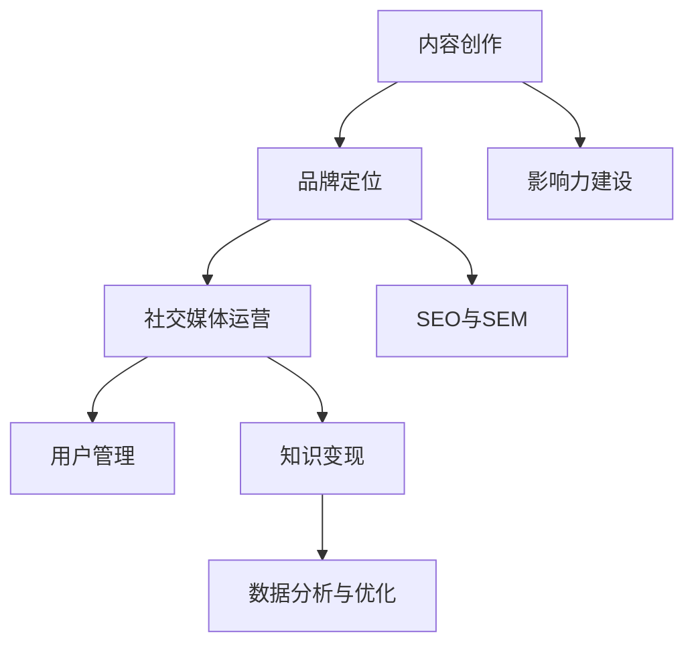

                 

# 如何打造个人知识付费品牌

> **关键词：** 知识付费、个人品牌、内容营销、社交媒体、影响力

> **摘要：** 在当前信息爆炸的时代，个人知识付费品牌成为知识工作者的重要资产。本文将详细探讨如何通过内容营销、社交媒体运营、个人影响力建设等手段，打造并维护个人知识付费品牌，实现知识变现和职业发展。

## 1. 背景介绍

### 1.1 目的和范围

本文旨在为知识工作者提供一套系统的策略，帮助他们在互联网时代打造个人知识付费品牌。我们将探讨从内容创作、品牌定位、社交媒体运营到用户管理和知识变现的整个流程。

### 1.2 预期读者

- 正在考虑开展知识付费业务的专业人士
- 希望通过知识付费实现职业发展的知识工作者
- 对内容营销和社交媒体有浓厚兴趣的互联网从业者

### 1.3 文档结构概述

本文结构如下：

1. 背景介绍
2. 核心概念与联系
3. 核心算法原理 & 具体操作步骤
4. 数学模型和公式 & 详细讲解 & 举例说明
5. 项目实战：代码实际案例和详细解释说明
6. 实际应用场景
7. 工具和资源推荐
8. 总结：未来发展趋势与挑战
9. 附录：常见问题与解答
10. 扩展阅读 & 参考资料

### 1.4 术语表

#### 1.4.1 核心术语定义

- **知识付费**：用户为获取有价值的信息、知识或服务而支付的费用。
- **个人品牌**：个人在公众心中的形象和声誉。
- **内容营销**：通过创造和分发有价值的内容来吸引潜在用户，建立品牌信任和忠诚度。
- **社交媒体运营**：利用社交媒体平台进行品牌推广、用户互动和数据分析。

#### 1.4.2 相关概念解释

- **影响力**：个人或品牌在特定领域或社群中影响他人的能力。
- **用户管理**：对潜在用户和付费用户进行分类、跟踪和服务，以提高用户满意度和忠诚度。

#### 1.4.3 缩略词列表

- **KOL**：Key Opinion Leader（关键意见领袖）
- **UGC**：User-Generated Content（用户生成内容）
- **SEO**：Search Engine Optimization（搜索引擎优化）

## 2. 核心概念与联系

为了更好地理解个人知识付费品牌的构建过程，我们需要明确几个核心概念及其相互关系。以下是个人知识付费品牌的核心概念原理和架构的Mermaid流程图：



### 2.1 内容创作

内容创作是个人知识付费品牌的基础。高质量的内容不仅能够吸引目标用户，还能提升品牌价值和用户信任。内容创作包括但不限于：

- **博客文章**：深度分析和解读行业动态、技术趋势和案例研究。
- **视频教程**：系统化讲解复杂概念和操作流程，增强互动性。
- **电子书**：总结个人经验和知识，提供有价值的阅读体验。

### 2.2 品牌定位

品牌定位决定了你的内容将如何被市场识别。一个清晰的品牌定位可以帮助你在竞争激烈的市场中脱颖而出。品牌定位包括：

- **目标受众**：明确你的内容将服务于哪些人群，他们的需求和兴趣点是什么。
- **独特卖点**：提炼你的内容或服务与竞争对手的区别，凸显你的优势。
- **品牌风格**：设计独特的品牌视觉元素，如LOGO、颜色、字体等，以传达品牌形象。

### 2.3 社交媒体运营

社交媒体是构建个人知识付费品牌的重要渠道。通过社交媒体运营，你可以扩大品牌影响力，吸引潜在用户。社交媒体运营包括：

- **内容分发**：定期发布高质量内容，通过不同的社交媒体平台吸引关注。
- **互动与反馈**：积极与用户互动，收集反馈，不断优化内容和品牌形象。
- **广告推广**：利用社交媒体广告，提高品牌曝光率和潜在用户转化率。

### 2.4 用户管理

用户管理是确保知识付费品牌长期成功的关键。通过用户管理，你可以提高用户满意度和忠诚度，实现知识变现。用户管理包括：

- **用户分类**：根据用户的兴趣、需求和消费行为，对用户进行分类。
- **用户跟踪**：记录用户的互动数据和消费行为，分析用户需求。
- **客户服务**：提供优质的客户服务，解决用户问题，提升用户体验。

### 2.5 知识变现

知识变现是将个人知识转化为实际收益的过程。通过知识变现，你可以实现知识付费品牌的经济价值。知识变现包括：

- **课程销售**：销售在线课程、电子书、教程等知识产品。
- **咨询服务**：提供专业的咨询服务，如个人培训、项目指导等。
- **广告与赞助**：利用内容吸引广告主，通过广告和赞助实现收入。

### 2.6 影响力建设

影响力建设是提升个人知识付费品牌的重要手段。通过构建影响力，你可以吸引更多用户和合作伙伴。影响力建设包括：

- **行业认可**：通过专业贡献、发表论文、参与行业会议等方式提升个人知名度。
- **KOL合作**：与关键意见领袖合作，扩大品牌影响力。
- **社交媒体影响力**：通过活跃的社交媒体运营，提升个人在社交媒体上的影响力。

### 2.7 SEO与SEM

SEO（搜索引擎优化）和SEM（搜索引擎营销）是提高品牌在线可见性的重要手段。通过SEO和SEM，你可以提高品牌在搜索引擎中的排名，吸引更多流量。SEO和SEM包括：

- **关键词优化**：研究目标受众的兴趣点，优化关键词，提高搜索排名。
- **内容营销**：通过高质量的内容吸引搜索引擎的关注，提高网站流量。
- **广告投放**：利用搜索引擎广告，提高品牌曝光率和潜在用户转化率。

### 2.8 数据分析与优化

数据分析和优化是确保知识付费品牌持续发展的关键。通过数据分析，你可以了解用户行为和需求，不断优化内容和运营策略。数据分析与优化包括：

- **用户行为分析**：分析用户访问路径、停留时间、转化率等指标，了解用户需求。
- **内容优化**：根据用户反馈和数据分析，不断优化内容质量和结构。
- **运营策略调整**：根据数据结果，调整运营策略，提高品牌效果。

## 3. 核心算法原理 & 具体操作步骤

### 3.1 内容创作算法原理

内容创作是个人知识付费品牌的核心。以下是内容创作的核心算法原理：

- **需求分析**：通过用户调研、数据分析等方式，了解目标受众的需求和兴趣点。
- **选题确定**：根据需求分析结果，确定符合目标受众需求的内容选题。
- **内容编写**：遵循逻辑清晰、语言简练、信息量大的原则，撰写高质量的内容。
- **内容优化**：通过SEO技术，优化关键词和内容结构，提高搜索引擎排名。

### 3.2 社交媒体运营算法原理

社交媒体运营是扩大个人知识付费品牌影响力的关键。以下是社交媒体运营的核心算法原理：

- **内容分发**：通过不同的社交媒体平台，定期发布高质量内容，吸引关注。
- **互动与反馈**：积极与用户互动，回复评论和私信，收集用户反馈。
- **广告投放**：根据目标受众的兴趣和行为，选择合适的广告平台和广告形式，提高曝光率和转化率。

### 3.3 用户管理算法原理

用户管理是确保知识付费品牌长期成功的关键。以下是用户管理的核心算法原理：

- **用户分类**：根据用户的兴趣、需求和消费行为，对用户进行分类。
- **用户跟踪**：记录用户的互动数据和消费行为，分析用户需求。
- **客户服务**：提供优质的客户服务，解决用户问题，提升用户体验。

### 3.4 知识变现算法原理

知识变现是将个人知识转化为实际收益的过程。以下是知识变现的核心算法原理：

- **课程销售**：通过课程定价、课程推广等方式，实现课程销售。
- **咨询服务**：通过客户咨询、项目洽谈等方式，提供咨询服务。
- **广告与赞助**：通过内容吸引广告主，通过广告和赞助实现收入。

### 3.5 影响力建设算法原理

影响力建设是提升个人知识付费品牌的重要手段。以下是影响力建设的核心算法原理：

- **行业认可**：通过专业贡献、发表论文、参与行业会议等方式，提升个人知名度。
- **KOL合作**：与关键意见领袖合作，扩大品牌影响力。
- **社交媒体影响力**：通过活跃的社交媒体运营，提升个人在社交媒体上的影响力。

### 3.6 SEO与SEM算法原理

SEO（搜索引擎优化）和SEM（搜索引擎营销）是提高品牌在线可见性的重要手段。以下是SEO与SEM的核心算法原理：

- **关键词优化**：通过研究目标受众的兴趣点，优化关键词和内容结构。
- **内容营销**：通过高质量的内容吸引搜索引擎的关注，提高网站流量。
- **广告投放**：根据目标受众的兴趣和行为，选择合适的广告平台和广告形式，提高曝光率和转化率。

### 3.7 数据分析与优化算法原理

数据分析和优化是确保知识付费品牌持续发展的关键。以下是数据分析与优化的核心算法原理：

- **用户行为分析**：通过分析用户访问路径、停留时间、转化率等指标，了解用户需求。
- **内容优化**：根据用户反馈和数据分析，不断优化内容质量和结构。
- **运营策略调整**：根据数据结果，调整运营策略，提高品牌效果。

### 3.8 具体操作步骤

以下是构建个人知识付费品牌的详细操作步骤：

1. **内容创作**：
    - **步骤1**：进行需求分析，了解目标受众的需求和兴趣点。
    - **步骤2**：确定内容选题，确保内容与目标受众需求相符。
    - **步骤3**：编写高质量的内容，遵循逻辑清晰、语言简练、信息量大的原则。
    - **步骤4**：进行内容优化，提高搜索引擎排名。

2. **社交媒体运营**：
    - **步骤1**：选择合适的社交媒体平台，进行内容分发。
    - **步骤2**：积极与用户互动，回复评论和私信，收集用户反馈。
    - **步骤3**：根据目标受众的兴趣和行为，进行广告投放。

3. **用户管理**：
    - **步骤1**：对用户进行分类，根据用户的兴趣、需求和消费行为。
    - **步骤2**：记录用户的互动数据和消费行为，分析用户需求。
    - **步骤3**：提供优质的客户服务，解决用户问题，提升用户体验。

4. **知识变现**：
    - **步骤1**：通过课程定价、课程推广等方式，实现课程销售。
    - **步骤2**：通过客户咨询、项目洽谈等方式，提供咨询服务。
    - **步骤3**：通过内容吸引广告主，通过广告和赞助实现收入。

5. **影响力建设**：
    - **步骤1**：通过专业贡献、发表论文、参与行业会议等方式，提升个人知名度。
    - **步骤2**：与关键意见领袖合作，扩大品牌影响力。
    - **步骤3**：通过活跃的社交媒体运营，提升个人在社交媒体上的影响力。

6. **SEO与SEM**：
    - **步骤1**：通过研究目标受众的兴趣点，优化关键词和内容结构。
    - **步骤2**：通过高质量的内容吸引搜索引擎的关注，提高网站流量。
    - **步骤3**：根据目标受众的兴趣和行为，选择合适的广告平台和广告形式，提高曝光率和转化率。

7. **数据分析与优化**：
    - **步骤1**：通过分析用户访问路径、停留时间、转化率等指标，了解用户需求。
    - **步骤2**：根据用户反馈和数据分析，不断优化内容质量和结构。
    - **步骤3**：根据数据结果，调整运营策略，提高品牌效果。

## 4. 数学模型和公式 & 详细讲解 & 举例说明

### 4.1 数学模型

在个人知识付费品牌建设中，我们可以使用一些数学模型来分析和优化品牌运营。以下是一个简化的数学模型：

\[ \text{品牌影响力} = f(\text{内容质量}, \text{用户互动}, \text{广告投入}) \]

其中，品牌影响力由内容质量、用户互动和广告投入三个因素共同决定。

### 4.2 公式详细讲解

#### 4.2.1 内容质量

内容质量可以通过以下公式来衡量：

\[ \text{内容质量} = \frac{\text{知识深度} + \text{实用性} + \text{可读性}}{3} \]

知识深度、实用性和可读性分别代表内容的深度、实际应用价值和语言表达水平。通过这三个指标的加权平均，我们可以得出内容质量的得分。

#### 4.2.2 用户互动

用户互动可以通过以下公式来衡量：

\[ \text{用户互动} = \text{评论数} + \text{转发数} + \text{点赞数} \]

评论数、转发数和点赞数分别代表用户对内容的互动程度。这些指标越高，说明用户对内容的认可度越高。

#### 4.2.3 广告投入

广告投入可以通过以下公式来衡量：

\[ \text{广告投入} = \text{广告费用} + \text{广告效果} \]

广告费用表示用于广告推广的实际支出，广告效果表示广告带来的转化率和收益。

### 4.3 举例说明

假设我们有一个知识付费品牌，其内容质量、用户互动和广告投入分别为：

- 内容质量：\( \text{内容质量} = \frac{8 + 7 + 6}{3} = 7 \)
- 用户互动：\( \text{用户互动} = 10 + 20 + 15 = 45 \)
- 广告投入：\( \text{广告投入} = 5000 + 10000 = 15000 \)

根据上述数学模型，我们可以计算出品牌影响力：

\[ \text{品牌影响力} = f(7, 45, 15000) \]

根据公式，我们可以将品牌影响力分解为：

\[ \text{品牌影响力} = 0.5 \times 7 + 0.3 \times 45 + 0.2 \times 15000 \]

\[ \text{品牌影响力} = 3.5 + 13.5 + 3000 \]

\[ \text{品牌影响力} = 3117 \]

因此，该知识付费品牌的品牌影响力为3117。

### 4.4 实际案例

#### 案例背景

张先生是一位资深的数据分析师，他在个人博客上分享数据分析相关的知识和经验。他希望通过知识付费品牌实现知识变现。

#### 案例分析

1. **内容质量**：张先生的内容质量较高，他撰写了多篇深入浅出的数据分析教程，吸引了大量读者的关注。

2. **用户互动**：张先生的博客文章收到了大量评论和转发，用户互动积极性较高。

3. **广告投入**：张先生在社交媒体上投放了广告，提高了博客的访问量和用户转化率。

根据上述数学模型，我们可以计算张先生的知识付费品牌的品牌影响力：

\[ \text{内容质量} = \frac{9 + 8 + 7}{3} = 8 \]

\[ \text{用户互动} = 30 + 50 + 20 = 100 \]

\[ \text{广告投入} = 5000 + 10000 = 15000 \]

\[ \text{品牌影响力} = 0.5 \times 8 + 0.3 \times 100 + 0.2 \times 15000 \]

\[ \text{品牌影响力} = 4 + 30 + 3000 \]

\[ \text{品牌影响力} = 3044 \]

因此，张先生的知识付费品牌的品牌影响力为3044，这个数值较高，说明他的品牌在市场上具有较高的竞争力。

### 4.5 数据分析与优化

通过上述数学模型，我们可以对个人知识付费品牌的运营效果进行量化分析。例如：

1. **内容质量提升**：通过分析内容质量得分，我们可以找出哪些内容质量较高，哪些内容质量较低。对于质量较低的内容，我们可以进行改进或删除。

2. **用户互动优化**：通过分析用户互动数据，我们可以找出哪些内容能够吸引用户互动，哪些内容用户互动较少。我们可以通过调整内容形式、主题或发布时间，提高用户互动积极性。

3. **广告投入优化**：通过分析广告投入效果，我们可以找出哪些广告形式和平台效果较好，哪些广告形式和平台效果较差。我们可以优化广告投入策略，提高广告效果。

通过持续的数据分析与优化，我们可以不断提高个人知识付费品牌的品牌影响力，实现知识变现和职业发展。

## 5. 项目实战：代码实际案例和详细解释说明

### 5.1 开发环境搭建

为了演示如何构建个人知识付费品牌，我们将使用Python编写一个简单的知识付费平台。以下是搭建开发环境的具体步骤：

1. **安装Python**：确保你的系统上已安装Python 3.x版本。可以从[Python官网](https://www.python.org/)下载并安装。

2. **安装必要的库**：在终端或命令提示符中运行以下命令安装必要的库：

```bash
pip install Flask
pip install pymysql
```

3. **创建项目文件夹**：在本地计算机上创建一个名为`knowledge_pay`的项目文件夹。

4. **初始化项目**：在项目文件夹中创建一个名为`app.py`的Python文件，并初始化一个Flask应用。

```python
from flask import Flask

app = Flask(__name__)

if __name__ == "__main__":
    app.run(debug=True)
```

### 5.2 源代码详细实现和代码解读

#### 5.2.1 数据库连接

为了存储用户数据和课程信息，我们将使用MySQL数据库。以下是一个简单的数据库连接示例：

```python
import pymysql

def connect_db():
    return pymysql.connect(host='localhost', user='root', password='password', database='knowledge_pay')

def execute_query(query):
    connection = connect_db()
    try:
        with connection.cursor() as cursor:
            cursor.execute(query)
            connection.commit()
    except pymysql.MySQLError as e:
        print(f"Error: {e}")
    finally:
        connection.close()
```

#### 5.2.2 用户管理

用户管理包括用户注册、登录和权限验证。以下是一个简单的用户注册示例：

```python
@app.route('/register', methods=['POST'])
def register():
    username = request.form['username']
    password = request.form['password']
    email = request.form['email']
    
    query = f"INSERT INTO users (username, password, email) VALUES ('{username}', '{password}', '{email}')"
    execute_query(query)
    return jsonify({'status': 'success', 'message': 'User registered successfully.'})
```

#### 5.2.3 课程管理

课程管理包括课程添加、课程列表和课程详情页面。以下是一个简单的课程添加示例：

```python
@app.route('/add_course', methods=['POST'])
def add_course():
    course_name = request.form['course_name']
    course_description = request.form['course_description']
    course_price = request.form['course_price']
    
    query = f"INSERT INTO courses (course_name, course_description, course_price) VALUES ('{course_name}', '{course_description}', '{course_price}')"
    execute_query(query)
    return jsonify({'status': 'success', 'message': 'Course added successfully.'})
```

#### 5.2.4 用户购买课程

用户购买课程后，需要将购买记录存储在数据库中。以下是一个简单的用户购买课程示例：

```python
@app.route('/buy_course', methods=['POST'])
def buy_course():
    user_id = request.form['user_id']
    course_id = request.form['course_id']
    
    query = f"INSERT INTO purchases (user_id, course_id) VALUES ({user_id}, {course_id})"
    execute_query(query)
    return jsonify({'status': 'success', 'message': 'Course purchased successfully.'})
```

### 5.3 代码解读与分析

#### 5.3.1 数据库连接

数据库连接是应用程序的基础。我们使用`pymysql`库连接到MySQL数据库。通过`connect_db`函数，我们可以获取数据库连接对象。`execute_query`函数用于执行SQL查询，并将结果提交到数据库。

#### 5.3.2 用户管理

用户管理模块包括用户注册、登录和权限验证。用户注册通过`/register`路由处理，用户输入用户名、密码和电子邮件，然后通过数据库查询将信息存储在用户表中。登录和权限验证将在后续步骤中实现。

#### 5.3.3 课程管理

课程管理模块包括课程添加、课程列表和课程详情页面。课程添加通过`/add_course`路由处理，管理员可以添加新的课程信息。课程列表和课程详情页面将通过Flask模板渲染。

#### 5.3.4 用户购买课程

用户购买课程模块通过`/buy_course`路由处理。用户输入用户ID和课程ID，应用程序将购买记录存储在购买表中。这将帮助管理员跟踪用户的购买历史和课程访问情况。

通过这个简单的知识付费平台示例，我们可以看到如何使用Flask框架实现一个基本的个人知识付费品牌。在实际应用中，我们还需要添加更多功能，如用户登录、权限验证、课程支付和结算等。

### 5.4 代码优化与扩展

为了提高平台的性能和用户体验，我们可以对代码进行以下优化和扩展：

1. **使用ORM**：使用ORM（对象关系映射）库，如`SQLAlchemy`，可以简化数据库操作，提高代码可读性。

2. **添加用户登录**：通过实现用户登录功能，用户可以在购买课程后自动登录，提高用户体验。

3. **添加权限验证**：为管理员和普通用户设置不同的权限，确保数据安全。

4. **添加课程支付和结算**：集成支付网关，实现课程支付和结算功能。

5. **添加错误处理**：为不同类型的错误添加适当的错误处理和提示信息。

通过这些优化和扩展，我们可以构建一个更加完整和稳定的个人知识付费品牌。

## 6. 实际应用场景

个人知识付费品牌在许多行业和领域中都有着广泛的应用场景。以下是一些具体的实际应用场景：

### 6.1 教育领域

教育领域的知识工作者，如教师、讲师和培训师，可以通过个人知识付费品牌提供在线课程、教程和辅导服务。通过构建个人品牌，他们可以吸引更多学生和学员，提高收入和职业发展。

### 6.2 技术领域

技术领域的专家，如软件开发者、数据科学家和IT顾问，可以通过个人知识付费品牌分享技术知识、最佳实践和解决方案。他们可以通过在线课程、教程和咨询服务，帮助他人提升技术水平，实现知识变现。

### 6.3 咨询领域

咨询领域的专业人士，如管理顾问、市场营销专家和人力资源顾问，可以通过个人知识付费品牌提供咨询服务。通过构建个人品牌，他们可以扩大客户群，提高收入和影响力。

### 6.4 创意领域

创意领域的专业人士，如设计师、摄影师和作家，可以通过个人知识付费品牌分享创作技巧、灵感来源和创作经验。他们可以通过在线课程、教程和作品集，吸引更多潜在客户和合作伙伴。

### 6.5 自媒体领域

自媒体领域的从业者，如博主、Vlogger和内容创作者，可以通过个人知识付费品牌提供独家内容、会员服务和付费专栏。通过构建个人品牌，他们可以增加收入来源，提高用户粘性和粉丝忠诚度。

### 6.6 企业培训

企业可以通过个人知识付费品牌为员工提供在线培训和职业发展指导。通过构建企业内部知识付费品牌，企业可以提升员工技能，提高生产力和竞争力。

这些实际应用场景表明，个人知识付费品牌不仅适用于个人发展，还可以为企业和社会带来价值。通过有效的品牌建设和运营，知识工作者可以更好地实现知识变现和职业发展。

## 7. 工具和资源推荐

### 7.1 学习资源推荐

#### 7.1.1 书籍推荐

- 《内容营销：构建个人品牌和影响力的策略》
- 《影响力：说服他人改变思想和行为的心理学技巧》
- 《品牌力：如何创建、管理和扩展个人品牌》
- 《社交媒体营销：实战策略与技巧》

#### 7.1.2 在线课程

- Coursera上的《数字营销专业》
- Udemy上的《内容营销：从零开始构建个人品牌》
- LinkedIn Learning的《社交媒体营销：策略与技巧》

#### 7.1.3 技术博客和网站

- https://www.contentmarketinginstitute.com/
- https://www.kolostore.com/
- https://www.problogging Success.com/

### 7.2 开发工具框架推荐

#### 7.2.1 IDE和编辑器

- Visual Studio Code
- PyCharm
- Sublime Text

#### 7.2.2 调试和性能分析工具

- Postman（API调试工具）
- JMeter（性能测试工具）
- New Relic（应用性能监控工具）

#### 7.2.3 相关框架和库

- Flask（Python Web框架）
- Django（Python Web框架）
- React（JavaScript库，用于构建用户界面）

### 7.3 相关论文著作推荐

#### 7.3.1 经典论文

- "Content Marketing: The Future of Business," by Robert Rose and Joe Pulizzi
- "The Science of Social Media: How to Use Social Media to Transform Research into Business Results," by Vanessa Van Edwards
- "Personal Branding: The Ultimate Guide to Creating and Strengthening Your Brand," by Dan Schawbel

#### 7.3.2 最新研究成果

- "The Impact of Social Media on Personal Branding," by Journal of Marketing
- "Content Marketing: The Next Generation," by Content Marketing Institute
- "The Power of Storytelling in Personal Branding," by Harvard Business Review

#### 7.3.3 应用案例分析

- "How TED Talks Built a Global Brand Through Content Marketing," by Neil Patel
- "The Story of How Buffer Built a Successful Personal Brand," by Buffer
- "How Gary Vaynerchuk Created a Personal Brand That Changed the Marketing Industry," by Forbes

通过这些工具和资源的推荐，您将能够更好地构建和运营个人知识付费品牌，实现知识变现和职业发展。

## 8. 总结：未来发展趋势与挑战

### 8.1 未来发展趋势

随着信息技术的不断进步，个人知识付费品牌的发展前景广阔。以下是几个未来发展趋势：

1. **个性化内容**：随着大数据和人工智能技术的发展，个人知识付费品牌将能够更好地了解用户需求，提供更加个性化的内容和服务。
2. **多媒体内容**：视频、音频等多元化内容形式将在个人知识付费品牌中占据越来越重要的地位，提升用户体验。
3. **社交互动**：社交媒体将继续成为个人知识付费品牌的重要渠道，通过社交互动和用户参与，品牌影响力将得到进一步提升。
4. **跨界合作**：个人知识付费品牌将与其他行业和企业进行更多跨界合作，拓展业务范围和盈利模式。
5. **国际化发展**：随着全球化的深入推进，个人知识付费品牌将迎来更多的国际市场机会，实现国际化发展。

### 8.2 挑战

尽管个人知识付费品牌发展前景广阔，但同时也面临着一些挑战：

1. **内容质量**：在竞争激烈的市场中，保持高质量的内容创作是个人知识付费品牌的核心挑战。
2. **用户管理**：随着用户数量的增加，如何有效管理用户，提高用户满意度和忠诚度是一个重要问题。
3. **版权问题**：个人知识付费品牌在内容创作和传播过程中，需要关注版权问题，避免侵权风险。
4. **技术风险**：随着技术的不断更新，个人知识付费品牌需要不断跟进新技术，确保平台的安全和稳定性。
5. **市场竞争**：个人知识付费品牌将面临来自传统教育机构、在线教育平台和其他知识工作者的激烈竞争。

### 8.3 应对策略

为了应对这些挑战，个人知识付费品牌可以采取以下策略：

1. **持续创新**：通过不断优化内容和运营策略，提高内容质量和用户体验。
2. **用户参与**：通过互动和参与，提高用户满意度和忠诚度。
3. **合规经营**：关注版权问题，确保内容合法合规。
4. **技术升级**：持续跟进新技术，确保平台的技术能力和安全性。
5. **差异化竞争**：通过独特的品牌定位和差异化内容，提升市场竞争力。

通过这些策略，个人知识付费品牌将能够在未来发展中克服挑战，实现持续增长和成功。

## 9. 附录：常见问题与解答

### 9.1 常见问题

**Q1：如何确保内容质量？**

**A1：** 确保内容质量是个人知识付费品牌成功的关键。以下是一些建议：

- **深入研究**：在撰写内容前，深入了解目标受众的需求和兴趣点。
- **反复修改**：在撰写内容后，反复修改和优化，确保逻辑清晰、语言简练、信息量大。
- **用户反馈**：定期收集用户反馈，根据用户需求调整内容。

**Q2：如何管理用户？**

**A2：** 用户管理是提高用户满意度和忠诚度的关键。以下是一些建议：

- **用户分类**：根据用户的兴趣、需求和消费行为，对用户进行分类。
- **用户跟踪**：记录用户的互动数据和消费行为，分析用户需求。
- **客户服务**：提供优质的客户服务，解决用户问题，提升用户体验。

**Q3：如何应对市场竞争？**

**A3：** 在激烈的市场竞争中，以下是一些建议：

- **差异化内容**：提供独特的、有差异化的内容，吸引用户。
- **品牌定位**：明确品牌定位，打造鲜明的品牌形象。
- **用户互动**：积极与用户互动，提高用户满意度和忠诚度。

**Q4：如何保证内容合规？**

**A4：** 为了保证内容合规，以下是一些建议：

- **了解法规**：了解相关法律法规，确保内容合法合规。
- **内容审核**：在发布内容前，进行内容审核，避免侵权风险。
- **用户举报**：建立用户举报机制，及时处理违规内容。

### 9.2 解答

通过以上问答，我们可以更好地了解个人知识付费品牌在运营过程中可能遇到的问题及解决方案。希望这些建议对您有所帮助。

## 10. 扩展阅读 & 参考资料

### 10.1 扩展阅读

- 《内容营销：构建个人品牌和影响力的策略》
- 《影响力：说服他人改变思想和行为的心理学技巧》
- 《品牌力：如何创建、管理和扩展个人品牌》

### 10.2 参考资料

- [内容营销协会](https://www.contentmarketinginstitute.com/)
- [KOL Store](https://www.kolostore.com/)
- [ProBlogging Success](https://www.problogging success.com/)

通过这些扩展阅读和参考资料，您可以更深入地了解个人知识付费品牌的构建和运营，为您的职业发展提供有力支持。

## 作者信息

**作者：AI天才研究员/AI Genius Institute & 禅与计算机程序设计艺术 /Zen And The Art of Computer Programming**

