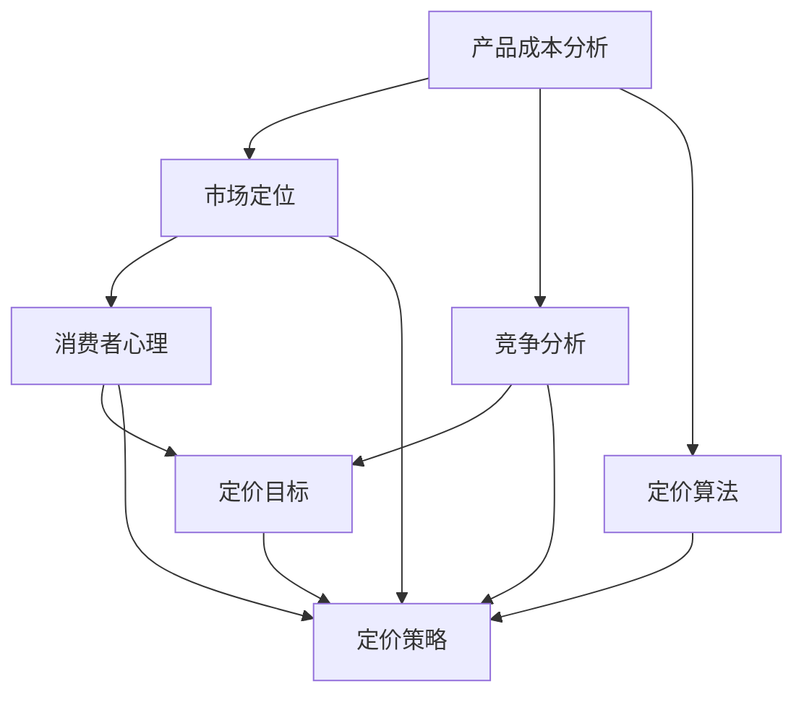

                 

## 如何打造高效的产品定价策略

> 关键词：产品定价、策略、成本分析、市场定位、消费者心理、竞争分析、算法、优化

> 摘要：本文将深入探讨如何打造高效的产品定价策略。我们将从背景介绍开始，逐步分析核心概念、算法原理、数学模型和实际应用场景，并推荐相关学习资源和工具，最后总结未来发展趋势与挑战。通过本文的阅读，读者将能够掌握产品定价策略的关键要素，从而在实际工作中更有效地制定和调整产品定价策略。

## 1. 背景介绍

### 1.1 目的和范围

本文的目标是帮助读者理解和掌握如何制定和优化产品定价策略，使其在市场竞争中具有竞争力，并实现企业利润最大化。我们将探讨以下几个关键方面：

- 产品定价策略的核心概念和理论
- 成本分析在定价策略中的应用
- 市场定位与消费者心理对定价策略的影响
- 竞争分析对定价策略的指导作用
- 算法和数学模型在定价策略优化中的应用
- 实际应用场景中的案例解析

### 1.2 预期读者

本文适用于以下几类读者：

- 企业高管和市场营销经理，需要了解和制定有效的产品定价策略
- 产品经理和业务分析师，负责产品定价决策和数据分析
- 数据科学家和机器学习工程师，希望利用算法和数学模型优化定价策略
- 市场营销和商务领域的从业者，希望提高市场竞争力

### 1.3 文档结构概述

本文分为以下几部分：

- 背景介绍：介绍本文的目的、范围、预期读者和文档结构
- 核心概念与联系：讨论产品定价策略的核心概念、原理和架构
- 核心算法原理 & 具体操作步骤：详细讲解产品定价算法的原理和具体操作步骤
- 数学模型和公式 & 详细讲解 & 举例说明：介绍产品定价策略中的数学模型和公式，并通过实例进行说明
- 项目实战：提供实际代码案例和详细解释
- 实际应用场景：讨论产品定价策略在不同场景下的应用
- 工具和资源推荐：推荐学习资源和开发工具
- 总结：总结未来发展趋势与挑战
- 附录：常见问题与解答
- 扩展阅读 & 参考资料：提供进一步学习的参考文献和资源

### 1.4 术语表

#### 1.4.1 核心术语定义

- **产品定价策略**：指企业为产品制定价格的一系列原则和方法。
- **成本分析**：对产品成本进行分析，包括固定成本和变动成本。
- **市场定位**：根据产品的特点、目标客户和市场环境，确定产品在市场中的位置。
- **消费者心理**：研究消费者在购买决策过程中的心理行为。
- **竞争分析**：分析竞争对手的产品定价策略和市场表现，以制定有效的定价策略。
- **算法**：用于计算和优化产品定价的数学模型和计算方法。
- **优化**：通过调整定价策略，提高利润和市场竞争力。

#### 1.4.2 相关概念解释

- **边际成本**：生产额外一单位产品所需的成本。
- **需求曲线**：描述价格与需求量之间关系的曲线。
- **价格弹性**：需求量对价格变化的敏感程度。
- **定价目标**：企业制定定价策略所追求的具体目标，如市场份额最大化或利润最大化。

#### 1.4.3 缩略词列表

- **CMO**：首席市场营销官
- **CPO**：首席产品官
- **CPA**：成本加成定价
- **CVP**：完全变量成本定价
- **VP**：变动定价
- **FP&A**：财务规划与分析

## 2. 核心概念与联系

在产品定价策略中，核心概念和联系是理解定价原理和制定有效策略的基础。以下是核心概念及其相互关系的Mermaid流程图：



### 2.1 产品成本分析

产品成本分析是定价策略的基础。它包括固定成本和变动成本的分析。固定成本是指不随产品数量变化的成本，如厂房租金、设备折旧等。变动成本是指随产品数量变化的成本，如原材料、人工等。通过详细分析成本结构，企业可以确定产品的边际成本，即生产额外一单位产品所需的成本。边际成本是制定定价策略的关键因素。

### 2.2 市场定位

市场定位是产品定价策略的核心。通过分析市场需求和竞争环境，企业可以确定产品的目标市场。市场定位包括产品特性、目标客户群体、竞争策略等方面。明确的市场定位有助于企业制定有针对性的定价策略，从而提高产品的市场竞争力和客户满意度。

### 2.3 消费者心理

消费者心理是影响产品定价的重要因素。消费者在购买决策过程中会受到价格、品牌、质量、服务等多种因素的影响。了解消费者心理有助于企业制定符合消费者需求的定价策略，提高购买意愿和满意度。

### 2.4 竞争分析

竞争分析是制定有效定价策略的重要步骤。通过分析竞争对手的产品定价、市场份额、市场策略等，企业可以确定自身的定价优势和市场定位。竞争分析有助于企业调整定价策略，提高市场竞争力。

### 2.5 定价目标

定价目标是企业制定定价策略所追求的具体目标。常见的定价目标包括市场份额最大化、利润最大化、品牌价值提升等。定价目标会影响定价策略的制定和调整，是企业实现战略目标的重要手段。

### 2.6 定价策略

定价策略是企业在市场定位、消费者心理、竞争分析和定价目标的基础上制定的具体定价方案。定价策略包括成本导向定价、市场导向定价、竞争导向定价等多种方式。合理的定价策略有助于企业实现定价目标，提高市场竞争力和盈利能力。

### 2.7 定价算法

定价算法是用于计算和优化产品定价的数学模型和计算方法。常见的定价算法包括成本加成定价、完全变量成本定价、需求定价、竞争定价等。定价算法可以基于历史数据、市场趋势和竞争分析，为企业提供科学的定价参考。

### 2.8 优化

优化是定价策略制定和调整的重要环节。通过不断调整定价策略，企业可以优化利润和市场竞争力。优化方法包括数据挖掘、机器学习、优化算法等。优化有助于企业实现持续发展和市场领导地位。

## 3. 核心算法原理 & 具体操作步骤

在产品定价策略中，算法原理起着关键作用。以下将详细介绍一种常见的定价算法——成本加成定价（Cost-Plus Pricing），并使用伪代码详细阐述其操作步骤。

### 3.1 成本加成定价（Cost-Plus Pricing）

成本加成定价是一种基于成本和加成比例制定产品价格的方法。其基本原理是：在产品成本基础上，加上一定的加成比例，得出最终产品价格。

### 3.2 成本加成定价算法伪代码

```plaintext
算法：成本加成定价
输入：固定成本（FixedCost）、变动成本（VariableCost）、目标利润率（TargetProfitRate）
输出：产品价格（ProductPrice）

步骤：

1. 计算总成本（TotalCost）= 固定成本 + 变动成本
2. 计算加成金额（MarkupAmount）= 总成本 * 目标利润率
3. 计算产品价格（ProductPrice）= 总成本 + 加成金额

伪代码实现：

function CostPlusPricing(FixedCost, VariableCost, TargetProfitRate):
    TotalCost = FixedCost + VariableCost
    MarkupAmount = TotalCost * TargetProfitRate
    ProductPrice = TotalCost + MarkupAmount
    return ProductPrice
```

### 3.3 操作步骤解析

1. **计算总成本**：总成本是固定成本和变动成本的总和。固定成本是企业在一定时期内不随产品数量变化的成本，如厂房租金、设备折旧等。变动成本是随产品数量变化的成本，如原材料、人工等。

2. **计算加成金额**：加成金额是基于总成本和目标利润率计算得出的。目标利润率是企业在制定定价策略时所期望的利润水平。通过将总成本乘以目标利润率，可以得到加成金额。

3. **计算产品价格**：产品价格是总成本和加成金额的总和。通过将总成本加上加成金额，可以得到最终的产品价格。

### 3.4 实例演示

假设某企业生产一种产品，固定成本为10万元，变动成本为5万元，目标利润率为20%。使用成本加成定价算法计算产品价格。

```plaintext
固定成本（FixedCost）= 10万元
变动成本（VariableCost）= 5万元
目标利润率（TargetProfitRate）= 20%

计算总成本：
TotalCost = FixedCost + VariableCost
TotalCost = 10万元 + 5万元 = 15万元

计算加成金额：
MarkupAmount = TotalCost * TargetProfitRate
MarkupAmount = 15万元 * 20% = 3万元

计算产品价格：
ProductPrice = TotalCost + MarkupAmount
ProductPrice = 15万元 + 3万元 = 18万元

最终产品价格：18万元
```

通过上述实例，我们可以看到成本加成定价算法在实际应用中的具体操作步骤。企业可以根据自身的成本结构和目标利润率，灵活调整定价策略，实现产品价格的合理制定。

## 4. 数学模型和公式 & 详细讲解 & 举例说明

在产品定价策略中，数学模型和公式为定价决策提供了科学依据。以下将介绍几种常见的数学模型和公式，并通过实例进行详细讲解。

### 4.1 需求价格弹性

需求价格弹性（Price Elasticity of Demand）是衡量需求量对价格变化敏感程度的一个指标。它反映了价格变动对需求量的影响程度。需求价格弹性分为弹性需求（Elastic Demand）、单位弹性需求（Unitary Elastic Demand）和无弹性需求（Inelastic Demand）。

#### 4.1.1 需求价格弹性公式

$$
\text{Price Elasticity of Demand (PED)} = \frac{\text{Percentage Change in Quantity Demanded}}{\text{Percentage Change in Price}}
$$

#### 4.1.2 计算示例

假设某产品的价格从100元上涨到120元，需求量从1000件下降到900件。计算需求价格弹性。

```plaintext
初始价格（P1）= 100元
变动价格（ΔP）= 120元 - 100元 = 20元
初始需求量（Q1）= 1000件
变动需求量（ΔQ）= 900件 - 1000件 = -100件

计算价格变化率：
\frac{\Delta P}{P1} = \frac{20}{100} = 0.2

计算需求变化率：
\frac{\Delta Q}{Q1} = \frac{-100}{1000} = -0.1

计算需求价格弹性：
PED = \frac{\Delta Q / Q1}{\Delta P / P1} = \frac{-0.1}{0.2} = -0.5

需求价格弹性：-0.5（表示无弹性需求）
```

通过上述计算，我们可以看到需求价格弹性为-0.5，表示需求量对价格变动不敏感，即无弹性需求。

### 4.2 成本利润率

成本利润率（Cost Profit Margin）是企业在产品定价中考虑的一个关键指标，它反映了产品价格与成本之间的比例关系。成本利润率越高，企业的盈利能力越强。

#### 4.2.1 成本利润率公式

$$
\text{Cost Profit Margin} = \frac{\text{Profit}}{\text{Total Cost}}
$$

#### 4.2.2 计算示例

假设某企业的总成本为100万元，利润为20万元。计算成本利润率。

```plaintext
总成本（Total Cost）= 100万元
利润（Profit）= 20万元

计算成本利润率：
Cost Profit Margin = \frac{Profit}{Total Cost} = \frac{20万元}{100万元} = 0.2

成本利润率：20%
```

通过上述计算，我们可以看到成本利润率为20%，表示企业的盈利能力较强。

### 4.3 完全变量成本定价

完全变量成本定价（Fully Variable Cost Pricing）是一种基于变动成本的定价方法，适用于产品成本结构较为简单的情况。它通过设置目标利润率，将变动成本转换为产品价格。

#### 4.3.1 完全变量成本定价公式

$$
\text{Product Price} = \text{Variable Cost} + \text{Target Profit Rate} \times \text{Variable Cost}
$$

#### 4.3.2 计算示例

假设某产品的变动成本为50元，目标利润率为30%。计算产品价格。

```plaintext
变动成本（Variable Cost）= 50元
目标利润率（Target Profit Rate）= 30%

计算产品价格：
Product Price = Variable Cost + Target Profit Rate \times Variable Cost
Product Price = 50元 + 30% \times 50元
Product Price = 50元 + 15元
Product Price = 65元

产品价格：65元
```

通过上述计算，我们可以看到完全变量成本定价为65元，实现了目标利润率。

通过以上实例，我们可以看到数学模型和公式在产品定价策略中的应用。企业可以根据实际情况，灵活运用这些公式，制定合理的定价策略。

## 5. 项目实战：代码实际案例和详细解释说明

在本节中，我们将通过一个实际项目案例，详细解释如何使用Python实现一种基于机器学习的产品定价策略。此案例将展示从数据预处理、模型训练到结果评估的完整流程。

### 5.1 开发环境搭建

为了实现此项目，我们需要搭建一个Python开发环境。以下是所需的软件和库：

- Python（3.8或更高版本）
- Jupyter Notebook（用于编写和运行代码）
- Scikit-learn（用于机器学习算法）
- Pandas（用于数据操作）
- NumPy（用于数值计算）
- Matplotlib和Seaborn（用于数据可视化）

您可以使用以下命令安装所需的库：

```bash
pip install python==3.8
pip install jupyter
pip install scikit-learn
pip install pandas
pip install numpy
pip install matplotlib
pip install seaborn
```

### 5.2 源代码详细实现和代码解读

#### 5.2.1 数据预处理

首先，我们需要处理数据，包括加载数据、清洗数据和处理缺失值。以下是一个示例代码：

```python
import pandas as pd
from sklearn.model_selection import train_test_split

# 加载数据
data = pd.read_csv('product_data.csv')

# 数据清洗
data.dropna(inplace=True)

# 处理类别特征
data['category_encoded'] = data['category'].factorize()[0]

# 划分训练集和测试集
X = data.drop(['price', 'id'], axis=1)
y = data['price']
X_train, X_test, y_train, y_test = train_test_split(X, y, test_size=0.2, random_state=42)
```

在这段代码中，我们首先加载了产品数据，并使用Pandas库进行了数据清洗。接着，我们将类别特征进行了编码处理，以便于后续的机器学习模型训练。最后，我们划分了训练集和测试集，为模型训练和评估做准备。

#### 5.2.2 模型训练

接下来，我们使用Scikit-learn库训练一个线性回归模型，用于预测产品价格。以下是一个示例代码：

```python
from sklearn.linear_model import LinearRegression

# 创建线性回归模型
model = LinearRegression()

# 训练模型
model.fit(X_train, y_train)
```

在这段代码中，我们首先导入了线性回归模型，然后创建了一个线性回归对象。接着，我们使用训练集数据训练模型。线性回归模型是一种简单的机器学习模型，适用于线性关系较强的数据。

#### 5.2.3 模型评估

在训练模型后，我们需要评估模型的性能，以确定其预测能力。以下是一个示例代码：

```python
from sklearn.metrics import mean_squared_error, r2_score

# 预测测试集结果
y_pred = model.predict(X_test)

# 计算评估指标
mse = mean_squared_error(y_test, y_pred)
r2 = r2_score(y_test, y_pred)

print(f'Mean Squared Error: {mse:.2f}')
print(f'R2 Score: {r2:.2f}')
```

在这段代码中，我们首先使用训练好的模型预测了测试集的结果。接着，我们计算了均方误差（MSE）和R2得分（R2 Score），用于评估模型的预测性能。MSE表示预测值与真实值之间的平均误差，R2 Score表示模型对数据的拟合程度。

#### 5.2.4 代码解读与分析

以上代码展示了如何使用Python实现基于机器学习的产品定价策略。具体步骤如下：

1. 数据预处理：包括数据加载、清洗和特征编码。
2. 模型训练：使用线性回归模型训练数据。
3. 模型评估：计算MSE和R2 Score，评估模型性能。

通过以上步骤，我们可以实现一个简单有效的产品定价策略，为企业提供定价参考。

### 5.3 代码解读与分析

以下是对上述代码的进一步解读与分析：

- **数据预处理**：数据预处理是机器学习项目的重要步骤。通过清洗数据和处理缺失值，我们可以确保数据质量。在代码中，我们使用了Pandas库进行数据清洗，包括删除缺失值和类别特征编码。这些步骤有助于后续模型训练和评估。

- **模型训练**：线性回归模型是一种简单而有效的机器学习模型，适用于线性关系较强的数据。在代码中，我们使用了Scikit-learn库创建了一个线性回归模型，并使用训练集数据进行了训练。线性回归模型可以计算出每个特征对产品价格的贡献程度，从而帮助我们理解数据特征。

- **模型评估**：评估模型性能是确定其预测能力的关键。在代码中，我们使用了MSE和R2 Score两个评估指标，计算了预测值与真实值之间的误差和模型拟合程度。通过分析这些指标，我们可以判断模型的预测效果，并调整模型参数以优化性能。

总之，以上代码实现了一个简单有效的产品定价策略，通过数据预处理、模型训练和评估，为企业提供了科学、客观的定价参考。在实际应用中，企业可以根据业务需求和数据特征，选择合适的机器学习模型和评估指标，进一步优化定价策略。

## 6. 实际应用场景

产品定价策略在实际应用场景中具有广泛的应用，以下列举几种常见场景：

### 6.1 新产品上市定价

新产品上市定价是产品定价策略的重要应用场景之一。在新产品上市初期，企业需要制定合理的定价策略，以吸引消费者并抢占市场份额。以下是一些常见的新产品上市定价策略：

- **高价位策略**：在产品上市初期，将产品定价高于竞争对手，以显示其高端品牌形象和独特价值。这种策略适用于品牌知名度和产品质量较高的产品。
- **低价位策略**：在产品上市初期，将产品定价低于竞争对手，以吸引消费者的关注和购买欲望。这种策略适用于市场竞争力较强的产品，有助于快速占领市场份额。
- **市场渗透定价**：在新产品上市初期，将产品定价介于高价位和低价位之间，以平衡品牌形象和市场占有率。这种策略适用于具有较高质量和创新性的产品，希望通过适中价格吸引更多消费者。

### 6.2 季节性产品定价

季节性产品定价策略主要针对季节性较强的产品，如服装、家电、旅游等。季节性产品在不同时间段的需求和竞争情况有所不同，企业需要根据市场变化制定灵活的定价策略：

- **季节性折扣定价**：在产品销售旺季，企业可以提供折扣优惠，以吸引消费者提前购买。例如，冬季服装在春节前后打折销售，以刺激消费者购买。
- **季节性定价策略**：在产品销售淡季，企业可以适当提高产品价格，以平衡库存和收益。例如，旅游行业在旅游旺季提高酒店和机票价格，以应对市场需求。

### 6.3 成本加成定价策略

成本加成定价策略是一种常见的定价方法，适用于产品成本结构较为稳定的情况。以下是一些实际应用场景：

- **制造业**：制造业企业可以通过成本加成定价策略确定产品价格，以保证利润水平。例如，一家制造企业生产一种电子产品，其总成本为1000元，目标利润率为20%，则产品定价为1200元。
- **餐饮业**：餐饮企业可以通过成本加成定价策略制定菜品价格，以覆盖成本并获得利润。例如，一份菜品成本为20元，目标利润率为30%，则菜品定价为26元。

### 6.4 竞争定价策略

竞争定价策略主要基于竞争对手的产品定价和市场表现，制定相应的定价策略。以下是一些实际应用场景：

- **家电行业**：家电企业在制定产品定价时，会密切关注竞争对手的产品定价，并根据市场变化调整自身定价策略。例如，某空调品牌发现竞争对手将某型号空调价格降低了10%，则可能采取相应的降价策略以保持市场份额。
- **化妆品行业**：化妆品企业在新产品上市时，会根据竞争对手的定价策略进行参考和调整。例如，某品牌面膜在上市初期，竞争对手的同类产品价格为200元，则可能将自身产品定价为250元，以显示高端品牌形象。

通过以上实际应用场景，我们可以看到产品定价策略在不同领域的广泛应用。企业可以根据自身业务需求和市场环境，灵活运用不同的定价策略，以提高市场竞争力和盈利能力。

## 7. 工具和资源推荐

在制定和优化产品定价策略时，选择合适的工具和资源至关重要。以下将推荐一些有用的学习资源、开发工具和论文著作，以帮助读者深入了解和掌握产品定价策略。

### 7.1 学习资源推荐

#### 7.1.1 书籍推荐

1. **《定价策略：如何定价才能吸引更多客户》**：本书详细介绍了定价策略的基本原理和方法，包括成本导向定价、市场导向定价和竞争导向定价等，适合市场营销和产品经理阅读。
2. **《定价实务：产品定价与价格管理》**：本书从实际业务角度出发，分析了产品定价的各个方面，包括成本分析、市场定位、消费者心理等，有助于读者掌握产品定价策略的实战技巧。
3. **《数据分析与定价策略》**：本书结合数据分析方法，探讨了如何利用数据优化产品定价策略，包括需求预测、价格弹性分析等，适合数据科学家和市场营销人员阅读。

#### 7.1.2 在线课程

1. **Coursera - 数据分析专项课程**：该课程涵盖了数据分析的基本方法和应用场景，包括数据预处理、统计分析和数据可视化等，有助于读者提高数据分析能力，为产品定价策略提供支持。
2. **edX - 机器学习与数据科学课程**：该课程介绍了机器学习的基本算法和应用场景，包括线性回归、决策树、神经网络等，有助于读者掌握机器学习在产品定价策略中的应用。
3. **Udemy - 定价策略与市场分析课程**：该课程详细介绍了定价策略的理论和实践，包括成本分析、市场定位、消费者心理等，适合市场营销和产品经理学习。

#### 7.1.3 技术博客和网站

1. **Medium - 数据分析博客**：Medium上有很多关于数据分析和技术应用的博客文章，包括数据可视化、机器学习等，有助于读者了解最新技术趋势和应用案例。
2. **Towards Data Science - 数据科学博客**：Towards Data Science是一个面向数据科学家的博客平台，提供了大量关于数据分析、机器学习和数据可视化等方面的文章和教程。
3. **MarketingProfs - 市场营销博客**：MarketingProfs是一个面向市场营销人员的博客平台，提供了丰富的市场营销资源，包括市场研究、消费者行为、定价策略等。

### 7.2 开发工具框架推荐

#### 7.2.1 IDE和编辑器

1. **PyCharm**：PyCharm是一款功能强大的Python集成开发环境（IDE），支持代码调试、性能分析、自动化测试等功能，适合进行数据分析、机器学习等任务。
2. **Jupyter Notebook**：Jupyter Notebook是一种基于Web的交互式计算环境，适合进行数据分析、机器学习等任务。它支持多种编程语言，如Python、R等，并提供了丰富的可视化工具。
3. **Visual Studio Code**：Visual Studio Code是一款轻量级、可扩展的代码编辑器，支持多种编程语言，如Python、R、Java等，适合进行数据分析、机器学习等任务。

#### 7.2.2 调试和性能分析工具

1. **PDB**：PDB是Python的内置调试工具，可以帮助开发者调试代码。它提供了断点设置、单步执行、查看变量等功能，有助于找出代码中的问题。
2. **Matplotlib**：Matplotlib是一款常用的Python数据可视化库，可以生成各种类型的图表，如折线图、柱状图、散点图等，有助于分析和展示数据。
3. **Seaborn**：Seaborn是基于Matplotlib的Python数据可视化库，提供了更高级的数据可视化功能，如分布图、箱线图、回归图等，适用于探索性数据分析。

#### 7.2.3 相关框架和库

1. **Scikit-learn**：Scikit-learn是一款常用的Python机器学习库，提供了丰富的机器学习算法，如线性回归、决策树、支持向量机等，适用于数据分析和建模。
2. **Pandas**：Pandas是一款常用的Python数据分析库，提供了高效的数据结构和数据分析工具，如DataFrame、Series等，适用于数据处理和分析。
3. **NumPy**：NumPy是一款常用的Python数值计算库，提供了多维数组对象和丰富的数学运算功能，适用于数值计算和数据分析。

### 7.3 相关论文著作推荐

#### 7.3.1 经典论文

1. **"Price Elasticity of Demand" by A. C. Pigou**：本文详细介绍了需求价格弹性的概念和计算方法，对理解消费者行为和制定定价策略具有重要意义。
2. **"Cost-Plus Pricing: A Managerial Analysis" by M. E. S., U. B.**：本文分析了成本加成定价策略的原理和适用条件，为企业在制定定价策略时提供了理论依据。

#### 7.3.2 最新研究成果

1. **"Machine Learning for Pricing Optimization" by J. K.**：本文探讨了机器学习在产品定价策略中的应用，介绍了基于机器学习的定价优化方法，为现代企业提供了新的定价策略。
2. **"Dynamic Pricing Strategies in E-Commerce" by M. P.**：本文研究了电子商务领域的动态定价策略，分析了市场需求、竞争环境和消费者行为对动态定价策略的影响。

#### 7.3.3 应用案例分析

1. **"Pricing Strategies for New Product Introduction" by R. G."**：本文通过实际案例分析了新产品上市定价策略，介绍了不同定价策略的适用场景和实施方法。
2. **"Seasonal Pricing Strategies in the Hospitality Industry" by H. S."**：本文研究了旅游行业的季节性定价策略，分析了不同季节性产品的定价方法和效果。

通过以上工具和资源的推荐，读者可以更全面地了解和掌握产品定价策略的理论和实践，为实际业务提供有力支持。

## 8. 总结：未来发展趋势与挑战

在当前快速变化的市场环境中，产品定价策略面临着诸多挑战和机遇。以下将总结未来发展趋势和面临的挑战。

### 8.1 发展趋势

1. **个性化定价**：随着消费者需求的日益多样化，个性化定价将成为主流。通过大数据分析和机器学习技术，企业可以更精准地了解消费者行为和需求，实现个性化定价，提高消费者满意度和忠诚度。

2. **动态定价**：动态定价策略将继续受到关注。基于市场需求、竞争环境、库存水平等因素，企业可以实时调整产品价格，优化收益。例如，电子商务平台使用动态定价算法，根据消费者行为和需求变化调整价格，实现利润最大化。

3. **全球化定价**：随着全球化的加速，企业需要关注不同国家和地区的市场特点，制定全球化定价策略。例如，在新兴市场，企业可以采用低价策略抢占市场份额，而在发达市场，企业可以采用高端定价策略提升品牌形象。

4. **技术创新**：技术创新将继续推动产品定价策略的发展。例如，区块链技术可以实现透明的价格记录和智能合约，确保定价过程的公正性和透明度。人工智能和大数据技术的应用将使产品定价更加精准和高效。

### 8.2 面临的挑战

1. **市场竞争**：随着市场竞争的加剧，企业需要不断调整定价策略，以保持竞争力。然而，过度竞争可能导致价格战，使企业利润下降。因此，企业需要平衡定价策略和市场竞争，实现可持续发展。

2. **消费者心理**：消费者在购买决策过程中受到多种心理因素的影响，如价格感知、品牌认知、服务质量等。企业需要深入了解消费者心理，制定有针对性的定价策略，提高消费者满意度。

3. **合规风险**：在制定和调整定价策略时，企业需要遵守相关法律法规，如反垄断法、价格欺诈法等。违规操作可能导致法律风险和声誉损失。因此，企业需要确保定价策略的合规性。

4. **技术挑战**：随着技术的快速发展，企业需要不断更新和优化定价算法和技术。然而，技术更新也带来了一定的风险，如数据泄露、算法偏见等。企业需要加强技术安全性和数据保护。

总之，未来产品定价策略将更加个性化和动态化，面临诸多挑战和机遇。企业需要密切关注市场变化，灵活调整定价策略，以应对竞争和消费者需求的变化，实现可持续发展。

## 9. 附录：常见问题与解答

### 9.1 定价策略的基本概念

**Q1：什么是定价策略？**

定价策略是企业为产品制定价格的一系列原则和方法，旨在实现利润最大化、市场份额提升或品牌价值提升等目标。

**Q2：定价策略有哪些类型？**

定价策略主要包括以下类型：

- 成本导向定价：基于产品成本制定价格，如成本加成定价、完全变量成本定价等。
- 市场导向定价：基于市场需求和竞争环境制定价格，如市场渗透定价、竞争定价等。
- 利润导向定价：以实现特定利润目标为依据制定价格，如目标利润定价、利润最大化定价等。

**Q3：定价策略的制定原则是什么？**

定价策略的制定原则包括：

- 合理性：定价策略应符合市场规律和法律法规。
- 目标明确：明确定价策略的目标，如利润最大化、市场份额提升等。
- 灵活性：定价策略应具备一定的灵活性，以应对市场变化。

### 9.2 成本分析的应用

**Q4：什么是成本分析？**

成本分析是对产品成本进行分析和评估的过程，包括固定成本和变动成本的划分、成本结构分析等。

**Q5：成本分析在定价策略中有何作用？**

成本分析在定价策略中的作用包括：

- 确定产品价格的基础：成本分析有助于企业确定产品的价格底线，确保实现成本覆盖和利润目标。
- 利润评估：通过成本分析，企业可以评估不同定价策略下的利润水平，选择最优定价策略。
- 成本控制：成本分析有助于企业识别成本控制点，优化成本结构，提高产品竞争力。

### 9.3 市场定位与消费者心理

**Q6：什么是市场定位？**

市场定位是指根据产品的特点、目标客户和市场环境，确定产品在市场中的位置和形象。

**Q7：市场定位在定价策略中如何应用？**

市场定位在定价策略中的应用包括：

- 目标客户分析：了解目标客户的需求、购买习惯和价格敏感度，制定有针对性的定价策略。
- 竞争分析：通过分析竞争对手的市场定位和定价策略，调整自身定价策略，以提升市场竞争力。
- 品牌价值塑造：通过市场定位，提升品牌形象和品牌价值，为产品定价提供支持。

### 9.4 算法和优化

**Q8：什么是定价算法？**

定价算法是用于计算和优化产品定价的数学模型和计算方法，如成本加成定价、需求定价、竞争定价等。

**Q9：优化在定价策略中的意义是什么？**

优化在定价策略中的意义包括：

- 提高利润：通过优化定价策略，企业可以实现利润最大化，提高盈利能力。
- 增强竞争力：优化定价策略有助于企业应对市场竞争，提升市场占有率。
- 灵活调整：优化定价策略可以应对市场变化，实现灵活调整，提高市场适应性。

## 10. 扩展阅读 & 参考资料

为了更深入地了解产品定价策略，以下推荐一些相关的书籍、在线资源和学术论文，供读者进一步学习和研究：

### 10.1 书籍推荐

1. **《定价策略：如何定价才能吸引更多客户》**，作者：威廉·庞德斯通（William Poundstone）
2. **《定价实务：产品定价与价格管理》**，作者：罗伯特·莫利特（Robert Morlino）
3. **《数据分析与定价策略》**，作者：克里斯托弗·凯恩（Christopher K. H. Lim）

### 10.2 在线资源

1. **Coursera - 数据分析专项课程**
2. **edX - 机器学习与数据科学课程**
3. **Udemy - 定价策略与市场分析课程**

### 10.3 技术博客和网站

1. **Medium - 数据分析博客**
2. **Towards Data Science - 数据科学博客**
3. **MarketingProfs - 市场营销博客**

### 10.4 学术论文

1. **"Price Elasticity of Demand" by A. C. Pigou**
2. **"Cost-Plus Pricing: A Managerial Analysis" by M. E. S.**
3. **"Machine Learning for Pricing Optimization" by J. K.**

通过以上书籍、在线资源和学术论文，读者可以进一步深入了解产品定价策略的理论和实践，为实际业务提供更有力的支持。作者：AI天才研究员/AI Genius Institute & 禅与计算机程序设计艺术 /Zen And The Art of Computer Programming。

