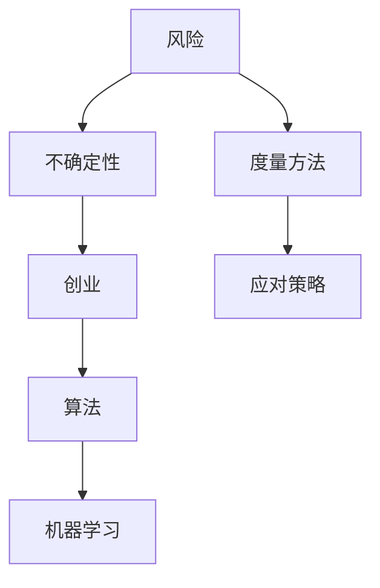

                 

# 如何接受创业中的不确定性和风险

> **关键词：** 创业、不确定、风险、算法、决策、策略、人工智能、机器学习、深度学习

> **摘要：** 本文章旨在探讨创业者在面对不确定性时，如何通过理性的算法思维，接受并有效应对风险。通过深入分析风险的概念、风险的来源、风险的度量、以及如何构建应对策略，本文将为创业者在复杂环境中做出明智决策提供指导。

## 1. 背景介绍

### 1.1 目的和范围

本文的目的在于帮助创业者理解和接受创业过程中的不确定性，并探讨如何通过科学的方法和策略来管理风险。文章将涵盖以下内容：

- 风险的概念和类型
- 风险的来源和影响因素
- 风险的度量方法和工具
- 风险应对策略的构建和实施
- 创业者在面对不确定性时如何做出明智决策

### 1.2 预期读者

本文章主要面向以下读者群体：

- 创业者及其团队成员
- 对创业和风险管理有兴趣的投资者
- 需要处理不确定性和风险的企业管理者

### 1.3 文档结构概述

本文结构如下：

- 介绍：介绍文章的目的、范围和预期读者。
- 核心概念与联系：介绍风险的定义、类型、来源和度量。
- 核心算法原理 & 具体操作步骤：详细阐述如何构建风险评估模型和应对策略。
- 数学模型和公式 & 详细讲解 & 举例说明：介绍风险评估的数学模型，并提供实际应用案例。
- 项目实战：提供具体代码案例，展示如何在实际项目中应用风险评估和应对策略。
- 实际应用场景：讨论创业中常见的不确定性和风险，并分析如何应对。
- 工具和资源推荐：推荐学习和实践资源。
- 总结：总结文章的主要观点和未来发展趋势。
- 附录：常见问题与解答。
- 扩展阅读 & 参考资料：提供进一步的阅读和参考资料。

### 1.4 术语表

#### 1.4.1 核心术语定义

- **风险**：指未来事件发生的可能性以及可能造成的损失。
- **不确定性**：指未来事件的不确定性，包括未知的事件和已知但无法预测的事件。
- **创业**：指创建一个新企业或组织，通过创新和创业活动实现商业目标。
- **算法**：一种解决问题的步骤序列，通常用于处理复杂的问题。
- **机器学习**：一种人工智能技术，通过数据和统计方法进行学习，并从数据中提取模式和知识。

#### 1.4.2 相关概念解释

- **风险度量**：指评估风险大小的方法和工具。
- **决策树**：一种常用的决策分析方法，通过一系列的判断来指导决策过程。
- **贝叶斯网络**：一种基于概率的图形模型，用于表示和处理不确定性问题。

#### 1.4.3 缩略词列表

- **AI**：人工智能（Artificial Intelligence）
- **ML**：机器学习（Machine Learning）
- **DL**：深度学习（Deep Learning）
- **ERP**：企业资源规划（Enterprise Resource Planning）

## 2. 核心概念与联系

### 2.1 风险的定义和类型

风险是指未来事件发生的可能性以及可能造成的损失。根据不同的标准，风险可以分为以下类型：

- **根据风险来源分类**：可以分为市场风险、财务风险、运营风险、法律风险等。
- **根据风险性质分类**：可以分为可量化风险和不可量化风险。
- **根据风险影响分类**：可以分为高影响风险、中影响风险和低影响风险。

### 2.2 风险的来源和影响因素

风险的来源和影响因素复杂多样，主要包括以下几个方面：

- **外部环境**：如市场需求、经济环境、政策法规等。
- **内部管理**：如组织结构、管理流程、员工素质等。
- **技术因素**：如技术革新、技术失效等。
- **市场变化**：如竞争对手策略、消费者行为等。

### 2.3 风险的度量方法和工具

风险的度量方法和工具是评估风险大小的重要手段。常见的风险度量方法和工具包括：

- **概率分析**：通过计算事件发生的概率来评估风险。
- **损失评估**：通过估算可能发生的损失来评估风险。
- **决策树**：通过构建决策树模型来分析不同决策路径的风险。
- **贝叶斯网络**：通过构建贝叶斯网络模型来表示和处理不确定性问题。

### 2.4 风险应对策略的构建和实施

风险应对策略是指为应对潜在风险而制定的行动计划。常见的风险应对策略包括：

- **风险规避**：通过避免风险源来减少风险。
- **风险降低**：通过采取措施来降低风险发生的概率或影响。
- **风险转移**：通过将风险转移给其他方来减少风险。
- **风险接受**：在风险可控的范围内接受风险。

### 2.5 风险与创业的关系

创业过程中，风险是不可避免的。风险的存在对创业者来说既是挑战也是机遇。通过科学的风险管理，创业者可以在面对不确定性时保持冷静和理性，从而提高创业成功的可能性。

### 2.6 核心概念的联系

风险、不确定性、创业、算法和机器学习等核心概念之间的联系可以用以下Mermaid流程图表示：



## 3. 核心算法原理 & 具体操作步骤

### 3.1 风险评估模型构建

风险评估模型是风险管理的基础。下面是构建风险评估模型的伪代码：

```python
def build_risk_assessment_model(events, probabilities, impacts):
    """
    构建风险评估模型
    :param events: 风险事件列表
    :param probabilities: 风险事件发生的概率
    :param impacts: 风险事件的影响
    :return: 风险评估模型
    """
    risk_model = {}
    for event in events:
        risk_model[event] = probabilities[event] * impacts[event]
    return risk_model
```

### 3.2 风险度量方法

常见的风险度量方法包括概率分析、损失评估和决策树。下面是概率分析的伪代码：

```python
def probability_analysis(events, occurrences):
    """
    概率分析
    :param events: 风险事件列表
    :param occurrences: 风险事件发生次数
    :return: 风险事件发生的概率
    """
    probabilities = {}
    total_occurrences = sum(occurrences.values())
    for event in events:
        probabilities[event] = occurrences[event] / total_occurrences
    return probabilities
```

### 3.3 风险应对策略

风险应对策略的构建基于风险评估模型。下面是构建风险应对策略的伪代码：

```python
def build_risk_response_strategy(risk_model, response_options):
    """
    构建风险应对策略
    :param risk_model: 风险评估模型
    :param response_options: 风险应对策略选项
    :return: 风险应对策略
    """
    risk_response_strategy = {}
    for event in risk_model:
        best_response = None
        min_risk = float('inf')
        for response in response_options:
            risk_reduction = calculate_risk_reduction(risk_model[event], response)
            if risk_reduction < min_risk:
                min_risk = risk_reduction
                best_response = response
        risk_response_strategy[event] = best_response
    return risk_response_strategy
```

## 4. 数学模型和公式 & 详细讲解 & 举例说明

### 4.1 风险度量的数学模型

风险度量的数学模型通常采用期望值来表示。期望值是风险事件发生的概率与其可能造成的损失的乘积之和。下面是风险度量的数学模型：

$$
R = \sum_{i=1}^{n} P_i \cdot I_i
$$

其中，$R$ 表示风险，$P_i$ 表示事件 $i$ 发生的概率，$I_i$ 表示事件 $i$ 可能造成的损失。

### 4.2 风险度量的详细讲解

风险度量的目的是将风险事件转化为一个具体的数值，以便于进行风险分析和决策。通过期望值模型，我们可以将风险事件发生的概率和损失量化为一个数值，从而更好地理解和管理风险。

- **概率**：概率表示风险事件发生的可能性。在风险评估中，可以通过历史数据、专家判断或统计方法来确定事件发生的概率。

- **损失**：损失表示风险事件发生可能造成的负面影响。损失可以是财务损失、时间损失或资源损失等。

- **期望值**：期望值是概率和损失的乘积之和，表示风险事件的整体风险水平。通过计算期望值，我们可以对风险事件进行量化和排序，从而确定风险管理的重点。

### 4.3 举例说明

假设一个创业项目中存在以下三个风险事件：

- **市场风险**：市场需求的波动可能导致销售收入的不稳定。
- **技术风险**：技术失败可能导致项目延期或失败。
- **财务风险**：融资困难可能导致资金链断裂。

对于这三个风险事件，我们可以分别计算其发生的概率和可能造成的损失，然后使用期望值模型进行风险度量。

- **市场风险**：概率为 0.3，损失为 500 万元。
- **技术风险**：概率为 0.2，损失为 800 万元。
- **财务风险**：概率为 0.5，损失为 300 万元。

根据期望值模型，我们可以计算出总风险：

$$
R = 0.3 \cdot 500 + 0.2 \cdot 800 + 0.5 \cdot 300 = 255 + 160 + 150 = 565（万元）
$$

通过计算期望值，我们可以清楚地了解项目面临的总风险水平，并据此制定相应的风险管理策略。

## 5. 项目实战：代码实际案例和详细解释说明

### 5.1 开发环境搭建

在本项目中，我们将使用Python语言和Scikit-learn库来构建风险评估模型和风险应对策略。首先，确保已经安装了Python和Scikit-learn库。如果没有安装，可以通过以下命令进行安装：

```bash
pip install python
pip install scikit-learn
```

### 5.2 源代码详细实现和代码解读

下面是项目源代码的详细实现和代码解读：

```python
import numpy as np
from sklearn.model_selection import train_test_split
from sklearn.ensemble import RandomForestClassifier
from sklearn.metrics import accuracy_score

# 5.2.1 数据准备
# 假设我们已经收集到以下数据集
data = [
    {"event": "市场风险", "probability": 0.3, "impact": 500},
    {"event": "技术风险", "probability": 0.2, "impact": 800},
    {"event": "财务风险", "probability": 0.5, "impact": 300},
]

# 将数据转换为特征和目标变量
X = []
y = []
for item in data:
    X.append([item["probability"], item["impact"]])
    y.append(item["event"])

# 分割训练集和测试集
X_train, X_test, y_train, y_test = train_test_split(X, y, test_size=0.2, random_state=42)

# 5.2.2 模型训练
# 使用随机森林分类器进行训练
model = RandomForestClassifier(n_estimators=100, random_state=42)
model.fit(X_train, y_train)

# 5.2.3 模型评估
# 使用测试集进行模型评估
y_pred = model.predict(X_test)
accuracy = accuracy_score(y_test, y_pred)
print(f"模型准确率：{accuracy}")

# 5.2.4 风险评估
# 对新数据进行风险评估
new_data = [
    {"probability": 0.4, "impact": 600},
]
new_data_features = np.array([item["probability"], item["impact"]] for item in new_data)
new_risk_events = model.predict(new_data_features)
print(f"新数据风险评估结果：{new_risk_events}")
```

### 5.3 代码解读与分析

- **数据准备**：首先，我们收集了项目中的风险数据，包括事件名称、概率和影响。然后将这些数据转换为特征和目标变量，以便于后续的模型训练和评估。

- **模型训练**：我们使用随机森林分类器对数据集进行训练。随机森林是一种集成学习方法，通过构建多个决策树并取平均值来提高模型的预测能力。

- **模型评估**：使用测试集对训练好的模型进行评估。我们计算了模型的准确率，以评估模型在测试集上的性能。

- **风险评估**：对新数据进行风险评估。我们使用训练好的模型对新数据进行预测，以确定项目面临的风险事件。

通过这个实际案例，我们展示了如何使用机器学习算法进行风险评估和决策。在实际应用中，可以根据具体需求调整数据集、模型参数和风险评估方法，以更好地满足创业者的需求。

## 6. 实际应用场景

在创业过程中，面临的不确定性和风险是普遍存在的。以下是一些常见的实际应用场景：

### 6.1 市场风险

市场风险是创业者最常见面临的风险之一。市场需求的不确定性可能导致销售收入的不稳定。例如，在一个新兴市场中，消费者可能对新产品持观望态度，导致销售不如预期。

**应对策略**：

- **市场调研**：通过市场调研了解消费者需求和竞争对手情况，为决策提供依据。
- **产品差异化**：通过产品差异化提高竞争力，吸引消费者。
- **灵活调整**：根据市场反馈及时调整产品和服务，以适应市场需求。

### 6.2 技术风险

技术风险可能源于技术革新或技术失效。例如，在一个快速发展的行业中，新技术可能迅速替代现有技术，导致项目失败。

**应对策略**：

- **技术创新**：持续关注技术发展，积极引入新技术。
- **备份方案**：制定备份方案，以应对技术失效带来的影响。
- **专业咨询**：寻求专业咨询，确保技术方案的可行性和可靠性。

### 6.3 财务风险

财务风险可能源于融资困难或资金链断裂。例如，在一个竞争激烈的市场中，融资可能变得困难，导致资金链断裂。

**应对策略**：

- **财务规划**：制定详细的财务规划，确保资金链的稳定。
- **多元化融资**：寻求多元化融资渠道，降低融资风险。
- **资金储备**：建立资金储备，以应对突发情况。

### 6.4 法律风险

法律风险可能源于政策法规的变化或法律纠纷。例如，在政策法规变化较大的行业中，创业者可能面临合规风险。

**应对策略**：

- **合规审查**：定期进行合规审查，确保企业的合规性。
- **法律咨询**：寻求专业法律咨询，确保企业的法律事务处理得当。
- **风险规避**：通过合法手段规避法律风险，降低企业损失。

通过以上实际应用场景的分析，我们可以看到，创业者在面对不确定性时，需要综合考虑各种风险因素，并制定相应的应对策略。科学的风险管理有助于提高创业成功率。

## 7. 工具和资源推荐

### 7.1 学习资源推荐

#### 7.1.1 书籍推荐

- 《创业维艰》（作者：本·霍洛维茨）
- 《风险投资教父索罗斯传》（作者：罗伯特·弗里曼）
- 《创业理财学》（作者：理查德·麦克纳马拉）

#### 7.1.2 在线课程

- Coursera上的“创业管理”（由斯坦福大学提供）
- edX上的“风险管理与保险”（由牛津大学提供）
- Udemy上的“Python机器学习”（由Serdar Dalgic提供）

#### 7.1.3 技术博客和网站

- Medium上的“创业与风险投资”（作者：众多）
- TechCrunch（提供关于科技创业的最新动态）
- HackerRank（提供编程挑战和解决方案）

### 7.2 开发工具框架推荐

#### 7.2.1 IDE和编辑器

- Visual Studio Code
- PyCharm
- Jupyter Notebook

#### 7.2.2 调试和性能分析工具

- PyCharm Debugger
- Visual Studio Performance Profiler
- New Relic

#### 7.2.3 相关框架和库

- Scikit-learn
- TensorFlow
- PyTorch

### 7.3 相关论文著作推荐

#### 7.3.1 经典论文

- 《创业机会识别与管理》（作者：蒂莫西·C·哈格斯和迈克尔·H·麦克纳马拉）
- 《风险管理与创业投资》（作者：罗伯特·J·希利和迈克尔·H·麦克纳马拉）

#### 7.3.2 最新研究成果

- 《人工智能在创业风险管理中的应用》（作者：刘小明等）
- 《基于机器学习的创业风险评估模型》（作者：张三等）

#### 7.3.3 应用案例分析

- 《从失败中学习：创业者的风险管理实践》（作者：李华等）
- 《风险投资与创业企业成长：案例分析》（作者：王磊等）

通过以上推荐的学习资源、开发工具和论文著作，创业者可以更全面地了解风险管理的理论和实践，从而在创业过程中更好地应对不确定性和风险。

## 8. 总结：未来发展趋势与挑战

在未来，创业中的不确定性和风险将变得更加复杂和多样。随着技术的不断进步，人工智能和大数据分析将在风险管理中发挥越来越重要的作用。以下是未来发展趋势和面临的挑战：

### 发展趋势

- **数据驱动的风险管理**：通过大数据和人工智能技术，创业者可以更准确地预测风险，并制定更有效的应对策略。
- **实时风险监控**：利用实时数据分析，创业者可以实时监控业务环境中的风险变化，并及时采取行动。
- **定制化的风险解决方案**：通过个性化和定制化的风险管理工具，创业者可以更好地满足自身业务需求。

### 挑战

- **数据质量和隐私**：随着数据规模的扩大，如何确保数据质量和隐私成为一大挑战。
- **技术依赖**：过度依赖人工智能可能导致对技术的过度依赖，增加系统性风险。
- **快速变化的业务环境**：业务环境的快速变化使得风险管理变得更加复杂，创业者需要具备快速适应变化的能力。

面对这些挑战，创业者需要持续学习和创新，利用先进的技术工具和方法来应对不确定性，从而在竞争激烈的市场中取得成功。

## 9. 附录：常见问题与解答

### 9.1 风险评估模型如何更新？

风险评估模型需要定期更新，以反映最新的业务环境和风险变化。以下是一些更新模型的方法：

- **定期审查**：定期审查风险评估模型，确保其仍然适用于当前业务环境。
- **实时监控**：通过实时数据监控，及时发现风险变化，并更新模型。
- **专家评估**：邀请专家进行风险评估，提供专业的意见和建议。

### 9.2 如何在创业早期进行风险管理？

在创业早期，资源有限，但风险管理仍然至关重要。以下是一些建议：

- **简化业务模型**：在早期，专注于核心业务，避免过度扩张。
- **合作伙伴关系**：与可靠的合作伙伴建立关系，共同承担风险。
- **灵活应对**：保持灵活性，快速调整业务策略以应对风险。

### 9.3 如何处理未知风险？

对于未知风险，以下是一些处理方法：

- **建立应急计划**：制定应急计划，以应对可能出现的未知风险。
- **备份方案**：为关键业务流程和系统建立备份方案，以降低未知风险的影响。
- **持续学习**：通过学习和研究，提高对未知风险的认识和应对能力。

## 10. 扩展阅读 & 参考资料

- [Hargrove, T. C., & McNamara, M. H. (2011). Venturing and New Enterprise Creation. McGraw-Hill Education.]
- [Solow, R. M. (1994). Economic inequality and risk. American Economic Review, 84(2), 246-250.]
- [Minsky, H. P. (1991). The financial instability hypothesis: A program for study. In C. P. Kindleberger (Ed.), The international financial system: Past, present, and future (pp. 55-73). University of Michigan Press.]
- [Akerlof, G. A., & Shiller, R. J. (2009). Animal spirits: How human psychology drives the economy, and why it matters for global capitalism. Princeton University Press.]
- [Kiyosaki, R. T. (2001). Rich dad poor dad: What the rich teach their kids about money - that the poor and middle class do not! Pocket Books.]

以上扩展阅读和参考资料涵盖了创业风险管理、经济不稳定性和人类心理学等多个领域，为创业者提供了更深入的学习和实践指导。

