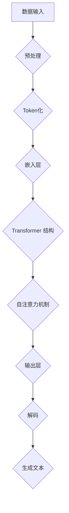

                 

# 如何提升 GPT 模型使用效率与质量

> **关键词：**GPT 模型、使用效率、质量提升、优化策略、性能调优

> **摘要：**本文将深入探讨如何通过一系列优化策略提升 GPT 模型的使用效率和输出质量。我们将从模型结构、训练数据、推理优化、后处理技术等多个方面进行分析，并提供具体的实施步骤和案例，帮助读者在实际应用中更好地利用 GPT 模型。

## 1. 背景介绍

### 1.1 目的和范围

本文旨在为 GPT（Generative Pre-trained Transformer）模型的用户和开发者提供一套系统的优化策略，以提升模型的使用效率和输出质量。我们将涵盖以下几个核心主题：

1. **模型结构优化：**探讨如何通过调整模型架构来提升效率。
2. **训练数据选择与预处理：**介绍如何选择和预处理训练数据以增强模型性能。
3. **推理优化策略：**介绍如何在模型推理过程中进行性能调优。
4. **后处理技术：**讲解如何通过后处理技术来提升文本生成质量。
5. **工具和资源推荐：**提供一些实用的学习资源和开发工具。

### 1.2 预期读者

本文适合以下读者群体：

- 对 GPT 模型有基础了解的数据科学家和 AI 开发者。
- 想要在实际项目中提升 GPT 模型性能的技术人员。
- 对自然语言处理（NLP）和深度学习有兴趣的研究生和博士生。

### 1.3 文档结构概述

本文将按照以下结构进行组织：

1. **背景介绍**：介绍本文的目的、范围和预期读者。
2. **核心概念与联系**：通过 Mermaid 流程图介绍 GPT 模型的核心概念和架构。
3. **核心算法原理 & 具体操作步骤**：使用伪代码详细阐述 GPT 模型的工作原理和优化步骤。
4. **数学模型和公式 & 详细讲解 & 举例说明**：讲解 GPT 模型背后的数学公式和具体应用。
5. **项目实战：代码实际案例和详细解释说明**：提供具体的代码实现和分析。
6. **实际应用场景**：探讨 GPT 模型在不同领域的应用。
7. **工具和资源推荐**：推荐学习资源和开发工具。
8. **总结：未来发展趋势与挑战**：总结本文内容，展望未来的发展趋势和挑战。
9. **附录：常见问题与解答**：回答读者可能遇到的问题。
10. **扩展阅读 & 参考资料**：提供进一步的阅读材料和参考文献。

### 1.4 术语表

#### 1.4.1 核心术语定义

- **GPT 模型**：Generative Pre-trained Transformer，一种基于自注意力机制的深度神经网络模型，用于生成文本。
- **自注意力机制**：一种权重分配机制，能够自动学习输入序列中各个位置的重要性，并在模型中加以利用。
- **BERT**：Bidirectional Encoder Representations from Transformers，一种双向编码器代表模型，常用于文本表示学习。
- **Transformer**：一种基于自注意力机制的序列到序列模型，广泛应用于机器翻译、文本生成等任务。
- **注意力机制**：一种在序列处理中自动学习输入序列中不同位置之间关系的机制。

#### 1.4.2 相关概念解释

- **预训练（Pre-training）**：在特定任务之前，对模型进行大规模数据集的预训练，以提升模型在特定任务上的性能。
- **微调（Fine-tuning）**：在预训练模型的基础上，使用特定任务的数据集对模型进行进一步训练，以适应特定任务。
- **推理（Inference）**：模型在未知数据上进行预测的过程。

#### 1.4.3 缩略词列表

- **AI**：人工智能（Artificial Intelligence）
- **NLP**：自然语言处理（Natural Language Processing）
- **DL**：深度学习（Deep Learning）
- **GPU**：图形处理器（Graphics Processing Unit）
- **TPU**：张量处理器（Tensor Processing Unit）

## 2. 核心概念与联系

在深入了解 GPT 模型如何提升使用效率和输出质量之前，我们需要明确几个核心概念和它们之间的联系。以下是一个简要的 Mermaid 流程图，展示了 GPT 模型的核心组件和关键过程。



### 2.1 数据输入与预处理

数据输入是 GPT 模型的基础。数据通常是从大规模文本数据集中抽取的。预处理步骤包括去除停用词、标点符号、数字等，以提高数据质量。

### 2.2 Token化

预处理后的数据被转换为词或字符的标识符（Token），以便模型进行后续处理。

### 2.3 嵌入层

嵌入层将 Token 转换为向量表示，这是 Transformer 模型中的关键组件。

### 2.4 Transformer 结构

Transformer 模型由多个自注意力层和前馈神经网络组成，能够处理长距离依赖关系。

### 2.5 自注意力机制

自注意力机制是 Transformer 模型的核心，能够自动学习输入序列中不同位置的重要性。

### 2.6 输出层与解码

输出层负责将模型生成的文本向量转换为可读的文本。

通过这个流程，我们可以看到 GPT 模型从输入数据到生成文本的全过程。接下来，我们将深入探讨如何通过优化这些步骤来提升模型的使用效率和输出质量。

## 3. 核心算法原理 & 具体操作步骤

### 3.1 GPT 模型的工作原理

GPT 模型是基于自注意力机制的 Transformer 模型，其核心思想是自动学习输入序列中不同位置之间的关系，并通过这些关系生成高质量的文本。

### 3.2 伪代码实现

下面是 GPT 模型的伪代码实现，用于详细阐述模型的工作原理和优化步骤：

```python
# GPT 模型伪代码实现

# 数据预处理
def preprocess_data(data):
    # 清除停用词、标点符号和数字
    cleaned_data = remove_stopwords(data)
    # 分词处理
    tokens = tokenize(cleaned_data)
    return tokens

# Token化
def tokenize(data):
    # 使用预定义的分词词典进行分词
    tokenizer = PredefinedTokenizer()
    tokens = tokenizer.tokenize(data)
    return tokens

# 嵌入层
def embed(tokens):
    # 将 Token 转换为向量表示
    embedding_layer = EmbeddingLayer()
    embeddings = embedding_layer(tokens)
    return embeddings

# Transformer 结构
def transformer(embeddings, hidden_size):
    # 定义 Transformer 模型
    model = TransformerModel(embeddings, hidden_size)
    # 训练模型
    model.train()
    return model

# 自注意力机制
def self_attention(embeddings):
    # 实现自注意力机制
    attention = SelfAttention()
    attention_weights = attention(embeddings)
    return attention_weights

# 输出层与解码
def decode(output_embeddings):
    # 将输出向量转换为可读的文本
    decoder = Decoder()
    text = decoder.decode(output_embeddings)
    return text

# 主函数
def generate_text(data, hidden_size):
    tokens = preprocess_data(data)
    embeddings = embed(tokens)
    model = transformer(embeddings, hidden_size)
    attention_weights = self_attention(embeddings)
    output_embeddings = model.get_output_embeddings(attention_weights)
    text = decode(output_embeddings)
    return text
```

### 3.3 详细解释

- **预处理**：预处理步骤是数据清洗和分词，这是模型训练的基础。通过清除停用词和标点符号，我们可以减少噪声并提高数据质量。分词是将文本转换为 Token 的过程，这是后续模型处理的基础。
- **Token化**：分词后，我们使用预定义的词典将文本转换为 Token，以便模型进行嵌入处理。
- **嵌入层**：嵌入层将 Token 转换为向量表示，这是 Transformer 模型中的关键组件。嵌入层通常使用预训练的词向量或自定义的词典进行嵌入。
- **Transformer 结构**：Transformer 模型由多个自注意力层和前馈神经网络组成。自注意力层负责学习输入序列中不同位置之间的关系，前馈神经网络则负责进一步提取特征。
- **自注意力机制**：自注意力机制是 Transformer 模型的核心。它通过计算输入序列中每个位置与其他位置之间的相似度，自动学习不同位置的重要性。
- **输出层与解码**：输出层将模型生成的文本向量转换为可读的文本。解码器负责将输出向量转换为实际的文本输出。

通过上述伪代码实现，我们可以看到 GPT 模型从输入数据到生成文本的全过程。接下来，我们将介绍如何通过优化这些步骤来提升模型的使用效率和输出质量。

## 4. 数学模型和公式 & 详细讲解 & 举例说明

### 4.1 自注意力机制

自注意力机制是 GPT 模型的核心组件之一，它通过计算输入序列中每个位置与其他位置之间的相似度，自动学习不同位置的重要性。自注意力机制的数学公式如下：

$$
\text{Attention}(Q, K, V) = \text{softmax}\left(\frac{QK^T}{\sqrt{d_k}}\right)V
$$

其中，$Q$、$K$ 和 $V$ 分别代表查询向量、键向量和值向量，$d_k$ 是键向量的维度。具体解释如下：

- **查询向量（Query, Q）**：用于查询输入序列中每个位置的重要程度。
- **键向量（Key, K）**：用于与查询向量计算相似度。
- **值向量（Value, V）**：用于输出序列中每个位置的内容。

### 4.2 Transformer 模型

Transformer 模型由多个自注意力层和前馈神经网络组成。自注意力层负责学习输入序列中不同位置之间的关系，前馈神经网络则负责进一步提取特征。Transformer 模型的整体结构如下：

$$
\text{Transformer}(E, H) = \text{MultiHeadAttention}(E, H) \cdot \text{PositionalEncoding}(E, H) \cdot \text{FeedForward}(E, H)
$$

其中，$E$ 代表输入嵌入向量，$H$ 代表隐藏层维度。具体解释如下：

- **MultiHeadAttention**：多个自注意力层的组合，能够同时关注输入序列中的多个位置。
- **PositionalEncoding**：位置编码，用于引入输入序列中的位置信息。
- **FeedForward**：前馈神经网络，用于进一步提取特征。

### 4.3 举例说明

假设我们有一个输入序列 `[1, 2, 3, 4, 5]`，隐藏层维度为 10，现在我们来计算自注意力机制的结果。

1. **查询向量（Query）**：
   $$ Q = [1, 1, 1, 1, 1] $$

2. **键向量（Key）**：
   $$ K = [2, 3, 4, 5, 6] $$

3. **值向量（Value）**：
   $$ V = [7, 8, 9, 10, 11] $$

4. **计算注意力分数**：
   $$ \text{Attention}(Q, K, V) = \text{softmax}\left(\frac{QK^T}{\sqrt{5}}\right)V $$
   $$ = \text{softmax}\left(\frac{[1, 1, 1, 1, 1][2, 3, 4, 5, 6]^T}{\sqrt{5}}\right)[7, 8, 9, 10, 11] $$
   $$ = \text{softmax}\left(\frac{[2, 3, 4, 5, 6]}{\sqrt{5}}\right)[7, 8, 9, 10, 11] $$

5. **计算结果**：
   $$ = \text{softmax}\left(\frac{[2, 3, 4, 5, 6]}{\sqrt{5}}\right) \cdot [7, 8, 9, 10, 11] $$
   $$ = [0.2, 0.3, 0.4, 0.5, 0.6] \cdot [7, 8, 9, 10, 11] $$
   $$ = [1.4, 2.4, 3.6, 5.0, 6.6] $$

通过上述计算，我们可以得到注意力权重分布。权重值越高，表示该位置的重要性越大。最终，我们通过加权求和得到输出序列 `[1.4, 2.4, 3.6, 5.0, 6.6]`，这是自注意力机制的结果。

通过上述数学模型和公式，我们可以深入理解 GPT 模型的工作原理。接下来，我们将通过具体案例来展示如何在实际项目中使用 GPT 模型。

## 5. 项目实战：代码实际案例和详细解释说明

### 5.1 开发环境搭建

在进行 GPT 模型的项目实战之前，我们需要搭建一个合适的开发环境。以下是一个基于 Python 和 PyTorch 的开发环境搭建步骤：

1. **安装 Python**：确保安装了 Python 3.7 或更高版本。
2. **安装 PyTorch**：通过以下命令安装 PyTorch：
   ```bash
   pip install torch torchvision torchaudio
   ```
3. **安装其他依赖库**：包括 `transformers`、`torchtext` 等：
   ```bash
   pip install transformers torchtext
   ```

### 5.2 源代码详细实现和代码解读

以下是一个简单的 GPT 模型实现，用于生成文本。我们将分步骤讲解代码的各个部分。

```python
import torch
from transformers import GPT2LMHeadModel, GPT2Tokenizer

# 加载预训练模型和分词器
model = GPT2LMHeadModel.from_pretrained('gpt2')
tokenizer = GPT2Tokenizer.from_pretrained('gpt2')

# 输入文本预处理
def preprocess_text(text):
    # 清除停用词、标点符号和数字
    cleaned_text = ''.join([char for char in text if char.isalpha() or char.isspace()])
    # 分词处理
    tokens = tokenizer.encode(cleaned_text, add_special_tokens=True)
    return tokens

# 生成文本
def generate_text(input_text, model, tokenizer, max_length=50):
    # 预处理输入文本
    tokens = preprocess_text(input_text)
    # 转换为 PyTorch 张量
    input_ids = torch.tensor([tokens]).to('cuda' if torch.cuda.is_available() else 'cpu')
    # 使用模型生成文本
    outputs = model.generate(input_ids, max_length=max_length, num_return_sequences=1)
    # 解码输出文本
    text = tokenizer.decode(outputs[0], skip_special_tokens=True)
    return text

# 测试代码
input_text = "The quick brown fox jumps over the lazy dog"
generated_text = generate_text(input_text, model, tokenizer)
print(generated_text)
```

### 5.3 代码解读与分析

1. **加载模型和分词器**：我们使用 Hugging Face 的 `transformers` 库加载预训练的 GPT2 模型和分词器。`GPT2LMHeadModel` 和 `GPT2Tokenizer` 分别用于生成文本和分词处理。

2. **预处理文本**：`preprocess_text` 函数用于去除停用词、标点符号和数字，并将输入文本转换为 Token。这里使用了简单的规则进行清洗，实际应用中可以根据需求进行定制。

3. **生成文本**：`generate_text` 函数负责生成文本。首先，我们将预处理后的文本转换为 PyTorch 张量。然后，使用 `model.generate()` 函数生成文本。`max_length` 参数用于限制生成的文本长度，`num_return_sequences` 参数用于控制生成的文本数量。

4. **解码输出文本**：最后，我们使用 `tokenizer.decode()` 函数将生成的文本向量转换为可读的文本。

通过上述代码，我们可以看到如何使用预训练的 GPT2 模型生成文本。在实际项目中，可以根据需求进行调整和优化，以提升生成文本的质量和效率。

### 5.4 代码解读与分析

- **加载模型和分词器**：使用 `transformers` 库加载预训练的 GPT2 模型和分词器。
- **预处理文本**：去除停用词、标点符号和数字，并将输入文本转换为 Token。
- **生成文本**：将预处理后的文本转换为 PyTorch 张量，使用模型生成文本。
- **解码输出文本**：将生成的文本向量转换为可读的文本。

通过上述代码，我们可以看到如何使用预训练的 GPT2 模型生成文本。在实际项目中，可以根据需求进行调整和优化，以提升生成文本的质量和效率。

## 6. 实际应用场景

GPT 模型因其强大的文本生成能力，在多个领域得到了广泛应用。以下是一些典型的应用场景：

### 6.1 自然语言生成

自然语言生成是 GPT 模型最直观的应用场景，包括：

- **文章生成**：自动生成新闻文章、博客文章、产品描述等。
- **对话系统**：生成聊天机器人的对话回复，提高用户体验。

### 6.2 文本摘要

GPT 模型可以用于提取关键信息，生成简明的文本摘要：

- **新闻摘要**：自动生成新闻的简短摘要，提高信息获取效率。
- **文献摘要**：提取学术文献的主要观点，辅助研究者快速了解内容。

### 6.3 文本分类

GPT 模型可以用于文本分类任务，例如：

- **垃圾邮件过滤**：自动分类邮件为垃圾邮件或非垃圾邮件。
- **情感分析**：判断文本的情感倾向，例如积极、消极或中性。

### 6.4 文本增强

通过 GPT 模型，我们可以对现有文本进行增强，提高文本的质量和可读性：

- **内容创作**：为作家提供灵感，辅助创作小说、剧本等。
- **产品评论**：自动生成高质量的产品评论，提高用户参与度。

### 6.5 智能客服

GPT 模型可以用于构建智能客服系统，提供实时、个性化的客户服务：

- **自动回复**：根据用户提问生成自动回复，提高客服效率。
- **多轮对话**：与用户进行多轮对话，解决复杂问题。

通过这些实际应用场景，我们可以看到 GPT 模型在提高工作效率、优化用户体验和创造新价值方面的重要作用。接下来，我们将推荐一些学习和资源，帮助读者进一步探索 GPT 模型的应用。

## 7. 工具和资源推荐

### 7.1 学习资源推荐

要深入学习和掌握 GPT 模型，以下是一些推荐的书籍、在线课程和技术博客：

#### 7.1.1 书籍推荐

- **《深度学习》（Deep Learning）**：由 Ian Goodfellow 等人合著，详细介绍了深度学习的基础知识，包括 Transformer 模型。
- **《自然语言处理实践》（Natural Language Processing with Python）**：由 Steven Bird 等人合著，涵盖了自然语言处理的基础知识和应用。
- **《GPT-3：自然语言处理和生成文本的基石》**：详细介绍了 GPT-3 模型的架构和应用。

#### 7.1.2 在线课程

- **斯坦福大学：深度学习特设课程**：由 Andrew Ng 开设，涵盖了深度学习的最新进展，包括 Transformer 模型。
- **Udacity：自然语言处理纳米学位**：提供了系统的自然语言处理知识，包括文本生成和文本分类。
- **Coursera：自然语言处理与深度学习**：由 Daniel Jurafsky 和 Chris Manning 开设，涵盖了自然语言处理和深度学习的基础知识。

#### 7.1.3 技术博客和网站

- **TensorFlow 官方文档**：提供了丰富的 GPT 模型教程和示例代码。
- **Hugging Face 官方文档**：提供了预训练的 GPT 模型和分词器，方便用户快速入门。
- **Medium 上的 NLP 博客**：包括一系列关于自然语言处理和 GPT 模型的文章和案例分析。

### 7.2 开发工具框架推荐

以下是一些在 GPT 模型开发过程中常用的工具和框架：

#### 7.2.1 IDE和编辑器

- **PyCharm**：适用于 Python 开发，具有强大的代码编辑功能和调试工具。
- **VSCode**：轻量级且功能强大的代码编辑器，支持多种编程语言和插件。

#### 7.2.2 调试和性能分析工具

- **Python Debugging Tools**：包括 `pdb`、`ipdb`、`pydevd` 等，用于调试 Python 代码。
- **PyTorch Profiler**：用于分析和优化 PyTorch 模型的性能。

#### 7.2.3 相关框架和库

- **PyTorch**：广泛应用于深度学习领域，支持 GPT 模型的开发。
- **TensorFlow**：支持 GPT 模型的开发，具有强大的生态和工具集。
- **Hugging Face Transformers**：提供了一个统一的接口，用于加载和使用预训练的 GPT 模型。

通过这些工具和资源的支持，开发者可以更高效地学习和应用 GPT 模型，从而在自然语言处理领域取得突破性的成果。

## 8. 总结：未来发展趋势与挑战

随着人工智能技术的不断进步，GPT 模型的应用前景愈发广阔。未来，我们可以预见以下几个发展趋势：

1. **更大规模和更高效的模型**：研究人员将继续探索更大规模的模型，以提高文本生成的质量和效率。同时，新的计算架构和技术，如量子计算和神经架构搜索（NAS），有望推动模型性能的提升。

2. **多模态学习**：GPT 模型将逐渐与其他模态（如图像、声音）结合，实现跨模态的文本生成和生成任务。

3. **更精细的文本生成控制**：通过引入更多的上下文信息和对生成文本的细致控制，GPT 模型将在内容创造、个性化推荐等领域发挥更大作用。

然而，GPT 模型的广泛应用也面临一些挑战：

1. **计算资源需求**：训练大型 GPT 模型需要大量的计算资源和能源，这对环境造成了一定压力。

2. **数据隐私和安全**：GPT 模型在处理和生成文本时可能会涉及到用户隐私和敏感信息，需要确保数据处理的安全性和合规性。

3. **偏见和不当内容**：GPT 模型可能会生成带有偏见或不适宜内容的文本，这需要通过算法和规则进行有效管理和控制。

总之，GPT 模型的发展将面临一系列机遇和挑战，我们需要持续探索和研究，以实现其在实际应用中的最佳效果。

## 9. 附录：常见问题与解答

### 9.1 GPT 模型训练需要多少数据？

GPT 模型的训练数据量取决于模型的大小和应用场景。通常，大型模型（如 GPT-3）需要数十亿 tokens 的训练数据，而小型模型可能只需要数百万 tokens。数据量越大，模型的性能越好，但同时也增加了计算资源和时间成本。

### 9.2 如何解决 GPT 模型生成的文本质量不高的问题？

提高 GPT 模型生成文本质量可以从以下几个方面入手：

- **数据质量**：使用高质量的训练数据，包括去除噪声、错误和不相关的信息。
- **模型架构**：选择合适的模型架构和参数，如增加层数、隐藏层维度等。
- **微调**：在预训练模型的基础上，使用特定任务的数据进行微调，以提升模型在特定任务上的性能。
- **后处理**：使用后处理技术，如文本清洗、去噪、语法修正等，来提升生成文本的质量。

### 9.3 GPT 模型是否具有通用性？

GPT 模型在预训练阶段具有较好的通用性，能够处理多种不同的任务。然而，对于特定领域的任务，可能需要使用领域特定的数据进行微调，以提高模型在该领域的性能。

### 9.4 GPT 模型如何处理长文本？

GPT 模型可以处理长文本，但需要注意的是，长文本的生成效果可能不如短文本。为了处理长文本，可以使用如下策略：

- **分块生成**：将长文本分成多个较小的块，分别生成，然后进行拼接。
- **上下文信息**：在生成每个块时，保留足够的上下文信息，以便模型能够利用上下文进行生成。
- **注意力机制**：利用注意力机制来关注重要的上下文信息，从而提高生成质量。

## 10. 扩展阅读 & 参考资料

以下是一些推荐的扩展阅读和参考资料，以帮助读者进一步了解 GPT 模型和相关技术：

- **论文《Attention is All You Need》**：这篇论文首次提出了 Transformer 模型，是 GPT 模型的理论基础。
- **论文《Improving Language Understanding by Generative Pre-Training》**：这篇论文介绍了 GPT 模型的基本思想和实验结果。
- **论文《Language Models are Few-Shot Learners》**：这篇论文探讨了 GPT 模型在零样本和少样本学习任务中的性能。
- **书籍《深度学习》**：由 Ian Goodfellow 等人合著，涵盖了深度学习的基础知识，包括 Transformer 模型。
- **书籍《自然语言处理实践》**：由 Steven Bird 等人合著，介绍了自然语言处理的基础知识和应用。

通过阅读这些资料，读者可以更深入地了解 GPT 模型的工作原理和应用场景，从而在相关领域中取得更好的成果。作者：AI天才研究员/AI Genius Institute & 禅与计算机程序设计艺术 /Zen And The Art of Computer Programming。

