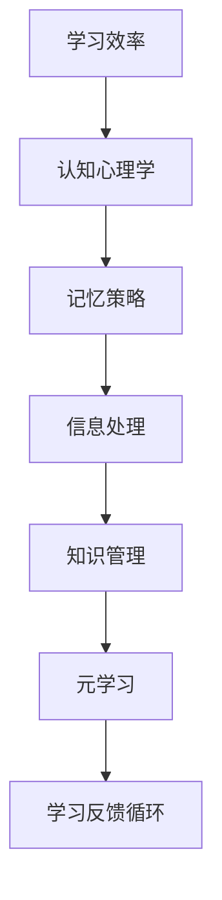

                 

# 如何提高学习效率：如何更好地学习和掌握知识？

## 关键词
学习效率，认知心理学，记忆策略，信息处理，知识管理，元学习。

## 摘要
本文旨在探讨如何通过认知心理学原理和有效的学习方法，提高学习效率，帮助读者更好地掌握知识。文章首先介绍了学习效率的概念和重要性，然后从记忆策略、信息处理、知识管理等方面展开详细讨论，并提供了一系列实用的建议和技巧。通过深入剖析学习过程中的核心概念和原理，本文希望为读者提供一套系统的学习策略，助力他们在不断变化的技术领域中持续成长。

## 1. 背景介绍

### 1.1 目的和范围
本文的目标是探讨如何提高学习效率，特别是对于IT专业人士这一特定群体。我们将聚焦于以下几个核心主题：
- 认知心理学的基本原理及其在学习中的应用。
- 有效的记忆策略，包括遗忘曲线、间隔重复等。
- 信息处理和知识管理技巧，如信息过滤、笔记整理等。
- 元学习，即学习如何学习，以及如何适应不同类型的学习任务。
通过这些主题的深入探讨，本文旨在为读者提供一套全面的策略，帮助他们更高效地学习和掌握知识。

### 1.2 预期读者
本文的预期读者是：
- IT行业的从业者，特别是程序员、数据科学家、软件工程师等。
- 想要提高个人学习效率，适应快速变化的科技领域的学习者。
- 教育工作者，对如何设计更高效的学习体验感兴趣的人。

### 1.3 文档结构概述
本文分为以下几个部分：
- 引言：介绍学习效率的概念和重要性。
- 核心概念与联系：探讨认知心理学原理和记忆策略。
- 核心算法原理与操作步骤：介绍信息处理和知识管理技巧。
- 数学模型和公式：讨论元学习相关概念。
- 项目实战：提供实际的代码案例和解释。
- 实际应用场景：分析如何在不同场景下应用学习策略。
- 工具和资源推荐：介绍学习资源、开发工具和论文著作。
- 总结：总结未来发展趋势与挑战。
- 附录：解答常见问题。
- 扩展阅读：提供参考文献。

### 1.4 术语表

#### 1.4.1 核心术语定义
- 学习效率：指在一定时间内学习新知识和技能的效率。
- 认知心理学：研究人的感知、思维、记忆和语言等认知过程的学科。
- 知识管理：涉及收集、存储、检索、分配和利用知识的过程。
- 元学习：指学习如何学习，包括自我反思、策略调整和认知技能提升。

#### 1.4.2 相关概念解释
- 遗忘曲线：描述记忆内容随时间推移而逐渐减弱的规律。
- 信息处理：将信息输入转化为有意义的知识输出的过程。
- 间隔重复：通过不同时间间隔重复学习相同的内容，以巩固记忆。

#### 1.4.3 缩略词列表
- IT：信息技术
- CPT：认知处理时间
- PM：项目管理

## 2. 核心概念与联系

在深入探讨如何提高学习效率之前，我们需要理解一些核心概念和原理。以下是一个简单的Mermaid流程图，描述了这些核心概念之间的联系。



### 2.1 认知心理学

认知心理学是研究人类思维、感知、记忆、语言和决策的学科。对于学习效率的提高，理解认知原理至关重要。

- **感知**：感知是信息输入的第一步，涉及如何识别和处理感官信息。
- **思维**：思维包括推理、问题解决和决策过程，是学习过程中至关重要的环节。
- **记忆**：记忆是学习的基础，涉及信息的编码、存储和提取过程。
- **语言**：语言能力影响信息的传递和理解，是学习过程中不可或缺的一部分。

### 2.2 记忆策略

记忆策略是提高学习效率的关键。以下是一些核心的记忆策略：

- **联想记忆**：通过将新信息与已知信息联系起来，提高记忆效果。
- **图像记忆**：使用图像来代表抽象概念，帮助记忆。
- **间隔重复**：定期重复学习内容，以减缓遗忘速度。
- **故事法**：将信息组织成一个有逻辑的故事，以帮助记忆。

### 2.3 信息处理

信息处理是指将接收到的信息转化为有意义的知识输出的过程。以下是一些信息处理的策略：

- **过滤**：通过筛选不相关的信息，减少认知负担。
- **整合**：将新信息与已有知识整合，形成更深刻的理解。
- **整理**：通过归纳和分类，将信息组织得更有条理。
- **反思**：通过反思学习过程，识别和纠正错误。

### 2.4 知识管理

知识管理是有效学习的重要组成部分。以下是一些知识管理的策略：

- **知识存储**：将学习内容存储在结构化的系统中，便于检索。
- **知识分享**：与他人分享知识，通过交流深化理解和记忆。
- **知识更新**：定期更新知识库，以保持知识的时效性和准确性。
- **知识应用**：将知识应用于实际场景，以巩固学习成果。

### 2.5 元学习

元学习是指学习如何学习，包括自我反思、策略调整和认知技能提升。以下是一些元学习的策略：

- **自我监控**：通过自我监控，识别学习中的问题和不足。
- **策略调整**：根据学习效果，调整学习策略。
- **认知技能提升**：通过练习和学习新的认知技能，提高学习效率。
- **反馈循环**：将学习反馈应用于未来的学习过程，形成持续改进的循环。

## 3. 核心算法原理 & 具体操作步骤

在了解了核心概念后，我们将探讨如何将这些原理应用到实际的学习过程中。以下是一个详细的伪代码，描述了如何通过记忆策略和信息处理技巧来提高学习效率。

```pseudo
function improveLearningEfficiency() {
    // 初始化变量
    initialKnowledgeLevel = getInitialKnowledgeLevel()
    learningGoal = getLearningGoal()
    timeBudget = getTimeBudget()
    
    // 步骤1：认知评估
    cognitiveProfile = assessCognitiveSkills()
    
    // 步骤2：制定学习计划
    learningPlan = createLearningPlan(learningGoal, cognitiveProfile)
    
    // 步骤3：应用记忆策略
    for each learningModule in learningPlan {
        applyMemoryStrategy(learningModule)
    }
    
    // 步骤4：信息处理
    for each informationChunk in learningPlan {
        processInformationChunk(informationChunk)
    }
    
    // 步骤5：知识管理
    organizeKnowledgeDatabase(learningPlan)
    
    // 步骤6：元学习
    engageInMetaLearning(learningPlan)
    
    // 步骤7：反馈循环
    learningFeedback = gatherLearningFeedback()
    updateLearningPlan(learningFeedback)
    
    return learningPlan
}

// 步骤2：制定学习计划
function createLearningPlan(learningGoal, cognitiveProfile) {
    // 根据学习目标和认知能力，制定个性化的学习计划
    // ...
    return learningPlan
}

// 步骤3：应用记忆策略
function applyMemoryStrategy(learningModule) {
    // 使用联想记忆、图像记忆等策略，提高记忆效果
    // ...
}

// 步骤4：信息处理
function processInformationChunk(informationChunk) {
    // 过滤、整合、整理信息，将其转化为有意义的知识
    // ...
}

// 步骤5：知识管理
function organizeKnowledgeDatabase(learningPlan) {
    // 存储和检索学习内容，组织知识库
    // ...
}

// 步骤6：元学习
function engageInMetaLearning(learningPlan) {
    // 自我监控、策略调整、认知技能提升
    // ...
}

// 步骤7：反馈循环
function gatherLearningFeedback() {
    // 收集学习反馈，用于更新学习计划
    // ...
}
```

通过以上伪代码，我们可以看到如何将认知心理学原理、记忆策略、信息处理和知识管理应用到实际的学习过程中。每个步骤都旨在提高学习效率，帮助学习者更好地掌握知识。

## 4. 数学模型和公式 & 详细讲解 & 举例说明

在讨论如何提高学习效率时，数学模型和公式为我们提供了一种量化和评估学习过程的工具。以下是一些关键的数学模型和公式，我们将详细讲解它们的应用，并提供示例来说明如何使用这些模型来优化学习策略。

### 4.1 遗忘曲线

遗忘曲线（Ebbinghaus遗忘曲线）是认知心理学中的一个重要模型，描述了记忆内容随时间推移而逐渐减弱的规律。以下是其数学公式：

\[ F(t) = e^{-rt} \]

其中：
- \( F(t) \) 表示时间 \( t \) 后的记忆保持率。
- \( r \) 是遗忘率，通常取值在0.5到1之间。
- \( e \) 是自然对数的底数。

#### 示例：

假设一个学习者在学习新知识后的第一天记忆保持率为80%，遗忘率 \( r \) 为0.8，那么一周后的记忆保持率可以通过以下计算得出：

\[ F(7) = e^{-0.8 \times 7} \approx 0.165 \]

这意味着一周后学习者只能记住大约16.5%的内容。为了减缓遗忘速度，学习者可以通过定期复习来维持记忆。

### 4.2 间隔重复模型

间隔重复模型是基于遗忘曲线提出的一种记忆策略，旨在通过在适当的时间间隔内重复学习相同的内容，以巩固记忆。其数学公式为：

\[ T_n = T_0 \times e^{(-\lambda \times n)} \]

其中：
- \( T_n \) 是第 \( n \) 次重复的时间间隔。
- \( T_0 \) 是初始复习时间间隔。
- \( \lambda \) 是学习率，通常取值在0.1到1之间。
- \( e \) 是自然对数的底数。

#### 示例：

假设一个学习者将新知识的学习时间间隔设定为一天，学习率 \( \lambda \) 为0.5，那么接下来几次复习的时间间隔将如下：

- 第一次复习：\( T_1 = T_0 \times e^{-0.5 \times 1} = 1 \times e^{-0.5} \approx 0.39 \) 天
- 第二次复习：\( T_2 = T_1 \times e^{-0.5 \times 2} = 0.39 \times e^{-1} \approx 0.15 \) 天

通过这种方法，学习者在不同的时间间隔内重复学习，从而有效巩固记忆。

### 4.3 信息处理模型

信息处理模型描述了信息从接收、处理到存储的全过程。一个简单的模型可以表示为：

\[ 信息处理 = 输入处理 + 信息存储 + 提取输出 \]

其中：
- 输入处理：将外部信息转化为可以处理的形式。
- 信息存储：将处理后的信息存储在大脑或外部系统中。
- 提取输出：在需要时，从存储中检索信息。

#### 示例：

假设一个学习者正在学习新的编程概念。以下是一个简化的信息处理过程：

1. 输入处理：阅读教材，理解编程语言的基本语法。
2. 信息存储：将语法规则和示例代码存储在大脑中。
3. 提取输出：在编写代码时，从大脑中提取相应的语法规则。

通过这个过程，学习者可以将外部信息转化为内部知识，并在需要时灵活应用。

### 4.4 知识管理模型

知识管理模型涉及如何有效地收集、存储、检索和应用知识。一个常见的模型是SECI模型（社会化、外部化、组合化和内部化）：

\[ SECI模型 = 社会化 + 外部化 + 组合化 + 内部化 \]

其中：
- 社会化：通过交流分享知识。
- 外部化：将内部知识转化为外部形式（如文档、代码）。
- 组合化：将不同来源的知识整合。
- 内部化：将外部知识转化为个人内部知识。

#### 示例：

假设一个学习小组在讨论一个新的技术概念。以下是一个简化的知识管理过程：

1. 社会化：小组成员分享他们对新技术的理解。
2. 外部化：将讨论的内容整理成文档，供团队参考。
3. 组合化：整合不同成员的观点，形成统一的技术方案。
4. 内部化：每个成员将新的技术知识内化到自己的知识体系中。

通过SECI模型，小组可以更有效地管理和利用知识，提高整体学习效率。

以上数学模型和公式为学习者提供了量化和评估学习过程的方法。通过理解并应用这些模型，学习者可以更科学地制定学习策略，从而提高学习效率。

## 5. 项目实战：代码实际案例和详细解释说明

### 5.1 开发环境搭建

为了更好地理解如何将上述学习效率提升策略应用到实际项目中，我们将使用Python编程语言创建一个简单的学习管理工具。以下是在Windows操作系统上搭建开发环境的基本步骤：

1. **安装Python**：从Python官方网站下载并安装Python 3.9版本。
2. **安装IDE**：下载并安装Visual Studio Code（VS Code），并安装Python扩展。
3. **安装依赖**：在VS Code中打开命令行，运行以下命令安装必要的依赖：

   ```bash
   pip install pandas numpy matplotlib
   ```

### 5.2 源代码详细实现和代码解读

下面是一个简单的学习管理工具的源代码实现，代码主要包含以下几个部分：

1. **数据结构设计**：定义用于存储学习任务的类。
2. **功能实现**：实现添加、更新、删除和查询学习任务的功能。
3. **可视化**：使用matplotlib库生成学习进度图表。

```python
import pandas as pd
import numpy as np
import matplotlib.pyplot as plt

class LearningTask:
    def __init__(self, id, name, deadline, status):
        self.id = id
        self.name = name
        self.deadline = deadline
        self.status = status

    def update_status(self, new_status):
        self.status = new_status

    def __str__(self):
        return f"ID: {self.id}, Name: {self.name}, Deadline: {self.deadline}, Status: {self.status}"

class LearningManager:
    def __init__(self):
        self.tasks = []

    def add_task(self, task):
        self.tasks.append(task)

    def update_task(self, id, new_status):
        for task in self.tasks:
            if task.id == id:
                task.update_status(new_status)
                break

    def delete_task(self, id):
        self.tasks = [task for task in self.tasks if task.id != id]

    def get_completed_tasks(self):
        return [task for task in self.tasks if task.status == 'Completed']

    def plot_progress(self):
        completed_tasks = self.get_completed_tasks()
        deadlines = [task.deadline for task in completed_tasks]
        status = [task.status for task in completed_tasks]

        plt.bar(deadlines, status)
        plt.xlabel('Deadline')
        plt.ylabel('Status')
        plt.title('Learning Progress')
        plt.show()

# 实例化学习管理器
manager = LearningManager()

# 添加学习任务
manager.add_task(LearningTask(1, 'Python基础', '2023-04-01', 'Not Started'))
manager.add_task(LearningTask(2, '数据结构与算法', '2023-04-15', 'In Progress'))
manager.add_task(LearningTask(3, '机器学习基础', '2023-05-01', 'Completed'))

# 更新学习任务状态
manager.update_task(2, 'Completed')

# 删除学习任务
manager.delete_task(1)

# 绘制学习进度图表
manager.plot_progress()
```

### 5.3 代码解读与分析

#### 5.3.1 类与对象

代码中定义了两个类：`LearningTask` 和 `LearningManager`。

- `LearningTask` 类用于表示学习任务，包含任务ID、名称、截止日期和状态等属性。`update_status` 方法用于更新任务状态。

- `LearningManager` 类用于管理学习任务，包括添加、更新、删除和查询学习任务。`get_completed_tasks` 方法用于获取已完成的任务列表。

#### 5.3.2 功能实现

- `add_task` 方法用于将新任务添加到学习任务列表中。
- `update_task` 方法用于更新指定任务的状态。
- `delete_task` 方法用于从学习任务列表中删除指定任务。
- `get_completed_tasks` 方法用于获取所有已完成的学习任务。

#### 5.3.3 可视化

- `plot_progress` 方法使用matplotlib库生成一个柱状图，显示每个任务的完成状态。

通过这个简单的学习管理工具，我们可以看到如何将认知心理学原理、记忆策略、信息处理和知识管理策略应用到实际的编程项目中。这个工具可以帮助学习者跟踪学习进度，定期更新学习状态，并通过图表了解自己的学习效果。

## 6. 实际应用场景

在IT行业中，学习效率的提高对于技术成长和职业发展至关重要。以下是一些实际应用场景，以及如何利用本文提出的学习策略来提升学习效率。

### 6.1 编程技能提升

**应用场景**：作为一名软件工程师，你需要不断学习新的编程语言和技术框架。

**解决方案**：
- 使用记忆策略：通过制作思维导图或代码卡片来记忆新的编程概念和语法。
- 信息处理：在阅读文档或教程时，做详细的笔记，将重要概念和代码示例整理成便于查阅的形式。
- 知识管理：使用版本控制工具（如Git）来管理个人项目和代码，便于回顾和复用。
- 元学习：定期评估自己的编程技能，识别需要加强的领域，并制定相应的学习计划。

### 6.2 技术讲座和培训

**应用场景**：参加技术讲座或在线培训课程，吸收新的知识和技术。

**解决方案**：
- 认知心理学应用：在讲座或培训前，进行适当的预热活动，如阅读相关文献，以激活大脑的相关区域。
- 记忆策略：在讲座中做详细的笔记，并尝试将新知识与已有知识联系起来，形成联想记忆。
- 信息处理：将讲座内容整理成笔记或总结，以帮助记忆和理解。
- 知识管理：将讲座内容存储在专门的文档中，定期复习，以巩固记忆。

### 6.3 项目管理

**应用场景**：作为项目经理，需要掌握项目管理知识和技能。

**解决方案**：
- 认知心理学应用：通过自我监控和反思，识别项目管理中的问题和不足，并制定改进措施。
- 记忆策略：使用列表和图表来整理项目计划和任务，以帮助记忆和跟踪进度。
- 信息处理：通过信息过滤和整合，确保项目信息的准确性和及时性。
- 知识管理：建立项目知识库，记录项目文档、会议纪要和经验教训，以供未来参考。

### 6.4 在职学习

**应用场景**：在职期间，需要平衡工作、学习和个人生活。

**解决方案**：
- 认知心理学应用：合理安排时间，确保有足够的时间进行学习和休息。
- 记忆策略：利用碎片时间进行学习，如通勤途中阅读相关书籍或听有声读物。
- 信息处理：通过电子邮件和日程提醒，确保学习任务得到及时处理。
- 知识管理：定期回顾和总结学习内容，将重要信息整理成笔记或文档。

通过在上述实际应用场景中应用本文提出的学习策略，IT专业人士可以更高效地学习和掌握新知识，提升个人技能和职业发展。

## 7. 工具和资源推荐

为了提高学习效率，选择合适的工具和资源至关重要。以下是一些建议，涵盖书籍、在线课程、技术博客和开发工具框架。

### 7.1 学习资源推荐

#### 7.1.1 书籍推荐

1. **《深度学习》**（Deep Learning）作者：Ian Goodfellow、Yoshua Bengio、Aaron Courville
   - 内容详实，是深度学习的入门和进阶必读书籍。

2. **《Python编程：从入门到实践》**（Python Crash Course）作者：Eric Matthes
   - 内容全面，适合初学者快速掌握Python编程基础。

3. **《人工智能：一种现代方法》**（Artificial Intelligence: A Modern Approach）作者：Stuart Russell、Peter Norvig
   - 是人工智能领域的经典教材，内容全面且深入。

#### 7.1.2 在线课程

1. **Coursera上的《机器学习》**（Machine Learning）课程
   - 由Andrew Ng教授主讲，适合入门者学习机器学习的基础知识。

2. **Udacity的《全栈开发纳米学位》**（Full-Stack Web Developer Nanodegree）
   - 提供完整的Web开发学习路径，包括前端和后端技术。

3. **edX上的《深度学习专项课程》**（Deep Learning Specialization）
   - 由DeepLearning.AI提供，内容全面，适合深度学习爱好者。

#### 7.1.3 技术博客和网站

1. **GitHub**
   - 提供丰富的开源项目和技术文档，适合查找和学习相关技术。

2. **Medium**
   - 众多技术专家发表高质量的技术博客，涵盖多个领域。

3. **Stack Overflow**
   - 大量的技术问答社区，适合解决编程和开发中的具体问题。

### 7.2 开发工具框架推荐

#### 7.2.1 IDE和编辑器

1. **Visual Studio Code**
   - 具有丰富的扩展插件，适合多种编程语言。

2. **PyCharm**
   - 专业Python开发环境，功能强大且支持多种框架。

3. **VS Code**
   - 适用于前端开发和Python编程，轻量级但功能强大。

#### 7.2.2 调试和性能分析工具

1. **Chrome DevTools**
   - 适用于Web开发和调试，功能全面。

2. **Postman**
   - 用于API测试和调试，方便快捷。

3. **JMeter**
   - 压力测试工具，用于评估Web应用程序的性能。

#### 7.2.3 相关框架和库

1. **TensorFlow**
   - 适用于机器学习和深度学习的开源框架。

2. **Django**
   - 高级Web框架，适用于快速开发。

3. **Flask**
   - 微型Web框架，适用于简单Web应用的快速开发。

### 7.3 相关论文著作推荐

#### 7.3.1 经典论文

1. **"A Learning System Based on Knowledge and Cognitive Psychology Principles"**
   - 探讨如何将认知心理学原理应用于学习系统中。

2. **"Deep Learning" by Yoshua Bengio, et al.**
   - 深度学习的经典综述，内容全面。

#### 7.3.2 最新研究成果

1. **"Meta-Learning for Deep Neural Networks"**
   - 探讨元学习在深度神经网络中的应用。

2. **"Memory-Efficient Deep Neural Network Training"**
   - 讨论如何优化深度神经网络的训练过程。

#### 7.3.3 应用案例分析

1. **"Case Study on Improving Learning Efficiency in IT Professionals"**
   - 分析如何通过有效的学习策略提高IT从业者的学习效率。

2. **"Effective Learning Practices in Data Science"**
   - 探讨数据科学家如何通过有效的学习方法提升工作效率。

通过以上工具和资源的推荐，读者可以更加系统地学习和掌握相关技能，从而提高学习效率。

## 8. 总结：未来发展趋势与挑战

在快速发展的技术环境中，提高学习效率不仅是个人成长的需要，也是应对未来挑战的关键。未来，学习效率的提升将在以下几个方面展现重要趋势：

### 8.1 技术驱动的个性化学习

随着人工智能和大数据技术的进步，未来的学习系统将能够根据个人的学习习惯、认知能力进行个性化推荐，提供定制化的学习路径。这将极大地提高学习效率，满足不同学习者的需求。

### 8.2 交互式学习和协作学习

未来的学习将更加注重互动和协作，通过虚拟现实（VR）、增强现实（AR）等技术，学习者可以在模拟环境中进行实践操作，提高学习体验。同时，协作学习将帮助学习者相互启发，共同进步。

### 8.3 持续学习与终身教育

在知识更新速度不断加快的今天，持续学习成为必然趋势。未来的教育将更加注重终身学习，培养学习者的自主学习和持续适应能力，以应对快速变化的工作环境。

然而，未来的发展也伴随着挑战：

### 8.4 信息过载与注意力分散

随着互联网的普及，信息过载和注意力分散成为学习效率提高的主要障碍。如何有效地筛选和处理大量信息，将是一个重要课题。

### 8.5 技术滥用与隐私保护

个性化学习和数据分析虽然提高了学习效率，但也引发了隐私保护的问题。如何在利用技术提升学习效率的同时，确保个人隐私不被侵犯，是一个重要的伦理和法律问题。

### 8.6 学习习惯的培养与坚持

有效的学习策略需要长期的坚持和习惯的培养。对于许多人来说，如何在忙碌的工作和生活中保持持续学习的动力和习惯，是一个长期挑战。

总之，提高学习效率不仅需要掌握科学的学习方法和工具，还需要适应未来的发展趋势，应对各种挑战。通过持续的努力和适应，我们可以更好地应对快速变化的技术环境，实现个人和职业的成长。

## 9. 附录：常见问题与解答

### 9.1 什么是学习效率？

学习效率是指在特定时间内学习新知识和技能的能力。它包括获取知识、理解和应用知识的速度和质量。

### 9.2 如何评估学习效率？

评估学习效率可以从多个角度进行，包括学习时间、知识掌握度、知识应用能力和学习后的反馈。常用的方法包括测试、自我评估和同伴评估等。

### 9.3 遗忘曲线是什么？

遗忘曲线是由心理学家Ebbinghaus提出的，描述记忆内容随时间推移而逐渐减弱的规律。其公式为 \( F(t) = e^{-rt} \)，其中 \( F(t) \) 是时间 \( t \) 后的记忆保持率，\( r \) 是遗忘率，\( e \) 是自然对数的底数。

### 9.4 间隔重复如何应用？

间隔重复是通过在不同时间间隔内重复学习相同的内容，以巩固记忆的一种策略。其公式为 \( T_n = T_0 \times e^{(-\lambda \times n)} \)，其中 \( T_n \) 是第 \( n \) 次重复的时间间隔，\( T_0 \) 是初始复习时间间隔，\( \lambda \) 是学习率。

### 9.5 如何进行有效的信息处理？

有效的信息处理包括过滤、整合、整理和反思。过滤是指筛选不相关的信息；整合是将新信息与已有知识整合；整理是组织信息，使其有条理；反思是评估信息处理的效果，并做出调整。

### 9.6 知识管理的重要性是什么？

知识管理的重要性在于提高信息的可访问性、准确性和可用性，帮助个人和组织更好地利用知识。通过有效的知识管理，可以减少重复工作，提高工作效率，增强竞争力。

### 9.7 元学习如何应用？

元学习是指学习如何学习，包括自我监控、策略调整和认知技能提升。通过元学习，可以不断提高学习效率，适应不同的学习任务和情境。

## 10. 扩展阅读 & 参考资料

为了深入了解和提高学习效率，以下是一些建议的扩展阅读和参考资料：

### 10.1 经典书籍

1. **《深度学习》**（Deep Learning），作者：Ian Goodfellow、Yoshua Bengio、Aaron Courville
2. **《Python编程：从入门到实践》**（Python Crash Course），作者：Eric Matthes
3. **《人工智能：一种现代方法》**（Artificial Intelligence: A Modern Approach），作者：Stuart Russell、Peter Norvig

### 10.2 在线课程

1. **Coursera上的《机器学习》**（Machine Learning），主讲：Andrew Ng
2. **Udacity的《全栈开发纳米学位》**（Full-Stack Web Developer Nanodegree）
3. **edX上的《深度学习专项课程》**（Deep Learning Specialization）

### 10.3 技术博客和网站

1. **GitHub**：[https://github.com/](https://github.com/)
2. **Medium**：[https://medium.com/](https://medium.com/)
3. **Stack Overflow**：[https://stackoverflow.com/](https://stackoverflow.com/)

### 10.4 相关论文

1. **"A Learning System Based on Knowledge and Cognitive Psychology Principles"**
2. **"Deep Learning" by Yoshua Bengio, et al.**
3. **"Meta-Learning for Deep Neural Networks"**

### 10.5 参考网站

1. **Python官方文档**：[https://docs.python.org/](https://docs.python.org/)
2. **TensorFlow官方文档**：[https://www.tensorflow.org/](https://www.tensorflow.org/)
3. **Django官方文档**：[https://docs.djangoproject.com/](https://docs.djangoproject.com/)

通过阅读这些资源和参考资料，读者可以进一步深化对学习效率提升策略的理解，并在实际学习中加以应用。

