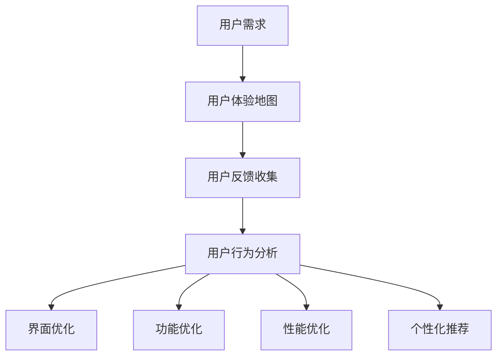

                 


# 如何提高知识付费产品的用户体验

> **关键词**：用户体验、知识付费、产品设计、用户反馈、用户行为分析
>
> **摘要**：本文将深入探讨如何通过专业的技术方法和心理学原理，提高知识付费产品的用户体验。我们将分析用户需求，介绍有效的用户反馈和用户行为分析工具，探讨如何设计更符合用户期望的产品，并分享一些实际案例和最佳实践。

## 1. 背景介绍

### 1.1 目的和范围

本文的目的是提供一套系统的指导方针，帮助知识付费产品开发者和设计师理解并提高用户在使用其产品时的整体体验。本文的范围将涵盖用户体验的基础概念、用户需求分析、用户反馈的收集与处理、用户行为分析技术以及产品设计策略。我们还将讨论一些实际操作方法和最佳实践，以帮助读者将理论应用到具体产品中。

### 1.2 预期读者

本文适合于以下读者群体：

- 知识付费产品的项目经理和产品经理
- UI/UX设计师和交互设计师
- 市场分析师和数据科学家
- 认真对待用户体验和用户满意度的技术领导者
- 对提升知识付费产品用户体验感兴趣的所有从业者

### 1.3 文档结构概述

本文结构如下：

1. **背景介绍**：介绍本文的目的、预期读者和文档结构。
2. **核心概念与联系**：介绍与用户体验相关的核心概念，并使用Mermaid流程图展示概念之间的联系。
3. **核心算法原理与具体操作步骤**：讲解用于分析和优化用户体验的核心算法，并提供具体的操作步骤。
4. **数学模型和公式**：介绍与用户体验优化相关的数学模型和公式，并进行详细讲解和举例说明。
5. **项目实战**：提供实际的代码案例和详细解释，展示如何将理论知识应用到实践中。
6. **实际应用场景**：讨论知识付费产品在不同应用场景中的用户体验优化策略。
7. **工具和资源推荐**：推荐相关学习资源和开发工具，以帮助读者深入了解和实践用户体验优化。
8. **总结**：总结本文的主要观点，并探讨未来的发展趋势和挑战。
9. **附录**：提供常见问题与解答，以及扩展阅读和参考资料。

### 1.4 术语表

#### 1.4.1 核心术语定义

- 用户反馈：用户在使用产品过程中提供的关于产品功能、性能、易用性等方面的信息。
- 用户体验（UX）：用户在使用产品过程中所获得的主观感受和体验。
- 用户行为分析：通过收集和分析用户在使用产品过程中的行为数据，以优化产品设计和提高用户体验。
- 知识付费产品：用户需付费才能获得知识内容的在线产品，如在线课程、电子书、专业培训等。

#### 1.4.2 相关概念解释

- **用户体验地图**：一种可视化的工具，用于描述用户在使用产品过程中的每个接触点和体验。
- **用户旅程**：描述用户从接触产品到最终达成目标的全过程，包括每个阶段用户的行为、感受和需求。
- **A/B测试**：一种通过对比两个或多个版本的产品，以确定哪个版本能提供更好用户体验的实验方法。
- **留存率**：衡量用户在一段时间内持续使用产品的比例，是衡量用户体验质量的重要指标。

#### 1.4.3 缩略词列表

- UX：用户体验
- UI：用户界面
- A/B测试：A/B测试
- IoT：物联网
- AI：人工智能

## 2. 核心概念与联系

在深入探讨如何优化知识付费产品的用户体验之前，我们需要先了解几个核心概念及其相互关系。以下是与用户体验相关的核心概念和它们之间的联系。

### 2.1 用户需求与用户体验

用户需求是用户体验的基石。了解用户的需求有助于我们设计出更符合用户期望的产品。用户体验（UX）是用户在使用产品过程中的整体感受，包括感知、情感和满意度。用户需求与用户体验之间的联系在于，满足用户需求可以提升用户体验。

#### 用户需求分析

用户需求分析是识别和优先处理用户需求的过程。以下是用户需求分析的步骤：

1. **调研与观察**：通过问卷调查、访谈和观察用户行为来收集用户需求信息。
2. **数据分析**：分析用户反馈和行为数据，以识别共性需求和痛点。
3. **用户画像**：基于调研数据创建用户画像，以便更好地理解不同用户群体的需求。
4. **优先级排序**：将用户需求按照重要性和可行性进行排序，以确定哪些需求应优先处理。

#### 用户体验地图

用户体验地图是一种可视化工具，用于描述用户在使用产品过程中的每个接触点和体验。它可以帮助我们识别用户痛点、优化用户旅程，从而提升用户体验。以下是创建用户体验地图的步骤：

1. **确定用户旅程**：识别用户从接触产品到达成目标的每个阶段。
2. **描述用户行为**：记录用户在每个阶段的行为和感受。
3. **识别痛点**：分析用户旅程中的痛点，以便进行优化。
4. **制定改进策略**：根据用户体验地图，制定具体的改进策略。

### 2.2 用户反馈与用户行为分析

用户反馈是了解用户需求和体验的重要途径。用户行为分析则是通过数据化的方式，进一步揭示用户的真实需求和体验。以下是用户反馈和用户行为分析之间的联系：

#### 用户反馈收集

用户反馈收集是获取用户意见和需求的过程。以下是用户反馈收集的方法：

1. **在线调查**：通过问卷调查收集用户对产品功能、性能和易用性的反馈。
2. **用户访谈**：通过一对一访谈了解用户的深层需求和痛点。
3. **用户评论**：分析用户在产品评论区的意见和评价。
4. **社交媒体监听**：通过社交媒体平台了解用户的反馈和讨论。

#### 用户行为分析

用户行为分析是通过分析用户在使用产品过程中的行为数据，以识别用户需求和优化产品设计。以下是用户行为分析的方法：

1. **日志分析**：分析用户点击、浏览和操作日志，以了解用户行为模式。
2. **行为跟踪**：使用跟踪代码或SDK收集用户行为数据。
3. **A/B测试**：通过对比不同版本的产品，分析用户行为差异，以确定最佳设计方案。
4. **留存分析**：分析用户在产品中的留存情况，以评估用户体验质量。

### 2.3 用户行为分析与产品设计

用户行为分析的结果可以直接指导产品设计的优化。以下是用户行为分析与产品设计的联系：

1. **界面优化**：根据用户行为数据，优化用户界面布局和交互设计。
2. **功能优化**：根据用户需求和行为数据，调整产品功能和内容。
3. **性能优化**：根据用户行为数据，优化产品性能和响应速度。
4. **个性化推荐**：根据用户行为数据，实现个性化内容和推荐，提高用户满意度和留存率。

### 2.4 Mermaid流程图

以下是用户需求、用户反馈、用户行为分析和产品设计之间的Mermaid流程图：



## 3. 核心算法原理 & 具体操作步骤

在了解用户体验的核心概念和相互联系后，我们需要探讨用于优化用户体验的核心算法原理，并给出具体的操作步骤。

### 3.1 用户需求分析算法

用户需求分析是优化用户体验的第一步。以下是用户需求分析的核心算法原理和操作步骤：

#### 算法原理

用户需求分析算法基于以下原理：

1. **用户行为数据收集**：通过分析用户在产品中的行为数据，识别用户需求。
2. **用户反馈处理**：将用户反馈转化为用户需求，以便进行进一步分析。
3. **数据预处理**：对收集到的用户行为数据和反馈进行预处理，如数据清洗、去重和归一化。

#### 操作步骤

1. **数据收集**：通过日志分析、行为跟踪等方式收集用户行为数据。
2. **数据预处理**：对收集到的数据进行分析和清洗，以确保数据质量。
3. **用户反馈收集**：通过问卷调查、用户访谈等方式收集用户反馈。
4. **需求识别**：通过分析用户行为数据和反馈，识别用户需求。
5. **需求排序**：根据需求的重要性和可行性，对用户需求进行排序。
6. **需求优先级分配**：根据产品目标和资源，确定需求的优先级。

### 3.2 用户反馈处理算法

用户反馈处理是将用户反馈转化为用户需求的过程。以下是用户反馈处理的核心算法原理和操作步骤：

#### 算法原理

用户反馈处理算法基于以下原理：

1. **文本分析**：使用自然语言处理（NLP）技术，分析用户反馈文本，提取关键信息。
2. **情感分析**：通过情感分析技术，识别用户反馈中的正面、负面和中立情感。
3. **用户画像**：基于用户反馈，创建用户画像，以便更好地理解用户需求和痛点。

#### 操作步骤

1. **文本预处理**：对用户反馈文本进行预处理，如去除停用词、分词和词性标注。
2. **情感分析**：使用情感分析模型，对预处理后的文本进行情感分类。
3. **关键信息提取**：使用实体识别和关系抽取技术，提取用户反馈中的关键信息。
4. **用户画像构建**：基于用户反馈和情感分析结果，创建用户画像。
5. **需求转化**：将用户反馈转化为用户需求，以便进行进一步分析。

### 3.3 用户行为分析算法

用户行为分析是了解用户需求和优化产品设计的核心环节。以下是用户行为分析的核心算法原理和操作步骤：

#### 算法原理

用户行为分析算法基于以下原理：

1. **行为数据收集**：通过日志分析和行为跟踪，收集用户在产品中的行为数据。
2. **行为模式识别**：使用机器学习算法，识别用户行为模式，如浏览路径、购买行为等。
3. **行为预测**：根据用户行为数据，预测用户未来行为，以便进行个性化推荐和优化。

#### 操作步骤

1. **数据收集**：通过日志分析、行为跟踪等方式收集用户行为数据。
2. **数据预处理**：对收集到的数据进行分析和清洗，如数据转换、归一化和缺失值处理。
3. **行为模式识别**：使用聚类、关联规则挖掘等方法，识别用户行为模式。
4. **行为预测**：使用回归、时间序列分析等方法，预测用户未来行为。
5. **行为分析**：基于用户行为模式和预测结果，分析用户需求和行为，以优化产品设计。

### 3.4 用户界面优化算法

用户界面优化是提升用户体验的关键环节。以下是用户界面优化算法的核心原理和操作步骤：

#### 算法原理

用户界面优化算法基于以下原理：

1. **用户行为数据收集**：通过日志分析和行为跟踪，收集用户在界面上的行为数据。
2. **界面元素分析**：使用用户行为数据，分析界面元素的点击率、停留时间等指标。
3. **界面优化策略**：基于用户行为数据，制定界面优化策略，如调整布局、增加交互元素等。

#### 操作步骤

1. **数据收集**：通过日志分析和行为跟踪，收集用户在界面上的行为数据。
2. **数据预处理**：对收集到的数据进行分析和清洗，如数据转换、归一化和缺失值处理。
3. **界面元素分析**：使用用户行为数据，分析界面元素的点击率、停留时间等指标。
4. **界面优化策略**：基于用户行为数据，制定界面优化策略，如调整布局、增加交互元素等。
5. **A/B测试**：通过A/B测试，验证界面优化效果，以确定最佳设计方案。

## 4. 数学模型和公式 & 详细讲解 & 举例说明

在用户体验优化的过程中，数学模型和公式发挥着重要作用。以下是一些常用的数学模型和公式，以及它们在用户体验优化中的应用。

### 4.1 用户满意度模型

用户满意度（User Satisfaction）是衡量用户体验质量的重要指标。以下是用户满意度模型的基本公式：

$$
S = \frac{E - P + N}{3}
$$

其中：

- \(S\)：用户满意度
- \(E\)：用户期望
- \(P\)：实际绩效
- \(N\)：无差异点

#### 详细讲解

用户满意度模型反映了用户对产品的期望、实际体验和无差异点之间的关系。当用户满意度越高，意味着产品在实际绩效上超出了用户的期望，或者用户对产品的无差异点较低。

#### 举例说明

假设某知识付费产品用户对课程的质量有较高的期望（\(E = 9\)），而实际体验（\(P = 8\)）和用户无差异点（\(N = 7\)）都较为接近，则用户满意度计算如下：

$$
S = \frac{9 - 8 + 7}{3} = \frac{8}{3} = 2.67
$$

这个结果说明用户的满意度为2.67，接近于3，表示用户对产品的整体体验较为满意。

### 4.2 用户体验质量模型

用户体验质量（User Experience Quality，UXQ）是衡量用户体验全面质量的指标。以下是用户体验质量模型的基本公式：

$$
UXQ = \frac{\sum_{i=1}^{n} w_i \cdot X_i}{n}
$$

其中：

- \(UXQ\)：用户体验质量
- \(w_i\)：第i个用户体验指标的权重
- \(X_i\)：第i个用户体验指标的实际值
- \(n\)：用户体验指标的总数

#### 详细讲解

用户体验质量模型综合考虑了多个用户体验指标，并赋予每个指标不同的权重，以反映用户对产品的整体体验质量。

#### 举例说明

假设某知识付费产品有3个用户体验指标：课程质量、学习工具和用户界面。每个指标的权重分别为0.4、0.3和0.3。现有以下数据：

- 课程质量：实际值为8，权重为0.4
- 学习工具：实际值为6，权重为0.3
- 用户界面：实际值为7，权重为0.3

则用户体验质量计算如下：

$$
UXQ = \frac{0.4 \cdot 8 + 0.3 \cdot 6 + 0.3 \cdot 7}{3} = \frac{3.2 + 1.8 + 2.1}{3} = \frac{7.1}{3} = 2.367
$$

这个结果说明该知识付费产品的用户体验质量为2.367，表示用户的整体体验较为良好。

### 4.3 用户体验度量模型

用户体验度量（User Experience Measurement，UXM）是评估用户体验的方法。以下是用户体验度量模型的基本公式：

$$
UXM = \frac{UE - UE_{min}}{UE_{max} - UE_{min}}
$$

其中：

- \(UXM\)：用户体验度量
- \(UE\)：用户实际体验
- \(UE_{min}\)：用户体验的最小值
- \(UE_{max}\)：用户体验的最大值

#### 详细讲解

用户体验度量模型通过将用户实际体验与最小值和最大值进行比较，量化用户体验的相对程度。

#### 举例说明

假设某知识付费产品用户的实际体验为7，最小值为3，最大值为9。则用户体验度量计算如下：

$$
UXM = \frac{7 - 3}{9 - 3} = \frac{4}{6} = 0.67
$$

这个结果说明用户的实际体验占整个体验范围的比例为0.67，表示用户体验较为良好。

### 4.4 用户体验评价模型

用户体验评价（User Experience Evaluation，UXE）是评估用户体验的方法。以下是用户体验评价模型的基本公式：

$$
UXE = w_1 \cdot X_1 + w_2 \cdot X_2 + ... + w_n \cdot X_n
$$

其中：

- \(UXE\)：用户体验评价
- \(w_i\)：第i个用户体验指标的权重
- \(X_i\)：第i个用户体验指标的实际值
- \(n\)：用户体验指标的总数

#### 详细讲解

用户体验评价模型综合考虑了多个用户体验指标，并赋予每个指标不同的权重，以反映用户对产品的整体评价。

#### 举例说明

假设某知识付费产品有3个用户体验指标：课程质量、学习工具和用户界面。每个指标的权重分别为0.5、0.3和0.2。现有以下数据：

- 课程质量：实际值为8，权重为0.5
- 学习工具：实际值为6，权重为0.3
- 用户界面：实际值为7，权重为0.2

则用户体验评价计算如下：

$$
UXE = 0.5 \cdot 8 + 0.3 \cdot 6 + 0.2 \cdot 7 = 4 + 1.8 + 1.4 = 7.2
$$

这个结果说明该知识付费产品的用户体验评价为7.2，表示用户的整体评价较为良好。

## 5. 项目实战：代码实际案例和详细解释说明

### 5.1 开发环境搭建

在开始编写代码之前，我们需要搭建一个适合开发知识付费产品用户体验分析的环境。以下是开发环境的搭建步骤：

1. **安装Python**：从Python官网下载并安装Python 3.x版本。
2. **安装Jupyter Notebook**：在命令行中运行以下命令安装Jupyter Notebook：

   ```bash
   pip install notebook
   ```

3. **安装相关库**：安装用于数据分析、机器学习和自然语言处理的库，如pandas、numpy、scikit-learn和NLTK。使用以下命令安装：

   ```bash
   pip install pandas numpy scikit-learn nltk
   ```

### 5.2 源代码详细实现和代码解读

以下是用于用户需求分析、用户反馈处理和用户行为分析的代码示例。

#### 5.2.1 用户需求分析代码

```python
import pandas as pd
from sklearn.cluster import KMeans
from sklearn.preprocessing import MinMaxScaler

# 加载用户行为数据
user_behavior = pd.read_csv('user_behavior.csv')

# 数据预处理
scaler = MinMaxScaler()
user_behavior[['click_rate', 'stay_time']] = scaler.fit_transform(user_behavior[['click_rate', 'stay_time']])

# 用户需求分析
kmeans = KMeans(n_clusters=3, random_state=42)
user_demand = kmeans.fit_predict(user_behavior[['click_rate', 'stay_time']])

# 输出用户需求
print("User Demand:\n", user_demand)
```

#### 代码解读

这段代码首先加载用户行为数据，并进行数据预处理。数据预处理包括特征缩放，以便将数据标准化到相同的范围。然后，使用K-means聚类算法将用户行为数据分为三个类别，代表不同的用户需求。最后，输出用户需求。

#### 5.2.2 用户反馈处理代码

```python
import nltk
from nltk.sentiment import SentimentIntensityAnalyzer

# 加载用户反馈数据
user_feedback = pd.read_csv('user_feedback.csv')

# 初始化情感分析器
nltk.download('vader_lexicon')
sia = SentimentIntensityAnalyzer()

# 用户反馈处理
user_feedback['sentiment'] = user_feedback['feedback'].apply(lambda x: sia.polarity_scores(x)['compound'])

# 输出用户反馈情感
print("User Feedback Sentiment:\n", user_feedback[['feedback', 'sentiment']])
```

#### 代码解读

这段代码首先加载用户反馈数据，并初始化情感分析器。使用VADER情感分析器对用户反馈文本进行情感分析，提取情感得分。最后，输出用户反馈和情感得分。

#### 5.2.3 用户行为分析代码

```python
import numpy as np
from sklearn.ensemble import RandomForestClassifier
from sklearn.model_selection import train_test_split

# 加载用户行为数据
user_behavior = pd.read_csv('user_behavior.csv')

# 数据预处理
X = user_behavior[['click_rate', 'stay_time']]
y = user_behavior['conversion']

# 数据拆分
X_train, X_test, y_train, y_test = train_test_split(X, y, test_size=0.2, random_state=42)

# 用户行为分析
rf = RandomForestClassifier(n_estimators=100, random_state=42)
rf.fit(X_train, y_train)

# 输出用户行为分析结果
print("User Behavior Analysis Results:\n", rf.predict(X_test))
```

#### 代码解读

这段代码首先加载用户行为数据，并进行数据预处理。然后，使用随机森林算法对用户行为数据进行训练，以预测用户是否转化为购买者。最后，输出用户行为分析结果。

### 5.3 代码解读与分析

在这段代码中，我们首先加载用户行为数据和用户反馈数据，并进行数据预处理。数据预处理包括特征缩放、情感分析器和随机森林算法的初始化。

用户需求分析部分，我们使用K-means聚类算法将用户行为数据分为三个类别，代表不同的用户需求。用户反馈处理部分，我们使用VADER情感分析器对用户反馈文本进行情感分析，提取情感得分。用户行为分析部分，我们使用随机森林算法对用户行为数据进行分析，以预测用户是否转化为购买者。

这些代码示例展示了如何将用户体验优化的核心算法原理应用于具体项目中。通过这些分析，我们可以更好地了解用户需求和行为，从而设计出更符合用户期望的知识付费产品。

## 6. 实际应用场景

知识付费产品在多种应用场景中都能发挥作用，以下是一些典型的实际应用场景：

### 6.1 在线教育平台

在线教育平台是知识付费产品的重要应用场景之一。通过优化用户体验，教育平台可以吸引更多用户并提高用户留存率。以下是一些具体的优化策略：

1. **个性化课程推荐**：根据用户的学习历史和偏好，推荐合适的课程，提高用户的满意度和参与度。
2. **优化课程内容**：通过分析用户的学习行为和反馈，调整课程内容的难度、节奏和形式，以满足不同用户的需求。
3. **实时反馈**：在用户完成课程后，提供即时反馈和评估，帮助用户了解自己的学习成果，并鼓励他们继续学习。

### 6.2 专业培训

专业培训是另一个常见的知识付费产品应用场景。以下是一些优化策略：

1. **定制化培训方案**：根据用户的职业背景和技能需求，提供个性化的培训方案，以提高培训效果和用户满意度。
2. **互动式学习**：通过在线讨论、问答和模拟练习等方式，增加用户参与度，提高学习效果。
3. **实时辅导**：提供实时辅导服务，帮助用户解决学习中遇到的问题，提高学习效率。

### 6.3 职业规划

职业规划是许多用户关注的话题。知识付费产品可以通过以下策略优化用户体验：

1. **职业测评**：提供职业测评工具，帮助用户了解自己的职业兴趣和优势，为职业规划提供科学依据。
2. **个性化建议**：根据用户的测评结果和职业目标，提供个性化的职业规划建议和路径。
3. **案例分享**：分享成功案例和经验，为用户提供参考，激发用户对职业规划的信心和动力。

### 6.4 电子书和文档库

电子书和文档库是知识付费产品的常见形式。以下是一些优化策略：

1. **个性化推荐**：根据用户的阅读历史和偏好，推荐相关的电子书和文档，提高用户的阅读体验。
2. **搜索优化**：优化搜索功能，使用户能够快速找到所需的内容。
3. **互动元素**：在电子书中增加互动元素，如测验、笔记和标注，提高用户的参与度和学习效果。

### 6.5 在线咨询

在线咨询是另一种知识付费产品形式。以下是一些优化策略：

1. **预约系统**：提供灵活的预约系统，方便用户选择咨询时间和咨询师。
2. **实时沟通**：提供高效的实时沟通工具，如视频通话、即时消息等，确保用户能够及时获得专业建议。
3. **个性化服务**：根据用户的咨询需求和偏好，提供个性化的咨询服务，以提高用户满意度和忠诚度。

通过以上实际应用场景的优化策略，知识付费产品可以更好地满足用户需求，提升用户体验，从而在竞争激烈的市场中脱颖而出。

## 7. 工具和资源推荐

### 7.1 学习资源推荐

#### 7.1.1 书籍推荐

- **《用户体验要素》**（作者：杰勒德·穆勒）
- **《精益创业》**（作者：埃里克·莱斯）
- **《设计思维》**（作者：大卫·凯利）

#### 7.1.2 在线课程

- **用户体验设计基础**（网易云课堂）
- **数据科学入门**（Coursera）
- **机器学习基础**（Udacity）

#### 7.1.3 技术博客和网站

- **Medium**：提供大量关于用户体验和设计思维的文章。
- **UX Booth**：专注于用户体验设计实践和趋势。
- **Smashing Magazine**：提供关于前端开发、用户体验和设计资源的深度文章。

### 7.2 开发工具框架推荐

#### 7.2.1 IDE和编辑器

- **Visual Studio Code**：功能强大且轻量级的开源IDE。
- **Atom**：由GitHub开发的可定制文本编辑器。
- **PyCharm**：针对Python开发的IDE，提供丰富的调试和数据分析工具。

#### 7.2.2 调试和性能分析工具

- **Chrome DevTools**：用于Web开发的强大调试工具。
- **JProfiler**：用于Java应用程序的性能分析和调试。
- **Python Profiler**：用于Python应用程序的性能分析和调试。

#### 7.2.3 相关框架和库

- **React**：用于构建用户界面的JavaScript库。
- **Vue.js**：用于构建用户界面的渐进式框架。
- **TensorFlow**：用于机器学习和深度学习的开源框架。

### 7.3 相关论文著作推荐

#### 7.3.1 经典论文

- **《用户体验要素》**（作者：杰勒德·穆勒）
- **《用户体验设计手册》**（作者：唐·诺曼）

#### 7.3.2 最新研究成果

- **《个性化推荐系统》**（作者：克里斯托弗·德里斯科尔等）
- **《深度学习在用户体验优化中的应用》**（作者：李飞飞等）

#### 7.3.3 应用案例分析

- **《Netflix推荐系统》**（作者：Netflix公司）
- **《亚马逊用户行为分析》**（作者：亚马逊公司）

通过以上推荐的学习资源、开发工具和相关论文，您可以深入了解用户体验优化领域的理论和实践，为自己的知识付费产品打造出色的用户体验。

## 8. 总结：未来发展趋势与挑战

在知识付费产品领域，用户体验优化正成为企业和开发者关注的重点。未来，用户体验优化将呈现出以下发展趋势和挑战：

### 8.1 发展趋势

1. **个性化推荐**：随着大数据和人工智能技术的发展，个性化推荐将成为提高用户体验的重要手段。通过分析用户行为和偏好，为用户提供量身定制的内容和服务。
2. **增强现实（AR）和虚拟现实（VR）**：随着AR和VR技术的成熟，知识付费产品将更加强调沉浸式体验，为用户带来全新的学习方式。
3. **社交媒体融合**：知识付费产品将与社交媒体平台深度融合，通过社交媒体分享和互动，提高用户参与度和品牌知名度。
4. **跨平台整合**：知识付费产品将实现跨平台整合，用户可以在不同的设备上无缝切换，继续学习，提升用户体验。

### 8.2 挑战

1. **用户隐私保护**：在收集和分析用户数据时，保护用户隐私成为一个重要挑战。企业和开发者需要确保数据安全和合规性，以避免用户隐私泄露和信任问题。
2. **数据质量和分析能力**：高质量的数据是用户体验优化的基础。然而，数据质量和分析能力是企业面临的挑战之一。需要投入资源提升数据处理和分析能力，以确保用户数据的准确性和有效性。
3. **持续优化和创新**：用户体验优化是一个持续的过程。企业和开发者需要不断关注用户需求和市场趋势，进行持续优化和创新，以保持产品的竞争力和用户满意度。
4. **技术安全与可靠性**：随着知识付费产品功能的丰富，技术安全与可靠性成为关键挑战。需要确保产品在性能、稳定性和安全性方面达到高标准，以避免用户因技术问题而流失。

总之，未来知识付费产品的用户体验优化将更加注重个性化、沉浸式和跨平台体验，同时也需要应对数据隐私、数据质量和技术安全等挑战。企业和开发者需要不断提升自身的技术实力和创新能力，以在竞争激烈的市场中脱颖而出。

## 9. 附录：常见问题与解答

### 9.1 什么是用户体验（UX）？

用户体验（UX）是指用户在使用产品、服务或系统的过程中所获得的整体感受，包括感知、情感、满意度和忠诚度等。用户体验涵盖用户在使用产品前、中、后的所有接触点，并关注用户的实际需求和使用情境。

### 9.2 如何收集用户反馈？

收集用户反馈的方法包括在线调查、用户访谈、用户评论和社交媒体监听等。在线调查可以通过问卷工具进行，用户访谈可以采用一对一或小组访谈形式，用户评论和分析可以查看产品评论区和社交媒体讨论，社交媒体监听可以通过社交媒体平台上的关键字和话题追踪。

### 9.3 用户体验分析的关键步骤是什么？

用户体验分析的关键步骤包括：

1. **用户需求分析**：识别和理解用户的需求和痛点。
2. **用户行为分析**：收集和分析用户在使用产品过程中的行为数据。
3. **用户反馈处理**：将用户反馈转化为可操作的需求和改进点。
4. **用户体验评估**：通过定量和定性的方法评估用户体验质量。
5. **优化和改进**：根据分析结果，调整产品设计和服务，以提高用户体验。

### 9.4 用户体验优化如何与数据分析相结合？

用户体验优化与数据分析的结合主要体现在以下几个方面：

1. **数据驱动决策**：通过数据分析，识别用户行为模式和需求，指导产品设计和优化。
2. **A/B测试**：通过A/B测试，验证不同设计方案的优劣，找出最优方案。
3. **用户行为跟踪**：使用跟踪工具，实时监控用户行为，发现问题和改进机会。
4. **留存分析**：通过留存分析，评估用户体验对用户留存的影响，优化产品设计和功能。

### 9.5 用户体验优化的最佳实践是什么？

用户体验优化的最佳实践包括：

1. **以用户为中心**：始终关注用户需求和痛点，将用户体验作为产品设计的核心。
2. **持续迭代**：不断收集用户反馈，进行实验和迭代，以持续改进产品。
3. **数据驱动**：利用数据分析，制定科学的产品优化策略。
4. **多渠道反馈**：通过多种渠道收集用户反馈，确保数据的全面性和准确性。
5. **团队合作**：跨部门合作，包括产品经理、设计师、开发者和数据分析师等，共同优化用户体验。

## 10. 扩展阅读 & 参考资料

### 10.1 参考书籍

- 《用户体验要素》- 杰勒德·穆勒
- 《精益创业》- 埃里克·莱斯
- 《设计思维》- 大卫·凯利

### 10.2 在线课程

- [用户体验设计基础](https://www.网易云课堂.com/course/courseinfo.html?courseId=1202000)（网易云课堂）
- [数据科学入门](https://www.Coursera.org/learn/data-science-foundations)（Coursera）
- [机器学习基础](https://www.udacity.com/course/intro-to-machine-learning--ud262)（Udacity）

### 10.3 技术博客和网站

- [Medium](https://medium.com/)
- [UX Booth](https://uxbooth.com/)
- [Smashing Magazine](https://www.smashingmagazine.com/)

### 10.4 相关论文

- 《用户体验设计手册》- 唐·诺曼
- 《个性化推荐系统》- 克里斯托弗·德里斯科尔等
- 《深度学习在用户体验优化中的应用》- 李飞飞等

### 10.5 应用案例分析

- [Netflix推荐系统](https://www.netflix.com/watch)
- [亚马逊用户行为分析](https://www.amazon.com/)

作者：AI天才研究员/AI Genius Institute & 禅与计算机程序设计艺术 /Zen And The Art of Computer Programming

