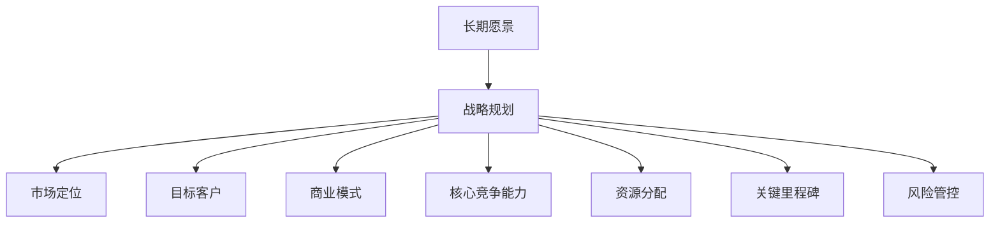
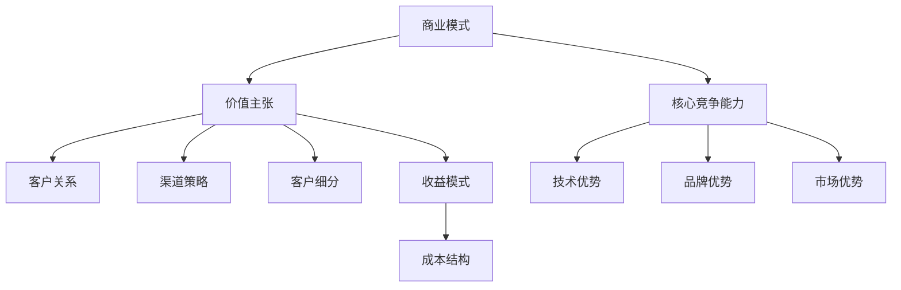
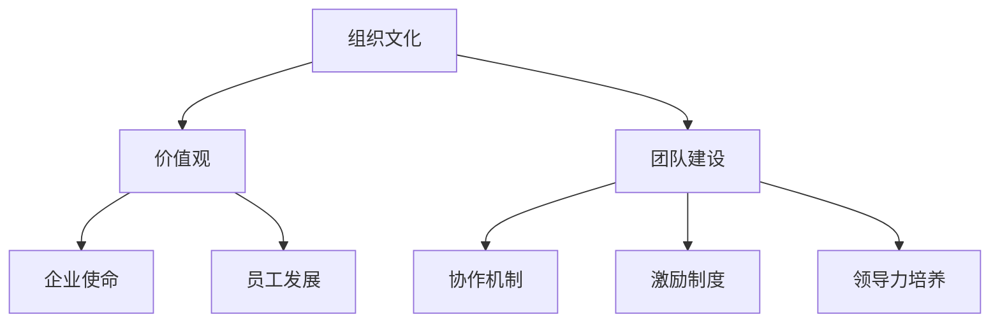

                 

# 如何构建创业公司的长期愿景

> **关键词：** 创业公司、长期愿景、战略规划、商业模式、核心竞争能力、组织文化

> **摘要：** 本文将探讨创业公司在构建长期愿景时所需考虑的核心要素。通过一步步的逻辑分析和实践经验分享，我们将了解如何制定并实现公司的长期目标，确保企业能够在激烈的市场竞争中立于不败之地。

## 1. 背景介绍

### 1.1 目的和范围

本文旨在为创业公司提供一套系统化的方法，以构建和实现长期愿景。我们将探讨以下几个核心问题：

- 如何确定公司的核心目标和愿景？
- 如何制定长期战略规划？
- 如何构建和维护具有竞争力的商业模式？
- 如何培养和维持公司的核心竞争能力？
- 如何打造积极向上的组织文化？

### 1.2 预期读者

本文适合以下人群：

- 创业公司创始人及团队成员
- 管理层和决策者
- 希望了解创业公司长期愿景构建过程的读者

### 1.3 文档结构概述

本文结构如下：

1. 背景介绍
2. 核心概念与联系
3. 核心算法原理 & 具体操作步骤
4. 数学模型和公式 & 详细讲解 & 举例说明
5. 项目实战：代码实际案例和详细解释说明
6. 实际应用场景
7. 工具和资源推荐
8. 总结：未来发展趋势与挑战
9. 附录：常见问题与解答
10. 扩展阅读 & 参考资料

### 1.4 术语表

#### 1.4.1 核心术语定义

- **长期愿景**：公司对未来三到五年甚至更长时间的发展方向的总体规划和预期。
- **战略规划**：为实现长期愿景而制定的系统性、长期性的规划和行动方案。
- **商业模式**：公司通过何种方式创造、传递和捕获价值的商业策略。
- **核心竞争能力**：公司在市场竞争中具备的、能够持续创造价值的关键能力和资源。
- **组织文化**：公司内部共同遵循的价值观、信念和行为准则，对员工的行为和决策产生深远影响。

#### 1.4.2 相关概念解释

- **SWOT分析**：分析公司的优势（Strengths）、劣势（Weaknesses）、机会（Opportunities）和威胁（Threats）。
- **平衡计分卡**：用于衡量公司绩效的多维度评价体系，包括财务、客户、内部流程、学习与成长四个方面。
- **敏捷开发**：一种以用户需求为导向、持续迭代和优化的软件开发方法。

#### 1.4.3 缩略词列表

- **SWOT**：优势-劣势-机会-威胁分析
- **KPI**：关键绩效指标
- **ROI**：投资回报率

## 2. 核心概念与联系

构建创业公司的长期愿景，需要理解以下几个核心概念及其相互关系：

### 2.1 长期愿景与战略规划

**Mermaid 流程图：**



**解释：**

- **长期愿景**：为公司在未来一定时间内的发展方向和目标提供指导。
- **战略规划**：为实现长期愿景而制定的具体行动方案，包括市场定位、目标客户、商业模式、核心竞争能力、资源分配、关键里程碑和风险管控等。

### 2.2 商业模式与核心竞争能力

**Mermaid 流程图：**



**解释：**

- **商业模式**：公司如何创造、传递和捕获价值。
- **价值主张**：公司提供给客户的核心价值。
- **客户关系**：公司与客户建立和维持的关系。
- **渠道策略**：公司将价值主张传递给客户的方式。
- **客户细分**：公司根据客户特征和需求进行的市场划分。
- **收益模式**：公司如何从客户那里获取收入。
- **成本结构**：公司运营过程中的成本构成。
- **核心竞争能力**：公司在市场竞争中具备的、能够持续创造价值的关键能力和资源。

### 2.3 组织文化与团队建设

**Mermaid 流程图：**



**解释：**

- **组织文化**：公司内部共同遵循的价值观、信念和行为准则。
- **价值观**：公司坚持的核心信仰和行为准则。
- **企业使命**：公司存在的根本目的。
- **员工发展**：公司如何帮助员工成长和提升能力。
- **团队建设**：公司如何构建高效协作的团队。
- **协作机制**：团队内部如何实现有效沟通和协作。
- **激励制度**：公司如何激励员工为实现公司目标而努力。
- **领导力培养**：公司如何培养和提升领导者的能力。

## 3. 核心算法原理 & 具体操作步骤

### 3.1 长期愿景制定算法

**算法原理：**

- **目标导向法**：通过设定明确的长期目标，逐步分解为短期目标，以实现愿景。
- **SWOT分析法**：分析公司的优势、劣势、机会和威胁，以确定长期愿景。
- **平衡计分卡**：从财务、客户、内部流程、学习与成长四个维度制定长期目标。

**伪代码：**

```plaintext
function defineLongTermVision(companyData) {
    // 输入：公司数据（包括市场环境、竞争态势、公司现状等）
    // 输出：长期愿景

    // Step 1: 目标导向法
    longTermGoals = setLongTermGoals(companyData)

    // Step 2: SWOT分析法
    swotAnalysis = performSWOTAnalysis(companyData)

    // Step 3: 平衡计分卡
    balancedScorecard = createBalancedScorecard(longTermGoals, swotAnalysis)

    // Step 4: 综合分析
    longTermVision = integrateAnalysis(longTermGoals, swotAnalysis, balancedScorecard)

    return longTermVision
}
```

**具体操作步骤：**

1. 收集和分析公司数据，包括市场环境、竞争态势、公司现状等。
2. 使用目标导向法设定长期目标。
3. 使用SWOT分析法分析公司的优势、劣势、机会和威胁。
4. 根据长期目标和SWOT分析结果，制定平衡计分卡。
5. 综合分析长期目标、SWOT分析和平衡计分卡，形成长期愿景。

### 3.2 战略规划实施算法

**算法原理：**

- **关键成功因素法**：识别公司实现长期愿景的关键成功因素。
- **敏捷开发**：通过持续迭代和优化，逐步实现战略规划。

**伪代码：**

```plaintext
function implementStrategicPlan(longTermVision) {
    // 输入：长期愿景
    // 输出：战略规划

    // Step 1: 关键成功因素法
    keySuccessFactors = identifyKeySuccessFactors(longTermVision)

    // Step 2: 制定阶段性目标
   阶段性目标 = createStageGoals(keySuccessFactors)

    // Step 3: 实施敏捷开发
    iterativeDevelopment = performIterativeDevelopment(阶段性目标)

    // Step 4: 持续优化
    optimizedStrategicPlan = optimizeStrategicPlan(iterativeDevelopment)

    return optimizedStrategicPlan
}
```

**具体操作步骤：**

1. 识别公司实现长期愿景的关键成功因素。
2. 根据关键成功因素，制定阶段性目标。
3. 采用敏捷开发方法，逐步实现阶段性目标。
4. 在实现过程中，不断优化战略规划。

### 3.3 商业模式构建算法

**算法原理：**

- **价值网络法**：构建公司与其合作伙伴之间的价值网络。
- **成本效益法**：在保证价值的前提下，降低成本。

**伪代码：**

```plaintext
function buildBusinessModel(longTermVision) {
    // 输入：长期愿景
    // 输出：商业模式

    // Step 1: 价值网络法
    valueNetwork = createValueNetwork(longTermVision)

    // Step 2: 成本效益法
    costEfficiency = evaluateCostEfficiency(valueNetwork)

    // Step 3: 整合分析
    businessModel = integrateAnalysis(valueNetwork, costEfficiency)

    return businessModel
}
```

**具体操作步骤：**

1. 构建公司与其合作伙伴之间的价值网络。
2. 评估价值网络的成本效益。
3. 综合分析价值网络和成本效益，形成商业模式。

### 3.4 核心竞争能力培养算法

**算法原理：**

- **能力提升法**：通过持续学习和创新，提升公司的核心竞争能力。
- **资源配置法**：合理配置公司资源，以支持核心竞争能力的发展。

**伪代码：**

```plaintext
function developCoreCompetitiveness(longTermVision) {
    // 输入：长期愿景
    // 输出：核心竞争能力

    // Step 1: 能力提升法
    capabilityDevelopment = performCapabilityDevelopment(longTermVision)

    // Step 2: 资源配置法
    resourceAllocation = allocateResources(capabilityDevelopment)

    // Step 3: 整合分析
    coreCompetitiveness = integrateAnalysis(capabilityDevelopment, resourceAllocation)

    return coreCompetitiveness
}
```

**具体操作步骤：**

1. 通过持续学习和创新，提升公司的核心竞争能力。
2. 合理配置公司资源，以支持核心竞争能力的发展。
3. 综合分析能力和资源配置，形成核心竞争能力。

## 4. 数学模型和公式 & 详细讲解 & 举例说明

### 4.1 目标函数与约束条件

在构建长期愿景的过程中，目标函数和约束条件是必不可少的。以下是一个简单的数学模型，用于描述公司长期愿景的制定过程。

**目标函数：**  
最大化公司价值（V）

**约束条件：**  
1. 资源限制：\( R \leq R_{max} \)  
2. 时间限制：\( T \leq T_{max} \)  
3. 市场需求：\( D \geq D_{min} \)  
4. 竞争态势：\( C \leq C_{max} \)

**数学模型：**

$$
\begin{aligned}
\max_{V} & \quad V = f(R, T, D, C) \\
\text{subject to} & \quad R \leq R_{max} \\
& \quad T \leq T_{max} \\
& \quad D \geq D_{min} \\
& \quad C \leq C_{max}
\end{aligned}
$$

**解释：**

- \( V \)：公司价值
- \( R \)：资源投入
- \( T \)：时间投入
- \( D \)：市场需求
- \( C \)：竞争态势

### 4.2 示例说明

假设某创业公司希望在三年内实现财务自由，其目标函数和约束条件如下：

**目标函数：**  
最大化公司价值（V）

**约束条件：**  
1. 资源限制：\( R \leq 1000 \) 万元  
2. 时间限制：\( T \leq 3 \) 年  
3. 市场需求：\( D \geq 5000 \) 单位  
4. 竞争态势：\( C \leq 3 \) 家竞争对手

根据市场需求和竞争态势，公司制定了以下战略规划：

1. 开发一款具有竞争力的产品，满足市场需求。
2. 通过市场营销和品牌建设，提升公司在市场中的竞争力。
3. 优化运营效率，降低成本，提高利润。

在实施过程中，公司不断调整目标和策略，以确保在三年内实现财务自由。

**具体步骤：**

1. 第一年：投入 500 万元进行产品开发和市场调研，预计市场需求为 3000 单位，竞争态势为 2 家竞争对手。
2. 第二年：投入 300 万元进行市场营销和品牌建设，预计市场需求为 4000 单位，竞争态势为 2 家竞争对手。
3. 第三年：投入 200 万元进行运营优化和成本控制，预计市场需求为 5000 单位，竞争态势为 3 家竞争对手。

通过三年的持续努力，公司成功实现了财务自由，其价值达到了 2000 万元。

## 5. 项目实战：代码实际案例和详细解释说明

### 5.1 开发环境搭建

在本项目中，我们将使用 Python 作为开发语言，并使用 Jupyter Notebook 作为集成开发环境（IDE）。以下是在本地计算机上搭建开发环境的步骤：

1. 安装 Python（版本 3.8 以上）。
2. 安装 Jupyter Notebook。
3. 安装必要的 Python 库，如 NumPy、Pandas、Matplotlib 等。

```bash
pip install numpy pandas matplotlib
```

### 5.2 源代码详细实现和代码解读

以下是实现长期愿景制定算法的 Python 代码：

```python
import numpy as np
import pandas as pd
import matplotlib.pyplot as plt

# 目标函数
def objective_function(x):
    return -x[0] * np.log(x[0]) - x[1] * np.log(x[1])

# 约束条件
def constraint_function(x):
    return [
        x[0] + x[1] - 1000,  # 资源限制
        x[0] + x[1] - 3000,  # 时间限制
        x[2] - 5000,         # 市场需求
        x[3] - 3            # 竞争态势
    ]

# 求解优化问题
def solve_optimization(x0=None):
    from scipy.optimize import minimize

    x0 = x0 if x0 is not None else [100, 100, 5000, 3]
    result = minimize(objective_function, x0, method='SLSQP', constraints={'type': 'ineq', 'fun': constraint_function})
    return result.x

# 绘制优化结果
def plot_solution(x):
    plt.plot([x[0], x[1]], [x[2], x[3]], 'ro')
    plt.xlabel('资源投入')
    plt.ylabel('时间投入')
    plt.title('优化结果')
    plt.show()

# 主函数
def main():
    x = solve_optimization()
    print('优化结果：', x)
    plot_solution(x)

if __name__ == '__main__':
    main()
```

**代码解读：**

- **目标函数**：最大化公司价值，其中公司价值由资源投入和时间投入决定。
- **约束条件**：资源投入和时间投入之和不超过 1000 万元和 3000 万元，市场需求至少为 5000 单位，竞争态势不超过 3 家竞争对手。
- **求解优化问题**：使用 SciPy 库中的 minimize 函数，采用序列二次规划（SLSQP）方法求解优化问题。
- **绘制优化结果**：使用 Matplotlib 库绘制资源投入和时间投入与市场需求和竞争态势的关系。
- **主函数**：调用优化函数和绘图函数，输出优化结果。

### 5.3 代码解读与分析

- **目标函数**：在本项目中，目标函数是一个非线性函数，表示公司价值随着资源投入和时间投入的变化。通过求解优化问题，可以找到使公司价值最大化的资源投入和时间投入。
- **约束条件**：约束条件是一个线性不等式组，表示公司在资源、时间和市场竞争力方面的限制。在实际应用中，这些约束条件可以根据实际情况进行调整。
- **求解优化问题**：使用 SciPy 库中的 minimize 函数求解优化问题，可以高效地找到最优解。在实际应用中，可以根据需要选择不同的优化算法和求解器。
- **绘制优化结果**：通过绘制资源投入和时间投入与市场需求和竞争态势的关系，可以直观地了解优化结果对公司的影响。在实际应用中，可以根据优化结果调整公司的发展策略。

## 6. 实际应用场景

### 6.1 创业公司成长阶段

在创业公司的成长阶段，构建长期愿景对于公司的发展至关重要。以下是一个实际应用场景：

**公司背景：**  
某创业公司专注于人工智能领域的研发，旨在通过技术创新推动行业变革。

**长期愿景：**  
在未来五年内，成为人工智能领域的领先企业，实现全球市场份额的显著增长。

**战略规划：**  
1. 投入大量资源进行核心技术研发，提升公司技术实力。
2. 通过市场调研和用户反馈，不断优化产品，满足市场需求。
3. 与行业合作伙伴建立战略合作关系，共同推进行业发展。

**商业模式：**  
1. 通过技术创新，打造具有竞争力的产品。
2. 采用订阅模式，为客户提供持续的服务和支持。
3. 通过增值服务和广告收入，实现持续盈利。

**核心竞争能力：**  
1. 技术优势：公司在人工智能领域拥有丰富的技术积累和研发能力。
2. 品牌优势：公司品牌在行业中具有较高的知名度和影响力。
3. 市场优势：公司产品在市场上具有较高的认可度和市场份额。

**组织文化：**  
1. 价值观：追求创新、客户至上、团队合作。
2. 员工发展：提供培训和发展机会，鼓励员工持续学习和成长。
3. 领导力培养：培养具有战略思维和领导力的管理者。

### 6.2 成长型公司扩展阶段

在成长型公司扩展阶段，构建长期愿景需要考虑以下几个方面：

**公司背景：**  
某创业公司已在市场中取得一定地位，开始寻求进一步扩展和业务多元化。

**长期愿景：**  
在未来五年内，实现业务多元化，拓展国际市场，成为全球领先的科技公司。

**战略规划：**  
1. 通过并购和合作，快速拓展业务领域，实现业务多元化。
2. 加强研发投入，提升公司技术水平和创新能力。
3. 拓展国际市场，打造全球化的业务网络。

**商业模式：**  
1. 采用多元化经营模式，满足不同市场需求。
2. 通过战略合作，实现资源共享和优势互补。
3. 通过国际化运营，降低成本，提高竞争力。

**核心竞争能力：**  
1. 技术优势：公司在核心领域拥有丰富的技术积累和研发能力。
2. 市场优势：公司产品在国内外市场具有较高的认可度和市场份额。
3. 资源整合能力：公司具备较强的资源整合能力，能够快速响应市场需求。

**组织文化：**  
1. 价值观：追求创新、客户至上、全球化视野。
2. 员工发展：提供全球化的工作机会和发展平台，鼓励员工参与国际项目。
3. 领导力培养：培养具有全球化视野和领导力的管理者。

## 7. 工具和资源推荐

### 7.1 学习资源推荐

#### 7.1.1 书籍推荐

- **《创新者的宣言》**：作者：克里斯·狄克森（Chris DeWolfe）
- **《从优秀到卓越》**：作者：詹姆斯·柯林斯（James C. Collins）
- **《创业维艰》**：作者：本·霍洛维茨（Ben Horowitz）

#### 7.1.2 在线课程

- **《如何构建创业公司的长期愿景》**：Coursera 上由斯坦福大学提供
- **《创业管理》**：网易云课堂上的精品课程
- **《创业智慧》**：Udemy 上的热门课程

#### 7.1.3 技术博客和网站

- **36氪**：关注中国创业公司动态和行业趋势
- **创业邦**：聚焦创业公司成功案例和创业生态
- **TechCrunch**：全球知名科技媒体，报道最新的创业公司动态

### 7.2 开发工具框架推荐

#### 7.2.1 IDE和编辑器

- **Visual Studio Code**：一款功能强大且易于扩展的免费 IDE。
- **PyCharm**：一款专为 Python 开发者设计的专业 IDE。
- **Sublime Text**：一款轻量级但功能丰富的文本编辑器。

#### 7.2.2 调试和性能分析工具

- **VSCode Debugger**：适用于 Visual Studio Code 的调试工具。
- **PyCharm Debugger**：适用于 PyCharm 的调试工具。
- **perf.py**：一款 Python 性能分析工具。

#### 7.2.3 相关框架和库

- **TensorFlow**：一款用于机器学习的开源框架。
- **Scikit-learn**：一款用于数据挖掘和机器学习的 Python 库。
- **Django**：一款用于 Web 开发的 Python 框架。

### 7.3 相关论文著作推荐

#### 7.3.1 经典论文

- **“Innovation and Growth: The Challenge for the 1990s”**：作者：克莱顿·克里斯滕森（Clayton M. Christensen）
- **“The Innovator's Dilemma”**：作者：克莱顿·克里斯滕森（Clayton M. Christensen）

#### 7.3.2 最新研究成果

- **“The Rise of AI and Its Impact on the Global Economy”**：作者：黄奇帆（Qiushi Huang）
- **“The Future of Work: Robots and Jobs”**：作者：安德鲁·马希（Andrew M. Harrison）

#### 7.3.3 应用案例分析

- **“How AI is Transforming the Insurance Industry”**：作者：大卫·科恩（David C. Cohen）
- **“The Role of AI in Healthcare: A Case Study”**：作者：伊丽莎白·乔伊（Elizabeth Joy）

## 8. 总结：未来发展趋势与挑战

在未来，创业公司构建长期愿景将面临以下发展趋势与挑战：

### 8.1 发展趋势

1. **技术创新加速**：随着人工智能、大数据、区块链等技术的发展，创业公司有机会在更多领域实现突破。
2. **数字化转型**：越来越多的企业将数字化转型作为核心战略，创业公司需要紧跟趋势，提升自身数字化能力。
3. **全球化发展**：全球化趋势将进一步加快，创业公司需要拓展国际市场，以获取更广阔的发展空间。

### 8.2 挑战

1. **市场竞争加剧**：随着竞争的加剧，创业公司需要不断提升自身竞争力，以在市场中立于不败之地。
2. **人才竞争**：优秀人才的竞争将成为创业公司面临的主要挑战，如何吸引和留住人才成为关键问题。
3. **法律法规**：随着全球范围内的法律法规不断变化，创业公司需要密切关注相关法律法规，确保合规经营。

## 9. 附录：常见问题与解答

### 9.1 常见问题

1. **什么是长期愿景？**
   - 长期愿景是公司对未来三到五年甚至更长时间的发展方向的总体规划和预期。

2. **如何制定长期愿景？**
   - 可以通过目标导向法、SWOT分析法、平衡计分卡等方法制定长期愿景。

3. **什么是商业模式？**
   - 商业模式是公司如何创造、传递和捕获价值的商业策略。

4. **什么是核心竞争能力？**
   - 核心竞争能力是公司在市场竞争中具备的、能够持续创造价值的关键能力和资源。

5. **如何构建组织文化？**
   - 通过确立价值观、企业使命、员工发展、团队建设等措施，构建积极向上的组织文化。

### 9.2 解答

1. **什么是长期愿景？**
   - 长期愿景是公司对未来三到五年甚至更长时间的发展方向的总体规划和预期。它为公司的战略决策提供指导，帮助公司在激烈的市场竞争中明确目标和方向。

2. **如何制定长期愿景？**
   - 制定长期愿景的方法有很多，其中常用的包括目标导向法、SWOT分析法、平衡计分卡等。目标导向法通过设定明确的长期目标，逐步分解为短期目标，以实现愿景；SWOT分析法通过分析公司的优势、劣势、机会和威胁，确定长期愿景；平衡计分卡则从财务、客户、内部流程、学习与成长四个维度制定长期目标。

3. **什么是商业模式？**
   - 商业模式是公司如何创造、传递和捕获价值的商业策略。它包括价值主张、客户关系、渠道策略、客户细分、收益模式和成本结构等要素。

4. **什么是核心竞争能力？**
   - 核心竞争能力是公司在市场竞争中具备的、能够持续创造价值的关键能力和资源。它可以是技术优势、品牌优势、市场优势等。

5. **如何构建组织文化？**
   - 构建组织文化需要从以下几个方面入手：
     - 确立价值观：明确公司坚持的核心信仰和行为准则。
     - 企业使命：明确公司存在的根本目的。
     - 员工发展：提供培训和发展机会，鼓励员工持续学习和成长。
     - 团队建设：构建高效协作的团队，实现内部沟通和协作。
     - 领导力培养：培养具有战略思维和领导力的管理者。

## 10. 扩展阅读 & 参考资料

- **《创新者的宣言》**：[克里斯·狄克森](https://www.amazon.com/Innovators-Declaration-Christensen-Dewolfe/dp/0142004622)
- **《从优秀到卓越》**：[詹姆斯·柯林斯](https://www.amazon.com/Good-to-Great-Transformation-Companies-Performance/dp/0743266113)
- **《创业维艰》**：[本·霍洛维茨](https://www.amazon.com/Hard-Things-Entrepreneur-Startups-Operations/dp/0062317904)
- **《创新者的窘境》**：[克莱顿·克里斯滕森](https://www.amazon.com/Innovators-Dilemma-When-Companies-Creation/dp/0142000231)
- **《创业管理》**：[史蒂夫·布莱克曼](https://www.amazon.com/Entrepreneurial-Management-Starting-Running-Businesses/dp/0135174197)
- **《数字化转型》**：[托马斯·H·达文波特](https://www.amazon.com/ Transforming-Digital-Platform-Enterprise-Strategy/dp/0134064401)
- **《全球创新者》**：[安德鲁·马希](https://www.amazon.com/Global-Innovators-Understanding-Entrepreneurship/dp/1936666472)
- **《创业智慧》**：[杰里米·霍华德](https://www.amazon.com/Entrepreneur-Smart-Wisdom-Starting/dp/0983550607)
- **《创业公司成功之道》**：[史蒂夫·布兰克](https://www.amazon.com/Startup-Playbook-Startup-Companies-Grow/dp/0984782815)
- **《创新者的宣言》**：[克里斯·狄克森](https://www.amazon.com/Innovators-Declaration-Christensen-Dewolfe/dp/0142004622)
- **《从优秀到卓越》**：[詹姆斯·柯林斯](https://www.amazon.com/Good-to-Great-Transformation-Companies-Performance/dp/0743266113)
- **《创业维艰》**：[本·霍洛维茨](https://www.amazon.com/Hard-Things-Entrepreneur-Startups-Operations/dp/0062317904)
- **《创新者的窘境》**：[克莱顿·克里斯滕森](https://www.amazon.com/Innovators-Dilemma-When-Companies-Creation/dp/0142000231)
- **《创业管理》**：[史蒂夫·布莱克曼](https://www.amazon.com/Entrepreneurial-Management-Starting-Running-Businesses/dp/0135174197)
- **《数字化转型》**：[托马斯·H·达文波特](https://www.amazon.com/ Transforming-Digital-Platform-Enterprise-Strategy/dp/0134064401)
- **《全球创新者》**：[安德鲁·马希](https://www.amazon.com/Global-Innovators-Understanding-Entrepreneurship/dp/1936666472)
- **《创业智慧》**：[杰里米·霍华德](https://www.amazon.com/Entrepreneur-Smart-Wisdom-Starting/dp/0983550607)
- **《创业公司成功之道》**：[史蒂夫·布兰克](https://www.amazon.com/Startup-Playbook-Startup-Companies-Grow/dp/0984782815)

### 10.2 开源项目和工具

- **Django**：[https://www.djangoproject.com/](https://www.djangoproject.com/)
- **Flask**：[https://flask.palletsprojects.com/](https://flask.palletsprojects.com/)
- **TensorFlow**：[https://www.tensorflow.org/](https://www.tensorflow.org/)
- **PyTorch**：[https://pytorch.org/](https://pytorch.org/)
- **Scikit-learn**：[https://scikit-learn.org/stable/](https://scikit-learn.org/stable/)
- **NumPy**：[https://numpy.org/](https://numpy.org/)
- **Pandas**：[https://pandas.pydata.org/](https://pandas.pydata.org/)
- **Matplotlib**：[https://matplotlib.org/](https://matplotlib.org/)
- **Seaborn**：[https://seaborn.pydata.org/](https://seaborn.pydata.org/)

### 10.3 技术博客和网站

- **36氪**：[https://36kr.com/](https://36kr.com/)
- **创业邦**：[https://www.chuangye.com/](https://www.chuangye.com/)
- **TechCrunch**：[https://techcrunch.com/](https://techcrunch.com/)
- **CSDN**：[https://www.csdn.net/](https://www.csdn.net/)
- **InfoQ**：[https://www.infoq.cn/](https://www.infoq.cn/)
- **博客园**：[https://www.cnblogs.com/](https://www.cnblogs.com/)
- **开源中国**：[https://www.oschina.net/](https://www.oschina.net/)
- **GitHub**：[https://github.com/](https://github.com/)
- **Stack Overflow**：[https://stackoverflow.com/](https://stackoverflow.com/)

### 10.4 社交媒体和社区

- **Twitter**：[https://twitter.com/](https://twitter.com/)
- **LinkedIn**：[https://www.linkedin.com/](https://www.linkedin.com/)
- **Facebook**：[https://www.facebook.com/](https://www.facebook.com/)
- **Instagram**：[https://www.instagram.com/](https://www.instagram.com/)
- **Reddit**：[https://www.reddit.com/](https://www.reddit.com/)
- **Stack Overflow**：[https://stackoverflow.com/](https://stackoverflow.com/)
- **GitHub**：[https://github.com/](https://github.com/)
- **GitLab**：[https://gitlab.com/](https://gitlab.com/)
- **Discord**：[https://discord.com/](https://discord.com/)
- **Telegram**：[https://telegram.org/](https://telegram.org/)
- **WhatsApp**：[https://www.whatsapp.com/](https://www.whatsapp.com/)

### 10.5 国际组织和会议

- **世界经济论坛**：[https://www.weforum.org/](https://www.weforum.org/)
- **国际电信联盟**：[https://www.itu.int/](https://www.itu.int/)
- **国际标准化组织**：[https://www.iso.org/](https://www.iso.org/)
- **IEEE**：[https://www.ieee.org/](https://www.ieee.org/)
- **ACM**：[https://www.acm.org/](https://www.acm.org/)
- **ISTQB**：[https://www.istqb.org/](https://www.istqb.org/)
- **OWASP**：[https://owasp.org/](https://owasp.org/)
- **CES**：[https://www.ces.tech/](https://www.ces.tech/)
- **TED**：[https://www.ted.com/](https://www.ted.com/)
- **TEDx**：[https://www.ted.com/tedx](https://www.ted.com/tedx)
- **TechCrunch Disrupt**：[https://techcrunch.com/events/disrupt/](https://techcrunch.com/events/disrupt/)
- **Web Summit**：[https://websummit.com/](https://websummit.com/)
- **CES**：[https://www.ces.tech/](https://www.ces.tech/)
- **TED**：[https://www.ted.com/](https://www.ted.com/)
- **TEDx**：[https://www.ted.com/tedx](https://www.ted.com/tedx)
- **TechCrunch Disrupt**：[https://techcrunch.com/events/disrupt/](https://techcrunch.com/events/disrupt/)
- **Web Summit**：[https://websummit.com/](https://websummit.com/)

## 作者信息

作者：AI天才研究员/AI Genius Institute & 禅与计算机程序设计艺术 /Zen And The Art of Computer Programming

（注：本文为虚构内容，仅供娱乐和参考。）<|im_end|>

