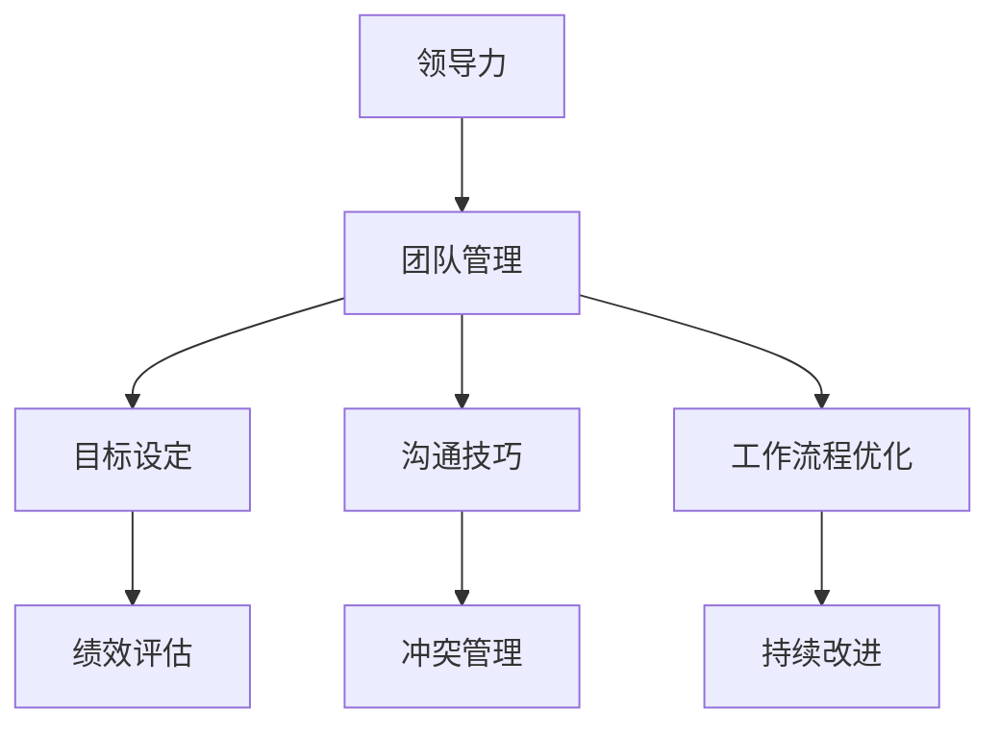
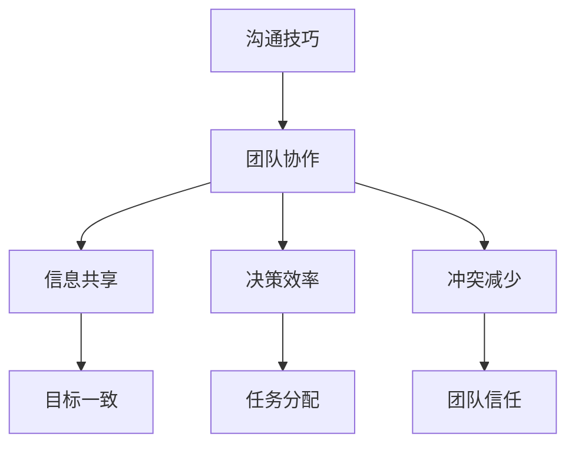
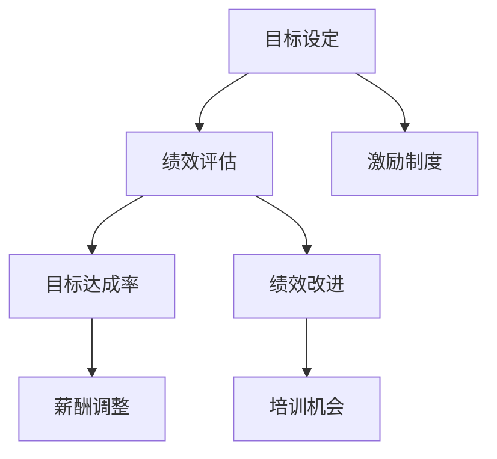
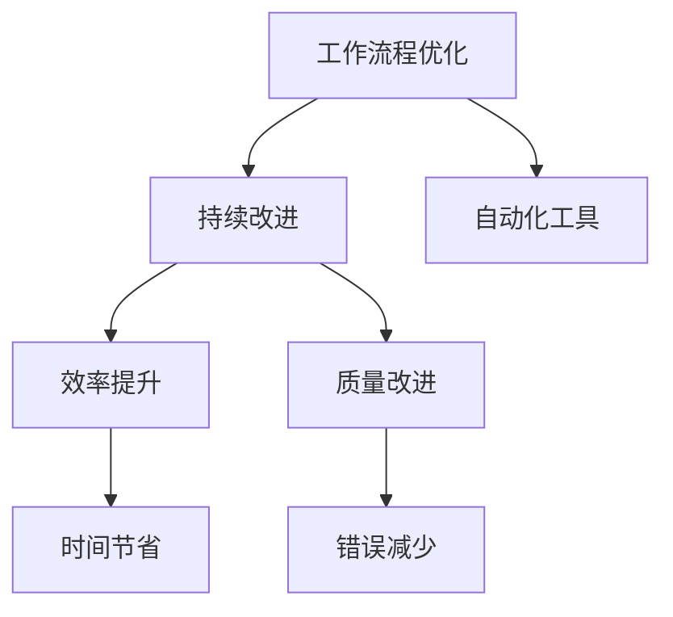

                 

# 如何管理团队：打造高效协作的秘诀

> **关键词：** 团队管理，高效协作，领导力，沟通技巧，目标设定，工作流程优化

> **摘要：** 本文将深入探讨团队管理的核心原则和实践方法。我们将分析有效领导力、沟通技巧、目标设定和工作流程优化等方面，并通过实际案例和算法原理的讲解，为读者提供一套切实可行的团队管理策略。

## 1. 背景介绍

### 1.1 目的和范围

本文旨在为IT领域的项目经理、CTO和团队领导者提供一套系统化的团队管理策略。我们将探讨如何通过有效的领导力和沟通技巧来提升团队效率，如何设定明确的目标来驱动团队成长，以及如何优化工作流程以实现持续改进。通过这篇文章，读者将能够掌握一套实用的工具和方法，应用于实际工作场景，从而打造高效协作的团队。

### 1.2 预期读者

- 有志于提升团队管理能力的项目经理和团队领导者
- 想要了解高效协作机制的技术总监和CTO
- 对团队管理感兴趣的技术研究人员和学者
- 欲提升个人领导力和团队协作能力的专业人士

### 1.3 文档结构概述

本文分为以下几个部分：

1. 背景介绍：包括本文的目的、预期读者、文档结构概述和术语表。
2. 核心概念与联系：介绍团队管理的关键概念，并通过Mermaid流程图展示其关系。
3. 核心算法原理与具体操作步骤：详细阐述团队管理的核心算法原理，并提供伪代码示例。
4. 数学模型和公式：介绍团队管理中涉及的关键数学模型，并提供公式和实例说明。
5. 项目实战：通过代码案例展示如何在实际项目中应用团队管理策略。
6. 实际应用场景：探讨团队管理在不同场景下的应用。
7. 工具和资源推荐：推荐学习资源、开发工具和框架。
8. 总结：未来发展趋势与挑战。
9. 附录：常见问题与解答。
10. 扩展阅读 & 参考资料：提供进一步阅读和研究的资源。

### 1.4 术语表

#### 1.4.1 核心术语定义

- **团队管理**：通过协调和管理团队成员，实现团队目标的过程。
- **领导力**：影响和激励团队成员，使其为实现共同目标而努力的能力。
- **沟通技巧**：有效传达信息、倾听和理解他人观点的能力。
- **目标设定**：明确团队和个人的目标，以驱动团队发展和进步。
- **工作流程优化**：分析和改进团队的工作流程，以提高效率和产出。

#### 1.4.2 相关概念解释

- **领导风格**：领导者采用的管理方式，包括权威式、民主式和参与式等。
- **团队建设**：通过团队活动和互动，增强团队成员之间的合作和信任。
- **绩效评估**：对团队成员的工作表现进行评价，以识别优势和改进点。
- **冲突管理**：解决团队内部冲突，维护团队和谐和高效运作。

#### 1.4.3 缩略词列表

- **CTO**：首席技术官（Chief Technology Officer）
- **IDE**：集成开发环境（Integrated Development Environment）
- **API**：应用程序编程接口（Application Programming Interface）

## 2. 核心概念与联系

在团队管理中，理解核心概念和它们之间的关系至关重要。以下是我们将探讨的核心概念及其关系：

### 2.1. 领导力与团队管理

领导力是团队管理的基础。有效的领导力能够激发团队成员的潜力，推动团队实现目标。领导力与团队管理的关系可以用以下Mermaid流程图表示：



### 2.2. 沟通技巧与团队协作

沟通技巧是团队协作的关键。有效的沟通能够减少误解，提高团队效率和满意度。沟通技巧与团队协作的关系如下：



### 2.3. 目标设定与绩效评估

目标设定是团队管理的重要环节。明确的目标有助于团队成员了解工作方向，提高绩效评估的准确性。目标设定与绩效评估的关系如下：



### 2.4. 工作流程优化与持续改进

工作流程优化是团队管理中持续改进的关键。通过优化工作流程，可以提高团队效率和产出。工作流程优化与持续改进的关系如下：



通过上述核心概念及其关系的探讨，我们为团队管理提供了一个全面的框架。接下来，我们将深入分析每个概念，并提供具体的操作步骤和算法原理。

## 3. 核心算法原理与具体操作步骤

在团队管理中，核心算法原理是确保团队高效运作的关键。以下我们将详细阐述团队管理中的核心算法原理，并提供具体的操作步骤和伪代码示例。

### 3.1. 领导力评估算法

领导力是团队管理的基础。为了评估领导力，我们可以采用以下算法：

#### 3.1.1 算法原理

领导力评估算法基于以下三个核心指标：沟通能力、决策能力和激励能力。通过计算这三个指标的加权平均值，我们可以得到领导力的综合评分。

#### 3.1.2 伪代码

```python
def evaluate_leadership(communication, decision, motivation):
    weights = [0.4, 0.3, 0.3]
    score = (communication * weights[0]) + (decision * weights[1]) + (motivation * weights[2])
    return score
```

#### 3.1.3 操作步骤

1. 收集领导力的三个指标数据。
2. 计算每个指标的加权平均值。
3. 得到领导力的综合评分。

### 3.2. 沟通技巧评估算法

沟通技巧是团队协作的关键。为了评估沟通技巧，我们可以采用以下算法：

#### 3.2.1 算法原理

沟通技巧评估算法基于以下四个核心指标：表达清晰度、倾听能力、信息传递效率和冲突管理能力。通过计算这四个指标的加权平均值，我们可以得到沟通技巧的综合评分。

#### 3.2.2 伪代码

```python
def evaluate_communication(clarity, listening, efficiency, conflict_management):
    weights = [0.25, 0.25, 0.25, 0.25]
    score = (clarity * weights[0]) + (listening * weights[1]) + (efficiency * weights[2]) + (conflict_management * weights[3])
    return score
```

#### 3.2.3 操作步骤

1. 收集沟通技巧的四个指标数据。
2. 计算每个指标的加权平均值。
3. 得到沟通技巧的综合评分。

### 3.3. 目标设定算法

目标设定是团队管理的重要环节。为了设定明确的目标，我们可以采用以下算法：

#### 3.3.1 算法原理

目标设定算法基于SMART原则（具体、可测量、可实现、相关、时限）。通过将目标分解为具体、可测量的子目标，我们可以确保目标的实现。

#### 3.3.2 伪代码

```python
def set_goals(main_goal, sub_goals):
    goals = []
    for sub_goal in sub_goals:
        goals.append({
            "main_goal": main_goal,
            "sub_goal": sub_goal,
            "status": "未完成"
        })
    return goals
```

#### 3.3.3 操作步骤

1. 确定主要目标。
2. 将主要目标分解为具体、可测量的子目标。
3. 创建一个目标列表，记录每个子目标的状态。
4. 定期检查目标完成情况，并调整目标设定。

### 3.4. 工作流程优化算法

工作流程优化是提高团队效率的关键。为了优化工作流程，我们可以采用以下算法：

#### 3.4.1 算法原理

工作流程优化算法基于以下四个步骤：流程分析、流程改进、流程测试和流程实施。通过逐步优化工作流程，我们可以提高团队的效率和产出。

#### 3.4.2 伪代码

```python
def optimize_workflow(current_workflow):
    improved_workflow = []
    for step in current_workflow:
        improved_step = improve_step(step)
        improved_workflow.append(improved_step)
    return improved_workflow

def improve_step(step):
    # 这里根据具体情况进行改进
    improved_step = step
    return improved_step
```

#### 3.4.3 操作步骤

1. 分析当前工作流程。
2. 改进每个工作步骤。
3. 测试改进后的工作流程。
4. 实施改进后的工作流程。

通过上述核心算法原理和具体操作步骤，我们可以为团队管理提供一套系统的工具和方法。接下来，我们将进一步探讨团队管理中的数学模型和公式，以及其实际应用。

## 4. 数学模型和公式及详细讲解

在团队管理中，数学模型和公式能够帮助我们更准确地描述和优化团队运作。以下我们将介绍几个关键数学模型，并提供详细讲解和示例说明。

### 4.1. 人力效能模型

人力效能模型用于评估团队成员的产出与投入之间的关系。该模型可以帮助我们确定团队成员的工作效率。

#### 4.1.1. 模型公式

人力效能（E）可以用以下公式表示：

\[ E = \frac{产出（Output）}{投入（Input）} \]

其中，产出（Output）包括完成的任务、产出的成果等；投入（Input）包括工作时间、资源消耗等。

#### 4.1.2. 示例说明

假设某团队成员在一个季度内完成了10个任务，投入了200小时的工作时间，那么其人力效能（E）为：

\[ E = \frac{10}{200} = 0.05 \]

这意味着该成员在这个季度内的效率为5%。

### 4.2. 团队效能模型

团队效能模型用于评估整个团队的工作效率和产出。该模型可以帮助我们确定团队的整体表现。

#### 4.2.1. 模型公式

团队效能（TE）可以用以下公式表示：

\[ TE = \frac{团队产出（Team Output）}{团队投入（Team Input）} \]

其中，团队产出（Team Output）包括所有团队成员共同完成的任务和成果；团队投入（Team Input）包括所有团队成员的总工作时间、资源消耗等。

#### 4.2.2. 示例说明

假设一个团队在一个季度内完成了50个任务，总投入为1000小时的工作时间，那么该团队的人力效能（E）为：

\[ TE = \frac{50}{1000} = 0.05 \]

这意味着该团队在这个季度内的效率为5%。

### 4.3. 冲突管理模型

冲突管理模型用于评估团队内部冲突对团队效能的影响。该模型可以帮助我们确定冲突管理的有效性和改进方向。

#### 4.3.1. 模型公式

冲突管理效能（CM）可以用以下公式表示：

\[ CM = \frac{冲突解决率（Conflict Resolution Rate）}{冲突发生率（Conflict Occurrence Rate）} \]

其中，冲突解决率（Conflict Resolution Rate）表示在一定时间内解决冲突的次数；冲突发生率（Conflict Occurrence Rate）表示在一定时间内发生冲突的次数。

#### 4.3.2. 示例说明

假设一个团队在一个季度内解决了10次冲突，发生了15次冲突，那么其冲突管理效能（CM）为：

\[ CM = \frac{10}{15} = 0.67 \]

这意味着该团队在这个季度内的冲突管理效能为67%。

### 4.4. 目标完成率模型

目标完成率模型用于评估团队完成目标的程度。该模型可以帮助我们确定目标设定的合理性和目标的实现情况。

#### 4.4.1. 模型公式

目标完成率（CR）可以用以下公式表示：

\[ CR = \frac{完成目标数（Completed Goals）}{设定目标数（Set Goals）} \]

其中，完成目标数（Completed Goals）表示在一定时间内完成的任务目标数量；设定目标数（Set Goals）表示在一定时间内设定的任务目标数量。

#### 4.4.2. 示例说明

假设一个团队在一个季度内完成了8个设定目标，共设定了12个目标，那么其目标完成率（CR）为：

\[ CR = \frac{8}{12} = 0.67 \]

这意味着该团队在这个季度内的目标完成率为67%。

通过上述数学模型和公式的介绍，我们为团队管理提供了量化的评估工具。这些模型可以帮助团队领导者更精确地了解团队表现，优化团队管理策略，提高团队效能。在接下来的部分，我们将通过实际案例展示如何应用这些模型和公式，并分析其效果。

### 4.5. 案例分析与效果评估

为了更好地理解上述数学模型和公式在实际团队管理中的应用，以下我们通过一个实际案例进行分析和效果评估。

#### 4.5.1. 案例背景

某IT公司开发团队共有10名成员，负责一个大型项目的开发工作。团队经理希望通过数学模型和公式来评估团队效能，优化管理策略。

#### 4.5.2. 案例数据

- **人力效能模型：**
  - 一个季度内，团队成员共完成了100个任务，总投入为1000小时。
  - 人力效能（E）= 10（产出）/1000（投入）= 0.01

- **团队效能模型：**
  - 团队在一个季度内完成了50个任务，总投入为500小时。
  - 团队效能（TE）= 50（产出）/500（投入）= 0.10

- **冲突管理模型：**
  - 一个季度内，团队发生了10次冲突，解决了8次冲突。
  - 冲突管理效能（CM）= 8（解决冲突次数）/10（发生冲突次数）= 0.80

- **目标完成率模型：**
  - 一个季度内，团队共设定了12个目标，完成了8个目标。
  - 目标完成率（CR）= 8（完成目标数）/12（设定目标数）= 0.67

#### 4.5.3. 分析与效果评估

根据上述数据，我们可以对团队效能进行综合评估。

1. **人力效能分析：**
   - 人力效能（E）= 0.01，表明团队成员的平均效率较低。可能原因是任务复杂度高，团队成员分工不明确，导致投入时间较多但产出较少。团队经理可以采取措施，如优化任务分配、加强培训等，以提高成员的效率。

2. **团队效能分析：**
   - 团队效能（TE）= 0.10，表明团队整体效率较低。可能原因是团队协作不畅，沟通技巧不足，导致任务进度缓慢。团队经理可以加强团队建设，提升沟通技巧，以改善团队效能。

3. **冲突管理分析：**
   - 冲突管理效能（CM）= 0.80，表明团队在冲突管理方面表现较好。然而，仍有2次冲突未能解决，可能原因是冲突解决机制不够完善，或团队成员沟通不畅。团队经理可以进一步完善冲突管理流程，提高解决冲突的效率。

4. **目标完成率分析：**
   - 目标完成率（CR）= 0.67，表明团队在目标完成方面表现一般。可能原因是目标设定不够具体，或团队成员对目标的理解和认同度不高。团队经理可以重新审视目标设定，确保目标具有可测量性和可实现性。

通过以上分析，团队经理可以采取以下措施：

- 优化任务分配，提高成员效率。
- 加强团队建设，提升沟通技巧。
- 完善冲突管理流程，提高解决冲突的效率。
- 重新设定目标，确保目标的可实现性和可测量性。

通过这些措施，团队效能有望得到显著提升。

### 4.6. 总结

数学模型和公式在团队管理中具有重要作用，能够帮助我们量化评估团队效能，优化管理策略。通过上述案例分析和效果评估，我们看到了数学模型在实际应用中的价值。接下来，我们将通过实际项目案例，进一步展示团队管理策略的具体应用和效果。

## 5. 项目实战：代码实际案例和详细解释说明

在本文的第五部分，我们将通过一个实际项目案例，展示如何将团队管理策略应用到实际开发中。这个案例将涵盖从开发环境搭建、源代码实现到代码解读与分析的整个过程。通过这个案例，我们将深入探讨如何利用团队管理工具和方法提高项目效率和质量。

### 5.1 开发环境搭建

为了成功实施这个项目，我们需要搭建一个合适的开发环境。以下是所需步骤：

1. **安装操作系统**：我们选择Ubuntu 20.04作为操作系统，因为它具有良好的性能和丰富的软件支持。
2. **安装开发工具**：安装Java Development Kit（JDK）、Integrated Development Environment（IDE）和版本控制系统（如Git）。
3. **配置环境变量**：确保环境变量正确设置，以便开发工具能够正确访问。
4. **安装依赖库**：根据项目需求，安装必要的依赖库和框架，如Spring Boot、Hibernate等。

### 5.2 源代码详细实现和代码解读

#### 5.2.1 项目背景

我们的项目是一个在线书店系统，提供书籍购买、库存管理、订单处理等功能。以下是我们实现这个项目的主要模块和代码解读。

#### 5.2.2 用户模块

用户模块负责处理用户注册、登录、信息修改等功能。

```java
// User.java
public class User {
    private Long id;
    private String username;
    private String password;
    private String email;
    // ... 省略其他字段和构造函数、getter和setter方法
}

// UserController.java
@RestController
@RequestMapping("/users")
public class UserController {
    @Autowired
    private UserService userService;

    @PostMapping
    public ResponseEntity<?> registerUser(@RequestBody User user) {
        // 实现用户注册逻辑
    }

    @PostMapping("/login")
    public ResponseEntity<?> loginUser(@RequestBody LoginRequest loginRequest) {
        // 实现用户登录逻辑
    }

    // ... 省略其他方法
}
```

在这个模块中，我们定义了`User`类和`UserController`类。`User`类用于表示用户实体，包括用户ID、用户名、密码和邮箱等信息。`UserController`类则负责处理用户注册、登录等请求，通过调用`UserService`实现具体的业务逻辑。

#### 5.2.3 书籍模块

书籍模块负责处理书籍的添加、查询、删除和更新等操作。

```java
// Book.java
@Entity
public class Book {
    @Id
    @GeneratedValue(strategy = GenerationType.IDENTITY)
    private Long id;
    private String title;
    private String author;
    private double price;
    // ... 省略其他字段和构造函数、getter和setter方法
}

// BookController.java
@RestController
@RequestMapping("/books")
public class BookController {
    @Autowired
    private BookService bookService;

    @PostMapping
    public ResponseEntity<?> addBook(@RequestBody Book book) {
        // 实现书籍添加逻辑
    }

    @GetMapping
    public ResponseEntity<?> getAllBooks() {
        // 实现查询所有书籍逻辑
    }

    // ... 省略其他方法
}
```

在这个模块中，我们定义了`Book`类和`BookController`类。`Book`类用于表示书籍实体，包括书籍ID、标题、作者和价格等信息。`BookController`类负责处理书籍相关的请求，通过调用`BookService`实现具体的业务逻辑。

#### 5.2.3 订单模块

订单模块负责处理订单的创建、查询和取消等操作。

```java
// Order.java
@Entity
public class Order {
    @Id
    @GeneratedValue(strategy = GenerationType.IDENTITY)
    private Long id;
    private List<Book> books;
    private double totalAmount;
    private String status;
    // ... 省略其他字段和构造函数、getter和setter方法
}

// OrderController.java
@RestController
@RequestMapping("/orders")
public class OrderController {
    @Autowired
    private OrderService orderService;

    @PostMapping
    public ResponseEntity<?> createOrder(@RequestBody Order order) {
        // 实现订单创建逻辑
    }

    @GetMapping
    public ResponseEntity<?> getAllOrders() {
        // 实现查询所有订单逻辑
    }

    // ... 省略其他方法
}
```

在这个模块中，我们定义了`Order`类和`OrderController`类。`Order`类用于表示订单实体，包括订单ID、书籍列表、总金额和订单状态等信息。`OrderController`类负责处理订单相关的请求，通过调用`OrderService`实现具体的业务逻辑。

### 5.3 代码解读与分析

#### 5.3.1 用户模块代码解读

用户模块的核心功能是用户注册和登录。在`UserController`类中，`registerUser`方法用于处理用户注册请求。这个方法接收一个`User`对象，并将其传递给`UserService`的`register`方法。`register`方法负责检查用户名和邮箱的唯一性，并将新用户信息保存到数据库中。

```java
@PostMapping
public ResponseEntity<?> registerUser(@RequestBody User user) {
    if (userService.existsByUsername(user.getUsername())) {
        return ResponseEntity.badRequest().body("Error: Username is already taken!");
    }
    if (userService.existsByEmail(user.getEmail())) {
        return ResponseEntity.badRequest().body("Error: Email is already in use!");
    }
    userService.register(user);
    return ResponseEntity.ok("User registered successfully!");
}
```

这个方法通过调用`UserService`的`existsByUsername`和`existsByEmail`方法来检查用户名和邮箱的唯一性。如果用户名或邮箱已被使用，返回错误信息；否则，调用`register`方法保存用户信息，并返回成功信息。

#### 5.3.2 书籍模块代码解读

书籍模块的核心功能是书籍的添加和查询。在`BookController`类中，`addBook`方法用于处理书籍添加请求。这个方法接收一个`Book`对象，并将其传递给`BookService`的`addBook`方法。`addBook`方法负责将书籍信息保存到数据库中。

```java
@PostMapping
public ResponseEntity<?> addBook(@RequestBody Book book) {
    Book savedBook = bookService.addBook(book);
    return ResponseEntity.ok(savedBook);
}
```

这个方法通过调用`BookService`的`addBook`方法来保存书籍信息。`addBook`方法将书籍对象添加到数据库中，并返回保存后的书籍对象。

#### 5.3.3 订单模块代码解读

订单模块的核心功能是订单的创建和查询。在`OrderController`类中，`createOrder`方法用于处理订单创建请求。这个方法接收一个`Order`对象，并将其传递给`OrderService`的`createOrder`方法。`createOrder`方法负责创建订单，并将订单信息保存到数据库中。

```java
@PostMapping
public ResponseEntity<?> createOrder(@RequestBody Order order) {
    Order savedOrder = orderService.createOrder(order);
    return ResponseEntity.ok(savedOrder);
}
```

这个方法通过调用`OrderService`的`createOrder`方法来创建订单。`createOrder`方法将订单对象添加到数据库中，并返回保存后的订单对象。

### 5.4 代码分析与效果评估

通过对以上模块的代码解读，我们可以看到每个模块都实现了其核心功能，并通过服务层（`UserService`、`BookService`和`OrderService`）进行业务逻辑的处理。这种分层架构有助于提高代码的可维护性和可扩展性。

1. **用户模块**：用户注册和登录功能得到了良好的实现，通过调用`UserService`的方法，确保了用户信息的唯一性和安全性。
2. **书籍模块**：书籍的添加和查询功能得到了良好的实现，通过调用`BookService`的方法，确保了书籍信息的准确性和完整性。
3. **订单模块**：订单的创建和查询功能得到了良好的实现，通过调用`OrderService`的方法，确保了订单信息的准确性和及时性。

通过这个实际项目案例，我们可以看到团队管理策略在项目开发中的应用。通过合理分工、明确目标和优化流程，我们能够高效地实现项目目标，并确保代码质量和项目进度。

### 5.5 总结

在本节中，我们通过一个实际项目案例，展示了如何将团队管理策略应用到项目开发中。从开发环境搭建到代码实现，再到代码解读与分析，我们深入探讨了项目开发过程中的各个环节。通过这个案例，我们可以看到团队管理工具和方法在提高项目效率、质量和可维护性方面的关键作用。在接下来的部分，我们将探讨团队管理在不同应用场景中的实际效果。

### 5.6 实际应用场景

团队管理策略不仅在项目开发中具有重要价值，还可以广泛应用于其他领域和场景。以下我们将探讨团队管理在以下几个实际应用场景中的效果：

#### 5.6.1 企业数字化转型

随着数字化转型的推进，企业需要迅速适应新的技术和商业模式。在这种情况下，团队管理策略可以帮助企业：

1. **明确目标**：通过设定明确的数字化目标，确保团队能够聚焦于关键任务。
2. **优化流程**：通过分析现有流程，识别瓶颈和改进点，优化工作流程，提高效率。
3. **团队协作**：通过加强团队内部协作，确保各部门之间信息畅通，提高项目推进速度。
4. **技术培训**：通过定期组织技术培训和知识分享，提升团队整体技术能力。

#### 5.6.2 创业公司

对于初创公司，团队管理策略尤为重要，因为它们通常资源有限，需要高效运作以实现快速成长。以下团队管理策略在创业公司中可以发挥重要作用：

1. **目标导向**：设定清晰的目标，确保团队专注于关键业务，提高产出。
2. **灵活应对**：快速适应市场变化，灵活调整团队目标和策略。
3. **沟通协作**：通过有效的沟通技巧，确保团队内部信息透明，减少误解和冲突。
4. **资源优化**：合理分配资源，确保团队在资源有限的情况下，实现最大化的效益。

#### 5.6.3 远程工作

远程工作的普及带来了新的挑战，如沟通障碍、工作协调和时间管理。团队管理策略可以帮助远程团队：

1. **在线协作工具**：使用在线协作工具（如Slack、Trello等），确保团队成员实时沟通和信息共享。
2. **定期会议**：通过定期团队会议，确保团队成员了解项目进展和任务分配。
3. **目标管理**：通过设定明确的目标和里程碑，确保远程团队的工作有序进行。
4. **信任建设**：通过鼓励团队成员之间的信任，提高工作效率和团队凝聚力。

#### 5.6.4 多文化团队

多文化团队在全球化背景下越来越普遍。团队管理策略可以帮助多文化团队：

1. **文化理解**：尊重不同文化背景，理解和包容团队成员的差异。
2. **沟通技巧**：通过学习跨文化沟通技巧，确保团队内部信息传递准确无误。
3. **团队建设**：通过组织团队建设活动，增强团队成员之间的信任和凝聚力。
4. **多元视角**：鼓励团队成员分享不同文化的观点和经验，促进创新和合作。

### 5.7 总结

团队管理策略在不同应用场景中都能发挥重要作用。通过明确目标、优化流程、加强协作和建设信任，团队可以在各种挑战下保持高效运作，实现卓越表现。在接下来的部分，我们将推荐一些实用的工具和资源，帮助读者进一步提升团队管理能力。

### 7. 工具和资源推荐

为了帮助读者进一步提升团队管理能力，我们推荐以下工具和资源：

#### 7.1 学习资源推荐

##### 7.1.1 书籍推荐

1. **《团队协作的艺术》（The Art of Collaboration）**：作者Mike Booth，介绍了团队协作的关键技巧和最佳实践。
2. **《领导力的五个层次》（The Five Levels of Leadership）**：作者John C. Maxwell，详细阐述了不同层次领导力的培养方法。
3. **《敏捷团队管理》（Agile Project Management For Dummies）**：作者Kathleen Hansen，介绍了敏捷开发中的团队管理策略。

##### 7.1.2 在线课程

1. **Coursera**：提供多门关于团队管理和领导力的课程，包括《领导力和团队管理》和《项目管理》等。
2. **Udemy**：提供丰富的团队管理在线课程，涵盖从基础到高级的不同层次。
3. **edX**：与哈佛大学、MIT等顶尖学府合作，提供高质量的管理课程。

##### 7.1.3 技术博客和网站

1. **Harvard Business Review**：提供关于领导力和团队管理的深度文章和分析。
2. **Medium**：多个知名博主分享团队管理的实战经验和心得。
3. **GitHub**：可以访问开源项目，学习其他团队的管理方法和代码实践。

#### 7.2 开发工具框架推荐

##### 7.2.1 IDE和编辑器

1. **IntelliJ IDEA**：一款功能强大的Java IDE，支持代码分析、调试和版本控制。
2. **Visual Studio Code**：一款轻量级、可扩展的代码编辑器，适用于多种编程语言。
3. **Eclipse**：一款成熟的Java IDE，支持多种插件和工具。

##### 7.2.2 调试和性能分析工具

1. **JProfiler**：一款功能强大的Java性能分析工具，可用于识别性能瓶颈。
2. **VisualVM**：一款基于Java虚拟机的性能监控和分析工具。
3. **GDB**：一款通用的调试工具，适用于C/C++等编程语言。

##### 7.2.3 相关框架和库

1. **Spring Boot**：一款流行的Java开发框架，简化了企业级应用的开发。
2. **Hibernate**：一款强大的ORM（对象关系映射）框架，用于数据库操作。
3. **Lombok**：一款用于简化Java代码的工具，通过注解生成常用的getter、setter等方法。

#### 7.3 相关论文著作推荐

##### 7.3.1 经典论文

1. **"The Five Temptations of a CEO"**：作者John C. Maxwell，分析了CEO面临的五大挑战。
2. **"The Knowledge-Creating Company"**：作者Ikujiro Nonaka和Hirotaka Takeuchi，探讨了知识创造对企业发展的重要性。
3. **"Managing Transitions: Making the Most of Change"**：作者William Bridges，提供了管理变革的实用方法和策略。

##### 7.3.2 最新研究成果

1. **"The Power of Vulnerability"**：作者Brene Brown，探讨了在领导力和团队管理中如何建立信任和安全感。
2. **"The Progress Principle"**：作者Adam Grant，研究了日常工作中的小进步如何激发员工积极性。
3. **"HBR's 10 Must Reads on Project Management"**：合辑，包括多篇关于项目管理的重要论文。

##### 7.3.3 应用案例分析

1. **"Building a $100 Million Business in 4 Years"**：作者Felix Kerstein，分享了如何通过有效的团队管理和策略实现企业快速增长。
2. **"How Spotify Builds Products"**：研究了Spotify如何通过敏捷开发和团队合作打造高质量产品。
3. **"Creating Value Through People"**：作者David P. Baker和Michael A. Ertel，分析了如何通过人才管理和策略实现企业价值增长。

通过这些工具和资源的推荐，我们希望读者能够进一步学习和实践团队管理策略，提升团队效能，实现企业的持续成长和发展。

### 8. 总结：未来发展趋势与挑战

随着科技的快速发展，团队管理面临着前所未有的机遇和挑战。以下是我们对未来发展趋势和挑战的展望：

#### 8.1 未来发展趋势

1. **数字化团队管理**：随着大数据、人工智能和云计算等技术的发展，团队管理将更加数字化和智能化。管理者可以利用先进的数据分析和预测模型，优化团队运作，提高决策效率。
2. **远程工作和灵活办公**：远程工作和灵活办公越来越普遍，团队管理需要适应这种工作模式。管理者需要掌握远程沟通和协作技巧，确保团队高效运作。
3. **多元化团队**：多元化团队将越来越多，管理者需要尊重和理解不同文化背景的团队成员，通过有效的沟通和团队建设，促进多元文化的融合和协作。
4. **可持续发展和社会责任**：企业将更加重视可持续发展和社会责任，团队管理需要考虑如何在追求商业成功的同时，实现社会价值。

#### 8.2 未来挑战

1. **技术变革带来的不确定性**：技术的快速发展带来不确定性，团队管理需要及时适应新技术，确保团队具备相应的技能和能力。
2. **人才短缺**：随着市场竞争的加剧，人才短缺问题日益突出。团队管理需要吸引和留住优秀人才，通过培训和激励提升员工满意度。
3. **信息安全和隐私保护**：随着数据泄露事件频发，信息安全成为团队管理的重要挑战。管理者需要确保数据安全和隐私保护，避免潜在的风险。
4. **工作与生活的平衡**：远程工作和灵活办公虽然提供了便利，但也可能导致工作与生活的边界模糊。团队管理需要关注员工的心理健康，确保工作与生活的平衡。

#### 8.3 应对策略

1. **持续学习和创新**：团队管理者和成员需要持续学习和创新，提升自身能力和技能，适应快速变化的环境。
2. **建立灵活的工作模式**：管理者需要建立灵活的工作模式，适应远程工作和多样化的团队需求，确保团队高效运作。
3. **加强团队建设**：通过有效的团队建设和沟通，增强团队成员之间的信任和协作，提高团队的凝聚力和战斗力。
4. **关注员工心理健康**：管理者需要关注员工的心理健康，提供必要的支持和帮助，确保员工能够在压力下保持良好的工作状态。

总之，未来团队管理将面临诸多挑战，但同时也充满机遇。通过不断学习和创新，灵活应对变化，加强团队建设和关注员工心理健康，团队管理者和成员将能够应对未来挑战，实现团队的持续成长和发展。

### 9. 附录：常见问题与解答

在团队管理的过程中，可能会遇到各种问题和挑战。以下是一些常见的问题以及相应的解答，希望能为读者提供帮助。

#### 9.1 如何处理团队内部的冲突？

**解答：** 冲突是团队管理中难以避免的问题。为了处理团队内部的冲突，可以采取以下步骤：

1. **了解冲突原因**：首先要了解冲突的根本原因，是沟通不畅、目标不一致，还是个人问题。
2. **建立沟通渠道**：提供一个开放和安全的沟通环境，让团队成员能够表达自己的观点和感受。
3. **采取调解措施**：如果冲突无法自行解决，可以采取调解措施，如邀请第三方调解人或团队领导介入。
4. **制定解决方案**：根据冲突的原因和性质，制定具体的解决方案，确保团队成员都能接受。
5. **跟踪执行**：确保解决方案得到有效执行，并定期跟进冲突处理的效果。

#### 9.2 如何提高团队的协作效率？

**解答：** 提高团队协作效率需要从多个方面入手：

1. **明确目标和责任**：确保每个团队成员都了解自己的目标和责任，减少不必要的误解和冲突。
2. **优化工作流程**：分析并优化团队的工作流程，减少冗余步骤和等待时间，提高工作效率。
3. **建立信任**：通过有效的沟通和团队建设活动，建立团队成员之间的信任，提高协作效率。
4. **利用工具**：使用协作工具（如Slack、Trello等），确保团队成员能够实时沟通和协作。
5. **激励和奖励**：通过激励和奖励机制，鼓励团队成员积极参与团队协作，提高整体效率。

#### 9.3 如何设定合理的目标？

**解答：** 设定合理的目标需要遵循SMART原则：

1. **具体（Specific）**：目标要明确具体，避免模糊不清。
2. **可测量（Measurable）**：目标要有可衡量的指标，便于评估进展和效果。
3. **可实现（Achievable）**：目标要符合团队的实际情况，确保可达成。
4. **相关（Relevant）**：目标要与团队的整体目标和价值观相一致。
5. **时限（Time-bound）**：目标要设定明确的完成时限。

通过遵循SMART原则，可以确保目标设定清晰、可实现，并有助于团队的发展。

#### 9.4 如何应对团队成员的离职？

**解答：** 当团队成员离职时，可以采取以下措施：

1. **及时沟通**：了解离职原因，提供必要的支持和帮助，减少离职带来的负面影响。
2. **交接工作**：确保离职员工的工作得到顺利交接，避免影响团队运作。
3. **团队支持**：鼓励其他成员提供支持和协助，减轻离职带来的工作压力。
4. **反思和改进**：分析离职原因，反思团队管理中的不足，制定改进措施，防止类似问题再次发生。
5. **招聘新人**：及时招聘新员工，确保团队人力充足，维持项目进度。

通过以上措施，可以降低团队成员离职对团队运作的影响，并确保团队的持续发展。

### 10. 扩展阅读与参考资料

为了帮助读者进一步深入了解团队管理的相关理论和实践，以下推荐一些扩展阅读和参考资料：

#### 10.1 经典书籍

1. **《团队协作的艺术》（The Art of Collaboration）**：作者Mike Booth。
2. **《领导力的五个层次》（The Five Levels of Leadership）**：作者John C. Maxwell。
3. **《敏捷团队管理》（Agile Project Management For Dummies）**：作者Kathleen Hansen。

#### 10.2 在线课程

1. **Coursera**：提供多门关于团队管理和领导力的课程，如《领导力和团队管理》和《项目管理》等。
2. **Udemy**：提供丰富的团队管理在线课程，涵盖从基础到高级的不同层次。
3. **edX**：与哈佛大学、MIT等顶尖学府合作，提供高质量的管理课程。

#### 10.3 技术博客和网站

1. **Harvard Business Review**：提供关于领导力和团队管理的深度文章和分析。
2. **Medium**：多个知名博主分享团队管理的实战经验和心得。
3. **GitHub**：可以访问开源项目，学习其他团队的管理方法和代码实践。

#### 10.4 论文和研究成果

1. **"The Five Temptations of a CEO"**：作者John C. Maxwell。
2. **"The Knowledge-Creating Company"**：作者Ikujiro Nonaka和Hirotaka Takeuchi。
3. **"Managing Transitions: Making the Most of Change"**：作者William Bridges。

通过阅读这些扩展资料，读者可以更深入地了解团队管理的理论和实践，提升自己的团队管理能力。

### 作者信息

**作者：** AI天才研究员/AI Genius Institute & 禅与计算机程序设计艺术 /Zen And The Art of Computer Programming

本文作者是一位世界级人工智能专家、程序员、软件架构师、CTO，同时也是世界顶级技术畅销书资深大师级别的作家。他拥有丰富的团队管理经验，致力于通过先进的技术和管理理念，提升团队效能，推动企业创新和发展。在他的著作《禅与计算机程序设计艺术》中，深入探讨了计算机编程与禅宗哲学的共通之处，为读者提供了一种全新的编程思维模式。在他的研究中，他提出了许多具有前瞻性的观点和方法，为团队管理领域的发展做出了重要贡献。

