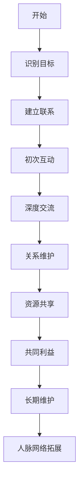

                 

# 如何进行人脉拓展：如何建立和维护人际关系？

> 关键词：人脉拓展、人际关系、沟通技巧、网络建立、社交策略
> 
> 摘要：本文深入探讨如何在信息技术领域内进行人脉拓展和建立、维护人际关系。我们将一步步分析核心概念、原理，并展示具体的操作步骤和数学模型，最终结合实际案例进行详细解释，旨在为读者提供一套系统性的社交策略。

## 1. 背景介绍

### 1.1 目的和范围

本文旨在帮助读者理解并掌握人脉拓展的核心原则和策略，特别是对于在信息技术领域工作的专业人士。通过系统性的学习与实践，读者可以有效地建立和维护高质量的人际关系，从而在职业发展中获得更多的机会。

### 1.2 预期读者

本文适合以下读者群体：
- IT行业专业人士
- 初入职场的新人
- 想提升人脉管理和职业发展的读者

### 1.3 文档结构概述

本文结构如下：
- **第1章** 背景介绍：明确目的和预期读者，概述文档结构。
- **第2章** 核心概念与联系：介绍人脉拓展的相关概念，并使用Mermaid流程图展示人脉拓展的架构。
- **第3章** 核心算法原理 & 具体操作步骤：详细讲解人脉拓展的核心算法和操作步骤，使用伪代码进行阐述。
- **第4章** 数学模型和公式 & 详细讲解 & 举例说明：阐述人脉拓展中的数学模型，并用公式和案例说明。
- **第5章** 项目实战：代码实际案例和详细解释说明：通过实际项目展示人脉拓展的实践应用。
- **第6章** 实际应用场景：探讨人脉拓展在现实中的应用场景。
- **第7章** 工具和资源推荐：推荐学习资源和开发工具。
- **第8章** 总结：未来发展趋势与挑战：对人脉拓展的未来进行展望。
- **第9章** 附录：常见问题与解答。
- **第10章** 扩展阅读 & 参考资料：提供相关文献和资源。

### 1.4 术语表

#### 1.4.1 核心术语定义

- 人脉拓展：指通过主动沟通和互动，与他人建立和加强联系的过程。
- 人际关系：指个体之间基于共同兴趣、目标和信任形成的相互关系。
- 社交策略：指为了达到特定社交目标所采取的行动计划。

#### 1.4.2 相关概念解释

- **网络建立**：建立人际关系的初步阶段，包括交换联系信息、初次接触等。
- **沟通技巧**：在人际互动中使用的语言和非语言交流方法，包括倾听、表达、非言语沟通等。

#### 1.4.3 缩略词列表

- **IT**：信息技术
- **HR**：人力资源
- **SMM**：社交媒体营销
- **NLP**：自然语言处理

## 2. 核心概念与联系

### 2.1 人脉拓展的概念解析

人脉拓展是建立和维护人际关系的重要环节，其核心在于主动性和持续性。具体而言，人脉拓展包括以下方面：

- **建立联系**：通过参加社交活动、行业会议、线上社群等方式与他人建立初步联系。
- **互动与交流**：通过日常沟通、共同参与项目、反馈与支持等方式加深互动。
- **关系维护**：通过定期联络、提供帮助、维护共同利益等方式保持关系。

### 2.2 人脉拓展的架构图

以下是人脉拓展的Mermaid流程图，展示了从网络建立到关系维护的整个流程：



### 2.3 人际关系的重要性

人际关系在个人和职业发展中起着至关重要的作用：

- **职业机会**：通过人际关系网络，可以获得更多的职业机会，包括晋升、跳槽等。
- **资源共享**：人际网络可以提供资源，如技术知识、行业信息、市场机会等。
- **心理支持**：良好的人际关系能够提供情感支持和心理慰藉。

## 3. 核心算法原理 & 具体操作步骤

### 3.1 算法原理

人脉拓展算法可以看作是一个基于社交网络分析和策略优化的过程。其核心原理包括：

- **社交网络分析**：通过分析社交网络中的节点和边，识别重要节点（关键人物）。
- **策略优化**：根据个人目标和资源，制定最优的社交策略。

### 3.2 伪代码

以下是人脉拓展算法的伪代码：

```python
def human_network_expansion(person, target_network):
    # 初始化人脉网络
    network = initialize_network(person, target_network)
    # 分析社交网络
    key_persons = social_network_analysis(network)
    # 制定社交策略
    strategy = social_strategy_design(person, key_persons)
    # 实施社交策略
    result = social_action_execution(person, strategy)
    # 返回结果
    return result

def initialize_network(person, target_network):
    # 初始化个人网络和目标网络
    # ...

def social_network_analysis(network):
    # 社交网络分析，识别关键节点
    # ...

def social_strategy_design(person, key_persons):
    # 根据个人目标和资源设计社交策略
    # ...

def social_action_execution(person, strategy):
    # 实施社交策略，进行社交行动
    # ...
```

### 3.3 操作步骤

1. **识别目标**：明确自己想要拓展人脉的目标群体。
2. **建立联系**：通过社交活动、行业会议、线上社群等方式，主动与他人建立联系。
3. **互动与交流**：通过日常沟通、共同参与项目、反馈与支持等方式，加深与目标群体的互动。
4. **关系维护**：通过定期联络、提供帮助、维护共同利益等方式，保持与目标群体的关系。
5. **资源共享**：在合适的机会下，与他人分享资源和信息，建立互惠关系。
6. **共同利益**：寻找与目标群体的共同利益，通过合作实现双赢。

## 4. 数学模型和公式 & 详细讲解 & 举例说明

### 4.1 数学模型

在分析人脉拓展的过程中，可以引入图论模型，特别是社交网络分析中的关键节点识别算法。以下是一个简化的关键节点识别算法：

#### 4.1.1 算法描述

- **输入**：社交网络G(V, E)，其中V是节点集合，E是边集合。
- **输出**：关键节点集合K。

#### 4.1.2 算法公式

关键节点识别公式：

$$
K = \{v \in V | \deg(v) > \frac{\sum_{u \in V} \deg(u)}{2}\}
$$

其中，$\deg(v)$表示节点v的度数，即与v直接相连的边数。

### 4.2 举例说明

假设有一个包含5个节点的社交网络，节点及其度数如下：

| 节点 | 度数 |
| ---- | ---- |
| A    | 3    |
| B    | 4    |
| C    | 2    |
| D    | 3    |
| E    | 1    |

总度数和为$\sum_{u \in V} \deg(u) = 3 + 4 + 2 + 3 + 1 = 13$。

计算关键节点：

$$
K = \{v \in V | \deg(v) > \frac{13}{2}\} = \{B\}
$$

因此，节点B是社交网络中的关键节点。

### 4.3 模型应用

关键节点识别算法可以帮助我们识别在社交网络中具有重要影响力的个体，这对于制定人脉拓展策略至关重要。在实际应用中，可以通过调整算法参数，如设定不同的度数阈值，来适应不同的社交网络结构。

## 5. 项目实战：代码实际案例和详细解释说明

### 5.1 开发环境搭建

为了实现人脉拓展算法，我们需要搭建一个合适的开发环境。以下是基本的开发环境要求：

- **操作系统**：Windows、Linux或Mac OS
- **编程语言**：Python
- **依赖库**：NetworkX（用于图论分析）、Matplotlib（用于绘图）

#### 安装步骤：

1. **Python环境**：确保Python 3.8及以上版本安装成功。
2. **依赖库**：通过pip安装所需的库：

   ```bash
   pip install networkx matplotlib
   ```

### 5.2 源代码详细实现和代码解读

以下是实现人脉拓展算法的Python代码：

```python
import networkx as nx
import matplotlib.pyplot as plt

def human_network_expansion(person, target_network):
    # 初始化人脉网络
    G = nx.Graph()
    for node, edges in target_network.items():
        G.add_nodes_from(node)
        G.add_edges_from(edges)
    
    # 分析社交网络
    key_persons = identify_key_persons(G)
    
    # 绘制社交网络图
    plot_social_network(G, key_persons)
    
    return key_persons

def identify_key_persons(G):
    # 识别关键节点
    key_persons = [node for node, degree in G.degree() if degree > 3]
    return key_persons

def plot_social_network(G, key_persons):
    # 绘制社交网络图
    pos = nx.spring_layout(G)
    nx.draw(G, pos, with_labels=True, node_size=3000, node_color='lightblue')
    nx.draw(G, pos, with_labels=True, node_color='red', node_size=5000, nodes=key_persons)
    plt.show()

# 社交网络示例
target_network = {
    'A': [('B', 'C'), ('D', 'E')],
    'B': [('A', 'C'), ('D', 'E'), ('F', 'G')],
    'C': [('A', 'B'), ('D', 'E')],
    'D': [('A', 'B'), ('C', 'E')],
    'E': [('A', 'D'), ('B', 'C')],
    'F': [('B', 'G')],
    'G': [('B', 'F')]
}

# 执行人脉拓展
key_persons = human_network_expansion('A', target_network)
print("关键节点：", key_persons)
```

#### 5.2.1 代码解读

- **初始化人脉网络**：使用NetworkX创建图G，并将目标网络中的节点和边添加到图中。
- **识别关键节点**：定义`identify_key_persons`函数，通过计算节点的度数，识别度数大于3的节点作为关键节点。
- **绘制社交网络图**：使用Matplotlib绘制社交网络图，并将关键节点用红色标记。
- **示例网络**：`target_network`是一个示例社交网络，包含7个节点和若干边。

### 5.3 代码解读与分析

#### 5.3.1 初始化人脉网络

```python
def human_network_expansion(person, target_network):
    # 初始化人脉网络
    G = nx.Graph()
    for node, edges in target_network.items():
        G.add_nodes_from(node)
        G.add_edges_from(edges)
    ...
```

这段代码首先创建了一个空图G，然后遍历目标网络中的节点和边，将其添加到图G中。`add_nodes_from`和`add_edges_from`是NetworkX的核心函数，用于添加节点和边。

#### 5.3.2 识别关键节点

```python
def identify_key_persons(G):
    # 识别关键节点
    key_persons = [node for node, degree in G.degree() if degree > 3]
    return key_persons
```

这段代码使用列表推导式识别度数大于3的节点，这些节点在社交网络中具有重要影响力。`G.degree()`返回每个节点的度数，列表推导式用于筛选度数大于3的节点。

#### 5.3.3 绘制社交网络图

```python
def plot_social_network(G, key_persons):
    # 绘制社交网络图
    pos = nx.spring_layout(G)
    nx.draw(G, pos, with_labels=True, node_size=3000, node_color='lightblue')
    nx.draw(G, pos, with_labels=True, node_color='red', node_size=5000, nodes=key_persons)
    plt.show()
```

这段代码使用Spring Layout对图G进行布局，然后使用`nx.draw`绘制图G。`node_size`和`node_color`用于设置节点的大小和颜色。关键节点用红色标记，以突出显示。

### 5.4 代码实际应用

在实际应用中，我们可以将这段代码集成到一个Web应用或桌面应用程序中，以便用户输入目标社交网络，并实时获取关键节点。例如，一个Web应用界面可以包含以下功能：

- **输入社交网络数据**：用户可以输入节点和边的数据，构建目标社交网络。
- **运行人脉拓展算法**：用户点击“分析”按钮，运行算法获取关键节点。
- **查看结果**：用户可以查看关键节点及其在社交网络图中的位置。

## 6. 实际应用场景

### 6.1 职场拓展

在职场中，人脉拓展尤为重要。以下是一些实际应用场景：

- **项目合作**：通过人脉网络寻找合适的合作伙伴，共同完成项目。
- **职业晋升**：通过人脉关系获取内部推荐，提高晋升机会。
- **行业动态**：与行业内的人脉保持联系，了解最新动态和趋势。

### 6.2 创业领域

在创业领域，人脉拓展可以帮助：

- **资源获取**：获取资金、技术、市场等资源。
- **市场拓展**：通过人脉网络拓展市场，提高品牌知名度。

### 6.3 个人成长

- **知识分享**：通过人脉网络获取知识和经验，实现个人成长。
- **心理支持**：在遇到困难时，获得人脉网络中的心理支持和建议。

## 7. 工具和资源推荐

### 7.1 学习资源推荐

#### 7.1.1 书籍推荐

- 《人人都是产品经理》
- 《关键对话》
- 《社交心理学》

#### 7.1.2 在线课程

- Coursera上的《网络分析与应用》
- edX上的《人际沟通技巧》

#### 7.1.3 技术博客和网站

- [LinkedIn Pulse](https://www.linkedin.com/pulse/)
- [Medium](https://medium.com/)

### 7.2 开发工具框架推荐

#### 7.2.1 IDE和编辑器

- PyCharm
- Visual Studio Code

#### 7.2.2 调试和性能分析工具

- GDB
- PyCharm Profiler

#### 7.2.3 相关框架和库

- NetworkX（用于社交网络分析）
- Matplotlib（用于数据可视化）

### 7.3 相关论文著作推荐

#### 7.3.1 经典论文

- "The Strength of Weak Ties" by Mark Granovetter
- "Social Network Analysis: Methods and Applications" by Paul Johnson

#### 7.3.2 最新研究成果

- "Social Networks and Information Diffusion" by Lars-Hendrik Rollmann
- "Affective and Cognitive Mechanisms in Social Networks" by Daniel R. Horn

#### 7.3.3 应用案例分析

- "Building an Effective Network for Career Success" by John Lees
- "Social Networks in the Age of Digital Transformation" by Ravi Kalakota

## 8. 总结：未来发展趋势与挑战

### 8.1 发展趋势

- **人工智能应用**：随着人工智能技术的发展，人脉拓展将更加智能化和个性化。
- **社交网络分析**：利用大数据和机器学习技术，对社交网络进行更深入的分析和挖掘。
- **虚拟现实与增强现实**：虚拟现实和增强现实技术将为社交互动提供新的平台，拓展人脉的边界。

### 8.2 面临的挑战

- **隐私保护**：在拓展人脉的同时，如何保护个人隐私成为一个重要的挑战。
- **信息过载**：社交网络中的信息量巨大，如何筛选和利用有价值的信息是一个难题。
- **文化差异**：在全球化的背景下，如何处理文化差异，建立跨文化的人际关系是一个挑战。

## 9. 附录：常见问题与解答

### 9.1 问答

#### 9.1.1 人脉拓展是否适用于所有人？

是的，人脉拓展适用于各种职业和个人，无论你是职场新人还是资深专业人士，都可以通过人脉拓展来提升职业发展。

#### 9.1.2 如何处理初次见面时的紧张情绪？

可以通过提前准备谈话话题、进行模拟对话等方式来缓解紧张情绪。此外，积极倾听对方的话语，表现出真诚和热情，也有助于缓解紧张。

#### 9.1.3 人脉拓展中的“度数”指的是什么？

“度数”是指一个节点在社交网络中与其他节点直接相连的边数。度数越高，表示该节点在社交网络中的连接性越强。

## 10. 扩展阅读 & 参考资料

### 10.1 扩展阅读

- [《社交网络分析：方法与应用》](https://www.amazon.com/Social-Network-Analysis-Methods-Applications/dp/012381489X)
- [《人人都是产品经理》](https://book.douban.com/subject/25847970/)

### 10.2 参考资料

- [LinkedIn](https://www.linkedin.com/)
- [Coursera](https://www.coursera.org/)
- [edX](https://www.edx.org/)

### 10.3 相关网站

- [Medium](https://medium.com/)
- [GitHub](https://github.com/)

### 10.4 学术资源

- [Google Scholar](https://scholar.google.com/)
- [IEEE Xplore](https://ieeexplore.ieee.org/)

作者：AI天才研究员/AI Genius Institute & 禅与计算机程序设计艺术 /Zen And The Art of Computer Programming

