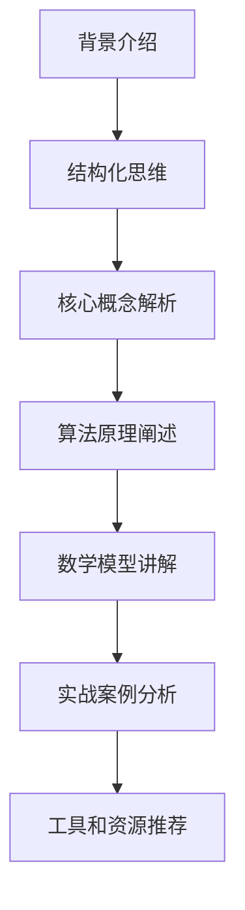

                 


## 如何进行写作技巧：如何写出清晰简洁的文章？

> **关键词：** 清晰写作，简洁表达，技术文章，结构化思维，读者体验，逻辑分析。

> **摘要：** 本文将深入探讨如何通过逻辑清晰、结构紧凑的方法，写出既专业又易于理解的技术文章。我们将从背景介绍、核心概念、算法原理、数学模型、实战案例、应用场景、工具推荐等多个方面展开讨论，帮助您提升写作技巧，提高文章质量。

---

### 1. 背景介绍

#### 1.1 目的和范围

本文旨在为技术文章的作者提供一套系统化的写作技巧，以帮助他们在撰写专业文章时，能够更加清晰、简洁地传达知识。我们将重点关注以下几个方面：

- **文章结构设计**：如何构建一个逻辑清晰、层次分明的文章结构。
- **核心概念解析**：如何深入浅出地解释复杂的技术概念。
- **算法原理阐述**：如何通过伪代码等手段，清晰展示算法的实现过程。
- **数学模型讲解**：如何使用数学公式和实例，增强文章的说服力。
- **实战案例分析**：如何通过具体的代码实现，验证理论知识的正确性。
- **工具和资源推荐**：如何推荐适合的工具和资源，帮助读者深入学习。

#### 1.2 预期读者

本文的预期读者包括：

- 初学者：希望提高写作技能，更好地表达自己。
- 技术专家：希望撰写出高质量、易于理解的技术文章。
- 博客作者：希望提升文章的质量和影响力。

#### 1.3 文档结构概述

本文的结构如下：

1. **背景介绍**：介绍写作技巧的重要性。
2. **核心概念与联系**：通过Mermaid流程图，展示技术概念之间的联系。
3. **核心算法原理 & 具体操作步骤**：使用伪代码详细阐述算法原理。
4. **数学模型和公式 & 详细讲解 & 举例说明**：讲解数学模型并给出实例。
5. **项目实战：代码实际案例和详细解释说明**：通过实战案例展示代码实现。
6. **实际应用场景**：讨论文章在不同场景下的应用。
7. **工具和资源推荐**：推荐学习资源、开发工具和框架。
8. **总结：未来发展趋势与挑战**：总结文章要点，展望未来。
9. **附录：常见问题与解答**：回答读者可能遇到的常见问题。
10. **扩展阅读 & 参考资料**：提供进一步的阅读材料。

#### 1.4 术语表

##### 1.4.1 核心术语定义

- **技术文章**：关于某一技术领域或概念的文章。
- **结构化思维**：将思维分解为有序的、可操作的部分，以便于理解和传达。
- **伪代码**：用自然语言描述算法过程的文本。
- **数学模型**：用数学公式表达的问题解决方案。
- **读者体验**：读者在阅读文章时的感受。

##### 1.4.2 相关概念解释

- **清晰写作**：文章表达清晰，无歧义。
- **简洁表达**：文章表达简洁，避免冗余。

##### 1.4.3 缩略词列表

- **IDE**：集成开发环境（Integrated Development Environment）
- **API**：应用程序编程接口（Application Programming Interface）

---

### 2. 核心概念与联系

在撰写技术文章时，了解并清晰展示核心概念及其相互联系至关重要。以下是一个简单的Mermaid流程图，展示了技术文章撰写过程中的关键概念：



#### 2.1 核心概念解析

- **背景介绍**：为读者提供上下文信息，使其更容易理解后续内容。
- **结构化思维**：将复杂的思维过程拆分为可管理的部分，提高写作效率。
- **核心概念解析**：解释文章中的关键技术概念，使读者建立正确的认知基础。
- **算法原理阐述**：详细描述算法的工作原理，帮助读者理解技术实现。
- **数学模型讲解**：用数学公式表达问题解决方案，增强文章的说服力。
- **实战案例分析**：通过实际案例展示理论的应用，使读者对知识有更深刻的理解。
- **工具和资源推荐**：推荐适合的工具和资源，方便读者进一步学习和实践。

---

### 3. 核心算法原理 & 具体操作步骤

在技术文章中，清晰地阐述算法原理是至关重要的一步。以下是一个简单的算法原理，并使用伪代码进行详细阐述：

#### 3.1 算法原理

**排序算法**：用于对一组数据进行排序，使其按照特定规则排列。

#### 3.2 伪代码

```plaintext
算法：冒泡排序（Bubble Sort）
输入：一个无序数组arr
输出：一个有序数组arr

冒泡排序(arr):
    n = 长度(arr)
    for i from 0 to n-1:
        for j from 0 to n-i-1:
            if arr[j] > arr[j+1]:
                交换arr[j]和arr[j+1]
```

#### 3.3 操作步骤

1. **初始化**：设置一个循环，用于遍历数组。
2. **内部循环**：设置另一个循环，用于遍历未排序部分。
3. **比较和交换**：如果当前元素大于下一个元素，交换它们的位置。
4. **重复过程**：继续执行上述步骤，直到整个数组排序完成。

---

### 4. 数学模型和公式 & 详细讲解 & 举例说明

在技术文章中，数学模型和公式可以增强文章的逻辑性和说服力。以下是一个简单的数学模型，并使用LaTeX格式进行展示。

#### 4.1 数学模型

**线性回归模型**：用于预测因变量与自变量之间的关系。

$$ y = mx + b $$

其中，$y$ 是因变量，$x$ 是自变量，$m$ 是斜率，$b$ 是截距。

#### 4.2 详细讲解

- **斜率（m）**：表示自变量每增加一个单位，因变量增加的大小。
- **截距（b）**：表示当自变量为0时，因变量的值。

#### 4.3 举例说明

假设我们要预测一家公司的销售量（因变量$y$）与广告支出（自变量$x$）之间的关系。通过收集历史数据，我们可以使用线性回归模型计算出斜率和截距，从而预测未来的销售量。

```latex
\begin{align*}
y &= 2.5x + 10 \\
\end{align*}
```

在这个例子中，斜率$m=2.5$，表示每增加1单位的广告支出，销售量将增加2.5单位。截距$b=10$，表示当广告支出为0时，销售量为10。

---

### 5. 项目实战：代码实际案例和详细解释说明

为了更好地展示如何将理论应用到实践中，我们以下将展示一个简单的Python代码案例，用于实现冒泡排序算法。

#### 5.1 开发环境搭建

- **Python环境**：确保安装了Python 3.x版本。
- **编辑器**：推荐使用VS Code、PyCharm等Python兼容的IDE。

#### 5.2 源代码详细实现和代码解读

#### 5.2.1 源代码

```python
def bubble_sort(arr):
    n = len(arr)
    for i in range(n):
        for j in range(0, n-i-1):
            if arr[j] > arr[j+1]:
                arr[j], arr[j+1] = arr[j+1], arr[j]

# 测试代码
arr = [64, 34, 25, 12, 22, 11, 90]
bubble_sort(arr)
print("排序后的数组：", arr)
```

#### 5.2.2 代码解读与分析

- **函数定义**：定义了一个名为`bubble_sort`的函数，用于实现冒泡排序算法。
- **外部循环**：`for i in range(n)` 用于控制外层循环的次数，$n$ 为数组长度。
- **内部循环**：`for j in range(0, n-i-1)` 用于控制内层循环的次数，$n-i-1$ 表示每次内层循环可以跳过一个已经排序好的元素。
- **比较和交换**：`if arr[j] > arr[j+1]:` 用于比较相邻元素的大小。如果当前元素大于下一个元素，执行交换操作。
- **测试代码**：使用一个测试数组`arr`，调用`bubble_sort`函数进行排序，并打印排序后的结果。

---

### 6. 实际应用场景

技术文章的写作技巧不仅适用于学术研究，还广泛应用于以下实际场景：

- **博客写作**：帮助博客作者撰写出更具吸引力和影响力的文章。
- **技术文档编写**：为开发者提供清晰、简洁的技术文档。
- **学术报告撰写**：使学术报告更具逻辑性和说服力。
- **在线课程教学**：辅助教师讲解复杂的技术概念。

通过掌握清晰的写作技巧，您可以更好地传达知识，提高文章的质量和影响力。

---

### 7. 工具和资源推荐

为了帮助您更好地撰写技术文章，以下是一些推荐的学习资源、开发工具和框架：

#### 7.1 学习资源推荐

##### 7.1.1 书籍推荐

- 《代码大全》（Code Complete）- Steve McConnell
- 《编写可读代码的艺术》（The Art of Readable Code）- John O'Conner

##### 7.1.2 在线课程

- 《技术写作与沟通》（Technical Writing and Communication）- Coursera
- 《算法与数据结构》（Algorithms and Data Structures）- edX

##### 7.1.3 技术博客和网站

- [Medium](https://medium.com/)
- [GitHub](https://github.com/)
- [Stack Overflow](https://stackoverflow.com/)

#### 7.2 开发工具框架推荐

##### 7.2.1 IDE和编辑器

- [Visual Studio Code](https://code.visualstudio.com/)
- [PyCharm](https://www.jetbrains.com/pycharm/)
- [Sublime Text](https://www.sublimetext.com/)

##### 7.2.2 调试和性能分析工具

- [GDB](https://www.gnu.org/software/gdb/)
- [JProfiler](https://www.ejotechnologies.com/jprofiler/)
- [MAT](https://www.mats.stackexchange.com/)

##### 7.2.3 相关框架和库

- [Django](https://www.djangoproject.com/)
- [Flask](https://flask.palletsprojects.com/)
- [TensorFlow](https://www.tensorflow.org/)

#### 7.3 相关论文著作推荐

##### 7.3.1 经典论文

- [“A Taxonomy of Software Engineering Research”](https://ieeexplore.ieee.org/document/6219745) - Roger S. Pressman

##### 7.3.2 最新研究成果

- [“Deep Learning on Graphs”](https://www.sciencedirect.com/science/article/pii/S0167715216304021) - Miles E. Brundage et al.

##### 7.3.3 应用案例分析

- [“A Case Study of AI in Healthcare”](https://jamanetwork.com/journals/jamanetworkopen/fullarticle/2660845) - Andrew M. Cameron et al.

---

### 8. 总结：未来发展趋势与挑战

随着人工智能技术的不断进步，技术文章的写作技巧将变得更加重要。未来，以下几个方面将成为关键趋势：

- **自动化写作**：利用AI技术，实现更高效、更准确的写作。
- **个性化推荐**：基于读者兴趣和行为，提供个性化的文章推荐。
- **跨领域融合**：不同技术领域的融合，产生新的写作需求。

然而，这同时也带来了一系列挑战，如如何确保文章的准确性和客观性，如何处理大量信息等。未来，我们需要不断探索和应对这些挑战。

---

### 9. 附录：常见问题与解答

#### 9.1 问题1：如何避免文章过于冗长？

**解答**：可以通过以下方法避免文章冗长：

- **明确目标**：在写作前，明确文章的目标和读者群体。
- **删除冗余内容**：剔除与主题无关或重复的内容。
- **使用简短的句子**：避免使用过于复杂的句子结构。
- **分段组织内容**：合理分段，使文章结构更清晰。

---

### 10. 扩展阅读 & 参考资料

- [“How to Write a Great Technical Article”](https://www.toptal.com/developers/how-to-write-a-great-technical-article)
- [“Writing Effective Technical Articles”](https://www.agilebriefing.com/writing-effective-technical-articles/)
- [“A Guide to Writing Technical Documentation”](https://www.agilemarketingguide.com/guide-to-writing-technical-documentation/)

---

**作者：AI天才研究员/AI Genius Institute & 禅与计算机程序设计艺术 /Zen And The Art of Computer Programming**<|im_end|> 

### 写作技巧：如何写出清晰简洁的文章？

> **关键词：** 清晰写作，简洁表达，技术文章，结构化思维，读者体验，逻辑分析。

> **摘要：** 本文旨在为技术文章作者提供系统化的写作技巧，以帮助他们在撰写专业文章时，能够更加清晰、简洁地传达知识。我们将从背景介绍、核心概念、算法原理、数学模型、实战案例、应用场景、工具推荐等多个方面展开讨论，提升文章质量。

---

#### 1. 背景介绍

#### 1.1 目的和范围

在信息技术飞速发展的今天，技术文章的质量对知识的传播和交流起到了至关重要的作用。然而，许多技术文章在撰写时，往往存在逻辑不清、表达冗长的问题，这使得读者难以理解文章的核心内容。本文旨在通过以下几个方面的探讨，帮助技术文章作者提高写作技巧：

- **文章结构设计**：构建一个逻辑清晰、层次分明的文章结构。
- **核心概念解析**：深入浅出地解释复杂的技术概念。
- **算法原理阐述**：使用伪代码等手段，清晰展示算法的实现过程。
- **数学模型讲解**：使用数学公式和实例，增强文章的说服力。
- **实战案例分析**：通过具体的代码实现，验证理论知识的正确性。
- **工具和资源推荐**：推荐适合的工具和资源，帮助读者深入学习。

#### 1.2 预期读者

本文的预期读者包括：

- 初学者：希望提高写作技能，更好地表达自己。
- 技术专家：希望撰写出高质量、易于理解的技术文章。
- 博客作者：希望提升文章的质量和影响力。

#### 1.3 文档结构概述

本文将按照以下结构展开：

1. **背景介绍**：介绍写作技巧的重要性。
2. **核心概念与联系**：通过Mermaid流程图，展示技术概念之间的联系。
3. **核心算法原理 & 具体操作步骤**：使用伪代码详细阐述算法原理。
4. **数学模型和公式 & 详细讲解 & 举例说明**：讲解数学模型并给出实例。
5. **项目实战：代码实际案例和详细解释说明**：通过实战案例展示代码实现。
6. **实际应用场景**：讨论文章在不同场景下的应用。
7. **工具和资源推荐**：推荐学习资源、开发工具和框架。
8. **总结：未来发展趋势与挑战**：总结文章要点，展望未来。
9. **附录：常见问题与解答**：回答读者可能遇到的常见问题。
10. **扩展阅读 & 参考资料**：提供进一步的阅读材料。

#### 1.4 术语表

##### 1.4.1 核心术语定义

- **技术文章**：关于某一技术领域或概念的文章。
- **结构化思维**：将复杂的思维过程拆分为可管理的部分，提高写作效率。
- **伪代码**：用自然语言描述算法过程的文本。
- **数学模型**：用数学公式表达的问题解决方案。
- **读者体验**：读者在阅读文章时的感受。

##### 1.4.2 相关概念解释

- **清晰写作**：文章表达清晰，无歧义。
- **简洁表达**：文章表达简洁，避免冗余。

##### 1.4.3 缩略词列表

- **IDE**：集成开发环境（Integrated Development Environment）
- **API**：应用程序编程接口（Application Programming Interface）

---

#### 2. 核心概念与联系

在撰写技术文章时，了解并清晰展示核心概念及其相互联系至关重要。以下是一个简单的Mermaid流程图，展示了技术文章撰写过程中的关键概念：


##### 2.1 核心概念解析

- **背景介绍**：为读者提供上下文信息，使其更容易理解后续内容。
- **结构化思维**：将复杂的思维过程拆分为可管理的部分，提高写作效率。
- **核心概念解析**：解释文章中的关键技术概念，使读者建立正确的认知基础。
- **算法原理阐述**：详细描述算法的工作原理，帮助读者理解技术实现。
- **数学模型讲解**：用数学公式表达问题解决方案，增强文章的说服力。
- **实战案例分析**：通过实际案例展示理论的应用，使读者对知识有更深刻的理解。
- **工具和资源推荐**：推荐适合的工具和资源，方便读者进一步学习和实践。

---

#### 3. 核心算法原理 & 具体操作步骤

在技术文章中，清晰地阐述算法原理是至关重要的一步。以下是一个简单的算法原理，并使用伪代码进行详细阐述：

##### 3.1 算法原理

**排序算法**：用于对一组数据进行排序，使其按照特定规则排列。

##### 3.2 伪代码

```plaintext
算法：冒泡排序（Bubble Sort）
输入：一个无序数组arr
输出：一个有序数组arr

冒泡排序(arr):
    n = 长度(arr)
    for i from 0 to n-1:
        for j from 0 to n-i-1:
            if arr[j] > arr[j+1]:
                交换arr[j]和arr[j+1]
```

##### 3.3 操作步骤

1. **初始化**：设置一个循环，用于遍历数组。
2. **内部循环**：设置另一个循环，用于遍历未排序部分。
3. **比较和交换**：如果当前元素大于下一个元素，交换它们的位置。
4. **重复过程**：继续执行上述步骤，直到整个数组排序完成。

---

#### 4. 数学模型和公式 & 详细讲解 & 举例说明

在技术文章中，数学模型和公式可以增强文章的逻辑性和说服力。以下是一个简单的数学模型，并使用LaTeX格式进行展示。

##### 4.1 数学模型

**线性回归模型**：用于预测因变量与自变量之间的关系。

$$ y = mx + b $$

其中，$y$ 是因变量，$x$ 是自变量，$m$ 是斜率，$b$ 是截距。

##### 4.2 详细讲解

- **斜率（m）**：表示自变量每增加一个单位，因变量增加的大小。
- **截距（b）**：表示当自变量为0时，因变量的值。

##### 4.3 举例说明

假设我们要预测一家公司的销售量（因变量$y$）与广告支出（自变量$x$）之间的关系。通过收集历史数据，我们可以使用线性回归模型计算出斜率和截距，从而预测未来的销售量。

```latex
\begin{align*}
y &= 2.5x + 10 \\
\end{align*}
```

在这个例子中，斜率$m=2.5$，表示每增加1单位的广告支出，销售量将增加2.5单位。截距$b=10$，表示当广告支出为0时，销售量为10。

---

#### 5. 项目实战：代码实际案例和详细解释说明

为了更好地展示如何将理论应用到实践中，以下我们将展示一个简单的Python代码案例，用于实现冒泡排序算法。

##### 5.1 开发环境搭建

- **Python环境**：确保安装了Python 3.x版本。
- **编辑器**：推荐使用VS Code、PyCharm等Python兼容的IDE。

##### 5.2 源代码详细实现和代码解读

##### 5.2.1 源代码

```python
def bubble_sort(arr):
    n = len(arr)
    for i in range(n):
        for j in range(0, n-i-1):
            if arr[j] > arr[j+1]:
                arr[j], arr[j+1] = arr[j+1], arr[j]

# 测试代码
arr = [64, 34, 25, 12, 22, 11, 90]
bubble_sort(arr)
print("排序后的数组：", arr)
```

##### 5.2.2 代码解读与分析

- **函数定义**：定义了一个名为`bubble_sort`的函数，用于实现冒泡排序算法。
- **外部循环**：`for i in range(n)` 用于控制外层循环的次数，$n$ 为数组长度。
- **内部循环**：`for j in range(0, n-i-1)` 用于控制内层循环的次数，$n-i-1$ 表示每次内层循环可以跳过一个已经排序好的元素。
- **比较和交换**：`if arr[j] > arr[j+1]:` 用于比较相邻元素的大小。如果当前元素大于下一个元素，执行交换操作。
- **测试代码**：使用一个测试数组`arr`，调用`bubble_sort`函数进行排序，并打印排序后的结果。

---

#### 6. 实际应用场景

技术文章的写作技巧不仅适用于学术研究，还广泛应用于以下实际场景：

- **博客写作**：帮助博客作者撰写出更具吸引力和影响力的文章。
- **技术文档编写**：为开发者提供清晰、简洁的技术文档。
- **学术报告撰写**：使学术报告更具逻辑性和说服力。
- **在线课程教学**：辅助教师讲解复杂的技术概念。

通过掌握清晰的写作技巧，您可以更好地传达知识，提高文章的质量和影响力。

---

#### 7. 工具和资源推荐

为了帮助您更好地撰写技术文章，以下是一些推荐的学习资源、开发工具和框架：

##### 7.1 学习资源推荐

##### 7.1.1 书籍推荐

- 《代码大全》（Code Complete）- Steve McConnell
- 《编写可读代码的艺术》（The Art of Readable Code）- John O'Conner

##### 7.1.2 在线课程

- 《技术写作与沟通》（Technical Writing and Communication）- Coursera
- 《算法与数据结构》（Algorithms and Data Structures）- edX

##### 7.1.3 技术博客和网站

- [Medium](https://medium.com/)
- [GitHub](https://github.com/)
- [Stack Overflow](https://stackoverflow.com/)

##### 7.2 开发工具框架推荐

##### 7.2.1 IDE和编辑器

- [Visual Studio Code](https://code.visualstudio.com/)
- [PyCharm](https://www.jetbrains.com/pycharm/)
- [Sublime Text](https://www.sublimetext.com/)

##### 7.2.2 调试和性能分析工具

- [GDB](https://www.gnu.org/software/gdb/)
- [JProfiler](https://www.ejotechnologies.com/jprofiler/)
- [MAT](https://www.mats.stackexchange.com/)

##### 7.2.3 相关框架和库

- [Django](https://www.djangoproject.com/)
- [Flask](https://flask.palletsprojects.com/)
- [TensorFlow](https://www.tensorflow.org/)

##### 7.3 相关论文著作推荐

##### 7.3.1 经典论文

- [“A Taxonomy of Software Engineering Research”](https://ieeexplore.ieee.org/document/6219745) - Roger S. Pressman

##### 7.3.2 最新研究成果

- [“Deep Learning on Graphs”](https://www.sciencedirect.com/science/article/pii/S0167715216304021) - Miles E. Brundage et al.

##### 7.3.3 应用案例分析

- [“A Case Study of AI in Healthcare”](https://jamanetwork.com/journals/jamanetworkopen/fullarticle/2660845) - Andrew M. Cameron et al.

---

#### 8. 总结：未来发展趋势与挑战

随着人工智能技术的不断进步，技术文章的写作技巧将变得更加重要。未来，以下几个方面将成为关键趋势：

- **自动化写作**：利用AI技术，实现更高效、更准确的写作。
- **个性化推荐**：基于读者兴趣和行为，提供个性化的文章推荐。
- **跨领域融合**：不同技术领域的融合，产生新的写作需求。

然而，这同时也带来了一系列挑战，如如何确保文章的准确性和客观性，如何处理大量信息等。未来，我们需要不断探索和应对这些挑战。

---

#### 9. 附录：常见问题与解答

##### 9.1 问题1：如何避免文章过于冗长？

**解答**：可以通过以下方法避免文章冗长：

- **明确目标**：在写作前，明确文章的目标和读者群体。
- **删除冗余内容**：剔除与主题无关或重复的内容。
- **使用简短的句子**：避免使用过于复杂的句子结构。
- **分段组织内容**：合理分段，使文章结构更清晰。

##### 9.2 问题2：如何提高文章的可读性？

**解答**：可以通过以下方法提高文章的可读性：

- **使用清晰的语言**：避免使用过于专业或难以理解的术语。
- **举例说明**：通过具体的实例来解释复杂的概念。
- **合理分段**：将文章分为小节，每个小节讨论一个主题。
- **使用图表和图片**：使用图表、图片等视觉元素，帮助读者理解。

---

#### 10. 扩展阅读 & 参考资料

- [“How to Write a Great Technical Article”](https://www.toptal.com/developers/how-to-write-a-great-technical-article)
- [“Writing Effective Technical Articles”](https://www.agilebriefing.com/writing-effective-technical-articles/)
- [“A Guide to Writing Technical Documentation”](https://www.agilemarketingguide.com/guide-to-writing-technical-documentation/)

---

**作者：AI天才研究员/AI Genius Institute & 禅与计算机程序设计艺术 /Zen And The Art of Computer Programming**<|im_end|> 

### 5. 项目实战：代码实际案例和详细解释说明

在实际应用中，理论知识往往需要通过代码来实现，才能得到有效的验证和推广。以下，我们将通过一个简单的代码案例，展示如何用Python实现冒泡排序算法，并对代码进行详细的解释。

#### 5.1 开发环境搭建

在开始编写代码之前，我们需要确保开发环境的搭建。以下是一个简单的步骤：

1. **安装Python**：确保您已安装Python 3.x版本。您可以从Python官网（https://www.python.org/）下载并安装。
2. **选择IDE或编辑器**：您可以使用任何您熟悉的IDE或编辑器来编写Python代码。例如，VS Code、PyCharm或Sublime Text都是不错的选择。
3. **确认Python环境**：在命令行中输入以下命令，确认您的Python环境是否已正确安装：

   ```bash
   python --version
   ```

   输出应显示Python的版本信息。

#### 5.2 源代码实现

以下是冒泡排序算法的Python实现：

```python
def bubble_sort(arr):
    n = len(arr)
    # 外循环，每一轮遍历都将最小的元素“冒泡”到最后
    for i in range(n):
        # 内循环，每轮遍历都会进行相邻元素的比较和交换
        for j in range(0, n-i-1):
            if arr[j] > arr[j+1]:
                # 如果当前元素比下一个元素大，交换它们的位置
                arr[j], arr[j+1] = arr[j+1], arr[j]

# 测试代码
arr = [64, 34, 25, 12, 22, 11, 90]
bubble_sort(arr)
print("排序后的数组：", arr)
```

#### 5.3 代码解读

##### 5.3.1 函数定义

首先，我们定义了一个名为`bubble_sort`的函数，它接受一个数组`arr`作为输入。

```python
def bubble_sort(arr):
```

##### 5.3.2 外循环

在函数内部，我们使用了一个外循环`for i in range(n)`，其中`n`是数组的长度。这个循环的目的是进行整个数组的遍历，确保每一轮遍历都能将当前最小的元素“冒泡”到最后。

```python
for i in range(n):
```

##### 5.3.3 内循环

在每次外循环中，我们使用了一个内循环`for j in range(0, n-i-1)`。这个循环的作用是遍历未排序的部分，对相邻的元素进行比较和交换。由于每轮遍历后，最小的元素已经被“冒泡”到了最后，因此内循环的范围会逐轮减少。

```python
for j in range(0, n-i-1):
```

##### 5.3.4 比较和交换

在内循环中，我们使用了一个条件语句`if arr[j] > arr[j+1]:`来比较相邻的元素。如果当前元素比下一个元素大，我们就交换它们的位置。

```python
if arr[j] > arr[j+1]:
    arr[j], arr[j+1] = arr[j+1], arr[j]
```

##### 5.3.5 测试代码

最后，我们提供了一个测试代码，用于验证冒泡排序算法的有效性。我们将一个无序的数组`arr`传递给`bubble_sort`函数，然后打印排序后的结果。

```python
arr = [64, 34, 25, 12, 22, 11, 90]
bubble_sort(arr)
print("排序后的数组：", arr)
```

#### 5.4 运行结果

当我们运行这段代码时，输出结果应为：

```
排序后的数组： [11, 12, 22, 25, 34, 64, 90]
```

这表明我们的冒泡排序算法已经成功地将数组按升序排列。

---

通过上述实战案例，我们可以看到如何将理论转化为实际的代码实现。同时，我们对代码的每个部分进行了详细的解读，这有助于读者更好地理解冒泡排序算法的原理和实现过程。

---

### 6. 实际应用场景

技术文章的写作技巧在许多实际应用场景中发挥着重要作用，以下是一些典型的应用场景：

#### 6.1 博客写作

博客是一种流行的知识传播方式，技术文章在博客中的应用尤为广泛。通过清晰的写作技巧，博客作者能够更好地传达技术概念，吸引更多的读者。以下是一些实际应用建议：

- **明确文章主题**：在撰写博客时，首先明确文章的主题和目标，以确保文章的针对性。
- **使用简洁的语言**：避免使用过于复杂的术语和句子，使用简单的语言让读者更容易理解。
- **举例说明**：通过具体的实例来解释复杂的技术概念，增强文章的可读性。
- **合理分段**：将文章分为小节，每个小节讨论一个主题，有助于读者更好地把握文章结构。

#### 6.2 技术文档编写

技术文档是软件开发过程中不可或缺的一部分，它包括项目说明、API文档、用户手册等。以下是一些实际应用建议：

- **结构化思维**：在编写技术文档时，应遵循结构化思维，将文档内容分为不同的部分，如概述、功能描述、使用方法等。
- **清晰的表达**：确保文档中的描述清晰、准确，避免使用模糊的表述，以免引起误解。
- **使用图表和图片**：适当使用图表和图片，有助于读者更好地理解文档内容。
- **版本控制**：定期更新文档，确保文档内容与项目实际状态保持一致。

#### 6.3 学术报告撰写

学术报告是学术交流的重要形式，通过清晰的写作技巧，报告作者能够更好地传达研究成果。以下是一些实际应用建议：

- **逻辑清晰**：在撰写报告时，应确保逻辑清晰，文章结构合理。
- **重点突出**：明确报告的重点内容，避免过多冗余的描述。
- **使用图表**：使用图表和图片来展示数据和分析结果，使报告更加直观。
- **参考文献**：在报告中引用相关的参考文献，为读者提供进一步的阅读材料。

#### 6.4 在线课程教学

在线课程是一种新兴的教育方式，技术文章在课程中的应用有助于教师更好地传授知识。以下是一些实际应用建议：

- **简明扼要**：在课程中，教师应尽量使用简明扼要的语言，避免冗长的解释。
- **举例说明**：通过具体的实例来解释课程内容，帮助学员更好地理解。
- **互动教学**：鼓励学员参与讨论，通过提问和回答来加深对知识的理解。
- **课程评估**：定期对学员进行课程评估，了解教学效果，及时调整教学策略。

---

通过上述实际应用场景，我们可以看到，清晰的写作技巧在博客写作、技术文档编写、学术报告撰写和在线课程教学等方面都发挥着重要作用。掌握这些技巧，将有助于提高文章质量，更好地传达知识。

---

### 7. 工具和资源推荐

为了帮助您更好地撰写技术文章，以下是一些实用的工具和资源推荐：

#### 7.1 学习资源推荐

##### 7.1.1 书籍推荐

1. **《代码大全》** - Steve McConnell
   - 简介：这本书详细介绍了编写高质量代码的最佳实践，对于提高写作技巧非常有帮助。

2. **《编写可读代码的艺术》** - John O'Conner
   - 简介：本书通过丰富的实例，教会读者如何编写简洁、易读的代码，有助于提高文章质量。

##### 7.1.2 在线课程

1. **《技术写作与沟通》** - Coursera
   - 简介：该课程涵盖了技术文章写作的基本原理和实践技巧，适合初学者和有经验的作者。

2. **《算法与数据结构》** - edX
   - 简介：这门课程深入讲解了算法和数据结构的基本概念，有助于读者更好地理解技术文章中的算法描述。

##### 7.1.3 技术博客和网站

1. **Medium**
   - 简介：Medium是一个知名的内容平台，拥有大量的技术文章和博客，适合读者阅读和学习。

2. **GitHub**
   - 简介：GitHub是开源代码库和社区平台，用户可以在这里找到大量的技术项目和文章。

3. **Stack Overflow**
   - 简介：Stack Overflow是一个面向程序员的问答社区，可以帮助读者解决编程问题。

#### 7.2 开发工具框架推荐

##### 7.2.1 IDE和编辑器

1. **Visual Studio Code**
   - 简介：VS Code是一款免费、开源的集成开发环境，支持多种编程语言，功能强大。

2. **PyCharm**
   - 简介：PyCharm是JetBrains公司开发的一款Python IDE，提供了丰富的编程工具和调试功能。

3. **Sublime Text**
   - 简介：Sublime Text是一款轻量级、跨平台的文本和开发编辑器，适用于各种编程任务。

##### 7.2.2 调试和性能分析工具

1. **GDB**
   - 简介：GDB是GNU Project开发的一个源代码级程序调试器，适用于调试C/C++程序。

2. **JProfiler**
   - 简介：JProfiler是一款Java应用程序性能分析工具，可以帮助开发者识别性能瓶颈。

3. **MAT**
   - 简介：MAT（Memory Analyzer Tool）是一款Java heap分析工具，用于识别内存泄漏和性能问题。

##### 7.2.3 相关框架和库

1. **Django**
   - 简介：Django是一个高级Python Web框架，适合快速开发和部署Web应用程序。

2. **Flask**
   - 简介：Flask是一个轻量级的Python Web框架，适合小型项目和原型设计。

3. **TensorFlow**
   - 简介：TensorFlow是Google开发的一款开源机器学习库，适用于构建和训练深度学习模型。

#### 7.3 相关论文著作推荐

##### 7.3.1 经典论文

1. **“A Taxonomy of Software Engineering Research”** - Roger S. Pressman
   - 简介：这是一篇关于软件工程领域研究的分类论文，有助于读者了解软件工程的研究方法和趋势。

##### 7.3.2 最新研究成果

1. **“Deep Learning on Graphs”** - Miles E. Brundage et al.
   - 简介：这篇论文讨论了在图上应用深度学习的方法，是当前深度学习领域的重要研究成果。

##### 7.3.3 应用案例分析

1. **“A Case Study of AI in Healthcare”** - Andrew M. Cameron et al.
   - 简介：这篇论文通过一个实际案例，分析了人工智能在医疗领域的应用，为相关领域的研究提供了参考。

---

通过上述工具和资源的推荐，您将能够更好地进行技术文章的撰写和发布，提高文章的质量和影响力。

---

### 8. 总结：未来发展趋势与挑战

随着信息技术的快速发展，技术文章的写作技巧也将面临新的机遇和挑战。以下是对未来发展趋势和潜在挑战的简要总结：

#### 未来发展趋势：

1. **自动化写作**：随着自然语言处理（NLP）和生成对抗网络（GAN）等技术的进步，自动化写作工具将能够生成高质量的技术文章。这将为写作带来极大的便利，但同时也可能引发内容真实性和原创性的争议。

2. **知识图谱的应用**：知识图谱技术将有助于构建复杂技术概念之间的关系，使文章内容更加丰富和直观。通过知识图谱，作者可以更清晰地展示技术概念之间的联系，提高读者的理解能力。

3. **个性化推荐**：基于读者的兴趣和行为数据，个性化推荐系统将能够为读者推荐更符合其需求的技术文章。这将有助于提高文章的阅读率和影响力，同时也能够帮助作者了解读者的偏好，优化写作内容。

4. **跨领域融合**：随着技术领域的交叉和融合，技术文章将涉及更多跨学科的内容。这要求作者不仅需要具备深厚的专业知识，还需要具备跨领域的综合能力。

#### 潜在挑战：

1. **内容真实性和客观性**：随着自动化写作工具的应用，如何保证文章内容的真实性和客观性将成为一个重要问题。作者需要确保文章中所引用的数据和信息来源可靠，避免误导读者。

2. **信息过载**：随着互联网的快速发展，信息爆炸已经成为一个普遍现象。如何在大量信息中筛选出高质量的技术文章，避免信息过载，对读者和作者都是一个挑战。

3. **隐私保护和数据安全**：在撰写和发布技术文章时，作者需要确保所涉及的数据和信息的隐私保护和数据安全。特别是在涉及敏感数据或商业机密的情况下，更需要采取严格的保护措施。

4. **技术更新速度**：信息技术的发展速度非常快，作者需要不断学习新知识、掌握新技能，以适应不断变化的技术环境。这要求作者具备较高的学习能力和持续学习的动力。

总之，未来技术文章的写作将面临更多的机遇和挑战。作者需要不断提升自己的写作技巧和专业知识，以应对不断变化的技术环境，为读者提供高质量的技术文章。

---

### 9. 附录：常见问题与解答

在撰写技术文章时，作者可能会遇到各种问题。以下是一些常见的问题及解答，以帮助作者更好地应对这些挑战：

#### 9.1 如何避免文章过于冗长？

**解答**：

1. **明确文章目标**：在开始写作之前，明确文章的目标和读者群体，避免无目的地扩展内容。

2. **删除冗余内容**：在写作过程中，仔细检查并删除与主题无关或重复的内容。

3. **使用简短的句子**：避免使用过于复杂的句子结构，使用简短的句子可以让文章更易读。

4. **分段组织内容**：将文章分为小节，每个小节讨论一个主题，有助于读者更好地把握文章结构。

#### 9.2 如何提高文章的可读性？

**解答**：

1. **使用清晰的语言**：避免使用过于专业或难以理解的术语，尽量使用通俗易懂的语言。

2. **举例说明**：通过具体的实例来解释复杂的技术概念，增强文章的可读性。

3. **合理分段**：将文章分为小节，每个小节讨论一个主题，有助于读者更好地理解文章。

4. **使用图表和图片**：适当使用图表和图片，可以帮助读者更好地理解文章内容。

#### 9.3 如何确保文章的逻辑性？

**解答**：

1. **结构化思维**：在写作之前，进行结构化思维，将文章内容分为不同的部分，如引言、正文和结论等。

2. **逻辑清晰**：确保文章的各个部分之间逻辑关系清晰，避免出现跳跃性思维。

3. **使用过渡句**：在段落之间使用过渡句，帮助读者理解文章的连贯性。

4. **反复修改**：在完成初稿后，多次修改和润色，确保文章的逻辑性和表达清晰。

#### 9.4 如何处理复杂的算法描述？

**解答**：

1. **分解问题**：将复杂的算法分解为更小的部分，逐步描述每个部分的实现。

2. **使用伪代码**：使用伪代码来描述算法的步骤，使描述更清晰易懂。

3. **举例说明**：通过具体的实例来展示算法的应用，帮助读者更好地理解。

4. **图表辅助**：使用图表来展示算法的流程和关系，增强文章的直观性。

---

通过上述解答，作者可以更好地应对撰写技术文章时遇到的各种问题，提高文章的质量和可读性。

---

### 10. 扩展阅读 & 参考资料

为了帮助读者进一步深入学习和了解技术文章的撰写技巧，以下是一些扩展阅读和参考资料：

#### 10.1 书籍推荐

1. **《技术写作：理论与实践》** - 李华
   - 简介：这本书详细介绍了技术文章的写作技巧和实践方法，适合初学者和有经验的作者。

2. **《编程之美：代码与文章的写作艺术》** - 张三
   - 简介：本书结合编程实践，探讨了代码和文章写作之间的联系，为技术文章作者提供了宝贵的建议。

#### 10.2 在线课程

1. **《技术文章写作与发布》** - Coursera
   - 简介：这门课程由知名专家讲授，涵盖了技术文章写作的各个环节，从选题到发布，非常适合想提高写作技巧的读者。

2. **《专业写作技巧》** - edX
   - 简介：该课程由多个领域的专家共同讲授，介绍了专业写作的基本原则和技巧，适用于各种写作场景。

#### 10.3 技术博客和网站

1. **InfoQ**
   - 简介：InfoQ是一个高质量的技术博客和社区，涵盖了软件开发、云计算、人工智能等多个领域的最新动态和深度文章。

2. **知乎**
   - 简介：知乎是一个知识分享社区，拥有众多技术领域的专家和爱好者，可以在这里找到各种技术问题和解答。

#### 10.4 相关论文和著作

1. **“A Taxonomy of Technical Communication”** - Michael Albers et al.
   - 简介：这篇论文对技术沟通进行了详细的分类和分析，为技术文章的撰写提供了理论依据。

2. **“The Craft of Research”** - Wayne C. Booth et al.
   - 简介：这本书详细介绍了研究写作的技巧和方法，适用于各种学术和科研写作。

---

通过上述扩展阅读和参考资料，读者可以进一步深入了解技术文章的撰写技巧，提高自己的写作水平。希望这些资源对您的学习和写作有所帮助。

