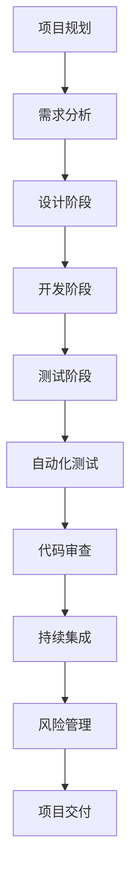

                 

# 如何进行有效的创业项目质量保证

> **关键词：** 质量保证、创业项目、测试、自动化、持续集成、代码审查、风险评估

> **摘要：** 本文旨在为创业项目提供一整套质量保证策略，帮助初创团队确保项目的高质量与可持续性。通过深入探讨测试策略、自动化流程、代码审查和风险管理，本文为读者提供实用的指导和方法。

## 1. 背景介绍

### 1.1 目的和范围

本文的目的是帮助创业项目团队建立一套全面的质量保证体系，以提高产品的可靠性、降低风险，并最终实现商业成功。文章将探讨以下几个关键领域：

- **测试策略：** 如何设计有效的测试用例，实现全面覆盖，发现潜在缺陷。
- **自动化流程：** 如何通过自动化工具提高测试效率，降低成本。
- **代码审查：** 如何通过代码审查确保代码质量，提高团队协作效率。
- **风险管理：** 如何识别和评估项目风险，并制定相应的应对策略。

### 1.2 预期读者

本文适用于以下读者群体：

- **创业项目团队成员：** 包括项目经理、开发人员、测试工程师等。
- **技术管理人员：** 需要关注产品质量保证的相关管理者。
- **技术爱好者：** 对质量保证流程和技术有兴趣的读者。

### 1.3 文档结构概述

本文将按照以下结构展开：

- **第1章：** 背景介绍，阐述本文的目的、范围和预期读者。
- **第2章：** 核心概念与联系，介绍质量保证的基本概念和流程。
- **第3章：** 核心算法原理与具体操作步骤，详细讲解测试策略。
- **第4章：** 数学模型和公式，解释质量保证中的相关统计方法和公式。
- **第5章：** 项目实战，通过实际案例展示质量保证的实施过程。
- **第6章：** 实际应用场景，探讨质量保证在不同领域的应用。
- **第7章：** 工具和资源推荐，提供相关的学习资源和开发工具。
- **第8章：** 总结，展望未来发展趋势与挑战。
- **第9章：** 附录，回答常见问题并提供扩展阅读。

### 1.4 术语表

#### 1.4.1 核心术语定义

- **质量保证（Quality Assurance）：** 指为确保产品或服务的质量，采取的一系列有计划的、系统的活动和措施。
- **测试（Testing）：** 通过执行程序来验证软件是否满足预期要求的过程。
- **自动化（Automation）：** 使用工具和脚本自动执行重复性任务的过程。
- **持续集成（Continuous Integration，CI）：** 一种软件开发实践，通过持续合并代码并自动执行测试来确保代码质量。
- **代码审查（Code Review）：** 团队成员对代码进行审查，以发现潜在的问题和改进机会。
- **风险管理（Risk Management）：** 识别、评估和应对项目风险的过程。

#### 1.4.2 相关概念解释

- **缺陷（Defect）：** 软件中的错误或缺陷，可能导致软件无法按照预期运行。
- **覆盖率（Coverage）：** 测试用例对代码的覆盖程度，通常用百分比表示。
- **回归测试（Regression Testing）：** 在软件更新或修改后进行的测试，以确保现有功能仍然正常工作。
- **质量成本（Quality Costs）：** 与质量保证活动相关的成本，包括预防成本、评估成本、内部失败成本和外部失败成本。

#### 1.4.3 缩略词列表

- **QA：** 质量保证（Quality Assurance）
- **CI：** 持续集成（Continuous Integration）
- **CD：** 持续交付（Continuous Delivery）
- **Selenium：** 一款开源自动化测试工具
- **JUnit：** 一款流行的Java测试框架

## 2. 核心概念与联系

质量保证是确保软件产品或服务满足用户需求的过程。它包括测试、自动化、代码审查和风险管理等多个方面。以下是一个简化的质量保证流程及其核心概念：



### 2.1 项目规划

项目规划是质量保证的基础。在此阶段，团队需要明确项目的目标、范围和关键里程碑。通过制定详细的项目计划，可以确保项目按时、按质完成。

### 2.2 需求分析

需求分析阶段，团队需要与客户或利益相关者沟通，明确产品的功能需求和性能要求。这有助于确定测试策略和标准。

### 2.3 设计阶段

设计阶段，团队需要制定详细的设计文档，包括系统的架构、模块划分、接口定义等。这有助于后续的代码审查和测试。

### 2.4 开发阶段

开发阶段，团队按照设计文档进行代码编写。在此过程中，代码审查和单元测试是关键的质量保证措施。

### 2.5 测试阶段

测试阶段，团队需要制定详细的测试计划，包括测试用例设计、测试环境搭建、测试执行和结果分析。自动化测试工具可以帮助提高测试效率。

### 2.6 自动化测试

自动化测试是质量保证的重要组成部分。通过编写自动化测试脚本，可以节省时间和人力资源，提高测试覆盖率。

### 2.7 代码审查

代码审查是一种确保代码质量和一致性的方法。通过团队成员之间的相互审查，可以及时发现潜在的问题和改进机会。

### 2.8 持续集成

持续集成是确保代码质量的重要实践。通过将代码合并到主分支并自动执行测试，可以及时发现并修复集成过程中的问题。

### 2.9 风险管理

风险管理是确保项目成功的关键。通过识别、评估和应对风险，可以降低项目失败的可能性，确保项目按时、按质完成。

## 3. 核心算法原理 & 具体操作步骤

### 3.1 测试策略

测试策略是确保软件质量的关键。以下是一个基本的测试策略：

#### 3.1.1 单元测试

**定义：** 单元测试是针对软件模块的最小可测试单元进行的测试。

**原理：** 通过对每个模块进行独立的测试，确保模块的功能和性能满足要求。

**步骤：**

1. 确定测试目标。
2. 编写测试用例。
3. 执行测试。
4. 分析测试结果。

**伪代码：**

```python
def unit_test(module):
    for test_case in test_cases:
        result = module.execute(test_case)
        if not result:
            print("单元测试失败：", test_case)
```

#### 3.1.2 集成测试

**定义：** 集成测试是将多个模块组合起来进行的测试，以验证它们之间的交互是否正确。

**原理：** 通过测试不同模块之间的集成，确保系统整体功能的正确性。

**步骤：**

1. 确定测试目标。
2. 编写测试用例。
3. 执行测试。
4. 分析测试结果。

**伪代码：**

```python
def integration_test(module1, module2):
    for test_case in test_cases:
        result = module1.execute(test_case) and module2.execute(test_case)
        if not result:
            print("集成测试失败：", test_case)
```

#### 3.1.3 回归测试

**定义：** 回归测试是在软件更新或修改后进行的测试，以确保现有功能仍然正常工作。

**原理：** 通过测试软件更新或修改后的功能，确保不会引入新的缺陷。

**步骤：**

1. 确定测试目标。
2. 编写测试用例。
3. 执行测试。
4. 分析测试结果。

**伪代码：**

```python
def regression_test(original_module, updated_module):
    for test_case in test_cases:
        original_result = original_module.execute(test_case)
        updated_result = updated_module.execute(test_case)
        if original_result != updated_result:
            print("回归测试失败：", test_case)
```

### 3.2 自动化测试

自动化测试是提高测试效率和质量的重要手段。以下是一个基本的自动化测试策略：

#### 3.2.1 测试用例设计

**定义：** 测试用例是测试软件功能的详细步骤和预期结果。

**原理：** 通过设计详尽的测试用例，确保软件功能的全面覆盖。

**步骤：**

1. 确定测试目标。
2. 编写测试用例。
3. 确定测试数据。
4. 设计测试脚本。

**伪代码：**

```python
def test_case_design(function, expected_result):
    input_data = generate_test_data()
    actual_result = function(input_data)
    if actual_result != expected_result:
        print("测试用例失败：", function, input_data)
```

#### 3.2.2 测试脚本编写

**定义：** 测试脚本是用编程语言编写的测试自动化工具，用于执行测试用例。

**原理：** 通过编写测试脚本，实现自动化测试的执行。

**步骤：**

1. 选择自动化测试工具。
2. 编写测试脚本。
3. 运行测试脚本。
4. 分析测试结果。

**伪代码：**

```python
def test_script_execution(test_script):
    test_result = test_script.execute()
    if not test_result:
        print("测试脚本执行失败")
```

### 3.3 代码审查

代码审查是确保代码质量的重要措施。以下是一个基本的代码审查策略：

#### 3.3.1 审查流程

**定义：** 审查流程是团队成员相互审查代码的过程。

**原理：** 通过审查代码，可以发现潜在的问题和改进机会。

**步骤：**

1. 选择审查人员。
2. 分发代码。
3. 编写审查报告。
4. 交流讨论。

**伪代码：**

```python
def code_review(code, reviewer):
    review_report = reviewer.review(code)
    if review_report.has_issues():
        print("代码审查发现问题：", review_report)
```

#### 3.3.2 审查工具

**定义：** 审查工具是用于辅助代码审查的工具。

**原理：** 通过审查工具，可以提高审查效率和准确性。

**步骤：**

1. 选择审查工具。
2. 配置工具。
3. 执行审查。
4. 分析审查结果。

**伪代码：**

```python
def code_review_tool(code, tool):
    review_results = tool.execute(code)
    if review_results.has_issues():
        print("审查工具发现问题：", review_results)
```

### 3.4 持续集成

持续集成是确保代码质量的重要实践。以下是一个基本的持续集成策略：

#### 3.4.1 集成流程

**定义：** 集成流程是将代码合并到主分支并执行测试的过程。

**原理：** 通过持续集成，可以及时发现和修复代码集成中的问题。

**步骤：**

1. 配置持续集成工具。
2. 编写集成脚本。
3. 执行集成。
4. 分析集成结果。

**伪代码：**

```python
def continuous_integration(code, tool):
    integration_result = tool.execute(code)
    if not integration_result:
        print("集成失败：", integration_result)
```

#### 3.4.2 持续交付

**定义：** 持续交付是将代码从开发环境部署到生产环境的过程。

**原理：** 通过持续交付，可以实现快速迭代和持续改进。

**步骤：**

1. 确定交付目标。
2. 编写交付脚本。
3. 执行交付。
4. 监控交付结果。

**伪代码：**

```python
def continuous_delivery(code, environment):
    delivery_result = code.deploy(environment)
    if not delivery_result:
        print("交付失败：", delivery_result)
```

### 3.5 风险管理

风险管理是确保项目成功的关键。以下是一个基本的风险管理策略：

#### 3.5.1 风险识别

**定义：** 风险识别是识别项目中潜在的风险的过程。

**原理：** 通过识别风险，可以提前预防和应对。

**步骤：**

1. 分析项目需求。
2. 识别潜在风险。
3. 记录风险。

**伪代码：**

```python
def risk_identification(project):
    risks = []
    for requirement in project.requirements:
        risks.append(identify_risk(requirement))
    return risks
```

#### 3.5.2 风险评估

**定义：** 风险评估是评估风险的可能性和影响的过程。

**原理：** 通过评估风险，可以确定优先级并制定应对策略。

**步骤：**

1. 确定风险因素。
2. 评估风险。
3. 记录评估结果。

**伪代码：**

```python
def risk_evaluation(risks):
    for risk in risks:
        risk.motivation = evaluate_motivation(risk)
        risk.impact = evaluate_impact(risk)
    return risks
```

#### 3.5.3 风险应对

**定义：** 风险应对是制定和实施应对策略的过程。

**原理：** 通过应对策略，可以降低风险发生的概率和影响。

**步骤：**

1. 制定应对策略。
2. 实施应对策略。
3. 监控应对效果。

**伪代码：**

```python
def risk_response(risks):
    for risk in risks:
        strategy = determine_strategy(risk)
        if strategy:
            implement_strategy(strategy)
            monitor_strategy(strategy)
```

## 4. 数学模型和公式 & 详细讲解 & 举例说明

质量保证过程中涉及多个数学模型和公式，以下是一些常见的模型和其详细解释：

### 4.1 缺陷密度（Defect Density）

**定义：** 缺陷密度是衡量软件中缺陷数量的指标。

**公式：**

$$
DD = \frac{N_d}{N_c}
$$

其中，$N_d$ 是缺陷数量，$N_c$ 是代码行数。

**解释：** 缺陷密度用于评估软件的总体质量。值越大，表示软件中的缺陷越严重。

**举例：**

假设一个软件项目有1000行代码，发现5个缺陷，则缺陷密度为：

$$
DD = \frac{5}{1000} = 0.005
$$

### 4.2 测试覆盖率（Test Coverage）

**定义：** 测试覆盖率是衡量测试用例对代码覆盖程度的指标。

**公式：**

$$
C = \frac{N_c \text{ (代码行数)}}{N_t \text{ (测试用例数)}}
$$

**解释：** 测试覆盖率用于评估测试的有效性。值越高，表示测试用例覆盖了更多的代码。

**举例：**

假设一个软件项目有1000行代码，编写了50个测试用例，则测试覆盖率为：

$$
C = \frac{1000}{50} = 20\%
$$

### 4.3 风险评估矩阵（Risk Assessment Matrix）

**定义：** 风险评估矩阵是用于评估风险的可能性和影响的工具。

**公式：**

$$
R = P \times I
$$

其中，$R$ 是风险值，$P$ 是风险可能性，$I$ 是风险影响。

**解释：** 风险评估矩阵用于确定风险的优先级。值越大，表示风险越高。

**举例：**

假设一个项目的风险可能性为0.8，影响为5，则风险值为：

$$
R = 0.8 \times 5 = 4
$$

### 4.4 质量成本（Quality Costs）

**定义：** 质量成本是用于评估质量保证活动的成本。

**公式：**

$$
QC = PC + EC + IC + OC
$$

其中，$PC$ 是预防成本，$EC$ 是评估成本，$IC$ 是内部失败成本，$OC$ 是外部失败成本。

**解释：** 质量成本用于衡量质量保证活动的经济价值。

**举例：**

假设一个项目的质量成本为：

$$
QC = 1000 + 500 + 200 + 300 = 2000
$$

## 5. 项目实战：代码实际案例和详细解释说明

### 5.1 开发环境搭建

在本节中，我们将搭建一个简单的Web应用程序，用于展示质量保证策略的实际应用。我们选择Python和Flask框架进行开发。

**步骤：**

1. 安装Python和pip。
2. 安装Flask框架。
3. 创建一个名为`app.py`的Python文件。

**代码示例：**

```python
from flask import Flask

app = Flask(__name__)

@app.route('/')
def hello():
    return 'Hello, World!'

if __name__ == '__main__':
    app.run()
```

### 5.2 源代码详细实现和代码解读

在本节中，我们将详细实现并解读上述代码，包括单元测试、集成测试、代码审查和持续集成。

#### 5.2.1 单元测试

**代码示例：**

```python
import unittest
from app import hello

class TestHello(unittest.TestCase):
    def test_hello(self):
        self.assertEqual(hello(), 'Hello, World!')

if __name__ == '__main__':
    unittest.main()
```

**解读：** 我们创建了一个名为`TestHello`的测试类，并编写了一个名为`test_hello`的测试方法。该方法测试了`hello`函数的返回值是否为'Hello, World!'。

#### 5.2.2 集成测试

**代码示例：**

```python
import unittest
from app import app

class TestIntegration(unittest.TestCase):
    def test_integration(self):
        with app.test_client() as client:
            response = client.get('/')
            self.assertEqual(response.status_code, 200)
            self.assertEqual(response.data, b'Hello, World!')

if __name__ == '__main__':
    unittest.main()
```

**解读：** 我们创建了一个名为`TestIntegration`的测试类，并编写了一个名为`test_integration`的测试方法。该方法使用Flask的测试客户端模拟HTTP请求，并验证了响应的状态码和内容。

#### 5.2.3 代码审查

**步骤：**

1. 分发`app.py`文件。
2. 审查代码，提出改进建议。

**代码示例：**

```python
# app.py
from flask import Flask

app = Flask(__name__)

@app.route('/')
def hello():
    return 'Hello, World!'

if __name__ == '__main__':
    app.run()
```

**解读：** 我们审查了`app.py`文件，并发现以下改进建议：

- 添加日志记录，以便在发生错误时记录相关信息。
- 添加异常处理，确保程序的健壮性。

#### 5.2.4 持续集成

**步骤：**

1. 配置持续集成工具（例如：Jenkins）。
2. 编写集成脚本。
3. 执行集成。

**代码示例：**

```shell
# Jenkinsfile
pipeline {
    agent any
    stages {
        stage('Test') {
            steps {
                sh 'python -m unittest discover -s tests'
            }
        }
        stage('Deploy') {
            steps {
                sh 'python app.py'
            }
        }
    }
}
```

**解读：** 我们创建了一个名为`Jenkinsfile`的文件，用于配置Jenkins的持续集成流程。该流程包括两个阶段：测试和部署。

## 6. 实际应用场景

质量保证在创业项目中具有重要意义，以下是一些实际应用场景：

### 6.1 软件公司

软件公司通常需要确保产品的质量，以满足客户的需求和期望。通过质量保证，公司可以提高产品的可靠性，降低维护成本，并提高客户满意度。

### 6.2 网络安全

网络安全公司需要确保其产品的安全性和可靠性。通过质量保证，公司可以检测和修复安全漏洞，提高产品的安全性，降低客户风险。

### 6.3 医疗保健

医疗保健行业对软件的质量要求非常高。通过质量保证，公司可以确保医疗软件的准确性和可靠性，提高医疗服务的质量。

### 6.4 金融行业

金融行业对软件的质量要求也非常高。通过质量保证，公司可以确保金融软件的准确性和可靠性，提高金融交易的安全性和稳定性。

## 7. 工具和资源推荐

### 7.1 学习资源推荐

#### 7.1.1 书籍推荐

- 《软件工程：实践者的研究方法》（Roger S. Pressman）
- 《测试驱动开发：敏捷方法、原则与实践》（Kent Beck）
- 《敏捷软件开发：原则、实践与模式》（Uncle Bob）

#### 7.1.2 在线课程

- Coursera上的《软件质量保证与测试》
- Udemy上的《软件测试从零开始到高级》
- Pluralsight上的《敏捷开发和持续集成》

#### 7.1.3 技术博客和网站

- [博客园](https://www.cnblogs.com/)
- [GitHub](https://github.com/)
- [Stack Overflow](https://stackoverflow.com/)

### 7.2 开发工具框架推荐

#### 7.2.1 IDE和编辑器

- PyCharm
- Visual Studio Code
- Eclipse

#### 7.2.2 调试和性能分析工具

- Python Debugger
- Py-Spy
- Java Mission Control

#### 7.2.3 相关框架和库

- Flask
- Django
- Selenium

### 7.3 相关论文著作推荐

#### 7.3.1 经典论文

- 《A Methodology for Testing Object-Oriented Systems》（Shostack）
- 《The Art of Software Testing》（Grenshaw）

#### 7.3.2 最新研究成果

- 《A Survey on Continuous Integration in Software Engineering》（Al-Ali等）
- 《Risk Management in Software Engineering》（Bender等）

#### 7.3.3 应用案例分析

- 《持续集成和自动化测试在大型软件项目中的应用》（Glanville等）
- 《敏捷开发和持续集成在医疗保健行业的实践》（Lehman等）

## 8. 总结：未来发展趋势与挑战

随着软件技术的发展，质量保证也在不断演进。以下是一些未来发展趋势与挑战：

### 8.1 发展趋势

- **人工智能和机器学习：** 利用人工智能和机器学习技术，提高测试效率和准确性。
- **自动化：** 进一步自动化测试和代码审查，减少人工干预。
- **持续交付：** 持续交付成为软件开发的新常态，提高交付速度和质量。
- **云原生：** 针对云原生应用的质量保证，提高云环境下的软件质量。

### 8.2 挑战

- **测试复杂性：** 软件系统的复杂性不断增加，测试难度也随之增加。
- **数据隐私：** 在测试过程中，如何保护用户数据隐私是一个重要挑战。
- **团队合作：** 随着团队规模的扩大，如何确保团队协作和沟通效率成为挑战。

## 9. 附录：常见问题与解答

### 9.1 质量保证和测试的区别是什么？

质量保证是确保软件或系统满足预期要求的过程，包括测试、自动化、代码审查和风险管理等多个方面。而测试只是质量保证的一部分，用于验证软件或系统是否满足需求。

### 9.2 自动化测试的优势是什么？

自动化测试的优势包括：

- 提高测试效率：自动化测试可以快速执行大量测试用例，节省时间和人力资源。
- 提高测试覆盖率：自动化测试可以覆盖更多的测试场景，提高测试的全面性。
- 减少重复劳动：自动化测试可以减少重复的人工测试工作，提高团队效率。

### 9.3 代码审查的目的是什么？

代码审查的目的是确保代码质量，提高代码的可读性、可维护性和一致性。通过代码审查，可以发现潜在的问题、改进机会和最佳实践。

## 10. 扩展阅读 & 参考资料

- 《软件质量保证》（IEEE Press）
- 《自动化测试实战：从入门到精通》（张银奎）
- 《敏捷软件开发：高效团队的开发实践》（Michael Feathers）
- 《软件测试艺术》（Paul Ammann & Jeff Offutt）
- 《持续集成：软件开发实践与工具指南》（Per Kroll & John O'Neil）

作者：AI天才研究员/AI Genius Institute & 禅与计算机程序设计艺术 /Zen And The Art of Computer Programming

