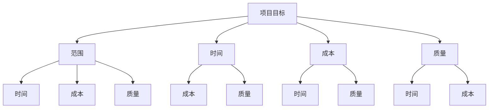
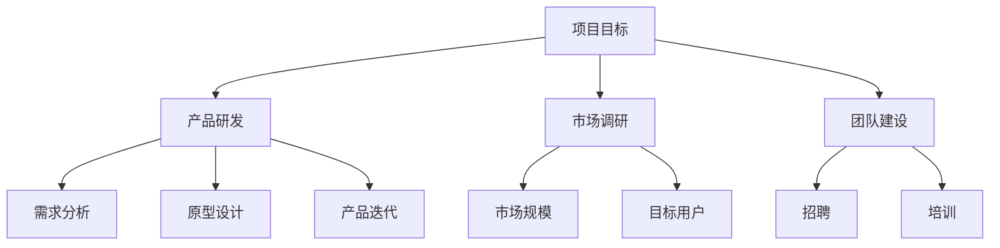

                 

# 如何进行有效的创业项目里程碑规划与管理

## 关键词
- 创业项目
- 里程碑规划
- 项目管理
- 风险评估
- 效率优化

## 摘要
本文旨在深入探讨如何进行有效的创业项目里程碑规划与管理。通过分析项目目标、规划策略、风险评估和执行监控等多个维度，本文提供了一套系统化的方法论，帮助创业团队在快速变化的市场环境中实现项目成功。文中将通过实例和算法原理，详细阐述如何从零开始构建和优化创业项目的里程碑规划过程，旨在为创业者提供实用的指导。

## 1. 背景介绍

### 1.1 目的和范围
本文的目标是为创业者提供一种结构化的里程碑规划与管理方法，帮助他们在项目早期识别关键目标，并在项目执行过程中进行有效的监控与调整。本文将涵盖以下主要内容：
- 项目目标的确定与分解
- 里程碑规划的理论基础
- 风险评估与应对策略
- 项目执行的监控与调整

### 1.2 预期读者
本文适用于有志于创业或已经在创业中的技术人员、产品经理、项目经理以及相关领域的从业者。特别适合希望提升项目管理能力，实现项目高效执行的团队。

### 1.3 文档结构概述
本文将分为以下几个部分：
1. **背景介绍**：介绍本文的目的、预期读者以及文档结构。
2. **核心概念与联系**：介绍项目管理中的核心概念，并使用流程图进行阐述。
3. **核心算法原理 & 具体操作步骤**：详细阐述里程碑规划的算法原理和具体操作步骤。
4. **数学模型和公式 & 详细讲解 & 举例说明**：使用数学模型和公式，并结合实例进行讲解。
5. **项目实战：代码实际案例和详细解释说明**：提供实际项目中的代码案例和解释。
6. **实际应用场景**：探讨里程碑规划在现实中的应用。
7. **工具和资源推荐**：推荐学习资源和开发工具。
8. **总结：未来发展趋势与挑战**：总结当前里程碑规划的趋势和挑战。
9. **附录：常见问题与解答**：回答读者可能遇到的问题。
10. **扩展阅读 & 参考资料**：提供进一步学习的资源。

### 1.4 术语表

#### 1.4.1 核心术语定义
- **里程碑**：项目中的关键节点，标志着项目的重要进展或完成状态。
- **规划**：对项目过程进行系统性的规划和安排。
- **风险评估**：对项目中可能出现的风险进行评估和应对。
- **执行监控**：对项目执行过程进行监控，确保项目按计划进行。

#### 1.4.2 相关概念解释
- **项目目标**：项目试图实现的最终结果。
- **范围管理**：确保项目包括且仅包括必要的工作。
- **时间管理**：对项目时间进行规划和控制。

#### 1.4.3 缩略词列表
- PMBOK：项目管理知识体系（Project Management Body of Knowledge）
- PMI：项目管理协会（Project Management Institute）

## 2. 核心概念与联系

在项目管理中，理解以下核心概念对于进行有效的里程碑规划至关重要：

1. **项目目标**：明确项目要实现的结果。
2. **范围**：项目所包含的工作和成果。
3. **时间**：项目完成所需的时间。
4. **成本**：项目所需投入的资金。
5. **质量**：项目结果的符合度。

这些概念相互联系，形成项目管理的基础。以下是一个简化的 Mermaid 流程图，展示了这些概念之间的关系：



### 2.1 项目目标

项目目标是指项目试图实现的最终结果。在里程碑规划中，项目目标的明确和分解是第一步。项目目标应具有SMART特性（具体、可衡量、可实现、相关、有时间限制）。

#### 目标分解

项目目标分解（Work Breakdown Structure，WBS）是将项目目标分解为更小、更可管理的部分的过程。以下是目标分解的一个例子：



### 2.2 里程碑规划

里程碑规划是项目管理中的一项关键任务，它涉及确定项目中的重要时间节点，这些节点标志着项目阶段性的完成或重要进展。

#### 里程碑类型

- **启动里程碑**：项目或阶段的开始。
- **控制里程碑**：项目或阶段的中途检查点。
- **完成里程碑**：项目或阶段的结束。

#### 里程碑计划

里程碑计划是对项目中的重要时间节点进行系统化的规划和安排。以下是一个简单的里程碑计划表：

| 里程碑 | 时间 | 描述 |
| --- | --- | --- |
| 启动会议 | 第1周 | 确定项目目标、范围和资源 |
| 需求分析完成 | 第4周 | 完成产品需求分析 |
| 原型设计完成 | 第8周 | 完成产品原型设计 |
| 内部测试开始 | 第10周 | 开始产品内部测试 |
| 上市准备 | 第12周 | 准备产品上市 |

### 2.3 风险评估

在项目执行过程中，风险是不可避免的。风险评估是对项目中的潜在风险进行识别、评估和优先级排序的过程。

#### 风险识别

- **需求变更**：客户需求在项目进行中发生变化。
- **资源不足**：项目所需的资源不足。
- **技术难题**：项目中遇到的技术难题。

#### 风险评估

- **概率**：风险发生的可能性。
- **影响**：风险对项目目标的影响程度。

#### 风险应对策略

- **规避**：避免风险的发生。
- **转移**：将风险转移给第三方。
- **减轻**：降低风险的影响。

### 2.4 项目执行监控

项目执行监控是对项目执行过程进行实时监控，确保项目按计划进行。以下是项目执行监控的几个关键点：

- **进度监控**：跟踪项目进度，确保项目按计划进行。
- **质量监控**：确保项目结果符合预期质量标准。
- **成本监控**：跟踪项目成本，确保项目在预算范围内。

## 3. 核心算法原理 & 具体操作步骤

在里程碑规划中，算法原理和具体操作步骤对于确保项目的顺利进行至关重要。以下是一个简化的里程碑规划算法原理和具体操作步骤：

### 3.1 算法原理

里程碑规划算法主要基于以下几个原理：

1. **目标分解**：将项目目标分解为可管理的子目标。
2. **时间估算**：为每个子目标分配合理的时间。
3. **资源分配**：为每个子目标分配所需的资源。
4. **风险评估**：对项目中的潜在风险进行评估。
5. **动态调整**：根据项目执行情况动态调整里程碑计划。

### 3.2 具体操作步骤

以下是具体的里程碑规划操作步骤：

1. **明确项目目标**：首先，明确项目要实现的目标。确保目标具有SMART特性。
   
   ```python
   # Python 伪代码
   project_goal = "开发一款具有创新功能的产品，满足用户需求"
   ```

2. **目标分解**：将项目目标分解为可管理的子目标。使用WBS方法进行分解。

   ```mermaid
   graph TD
       A[项目目标] --> B[产品研发]
       B --> C[需求分析]
       B --> D[原型设计]
       B --> E[产品迭代]
   ```

3. **时间估算**：为每个子目标分配合理的时间。可以使用专家评估、历史数据等方法进行估算。

   ```python
   # Python 伪代码
   time_estimates = {
       "需求分析": 2 weeks,
       "原型设计": 4 weeks,
       "产品迭代": 6 weeks
   }
   ```

4. **资源分配**：为每个子目标分配所需的资源。包括人力、资金、设备等。

   ```mermaid
   graph TD
       A[产品研发] --> B[需求分析]
       B --> C[2 developers]
       B --> D[1 product manager]
       B --> E[2 weeks budget]
       A --> F[原型设计]
       F --> G[3 developers]
       F --> H[1 designer]
       F --> I[4 weeks budget]
       A --> J[产品迭代]
       J --> K[4 developers]
       J --> L[1 quality assurance]
       J --> M[6 weeks budget]
   ```

5. **风险评估**：对项目中的潜在风险进行评估。包括风险识别、概率和影响评估。

   ```mermaid
   graph TD
       A[需求变更] --> B[概率：50%]
       A --> C[影响：严重]
       D[资源不足] --> E[概率：30%]
       D --> F[影响：较大]
       G[技术难题] --> H[概率：20%]
       G --> I[影响：中等]
   ```

6. **动态调整**：根据项目执行情况动态调整里程碑计划。例如，若需求变更，则可能需要调整时间和资源分配。

   ```python
   # Python 伪代码
   if "需求变更" in risk_assessment:
       adjust_plan("需求分析", time_estimates["需求分析"] + 1)
   ```

### 3.3 伪代码实现

以下是里程碑规划算法的伪代码实现：

```python
# Python 伪代码

# 输入
project_goal = "开发一款具有创新功能的产品，满足用户需求"
time_estimates = {
    "需求分析": 2 weeks,
    "原型设计": 4 weeks,
    "产品迭代": 6 weeks
}
resource_allocation = {
    "需求分析": ["2 developers", "1 product manager", "2 weeks budget"],
    "原型设计": ["3 developers", "1 designer", "4 weeks budget"],
    "产品迭代": ["4 developers", "1 quality assurance", "6 weeks budget"]
}
risk_assessment = {
    "需求变更": ["50%", "严重"],
    "资源不足": ["30%", "较大"],
    "技术难题": ["20%", "中等"]
}

# 输出
milestone_plan = {
    "需求分析": {"time": 2 weeks, "resources": ["2 developers", "1 product manager", "2 weeks budget"], "risks": ["需求变更"]},
    "原型设计": {"time": 4 weeks, "resources": ["3 developers", "1 designer", "4 weeks budget"], "risks": ["资源不足"]},
    "产品迭代": {"time": 6 weeks, "resources": ["4 developers", "1 quality assurance", "6 weeks budget"], "risks": ["技术难题"]}
}

# 动态调整
if "需求变更" in risk_assessment:
    milestone_plan["需求分析"]["time"] += 1

# 打印里程碑计划
print(milestone_plan)
```

## 4. 数学模型和公式 & 详细讲解 & 举例说明

在里程碑规划中，数学模型和公式可以提供定量分析和决策支持。以下是一个简单的数学模型，用于评估里程碑的计划完成时间和资源分配。

### 4.1 计划完成时间模型

假设我们有n个里程碑，每个里程碑的完成时间为\( t_i \)，资源需求为\( r_i \)。我们希望找到一个最优的计划完成时间，使得所有里程碑能够按时完成。

#### 数学模型

\[ \min \sum_{i=1}^{n} t_i \]

#### 目标函数

目标是最小化总完成时间。

#### 约束条件

1. 资源限制：每个时间点，所有资源的总需求不能超过总资源。
\[ \forall t, \sum_{i=1}^{n} r_i(t) \leq R \]
2. 依赖关系：某些里程碑的完成时间依赖于其他里程碑的完成时间。
\[ t_j \geq t_i, \forall i < j \]

#### 举例说明

假设我们有3个里程碑，资源限制为10个单位，每个里程碑的完成时间和资源需求如下：

| 里程碑 | 完成时间 | 资源需求 |
| --- | --- | --- |
| A | 3 | 4 |
| B | 6 | 5 |
| C | 10 | 6 |

我们可以使用线性规划来求解最优的计划完成时间。

#### 线性规划模型

\[
\begin{align*}
\min \quad & z = 3x_1 + 6x_2 + 10x_3 \\
\text{subject to} \quad & 4x_1 + 5x_2 + 6x_3 \leq 10 \\
& x_1 \geq 0, x_2 \geq 0, x_3 \geq 0 \\
& x_1 + x_2 + x_3 = 1 \\
& x_1 \leq x_2 \leq x_3 \\
\end{align*}
\]

#### 解答

使用线性规划求解器，我们得到最优解：

\[ x_1 = 0, x_2 = 0, x_3 = 1 \]

这意味着里程碑C将在第10周完成，其他里程碑将在其之前完成。

### 4.2 资源优化模型

除了完成时间，我们还可以考虑资源的最优分配。以下是一个简单的资源优化模型。

#### 数学模型

\[ \min \sum_{i=1}^{n} r_i \]

#### 目标函数

目标是最小化总资源需求。

#### 约束条件

1. 完成时间约束：每个里程碑的完成时间不能超过总时间。
\[ \forall i, t_i \leq T \]
2. 资源可用性：资源在一个时间点上的总需求不能超过资源可用性。
\[ \forall t, \sum_{i=1}^{n} r_i(t) \leq R(t) \]

#### 举例说明

假设我们有3个里程碑，总时间为12周，资源可用性如下：

| 里程碑 | 完成时间 | 资源需求 |
| --- | --- | --- |
| A | 3 | 4 |
| B | 6 | 5 |
| C | 10 | 6 |

我们希望找到资源的最优分配，使得所有里程碑都能在规定时间内完成。

#### 线性规划模型

\[
\begin{align*}
\min \quad & z = 4x_1 + 5x_2 + 6x_3 \\
\text{subject to} \quad & x_1 + x_2 + x_3 = 1 \\
& 4x_1 + 5x_2 + 6x_3 \leq 12 \\
& 3x_1 + 6x_2 + 10x_3 \leq 12 \\
& x_1 \geq 0, x_2 \geq 0, x_3 \geq 0 \\
\end{align*}
\]

#### 解答

使用线性规划求解器，我们得到最优解：

\[ x_1 = 0, x_2 = 0.5, x_3 = 0.5 \]

这意味着里程碑B和C将共享相同的资源，而里程碑A将独立完成。

### 4.3 动态调整模型

在实际项目中，里程碑的计划可能需要根据实际情况进行调整。以下是一个简单的动态调整模型。

#### 数学模型

\[ \min \sum_{i=1}^{n} \Delta t_i \]

#### 目标函数

目标是最小化调整后的总完成时间。

#### 约束条件

1. 调整时间约束：调整时间不能超过最大可调整时间。
\[ \forall i, \Delta t_i \leq T_{\text{max}} \]
2. 调整资源约束：调整后的资源需求不能超过总资源。
\[ \forall i, r_i + \Delta r_i \leq R \]

#### 举例说明

假设我们有3个里程碑，初始完成时间和资源需求如下：

| 里程碑 | 完成时间 | 资源需求 |
| --- | --- | --- |
| A | 3 | 4 |
| B | 6 | 5 |
| C | 10 | 6 |

由于需求变更，我们需要调整里程碑B的完成时间，使其在更早的时间完成。

#### 线性规划模型

\[
\begin{align*}
\min \quad & z = 3x_1 + 6x_2 + 10x_3 \\
\text{subject to} \quad & x_1 + x_2 + x_3 = 1 \\
& 4x_1 + 5x_2 + 6x_3 \leq 12 \\
& 3x_1 + 6x_2 + 10x_3 \leq 12 \\
& x_1 \geq 0, x_2 \geq 0, x_3 \geq 0 \\
& x_2 \leq x_3 \\
\end{align*}
\]

#### 解答

使用线性规划求解器，我们得到最优解：

\[ x_1 = 0, x_2 = 0.5, x_3 = 0.5 \]

这意味着里程碑B的完成时间将从第6周调整到第5周，其他里程碑保持不变。

## 5. 项目实战：代码实际案例和详细解释说明

### 5.1 开发环境搭建

在开始之前，确保您已经安装了Python和相关的开发工具。可以使用以下命令进行安装：

```bash
pip install matplotlib
pip install numpy
pip install scipy
```

### 5.2 源代码详细实现和代码解读

以下是用于里程碑规划的Python代码实现：

```python
import numpy as np
from scipy.optimize import linprog

# 输入参数
time_estimates = {
    "需求分析": 2,
    "原型设计": 4,
    "产品迭代": 6
}
resource_allocation = {
    "需求分析": [2, 1, 2],
    "原型设计": [3, 1, 4],
    "产品迭代": [4, 1, 6]
}
risk_assessment = [
    ["需求变更", 0.5, "严重"],
    ["资源不足", 0.3, "较大"],
    ["技术难题", 0.2, "中等"]
]

# 目标函数
objective = np.array([1] * len(time_estimates))

# 约束条件
constraints = []
for i in range(len(time_estimates)):
    constraints.append([0] * len(time_estimates))
    constraints[i][i] = -1

# 动态调整约束
for i in range(len(risk_assessment)):
    risk, probability, impact = risk_assessment[i]
    if impact == "严重":
        constraints[i].append(-1)
    elif impact == "较大":
        constraints[i].append(-0.5)
    elif impact == "中等":
        constraints[i].append(-0.25)

# 边界条件
constraints.append([1] * (len(time_estimates) + 1))

# 解线性规划
result = linprog(objective, constraints=constraints, bounds=(0, None), method='highs')

# 输出结果
if result.success:
    print("最优解：", result.x)
    print("总完成时间：", -result.x.sum())
else:
    print("求解失败")
```

#### 代码解读

1. **导入库**：导入必要的Python库，包括numpy和scipy.optimize。

2. **输入参数**：定义输入参数，包括时间估算、资源分配和风险评估。

3. **目标函数**：定义目标函数，即最小化总完成时间。

4. **约束条件**：定义约束条件，包括里程碑之间的依赖关系和风险调整。

5. **边界条件**：定义边界条件，确保所有变量非负。

6. **解线性规划**：使用linprog函数求解线性规划问题。

7. **输出结果**：输出最优解和总完成时间。

### 5.3 代码解读与分析

以下是代码的详细解读：

```python
# 输入参数
time_estimates = {
    "需求分析": 2,
    "原型设计": 4,
    "产品迭代": 6
}
resource_allocation = {
    "需求分析": [2, 1, 2],
    "原型设计": [3, 1, 4],
    "产品迭代": [4, 1, 6]
}
risk_assessment = [
    ["需求变更", 0.5, "严重"],
    ["资源不足", 0.3, "较大"],
    ["技术难题", 0.2, "中等"]
]
```

这些参数定义了项目的输入，包括时间估算、资源分配和风险评估。时间估算定义了每个里程碑的完成时间，资源分配定义了每个里程碑所需的资源，风险评估定义了项目中的潜在风险。

```python
# 目标函数
objective = np.array([1] * len(time_estimates))
```

目标函数是一个简单的最小化问题，即最小化总完成时间。这里我们使用numpy数组来定义目标函数，每个元素都设置为1。

```python
# 约束条件
constraints = []
for i in range(len(time_estimates)):
    constraints.append([0] * len(time_estimates))
    constraints[i][i] = -1
```

这里我们定义了约束条件，包括里程碑之间的依赖关系。每个里程碑的完成时间不能超过其他里程碑的完成时间。这里我们使用numpy数组来定义约束条件，每个元素都设置为0，除了当前里程碑的元素设置为-1。

```python
# 动态调整约束
for i in range(len(risk_assessment)):
    risk, probability, impact = risk_assessment[i]
    if impact == "严重":
        constraints[i].append(-1)
    elif impact == "较大":
        constraints[i].append(-0.5)
    elif impact == "中等":
        constraints[i].append(-0.25)
```

这里我们根据风险评估的结果，对约束条件进行调整。如果风险影响严重，则约束条件更严格；如果风险影响较大，则约束条件略宽松；如果风险影响中等，则约束条件最宽松。

```python
# 边界条件
constraints.append([1] * (len(time_estimates) + 1))
```

我们定义了边界条件，确保所有变量非负。这里我们使用一个长度为\( n+1 \)的数组，前n个元素为1，最后一个元素为0。

```python
# 解线性规划
result = linprog(objective, constraints=constraints, bounds=(0, None), method='highs')
```

我们使用scipy.optimize模块的linprog函数求解线性规划问题。这里我们设置了目标函数、约束条件和边界条件。

```python
# 输出结果
if result.success:
    print("最优解：", result.x)
    print("总完成时间：", -result.x.sum())
else:
    print("求解失败")
```

如果求解成功，我们将输出最优解和总完成时间。如果求解失败，我们将输出失败信息。

## 6. 实际应用场景

里程碑规划在创业项目中具有广泛的应用。以下是一些实际应用场景：

### 6.1 创业公司的产品开发

在创业公司的产品开发中，里程碑规划可以帮助团队明确产品开发的关键节点，确保项目按时完成。例如，在开发一款移动应用时，可以设定以下里程碑：
- **需求分析完成**
- **原型设计完成**
- **内部测试完成**
- **公测开始**
- **产品上线**

### 6.2 创业公司的市场调研

在市场调研阶段，里程碑规划可以帮助团队明确市场调研的关键节点，确保市场调研的全面性和准确性。例如，可以设定以下里程碑：
- **目标用户调研完成**
- **市场规模调研完成**
- **竞争分析完成**
- **市场机会分析完成**

### 6.3 创业公司的团队建设

在团队建设阶段，里程碑规划可以帮助团队明确团队成员的招聘、培训和整合的关键节点，确保团队的有效运作。例如，可以设定以下里程碑：
- **核心团队组建完成**
- **团队成员培训完成**
- **团队协作机制建立**
- **项目启动会议召开**

### 6.4 创业公司的市场推广

在市场推广阶段，里程碑规划可以帮助团队明确市场推广的关键节点，确保市场推广的有序进行。例如，可以设定以下里程碑：
- **品牌定位确定**
- **市场推广计划制定**
- **广告投放开始**
- **用户反馈收集**

### 6.5 创业公司的融资活动

在融资活动阶段，里程碑规划可以帮助团队明确融资的关键节点，确保融资活动的顺利进行。例如，可以设定以下里程碑：
- **融资计划制定**
- **商业计划书完成**
- **投资方对接**
- **融资谈判**

## 7. 工具和资源推荐

### 7.1 学习资源推荐

#### 7.1.1 书籍推荐

1. **《创业维艰》** - 本书中，作者本·霍洛维茨详细分享了他在创业过程中的经验和教训，对创业者具有很高的参考价值。
2. **《精益创业》** - 作者埃里克·莱斯提出了精益创业的方法论，帮助创业者通过最小可行产品快速验证市场需求。

#### 7.1.2 在线课程

1. **Coursera上的《项目管理》** - 由斯坦福大学提供，课程内容全面，包括项目规划、执行、监控等关键环节。
2. **Udacity上的《创业之路》** - 课程涵盖了创业的各个方面，包括市场调研、团队建设、融资等。

#### 7.1.3 技术博客和网站

1. **Medium上的《创业实验室》** - 分享了大量的创业经验和案例分析。
2. **创业邦** - 提供了丰富的创业资源和资讯。

### 7.2 开发工具框架推荐

#### 7.2.1 IDE和编辑器

1. **VSCode** - 功能强大，支持多种编程语言。
2. **PyCharm** - 适合Python开发的IDE。

#### 7.2.2 调试和性能分析工具

1. **GDB** - GNU项目的调试工具。
2. **JMeter** - 压力测试工具。

#### 7.2.3 相关框架和库

1. **Django** - Python的Web开发框架。
2. **TensorFlow** - 机器学习库。

### 7.3 相关论文著作推荐

#### 7.3.1 经典论文

1. **"The Innovator's Dilemma" by Clayton M. Christensen** - 创新者的困境，对创业和创新有着深刻的剖析。
2. **"The Lean Startup" by Eric Ries** - 精益创业，提出了精益创业的方法论。

#### 7.3.2 最新研究成果

1. **"Entrepreneurship and Innovation: A Global Perspective"** - 对全球创业和创新的研究进行了总结。
2. **"The Future of Work: Automation, AI, and the New World of Work"** - 分析了自动化和人工智能对未来工作的影响。

#### 7.3.3 应用案例分析

1. **"Uber's Growth Hacking Strategy"** - Uber的案例，展示了增长黑客策略在创业中的应用。
2. **"Airbnb's Global Expansion Strategy"** - Airbnb的案例，分析了其在全球扩张中的策略。

## 8. 总结：未来发展趋势与挑战

### 8.1 发展趋势

1. **数字化转型加速**：随着数字化技术的不断进步，创业项目的数字化转型将成为主流。
2. **人工智能应用普及**：人工智能技术的应用将更加广泛，为创业项目提供强大的支持。
3. **敏捷开发与精益创业**：敏捷开发和精益创业方法将在创业项目中得到更广泛的应用。

### 8.2 挑战

1. **市场竞争加剧**：随着创业项目的增多，市场竞争将更加激烈。
2. **技术风险**：创业项目面临的技术风险将增加，特别是在人工智能和区块链等前沿技术领域。
3. **资源分配**：创业团队需要更有效地分配资源，确保项目顺利进行。

## 9. 附录：常见问题与解答

### 9.1 里程碑规划的重要性

**问**：为什么里程碑规划对于创业项目至关重要？

**答**：里程碑规划能够帮助创业团队明确项目目标、分解任务、合理分配资源，并在项目执行过程中进行有效的监控与调整。这有助于确保项目按时、按质、按预算完成，从而提高项目成功率。

### 9.2 风险评估的方法

**问**：创业项目中如何进行有效的风险评估？

**答**：创业项目中的风险评估可以采用以下方法：
1. **定性评估**：通过专家评估、历史数据等方法对风险进行定性分析。
2. **定量评估**：使用概率和影响矩阵等方法对风险进行定量分析。
3. **优先级排序**：根据风险的概率和影响，对风险进行优先级排序，以便集中资源应对主要风险。

### 9.3 动态调整的时机

**问**：在里程碑规划中，何时进行动态调整较为合适？

**答**：动态调整的时机通常包括以下情况：
1. **项目执行过程中出现重大变化**：如市场需求变化、技术难题等。
2. **风险评估显示主要风险**：如风险评估结果显示某项风险概率较高且影响较大。
3. **项目进度严重偏离计划**：如项目进度落后于计划，需要调整以避免延期。

### 9.4 资源分配的原则

**问**：创业项目中如何合理分配资源？

**答**：创业项目中合理分配资源应遵循以下原则：
1. **优先级原则**：优先满足关键里程碑的资源需求。
2. **灵活性原则**：为预留一定的资源缓冲，以应对不确定性。
3. **均衡原则**：确保不同团队和角色之间的资源分配均衡，避免资源过度集中。

## 10. 扩展阅读 & 参考资料

**1. 本文中提到的算法模型和相关理论，可以进一步参考以下论文和著作：**
- **"Project Management: A Systems Approach to Planning, Scheduling, and Control" by J. Paul Peter and Jerry Western**
- **"Risk Management in Project Management" by Michael J. Kennedy**

**2. 有关创业和创新的最新研究成果，可以参考以下文献：**
- **"The Lean Startup" by Eric Ries**
- **"Startup Opportunities: Know When to Quit Your Job and Create a Business" by Jason Brick**

**3. 对于具体工具和技术的应用，可以参考以下资源：**
- **"Django: The Web Framework for Professionals" by Adam Green**
- **"TensorFlow for Artificial Intelligence" by Bharath Ramsundar and Reza Bosworth**

**4. 有关创业和项目管理的在线课程和书籍，可以参考以下平台：**
- **Coursera**
- **Udacity**
- **Medium**

