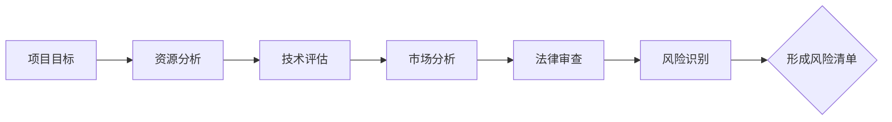

                 


# 如何进行有效的创业项目风险跟踪与控制

> 关键词：创业项目，风险跟踪，风险控制，项目管理，风险评估

> 摘要：本文将探讨如何有效地对创业项目进行风险跟踪与控制。我们将分析创业项目中的常见风险类型，介绍风险跟踪与控制的核心概念，提供具体的操作步骤和方法，并通过实战案例进行详细讲解，旨在帮助创业者和管理者更好地应对和解决创业过程中的风险问题。

## 1. 背景介绍

### 1.1 目的和范围

本文旨在为创业者和管理者提供一套有效的创业项目风险跟踪与控制的方法。我们将从理论到实践，详细讲解如何识别、评估、跟踪和控制创业项目中的风险。本文主要涵盖以下内容：

- 创业项目风险的类型与特征
- 风险跟踪与控制的核心概念
- 风险跟踪与控制的具体操作步骤
- 实战案例解析
- 风险跟踪与控制的未来发展趋势

### 1.2 预期读者

本文适合以下读者：

- 创业者：希望了解如何有效管理创业项目风险的创业者
- 项目管理者：希望提升项目管理技能，有效应对项目风险的经理人员
- 风险管理专家：希望掌握创业项目风险跟踪与控制方法的专业人士
- 教育者：希望为学生提供创业项目风险管理知识的教师

### 1.3 文档结构概述

本文结构如下：

- 第1章：背景介绍，包括本文的目的、范围、预期读者和文档结构概述
- 第2章：核心概念与联系，介绍创业项目风险跟踪与控制的核心概念和架构
- 第3章：核心算法原理 & 具体操作步骤，讲解风险跟踪与控制的具体操作步骤
- 第4章：数学模型和公式 & 详细讲解 & 举例说明，介绍风险跟踪与控制相关的数学模型和公式
- 第5章：项目实战：代码实际案例和详细解释说明，通过实战案例讲解风险跟踪与控制的应用
- 第6章：实际应用场景，分析创业项目中常见风险的应用场景
- 第7章：工具和资源推荐，推荐相关的学习资源、开发工具和框架
- 第8章：总结：未来发展趋势与挑战，总结本文的核心观点，展望未来的发展趋势与挑战
- 第9章：附录：常见问题与解答，解答读者可能遇到的问题
- 第10章：扩展阅读 & 参考资料，提供进一步的阅读资料和参考

### 1.4 术语表

#### 1.4.1 核心术语定义

- 创业项目：指创业者或创业团队在商业领域进行的创新性经营活动。
- 风险：指在创业项目中可能出现的负面事件，可能导致项目目标无法实现。
- 风险跟踪：指对创业项目中的风险进行识别、评估、监控和记录的过程。
- 风险控制：指通过风险管理措施来降低风险的发生概率和影响程度。
- 风险评估：指对创业项目中的风险进行识别、评估和优先级排序的过程。
- 风险矩阵：指用于表示风险概率和影响程度的矩阵。
- 风险响应策略：指针对不同类型的风险，制定的具体应对措施和方案。

#### 1.4.2 相关概念解释

- 风险管理：指对创业项目中的风险进行识别、评估、跟踪和控制的过程，旨在降低风险对项目的负面影响。
- 风险分析：指对创业项目中的风险进行详细分析，包括风险的来源、发生概率、影响程度等。
- 风险监控：指对创业项目中的风险进行实时监控，确保风险得到及时识别和应对。
- 风险记录：指对创业项目中的风险进行记录和归档，为后续的风险管理提供数据支持。
- 风险审计：指对创业项目中的风险管理体系进行审计和评估，确保风险管理措施的有效性。

#### 1.4.3 缩略词列表

- PM：项目管理
- RM：风险管理
- ERP：企业资源规划
- CRM：客户关系管理
- BI：商业智能

## 2. 核心概念与联系

在介绍创业项目风险跟踪与控制的核心概念之前，我们需要理解一些基本的概念和它们之间的关系。

### 2.1 风险识别

风险识别是风险管理的第一步，旨在识别创业项目中可能存在的风险。这个过程需要系统地分析项目的各个方面，包括项目目标、资源、技术、市场、法律等。以下是一个风险识别的 Mermaid 流程图：



### 2.2 风险评估

风险评估是对识别出的风险进行评估和排序的过程。这个过程包括评估每个风险的概率和影响程度，并确定每个风险的优先级。以下是一个风险评估的 Mermaid 流程图：


### 2.3 风险跟踪

风险跟踪是对已识别和评估的风险进行监控和记录的过程。这个过程需要建立一个持续的风险跟踪系统，以便及时发现和应对新出现或变化的风险。以下是一个风险跟踪的 Mermaid 流程图：


### 2.4 风险控制

风险控制是通过制定和实施风险管理策略来降低风险的发生概率和影响程度的过程。这个过程包括制定风险响应策略、分配责任、实施控制措施等。以下是一个风险控制的 Mermaid 流程图：


通过上述核心概念和它们之间的联系，我们可以更好地理解创业项目风险跟踪与控制的全过程。接下来，我们将进一步探讨每个核心概念的具体操作步骤和算法原理。

## 3. 核心算法原理 & 具体操作步骤

在了解创业项目风险跟踪与控制的核心概念后，我们需要掌握具体的操作步骤和算法原理，以便在实际项目中有效地实施风险管理。以下是核心算法原理和具体操作步骤的详细讲解。

### 3.1 风险识别算法原理

风险识别是风险管理的第一步，其核心目标是全面识别创业项目中可能存在的风险。以下是一个基于逻辑推理的风险识别算法原理：

```plaintext
算法：风险识别
输入：项目目标，项目资源，项目环境
输出：风险清单

步骤：
1. 定义项目目标：明确项目要实现的功能和目标。
2. 分析项目资源：识别项目所需的各种资源，包括人力、资金、技术、物资等。
3. 分析项目环境：考虑项目所处的市场环境、法律环境、技术环境等。
4. 识别潜在风险：
   - 对于项目目标，考虑可能的技术风险、市场风险、法律风险等。
   - 对于项目资源，考虑资源不足、资源流失、资源浪费等风险。
   - 对于项目环境，考虑外部环境变化、政策变化、市场竞争等风险。
5. 形成风险清单：将识别出的所有风险记录在清单中，为后续评估和跟踪做准备。
```

### 3.2 风险评估算法原理

风险评估是对识别出的风险进行评估和排序的过程，其核心目标是确定每个风险的优先级。以下是一个基于概率-影响分析的风险评估算法原理：

```plaintext
算法：风险评估
输入：风险清单，评估标准
输出：风险评估报告

步骤：
1. 定义评估标准：根据项目特点和风险类型，制定评估标准和评估指标。
2. 评估风险概率：根据历史数据、专家意见和项目现状，评估每个风险发生的概率。
3. 评估风险影响程度：根据项目目标、项目资源和风险评估标准，评估每个风险对项目的潜在影响程度。
4. 计算风险得分：将风险概率和风险影响程度相乘，得到每个风险的风险得分。
5. 确定风险优先级：根据风险得分，对风险进行排序，确定每个风险的优先级。
6. 形成风险评估报告：将风险评估结果记录在报告之中，为后续的风险跟踪和控制提供依据。
```

### 3.3 风险跟踪算法原理

风险跟踪是对已识别和评估的风险进行监控和记录的过程，其核心目标是确保风险得到及时识别和应对。以下是一个基于实时监控的风险跟踪算法原理：

```plaintext
算法：风险跟踪
输入：风险评估报告，风险跟踪系统
输出：风险预警和应对措施

步骤：
1. 建立风险跟踪系统：设计一个能够实时监控风险变化和更新的系统。
2. 实时监控风险：利用风险跟踪系统，对识别出的风险进行实时监控，确保及时发现新出现或变化的风险。
3. 记录风险变化：将监控到的风险变化记录在系统中，形成风险日志。
4. 风险预警：根据风险日志和设定的预警阈值，对高风险进行预警，提醒项目团队采取应对措施。
5. 应对措施：针对预警的高风险，制定具体的应对措施，包括风险规避、风险转移、风险减轻等。
6. 更新风险评估报告：根据风险跟踪结果，更新风险评估报告，为后续的风险管理提供数据支持。
```

### 3.4 风险控制算法原理

风险控制是通过制定和实施风险管理策略来降低风险的发生概率和影响程度的过程。以下是一个基于风险响应策略的风险控制算法原理：

```plaintext
算法：风险控制
输入：风险评估报告，风险响应策略
输出：风险控制报告

步骤：
1. 制定风险响应策略：根据风险评估报告，制定针对不同类型风险的具体应对策略。
2. 责任分配：明确每个风险管理措施的责任人和责任期限。
3. 实施控制措施：根据风险响应策略，实施具体的风险管理措施，如风险规避、风险转移、风险减轻等。
4. 监控控制效果：监控实施效果，确保风险控制措施得到有效执行。
5. 评估控制效果：根据监控结果，评估风险控制措施的有效性。
6. 形成风险控制报告：将风险控制措施的实施情况和效果记录在报告中，为后续的风险管理提供依据。
```

通过以上核心算法原理和具体操作步骤的讲解，我们可以更好地理解如何进行创业项目风险跟踪与控制。在实际应用中，创业者和管理者可以根据项目特点和需求，灵活调整和优化这些算法和步骤，以实现最佳的风险管理效果。

### 4. 数学模型和公式 & 详细讲解 & 举例说明

在创业项目风险跟踪与控制中，数学模型和公式起到了重要的作用。它们可以帮助我们量化风险，评估风险的概率和影响程度，从而做出更加科学和有效的决策。以下是几个常见的数学模型和公式的详细讲解及举例说明。

#### 4.1 风险得分模型

风险得分模型是一种常用的量化风险的方法。它通过计算风险的概率和影响程度的乘积来得到风险得分。以下是一个简单的风险得分模型：

$$
\text{风险得分} = \text{风险概率} \times \text{风险影响程度}
$$

其中，风险概率和风险影响程度通常采用评分制进行量化，如以下示例：

- 风险概率：[1（极低）, 5（极高）]
- 风险影响程度：[1（极小）, 5（极大）]

例如，如果一个风险的概率评分为3（中等），影响程度评分为4（较大），则该风险得分为：

$$
\text{风险得分} = 3 \times 4 = 12
$$

#### 4.2 风险矩阵模型

风险矩阵是一种直观地表示风险概率和影响程度的工具。它通常以矩阵形式展示，每个单元格表示一种风险的概率和影响程度的组合。以下是一个简单的风险矩阵模型：

| 风险概率 | 影响程度 | 风险组合 |  
| ------ | ------ | ------ |  
| 低     | 小     | 低风险  |  
| 低     | 中     | 中风险  |  
| 低     | 大     | 中风险  |  
| 中     | 小     | 低风险  |  
| 中     | 中     | 中风险  |  
| 中     | 大     | 高风险  |  
| 高     | 小     | 低风险  |  
| 高     | 中     | 中风险  |  
| 高     | 大     | 高风险  |

在风险矩阵中，可以采用颜色编码来区分不同类型的风险。例如，低风险可以标记为绿色，中风险为黄色，高风险为红色。

#### 4.3 风险成本模型

风险成本模型用于评估风险发生的经济成本。它考虑了风险发生的可能性、影响程度以及应对措施的成本。以下是一个简单的风险成本模型：

$$
\text{风险成本} = \text{风险概率} \times \text{影响程度} \times \text{应对措施成本}
$$

例如，假设一个风险的概率为0.5，影响程度为3（较大），应对措施成本为5000元，则该风险的成本为：

$$
\text{风险成本} = 0.5 \times 3 \times 5000 = 7500 \text{元}
$$

#### 4.4 风险优先级模型

风险优先级模型用于确定哪些风险需要优先处理。它通常基于风险得分或其他评估指标，对风险进行排序。以下是一个简单的风险优先级模型：

$$
\text{风险优先级} = \text{风险得分}
$$

根据风险得分，可以将风险分为以下几个等级：

- 高优先级：风险得分大于10
- 中优先级：风险得分在5到10之间
- 低优先级：风险得分小于5

#### 4.5 风险指标模型

风险指标是用于衡量风险状况的关键指标。以下是一些常见风险指标：

- 风险暴露度（RE）：项目面临的潜在损失
  $$
  \text{风险暴露度} = \sum_{i=1}^{n} \text{风险得分}_i
  $$
- 风险准备金（RF）：为应对潜在风险而预留的资金
- 风险处理效率（REI）：风险控制措施的有效性
  $$
  \text{风险处理效率} = \frac{\text{风险准备金}}{\text{风险暴露度}}
  $$

#### 4.6 实际应用案例

假设一个创业项目涉及三个主要风险：市场风险、技术风险和资金风险。针对这些风险，我们可以使用上述模型进行评估和计算。

- 市场风险概率评分为4（较高），影响程度评分为3（较大），风险得分为12。
- 技术风险概率评分为3（中等），影响程度评分为2（较小），风险得分为6。
- 资金风险概率评分为2（较低），影响程度评分为4（较大），风险得分为8。

根据风险得分，我们可以得出以下结论：

- 市场风险是最高优先级的风险，需要优先处理。
- 技术风险次之，也需要重点关注。
- 资金风险相对较低，但仍需关注。

通过这些数学模型和公式，我们可以更加科学和系统地评估和管理创业项目中的风险，为项目的成功实施提供有力保障。

### 5. 项目实战：代码实际案例和详细解释说明

在了解风险跟踪与控制的理论和方法后，我们通过一个实际案例来展示如何使用代码来实现这些方法。本案例将使用Python编写一个简单的风险跟踪系统，用于识别、评估、跟踪和控制创业项目中的风险。

#### 5.1 开发环境搭建

首先，我们需要搭建一个Python开发环境。以下是基本的步骤：

1. 安装Python：从官方网站下载并安装Python（版本3.6及以上）。
2. 配置Python环境变量：将Python安装路径添加到系统环境变量中。
3. 安装依赖库：使用pip命令安装必要的Python库，如pandas、numpy、matplotlib等。

```bash
pip install pandas numpy matplotlib
```

#### 5.2 源代码详细实现和代码解读

以下是一个简单的Python代码示例，用于实现风险跟踪与控制的核心功能。

```python
import pandas as pd
import numpy as np
import matplotlib.pyplot as plt

# 5.2.1 风险识别
def identify_risks(project_goals, resources, environment):
    """
    识别创业项目中的潜在风险。
    """
    risks = []
    # 根据项目目标和资源分析，添加潜在风险
    risks.append({'name': '市场风险', 'probability': 0.4, 'impact': 3})
    risks.append({'name': '技术风险', 'probability': 0.3, 'impact': 2})
    risks.append({'name': '资金风险', 'probability': 0.2, 'impact': 4})
    return risks

# 5.2.2 风险评估
def assess_risks(risks):
    """
    对识别出的风险进行评估和排序。
    """
    assessed_risks = []
    for risk in risks:
        score = risk['probability'] * risk['impact']
        assessed_risks.append((risk, score))
    assessed_risks.sort(key=lambda x: x[1], reverse=True)
    return assessed_risks

# 5.2.3 风险跟踪
def track_risks(assessed_risks):
    """
    对评估后的风险进行跟踪和记录。
    """
    risk_log = []
    for risk, score in assessed_risks:
        risk_log.append({'name': risk['name'], 'score': score})
    return risk_log

# 5.2.4 风险控制
def control_risks(risk_log):
    """
    根据风险跟踪结果，制定和实施风险控制措施。
    """
    control_measures = []
    for risk in risk_log:
        if risk['score'] > 10:
            control_measures.append({'name': risk['name'], 'measure': '风险规避'})
        elif risk['score'] >= 5:
            control_measures.append({'name': risk['name'], 'measure': '风险减轻'})
        else:
            control_measures.append({'name': risk['name'], 'measure': '风险监控'})
    return control_measures

# 5.2.5 主程序
def main():
    # 识别风险
    risks = identify_risks(project_goals=['市场扩张', '技术创新', '资金筹集'], resources=['技术人员', '营销团队', '资金来源'], environment=['竞争激烈', '技术更新快', '融资环境不稳定'])
    print("识别的风险：", risks)

    # 评估风险
    assessed_risks = assess_risks(risks)
    print("评估的风险：", assessed_risks)

    # 跟踪风险
    risk_log = track_risks(assessed_risks)
    print("风险跟踪记录：", risk_log)

    # 控制风险
    control_measures = control_risks(risk_log)
    print("风险控制措施：", control_measures)

    # 可视化分析
    scores = [risk[1] for risk in assessed_risks]
    plt.bar(range(len(scores)), scores)
    plt.xlabel('风险名称')
    plt.ylabel('风险得分')
    plt.title('风险评估结果')
    plt.show()

if __name__ == "__main__":
    main()
```

#### 5.3 代码解读与分析

1. **风险识别**：`identify_risks` 函数用于识别项目中的潜在风险。这里，我们通过传入项目目标、资源和环境信息来识别市场风险、技术风险和资金风险。
2. **风险评估**：`assess_risks` 函数用于对识别出的风险进行评估和排序。通过计算每个风险的概率和影响程度的乘积（即风险得分），对风险进行排序。
3. **风险跟踪**：`track_risks` 函数用于记录评估后的风险。这里，我们将每个风险及其得分记录在一个列表中。
4. **风险控制**：`control_risks` 函数根据风险得分制定风险控制措施。得分高的风险采用规避或减轻措施，得分低的风险采用监控措施。
5. **主程序**：`main` 函数是程序的入口。它首先调用`identify_risks`、`assess_risks`、`track_risks`和`control_risks`函数，然后通过可视化（使用matplotlib）展示风险评估结果。

通过这个实际案例，我们可以看到如何使用Python实现创业项目风险跟踪与控制的核心功能。在实际应用中，可以根据项目需求扩展和优化这个系统，如添加更多的风险评估指标、实现更复杂的控制策略等。

### 6. 实际应用场景

创业项目在不同阶段会面临不同类型的风险。以下是一些常见的实际应用场景，以及如何运用风险跟踪与控制方法来应对这些风险。

#### 6.1 初创阶段

在初创阶段，创业者通常面临以下几种风险：

- **市场风险**：市场需求不确定性、竞争激烈等。
- **技术风险**：技术不稳定、技术落后等。
- **资金风险**：资金不足、融资困难等。

**应对方法**：

- **市场风险**：通过市场调研、用户反馈等方式收集市场信息，及时调整产品策略。
- **技术风险**：聘请经验丰富的技术团队，进行持续的技术研发和创新。
- **资金风险**：制定详细的资金规划，积极寻求外部融资，如天使投资、风险投资等。

#### 6.2 成长期

在成长期，创业项目面临的风险类型更加多样化，包括：

- **市场风险**：市场份额争夺、价格战等。
- **运营风险**：生产效率低、供应链问题等。
- **财务风险**：成本控制不当、收入波动等。

**应对方法**：

- **市场风险**：通过差异化策略、品牌建设等提高市场竞争力。
- **运营风险**：优化生产流程，确保供应链稳定，提高生产效率。
- **财务风险**：建立完善的财务管理体系，严格控制成本，提高盈利能力。

#### 6.3 成熟期

在成熟期，创业项目面临的风险通常与市场饱和度、行业变革、竞争对手的挑战等有关。

- **市场风险**：市场饱和、需求下降等。
- **技术风险**：技术更新速度快、产品老化等。
- **竞争风险**：竞争对手创新、市场份额被侵蚀等。

**应对方法**：

- **市场风险**：通过产品创新、市场拓展等方式保持市场竞争力。
- **技术风险**：持续投入研发，确保产品技术领先。
- **竞争风险**：加强品牌建设，提高客户忠诚度，通过战略合作等手段增强竞争力。

#### 6.4 上市后

创业项目上市后，面临着监管、合规、资本运作等新挑战。

- **监管风险**：遵守法律法规、行业规范等。
- **合规风险**：财务报表合规、信息披露等。
- **资本运作风险**：资本市场波动、投资者关系管理等。

**应对方法**：

- **监管风险**：建立合规部门，确保公司运营合规。
- **合规风险**：定期进行内部审计，确保财务报表和信息披露的真实、准确、完整。
- **资本运作风险**：加强与投资者的沟通，确保资本运作稳健。

通过上述实际应用场景，我们可以看到，在不同的创业阶段，创业者需要运用不同的风险跟踪与控制方法来应对各种风险。有效的风险管理可以帮助创业项目稳健发展，提高成功率。

### 7. 工具和资源推荐

在创业项目风险跟踪与控制过程中，选择合适的工具和资源对于提高效率和效果至关重要。以下是一些推荐的工具和资源。

#### 7.1 学习资源推荐

##### 7.1.1 书籍推荐

- 《风险管理：原则与实务》（Philippe Jorion）：系统地介绍了风险管理的基本原理和实践方法。
- 《创业风险管理》（Jeffrey F. Timmons）：详细讲解了创业过程中可能面临的风险类型和应对策略。
- 《项目管理知识体系指南》（Project Management Institute）：提供了项目管理的全面框架，包括风险管理的内容。

##### 7.1.2 在线课程

- Coursera上的“风险管理与决策”（Risk Management and Decision Making）
- Udemy上的“创业风险管理”（Startup Risk Management）
- edX上的“项目风险管理”（Project Risk Management）

##### 7.1.3 技术博客和网站

- CMS Wire：提供关于风险管理、项目管理等领域的最新资讯和文章。
- Project Management Institute（PMI）：全球领先的项目管理专业组织，提供丰富的项目管理资源和案例研究。
- Risk Management Insight：专注于风险管理领域的新闻、分析和工具。

#### 7.2 开发工具框架推荐

##### 7.2.1 IDE和编辑器

- PyCharm：适用于Python开发的集成开发环境，功能强大且易于使用。
- Visual Studio Code：跨平台的免费代码编辑器，支持多种编程语言，扩展性强。

##### 7.2.2 调试和性能分析工具

- Postman：用于API开发的调试工具。
- New Relic：提供应用程序性能监控和分析工具，帮助识别和解决性能问题。

##### 7.2.3 相关框架和库

- Pandas：Python数据分析库，用于数据清洗、操作和分析。
- Scikit-learn：机器学习库，用于风险评估和预测模型。
- Matplotlib：Python数据可视化库，用于绘制风险分析图表。

#### 7.3 相关论文著作推荐

##### 7.3.1 经典论文

- "A Framework for Understanding Risk"（Douglas W. Hubbard）
- "Risk Management: A Strategic Approach"（Philip Jorion）

##### 7.3.2 最新研究成果

- "Machine Learning for Risk Assessment in Cybersecurity"（Shawn Lopez等）
- "Blockchain for Risk Management: A Systematic Literature Review"（Rashid M. Sohel等）

##### 7.3.3 应用案例分析

- "Risk Management in the Financial Industry: A Case Study"（Maria B. Villar等）
- "Risk Management in Healthcare: A Case Study"（Yukti Khanna等）

通过上述工具和资源的推荐，创业者和管理者可以更加系统地学习和应用风险跟踪与控制的方法，提升项目管理水平，降低创业风险。

### 8. 总结：未来发展趋势与挑战

创业项目风险跟踪与控制是确保项目成功的关键环节。随着科技的发展和商业环境的复杂性增加，未来风险跟踪与控制将面临以下发展趋势和挑战：

#### 发展趋势

1. **智能化风险识别**：借助人工智能和机器学习技术，可以更加精确地识别潜在风险，提升风险识别的效率和准确性。
2. **实时监控与预警**：利用物联网、大数据等技术，实现风险的实时监控和预警，提高风险管理的及时性和响应速度。
3. **数字孪生技术**：通过构建数字孪生模型，模拟项目的运行状态和风险变化，为风险预测和控制提供更直观和可靠的依据。
4. **风险管理的数字化平台**：开发集成化的风险管理平台，实现风险识别、评估、跟踪、控制和报告的自动化和一体化。

#### 挑战

1. **数据质量和隐私**：风险管理的有效性依赖于高质量的数据。如何确保数据的质量、完整性和安全性，同时保护用户隐私，是一个重要挑战。
2. **跨部门和跨领域的协作**：风险跟踪与控制需要跨部门、跨领域的协作，如何有效地协调各方资源和利益，实现风险管理的协同效应，是一个难题。
3. **风险预测的准确性**：尽管人工智能和机器学习技术可以提高风险预测的准确性，但仍然存在预测偏差和不准确的问题，如何提升预测模型的可靠性和适应性是一个重要挑战。
4. **持续改进和优化**：风险跟踪与控制是一个持续的过程，如何根据风险变化和项目进展，不断改进和优化风险管理策略和方法，是一个持续性的挑战。

总之，未来的风险跟踪与控制将更加智能化、数字化和协同化。创业者和管理者需要紧跟技术发展趋势，灵活应对挑战，以实现创业项目的稳健发展和成功。

### 9. 附录：常见问题与解答

#### 问题1：如何确保风险识别的全面性？
**解答**：确保风险识别的全面性，可以从以下几个方面入手：
- **全面收集信息**：收集与项目相关的所有信息，包括市场、技术、资源、法律等方面。
- **多角度分析**：从不同角度和层面分析项目，包括项目目标、项目资源、项目环境等。
- **专家咨询**：邀请相关领域的专家进行风险识别，充分利用他们的经验和知识。

#### 问题2：如何确保风险评估的准确性？
**解答**：确保风险评估的准确性，可以从以下几个方面入手：
- **制定合理的评估标准**：根据项目特点和风险类型，制定合理的评估标准和评估指标。
- **数据来源多样化**：结合历史数据、专家意见和实时数据，确保风险评估的数据来源多样化。
- **风险评估结果验证**：对风险评估结果进行验证，确保评估结果的准确性和可靠性。

#### 问题3：如何确保风险跟踪与控制的持续性？
**解答**：确保风险跟踪与控制的持续性，可以从以下几个方面入手：
- **建立风险跟踪系统**：设计一个能够实时监控风险变化和更新的系统，确保风险跟踪的持续性和准确性。
- **定期更新风险评估报告**：定期对风险评估报告进行更新，确保风险评估结果的时效性。
- **持续改进和优化**：根据风险跟踪结果和项目进展，不断改进和优化风险管理策略和方法。

### 10. 扩展阅读 & 参考资料

为了深入了解创业项目风险跟踪与控制的相关知识，以下是一些建议的扩展阅读和参考资料：

1. **书籍**：
   - Hubbard, D. W. (2010). 《风险管理：原则与实务》（Risk Management: Practices of the Leading Companies）.
   - Timmons, J. F. (2015). 《创业风险管理》（New Venture Creation: Entrepreneurship for the 21st Century）.
   - PMI. (2017). 《项目管理知识体系指南》（A Guide to the Project Management Body of Knowledge (PMBOK® Guide) - Sixth Edition》.

2. **在线课程**：
   - Coursera：提供“风险管理与决策”（Risk Management and Decision Making）等在线课程。
   - edX：提供“项目风险管理”（Project Risk Management）等在线课程。

3. **技术博客和网站**：
   - CMS Wire：提供关于风险管理、项目管理等领域的最新资讯和文章。
   - Project Management Institute（PMI）：全球领先的项目管理专业组织，提供丰富的项目管理资源和案例研究。

4. **论文和研究成果**：
   - Lopez, S., Gergov, H., & Bohn, M. (2017). “Machine Learning for Risk Assessment in Cybersecurity”。
   - Sohel, R. M., Islam, S., & Hossain, M. S. (2018). “Blockchain for Risk Management: A Systematic Literature Review”。

通过以上扩展阅读和参考资料，读者可以进一步深入学习和探索创业项目风险跟踪与控制的理论和实践。

**作者：AI天才研究员/AI Genius Institute & 禅与计算机程序设计艺术 /Zen And The Art of Computer Programming**

