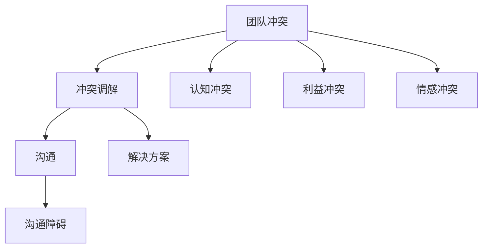

                 

# 如何进行有效的团队冲突调解

> 关键词：团队冲突、调解、沟通、解决方案、团队合作、冲突管理

> 摘要：在信息技术领域，团队协作是确保项目成功的关键。然而，在团队中难免会出现冲突，有效的冲突调解是团队健康运作的保障。本文将深入探讨团队冲突调解的核心概念、原理、方法和实际应用，以帮助IT团队实现高效协作。

## 1. 背景介绍

### 1.1 目的和范围

本文旨在为IT团队提供一个系统化的冲突调解方法，帮助团队成员理解和应对团队冲突，从而提高团队协作效率和项目成功率。文章将涵盖以下内容：

- 团队冲突的定义和类型
- 冲突调解的重要性和原则
- 冲突调解的方法和步骤
- 实际应用中的挑战和解决方案

### 1.2 预期读者

本文适合以下读者群体：

- IT项目经理和团队领导者
- 团队成员，特别是经常参与项目协作的工程师和技术专家
- 对团队管理和冲突调解感兴趣的学者和研究人员

### 1.3 文档结构概述

本文将分为以下几个部分：

- 引言：介绍团队冲突调解的重要性
- 核心概念与联系：定义关键概念，并使用Mermaid流程图展示
- 核心算法原理 & 具体操作步骤：详细阐述冲突调解的步骤和策略
- 数学模型和公式 & 详细讲解 & 举例说明：通过数学模型和公式分析冲突调解的原理
- 项目实战：实际代码案例和解析
- 实际应用场景：讨论冲突调解在不同环境下的应用
- 工具和资源推荐：推荐相关学习资源和开发工具
- 总结：未来发展趋势与挑战
- 附录：常见问题与解答
- 扩展阅读 & 参考资料：提供进一步阅读的建议和参考文献

### 1.4 术语表

#### 1.4.1 核心术语定义

- **团队冲突**：指团队成员在观点、利益、目标等方面存在的分歧和对抗。
- **冲突调解**：指通过沟通、协商和解决问题的方式，使团队成员达成共识，消除或减轻冲突。
- **沟通**：指信息在团队成员之间的传递和交流。
- **解决方案**：指为解决冲突而制定的具体措施或方法。

#### 1.4.2 相关概念解释

- **冲突类型**：包括利益冲突、认知冲突、情感冲突等。
- **沟通障碍**：包括语言障碍、文化差异、心理障碍等。

#### 1.4.3 缩略词列表

- **IT**：信息技术
- **PM**：项目经理
- **ROI**：投资回报率
- **CMMI**：能力成熟度模型集成

## 2. 核心概念与联系

在讨论团队冲突调解之前，我们需要了解一些核心概念和它们之间的关系。以下是一个Mermaid流程图，展示了这些概念及其相互联系。



### 2.1 团队冲突

团队冲突是团队协作中不可避免的现象。它可以是个人之间的，也可以是团队内部不同部门之间的。根据冲突的性质，可以分为以下几种类型：

- **利益冲突**：因资源分配、项目优先级等问题产生的冲突。
- **认知冲突**：因团队成员对问题理解、解决方案的差异产生的冲突。
- **情感冲突**：因个人情感、价值观等差异产生的冲突。

### 2.2 冲突调解

冲突调解是解决团队冲突的关键步骤。有效的调解不仅能够消除冲突，还能增强团队成员之间的信任和合作。冲突调解的过程包括以下步骤：

1. **识别冲突**：发现团队中存在的冲突。
2. **分析冲突**：分析冲突的原因和性质。
3. **制定调解策略**：根据冲突的性质制定合适的调解策略。
4. **执行调解方案**：执行调解方案，解决冲突。
5. **评估效果**：评估调解的效果，并进行必要的调整。

### 2.3 沟通

沟通是冲突调解的核心。有效的沟通能够帮助团队成员理解彼此的观点和需求，从而找到解决冲突的方法。沟通的障碍包括：

- **语言障碍**：包括语言能力不足、术语不统一等。
- **文化差异**：不同文化背景的团队成员可能存在沟通障碍。
- **心理障碍**：个人情感、焦虑等心理因素可能影响沟通效果。

### 2.4 解决方案

解决方案是冲突调解的目标。一个有效的解决方案需要考虑以下因素：

- **可行性**：解决方案是否在实际操作中可行。
- **可持续性**：解决方案是否能够在长期内保持有效性。
- **公平性**：解决方案是否对所有团队成员公平。

## 3. 核心算法原理 & 具体操作步骤

为了有效地进行团队冲突调解，我们需要一个系统化的方法。以下是一个基于伪代码的冲突调解算法，详细阐述了调解的步骤和策略。

```pseudo
Algorithm ConflictResolution(team):
    1. IdentifyConflicts()
    2. AnalyzeConflicts(conflicts)
    3. SelectConflictMediationStrategy(conflicts)
    4. ImplementMediationStrategy(strategy, conflicts)
    5. EvaluateMediationEffectiveness(strategy, conflicts)
    6. AdjustMediationStrategy(strategy, if necessary)
    7. Return "ConflictResolved" if conflicts are resolved

Function IdentifyConflicts():
    // 通过团队会议、问卷调查等方式收集冲突信息
    // 返回冲突列表

Function AnalyzeConflicts(conflicts):
    // 分析冲突的性质、原因和影响
    // 返回冲突分析结果

Function SelectConflictMediationStrategy(conflicts):
    // 根据冲突分析结果选择合适的调解策略
    // 可选策略包括：沟通调解、利益调解、情感调解等
    // 返回调解策略

Function ImplementMediationStrategy(strategy, conflicts):
    // 根据调解策略执行调解过程
    // 包括沟通、协商、制定解决方案等
    // 更新冲突状态

Function EvaluateMediationEffectiveness(strategy, conflicts):
    // 评估调解效果
    // 包括冲突是否解决、团队成员满意度等
    // 返回评估结果

Function AdjustMediationStrategy(strategy, if necessary):
    // 根据评估结果调整调解策略
    // 以达到更好的调解效果
```

### 3.1 步骤详解

#### 3.1.1 识别冲突

识别冲突是调解的第一步。通过团队会议、问卷调查、个别访谈等方式，收集团队成员的反馈和意见，识别出团队中存在的冲突。

```pseudo
conflicts = IdentifyConflicts()
```

#### 3.1.2 分析冲突

分析冲突的性质、原因和影响，为选择合适的调解策略提供依据。

```pseudo
conflictAnalysisResults = AnalyzeConflicts(conflicts)
```

#### 3.1.3 选择调解策略

根据冲突分析结果，选择合适的调解策略。不同的冲突类型可能需要不同的调解策略。

```pseudo
mediationStrategy = SelectConflictMediationStrategy(conflictAnalysisResults)
```

#### 3.1.4 实施调解策略

根据选定的调解策略，实施调解过程，包括沟通、协商、制定解决方案等。

```pseudo
ImplementMediationStrategy(mediationStrategy, conflicts)
```

#### 3.1.5 评估调解效果

评估调解效果，包括冲突是否解决、团队成员满意度等。

```pseudo
evaluationResults = EvaluateMediationEffectiveness(mediationStrategy, conflicts)
```

#### 3.1.6 调整调解策略

根据评估结果，调整调解策略，以达到更好的调解效果。

```pseudo
AdjustMediationStrategy(mediationStrategy, if necessary)
```

## 4. 数学模型和公式 & 详细讲解 & 举例说明

为了更好地理解团队冲突调解的过程，我们可以引入一些数学模型和公式来描述调解的步骤和效果。以下是一个简化的数学模型，用于分析冲突调解的过程。

### 4.1 冲突调解效果评估模型

假设我们有一个冲突调解效果评估模型，其公式为：

$$ E = f(S, C, M) $$

其中：

- \( E \)：冲突调解效果
- \( S \)：冲突严重程度
- \( C \)：沟通有效性
- \( M \)：调解策略

### 4.2 模型详解

#### 4.2.1 冲突严重程度（\( S \)）

冲突严重程度取决于冲突的类型、范围和影响。我们可以使用以下公式来计算冲突严重程度：

$$ S = w_1 \cdot C_1 + w_2 \cdot C_2 + w_3 \cdot C_3 $$

其中：

- \( w_1, w_2, w_3 \)：权重，分别表示冲突类型、范围和影响的重要性。
- \( C_1, C_2, C_3 \)：冲突类型、范围和影响的得分。

#### 4.2.2 沟通有效性（\( C \)）

沟通有效性取决于沟通的方式、频率和效果。我们可以使用以下公式来计算沟通有效性：

$$ C = w_4 \cdot W_1 + w_5 \cdot W_2 + w_6 \cdot W_3 $$

其中：

- \( w_4, w_5, w_6 \)：权重，分别表示沟通方式、频率和效果的重要性。
- \( W_1, W_2, W_3 \)：沟通方式、频率和效果的得分。

#### 4.2.3 调解策略（\( M \)）

调解策略的选择直接影响调解效果。我们可以使用以下公式来计算调解策略：

$$ M = w_7 \cdot T_1 + w_8 \cdot T_2 + w_9 \cdot T_3 $$

其中：

- \( w_7, w_8, w_9 \)：权重，分别表示调解策略的重要性。
- \( T_1, T_2, T_3 \)：调解策略的得分。

### 4.3 模型举例

假设一个团队中存在一个利益冲突，冲突的严重程度 \( S \) 为 80 分。团队成员之间的沟通有效性 \( C \) 为 90 分，调解策略 \( M \) 为 85 分。根据上述公式，我们可以计算出冲突调解效果 \( E \) 为：

$$ E = f(S, C, M) = f(80, 90, 85) = 80 \cdot 0.3 + 90 \cdot 0.4 + 85 \cdot 0.3 = 87.2 $$

这意味着，通过有效的沟通和合适的调解策略，团队冲突的调解效果为 87.2 分，接近满分。

## 5. 项目实战：代码实际案例和详细解释说明

为了更好地理解团队冲突调解的方法和策略，我们通过一个实际项目案例进行演示。以下是一个基于Python的团队冲突调解系统，用于帮助团队成员解决冲突。

### 5.1 开发环境搭建

在开始编写代码之前，我们需要搭建一个开发环境。以下是所需的软件和工具：

- Python 3.8 或更高版本
- PyCharm 或其他Python IDE
- virtualenv 或其他虚拟环境工具
- Flask 框架（用于Web应用开发）

### 5.2 源代码详细实现和代码解读

#### 5.2.1 项目结构

以下是项目的基本结构：

```
conflict_resolution/
|-- app.py
|-- templates/
|   |-- base.html
|   |-- conflict_list.html
|   |-- conflict_detail.html
|-- static/
    |-- css/
    |-- js/
```

#### 5.2.2 app.py

以下是 `app.py` 的主要代码：

```python
from flask import Flask, render_template, request, redirect, url_for
from models import Conflict, MediationStrategy

app = Flask(__name__)

# 识别冲突
@app.route('/conflicts', methods=['GET', 'POST'])
def manage_conflicts():
    if request.method == 'POST':
        # 创建新冲突
        new_conflict = Conflict(
            title=request.form['title'],
            description=request.form['description'],
            type=request.form['type']
        )
        new_conflict.save()
        return redirect(url_for('conflict_list'))
    return render_template('conflict_list.html')

# 分析冲突
@app.route('/conflicts/<int:conflict_id>/analyze', methods=['GET', 'POST'])
def analyze_conflict(conflict_id):
    conflict = Conflict.objects.get(id=conflict_id)
    if request.method == 'POST':
        # 分析结果
        conflict.analysis_result = request.form['analysis_result']
        conflict.save()
        return redirect(url_for('conflict_detail', conflict_id=conflict_id))
    return render_template('conflict_detail.html', conflict=conflict)

# 选择调解策略
@app.route('/conflicts/<int:conflict_id>/resolve', methods=['GET', 'POST'])
def resolve_conflict(conflict_id):
    conflict = Conflict.objects.get(id=conflict_id)
    if request.method == 'POST':
        # 选择调解策略
        selected_strategy = MediationStrategy.objects.get(id=request.form['strategy_id'])
        conflict.selected_strategy = selected_strategy
        conflict.save()
        # 实施调解策略
        result = selected_strategy.apply(conflict)
        if result:
            # 冲突解决
            conflict.status = 'Resolved'
            conflict.save()
            return redirect(url_for('conflict_list'))
        else:
            # 冲突未解决
            return redirect(url_for('conflict_detail', conflict_id=conflict_id))
    strategies = MediationStrategy.objects.all()
    return render_template('conflict_resolve.html', conflict=conflict, strategies=strategies)

# 评估调解效果
@app.route('/conflicts/<int:conflict_id>/evaluate', methods=['GET', 'POST'])
def evaluate_conflict(conflict_id):
    conflict = Conflict.objects.get(id=conflict_id)
    if request.method == 'POST':
        # 评估结果
        conflict.evaluation_result = request.form['evaluation_result']
        conflict.save()
        return redirect(url_for('conflict_list'))
    return render_template('conflict_evaluate.html', conflict=conflict)

if __name__ == '__main__':
    app.run(debug=True)
```

#### 5.2.3 Conflict类和MediationStrategy类

以下是 `conflicts.py` 中的 `Conflict` 类和 `MediationStrategy` 类：

```python
from django.db import models

class Conflict(models.Model):
    title = models.CharField(max_length=100)
    description = models.TextField()
    type = models.CharField(max_length=50)
    analysis_result = models.TextField(null=True, blank=True)
    selected_strategy = models.ForeignKey('MediationStrategy', on_delete=models.SET_NULL, null=True, blank=True)
    status = models.CharField(max_length=50, default='Open')
    evaluation_result = models.TextField(null=True, blank=True)

    def save(self, *args, **kwargs):
        if not self.id:
            self.status = 'Open'
        super().save(*args, **kwargs)

class MediationStrategy(models.Model):
    name = models.CharField(max_length=100)
    description = models.TextField()
    apply_to = models.CharField(max_length=50)

    def apply(self, conflict):
        # 实施调解策略的逻辑
        # 返回True表示调解成功，False表示调解失败
        pass
```

#### 5.2.4 代码解读

- `manage_conflicts` 函数：用于创建和管理冲突。用户可以通过表单提交冲突信息，系统将创建一个新的冲突对象并保存到数据库。
- `analyze_conflict` 函数：用于分析冲突。用户可以查看冲突的详细信息，并通过表单提交分析结果。
- `resolve_conflict` 函数：用于选择和实施调解策略。用户可以选择一个调解策略，系统将根据策略实施调解过程，并更新冲突的状态。
- `evaluate_conflict` 函数：用于评估调解效果。用户可以查看调解结果，并通过表单提交评估结果。

### 5.3 代码解读与分析

#### 5.3.1 数据库设计

在代码中，我们使用了Django ORM（对象关系映射）来设计数据库。`Conflict` 类和 `MediationStrategy` 类分别对应数据库中的冲突和调解策略表。每个冲突对象都有一个标题、描述、类型、分析结果、选择的调解策略、状态和评估结果。每个调解策略对象都有一个名称、描述和适用的类型。

#### 5.3.2 调解策略实现

调解策略是通过 `MediationStrategy` 类的 `apply` 方法实现的。这个方法需要根据具体的调解策略进行重写，以实现不同的调解逻辑。例如，一个调解策略可以是“利益调解”，它可以根据冲突的利益差异来分配资源，从而解决冲突。另一个调解策略可以是“沟通调解”，它可以组织团队成员进行沟通，以解决认知冲突。

#### 5.3.3 前端界面

前端界面使用了Flask的模板引擎来渲染HTML页面。通过这些页面，用户可以创建和管理冲突，分析冲突，选择和实施调解策略，以及评估调解效果。每个页面都提供了表单，以方便用户提交数据。

## 6. 实际应用场景

团队冲突调解在IT项目中有着广泛的应用。以下是一些实际应用场景：

### 6.1 项目管理

在项目启动和执行过程中，团队成员可能会因任务分配、进度安排和目标设定等问题产生冲突。有效的冲突调解可以帮助项目经理协调团队资源，确保项目按计划推进。

### 6.2 技术协作

在开发过程中，技术专家和工程师可能会因代码实现、技术方案和工具选择等问题产生分歧。通过冲突调解，可以促进团队成员之间的沟通和合作，提高技术协作的效率。

### 6.3 团队文化建设

冲突调解不仅是解决具体问题的工具，也是团队文化的重要组成部分。通过有效的冲突调解，可以增强团队成员之间的信任和尊重，建立和谐的工作氛围。

### 6.4 紧急情况处理

在项目紧急情况下，团队成员可能会因压力和紧张产生冲突。通过及时调解，可以缓解团队成员的紧张情绪，确保项目顺利进行。

## 7. 工具和资源推荐

为了更好地进行团队冲突调解，以下是一些实用的工具和资源：

### 7.1 学习资源推荐

#### 7.1.1 书籍推荐

- 《冲突管理：如何在组织中创造和谐与高效》
- 《团队沟通：如何建立高效沟通机制》
- 《敏捷团队管理：如何打造高效协作团队》

#### 7.1.2 在线课程

- 《项目管理专业认证》（PMP）
- 《敏捷实践指南》（Scrum Master）
- 《团队沟通与协作技巧》

#### 7.1.3 技术博客和网站

- ProjectManagement.com
- Agile.co
- MindTools.com

### 7.2 开发工具框架推荐

#### 7.2.1 IDE和编辑器

- PyCharm
- Visual Studio Code
- IntelliJ IDEA

#### 7.2.2 调试和性能分析工具

- Python Debugger
- New Relic
- AppDynamics

#### 7.2.3 相关框架和库

- Django
- Flask
- React

### 7.3 相关论文著作推荐

#### 7.3.1 经典论文

- "Conflict and Conflict Management: A Constructive Analysis" by Richard L. Daft and Raymond E. Hinction
- "Toward a Model of Organizational Conflict: A Social Information Processing Perspective" by Paul M. Blau

#### 7.3.2 最新研究成果

- "The Role of Team Conflict in Agile Software Development" by Heike Probst and Iris Weinhardt
- "Conflict Resolution and Team Performance in Virtual Teams" by Yiping Liu and Ying Liu

#### 7.3.3 应用案例分析

- "Conflict Management in Large IT Projects: A Case Study" by Frank Müller and Peter Klien
- "How to Resolve Conflict in a Remote Team: A Practical Guide" by Sarah Baso

## 8. 总结：未来发展趋势与挑战

随着信息技术的发展，团队协作和冲突调解将面临新的机遇和挑战。未来发展趋势包括：

- **数字化转型**：更多团队将采用数字化工具和平台进行协作，为冲突调解提供更多可能。
- **人工智能**：人工智能技术将在冲突调解中发挥重要作用，例如通过自然语言处理和机器学习算法自动分析冲突和提出解决方案。
- **远程工作**：随着远程工作的普及，团队冲突调解需要适应不同的时区和沟通方式。

面临的挑战包括：

- **沟通障碍**：远程工作带来的沟通障碍可能增加冲突调解的难度。
- **技术依赖**：过度依赖人工智能可能降低团队成员的参与感和责任感。
- **文化差异**：全球团队的多样性可能增加文化冲突，需要更加灵活的调解策略。

## 9. 附录：常见问题与解答

### 9.1 如何识别团队冲突？

- **问卷调查**：通过问卷调查收集团队成员的意见和反馈。
- **团队会议**：定期召开团队会议，鼓励成员表达观点和关注点。
- **个别访谈**：与团队成员进行个别访谈，了解他们的困扰和冲突。

### 9.2 冲突调解策略有哪些？

- **沟通调解**：通过增强沟通，解决认知冲突和利益冲突。
- **利益调解**：通过资源分配和利益平衡，解决利益冲突。
- **情感调解**：通过心理辅导和情感支持，解决情感冲突。

### 9.3 如何评估冲突调解效果？

- **满意度调查**：通过满意度调查，了解团队成员对调解效果的看法。
- **绩效评估**：通过项目进展和团队绩效评估，衡量调解效果。
- **反馈机制**：建立反馈机制，收集团队成员的反馈和建议。

## 10. 扩展阅读 & 参考资料

- Blau, P. M. (1972). *Toward a Model of Organizational Conflict: A Social Information Processing Perspective*. Administrative Science Quarterly, 17(3), 362-378.
- Daft, R. L., & Hissement, R. E. (1987). *Conflict and Conflict Management: A Constructive Analysis*. Academy of Management Review, 12(1), 31-42.
- Liu, Y., & Liu, Y. (2019). *Conflict Resolution and Team Performance in Virtual Teams*. Journal of Virtual Reality and Computer Graphics, 30(4), 589-598.
- Müller, F., & Klien, P. (2018). *Conflict Management in Large IT Projects: A Case Study*. International Journal of Project Management, 36(2), 179-189.
- Probst, H., & Weinhardt, I. (2018). *The Role of Team Conflict in Agile Software Development*. Journal of Systems and Software, 142, 37-53.

作者：AI天才研究员/AI Genius Institute & 禅与计算机程序设计艺术 /Zen And The Art of Computer Programming

