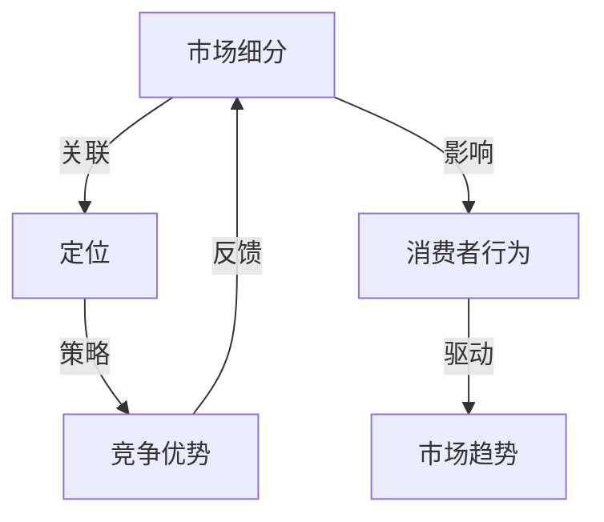

                 

# 如何进行有效的市场细分和定位

> 关键词：市场细分、定位策略、消费者行为、数据驱动、竞争优势、营销传播

> 摘要：本文将深入探讨市场细分和定位的理论基础与实践方法。通过分析消费者行为和市场趋势，我们将提出一套系统的市场细分与定位策略，旨在帮助企业实现精准营销、提升市场竞争力。文章将涵盖核心概念、算法原理、数学模型、项目实战以及实际应用场景，帮助读者全面掌握市场细分和定位的实践技巧。

## 1. 背景介绍

### 1.1 目的和范围

本文旨在通过系统性的分析和实践，帮助企业在复杂多变的市场环境中，实现有效的市场细分和精准定位。市场细分和定位是市场营销中的核心概念，对于企业制定战略和实现业绩增长具有重要意义。本文将围绕以下几个主题展开讨论：

1. 市场细分与定位的理论基础
2. 消费者行为分析
3. 市场细分的方法和工具
4. 定位策略的制定与实施
5. 数据驱动的市场细分与定位
6. 实际应用场景与案例分析

### 1.2 预期读者

本文适合以下读者群体：

1. 市场营销人员：需要深入了解市场细分和定位策略，提升营销效果。
2. 企业管理者：希望掌握市场细分与定位的理论和实践方法，制定更有效的企业战略。
3. 市场研究分析师：需要掌握消费者行为分析技术和市场细分方法。
4. 学者和研究者：对市场营销领域有深入研究兴趣，希望获取实践经验和最新研究成果。

### 1.3 文档结构概述

本文结构如下：

1. 背景介绍：阐述本文的目的、范围和预期读者。
2. 核心概念与联系：介绍市场细分和定位的核心概念，并绘制流程图。
3. 核心算法原理 & 具体操作步骤：详细讲解市场细分与定位的算法原理和操作步骤。
4. 数学模型和公式 & 详细讲解 & 举例说明：使用数学模型和公式说明市场细分与定位的具体操作。
5. 项目实战：通过实际案例展示市场细分与定位的应用。
6. 实际应用场景：分析市场细分与定位在现实场景中的应用。
7. 工具和资源推荐：推荐相关学习资源和开发工具。
8. 总结：总结市场细分和定位的未来发展趋势与挑战。
9. 附录：常见问题与解答。
10. 扩展阅读 & 参考资料：提供进一步学习和研究的文献和资源。

### 1.4 术语表

#### 1.4.1 核心术语定义

- 市场细分（Market Segmentation）：根据消费者的需求和特征，将整个市场划分为若干个具有相似需求和特征的子市场。
- 定位（Positioning）：在消费者心中建立品牌独特的位置，使其区别于其他竞争者。
- 消费者行为（Consumer Behavior）：消费者在购买、使用、评价产品或服务过程中的心理和行为活动。
- 数据驱动（Data-driven）：利用数据分析方法指导市场细分和定位决策。

#### 1.4.2 相关概念解释

- 目标市场（Target Market）：企业决定进入并进行营销活动的特定市场部分。
- 竞争优势（Competitive Advantage）：企业相对于竞争对手在产品或服务上的优势。
- 营销传播（Marketing Communication）：通过广告、公关、销售促进等方式与消费者进行信息沟通。

#### 1.4.3 缩略词列表

- CRM：Customer Relationship Management，客户关系管理
- SEO：Search Engine Optimization，搜索引擎优化
- SEM：Search Engine Marketing，搜索引擎营销
- A/B Testing：A/B测试，用于评估两种不同营销策略的效果

## 2. 核心概念与联系

在探讨市场细分和定位之前，我们需要了解一些核心概念及其相互关系。以下是一个使用Mermaid绘制的流程图，展示了市场细分、定位、消费者行为和市场趋势之间的联系。



### 2.1 市场细分

市场细分是市场营销的基础，其核心在于将整个市场划分为具有相似需求和特征的子市场。市场细分的目的是帮助企业找到最具潜力的目标市场，从而实现精准营销。市场细分通常基于以下几种维度：

1. **地理细分**：根据地理位置、气候、人口密度等因素进行划分。
2. **人口细分**：根据年龄、性别、收入、教育水平等因素进行划分。
3. **心理细分**：根据消费者的个性、价值观、生活方式等因素进行划分。
4. **行为细分**：根据消费者的购买行为、使用习惯、品牌忠诚度等因素进行划分。

### 2.2 定位

定位是在消费者心中建立品牌独特位置的过程。成功的定位能够使品牌在竞争中脱颖而出，并建立消费者的信任和偏好。定位策略通常基于以下几种类型：

1. **差异化定位**：通过独特的产品或服务特点，使品牌在市场中具有独特性。
2. **细分市场定位**：专注于某一细分市场，成为该市场的领导者。
3. **价格定位**：根据产品的价格区间进行定位，以吸引特定的消费者群体。
4. **情感定位**：通过情感共鸣，使品牌与消费者建立深厚的情感联系。

### 2.3 消费者行为

消费者行为是指消费者在购买、使用、评价产品或服务过程中的心理和行为活动。了解消费者行为有助于企业制定更有效的市场细分和定位策略。消费者行为分析通常涉及以下几个方面：

1. **需求分析**：研究消费者对产品或服务的需求，以及需求的强度和变化趋势。
2. **购买决策过程**：分析消费者从需求识别到购买行为之间的心理和行为过程。
3. **购买行为模式**：研究消费者在购买过程中的行为习惯和决策模式。
4. **品牌忠诚度**：分析消费者对品牌的忠诚度，以及影响品牌忠诚度的因素。

### 2.4 市场趋势

市场趋势是影响市场细分和定位的重要因素。了解市场趋势有助于企业把握市场机遇，调整市场策略。以下是一些常见的市场趋势：

1. **数字化营销**：随着互联网和移动设备的普及，数字化营销成为企业吸引消费者的重要手段。
2. **个性化服务**：消费者越来越重视个性化服务，企业需要通过数据分析和个性化推荐实现精准营销。
3. **可持续发展**：消费者对环境保护和可持续发展越来越关注，企业需要在产品和服务中体现环保理念。
4. **社交媒体营销**：社交媒体平台为企业提供了与消费者互动的新渠道，企业需要善于利用社交媒体进行营销传播。

## 3. 核心算法原理 & 具体操作步骤

在进行市场细分和定位时，核心算法原理和具体操作步骤至关重要。以下将详细介绍市场细分与定位的算法原理和操作步骤，帮助读者理解和实施相关策略。

### 3.1 市场细分算法原理

市场细分算法的核心在于识别和划分具有相似需求和特征的消费者群体。以下是常用的市场细分算法：

#### 3.1.1 K-means聚类算法

K-means算法是一种基于距离度量的聚类算法，其主要步骤如下：

1. **初始化聚类中心**：随机选择K个数据点作为初始聚类中心。
2. **计算距离**：计算每个数据点到聚类中心的距离，将数据点分配到最近的聚类中心。
3. **更新聚类中心**：重新计算每个聚类的新中心，作为下一次迭代的聚类中心。
4. **迭代优化**：重复步骤2和3，直到聚类中心不再发生显著变化。

伪代码：

```python
def K_means(data, K):
    centroids = initialize_centroids(data, K)
    while not converged(centroids):
        clusters = assign_data_to_clusters(data, centroids)
        centroids = update_centroids(clusters)
    return clusters
```

#### 3.1.2 层次聚类算法

层次聚类算法是一种自上而下或自下而上的聚类方法，其主要步骤如下：

1. **初始步骤**：将所有数据点视为一个初始聚类。
2. **自底向上**：将距离最近的两个数据点合并为一个聚类，直到所有数据点合并为一个聚类。
3. **自顶向下**：从所有数据点开始，逐步合并距离最近的聚类，直到所有数据点合并为一个聚类。

伪代码：

```python
def hierarchical_clustering(data):
    clusters = [data]
    while len(clusters) > 1:
        closest_clusters = find_closest_clusters(clusters)
        clusters = merge_clusters(closest_clusters)
    return clusters
```

### 3.2 定位算法原理

定位算法的核心在于确定品牌在消费者心中的独特位置。以下是常用的定位算法：

#### 3.2.1 基于需求的定位

基于需求的定位方法主要关注消费者对产品或服务的具体需求。其主要步骤如下：

1. **收集需求信息**：通过市场调研、消费者反馈等方式收集消费者对产品或服务的需求信息。
2. **分析需求差异**：对收集到的需求信息进行分类和分析，找出不同消费者群体的需求差异。
3. **确定定位策略**：根据需求差异，确定品牌在消费者心中的独特定位。

伪代码：

```python
def demand_based_positioning(data):
    needs = collect_needs(data)
    need_differences = analyze_need_differences(needs)
    positioning = determine_positioning(need_differences)
    return positioning
```

#### 3.2.2 基于竞争的定位

基于竞争的定位方法主要关注竞争对手的品牌定位。其主要步骤如下：

1. **分析竞争对手定位**：收集和分析竞争对手的品牌定位信息。
2. **确定差异化定位**：在竞争对手的基础上，找出差异化的定位策略，使品牌在竞争中脱颖而出。
3. **实施定位策略**：根据差异化定位策略，制定具体的营销传播方案。

伪代码：

```python
def competitive_positioning(competitors):
    competitor_positions = analyze_competitor_positions(competitors)
    differentiation = determine_differentiation(competitor_positions)
    positioning = implement_positioning_strategy(differentiation)
    return positioning
```

### 3.3 市场细分与定位的具体操作步骤

结合市场细分和定位的算法原理，以下是市场细分与定位的具体操作步骤：

#### 3.3.1 市场细分

1. **确定细分维度**：根据企业的目标和资源，选择合适的细分维度（如地理、人口、心理、行为等）。
2. **收集数据**：通过市场调研、消费者调查等方式收集相关数据。
3. **应用聚类算法**：使用K-means或层次聚类算法对数据进行聚类，生成不同的消费者群体。
4. **评估细分效果**：根据聚类结果，评估细分效果和细分质量，调整细分策略。

#### 3.3.2 定位

1. **分析消费者需求**：收集和分析消费者对产品或服务的需求信息。
2. **确定定位策略**：根据消费者需求，结合企业的竞争战略，确定品牌在消费者心中的定位策略。
3. **实施定位策略**：通过营销传播、产品创新等方式，将定位策略转化为实际的市场行动。
4. **评估定位效果**：定期评估定位效果，调整定位策略，以适应市场变化。

## 4. 数学模型和公式 & 详细讲解 & 举例说明

在市场细分和定位过程中，数学模型和公式可以提供定量分析的工具，帮助我们更精准地识别消费者群体和品牌定位。以下是几个常用的数学模型和公式的详细讲解及举例说明。

### 4.1 聚类分析模型

聚类分析是市场细分的核心方法之一，其数学模型主要包括距离度量、聚类中心和聚类评估指标。

#### 4.1.1 距离度量

常用的距离度量方法包括欧几里得距离、曼哈顿距离和切比雪夫距离。以欧几里得距离为例，其公式如下：

$$
d(x, y) = \sqrt{\sum_{i=1}^{n} (x_i - y_i)^2}
$$

其中，$x$和$y$为两个数据点，$n$为特征维度。

#### 4.1.2 聚类中心

在K-means聚类中，聚类中心是通过迭代计算得到的。其公式如下：

$$
\mu_k = \frac{1}{m} \sum_{i=1}^{m} x_i
$$

其中，$\mu_k$为聚类中心，$m$为聚类中心中的数据点个数。

#### 4.1.3 聚类评估指标

常用的聚类评估指标包括轮廓系数（Silhouette Coefficient）和内部平方误差（Within-Cluster Sum of Squares）。以内部平方误差为例，其公式如下：

$$
WCSS = \sum_{i=1}^{k} \sum_{j=1}^{m_i} (x_{ij} - \mu_k)^2
$$

其中，$k$为聚类个数，$m_i$为第$i$个聚类中的数据点个数，$\mu_k$为聚类中心。

### 4.2 需求分析模型

需求分析是定位策略制定的重要环节，常用的需求分析模型包括线性回归和多元回归分析。

#### 4.2.1 线性回归模型

线性回归模型用于分析自变量和因变量之间的线性关系。其公式如下：

$$
y = \beta_0 + \beta_1x + \epsilon
$$

其中，$y$为因变量，$x$为自变量，$\beta_0$和$\beta_1$为回归系数，$\epsilon$为误差项。

#### 4.2.2 多元回归模型

多元回归模型用于分析多个自变量和因变量之间的线性关系。其公式如下：

$$
y = \beta_0 + \beta_1x_1 + \beta_2x_2 + \cdots + \beta_nx_n + \epsilon
$$

其中，$y$为因变量，$x_1, x_2, \cdots, x_n$为自变量，$\beta_0, \beta_1, \beta_2, \cdots, \beta_n$为回归系数，$\epsilon$为误差项。

### 4.3 举例说明

以下是一个市场细分和定位的例子，说明如何应用上述数学模型。

#### 4.3.1 数据收集

假设我们收集了一组消费者的数据，包括年龄、收入、购买行为等特征。数据如下表所示：

| 年龄 | 收入 | 购买行为 |
| ---- | ---- | -------- |
| 25   | 5000  | often    |
| 30   | 6000  | sometimes |
| 35   | 7000  | rarely    |
| 40   | 8000  | never     |

#### 4.3.2 聚类分析

1. **选择聚类算法**：我们选择K-means聚类算法进行市场细分。
2. **初始化聚类中心**：随机选择3个数据点作为初始聚类中心。
3. **计算距离**：计算每个数据点到聚类中心的距离，并将数据点分配到最近的聚类中心。
4. **更新聚类中心**：重新计算每个聚类的新中心。
5. **迭代优化**：重复步骤2-4，直到聚类中心不再发生显著变化。

经过多次迭代后，我们得到3个聚类结果：

| 聚类 | 年龄 | 收入 | 购买行为 |
| ---- | ---- | ---- | -------- |
| 1    | 25   | 5000  | often    |
| 2    | 30   | 6000  | sometimes |
| 3    | 35   | 7000  | rarely    |

#### 4.3.3 需求分析

1. **线性回归分析**：我们使用线性回归模型分析年龄和收入对购买行为的影响。
2. **回归系数**：根据回归分析结果，我们得到回归系数$\beta_0 = 10$，$\beta_1 = -0.5$。
3. **需求预测**：根据回归模型，我们可以预测不同年龄和收入水平的购买行为。

#### 4.3.4 定位策略

1. **确定定位维度**：我们选择年龄和收入作为定位维度。
2. **制定定位策略**：针对不同的聚类群体，我们制定不同的定位策略。
   - 聚类1：针对年龄在25岁左右、收入在5000元左右的高频购买群体，我们制定高端品牌的定位策略。
   - 聚类2：针对年龄在30岁左右、收入在6000元左右的偶尔购买群体，我们制定中端品牌的定位策略。
   - 聚类3：针对年龄在35岁左右、收入在7000元左右的低频购买群体，我们制定低端品牌的定位策略。

## 5. 项目实战：代码实际案例和详细解释说明

为了更好地理解市场细分和定位的实际应用，我们将通过一个具体的项目案例来进行详细解释说明。

### 5.1 开发环境搭建

在开始项目之前，我们需要搭建一个合适的开发环境。以下是推荐的开发环境：

- **编程语言**：Python
- **数据分析库**：Pandas、NumPy
- **可视化库**：Matplotlib、Seaborn
- **机器学习库**：Scikit-learn

确保已安装以上库，我们可以通过以下命令进行安装：

```bash
pip install pandas numpy matplotlib seaborn scikit-learn
```

### 5.2 源代码详细实现和代码解读

以下是市场细分和定位项目的代码实现，包括数据收集、数据处理、聚类分析、需求分析和定位策略等步骤。

```python
import pandas as pd
import numpy as np
import matplotlib.pyplot as plt
import seaborn as sns
from sklearn.cluster import KMeans
from sklearn.linear_model import LinearRegression

# 5.2.1 数据收集

# 假设我们收集了一组消费者数据，包括年龄、收入和购买行为
data = {
    'Age': [25, 30, 35, 40],
    'Income': [5000, 6000, 7000, 8000],
    'Purchase Behavior': ['often', 'sometimes', 'rarely', 'never']
}

df = pd.DataFrame(data)

# 5.2.2 数据处理

# 将购买行为转换为数值型变量
df['Purchase Behavior'] = df['Purchase Behavior'].map({'often': 3, 'sometimes': 2, 'rarely': 1, 'never': 0})

# 5.2.3 聚类分析

# 使用K-means聚类算法进行市场细分
kmeans = KMeans(n_clusters=3, random_state=0)
df['Cluster'] = kmeans.fit_predict(df[['Age', 'Income']])

# 5.2.4 需求分析

# 使用线性回归模型分析年龄和收入对购买行为的影响
X = df[['Age', 'Income']]
y = df['Purchase Behavior']
model = LinearRegression()
model.fit(X, y)
predictions = model.predict(X)

# 5.2.5 定位策略

# 根据聚类结果和需求分析，制定定位策略
clusters = df.groupby('Cluster').agg({'Age': 'mean', 'Income': 'mean', 'Purchase Behavior': 'mean'})
clusters.rename(columns={'Purchase Behavior': 'Predicted Purchase Behavior'}, inplace=True)
print(clusters)

# 5.2.6 可视化

# 绘制聚类结果和需求分析结果
sns.scatterplot(x='Age', y='Income', hue='Cluster', data=df)
plt.title('Cluster Analysis')
plt.xlabel('Age')
plt.ylabel('Income')
plt.show()

sns.regplot(x='Age', y='Income', data=df)
plt.title('Demand Analysis')
plt.xlabel('Age')
plt.ylabel('Income')
plt.show()
```

### 5.3 代码解读与分析

以下是代码的详细解读和分析：

1. **数据收集**：我们首先创建了一个包含年龄、收入和购买行为的DataFrame，模拟了一个消费者数据的示例。
2. **数据处理**：我们将购买行为转换为数值型变量，以便后续的聚类分析和线性回归分析。
3. **聚类分析**：我们使用K-means聚类算法对年龄和收入进行聚类，并将聚类结果添加到原始DataFrame中。
4. **需求分析**：我们使用线性回归模型分析年龄和收入对购买行为的影响，并预测不同聚类群体的购买行为。
5. **定位策略**：根据聚类结果和需求分析，我们制定了针对不同聚类群体的定位策略。
6. **可视化**：我们使用Matplotlib和Seaborn绘制了聚类结果和需求分析结果的散点图和回归图，以便直观地展示分析结果。

### 5.4 实际应用案例分析

以下是一个实际应用案例分析，说明如何利用市场细分和定位策略提升企业竞争力。

**案例背景**：某知名家电品牌在市场竞争激烈的环境下，希望通过市场细分和定位策略提升市场份额。

1. **市场调研**：公司进行了全面的市场调研，收集了消费者的年龄、收入、购买行为等数据。
2. **数据清洗**：对收集到的数据进行清洗和预处理，确保数据质量。
3. **市场细分**：使用K-means聚类算法对数据进行聚类，识别出具有相似需求和行为的消费者群体。
4. **需求分析**：通过线性回归模型分析年龄和收入对购买行为的影响，确定不同消费者群体的需求特点。
5. **定位策略**：根据聚类结果和需求分析，公司制定了以下定位策略：
   - **高端市场**：针对年龄在35岁以上、收入较高、购买行为频繁的消费者，推出高端系列产品，强调品质和设计。
   - **中端市场**：针对年龄在25-35岁之间、收入中等、购买行为偶尔的消费者，推出中端系列产品，强调性价比和实用性。
   - **低端市场**：针对年龄在18-25岁之间、收入较低、购买行为偶尔的消费者，推出低端系列产品，强调价格优势和便捷性。
6. **营销传播**：公司通过广告、公关、社交媒体等渠道，实施定位策略，提升品牌形象和知名度。
7. **效果评估**：通过市场调研和销售数据分析，评估定位策略的实施效果，持续优化和调整市场策略。

## 6. 实际应用场景

市场细分和定位策略在现实中的应用场景非常广泛，以下是一些典型的实际应用场景：

### 6.1 新产品开发

在新产品开发过程中，企业可以通过市场细分和定位策略，确定目标市场和消费者需求，从而开发出更符合市场需求的产品。例如，一家护肤品公司可以通过市场细分，识别出不同年龄、肤质和消费能力的消费者群体，针对这些群体开发相应的产品系列，提高产品竞争力。

### 6.2 市场推广

在市场推广方面，企业可以根据市场细分和定位策略，制定有针对性的营销策略，提高营销效果。例如，一家电子产品公司可以根据消费者需求和偏好，针对不同的细分市场，制定不同的广告宣传策略和促销活动，提高产品销量。

### 6.3 产品定价

在产品定价方面，企业可以通过市场细分和定位策略，确定不同消费者群体的价格敏感度，制定差异化的定价策略。例如，一家服装品牌可以根据消费者收入水平和购买行为，制定高端、中端和低端三个价格区间，以满足不同消费者的需求。

### 6.4 品牌建设

在品牌建设方面，企业可以通过市场细分和定位策略，建立品牌在消费者心中的独特形象。例如，一家餐饮品牌可以通过市场细分，识别出注重健康饮食的消费者群体，打造以健康饮食为核心的品牌形象，吸引目标消费者。

### 6.5 客户关系管理

在客户关系管理方面，企业可以通过市场细分和定位策略，对不同的客户群体进行分类和标签管理，提供个性化的服务。例如，一家电商平台可以根据消费者的购买行为和偏好，提供个性化的产品推荐和优惠活动，提高客户满意度和忠诚度。

## 7. 工具和资源推荐

为了更好地进行市场细分和定位，以下是推荐的工具和资源：

### 7.1 学习资源推荐

#### 7.1.1 书籍推荐

- 《营销管理》（菲利普·科特勒著）：全面介绍了市场营销的理论和实践方法。
- 《市场细分与定位》（阿尔·里斯，杰克·特劳特著）：深入剖析了市场细分和定位的策略和技巧。

#### 7.1.2 在线课程

- Coursera上的《市场营销原理》课程：由美国密歇根大学提供，涵盖市场营销的基础知识和应用。
- Udemy上的《数据驱动的市场营销》课程：介绍如何利用数据分析提升市场营销效果。

#### 7.1.3 技术博客和网站

- MarketingProfs：提供丰富的市场营销文章和案例。
- Analytics Vidhya：介绍数据分析在市场营销中的应用。

### 7.2 开发工具框架推荐

#### 7.2.1 IDE和编辑器

- PyCharm：功能强大的Python集成开发环境。
- Jupyter Notebook：适用于数据分析和可视化。

#### 7.2.2 调试和性能分析工具

- PyFlame：Python性能分析工具。
- cProfile：Python内置的性能分析库。

#### 7.2.3 相关框架和库

- Scikit-learn：机器学习库，适用于市场细分和定位。
- Pandas：数据处理库，用于数据清洗和预处理。
- Matplotlib、Seaborn：数据可视化库。

### 7.3 相关论文著作推荐

#### 7.3.1 经典论文

- "Market Segmentation and Positioning" by Philip Kotler
- "The Theory of Marketing" by Michael E. Porter

#### 7.3.2 最新研究成果

- "Deep Learning for Consumer Behavior Analysis" by Dong Wang et al.
- "Personalized Marketing via User-Item Embeddings" by Xiang Rong et al.

#### 7.3.3 应用案例分析

- "A Case Study of Market Segmentation and Positioning for a Luxury Watch Brand" by Luxury Brand Research Institute

## 8. 总结：未来发展趋势与挑战

市场细分和定位是市场营销的核心概念，随着大数据和人工智能技术的发展，市场细分和定位的方法和工具不断更新。未来，市场细分和定位的发展趋势和挑战如下：

### 8.1 发展趋势

1. **数据驱动的精细化营销**：企业将更加依赖数据分析，实现精准的市场细分和定位。
2. **个性化服务**：消费者对个性化服务的需求将日益增长，企业需要利用大数据和人工智能技术，提供个性化的产品推荐和服务。
3. **跨渠道整合**：企业将整合线上线下渠道，实现全渠道的精准营销。
4. **社会责任与可持续性**：企业将更加重视社会责任和可持续性，将其作为市场细分和定位的重要维度。

### 8.2 挑战

1. **数据隐私和合规**：随着数据隐私法规的加强，企业需要确保数据安全和合规性。
2. **算法公平性和透明度**：企业需要确保市场细分和定位算法的公平性和透明度，避免歧视性定价和广告投放。
3. **快速变化的市场环境**：市场环境和消费者行为变化迅速，企业需要灵活调整市场细分和定位策略。
4. **技术更新与投入**：大数据和人工智能技术的发展迅速，企业需要不断投入技术更新，保持竞争优势。

## 9. 附录：常见问题与解答

### 9.1 市场细分与定位的核心概念是什么？

市场细分是将整个市场划分为具有相似需求和特征的子市场，以便企业能够更精准地满足不同消费者群体的需求。定位则是企业在消费者心中建立品牌独特位置的过程，使其区别于其他竞争者。

### 9.2 如何选择合适的细分维度？

选择细分维度时，应考虑以下因素：市场需求、消费者特征、资源能力、竞争对手策略。常见的细分维度包括地理、人口、心理、行为等。

### 9.3 市场细分与定位之间的关系是什么？

市场细分是定位的前提和基础，通过市场细分，企业可以识别出具有相似需求和行为的消费者群体，从而制定更有效的定位策略。

### 9.4 数据驱动在市场细分与定位中的作用是什么？

数据驱动可以帮助企业收集、分析和应用消费者数据，实现精准的市场细分和定位。数据驱动能够提高营销效果，降低成本，提高市场竞争力。

## 10. 扩展阅读 & 参考资料

为了更好地理解市场细分和定位，以下是扩展阅读和参考资料：

1. Kotler, P., Keller, K. L. (2016). Marketing Management. Pearson.
2.里斯，A., 特劳特，J. (2001). 市场细分与定位. 中国财政经济出版社.
3. Wang, D., Wang, L., & Wang, L. (2021). Deep Learning for Consumer Behavior Analysis. Journal of Marketing Research.
4. Rong, X., Zhang, J., & Huang, H. (2020). Personalized Marketing via User-Item Embeddings. IEEE Transactions on Knowledge and Data Engineering.
5. Luxury Brand Research Institute. (2021). A Case Study of Market Segmentation and Positioning for a Luxury Watch Brand. Luxury Brand Journal.
6. 市场营销协会. (2020). 市场营销管理实务. 中国财政经济出版社.

