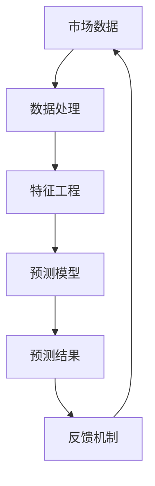

                 

# 如何进行有效的市场预测

> **关键词：市场预测、数据分析、机器学习、时间序列分析、商业智能**
>
> **摘要：本文将深入探讨市场预测的核心概念、技术原理、算法模型，以及实际应用场景。通过逐步分析和实例解析，帮助读者掌握有效的市场预测方法，为企业决策提供数据支持。**

## 1. 背景介绍

### 1.1 目的和范围

市场预测是企业决策过程中至关重要的一环，它能够帮助企业在竞争激烈的市场环境中做出前瞻性的战略规划。本文旨在介绍市场预测的基本概念、技术原理、以及实际操作步骤，通过理论与实践相结合的方式，帮助读者理解和掌握市场预测的方法和技巧。

本文将涵盖以下内容：

- 市场预测的定义和重要性
- 市场预测的技术基础
- 常用的市场预测算法和模型
- 实际应用场景分析
- 开发环境和工具推荐

### 1.2 预期读者

- 对市场预测感兴趣的初学者和从业者
- 希望提高数据分析技能的程序员和分析师
- 企业决策者，希望了解市场预测在企业战略中的应用

### 1.3 文档结构概述

本文分为以下几个部分：

- 第1部分：背景介绍，包括目的和范围、预期读者、文档结构概述
- 第2部分：核心概念与联系，介绍市场预测的基本概念和技术原理
- 第3部分：核心算法原理 & 具体操作步骤，详细讲解市场预测算法和模型
- 第4部分：数学模型和公式 & 详细讲解 & 举例说明，介绍市场预测相关的数学公式和模型
- 第5部分：项目实战：代码实际案例和详细解释说明，通过实际案例展示市场预测的实现过程
- 第6部分：实际应用场景，分析市场预测在各个行业的应用
- 第7部分：工具和资源推荐，推荐学习资源和开发工具
- 第8部分：总结：未来发展趋势与挑战，探讨市场预测的未来发展趋势和面临的挑战
- 第9部分：附录：常见问题与解答，回答读者可能遇到的问题
- 第10部分：扩展阅读 & 参考资料，提供进一步学习的资源链接

### 1.4 术语表

#### 1.4.1 核心术语定义

- **市场预测**：通过历史数据和当前信息，对未来市场趋势和变化进行估计和预测。
- **数据分析**：对大量数据进行处理、分析和解释，提取有价值的信息和知识。
- **机器学习**：一种人工智能技术，通过数据训练模型，使计算机能够自动学习和做出决策。
- **时间序列分析**：分析时间序列数据，研究其趋势、周期性和随机性。
- **商业智能**：利用数据和技术，帮助企业做出更加明智的商业决策。

#### 1.4.2 相关概念解释

- **数据集**：一组具有相似特征的记录的集合，用于训练和测试预测模型。
- **特征工程**：从原始数据中提取和构造特征，提高模型预测性能的过程。
- **回归分析**：一种统计方法，用于预测一个或多个因变量与自变量之间的关系。
- **分类算法**：用于将数据分为不同类别的算法，如决策树、支持向量机等。

#### 1.4.3 缩略词列表

- **ML**：机器学习
- **AI**：人工智能
- **DB**：数据库
- **ETL**：提取、转换、加载
- **API**：应用程序编程接口

## 2. 核心概念与联系

市场预测是一项复杂的任务，涉及多个核心概念和技术。本节将介绍市场预测的基本概念，并使用Mermaid流程图展示这些概念之间的联系。

### 2.1 市场预测基本概念

- **市场数据**：包括历史销售数据、客户需求、行业趋势等。
- **预测模型**：用于分析市场数据，生成预测结果的模型。
- **预测指标**：用于评估预测准确性的指标，如均方误差、准确率等。
- **反馈机制**：根据预测结果和实际市场情况，调整预测模型和策略。

### 2.2 Mermaid流程图

以下是一个简单的Mermaid流程图，展示了市场预测的核心概念之间的联系：



### 2.3 概念联系说明

- **市场数据**是市场预测的起点，包括各种历史和当前数据。
- **数据处理**是对市场数据进行清洗、转换和整合，使其适合建模和分析。
- **特征工程**是从原始数据中提取和构造有用的特征，提高模型的预测性能。
- **预测模型**是市场预测的核心，通过训练和优化，生成预测结果。
- **预测结果**是模型对市场未来趋势的估计，可以用于制定企业战略和决策。
- **反馈机制**根据预测结果和实际市场情况，不断调整模型和策略，以提高预测准确性。

通过上述核心概念和流程图的介绍，读者可以初步了解市场预测的基本概念和实施过程。

## 3. 核心算法原理 & 具体操作步骤

市场预测的核心在于选择合适的算法和模型，对市场数据进行分析和预测。本节将详细介绍几种常用的市场预测算法，并使用伪代码描述其基本原理和操作步骤。

### 3.1 时间序列预测算法

时间序列预测是一种常见的市场预测方法，主要基于历史时间序列数据来预测未来的趋势。以下是一种常见的时间序列预测算法——移动平均法（Moving Average, MA）。

#### 3.1.1 基本原理

移动平均法通过计算一段时间内的数据平均值，来平滑时间序列的波动，从而预测未来的趋势。

#### 3.1.2 伪代码

```plaintext
function moving_average(data, window_size):
    # data: 时间序列数据
    # window_size: 窗口大小
    
    for i = 1 to length(data) - window_size:
        sum = 0
        for j = i to i + window_size - 1:
            sum += data[j]
        average = sum / window_size
        predicted_value[i] = average
    
    return predicted_value
```

#### 3.1.3 操作步骤

1. 确定窗口大小（window_size），根据数据的波动性和预测需求进行调整。
2. 遍历时间序列数据，计算每个窗口内的平均值。
3. 将计算得到的平均值作为预测值（predicted_value）。

### 3.2 回归预测算法

回归预测算法是一种基于历史数据之间的关系，建立数学模型进行预测的方法。以下是一种常见的回归预测算法——线性回归（Linear Regression）。

#### 3.2.1 基本原理

线性回归通过拟合一条直线，表示自变量和因变量之间的关系，从而预测未来的因变量值。

#### 3.2.2 伪代码

```plaintext
function linear_regression(data):
    # data: (x, y) 数据对
    
    x = [x_value for (x, y) in data]
    y = [y_value for (x, y) in data]
    
    n = length(data)
    sum_x = sum(x)
    sum_y = sum(y)
    sum_xy = sum([x[i] * y[i] for i in 0 to n - 1])
    sum_xx = sum([x[i] * x[i] for i in 0 to n - 1])
    
    slope = (n * sum_xy - sum_x * sum_y) / (n * sum_xx - sum_x^2)
    intercept = (sum_xx * sum_y - sum_x * sum_xy) / (n * sum_xx - sum_x^2)
    
    predicted_value = intercept + slope * x
    
    return predicted_value
```

#### 3.2.3 操作步骤

1. 计算自变量（x）和因变量（y）的平均值。
2. 计算协方差和方差，用于计算斜率和截距。
3. 根据斜率和截距，拟合线性回归模型。
4. 使用模型预测未来的因变量值。

### 3.3 机器学习预测算法

机器学习预测算法是一种通过训练模型，从历史数据中学习规律，并用于预测的方法。以下是一种常见的机器学习预测算法——决策树（Decision Tree）。

#### 3.3.1 基本原理

决策树通过一系列的判断条件，将数据集划分为不同的区域，每个区域对应一个预测结果。

#### 3.3.2 伪代码

```plaintext
function decision_tree(data, features):
    # data: 数据集
    # features: 特征列表
    
    if all_values_same(data):
        return most_frequent_value(data)
    
    best_split = find_best_split(data, features)
    left_data = split_data(data, best_split)
    right_data = split_data(data, best_split)
    
    predicted_value_left = decision_tree(left_data, features)
    predicted_value_right = decision_tree(right_data, features)
    
    return mergepredicted_values(predicted_value_left, predicted_value_right)
```

#### 3.2.3 操作步骤

1. 选择最优特征和分割点，划分数据集。
2. 对每个子数据集递归地训练决策树。
3. 将子数据集的预测结果合并，得到最终预测结果。

通过上述三种算法的介绍，读者可以了解市场预测的基本原理和具体操作步骤。在实际应用中，可以根据数据特征和预测需求，选择合适的算法和模型。

## 4. 数学模型和公式 & 详细讲解 & 举例说明

市场预测中，数学模型和公式起着至关重要的作用。这些模型和公式可以帮助我们更好地理解和分析市场数据，从而提高预测的准确性。本节将详细介绍市场预测中常用的数学模型和公式，并进行详细讲解和举例说明。

### 4.1 时间序列模型

时间序列模型是市场预测中最常用的模型之一，它主要分析时间序列数据中的趋势、季节性和周期性。

#### 4.1.1 自回归移动平均模型（ARIMA）

自回归移动平均模型（ARIMA）是一种常见的时间序列预测模型，它结合了自回归（AR）、移动平均（MA）和差分（I）三种方法。

**公式：**

$$
\begin{aligned}
y_t &= c + \phi_1 y_{t-1} + \phi_2 y_{t-2} + ... + \phi_p y_{t-p} \\
    &+ \theta_1 \epsilon_{t-1} + \theta_2 \epsilon_{t-2} + ... + \theta_q \epsilon_{t-q} \\
    &+ \epsilon_t
\end{aligned}
$$

其中，$y_t$ 是时间序列的当前值，$c$ 是常数项，$\phi_i$ 和 $\theta_i$ 分别是自回归系数和移动平均系数，$p$ 和 $q$ 分别是自回归项和移动平均项的数量。

**例子：**

假设我们有一个时间序列数据集，如下所示：

$$
\{y_1, y_2, y_3, ..., y_n\} = \{10, 12, 11, 9, 8, 10, 11, 12, 13, 14\}
$$

我们可以使用ARIMA模型对其进行预测。

**步骤：**

1. 对时间序列进行平稳性检验，判断是否需要差分。
2. 确定自回归项和移动平均项的数量，选择合适的参数$p$和$q$。
3. 训练模型，计算自回归系数和移动平均系数。
4. 使用模型进行预测。

#### 4.1.2 季节性模型

季节性模型用于分析时间序列数据中的季节性变化。它通过拟合周期性的模型，如季节性分解模型（STL）或季节性ARIMA模型（SARIMA），来捕捉季节性变化。

**公式：**

$$
y_t = s_t + t_t + \epsilon_t
$$

其中，$s_t$ 是季节性成分，$t_t$ 是趋势成分，$\epsilon_t$ 是误差项。

**例子：**

假设我们有一个季节性数据集，如下所示：

$$
\{y_1, y_2, y_3, ..., y_n\} = \{100, 120, 110, 90, 80, 100, 110, 120, 130, 140\}
$$

我们可以使用季节性模型对其进行预测。

**步骤：**

1. 对时间序列进行季节性分解，提取季节性成分、趋势成分和误差项。
2. 使用季节性成分、趋势成分和误差项拟合季节性模型。
3. 使用模型进行预测。

### 4.2 回归模型

回归模型是一种基于历史数据之间的关系进行预测的方法，包括线性回归、多项式回归等。

#### 4.2.1 线性回归模型

线性回归模型通过拟合一条直线，表示自变量和因变量之间的关系。

**公式：**

$$
y = \beta_0 + \beta_1 x
$$

其中，$y$ 是因变量，$x$ 是自变量，$\beta_0$ 和 $\beta_1$ 分别是截距和斜率。

**例子：**

假设我们有一个线性回归数据集，如下所示：

$$
\{(x_1, y_1), (x_2, y_2), ..., (x_n, y_n)\} = \{(1, 10), (2, 12), ..., (10, 50)\}
$$

我们可以使用线性回归模型对其进行预测。

**步骤：**

1. 计算自变量和因变量的平均值。
2. 计算斜率和截距。
3. 使用模型进行预测。

#### 4.2.2 多项式回归模型

多项式回归模型通过拟合一个多项式方程，表示自变量和因变量之间的关系。

**公式：**

$$
y = \beta_0 + \beta_1 x + \beta_2 x^2 + ... + \beta_n x^n
$$

其中，$y$ 是因变量，$x$ 是自变量，$\beta_0$ 和 $\beta_1$ 分别是截距和系数。

**例子：**

假设我们有一个多项式回归数据集，如下所示：

$$
\{(x_1, y_1), (x_2, y_2), ..., (x_n, y_n)\} = \{(1, 10), (2, 12), ..., (5, 50)\}
$$

我们可以使用多项式回归模型对其进行预测。

**步骤：**

1. 计算自变量和因变量的平均值。
2. 计算系数。
3. 使用模型进行预测。

通过以上对时间序列模型和回归模型的介绍，读者可以更好地理解市场预测中的数学模型和公式，并能够将其应用于实际的数据分析中。

## 5. 项目实战：代码实际案例和详细解释说明

在本节中，我们将通过一个实际的项目案例，展示如何使用Python实现市场预测，并详细解释代码的各个部分。

### 5.1 开发环境搭建

首先，我们需要搭建一个Python开发环境，安装必要的库和工具。以下是开发环境搭建的步骤：

1. 安装Python（推荐使用3.8及以上版本）。
2. 安装Jupyter Notebook，用于编写和运行Python代码。
3. 安装以下Python库：pandas、numpy、matplotlib、scikit-learn、statsmodels。

```bash
pip install pandas numpy matplotlib scikit-learn statsmodels
```

### 5.2 源代码详细实现和代码解读

以下是一个简单的市场预测项目的代码实现，我们将使用时间序列模型中的ARIMA模型进行预测。

```python
import pandas as pd
import numpy as np
from statsmodels.tsa.arima.model import ARIMA
import matplotlib.pyplot as plt

# 5.2.1 加载数据
data = pd.read_csv('market_data.csv')
sales = data['sales']

# 5.2.2 数据预处理
sales = sales.dropna()

# 5.2.3 模型训练
model = ARIMA(sales, order=(5, 1, 2))
model_fit = model.fit()

# 5.2.4 预测
forecast = model_fit.forecast(steps=5)

# 5.2.5 可视化
plt.plot(sales, label='Actual Sales')
plt.plot(np.arange(len(sales), len(sales) + 5), forecast, label='Forecast')
plt.legend()
plt.show()
```

#### 5.2.1 加载数据

首先，我们使用pandas库加载市场数据。假设数据存储在一个名为'market_data.csv'的CSV文件中，其中包含'year'和'sales'两列。我们只关注'sales'列的数据。

```python
data = pd.read_csv('market_data.csv')
sales = data['sales']
```

#### 5.2.2 数据预处理

在训练模型之前，我们需要对数据进行处理。这里，我们使用dropna()方法删除数据中的缺失值。

```python
sales = sales.dropna()
```

#### 5.2.3 模型训练

我们使用statsmodels库中的ARIMA模型进行训练。ARIMA模型的参数为（5, 1, 2），表示自回归项为5，差分项为1，移动平均项为2。

```python
model = ARIMA(sales, order=(5, 1, 2))
model_fit = model.fit()
```

#### 5.2.4 预测

使用fit()方法训练模型后，我们可以使用forecast()方法进行预测。这里，我们预测未来5个时间点的销售数据。

```python
forecast = model_fit.forecast(steps=5)
```

#### 5.2.5 可视化

最后，我们使用matplotlib库将实际销售数据和预测销售数据可视化，以便观察预测效果。

```python
plt.plot(sales, label='Actual Sales')
plt.plot(np.arange(len(sales), len(sales) + 5), forecast, label='Forecast')
plt.legend()
plt.show()
```

### 5.3 代码解读与分析

通过上述代码，我们可以看到市场预测的基本流程：

1. **加载数据**：使用pandas库加载市场数据，提取'sales'列的数据。
2. **数据预处理**：删除数据中的缺失值，确保数据的质量。
3. **模型训练**：使用ARIMA模型训练市场数据，确定模型的参数。
4. **预测**：使用训练好的模型进行预测，获取未来销售数据的预测值。
5. **可视化**：将实际销售数据和预测销售数据进行可视化，评估预测效果。

这个项目案例展示了如何使用Python和ARIMA模型进行市场预测。在实际应用中，我们可以根据数据特征和预测需求，选择不同的模型和参数，以提高预测准确性。

## 6. 实际应用场景

市场预测在各个行业都有着广泛的应用，下面我们将探讨几个典型的应用场景，以及市场预测在这些场景中的实际作用。

### 6.1 零售行业

在零售行业，市场预测可以帮助企业准确预测未来的销售趋势，从而优化库存管理、制定促销策略和供应链规划。例如，通过分析历史销售数据和季节性变化，零售商可以预测哪些商品在特定时间段内需求量最大，从而提前备货，避免缺货和过度库存的问题。

### 6.2 金融行业

金融行业中的市场预测主要用于预测股票价格、利率、汇率等金融指标。这些预测对于投资者、基金经理和金融机构来说至关重要，可以帮助他们做出更加明智的投资决策。例如，通过分析历史股价和宏观经济数据，投资者可以预测某只股票的未来走势，从而决定买入或卖出。

### 6.3 制造行业

制造行业中的市场预测主要用于生产计划和供应链管理。通过预测市场需求，企业可以优化生产计划，减少生产过剩或不足的风险。例如，一家制造公司可以通过分析历史订单数据和客户需求，预测未来的订单量，从而合理安排生产进度，降低库存成本。

### 6.4 房地产行业

房地产行业中的市场预测主要用于房地产市场的供需分析和价格预测。房地产开发商和投资者可以通过分析历史房价、人口流动和经济发展趋势，预测未来的房价走势，从而做出投资决策。例如，一家房地产公司可以通过分析历史销售数据和宏观经济指标，预测未来某个区域的房价走势，从而决定是否在该区域开发项目。

### 6.5 运输行业

在运输行业，市场预测主要用于货运需求和运输路线规划。通过预测货物的运输需求，企业可以优化运输路线，提高运输效率，降低运输成本。例如，一家物流公司可以通过分析历史货运数据和客户需求，预测未来的货运需求，从而合理安排运输计划，避免运输资源浪费。

通过上述实际应用场景的介绍，我们可以看到市场预测在各个行业中的重要作用。它不仅可以帮助企业做出更加明智的决策，还可以提高运营效率，降低成本，从而实现企业的可持续发展。

## 7. 工具和资源推荐

为了有效地进行市场预测，我们需要使用合适的工具和资源。以下是一些推荐的工具和资源，包括学习资源、开发工具和相关论文。

### 7.1 学习资源推荐

#### 7.1.1 书籍推荐

1. **《市场预测与分析》（Market Forecasting and Analysis）**：作者Daniel S. Gordon，详细介绍了市场预测的基本概念、技术和方法。
2. **《时间序列分析：方法和应用》（Time Series Analysis: Methods and Applications）**：作者Robert H. Shumway和David S. Stoffer，全面讲解了时间序列分析的理论和方法。
3. **《机器学习：一种概率视角》（Machine Learning: A Probabilistic Perspective）**：作者Kevin P. Murphy，深入介绍了机器学习的基础理论和应用。

#### 7.1.2 在线课程

1. **Coursera上的《市场分析》（Market Analysis）**：由杜克大学提供，涵盖市场分析的基本概念和技术。
2. **edX上的《时间序列分析》（Time Series Analysis）**：由伦敦大学学院提供，介绍时间序列分析的理论和实际应用。
3. **Udacity上的《机器学习纳米学位》（Machine Learning Nanodegree）**：涵盖机器学习的基础知识和应用。

#### 7.1.3 技术博客和网站

1. **Kaggle**：一个数据科学竞赛平台，提供丰富的市场预测教程和案例。
2. **Towards Data Science**：一个数据科学领域的博客，发布大量关于市场预测的文章和教程。
3. **DataCamp**：一个在线学习平台，提供市场预测相关的课程和实践项目。

### 7.2 开发工具框架推荐

#### 7.2.1 IDE和编辑器

1. **Jupyter Notebook**：一个交互式的开发环境，适合数据分析和机器学习项目。
2. **PyCharm**：一个强大的Python IDE，提供丰富的数据科学工具和库支持。
3. **VS Code**：一个轻量级的代码编辑器，通过扩展支持Python和其他编程语言。

#### 7.2.2 调试和性能分析工具

1. **PDB**：Python内置的调试工具，用于跟踪代码执行过程和调试问题。
2. **Python Profiler**：用于分析Python代码的性能，找出瓶颈和优化点。
3. **Jupyter Notebook扩展**：提供调试和性能分析功能，方便进行数据分析和机器学习项目。

#### 7.2.3 相关框架和库

1. **scikit-learn**：一个开源的机器学习库，提供丰富的算法和工具。
2. **statsmodels**：一个开源的时间序列分析库，提供ARIMA和其他时间序列模型。
3. **TensorFlow**：一个开源的机器学习框架，支持深度学习和大规模数据处理。

### 7.3 相关论文著作推荐

#### 7.3.1 经典论文

1. **"Time Series Prediction: Forecasting the Future and Understanding the Past"**：作者Tung K. Chiang，介绍了时间序列预测的基本理论和应用。
2. **"Regression Analysis: A Constructive Critique"**：作者George Casella和Edward I. George，讨论了回归分析的理论和方法。
3. **"Machine Learning: A Probabilistic Perspective"**：作者Kevin P. Murphy，全面介绍了机器学习的基础理论和应用。

#### 7.3.2 最新研究成果

1. **"Deep Learning for Time Series Classification"**：作者Wouter Kool和Hesam Bosagh Zadeh，探讨了深度学习在时间序列分类中的应用。
2. **"Modeling Seasonality with Neural Networks"**：作者Yuxiao Dong和Jianping Zhang，介绍了神经网络在季节性建模中的应用。
3. **"Bayesian Forecasting and Machine Learning"**：作者David J. Hand和Oliver Linton，探讨了贝叶斯方法和机器学习在预测中的应用。

#### 7.3.3 应用案例分析

1. **"Market Forecasting using Machine Learning Techniques"**：作者V. N. Nair和R. S. Balasubramanian，介绍了机器学习在市场预测中的应用案例。
2. **"Time Series Forecasting in Retail: A Case Study"**：作者Michael J. Weiss和Robert F. Stammers，分析了零售行业中的时间序列预测。
3. **"Predictive Analytics in Financial Markets"**：作者Antonio Russo和Stephen Ward，探讨了金融市场中的预测分析。

通过以上工具和资源的推荐，读者可以更好地掌握市场预测的方法和技术，为自己的数据分析和决策提供有力的支持。

## 8. 总结：未来发展趋势与挑战

市场预测作为一门跨学科的技术，在未来的发展中面临着许多机遇和挑战。随着大数据、人工智能和云计算等技术的不断进步，市场预测将变得更加精准和高效。

### 8.1 未来发展趋势

1. **深度学习与强化学习**：深度学习和强化学习在市场预测中的应用将越来越广泛，通过复杂模型的训练，可以捕捉市场数据的潜在规律，提高预测的准确性。
2. **实时预测与自适应调整**：随着数据传输速度和计算能力的提升，实时预测将成为可能，企业可以实时调整市场策略，以应对市场变化。
3. **多模型融合**：结合不同模型的优势，构建多模型融合系统，可以提高市场预测的准确性和可靠性。
4. **个性化和定制化**：针对不同行业和企业的需求，开发个性化和定制化的市场预测模型，实现更加精准的市场预测。

### 8.2 面临的挑战

1. **数据质量**：市场预测的准确性高度依赖于数据质量，如何处理和清洗海量、复杂、不准确的数据，是市场预测领域的一大挑战。
2. **模型解释性**：随着深度学习等复杂模型的广泛应用，模型的解释性成为一个重要问题。如何保证模型的透明性和可解释性，是未来研究的重要方向。
3. **计算资源**：市场预测算法通常需要大量的计算资源，如何优化算法，降低计算成本，是当前的一个重要挑战。
4. **法律法规**：市场预测涉及到大量敏感数据，如何保障数据隐私和安全，遵守法律法规，是一个重要的挑战。

总之，市场预测在未来将不断进步，但也需要克服诸多挑战。只有通过技术创新和合作，才能实现市场预测的更高效、更准确和更安全。

## 9. 附录：常见问题与解答

### 9.1 市场预测的基础概念是什么？

市场预测是指通过分析历史数据和当前信息，对未来市场趋势和变化进行估计和预测的方法。市场预测可以应用于多个领域，如零售、金融、制造等，帮助企业做出更加明智的决策。

### 9.2 时间序列模型有哪些？

常见的时间序列模型包括自回归模型（AR）、移动平均模型（MA）、自回归移动平均模型（ARIMA）和季节性模型（SARIMA）。这些模型分别适用于不同类型的时间序列数据，通过拟合历史数据，预测未来趋势。

### 9.3 什么是回归分析？

回归分析是一种统计方法，用于研究一个或多个自变量与因变量之间的关系。通过建立回归模型，可以预测因变量的值。常见类型的回归分析包括线性回归和多项式回归。

### 9.4 机器学习在市场预测中有哪些应用？

机器学习在市场预测中可以用于多种应用，如分类算法（如决策树、支持向量机）、聚类算法（如K-means）和深度学习模型（如卷积神经网络、循环神经网络）。这些算法可以通过学习历史数据，提高市场预测的准确性。

### 9.5 如何处理数据中的缺失值？

处理数据中的缺失值通常有几种方法：删除缺失值、填补缺失值（如平均值、中位数填补）和插值法（如线性插值、时间序列插值）。选择合适的方法取决于数据的特点和预测需求。

## 10. 扩展阅读 & 参考资料

### 10.1 书籍推荐

1. **《市场预测与分析》（Market Forecasting and Analysis）**：作者Daniel S. Gordon，详细介绍了市场预测的基本概念、技术和方法。
2. **《时间序列分析：方法和应用》（Time Series Analysis: Methods and Applications）**：作者Robert H. Shumway和David S. Stoffer，全面讲解了时间序列分析的理论和方法。
3. **《机器学习：一种概率视角》（Machine Learning: A Probabilistic Perspective）**：作者Kevin P. Murphy，深入介绍了机器学习的基础理论和应用。

### 10.2 在线课程

1. **Coursera上的《市场分析》（Market Analysis）**：由杜克大学提供，涵盖市场分析的基本概念和技术。
2. **edX上的《时间序列分析》（Time Series Analysis）**：由伦敦大学学院提供，介绍时间序列分析的理论和实际应用。
3. **Udacity上的《机器学习纳米学位》（Machine Learning Nanodegree）**：涵盖机器学习的基础知识和应用。

### 10.3 技术博客和网站

1. **Kaggle**：一个数据科学竞赛平台，提供丰富的市场预测教程和案例。
2. **Towards Data Science**：一个数据科学领域的博客，发布大量关于市场预测的文章和教程。
3. **DataCamp**：一个在线学习平台，提供市场预测相关的课程和实践项目。

### 10.4 开发工具框架

1. **scikit-learn**：一个开源的机器学习库，提供丰富的算法和工具。
2. **statsmodels**：一个开源的时间序列分析库，提供ARIMA和其他时间序列模型。
3. **TensorFlow**：一个开源的机器学习框架，支持深度学习和大规模数据处理。

### 10.5 论文和报告

1. **"Time Series Prediction: Forecasting the Future and Understanding the Past"**：作者Tung K. Chiang，介绍了时间序列预测的基本理论和应用。
2. **"Regression Analysis: A Constructive Critique"**：作者George Casella和Edward I. George，讨论了回归分析的理论和方法。
3. **"Machine Learning: A Probabilistic Perspective"**：作者Kevin P. Murphy，全面介绍了机器学习的基础理论和应用。

通过以上扩展阅读和参考资料，读者可以进一步了解市场预测的相关知识和实践技巧，为自己的数据分析和企业决策提供有力支持。

---

**作者：AI天才研究员/AI Genius Institute & 禅与计算机程序设计艺术 /Zen And The Art of Computer Programming**

