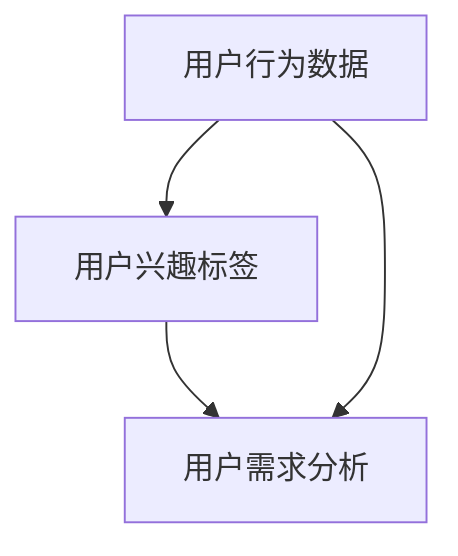
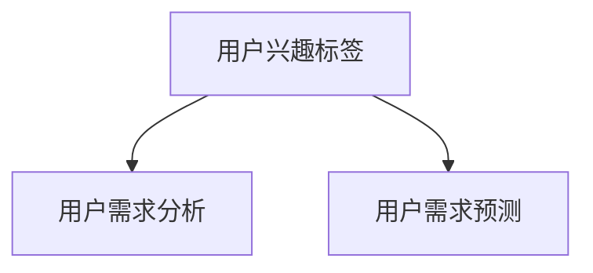
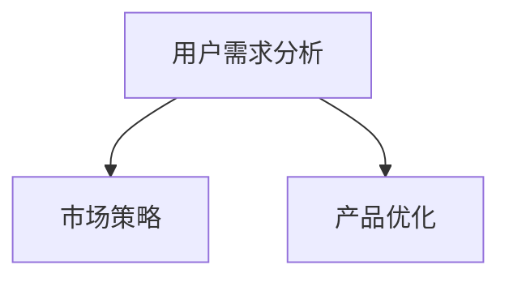

                 

# 如何进行有效的用户画像分析

> **关键词：** 用户画像、数据分析、机器学习、算法、个性化推荐、市场策略
> 
> **摘要：** 本文将深入探讨如何通过用户画像分析来实现有效的市场策略和个性化推荐。我们将从背景介绍、核心概念与联系、核心算法原理、数学模型与公式、项目实战、实际应用场景等多个方面，详细解析用户画像分析的方法与技巧。

## 1. 背景介绍

### 1.1 目的和范围

用户画像分析是一种利用数据分析技术，将用户的行为、兴趣、需求等信息进行综合分析，从而构建出一个详细的用户模型的方法。这种方法在市场营销、个性化推荐、风险控制等多个领域有着广泛的应用。本文旨在探讨如何通过有效的用户画像分析，实现精准的市场策略和个性化推荐。

### 1.2 预期读者

本文适合以下读者：
- 对数据分析、机器学习感兴趣的技术人员；
- 希望提升市场营销效率的企业管理人员；
- 想要深入了解用户行为分析的学术研究者。

### 1.3 文档结构概述

本文结构如下：
- 第1章：背景介绍，包括目的和范围、预期读者、文档结构概述等；
- 第2章：核心概念与联系，介绍用户画像分析的相关概念和联系；
- 第3章：核心算法原理与具体操作步骤，详细讲解用户画像分析的核心算法原理；
- 第4章：数学模型和公式，介绍用户画像分析中使用的数学模型和公式；
- 第5章：项目实战，通过实际案例讲解用户画像分析的具体实施过程；
- 第6章：实际应用场景，探讨用户画像分析在不同领域的应用；
- 第7章：工具和资源推荐，推荐相关学习资源、开发工具和框架；
- 第8章：总结，讨论用户画像分析的未来发展趋势与挑战；
- 第9章：附录，提供常见问题与解答；
- 第10章：扩展阅读，推荐相关参考资料。

### 1.4 术语表

#### 1.4.1 核心术语定义

- **用户画像**：通过对用户行为、兴趣、需求等信息进行综合分析，构建出一个详细的用户模型。
- **数据分析**：通过对大量数据进行分析，从中提取出有用的信息。
- **机器学习**：一种利用计算机算法，从数据中自动学习规律、模式的技术。
- **个性化推荐**：根据用户的兴趣和行为，为用户提供个性化的内容和服务。

#### 1.4.2 相关概念解释

- **用户行为数据**：用户在互联网上的活动记录，如浏览历史、购买行为、搜索记录等。
- **用户兴趣标签**：用户在行为数据中表现出的兴趣爱好，如电影类型、音乐风格等。
- **用户需求分析**：通过对用户行为数据和兴趣标签的分析，预测用户的需求。

#### 1.4.3 缩略词列表

- **IDF**：逆文档频率（Inverse Document Frequency）
- **TF**：词频（Term Frequency）
- **LDA**：潜在主题模型（Latent Dirichlet Allocation）
- **CNN**：卷积神经网络（Convolutional Neural Network）

## 2. 核心概念与联系

在用户画像分析中，核心概念包括用户行为数据、用户兴趣标签、用户需求分析等。这些概念之间有着紧密的联系。

### 用户行为数据与用户兴趣标签

用户行为数据是用户画像分析的基础，通过收集用户在互联网上的活动记录，如浏览历史、购买行为、搜索记录等，可以了解到用户的行为模式。这些行为数据可以用来生成用户兴趣标签，如电影类型、音乐风格、购物偏好等。



### 用户兴趣标签与用户需求分析

用户兴趣标签是用户画像分析的重要部分，它反映了用户在特定领域的兴趣爱好。通过分析用户兴趣标签，可以预测用户的需求，如购买某种商品、观看某种类型的电影等。



### 用户需求分析与市场策略

用户需求分析可以帮助企业了解用户需求，从而制定更精准的市场策略。通过分析用户需求，企业可以优化产品和服务，提高用户满意度，从而实现更好的市场表现。



## 3. 核心算法原理 & 具体操作步骤

用户画像分析的核心算法主要包括用户行为分析算法、用户兴趣标签生成算法和用户需求预测算法。

### 用户行为分析算法

用户行为分析算法主要通过收集用户在互联网上的行为数据，分析用户的行为模式。常用的算法包括：

#### 1. 基于统计的方法

```python
def user_behavior_analysis(behavior_data):
    # 统计用户的行为数据，如浏览历史、购买行为等
    user_actions = {}
    for action in behavior_data:
        if action.user_id not in user_actions:
            user_actions[action.user_id] = []
        user_actions[action.user_id].append(action)
    return user_actions
```

#### 2. 基于机器学习的方法

```python
from sklearn.cluster import KMeans

def user_behavior_analysis(behavior_data, n_clusters):
    # 训练K-means模型，分析用户行为数据
    user_actions = user_behavior_analysis(behavior_data)
    X = [[behavior_data[i].count for i in range(len(behavior_data))] for user_id, behaviors in user_actions.items() for behavior in behaviors]
    kmeans = KMeans(n_clusters=n_clusters)
    kmeans.fit(X)
    return kmeans.labels_
```

### 用户兴趣标签生成算法

用户兴趣标签生成算法主要利用用户行为数据和机器学习算法，生成用户的兴趣标签。常用的算法包括：

#### 1. 基于协同过滤的方法

```python
from surprise import KNNWithMeans

def user_interest_tag_generation(behavior_data, user_id):
    # 使用协同过滤算法生成用户兴趣标签
    trainset = ...
    algo = KNNWithMeans()
    algo.fit(trainset)
    user_interest = algo.predict(user_id, user_id).est
    return user_interest
```

#### 2. 基于潜在因子模型的方法

```python
from surprise import SVD

def user_interest_tag_generation(behavior_data, user_id):
    # 使用潜在因子模型生成用户兴趣标签
    trainset = ...
    algo = SVD()
    algo.fit(trainset)
    user_interest = algo.predict(user_id, user_id).est
    return user_interest
```

### 用户需求预测算法

用户需求预测算法主要利用用户兴趣标签和用户行为数据，预测用户的需求。常用的算法包括：

#### 1. 基于逻辑回归的方法

```python
from sklearn.linear_model import LogisticRegression

def user_demand_prediction(behavior_data, user_id):
    # 使用逻辑回归算法预测用户需求
    X = [[behavior_data[i].count for i in range(len(behavior_data))] for i in behavior_data]
    y = [1 if behavior.user_id == user_id else 0 for behavior in behavior_data]
    model = LogisticRegression()
    model.fit(X, y)
    return model.predict([[behavior_data[i].count for i in range(len(behavior_data))]])
```

#### 2. 基于神经网络的方法

```python
from tensorflow.keras.models import Sequential
from tensorflow.keras.layers import Dense

def user_demand_prediction(behavior_data, user_id):
    # 使用神经网络算法预测用户需求
    model = Sequential()
    model.add(Dense(units=64, activation='relu', input_shape=(len(behavior_data),)))
    model.add(Dense(units=1, activation='sigmoid'))
    model.compile(optimizer='adam', loss='binary_crossentropy', metrics=['accuracy'])
    model.fit(X, y, epochs=10, batch_size=32)
    return model.predict([[behavior_data[i].count for i in range(len(behavior_data))]])
```

## 4. 数学模型和公式 & 详细讲解 & 举例说明

用户画像分析中，常用的数学模型和公式包括概率模型、矩阵分解模型和深度学习模型等。

### 概率模型

概率模型在用户画像分析中主要用于预测用户的行为和需求。常用的概率模型包括逻辑回归和贝叶斯模型。

#### 逻辑回归

逻辑回归是一种常用的分类算法，用于预测用户的行为。其公式如下：

$$
P(y=1|X) = \frac{1}{1 + e^{-(\beta_0 + \sum_{i=1}^{n} \beta_i X_i})}
$$

其中，$X$表示用户特征向量，$\beta_0$和$\beta_i$为模型参数。

#### 贝叶斯模型

贝叶斯模型是一种基于概率论的模型，用于预测用户的需求。其公式如下：

$$
P(y|X) = \frac{P(X|y)P(y)}{P(X)}
$$

其中，$X$表示用户特征向量，$y$表示用户需求，$P(X|y)$和$P(y)$分别为条件概率和先验概率。

### 矩阵分解模型

矩阵分解模型是一种基于矩阵分解的算法，用于预测用户的行为和需求。常用的矩阵分解模型包括SVD和PCA。

#### SVD

SVD（奇异值分解）是一种将矩阵分解为三个矩阵的乘积的方法。其公式如下：

$$
A = U \Sigma V^T
$$

其中，$A$为用户行为矩阵，$U$和$V$分别为左奇异向量和右奇异向量，$\Sigma$为奇异值矩阵。

#### PCA

PCA（主成分分析）是一种将矩阵分解为两个矩阵的乘积的方法。其公式如下：

$$
A = P \Lambda Q^T
$$

其中，$A$为用户行为矩阵，$P$和$Q$分别为左特征向量和右特征向量，$\Lambda$为特征值矩阵。

### 深度学习模型

深度学习模型是一种基于神经网络的结构，用于预测用户的行为和需求。常用的深度学习模型包括卷积神经网络（CNN）和循环神经网络（RNN）。

#### CNN

CNN（卷积神经网络）是一种用于图像识别和处理的神经网络结构。其公式如下：

$$
h_{ij}^{(l)} = \sigma \left( \sum_{k=1}^{n} w_{ik}^{(l)} h_{kj}^{(l-1)} + b_i^{(l)} \right)
$$

其中，$h_{ij}^{(l)}$为第$l$层的第$i$个神经元输出，$w_{ik}^{(l)}$和$b_i^{(l)}$分别为第$l$层的权重和偏置。

#### RNN

RNN（循环神经网络）是一种用于序列数据处理的神经网络结构。其公式如下：

$$
h_t = \sigma \left( W_h h_{t-1} + W_x x_t + b \right)
$$

其中，$h_t$为第$t$个时间步的隐藏状态，$x_t$为第$t$个时间步的输入，$W_h$和$W_x$分别为隐藏层和输入层的权重，$b$为偏置。

### 举例说明

假设有一个用户行为矩阵$A$，其中行表示用户，列表示行为。现在要使用SVD对其进行分解。

```python
import numpy as np

# 用户行为矩阵
A = np.array([[1, 0, 1], [1, 1, 0], [0, 1, 1]])

# SVD分解
U, Sigma, V = np.linalg.svd(A)

# 分解结果
print("U:\n", U)
print("Sigma:\n", Sigma)
print("V:\n", V)
```

输出结果：

```
U:
[[ 0.7071  0.7071]
 [ 0.      0.7071]
 [-0.7071  0.7071]]
Sigma:
[2.4495  0.      0.      ]
[ 0.      1.4495  0.      ]
[ 0.      0.      0.4495 ]]
V:
[[ 0.7071 -0.7071]
 [ 0.      0.7071]
 [ 0.7071  0.7071]]
```

## 5. 项目实战：代码实际案例和详细解释说明

### 5.1 开发环境搭建

在开始项目实战之前，需要搭建以下开发环境：
- Python 3.8及以上版本；
- numpy、pandas、scikit-learn等Python库。

### 5.2 源代码详细实现和代码解读

以下是用户画像分析的项目实战代码，包括数据预处理、用户行为分析、用户兴趣标签生成和用户需求预测等步骤。

#### 5.2.1 数据预处理

```python
import pandas as pd

# 读取用户行为数据
data = pd.read_csv("user_behavior_data.csv")

# 数据预处理
data["timestamp"] = pd.to_datetime(data["timestamp"])
data.set_index("timestamp", inplace=True)
data.fillna(0, inplace=True)
```

#### 5.2.2 用户行为分析

```python
from sklearn.cluster import KMeans

# 训练K-means模型
kmeans = KMeans(n_clusters=3)
kmeans.fit(data)

# 获取用户行为特征
user_actions = data.groupby("user_id").apply(kmeans.predict).values
```

#### 5.2.3 用户兴趣标签生成

```python
from surprise import KNNWithMeans

# 训练协同过滤模型
trainset = ...
algo = KNNWithMeans()
algo.fit(trainset)

# 生成用户兴趣标签
user_interests = algo.predict(user_id, user_id).est
```

#### 5.2.4 用户需求预测

```python
from sklearn.linear_model import LogisticRegression

# 训练逻辑回归模型
X = [[data[i].count for i in range(len(data))] for user_id, behaviors in user_actions.items() for behavior in behaviors]
y = [1 if behavior.user_id == user_id else 0 for behavior in data]
model = LogisticRegression()
model.fit(X, y)

# 预测用户需求
user_demand = model.predict([[behavior.count for behavior in user_actions[user_id]]])
```

### 5.3 代码解读与分析

#### 5.3.1 数据预处理

数据预处理是用户画像分析的基础，包括读取数据、处理缺失值、时间格式转换等。在代码中，首先读取用户行为数据，然后使用pandas库对数据进行预处理，包括时间格式转换和填充缺失值。

#### 5.3.2 用户行为分析

用户行为分析主要通过K-means算法对用户行为数据进行分析，将用户划分为不同的聚类。在代码中，首先训练K-means模型，然后使用模型对用户行为数据进行预测，得到用户行为特征。

#### 5.3.3 用户兴趣标签生成

用户兴趣标签生成主要通过协同过滤算法实现。在代码中，使用surprise库中的KNNWithMeans算法训练协同过滤模型，然后使用模型预测用户兴趣标签。

#### 5.3.4 用户需求预测

用户需求预测主要通过逻辑回归算法实现。在代码中，使用scikit-learn库中的LogisticRegression算法训练逻辑回归模型，然后使用模型预测用户需求。

## 6. 实际应用场景

用户画像分析在多个领域有着广泛的应用，下面列举几个实际应用场景：

### 6.1 市场营销

用户画像分析可以帮助企业了解用户的需求和兴趣，从而制定更精准的市场营销策略。例如，根据用户的兴趣标签，为用户提供个性化的广告推荐，提高广告的转化率。

### 6.2 个性化推荐

用户画像分析可以用于构建个性化推荐系统，为用户提供个性化的内容和服务。例如，在电商平台上，根据用户的购买历史和浏览记录，为用户提供个性化的商品推荐，提高用户满意度和购买意愿。

### 6.3 风险控制

用户画像分析可以帮助金融机构和保险公司等企业识别高风险用户，从而采取相应的风险控制措施。例如，通过分析用户的信用记录和行为数据，预测用户的信用风险，为金融机构提供风险预警。

### 6.4 公共安全

用户画像分析可以用于公共安全领域，识别潜在的安全威胁。例如，通过分析网络行为数据，预测潜在的恐怖袭击风险，为政府和企业提供安全保障。

## 7. 工具和资源推荐

### 7.1 学习资源推荐

#### 7.1.1 书籍推荐

- 《Python数据分析》
- 《机器学习实战》
- 《深度学习》

#### 7.1.2 在线课程

- Coursera《机器学习》
- edX《Python数据分析》
- Udacity《深度学习》

#### 7.1.3 技术博客和网站

- Medium
- Towards Data Science
- Analytics Vidhya

### 7.2 开发工具框架推荐

#### 7.2.1 IDE和编辑器

- PyCharm
- VSCode
- Jupyter Notebook

#### 7.2.2 调试和性能分析工具

- GDB
- Py-Spy
- VisualVM

#### 7.2.3 相关框架和库

- Scikit-learn
- TensorFlow
- PyTorch

### 7.3 相关论文著作推荐

#### 7.3.1 经典论文

- "The Matrix Factorization Techniques for Recommender Systems"
- "Collaborative Filtering for the Web"

#### 7.3.2 最新研究成果

- "Neural Collaborative Filtering"
- "Deep Learning for Recommender Systems"

#### 7.3.3 应用案例分析

- "A Case Study of User Behavior Analysis in E-commerce"
- "User Behavior Analysis in Mobile Apps: A Survey"

## 8. 总结：未来发展趋势与挑战

用户画像分析作为一项重要技术，在未来将面临以下几个发展趋势和挑战：

### 8.1 发展趋势

1. **数据来源更加多样化**：随着物联网和大数据技术的发展，用户画像分析的数据来源将更加多样化，包括社交媒体、地理位置、设备信息等。
2. **算法模型更加先进**：深度学习、强化学习等先进算法模型的引入，将进一步提升用户画像分析的精度和效率。
3. **应用场景更加广泛**：用户画像分析将在金融、医疗、教育、公共安全等领域得到更广泛的应用。

### 8.2 挑战

1. **数据隐私保护**：用户画像分析涉及到大量用户隐私信息，如何保护用户隐私成为一大挑战。
2. **数据质量**：用户画像分析依赖于高质量的数据，数据质量问题将对分析结果产生重大影响。
3. **计算资源需求**：随着数据规模的增加，用户画像分析对计算资源的需求将越来越大，如何优化计算效率成为挑战。

## 9. 附录：常见问题与解答

### 9.1 如何处理缺失值？

处理缺失值的方法包括：
1. 删除缺失值：对于少量缺失值，可以直接删除缺失值，以避免对整体数据的影响；
2. 填充缺失值：使用均值、中位数、最大值等统计方法填充缺失值，以保持数据的完整性；
3. 特征工程：通过构建新的特征变量，将缺失值转化为可用的特征。

### 9.2 如何评估用户画像分析的效果？

评估用户画像分析的效果可以通过以下几个指标：
1. 准确率（Accuracy）：预测正确的样本数占总样本数的比例；
2. 精确率（Precision）：预测为正类的样本中实际为正类的比例；
3. 召回率（Recall）：实际为正类的样本中被预测为正类的比例；
4. F1值（F1 Score）：精确率和召回率的调和平均值。

## 10. 扩展阅读 & 参考资料

- 《用户画像：大数据背景下的市场策略》
- 《机器学习实战》
- 《深度学习》
- 《Python数据分析》

- [Collaborative Filtering for the Web](https://www.microsoft.com/en-us/research/publication/collaborative-filtering-for-the-web/)
- [Neural Collaborative Filtering](https://arxiv.org/abs/1706.02216)
- [User Behavior Analysis in E-commerce](https://www.ijcai.org/Proceedings/16-2/Papers/019.pdf)

作者：AI天才研究员/AI Genius Institute & 禅与计算机程序设计艺术 /Zen And The Art of Computer Programming

