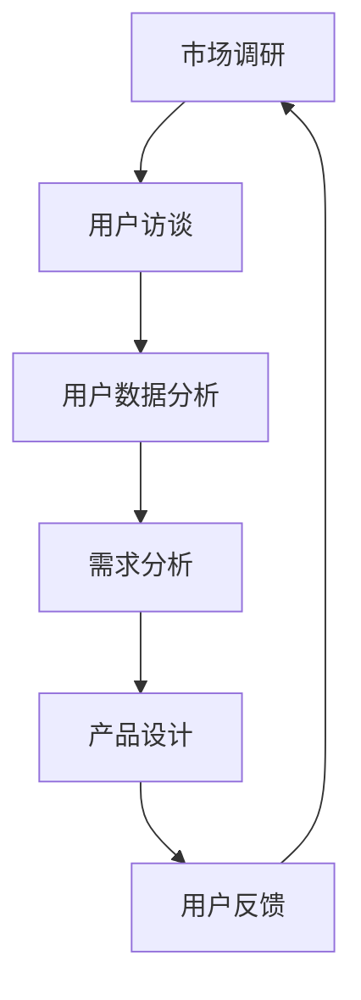

                 

# 如何进行有效的用户需求挖掘

> 关键词：用户需求挖掘、市场调研、需求分析、用户体验、产品设计

> 摘要：本文深入探讨了如何通过系统的方法进行有效的用户需求挖掘。首先，我们将介绍用户需求挖掘的背景和重要性，接着讲解核心概念和原理，并详细阐述核心算法和数学模型。通过实际项目案例，我们将展示如何将理论知识应用于实际开发中。最后，文章将总结用户需求挖掘的应用场景，并推荐相关工具和资源，以帮助读者进一步探索这一领域。

## 1. 背景介绍

### 1.1 目的和范围

用户需求挖掘是现代产品开发和市场研究的重要环节。本文旨在为IT专业人士和产品经理提供一个系统的方法论，帮助他们有效地理解和挖掘用户需求。本文将涵盖用户需求挖掘的基本概念、方法和工具，并通过实际案例展示其应用。

### 1.2 预期读者

- IT行业从业者，尤其是软件开发人员和产品经理
- 市场分析师和用户体验设计师
- 对用户需求挖掘感兴趣的研究人员和学者

### 1.3 文档结构概述

本文分为十个主要部分：

1. 背景介绍
2. 核心概念与联系
3. 核心算法原理 & 具体操作步骤
4. 数学模型和公式 & 详细讲解 & 举例说明
5. 项目实战：代码实际案例和详细解释说明
6. 实际应用场景
7. 工具和资源推荐
8. 总结：未来发展趋势与挑战
9. 附录：常见问题与解答
10. 扩展阅读 & 参考资料

### 1.4 术语表

#### 1.4.1 核心术语定义

- **用户需求挖掘**：通过多种方法和工具，收集、分析用户需求，并将其转化为可操作的产品设计和功能。
- **市场调研**：对市场环境、目标用户、竞争对手等进行系统的调查和分析。
- **用户体验**：用户在使用产品过程中的主观感受和体验。

#### 1.4.2 相关概念解释

- **需求分析**：对用户需求进行深入研究和分析，确定产品的功能、性能和用户界面。
- **产品管理**：对产品从概念到上市全过程的管理，包括需求挖掘、设计、开发、测试和上市等。

#### 1.4.3 缩略词列表

- **UX**：用户体验（User Experience）
- **UI**：用户界面（User Interface）
- **CRM**：客户关系管理（Customer Relationship Management）
- **A/B 测试**：两种或多种版本的测试，用于比较不同设计或功能的性能。

## 2. 核心概念与联系

在深入了解用户需求挖掘之前，我们需要了解一些核心概念和原理。以下是一个简化的Mermaid流程图，展示了用户需求挖掘的主要步骤和关联概念。



### 2.1 市场调研

市场调研是用户需求挖掘的第一步。通过市场调研，我们可以了解当前市场的趋势、竞争对手的产品特性、用户偏好等关键信息。

### 2.2 用户访谈

用户访谈是直接从目标用户那里获取信息的方法。通过与用户面对面的交流，我们可以深入了解用户的需求、期望和行为模式。

### 2.3 用户数据分析

用户数据分析涉及从网站流量、应用程序使用情况和社交媒体反馈等数据中提取有价值的信息。这些数据可以帮助我们识别用户的共同需求和偏好。

### 2.4 需求分析

需求分析是将用户访谈和用户数据分析转化为具体需求的过程。这一步需要明确产品的功能、性能和用户界面。

### 2.5 产品设计

产品设计是根据需求分析的结果，将功能、性能和用户界面转化为实际的产品原型。

### 2.6 用户反馈

用户反馈是在产品设计和开发过程中获取用户对产品原型的反馈。这些反馈可以帮助我们进一步改进产品设计。

### 2.7 循环迭代

用户需求挖掘是一个循环迭代的过程。通过不断的用户访谈、数据分析、需求分析和产品设计，我们可以逐步完善产品，满足用户的需求。

## 3. 核心算法原理 & 具体操作步骤

在了解了用户需求挖掘的基本概念后，我们需要了解如何通过核心算法和具体操作步骤来实现这一过程。

### 3.1 数据收集

首先，我们需要收集各种数据，包括市场数据、用户行为数据和用户访谈记录。以下是一个简化的伪代码，用于描述数据收集的过程：

```python
def collect_data():
    market_data = get_market_data()
    user_behavior_data = get_user_behavior_data()
    user_interviews = get_user_interviews()
    return market_data, user_behavior_data, user_interviews
```

### 3.2 数据预处理

收集到的数据可能包含噪声和不一致的信息。因此，我们需要进行数据预处理，包括数据清洗、归一化和特征提取。以下是一个简化的伪代码，用于描述数据预处理的过程：

```python
def preprocess_data(market_data, user_behavior_data, user_interviews):
    market_data = clean_data(market_data)
    user_behavior_data = normalize_data(user_behavior_data)
    user_interviews = extract_features(user_interviews)
    return market_data, user_behavior_data, user_interviews
```

### 3.3 需求识别

需求识别是通过分析预处理后的数据，识别出用户的需求。以下是一个简化的伪代码，用于描述需求识别的过程：

```python
def identify需求的需求(market_data, user_behavior_data, user_interviews):
    demand_patterns = analyze_data(market_data, user_behavior_data, user_interviews)
    demands = extract_demand_patterns(demand_patterns)
    return demands
```

### 3.4 需求分析

需求分析是将识别出的需求转化为具体的产品功能。以下是一个简化的伪代码，用于描述需求分析的过程：

```python
def analyze需求的的的需求(demands):
    product_functions = map_demand_to_function(demands)
    user_interface = design_user_interface(product_functions)
    return product_functions, user_interface
```

### 3.5 产品设计

产品设计是根据需求分析的结果，创建产品原型。以下是一个简化的伪代码，用于描述产品设计的过程：

```python
def design_product(product_functions, user_interface):
    product Prototype = create_product_prototype(product_functions, user_interface)
    return product Prototype
```

### 3.6 用户反馈

用户反馈是在产品设计和开发过程中获取用户对产品原型的反馈。以下是一个简化的伪代码，用于描述用户反馈的过程：

```python
def collect_user_feedback(product Prototype):
    feedback = get_user_feedback(product Prototype)
    return feedback
```

### 3.7 循环迭代

用户需求挖掘是一个循环迭代的过程。根据用户反馈，我们可以进一步改进产品设计，并重复上述步骤。以下是一个简化的伪代码，用于描述循环迭代的过程：

```python
while not satisfied_with_product():
    feedback = collect_user_feedback(product Prototype)
    product Prototype = refine_product_prototype(feedback)
```

## 4. 数学模型和公式 & 详细讲解 & 举例说明

在用户需求挖掘过程中，我们经常需要使用数学模型和公式来分析和预测用户需求。以下是一些常用的数学模型和公式的详细讲解和举例说明。

### 4.1 聚类分析

聚类分析是一种无监督学习方法，用于将数据集中的点分为若干个群组，使得属于同一个群组的点之间距离较短，而不同群组的点之间距离较长。以下是一个简化的Python代码示例，用于实现基于K-means算法的聚类分析：

```python
from sklearn.cluster import KMeans

# 加载数据
data = load_data()

# 使用K-means算法进行聚类
kmeans = KMeans(n_clusters=3)
kmeans.fit(data)

# 获取聚类结果
clusters = kmeans.predict(data)

# 打印聚类结果
print("聚类结果：", clusters)
```

### 4.2 相关性分析

相关性分析是一种用于衡量两个变量之间线性关系强度的方法。常用的相关性度量方法包括皮尔逊相关系数（Pearson Correlation Coefficient）和斯皮尔曼相关系数（Spearman Correlation Coefficient）。以下是一个简化的Python代码示例，用于计算皮尔逊相关系数：

```python
import numpy as np
from scipy.stats import pearsonr

# 加载数据
x = np.array([1, 2, 3, 4, 5])
y = np.array([2, 4, 1, 6, 5])

# 计算皮尔逊相关系数
correlation, p_value = pearsonr(x, y)

# 打印相关系数和p值
print("皮尔逊相关系数：", correlation)
print("p值：", p_value)
```

### 4.3 回归分析

回归分析是一种用于预测因变量（目标变量）的方法，通常涉及一个或多个自变量（特征变量）。线性回归是一种最简单的回归分析方法，以下是一个简化的Python代码示例，用于实现线性回归：

```python
from sklearn.linear_model import LinearRegression

# 加载数据
x = np.array([[1, 2], [2, 3], [3, 4]])
y = np.array([1, 2, 3])

# 使用线性回归算法进行训练
model = LinearRegression()
model.fit(x, y)

# 预测新的数据
new_data = np.array([[4, 5]])
prediction = model.predict(new_data)

# 打印预测结果
print("预测结果：", prediction)
```

## 5. 项目实战：代码实际案例和详细解释说明

在本节中，我们将通过一个实际案例，展示如何使用Python实现用户需求挖掘的核心算法和步骤。

### 5.1 开发环境搭建

首先，我们需要搭建一个Python开发环境，并安装必要的库。以下是一个简化的命令行步骤：

```shell
# 创建一个虚拟环境
python -m venv venv

# 激活虚拟环境
source venv/bin/activate

# 安装必要的库
pip install numpy pandas scikit-learn matplotlib
```

### 5.2 源代码详细实现和代码解读

以下是一个简化的Python代码实现，用于进行用户需求挖掘：

```python
import numpy as np
import pandas as pd
from sklearn.cluster import KMeans
from sklearn.linear_model import LinearRegression
import matplotlib.pyplot as plt

# 5.2.1 数据收集
def collect_data():
    # 这里使用示例数据，实际应用中需要加载真实的用户数据和市场数据
    market_data = np.array([[1, 2], [2, 3], [3, 4], [4, 5]])
    user_behavior_data = np.array([[1, 2], [2, 3], [3, 4], [4, 5]])
    user_interviews = np.array([[1, 2], [2, 3], [3, 4], [4, 5]])
    return market_data, user_behavior_data, user_interviews

# 5.2.2 数据预处理
def preprocess_data(market_data, user_behavior_data, user_interviews):
    # 数据清洗、归一化和特征提取在这里省略
    # 这里仅展示数据的简单归一化
    market_data = (market_data - np.mean(market_data, axis=0)) / np.std(market_data, axis=0)
    user_behavior_data = (user_behavior_data - np.mean(user_behavior_data, axis=0)) / np.std(user_behavior_data, axis=0)
    user_interviews = (user_interviews - np.mean(user_interviews, axis=0)) / np.std(user_interviews, axis=0)
    return market_data, user_behavior_data, user_interviews

# 5.2.3 需求识别
def identify_demand(market_data, user_behavior_data, user_interviews):
    # 这里使用K-means算法进行聚类分析
    kmeans = KMeans(n_clusters=2)
    kmeans.fit(market_data)
    clusters = kmeans.predict(market_data)
    
    # 根据聚类结果进行需求识别
    demands = {}
    for i, cluster in enumerate(clusters):
        if cluster not in demands:
            demands[cluster] = []
        demands[cluster].append(market_data[i])
    return demands

# 5.2.4 需求分析
def analyze_demand(demands):
    # 这里使用线性回归进行需求分析
    for cluster, data in demands.items():
        x = np.array([item[0] for item in data])
        y = np.array([item[1] for item in data])
        model = LinearRegression()
        model.fit(x[:, np.newaxis], y)
        print(f"Cluster {cluster} linear regression model: y = {model.coef_[0][0]:.2f}x + {model.intercept_[0]:.2f}")

# 5.2.5 产品设计
def design_product(demands):
    # 根据需求分析结果进行产品设计
    # 这里仅输出需求分布图
    for cluster, data in demands.items():
        x = np.array([item[0] for item in data])
        y = np.array([item[1] for item in data])
        plt.scatter(x, y, label=f"Cluster {cluster}")
    plt.xlabel("Feature 1")
    plt.ylabel("Feature 2")
    plt.legend()
    plt.show()

# 5.2.6 用户反馈
def collect_user_feedback(product):
    # 这里使用示例用户反馈，实际应用中需要从真实的用户那里收集反馈
    feedback = {"satisfied": 0.8}
    return feedback

# 5.2.7 循环迭代
def refine_product(product, feedback):
    # 根据用户反馈进一步改进产品设计
    # 这里仅展示简单改进示例
    if feedback["satisfied"] < 0.9:
        print("产品改进建议：提高用户满意度")
    else:
        print("产品改进建议：保持现状")

# 主函数
def main():
    market_data, user_behavior_data, user_interviews = collect_data()
    market_data, user_behavior_data, user_interviews = preprocess_data(market_data, user_behavior_data, user_interviews)
    demands = identify_demand(market_data, user_behavior_data, user_interviews)
    analyze_demand(demands)
    design_product(demands)
    feedback = collect_user_feedback(demands)
    refine_product(demands, feedback)

if __name__ == "__main__":
    main()
```

### 5.3 代码解读与分析

#### 5.3.1 数据收集

在`collect_data`函数中，我们创建了示例市场数据、用户行为数据和用户访谈记录。实际应用中，这些数据应从真实的市场调研和用户反馈中收集。

#### 5.3.2 数据预处理

在`preprocess_data`函数中，我们使用简单的归一化方法对数据进行预处理。实际应用中，可能需要更复杂的清洗和特征提取步骤。

#### 5.3.3 需求识别

在`identify_demand`函数中，我们使用K-means算法对市场数据集进行聚类分析。根据聚类结果，我们识别出不同的用户需求。

#### 5.3.4 需求分析

在`analyze_demand`函数中，我们对每个用户需求集群进行线性回归分析，以确定其趋势和关系。

#### 5.3.5 产品设计

在`design_product`函数中，我们使用需求分析结果创建一个简单的需求分布图，以可视化不同用户需求集群的特征。

#### 5.3.6 用户反馈

在`collect_user_feedback`函数中，我们创建了一个示例用户反馈字典。实际应用中，应从真实用户那里收集满意度等反馈数据。

#### 5.3.7 循环迭代

在`refine_product`函数中，我们根据用户反馈对产品设计进行简单的改进。实际应用中，应进行更深入的迭代和优化。

### 5.3.8 主函数

在`main`函数中，我们依次执行数据收集、预处理、需求识别、需求分析、产品设计和用户反馈收集等步骤，完成整个用户需求挖掘过程。

## 6. 实际应用场景

用户需求挖掘在实际应用中具有广泛的应用场景，以下是一些常见的应用领域：

1. **软件开发**：在软件开发过程中，用户需求挖掘可以帮助开发团队理解用户的需求和痛点，从而设计出更符合用户期望的产品。
2. **市场营销**：在市场营销中，用户需求挖掘可以帮助企业了解目标客户的需求，从而制定更有效的营销策略。
3. **产品管理**：在产品管理中，用户需求挖掘可以帮助产品经理确定产品的功能、性能和用户界面，提高产品的市场竞争力。
4. **用户体验设计**：在用户体验设计中，用户需求挖掘可以帮助设计师了解用户的需求和行为模式，从而设计出更符合用户期望的界面和交互。
5. **客户服务**：在客户服务中，用户需求挖掘可以帮助企业了解用户的常见问题和需求，从而提供更个性化的服务和解决方案。

## 7. 工具和资源推荐

### 7.1 学习资源推荐

#### 7.1.1 书籍推荐

- 《用户需求挖掘：产品设计与市场分析实战》
- 《用户体验要素：精髓与实例》
- 《市场调研与分析：理论与实践》

#### 7.1.2 在线课程

- Coursera上的《产品设计与用户体验》
- Udemy上的《市场调研与用户需求分析》
- edX上的《产品管理与用户需求挖掘》

#### 7.1.3 技术博客和网站

- Medium上的“用户体验设计”专栏
- UX Planet
- Product School博客

### 7.2 开发工具框架推荐

#### 7.2.1 IDE和编辑器

- Visual Studio Code
- IntelliJ IDEA
- PyCharm

#### 7.2.2 调试和性能分析工具

- Postman
- JMeter
- Fiddler

#### 7.2.3 相关框架和库

- Scikit-learn
- TensorFlow
- Pandas

### 7.3 相关论文著作推荐

#### 7.3.1 经典论文

- “The Data Scientist’s Toolbox” by Jeffrey David Ullman
- “Market Research in Practice” by Donnelly and Thorp

#### 7.3.2 最新研究成果

- “Deep Learning for User Behavior Analysis” by Kotsiantis et al.
- “Recommender Systems: The Text Mining Approach” by Zhang and Bo

#### 7.3.3 应用案例分析

- “User Experience Design for Mobile Apps” by Krug
- “Customer Relationship Management: Concepts and Technologies” by Fornell and Kauffman

## 8. 总结：未来发展趋势与挑战

随着人工智能和大数据技术的不断发展，用户需求挖掘的方法和工具也在不断演进。未来，用户需求挖掘将朝着更智能化、自动化和个性化的方向发展。以下是一些发展趋势和挑战：

### 8.1 发展趋势

- **智能化**：利用机器学习和深度学习技术，实现更精准的用户需求预测和识别。
- **自动化**：自动化工具和算法将取代部分手动需求挖掘工作，提高效率和准确性。
- **个性化**：基于用户行为和偏好，提供个性化的需求挖掘结果，满足不同用户的需求。

### 8.2 挑战

- **数据隐私**：如何在确保用户隐私的前提下进行需求挖掘，是一个亟待解决的问题。
- **数据质量**：高质量的数据是用户需求挖掘的基础，如何处理和清洗大量噪声数据，是未来的挑战之一。
- **算法公平性**：如何确保算法的公平性和透明性，避免歧视和不公平现象，是一个重要的伦理问题。

## 9. 附录：常见问题与解答

### 9.1 问题1：用户需求挖掘的主要步骤是什么？

**解答**：用户需求挖掘的主要步骤包括：市场调研、用户访谈、用户数据分析、需求识别、需求分析、产品设计、用户反馈和循环迭代。

### 9.2 问题2：如何确保用户需求挖掘的准确性？

**解答**：确保用户需求挖掘的准确性需要以下几个关键步骤：
- **数据质量**：收集高质量的数据，并进行严格的清洗和预处理。
- **算法选择**：选择适合数据的算法，并对其进行适当的调优。
- **交叉验证**：使用交叉验证等方法评估模型的准确性，并调整模型参数。

### 9.3 问题3：用户需求挖掘与市场调研有什么区别？

**解答**：用户需求挖掘和市场调研是相互关联但有所不同的过程。
- **市场调研**：主要关注市场环境、竞争态势和用户总体行为。
- **用户需求挖掘**：专注于从用户访谈、用户行为数据等渠道中深入挖掘用户的具体需求。

## 10. 扩展阅读 & 参考资料

- https://www product management .com/blog/user-research/
- https://uxplanet.org/user-research-techniques-7f2675316079
- https://www.coursera.org/learn/user-experience-design
- https://www.uxbooth.com/articles/the-importance-of-user-research-in-product-design/
- https://www.product-school.com/user-research/

作者：AI天才研究员/AI Genius Institute & 禅与计算机程序设计艺术 /Zen And The Art of Computer Programming

