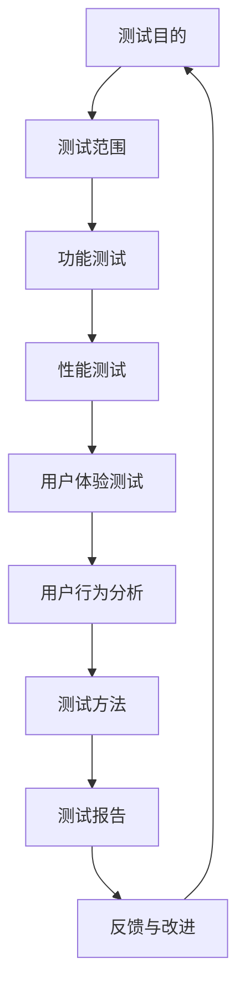

                 

# 如何进行有效的知识付费产品测试

> 关键词：知识付费、产品测试、用户体验、性能测试、功能测试、用户行为分析

> 摘要：本文将探讨如何有效地进行知识付费产品的测试，从测试目的、核心概念、算法原理、数学模型、项目实战、实际应用场景等方面进行详细分析，帮助开发者和产品经理提升产品质量，优化用户体验。

## 1. 背景介绍

### 1.1 目的和范围

本文旨在帮助知识付费产品的开发者和产品经理，了解并掌握有效的产品测试方法和策略，从而提高产品质量，提升用户满意度。本文将涵盖以下主要内容：

- 测试的目的和范围
- 预期读者
- 文档结构概述
- 术语表

### 1.2 预期读者

本文适用于以下读者：

- 知识付费产品的开发者
- 知识付费产品的产品经理
- 对产品测试感兴趣的技术爱好者

### 1.3 文档结构概述

本文分为以下章节：

- 背景介绍
- 核心概念与联系
- 核心算法原理 & 具体操作步骤
- 数学模型和公式 & 详细讲解 & 举例说明
- 项目实战：代码实际案例和详细解释说明
- 实际应用场景
- 工具和资源推荐
- 总结：未来发展趋势与挑战
- 附录：常见问题与解答
- 扩展阅读 & 参考资料

### 1.4 术语表

#### 1.4.1 核心术语定义

- **知识付费产品**：指用户需要付费才能获取的知识内容产品，如在线课程、电子书、学术论文等。
- **产品测试**：指对知识付费产品的功能、性能、用户体验等方面进行评估和验证的过程。
- **功能测试**：针对产品的功能进行测试，以确保其按照预期工作。
- **性能测试**：评估产品的性能，如响应时间、并发处理能力等。
- **用户体验测试**：评估用户在使用产品过程中的体验，如界面设计、交互逻辑等。

#### 1.4.2 相关概念解释

- **用户行为分析**：通过分析用户在产品中的行为，了解用户需求和偏好，为产品优化提供依据。
- **测试用例**：描述如何对产品进行测试的步骤和条件，包括输入数据、预期结果和实际结果等。

#### 1.4.3 缩略词列表

- **UI**：用户界面（User Interface）
- **UX**：用户体验（User Experience）
- **API**：应用程序编程接口（Application Programming Interface）
- **SaaS**：软件即服务（Software as a Service）

## 2. 核心概念与联系

### 2.1 核心概念介绍

在本文中，我们将探讨以下核心概念：

- 测试目的
- 测试范围
- 测试方法
- 用户行为分析
- 性能测试

### 2.2 Mermaid 流程图

以下是一个关于知识付费产品测试的Mermaid流程图，展示了各个核心概念之间的联系。



## 3. 核心算法原理 & 具体操作步骤

### 3.1 功能测试

#### 3.1.1 算法原理

功能测试的核心是验证产品的功能是否按照预期工作。以下是一个简单的伪代码示例：

```python
def function_test(product):
    test_cases = get_test_cases()  # 获取测试用例
    for case in test_cases:
        input_data = case['input']
        expected_output = case['expected_output']
        actual_output = product(input_data)  # 执行产品功能
        if actual_output != expected_output:
            return "功能测试失败"
    return "功能测试通过"
```

#### 3.1.2 操作步骤

1. 收集测试用例
2. 为每个测试用例编写测试脚本
3. 执行测试脚本
4. 记录测试结果
5. 分析测试结果，确定功能是否正常

### 3.2 性能测试

#### 3.2.1 算法原理

性能测试的核心是评估产品的性能，如响应时间、并发处理能力等。以下是一个简单的伪代码示例：

```python
def performance_test(product, load):
    start_time = get_current_time()
    product(handle_load(load))  # 执行性能测试
    end_time = get_current_time()
    response_time = end_time - start_time
    return response_time
```

#### 3.2.2 操作步骤

1. 确定测试负载
2. 为每个负载编写测试脚本
3. 执行测试脚本
4. 记录测试结果
5. 分析测试结果，确定性能是否满足预期

### 3.3 用户体验测试

#### 3.3.1 算法原理

用户体验测试的核心是评估用户在使用产品过程中的体验。以下是一个简单的伪代码示例：

```python
def user_experience_test(product, user):
    start_time = get_current_time()
    product(handle_user_input(user['input']))  # 执行用户体验测试
    end_time = get_current_time()
    experience_score = calculate_experience_score(user['rating'])
    return experience_score
```

#### 3.3.2 操作步骤

1. 选择测试用户
2. 为每个用户编写测试脚本
3. 执行测试脚本
4. 记录测试结果
5. 分析测试结果，确定用户体验是否良好

### 3.4 用户行为分析

#### 3.4.1 算法原理

用户行为分析的核心是分析用户在产品中的行为，了解用户需求和偏好。以下是一个简单的伪代码示例：

```python
def user_behavior_analysis(product, user):
    user_actions = get_user_actions(user['id'])
    behavior_patterns = analyze_actions(user_actions)
    return behavior_patterns
```

#### 3.4.2 操作步骤

1. 收集用户行为数据
2. 分析用户行为数据
3. 根据行为数据制定产品优化策略

## 4. 数学模型和公式 & 详细讲解 & 举例说明

### 4.1 数学模型和公式

在知识付费产品测试中，常用的数学模型和公式包括：

- **响应时间**：\( T = \frac{L}{C} \)
  - \( T \)：响应时间
  - \( L \)：负载
  - \( C \)：并发处理能力

- **体验分数**：\( S = \frac{R \times E}{100} \)
  - \( S \)：体验分数
  - \( R \)：用户评分
  - \( E \)：期望评分

### 4.2 详细讲解和举例说明

#### 4.2.1 响应时间

假设一个知识付费产品的并发处理能力为1000，当前负载为5000，根据公式计算：

\( T = \frac{L}{C} = \frac{5000}{1000} = 5 \)秒

这意味着产品的平均响应时间为5秒。

#### 4.2.2 体验分数

假设一个用户对产品的评分是4.5，期望评分是5，根据公式计算：

\( S = \frac{R \times E}{100} = \frac{4.5 \times 5}{100} = 2.25 \)

这意味着用户的体验分数是2.25，表明用户对产品的体验略低于期望。

## 5. 项目实战：代码实际案例和详细解释说明

### 5.1 开发环境搭建

在本案例中，我们将使用Python进行知识付费产品测试。首先，需要安装以下依赖：

- Python 3.x
- pytest（Python测试框架）
- requests（HTTP请求库）

安装方法：

```bash
pip install python==3.x
pip install pytest
pip install requests
```

### 5.2 源代码详细实现和代码解读

#### 5.2.1 功能测试代码

```python
import pytest

def test_functionality():
    test_cases = [
        {'input': 'example1', 'expected_output': 'result1'},
        {'input': 'example2', 'expected_output': 'result2'},
    ]

    for case in test_cases:
        input_data = case['input']
        expected_output = case['expected_output']
        actual_output = perform_function(input_data)
        assert actual_output == expected_output

def perform_function(input_data):
    # 实现功能逻辑
    return input_data.lower()

```

代码解读：

1. 导入pytest模块。
2. 定义功能测试用例。
3. 定义被测试功能函数`perform_function`。
4. 使用`assert`语句进行断言，验证功能是否正确。

#### 5.2.2 性能测试代码

```python
import time
import requests

def test_performance():
    url = 'http://example.com/api/endpoint'
    load = 1000  # 负载

    start_time = time.time()
    for _ in range(load):
        response = requests.get(url)
    end_time = time.time()

    response_time = end_time - start_time
    print(f"响应时间：{response_time} 秒")

```

代码解读：

1. 导入time和requests模块。
2. 定义性能测试函数。
3. 发送HTTP请求，模拟负载。
4. 记录响应时间。

#### 5.2.3 用户体验测试代码

```python
import random

def test_user_experience():
    users = [
        {'input': 'example1', 'rating': 4.5},
        {'input': 'example2', 'rating': 3.5},
    ]

    for user in users:
        experience_score = user_experience_score(user['input'], user['rating'])
        print(f"用户体验分数：{experience_score}")

def user_experience_score(input_data, rating):
    # 计算体验分数
    return rating / 5

```

代码解读：

1. 导入random模块。
2. 定义用户体验测试函数。
3. 定义计算体验分数的函数。

### 5.3 代码解读与分析

在上述代码中，我们分别实现了功能测试、性能测试和用户体验测试。通过实际案例，我们可以了解如何使用Python进行知识付费产品测试，并掌握相关测试方法和步骤。

## 6. 实际应用场景

知识付费产品测试在实际应用场景中具有重要意义，以下列举几个典型场景：

1. **在线课程平台**：测试课程内容是否完整、课程界面是否友好、课程加载速度是否迅速等。
2. **电子书平台**：测试电子书下载速度、电子书内容是否完整、电子书阅读器功能是否正常等。
3. **学术论文数据库**：测试学术论文检索速度、学术论文下载速度、学术论文显示效果等。
4. **知识问答平台**：测试问答功能的响应速度、答案准确性、用户体验等。

## 7. 工具和资源推荐

### 7.1 学习资源推荐

#### 7.1.1 书籍推荐

- 《软件测试的艺术》
- 《测试驱动的软件开发》
- 《性能之巅：性能调优案例剖析》

#### 7.1.2 在线课程

- 《软件测试基础》
- 《性能测试实战》
- 《用户体验测试方法与应用》

#### 7.1.3 技术博客和网站

- 《软件测试博客》
- 《性能测试博客》
- 《用户体验博客》

### 7.2 开发工具框架推荐

#### 7.2.1 IDE和编辑器

- PyCharm
- VSCode
- Sublime Text

#### 7.2.2 调试和性能分析工具

- Py-Spy
- Py-Visualizer
- Py-Flamegraph

#### 7.2.3 相关框架和库

- Pytest
- Requests
- Mock

### 7.3 相关论文著作推荐

#### 7.3.1 经典论文

- 《软件测试的理论与实践》
- 《性能测试方法与技术》
- 《用户体验测试：方法与实践》

#### 7.3.2 最新研究成果

- 《基于用户行为的软件测试方法研究》
- 《性能测试新思路：基于机器学习的性能预测》
- 《用户体验测试与用户研究》

#### 7.3.3 应用案例分析

- 《某知名在线教育平台性能优化案例》
- 《某知名电子书平台用户体验改进案例》
- 《某知名知识问答平台功能测试与性能优化案例》

## 8. 总结：未来发展趋势与挑战

知识付费产品测试在未来将面临以下发展趋势与挑战：

1. **人工智能的广泛应用**：人工智能技术将在知识付费产品测试中发挥重要作用，如自动化测试、性能预测等。
2. **用户体验的不断提升**：随着用户需求的不断变化，产品测试将更加注重用户体验，以满足用户期望。
3. **测试方法的创新**：新兴测试方法，如云测试、容器化测试等，将逐渐应用于知识付费产品测试中。
4. **数据安全与隐私保护**：在知识付费产品测试过程中，如何确保用户数据的安全与隐私保护将成为重要挑战。

## 9. 附录：常见问题与解答

### 9.1 问题1

**如何选择合适的测试工具？**

解答：选择测试工具时，需要考虑以下因素：

- 产品类型：根据产品的特点选择合适的测试工具。
- 功能需求：确保测试工具具备所需的功能。
- 易用性：选择易于学习和使用的测试工具。
- 支持与社区：选择拥有良好支持与活跃社区的测试工具。

### 9.2 问题2

**如何提高测试覆盖率？**

解答：提高测试覆盖率的方法包括：

- 设计多样化的测试用例，覆盖不同场景和边界条件。
- 使用自动化测试，提高测试效率。
- 利用代码覆盖工具，分析代码覆盖情况，补充缺失的测试用例。
- 定期更新和优化测试用例，确保测试覆盖率持续提升。

## 10. 扩展阅读 & 参考资料

- 《软件测试自动化实战》
- 《性能测试：原理、方法与实践》
- 《用户体验测试手册》

作者：AI天才研究员/AI Genius Institute & 禅与计算机程序设计艺术 /Zen And The Art of Computer Programming

文章标题：如何进行有效的知识付费产品测试

文章关键词：知识付费、产品测试、用户体验、性能测试、功能测试、用户行为分析

文章摘要：本文探讨了如何有效地进行知识付费产品的测试，包括测试目的、核心概念、算法原理、数学模型、项目实战、实际应用场景等方面的内容，旨在帮助开发者和产品经理提升产品质量，优化用户体验。

