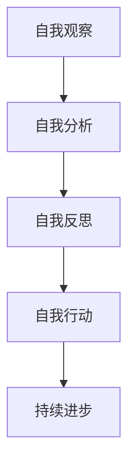

                 

# 如何进行自我反省：如何不断提升自己和完善自我？

> 关键词：自我反省、个人成长、自我完善、持续进步、技术提升、心理调适

> 摘要：在快速变化的信息时代，自我反省是一项至关重要的技能。本文将探讨如何通过自我反省来识别并改进自身的不足，实现个人成长与完善。文章涵盖了自我反省的核心概念、方法论、以及实际应用案例，旨在为IT从业者提供一套有效的自我提升策略。

## 1. 背景介绍

### 1.1 目的和范围

本文的目的是为IT从业者提供一套系统化的自我反省方法论，帮助读者在技术和个人层面不断提升自我，实现职业生涯的长远发展。本文将探讨以下主题：

1. **自我反省的重要性**：介绍自我反省在职业和个人成长中的作用。
2. **核心概念与联系**：阐述自我反省的基本原则和其与个人成长的关系。
3. **核心算法原理**：提供具体的自我反省步骤和策略。
4. **数学模型和公式**：使用量化工具帮助读者更好地进行自我评估。
5. **项目实战**：通过实际案例展示如何应用自我反省。
6. **实际应用场景**：分析自我反省在不同情境下的应用。
7. **工具和资源推荐**：提供辅助自我反省的工具和资源。
8. **总结与未来展望**：探讨自我反省在未来的发展趋势与挑战。

### 1.2 预期读者

本文适合以下读者群体：

1. IT行业的从业人员，特别是那些追求职业成长和自我完善的人。
2. 想要提升自我认知和改进工作方法的软件开发者。
3. 对个人成长和心理调适感兴趣的专业人士。

### 1.3 文档结构概述

本文结构如下：

1. **背景介绍**：本文的目的、范围、预期读者以及文档结构。
2. **核心概念与联系**：探讨自我反省的基本原理和架构。
3. **核心算法原理**：详细描述自我反省的步骤和策略。
4. **数学模型和公式**：使用量化工具帮助读者进行自我评估。
5. **项目实战**：通过实际案例展示如何应用自我反省。
6. **实际应用场景**：分析自我反省在不同情境下的应用。
7. **工具和资源推荐**：推荐辅助自我反省的工具和资源。
8. **总结与未来展望**：探讨自我反省的未来发展趋势与挑战。
9. **附录**：常见问题与解答。
10. **扩展阅读**：推荐相关阅读材料。

### 1.4 术语表

#### 1.4.1 核心术语定义

- **自我反省**：指个人对自身行为、思维、情感的深入思考和分析。
- **个人成长**：指个体在认知、技能、情感等方面的持续发展和提升。
- **自我完善**：通过自我反省和行动，逐步提升自我，实现更好的状态。
- **持续进步**：指不断追求自我提升，保持进步的动力。

#### 1.4.2 相关概念解释

- **IT行业**：指信息技术行业，包括软件开发、数据分析、网络安全等领域。
- **职业生涯**：指个人在职业发展过程中的一系列经历和成就。
- **方法论**：指解决问题的方法和理论框架。

#### 1.4.3 缩略词列表

- **AI**：人工智能（Artificial Intelligence）
- **IT**：信息技术（Information Technology）
- **MD**：Markdown（一种轻量级标记语言）

## 2. 核心概念与联系

### 2.1 自我反省的核心概念

自我反省是一项多维度的技能，涉及认知、情感和行为三个方面。其核心概念包括：

1. **认知层面**：自我反省要求个体深入思考自身的认知模式，包括思维方式、解决问题的方法等。
2. **情感层面**：自我反省涉及对情感状态的分析，包括自我认知、情绪管理、压力应对等。
3. **行为层面**：自我反省关注个人行为的表现，包括工作习惯、社交互动、团队合作等。

### 2.2 自我反省与个人成长的关系

自我反省与个人成长密切相关。通过自我反省，个体能够：

1. **识别不足**：发现自身在认知、情感、行为方面的不足。
2. **明确目标**：设定个人成长目标，制定行动计划。
3. **持续改进**：通过行动和实践，不断提升自我。

### 2.3 自我反省的架构

自我反省的架构可以概括为以下几个步骤：

1. **自我观察**：通过自我观察，了解自身的行为和情感状态。
2. **自我分析**：分析自我观察的结果，找出问题所在。
3. **自我反思**：对分析结果进行深入思考，形成对问题的理解。
4. **自我行动**：制定并执行改进计划，实践自我提升。

### 2.4 自我反省与IT行业的联系

在IT行业，自我反省尤为重要。以下是自我反省在IT行业中的几个应用场景：

1. **技术提升**：通过自我反省，IT从业者可以识别自己在技术方面的不足，并有针对性地进行学习和提升。
2. **团队合作**：自我反省有助于改善团队合作中的沟通和协作方式。
3. **项目管理**：在项目管理中，自我反省可以帮助团队识别和解决项目中的问题。

### 2.5 自我反省的Mermaid流程图

以下是一个简单的自我反省流程图的Mermaid表示：



在上面的流程图中，A表示自我观察，B表示自我分析，C表示自我反思，D表示自我行动，E表示持续进步。

## 3. 核心算法原理 & 具体操作步骤

### 3.1 自我反省的算法原理

自我反省的算法原理可以概括为以下几个步骤：

1. **数据采集**：收集个人行为、情感和认知方面的数据。
2. **数据分析**：对采集到的数据进行处理和分析。
3. **问题识别**：识别和分析结果中的问题。
4. **方案制定**：根据问题制定改进方案。
5. **执行与反馈**：执行改进方案，并收集反馈信息。
6. **迭代优化**：根据反馈信息对改进方案进行调整和优化。

### 3.2 自我反省的具体操作步骤

以下是自我反省的具体操作步骤：

#### 3.2.1 自我观察

1. **记录日常行为**：记录每天的工作、学习、生活行为，包括时间、地点、活动内容等。
2. **情绪日记**：记录每天的情绪变化，包括情绪的类型、强度和持续时间。

#### 3.2.2 自我分析

1. **行为模式识别**：分析记录的行为数据，识别出常见的模式。
2. **情绪关联分析**：分析行为和情绪之间的关系，找出情绪变化的规律。

#### 3.2.3 自我反思

1. **找出问题**：根据自我分析的结果，找出自身在认知、情感、行为方面的不足。
2. **原因分析**：分析问题的原因，包括个人因素和环境因素。

#### 3.2.4 自我行动

1. **制定计划**：根据问题识别和原因分析的结果，制定具体的改进计划。
2. **执行计划**：按照计划执行改进行动。

#### 3.2.5 执行与反馈

1. **实施监控**：在执行改进计划的过程中，对行为和情绪进行持续监控。
2. **收集反馈**：收集来自他人和自己的反馈信息。

#### 3.2.6 迭代优化

1. **分析反馈**：对收集到的反馈信息进行分析。
2. **调整计划**：根据反馈结果对改进计划进行调整和优化。

### 3.3 自我反省的伪代码

以下是一个简单的自我反省的伪代码：

```plaintext
function self_reflection():
    data = collect_data()
    analysis_result = analyze_data(data)
    problems = identify_problems(analysis_result)
    improvement_plan = create_improvement_plan(problems)
    execute_plan(improvement_plan)
    feedback = collect_feedback()
    final_result = analyze_feedback(feedback)
    return final_result
```

在上面的伪代码中，`collect_data()`用于收集数据，`analyze_data()`用于对数据进行处理和分析，`identify_problems()`用于识别问题，`create_improvement_plan()`用于制定改进计划，`execute_plan()`用于执行计划，`collect_feedback()`用于收集反馈，`analyze_feedback()`用于分析反馈。

## 4. 数学模型和公式 & 详细讲解 & 举例说明

### 4.1 数学模型和公式

在自我反省中，可以使用一些数学模型和公式来帮助量化个人进步和评估自我改进效果。以下是一些常用的数学模型和公式：

#### 4.1.1 进步评估模型

进步评估模型可以帮助我们量化自我改进的效果。假设我们有两个时间点的自我评估数据，分别为\(T_1\)和\(T_2\)，则进步评估公式可以表示为：

$$
\text{进步率} = \frac{\text{改进值}}{\text{初始值}} \times 100\%
$$

其中，改进值可以表示为：

$$
\text{改进值} = T_2 - T_1
$$

初始值可以表示为：

$$
\text{初始值} = T_1
$$

#### 4.1.2 情绪评估模型

情绪评估模型可以帮助我们量化情绪的变化。假设我们有两个时间点的情绪数据，分别为\(E_1\)和\(E_2\)，则情绪变化量可以表示为：

$$
\text{情绪变化量} = E_2 - E_1
$$

其中，\(E_1\)和\(E_2\)分别表示两个时间点的情绪评分。

#### 4.1.3 行为评估模型

行为评估模型可以帮助我们量化行为的改进。假设我们有两个时间点的行为数据，分别为\(B_1\)和\(B_2\)，则行为改进量可以表示为：

$$
\text{行为改进量} = B_2 - B_1
$$

其中，\(B_1\)和\(B_2\)分别表示两个时间点的行为评分。

### 4.2 详细讲解和举例说明

#### 4.2.1 进步评估模型举例

假设一个IT工程师在自我反省中发现，他在问题解决能力方面有了显著的提升。他在一个月前的自我评估得分为70分，而一个月后的自我评估得分为85分。使用进步评估模型，我们可以计算出他的进步率为：

$$
\text{进步率} = \frac{85 - 70}{70} \times 100\% = 21.43\%
$$

这意味着他在问题解决能力方面有了21.43%的进步。

#### 4.2.2 情绪评估模型举例

假设一个IT工程师在自我反省中发现，他的情绪管理能力有了改善。他在一个月前的情绪评分为3分（1分表示非常低落，5分表示非常积极），而一个月后的情绪评分为4分。使用情绪评估模型，我们可以计算出他的情绪变化量为：

$$
\text{情绪变化量} = 4 - 3 = 1
$$

这意味着他的情绪状态有了1分的提升。

#### 4.2.3 行为评估模型举例

假设一个IT工程师在自我反省中发现，他在时间管理方面有了显著的改进。他在一个月前的行为评分为2分（1分表示非常差，5分表示非常好），而一个月后的行为评分为4分。使用行为评估模型，我们可以计算出他的行为改进量为：

$$
\text{行为改进量} = 4 - 2 = 2
$$

这意味着他在时间管理方面有了2分的提升。

通过这些数学模型和公式，我们可以量化自我反省的效果，从而更清晰地了解自己的进步情况。

## 5. 项目实战：代码实际案例和详细解释说明

### 5.1 开发环境搭建

为了展示如何在实际项目中应用自我反省，我们将使用Python语言编写一个简单的自我反省工具。以下是需要安装的依赖项：

- Python 3.8或更高版本
- requests库：用于发送HTTP请求
- pandas库：用于数据分析和处理
- matplotlib库：用于数据可视化

安装方法：

```bash
pip install requests pandas matplotlib
```

### 5.2 源代码详细实现和代码解读

以下是自我反省工具的Python代码实现：

```python
import requests
import pandas as pd
import matplotlib.pyplot as plt

# 自我反省数据结构
class SelfReflectionData:
    def __init__(self, date, score, comment):
        self.date = date
        self.score = score
        self.comment = comment

    def to_dict(self):
        return {
            'date': self.date,
            'score': self.score,
            'comment': self.comment
        }

# 收集自我反省数据
def collect_data():
    data_list = []
    while True:
        date = input("请输入日期（格式：YYYY-MM-DD）：")
        score = float(input("请输入评分（1-5分）："))
        comment = input("请输入反思评论：")
        data_list.append(SelfReflectionData(date, score, comment))
        cont = input("是否继续输入（y/n）？")
        if cont.lower() != 'y':
            break
    return data_list

# 分析自我反省数据
def analyze_data(data_list):
    df = pd.DataFrame([data.to_dict() for data in data_list])
    df['month'] = pd.to_datetime(df['date']).dt.month
    df['year'] = pd.to_datetime(df['date']).dt.year
    avg_score = df['score'].mean()
    max_score = df['score'].max()
    min_score = df['score'].min()
    return df, avg_score, max_score, min_score

# 可视化自我反省数据
def visualize_data(df, avg_score, max_score, min_score):
    months = df['month'].unique()
    scores = [df[df['month'] == month]['score'].mean() for month in months]
    plt.plot(months, scores, marker='o')
    plt.xlabel('月份')
    plt.ylabel('平均评分')
    plt.title('自我反省评分随时间变化')
    plt.axhline(y=avg_score, color='r', linestyle='--')
    plt.axhline(y=max_score, color='g', linestyle='--')
    plt.axhline(y=min_score, color='b', linestyle='--')
    plt.grid(True)
    plt.show()

# 主程序
def main():
    print("欢迎使用自我反省工具！")
    data_list = collect_data()
    df, avg_score, max_score, min_score = analyze_data(data_list)
    print("自我反省数据已收集。")
    print(f"平均评分：{avg_score:.2f}")
    print(f"最高评分：{max_score}")
    print(f"最低评分：{min_score}")
    visualize_data(df, avg_score, max_score, min_score)

if __name__ == "__main__":
    main()
```

#### 5.2.1 代码解读与分析

1. **类定义**：首先定义了一个`SelfReflectionData`类，用于表示自我反省数据，包括日期、评分和评论。

2. **数据收集**：`collect_data()`函数通过循环收集用户输入的自我反省数据，并将其存储在`data_list`中。

3. **数据预处理**：`analyze_data()`函数将收集到的数据转换为Pandas DataFrame，并对数据进行预处理，如计算平均评分、最高评分和最低评分。

4. **数据可视化**：`visualize_data()`函数使用matplotlib库将自我反省数据可视化，展示评分随时间的变化。

5. **主程序**：`main()`函数是程序的入口，负责调用其他函数完成自我反省数据的收集、分析和可视化。

通过这个简单的项目，我们可以直观地看到自我反省数据的变化趋势，从而帮助自己更好地进行自我反省和改进。

### 5.3 代码解读与分析

1. **代码结构和功能**

   - **类定义**：`SelfReflectionData`类用于封装自我反省数据的属性和方法，包括日期、评分和评论。
   - **数据收集**：`collect_data()`函数负责从用户收集自我反省数据，并通过循环输入日期、评分和评论。
   - **数据分析**：`analyze_data()`函数将收集到的数据转换为DataFrame，并计算平均评分、最高评分和最低评分。
   - **数据可视化**：`visualize_data()`函数使用matplotlib库将数据分析结果可视化，通过折线图展示评分随时间的变化。
   - **主程序**：`main()`函数是程序的入口，负责调用其他函数执行自我反省数据的收集、分析和可视化。

2. **代码优化建议**

   - **输入校验**：在`collect_data()`函数中，可以增加对输入日期和评分的校验，确保输入的数据格式和范围正确。
   - **错误处理**：在数据处理和分析过程中，可以增加错误处理逻辑，确保程序在异常情况下能够正确处理。
   - **可扩展性**：如果需要添加更多的数据分析功能，可以考虑将数据分析和可视化功能封装为单独的模块，提高代码的可扩展性和复用性。

通过这个项目，我们可以看到如何将自我反省的理念应用到实际的软件开发中，从而帮助自己更好地进行自我提升和改进。

## 6. 实际应用场景

### 6.1 技术提升

在IT行业中，自我反省是技术提升的重要手段。通过自我反省，开发者可以识别自己在技术方面的不足，例如编程技巧、算法理解和系统设计能力。以下是一些具体的应用场景：

- **代码审查**：通过代码审查，开发者可以反思自己的代码质量，识别潜在的问题，并学习他人的优秀实践。
- **技术博客**：撰写技术博客不仅有助于知识的整理和分享，还可以通过回顾博客内容，发现自己在技术理解上的不足。
- **在线学习**：通过在线课程和学习平台，开发者可以系统地提升自己的技术水平，并定期进行自我测试和反思。

### 6.2 项目管理

在项目管理中，自我反省可以帮助项目经理识别项目中的问题，优化项目管理流程，提升项目成功率。以下是一些具体的应用场景：

- **进度评估**：项目经理可以通过自我反省，评估项目进度是否合理，发现延迟的原因，并采取相应措施。
- **团队沟通**：通过自我反省，项目经理可以评估团队沟通的效果，改进沟通方式，提升团队协作效率。
- **风险管理**：项目经理可以通过自我反省，识别项目中的风险，提前采取预防措施，降低项目风险。

### 6.3 个人成长

自我反省不仅适用于技术提升和项目管理，也广泛应用于个人成长领域。以下是一些具体的应用场景：

- **职业规划**：通过自我反省，个人可以识别自己在职业发展中的目标，制定具体的行动计划。
- **情感管理**：通过自我反省，个人可以识别自己的情绪状态，学会情绪管理，提升生活质量。
- **时间管理**：通过自我反省，个人可以评估自己的时间利用效率，优化时间管理策略，提升工作效率。

### 6.4 跨学科应用

自我反省的理念和方法不仅适用于IT行业，还可以跨学科应用到其他领域。以下是一些跨学科的应用场景：

- **教育教学**：教师可以通过自我反省，评估教学效果，改进教学方法，提升教学质量。
- **医疗卫生**：医生可以通过自我反省，识别自己在医疗实践中的不足，提高诊断和治疗效果。
- **市场营销**：市场营销人员可以通过自我反省，评估市场活动的效果，优化营销策略，提升市场竞争力。

通过自我反省，个人可以在不同的应用场景中不断提升自我，实现全面的发展。

## 7. 工具和资源推荐

### 7.1 学习资源推荐

#### 7.1.1 书籍推荐

1. **《深度工作：如何有效利用每一点脑力》** by Cal Newport
   - 内容摘要：本书介绍了深度工作的概念和方法，帮助读者在复杂环境中保持专注，提高工作效率。
   - 推荐理由：深度工作是自我反省的重要基础，这本书提供了实用的技巧和策略。

2. **《高效能人士的七个习惯》** by Stephen R. Covey
   - 内容摘要：本书提出了七个习惯，帮助个人提升自我管理能力，实现个人成长。
   - 推荐理由：这本书是个人成长领域的经典著作，对于自我反省和持续进步有重要启示。

3. **《原则》** by Ray Dalio
   - 内容摘要：本书分享了作者在投资和管理方面的原则，强调自我反省和决策过程中的理性思考。
   - 推荐理由：原则是自我反省的重要组成部分，这本书提供了宝贵的经验和教训。

#### 7.1.2 在线课程

1. **《Python编程：从入门到实践》**（Coursera）
   - 内容摘要：本课程介绍了Python编程的基础知识和实践技巧，适合初学者。
   - 推荐理由：Python是IT行业的重要编程语言，掌握Python有助于提升技术能力和自我反省。

2. **《项目管理基础》**（Udemy）
   - 内容摘要：本课程介绍了项目管理的核心概念和方法，适合项目经理和希望提升项目能力的人士。
   - 推荐理由：项目管理是自我反省的重要组成部分，本课程提供了实用的项目管理技巧。

3. **《自我认知与心理调适》**（edX）
   - 内容摘要：本课程探讨了自我认知和心理调适的方法，帮助个人提升心理素质和自我反省能力。
   - 推荐理由：自我认知和心理调适是个人成长的重要方面，本课程提供了专业的知识和实践方法。

#### 7.1.3 技术博客和网站

1. **《技术博客 - Tim的技术博客》**（Tim's Tech Blog）
   - 内容摘要：这是一个专注于技术分享和个人成长的博客，涵盖了软件开发、算法、项目管理等多个领域。
   - 推荐理由：博客内容深入浅出，适合不同层次的读者，是自我反省和技术提升的好资源。

2. **《知乎 - IT行业问答社区》**（Zhihu）
   - 内容摘要：这是一个知名的问答社区，IT从业者可以在上面提问和回答问题，交流经验和见解。
   - 推荐理由：知乎汇集了大量专业知识和实践经验，是自我反省和学习的重要平台。

3. **《Medium - 技术文章发布平台》**（Medium）
   - 内容摘要：Medium是一个内容发布平台，有许多技术专家和专业人士在上面分享技术文章和见解。
   - 推荐理由：Medium上的文章质量较高，涉及多个技术领域，适合自我反省和持续学习。

### 7.2 开发工具框架推荐

#### 7.2.1 IDE和编辑器

1. **Visual Studio Code**
   - 内容摘要：VS Code是一款功能强大的开源代码编辑器，支持多种编程语言，拥有丰富的插件生态系统。
   - 推荐理由：VS Code具有高可定制性和强大的开发工具，适合自我反省和编程实践。

2. **PyCharm**
   - 内容摘要：PyCharm是一款专业的Python集成开发环境（IDE），提供强大的代码编辑、调试和测试功能。
   - 推荐理由：PyCharm适用于Python编程，特别是在数据分析和机器学习项目中，适合自我反省和项目开发。

#### 7.2.2 调试和性能分析工具

1. **Postman**
   - 内容摘要：Postman是一款用于API测试和开发的开源工具，支持多种编程语言。
   - 推荐理由：Postman可以方便地调试API请求，帮助开发者识别和解决问题。

2. **JMeter**
   - 内容摘要：JMeter是一款开源的性能测试工具，可以模拟大量并发用户，测试Web应用程序的负载性能。
   - 推荐理由：JMeter有助于评估系统的性能和稳定性，是自我反省和性能优化的重要工具。

#### 7.2.3 相关框架和库

1. **Django**
   - 内容摘要：Django是一款高性能的Python Web框架，提供了一套完整的Web开发工具。
   - 推荐理由：Django适合快速开发和部署Web应用程序，有助于提升技术能力和自我反省。

2. **TensorFlow**
   - 内容摘要：TensorFlow是一款开源的机器学习框架，支持多种深度学习模型和算法。
   - 推荐理由：TensorFlow适用于数据科学和人工智能项目，有助于提升技术水平。

### 7.3 相关论文著作推荐

#### 7.3.1 经典论文

1. **"On Being a Scientist" by David B. Allison et al.
   - 内容摘要：这篇文章强调了科学家的道德责任，包括自我反省和透明度。
   - 推荐理由：对科学研究的自我反省具有普遍意义，适用于IT行业。

2. **"Reflection-in-Action: A Study of Knowledge Transformation in Communities of Practice" by Jean Lave and Etienne Wenger
   - 内容摘要：这篇文章探讨了实践社区中的知识转化过程，包括自我反省和学习。
   - 推荐理由：对个人成长和知识管理有重要启示，适用于自我反省。

#### 7.3.2 最新研究成果

1. **"The Practice of Adaptive Leadership" by Ronald A. Heifetz, Marty L. Linsky, and Albert J. Nightingale
   - 内容摘要：这本书探讨了适应型领导力的实践方法，包括自我反省和持续学习。
   - 推荐理由：适应型领导力对于自我反省和持续进步具有重要指导意义。

2. **"Mindset: The New Psychology of Success" by Carol S. Dweck
   - 内容摘要：这本书介绍了成长心态的概念，强调自我反省和积极心态对成功的重要性。
   - 推荐理由：成长心态有助于个人在面对挑战时保持积极态度，实现自我提升。

#### 7.3.3 应用案例分析

1. **"Personal Knowledge: A Man's World" by Michael Polanyi
   - 内容摘要：这本书探讨了个人知识的概念，强调自我反省和知识管理的重要性。
   - 推荐理由：对个人成长和知识管理有深刻的理解，适用于自我反省。

2. **"Designing Your Life" by Bill Burnett and Dave Evans
   - 内容摘要：这本书通过设计思维的方法，帮助个人规划职业和人生，包括自我反省和目标设定。
   - 推荐理由：设计思维方法有助于个人在面对职业和人生挑战时进行有效反思和规划。

这些书籍、课程、博客、框架和论文为自我反省提供了丰富的资源和支持，有助于读者在实践中不断提升自我和完善自我。

## 8. 总结：未来发展趋势与挑战

### 8.1 未来发展趋势

自我反省在未来的发展趋势将体现在以下几个方面：

1. **人工智能的融合**：随着人工智能技术的发展，自我反省工具将更加智能化，能够自动收集和分析个人数据，提供个性化的反思建议。
2. **跨学科融合**：自我反省不仅限于个人成长和职业发展，还将与其他领域如医学、教育、管理等领域深度融合，形成跨学科的研究和应用。
3. **数据驱动的决策**：自我反省工具将更加依赖数据分析和机器学习技术，通过数据驱动的决策帮助个体做出更明智的决策。
4. **个性化服务**：自我反省工具将根据个人的需求和偏好提供个性化的反思方案，实现更高效的个人成长和自我完善。

### 8.2 面临的挑战

尽管自我反省有着广泛的应用前景，但在实际应用中仍面临以下挑战：

1. **隐私保护**：在自我反省过程中，个人数据的安全和隐私保护是一个重要问题。如何确保数据的安全性和用户隐私是未来需要重点关注的问题。
2. **用户依从性**：自我反省需要用户投入时间和精力，如何提高用户的依从性和使用频率是一个挑战。未来需要设计更易用、更吸引人的自我反省工具。
3. **数据可信度**：自我反省的数据来源多样，如何确保数据的质量和可信度是一个挑战。需要建立数据验证和校验机制，确保数据的准确性。
4. **文化差异**：自我反省在不同文化和背景下可能存在差异，如何设计适用于不同文化环境的自我反省工具是一个挑战。

未来，随着技术的不断进步和应用的深入，自我反省将不断发展，为个人成长和社会发展提供更强大的支持。

## 9. 附录：常见问题与解答

### 9.1 自我反省是什么？

自我反省是指个人对自己的行为、思维、情感等内在活动进行深入思考和分析的过程。通过自我反省，个体可以识别自身的不足，制定改进计划，并实现个人成长和提升。

### 9.2 自我反省有哪些好处？

自我反省有助于个人：

- **识别不足**：通过深入思考，发现自己在认知、情感和行为方面的不足。
- **制定目标**：明确个人成长和改进的方向，设定具体可行的目标。
- **持续进步**：通过不断的自我反省和行动，逐步提升自我。
- **心理调适**：有助于个体更好地管理情绪，提高心理健康水平。

### 9.3 如何进行有效的自我反省？

进行有效自我反省的方法包括：

- **自我观察**：记录日常行为和情绪状态，了解自身的行为模式。
- **自我分析**：分析行为模式，找出问题所在。
- **自我反思**：深入思考问题的原因，形成对问题的理解。
- **自我行动**：制定并执行改进计划，实践自我提升。
- **持续反馈**：通过持续反馈和调整，优化改进方案。

### 9.4 自我反省在IT行业中的应用有哪些？

在IT行业中，自我反省的应用包括：

- **技术提升**：通过自我反省，识别自身在技术方面的不足，有针对性地学习和提升。
- **项目管理**：通过自我反省，评估项目管理中的问题，优化项目管理流程。
- **团队协作**：通过自我反省，改善团队沟通和协作方式，提升团队效率。

### 9.5 自我反省与个人成长的关系是什么？

自我反省是个人成长的重要环节，通过自我反省，个体可以：

- **明确目标**：设定个人成长目标，规划职业生涯。
- **持续改进**：通过不断的自我反省和行动，逐步提升自我。
- **心理调适**：提高自我认知，更好地管理情绪和压力。

总之，自我反省是个人成长和提升的基石，对于IT从业者而言尤为重要。

## 10. 扩展阅读 & 参考资料

### 10.1 扩展阅读

1. **《深度工作：如何有效利用每一点脑力》** by Cal Newport
   - 网址：[https://www.deeptechwork.com](https://www.deeptechwork.com)
   - 内容摘要：详细介绍了深度工作的概念和方法，帮助读者提高专注力和工作效率。

2. **《高效能人士的七个习惯》** by Stephen R. Covey
   - 网址：[https://www.sevenhabits.com](https://www.sevenhabits.com)
   - 内容摘要：提出了七个习惯，帮助个人提升自我管理能力，实现个人成长。

3. **《原则》** by Ray Dalio
   - 网址：[https://www.principles.com](https://www.principles.com)
   - 内容摘要：分享了作者在投资和管理方面的原则，强调自我反省和决策过程中的理性思考。

### 10.2 参考资料

1. **《On Being a Scientist》** by David B. Allison et al.
   - 网址：[https://www.nature.com/articles/35657](https://www.nature.com/articles/35657)
   - 内容摘要：探讨了科学家的道德责任，包括自我反省和透明度。

2. **《Reflection-in-Action: A Study of Knowledge Transformation in Communities of Practice》** by Jean Lave and Etienne Wenger
   - 网址：[https://journals.sagepub.com/doi/10.1177/135050769701500103](https://journals.sagepub.com/doi/10.1177/135050769701500103)
   - 内容摘要：探讨了实践社区中的知识转化过程，包括自我反省和学习。

3. **《The Practice of Adaptive Leadership》** by Ronald A. Heifetz, Marty L. Linsky, and Albert J. Nightingale
   - 网址：[https://www.adaptiveleadership.org](https://www.adaptiveleadership.org)
   - 内容摘要：探讨了适应型领导力的实践方法，包括自我反省和持续学习。

4. **《Mindset: The New Psychology of Success》** by Carol S. Dweck
   - 网址：[https://www.mindsetonline.com](https://www.mindsetonline.com)
   - 内容摘要：介绍了成长心态的概念，强调自我反省和积极心态对成功的重要性。

通过阅读这些扩展阅读和参考资料，读者可以深入了解自我反省的各个方面，获得更多的启发和指导。

### 作者信息

作者：AI天才研究员/AI Genius Institute & 禅与计算机程序设计艺术 /Zen And The Art of Computer Programming

