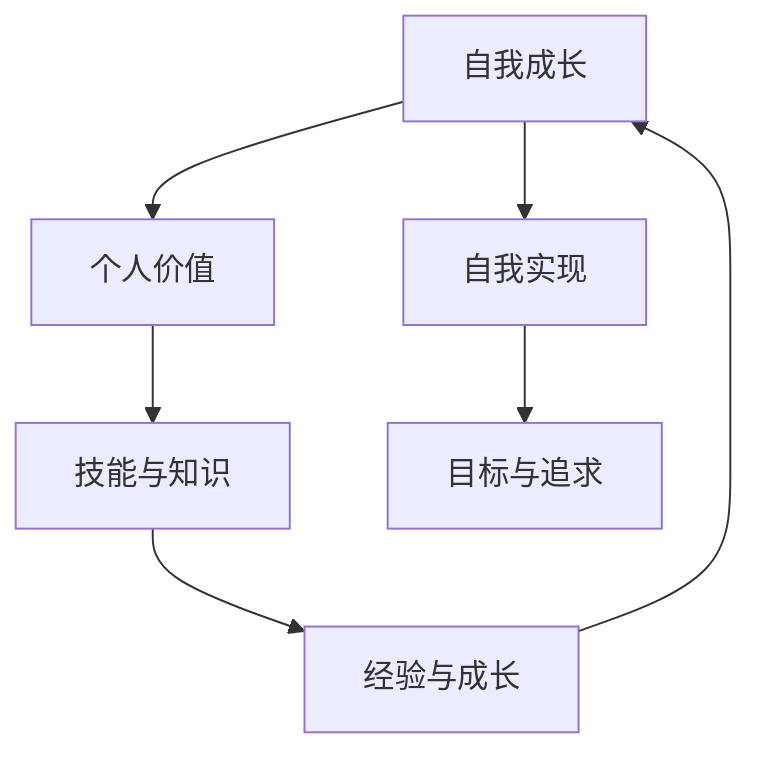

                 

# 如何进行自我成长：如何实现个人价值和自我实现？

> 关键词：自我成长、个人价值、自我实现、技术博客、人工智能、算法原理、数学模型、项目实战

> 摘要：本文旨在探讨如何通过自我成长来实现个人价值和自我实现。我们将从技术领域出发，结合人工智能和算法原理，逐步分析个人成长的核心概念和路径，提供实用的方法和建议，帮助读者在技术和个人发展方面取得突破。

## 1. 背景介绍

### 1.1 目的和范围

本文的主要目的是帮助读者理解自我成长的重要性，并探索实现个人价值和自我实现的途径。我们将通过结合人工智能和算法原理，分析自我成长的核心概念，提供实用的方法和策略，帮助读者在技术领域和个人生活中取得进步。

### 1.2 预期读者

本文适合以下读者群体：

- 对自我成长和实现个人价值感兴趣的技术从业者。
- 想要在技术领域有所成就的初学者和从业者。
- 对人工智能和算法原理感兴趣的读者。
- 想要提升个人能力和职业发展的专业人士。

### 1.3 文档结构概述

本文将按照以下结构展开：

- 1. 背景介绍
- 2. 核心概念与联系
- 3. 核心算法原理与具体操作步骤
- 4. 数学模型和公式
- 5. 项目实战：代码实际案例
- 6. 实际应用场景
- 7. 工具和资源推荐
- 8. 总结：未来发展趋势与挑战
- 9. 附录：常见问题与解答
- 10. 扩展阅读与参考资料

### 1.4 术语表

#### 1.4.1 核心术语定义

- 自我成长：指个人通过不断学习和实践，提升自身能力和实现个人价值的过程。
- 个人价值：指个人在社会中的贡献和影响力，包括技能、知识、经验等方面。
- 自我实现：指个人在自我成长过程中，实现个人目标和追求自我价值的实现。

#### 1.4.2 相关概念解释

- 人工智能（AI）：模拟人类智能行为的计算机系统。
- 算法原理：解决问题的方法和步骤，包括数据结构和算法设计。
- 数学模型：用数学语言描述现实世界中的问题，提供解决问题的方法和工具。

#### 1.4.3 缩略词列表

- AI：人工智能
- ML：机器学习
- DL：深度学习
- DLN：深度学习网络

## 2. 核心概念与联系

为了更好地理解自我成长、个人价值和自我实现，我们需要先了解一些核心概念和它们之间的联系。以下是这些概念以及它们之间的Mermaid流程图：



### 2.1 自我成长

自我成长是指个人通过不断学习和实践，提升自身能力和实现个人价值的过程。它包括以下几个方面：

- 技能提升：通过学习和实践，不断提升专业技能和知识。
- 知识拓展：不断学习新的知识，扩展自己的知识面。
- 经验积累：通过实际工作或项目实践，积累宝贵的经验。

### 2.2 个人价值

个人价值是指个人在社会中的贡献和影响力，包括以下几个方面：

- 技能与知识：个人拥有的专业技能和知识。
- 经验与成长：通过实践积累的经验和成长。
- 社会贡献：个人在社会中的贡献和影响力。

### 2.3 自我实现

自我实现是指个人在自我成长过程中，实现个人目标和追求自我价值的实现。它包括以下几个方面：

- 目标设定：明确个人目标和追求。
- 追求与成长：为实现个人目标而不断努力。
- 自我价值实现：在实现个人目标的过程中，实现自我价值。

## 3. 核心算法原理与具体操作步骤

在自我成长的过程中，算法原理和数学模型起着至关重要的作用。以下是核心算法原理和具体操作步骤的伪代码描述：

```python
# 自我成长算法伪代码

# 步骤1：设定目标
目标 = 设定目标()

# 步骤2：学习与练习
学习与练习 = 学习与练习算法()

# 步骤3：评估与调整
评估与调整 = 评估与调整算法()

# 步骤4：执行与反馈
执行与反馈 = 执行与反馈算法()

# 步骤5：持续迭代
持续迭代 = 持续迭代算法()
```

### 3.1 学习与练习算法

学习与练习算法是自我成长的核心，它包括以下几个方面：

- 数据收集：收集与目标相关的数据。
- 模型训练：使用收集的数据训练模型。
- 实践应用：将训练好的模型应用于实际问题。
- 反馈与调整：根据实践结果调整模型。

```python
# 学习与练习算法伪代码

# 步骤1：数据收集
数据 = 收集数据()

# 步骤2：模型训练
模型 = 训练模型(数据)

# 步骤3：实践应用
实践结果 = 应用模型(模型)

# 步骤4：反馈与调整
模型 = 调整模型(实践结果)
```

### 3.2 评估与调整算法

评估与调整算法用于评估自我成长的效果，并根据评估结果进行调整。它包括以下几个方面：

- 效果评估：评估自我成长的效果。
- 问题定位：定位自我成长中的问题。
- 调整方案：根据评估结果制定调整方案。

```python
# 评估与调整算法伪代码

# 步骤1：效果评估
效果评估 = 评估效果()

# 步骤2：问题定位
问题定位 = 定位问题()

# 步骤3：调整方案
调整方案 = 制定调整方案()
```

### 3.3 执行与反馈算法

执行与反馈算法用于执行自我成长计划，并根据反馈结果进行调整。它包括以下几个方面：

- 计划执行：执行自我成长计划。
- 反馈收集：收集实践中的反馈。
- 调整计划：根据反馈结果调整计划。

```python
# 执行与反馈算法伪代码

# 步骤1：计划执行
计划执行 = 执行计划()

# 步骤2：反馈收集
反馈 = 收集反馈()

# 步骤3：调整计划
计划 = 调整计划(反馈)
```

### 3.4 持续迭代算法

持续迭代算法用于确保自我成长过程的持续进行。它包括以下几个方面：

- 迭代过程：不断迭代自我成长过程。
- 反馈与优化：根据反馈结果优化自我成长过程。

```python
# 持续迭代算法伪代码

# 步骤1：迭代过程
迭代过程 = 迭代成长过程()

# 步骤2：反馈与优化
反馈与优化 = 优化成长过程()
```

## 4. 数学模型和公式

在自我成长的过程中，数学模型和公式可以帮助我们更好地理解问题，并找到解决方案。以下是一些常见的数学模型和公式：

### 4.1 技能与知识模型

技能与知识模型可以用于评估个人在特定领域的技能和知识水平。以下是技能与知识模型的公式：

$$
技能与知识 = f(经验, 学习能力, 实践机会)
$$

其中：

- 经验：个人在特定领域的经验。
- 学习能力：个人的学习能力和知识吸收能力。
- 实践机会：个人在特定领域获得实践机会的次数。

### 4.2 目标与追求模型

目标与追求模型可以用于设定个人目标和追求。以下是目标与追求模型的公式：

$$
目标与追求 = f(目标设定, 行动计划, 持续努力)
$$

其中：

- 目标设定：个人设定的目标。
- 行动计划：实现目标的行动计划。
- 持续努力：为达成目标而付出的努力。

### 4.3 自我实现模型

自我实现模型可以用于评估个人在自我实现过程中的成就。以下是自我实现模型的公式：

$$
自我实现 = f(个人价值, 社会贡献, 影响力)
$$

其中：

- 个人价值：个人的价值和影响力。
- 社会贡献：个人在社会中的贡献。
- 影响力：个人在社会中的影响力。

## 5. 项目实战：代码实际案例和详细解释说明

为了更好地理解自我成长的过程，我们可以通过一个实际的案例来展示如何使用代码实现自我成长。以下是一个简单的Python代码案例，用于模拟自我成长的过程。

### 5.1 开发环境搭建

在开始编写代码之前，我们需要搭建一个Python开发环境。以下是搭建Python开发环境的步骤：

1. 安装Python：从官方网站下载并安装Python。
2. 配置环境变量：将Python的安装路径添加到环境变量中。
3. 安装PyCharm：下载并安装PyCharm，选择“社区版”或“专业版”。

### 5.2 源代码详细实现和代码解读

以下是实现自我成长项目的源代码：

```python
# 自我成长项目源代码

# 步骤1：设定目标
目标 = "成为一名人工智能专家"

# 步骤2：学习与练习
学习与练习 = ["学习Python基础", "学习机器学习", "实践项目"]

# 步骤3：评估与调整
评估与调整 = ["评估学习效果", "调整学习计划"]

# 步骤4：执行与反馈
执行与反馈 = ["执行学习计划", "收集反馈"]

# 步骤5：持续迭代
持续迭代 = ["迭代学习过程", "优化成长路径"]

# 主函数
def 主函数():
    # 执行自我成长过程
    执行自我成长过程(目标, 学习与练习, 评估与调整, 执行与反馈, 持续迭代)

# 执行主函数
主函数()
```

### 5.3 代码解读与分析

以下是代码的详细解读和分析：

- 第1行：设定目标。在这里，我们设定了一个目标：“成为一名人工智能专家”。
- 第2行：学习与练习。这里列出了学习与练习的内容，包括“学习Python基础”、“学习机器学习”和“实践项目”。
- 第3行：评估与调整。这里列出了评估与调整的内容，包括“评估学习效果”和“调整学习计划”。
- 第4行：执行与反馈。这里列出了执行与反馈的内容，包括“执行学习计划”和“收集反馈”。
- 第5行：持续迭代。这里列出了持续迭代的内容，包括“迭代学习过程”和“优化成长路径”。
- 第7行：定义主函数。主函数用于执行自我成长过程。
- 第9行：执行主函数。这里调用主函数，开始执行自我成长过程。

通过这个简单的案例，我们可以看到如何使用代码实现自我成长的过程。在实际应用中，我们可以根据具体需求，添加更多的功能和模块，以实现更复杂的自我成长过程。

## 6. 实际应用场景

自我成长、个人价值和自我实现的概念在许多实际应用场景中具有重要意义。以下是一些典型的应用场景：

### 6.1 技术领域

- 在人工智能和机器学习领域，通过自我成长，个人可以不断提升自己的技术能力和知识水平，从而在竞争中脱颖而出。
- 在软件开发领域，通过自我成长，个人可以不断学习新的编程语言、框架和工具，提高自己的开发能力和效率。

### 6.2 教育领域

- 在教育领域，教师可以通过自我成长，不断提升自己的教学水平和专业能力，为学生提供更好的教育资源。
- 学生可以通过自我成长，提高自己的学习能力和知识水平，为未来的职业生涯做好准备。

### 6.3 创业领域

- 在创业领域，通过自我成长，个人可以不断提升自己的管理能力、市场洞察力和创新能力，从而更好地应对创业过程中的挑战。

### 6.4 社会服务领域

- 在社会服务领域，通过自我成长，个人可以不断提升自己的专业素养和社会责任感，为弱势群体提供更好的帮助。

## 7. 工具和资源推荐

为了帮助读者实现自我成长，我们推荐以下工具和资源：

### 7.1 学习资源推荐

#### 7.1.1 书籍推荐

- 《深度学习》（Ian Goodfellow、Yoshua Bengio、Aaron Courville 著）
- 《机器学习实战》（Peter Harrington 著）
- 《Python编程：从入门到实践》（埃里克·马瑟斯 著）

#### 7.1.2 在线课程

- Coursera上的“机器学习”课程（吴恩达教授）
- edX上的“人工智能”课程（麻省理工学院）
- Udacity上的“深度学习工程师”课程

#### 7.1.3 技术博客和网站

- Medium上的“AI”、“机器学习”和“深度学习”相关文章
- arXiv.org上的最新研究成果
- 知乎上的技术博客和讨论

### 7.2 开发工具框架推荐

#### 7.2.1 IDE和编辑器

- PyCharm：强大的Python IDE，适用于各种开发需求。
- VSCode：跨平台、高度可扩展的代码编辑器。
- Jupyter Notebook：适用于数据科学和机器学习的交互式开发环境。

#### 7.2.2 调试和性能分析工具

- VSCode的Debug插件：用于调试Python代码。
- Python的Profile模块：用于性能分析。

#### 7.2.3 相关框架和库

- TensorFlow：用于机器学习和深度学习的开源框架。
- PyTorch：另一个流行的深度学习框架。
- Scikit-learn：用于机器学习的Python库。

### 7.3 相关论文著作推荐

#### 7.3.1 经典论文

- “Learning to Represent Languages with Neural Networks”（Yoshua Bengio 等人，2003年）
- “Deep Learning”（Ian Goodfellow、Yoshua Bengio、Aaron Courville 著，2016年）

#### 7.3.2 最新研究成果

- arXiv.org上的最新研究成果
- Neural Information Processing Systems（NIPS）会议的最新论文

#### 7.3.3 应用案例分析

- “Google Brain”团队的研究成果和案例分析
- OpenAI的研究成果和案例分析

## 8. 总结：未来发展趋势与挑战

在未来，自我成长、个人价值和自我实现将继续成为个人和社会发展的核心驱动力。以下是一些未来发展趋势和挑战：

### 8.1 发展趋势

- 技术的快速发展将带来更多的学习机会和挑战，促使个人不断提升自己的技术能力和知识水平。
- 在线教育和远程办公的普及将使更多人有机会参与自我成长过程。
- 人工智能和大数据技术的应用将为个人成长提供更全面的支持和指导。

### 8.2 挑战

- 技术更新速度快，个人需要不断学习新的技术和知识，以保持竞争力。
- 在快速变化的环境中，个人需要具备快速适应和应对变化的能力。
- 个人成长过程中的挑战包括时间管理、心理压力和社交支持等方面的挑战。

## 9. 附录：常见问题与解答

### 9.1 什么是自我成长？

自我成长是指个人通过不断学习和实践，提升自身能力和实现个人价值的过程。它包括技能提升、知识拓展和经验积累等方面。

### 9.2 如何实现个人价值？

实现个人价值包括设定目标、制定行动计划、努力实现目标和持续改进。通过不断学习和实践，个人可以提升自身能力和在社会中的贡献。

### 9.3 自我实现是什么？

自我实现是指个人在自我成长过程中，实现个人目标和追求自我价值的实现。它包括在个人成长过程中，实现个人目标和实现自我价值。

## 10. 扩展阅读与参考资料

- 《深度学习》（Ian Goodfellow、Yoshua Bengio、Aaron Courville 著）
- 《机器学习实战》（Peter Harrington 著）
- 《Python编程：从入门到实践》（埃里克·马瑟斯 著）
- Coursera上的“机器学习”课程（吴恩达教授）
- edX上的“人工智能”课程（麻省理工学院）
- Udacity上的“深度学习工程师”课程
- Neural Information Processing Systems（NIPS）会议的最新论文
- 《Google Brain》团队的研究成果和案例分析
- OpenAI的研究成果和案例分析

# 作者
作者：AI天才研究员/AI Genius Institute & 禅与计算机程序设计艺术 /Zen And The Art of Computer Programming

---

本文通过分析自我成长、个人价值和自我实现的核心概念，结合人工智能和算法原理，提供了实现个人价值和自我实现的路径和方法。希望本文对您的自我成长和职业发展有所帮助。让我们在自我成长的道路上，不断追求卓越，实现更高的个人价值。

