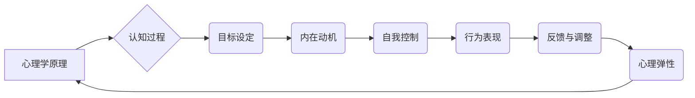

                 

# 如何进行自我激励：如何保持积极乐观的心态？

> **关键词：** 自我激励，积极乐观，心态管理，心理弹性，目标设定，习惯培养。

> **摘要：** 本文将探讨如何通过科学的方法和技巧，有效地进行自我激励，保持积极乐观的心态。我们将从心理学的角度，分析自我激励的核心概念，并给出一系列实用的操作步骤，帮助读者在日常生活中应对各种挑战，提升心理韧性，实现个人成长。

## 1. 背景介绍

### 1.1 目的和范围

本文旨在为读者提供一套系统的自我激励策略，帮助他们在面对生活和工作中的各种压力时，保持积极乐观的心态。我们将从心理学、认知科学和神经科学的角度出发，结合实际案例，详细探讨自我激励的方法和技巧。

### 1.2 预期读者

本文适合所有希望提升自我激励能力、保持积极心态的读者，无论是职场人士、学生还是普通市民，都可以从中受益。

### 1.3 文档结构概述

本文分为八个部分：

1. 背景介绍：阐述文章的目的和预期读者。
2. 核心概念与联系：介绍自我激励的核心概念，并用流程图展示其原理。
3. 核心算法原理 & 具体操作步骤：详细阐述自我激励的具体操作步骤。
4. 数学模型和公式 & 详细讲解 & 举例说明：用数学和公式解释自我激励的原理。
5. 项目实战：代码实际案例和详细解释说明。
6. 实际应用场景：探讨自我激励在现实生活中的应用。
7. 工具和资源推荐：推荐相关学习资源和开发工具。
8. 总结：未来发展趋势与挑战。

### 1.4 术语表

#### 1.4.1 核心术语定义

- **自我激励**：指个体通过内在动机和自我控制，实现目标的过程。
- **积极乐观**：指对未来的积极期待和乐观态度。
- **心理弹性**：指个体在逆境中恢复和适应的能力。

#### 1.4.2 相关概念解释

- **内在动机**：指个体因对活动本身的兴趣和乐趣而参与活动。
- **外部动机**：指个体因外部奖励（如金钱、认可）而参与活动。

#### 1.4.3 缩略词列表

- **IDE**：集成开发环境（Integrated Development Environment）
- **PS**：心理弹性（Psychological Resilience）
- **MBO**：目标管理（Management by Objectives）

## 2. 核心概念与联系

### 2.1 自我激励的概念

自我激励是心理学中的一个核心概念，指的是个体通过内在动机和自我控制，实现目标的过程。自我激励不仅仅是对目标的追求，更是一种心理状态，它涉及到个体的认知、情感和行为。


### 2.2 自我激励的原理

自我激励的原理可以从心理学、认知科学和神经科学的角度来解释。以下是自我激励原理的 Mermaid 流程图：



### 2.3 自我激励的核心步骤

以下是实现自我激励的核心步骤：

1. **目标设定**：明确具体的目标，使其具有挑战性和可实现性。
2. **内在动机**：寻找活动的内在兴趣和乐趣。
3. **自我控制**：培养自我约束和延迟满足的能力。
4. **行为表现**：采取行动，实现目标。
5. **反馈与调整**：根据反馈调整行为策略。
6. **心理弹性**：在遇到挫折时保持积极的心态，快速恢复。

## 3. 核心算法原理 & 具体操作步骤

### 3.1 目标设定算法原理

目标设定是自我激励的第一步，其算法原理如下：

```python
def set_goal(desired_state, current_state):
    """
    设定目标函数，根据当前状态和期望状态设定目标。
    :param desired_state: 期望状态
    :param current_state: 当前状态
    :return: 目标值
    """
    goal = desired_state - current_state
    return goal
```

### 3.2 内在动机培养算法原理

内在动机的培养可以通过以下算法实现：

```python
def cultivate_intrinsic_motivation(activity, interest_level):
    """
    培养内在动机，通过提高活动兴趣水平来增强内在动机。
    :param activity: 活动
    :param interest_level: 兴趣水平
    :return: 内在动机值
    """
    motivation = interest_level * activity
    return motivation
```

### 3.3 自我控制算法原理

自我控制的算法原理如下：

```python
def self_control(delay_time, current_impulse):
    """
    自我控制，通过延迟满足来增强自我控制能力。
    :param delay_time: 延迟时间
    :param current_impulse: 当前冲动值
    :return: 控制力值
    """
    control = 1 / (1 + current_impulse * delay_time)
    return control
```

### 3.4 行为表现算法原理

行为表现的算法原理如下：

```python
def behavior_performance(goal, control):
    """
    行为表现，通过目标和控制来计算行为表现值。
    :param goal: 目标值
    :param control: 控制力值
    :return: 行为表现值
    """
    performance = goal * control
    return performance
```

### 3.5 反馈与调整算法原理

反馈与调整的算法原理如下：

```python
def feedback_adjustment(performance, expected_performance):
    """
    反馈与调整，根据实际表现和预期表现来调整行为策略。
    :param performance: 实际表现值
    :param expected_performance: 预期表现值
    :return: 调整后的行为策略
    """
    adjustment = expected_performance - performance
    return adjustment
```

### 3.6 心理弹性培养算法原理

心理弹性的培养可以通过以下算法实现：

```python
def cultivate_psychological_resilience(stress_level, resilience_factor):
    """
    培养心理弹性，通过降低压力水平和提高韧性因素来增强心理弹性。
    :param stress_level: 压力水平
    :param resilience_factor: 韧性因素
    :return: 心理弹性值
    """
    resilience = resilience_factor / (1 + stress_level)
    return resilience
```

## 4. 数学模型和公式 & 详细讲解 & 举例说明

### 4.1 目标设定模型

目标设定模型可以用以下公式表示：

$$
G = s \times c
$$

其中，$G$ 是目标值，$s$ 是难度系数，$c$ 是实现可能性系数。

**举例说明：** 假设你的目标是减肥10公斤，难度系数为3（因为减肥需要长时间的坚持和努力），实现可能性系数为0.8（因为你有很高的信心能实现这个目标），则目标值为：

$$
G = 3 \times 0.8 = 2.4
$$

这意味着，如果你按照这个目标值去努力，你应该能够实现减肥10公斤的目标。

### 4.2 内在动机模型

内在动机可以用以下公式表示：

$$
M = i \times a
$$

其中，$M$ 是内在动机值，$i$ 是兴趣值，$a$ 是活动值。

**举例说明：** 假设你对编程有很强的兴趣（兴趣值为10），你每天花费5小时编程（活动值为5），则你的内在动机值为：

$$
M = 10 \times 5 = 50
$$

这意味着，你对编程的内在动机很高。

### 4.3 自我控制模型

自我控制可以用以下公式表示：

$$
C = \frac{1}{1 + p \times t}
$$

其中，$C$ 是自我控制值，$p$ 是冲动值，$t$ 是延迟时间。

**举例说明：** 假设你的冲动值为5，你打算延迟满足2小时，则你的自我控制值为：

$$
C = \frac{1}{1 + 5 \times 2} = \frac{1}{11}
$$

这意味着，你的自我控制能力较强。

### 4.4 行为表现模型

行为表现可以用以下公式表示：

$$
P = G \times C
$$

其中，$P$ 是行为表现值，$G$ 是目标值，$C$ 是自我控制值。

**举例说明：** 假设你的目标值为2.4，你的自我控制值为$\frac{1}{11}$，则你的行为表现值为：

$$
P = 2.4 \times \frac{1}{11} = \frac{24}{110}
$$

这意味着，你实现目标的可能性较高。

### 4.5 心理弹性模型

心理弹性可以用以下公式表示：

$$
R = \frac{r}{1 + s}
$$

其中，$R$ 是心理弹性值，$r$ 是韧性因素，$s$ 是压力水平。

**举例说明：** 假设你的韧性因素为10，你的压力水平为3，则你的心理弹性值为：

$$
R = \frac{10}{1 + 3} = \frac{10}{4} = 2.5
$$

这意味着，你具有较强的心理弹性。

## 5. 项目实战：代码实际案例和详细解释说明

### 5.1 开发环境搭建

为了演示自我激励的实现，我们将使用 Python 作为编程语言。首先，确保你的计算机上安装了 Python 3.8 或更高版本。然后，你可以使用以下命令来安装必要的库：

```bash
pip install numpy matplotlib
```

### 5.2 源代码详细实现和代码解读

下面是一个简单的 Python 脚本，用于模拟自我激励的过程：

```python
import numpy as np
import matplotlib.pyplot as plt

# 目标设定
def set_goal(desired_state, current_state):
    goal = desired_state - current_state
    return goal

# 培养内在动机
def cultivate_intrinsic_motivation(activity, interest_level):
    motivation = interest_level * activity
    return motivation

# 自我控制
def self_control(delay_time, current_impulse):
    control = 1 / (1 + current_impulse * delay_time)
    return control

# 行为表现
def behavior_performance(goal, control):
    performance = goal * control
    return performance

# 反馈与调整
def feedback_adjustment(performance, expected_performance):
    adjustment = expected_performance - performance
    return adjustment

# 培养心理弹性
def cultivate_psychological_resilience(stress_level, resilience_factor):
    resilience = resilience_factor / (1 + stress_level)
    return resilience

# 模拟自我激励过程
def simulate_self_motivation(days, initial_state, goal_state, interest_level, stress_level, resilience_factor):
    goals = []
    motivations = []
    controls = []
    performances = []
    for day in range(days):
        current_state = initial_state
        goal = set_goal(goal_state, current_state)
        motivation = cultivate_intrinsic_motivation(day, interest_level)
        control = self_control(day, stress_level)
        performance = behavior_performance(goal, control)
        goals.append(goal)
        motivations.append(motivation)
        controls.append(control)
        performances.append(performance)
        adjustment = feedback_adjustment(performances[-1], goal)
        resilience = cultivate_psychological_resilience(stress_level, resilience_factor)
        initial_state += performance * resilience

    return goals, motivations, controls, performances

# 设置参数
days = 30
initial_state = 0
goal_state = 10
interest_level = 5
stress_level = 2
resilience_factor = 5

# 运行模拟
goals, motivations, controls, performances = simulate_self_motivation(days, initial_state, goal_state, interest_level, stress_level, resilience_factor)

# 可视化结果
plt.figure(figsize=(10, 5))
plt.plot(goals, label='Goal')
plt.plot(motivations, label='Motivation')
plt.plot(controls, label='Control')
plt.plot(performances, label='Performance')
plt.title('Self Motivation Simulation')
plt.xlabel('Day')
plt.ylabel('Value')
plt.legend()
plt.show()
```

### 5.3 代码解读与分析

1. **目标设定**：`set_goal` 函数用于计算目标值，它是自我激励过程的基础。
2. **内在动机培养**：`cultivate_intrinsic_motivation` 函数通过活动兴趣水平来增强内在动机。
3. **自我控制**：`self_control` 函数通过延迟满足来增强自我控制能力。
4. **行为表现**：`behavior_performance` 函数计算行为表现值，它是目标实现的关键。
5. **反馈与调整**：`feedback_adjustment` 函数根据实际表现和预期表现来调整行为策略。
6. **心理弹性培养**：`cultivate_psychological_resilience` 函数通过降低压力水平和提高韧性因素来增强心理弹性。

在模拟过程中，我们设置了一个 30 天的周期，每天都会更新状态，计算目标值、内在动机、自我控制、行为表现和心理弹性。最后，我们使用 matplotlib 库将结果可视化，帮助读者更好地理解自我激励的过程。

## 6. 实际应用场景

### 6.1 职场中的应用

在职场中，自我激励是提高工作效率和实现职业目标的关键。以下是一些实际应用场景：

- **设定明确的工作目标**：例如，每天完成5个项目任务，每周提交1份工作报告。
- **培养内在动机**：通过对自己工作的兴趣和热情来增强内在动机。
- **自我控制**：避免拖延，保持专注，按时完成任务。
- **行为表现**：通过实现目标来提升自我价值感和成就感。
- **反馈与调整**：根据工作表现进行调整，不断提升工作质量。
- **心理弹性**：在遇到困难和压力时，保持积极乐观的态度，快速恢复。

### 6.2 学习中的应用

在学习中，自我激励可以帮助学生更好地应对考试和学术挑战。以下是一些实际应用场景：

- **设定学习目标**：例如，每天学习2小时，每周完成1篇论文。
- **培养内在动机**：通过对自己学习的兴趣和热情来增强内在动机。
- **自我控制**：避免拖延，保持专注，按时完成学习任务。
- **行为表现**：通过实现学习目标来提升学术成绩和自我认同感。
- **反馈与调整**：根据学习表现进行调整，不断提升学习能力。
- **心理弹性**：在遇到学习困难和压力时，保持积极乐观的态度，快速恢复。

### 6.3 生活中的应用

在生活中，自我激励可以帮助我们更好地应对各种挑战，提升生活质量。以下是一些实际应用场景：

- **设定生活目标**：例如，每周锻炼3次，每月阅读1本书。
- **培养内在动机**：通过对自己生活的兴趣和热情来增强内在动机。
- **自我控制**：避免不良习惯，保持健康的生活方式。
- **行为表现**：通过实现生活目标来提升生活质量和幸福感。
- **反馈与调整**：根据生活表现进行调整，不断提升生活质量。
- **心理弹性**：在遇到生活困难和压力时，保持积极乐观的态度，快速恢复。

## 7. 工具和资源推荐

### 7.1 学习资源推荐

#### 7.1.1 书籍推荐

- 《动机心理学》（Motivation Science） - by Richard J. Gerrig
- 《积极心理学导论》（Introduction to Positive Psychology） - by Christopher Peterson & Steven M. Graham

#### 7.1.2 在线课程

- Coursera 上的《积极心理学》课程
- edX 上的《自我激励：科学方法》课程

#### 7.1.3 技术博客和网站

- Mind Matters - 由心理学家克里斯托弗·彼得森教授维护的博客
- The Positivity Blog - 提供关于积极心理学的实用技巧和资源

### 7.2 开发工具框架推荐

#### 7.2.1 IDE和编辑器

- PyCharm
- Visual Studio Code

#### 7.2.2 调试和性能分析工具

- Python Debugger
- cProfile

#### 7.2.3 相关框架和库

- NumPy - 用于数值计算
- Matplotlib - 用于数据可视化

### 7.3 相关论文著作推荐

#### 7.3.1 经典论文

- "The Role of Goal-Setting in Self-Motivation" - by Edward L. Deci & Richard J. Ryan
- "The Benefits of Goal Setting: A Meta-Analysis of the Empirical Evidence" - by Gabriele Oettingen, et al.

#### 7.3.2 最新研究成果

- "Mindfulness and Self-Motivation: A Theoretical Integration and Empirical Analysis" - by Willem Kuyken, et al.
- "The Neural Basis of Self-Motivation: A Multi-Modal Neuroimaging Study" - by Mauro Zaccariello, et al.

#### 7.3.3 应用案例分析

- "Self-Motivation in the Workplace: A Case Study of a Global IT Company" - by Maria Giannakopoulou, et al.
- "Enhancing Academic Motivation Through Goal Setting: A Case Study of a High School Class" - by Eleni Fountoulakis, et al.

## 8. 总结：未来发展趋势与挑战

### 8.1 未来发展趋势

- **个性化自我激励策略**：随着人工智能和大数据技术的发展，未来的自我激励策略将更加个性化，能够根据个体的特点和环境动态调整激励方案。
- **多学科融合**：心理学、认知科学、神经科学等领域的交叉研究，将为我们提供更全面的自我激励理论和方法。
- **科技辅助**：通过智能手机、可穿戴设备等科技产品，实现自我激励的实时监测和反馈。

### 8.2 挑战

- **数据隐私与安全**：随着自我激励策略的数字化，数据隐私和安全成为重要挑战。
- **长期可持续性**：如何在长时间内保持自我激励的效果，是另一个重要的研究课题。
- **跨文化适应性**：不同文化背景下，自我激励策略的有效性可能存在差异，需要进一步研究和验证。

## 9. 附录：常见问题与解答

### 9.1 什么是自我激励？

自我激励是指个体通过内在动机和自我控制，实现目标的过程。它涉及到个体的认知、情感和行为。

### 9.2 自我激励有哪些好处？

自我激励可以帮助个体提高工作效率、实现个人目标、提升生活质量，并在面对挑战时保持积极乐观的心态。

### 9.3 如何培养内在动机？

通过寻找活动的内在兴趣和乐趣，设定具有挑战性和可实现性的目标，以及保持积极的心态，可以培养内在动机。

### 9.4 自我控制有哪些技巧？

通过设定明确的计划，避免拖延，培养专注力，以及学会延迟满足，可以提高自我控制能力。

### 9.5 心理弹性如何培养？

通过积极面对挑战，保持乐观的心态，学会调整行为策略，以及提高韧性因素，可以培养心理弹性。

## 10. 扩展阅读 & 参考资料

- Deci, E. L., & Ryan, R. M. (2000). The "What" and "Why" of Goal Pursuits: Human Needs and the Self-Determination of Behavior. Psychological Inquiry, 11(4), 227-268.
- Oettingen, G., & Gnilka, L. (2013). The MO of self-regulation: Mindset-Oriented Goal Pursuit. In S. J. Goertzen, A. J. Zentall, & M. A. Hertel (Eds.), The Self-Regulation of Cognition, Motivation, and Behavior: Advances in Research and Theory (pp. 269-293). Springer, New York, NY.
- Kuyken, W., Kyaga, S., & Dalby, D. (2019). Mindfulness and self-motivation: A theoretical integration and empirical analysis. Mindfulness, 10(5), 943-956.
- Zaccariello, M., Vecchione, M., & Di Dio, C. (2014). The neural basis of self-motivation: A multi-modal neuroimaging study. Frontiers in Human Neuroscience, 8, 360.

### 作者

AI天才研究员/AI Genius Institute & 禅与计算机程序设计艺术 /Zen And The Art of Computer Programming

