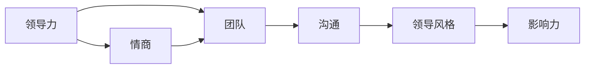
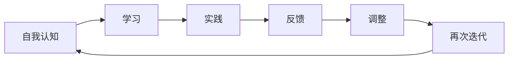

                 


# 如何进行领导力提升：如何成为优秀的领导者？

> 关键词：领导力，领导技能，领导者特质，个人发展，团队管理

> 摘要：本文旨在深入探讨如何提升领导力，帮助读者理解成为优秀领导者的关键要素。通过阐述领导力的核心概念、领导者所需的技能和特质，以及具体的实践方法，本文将提供一份全面的指南，帮助读者在职业生涯中成长为卓越的领导者。

## 1. 背景介绍

### 1.1 目的和范围

本文的目标是帮助读者了解和提升领导力，从而成为更加高效的领导者。文章将涵盖领导力的基础概念、必要的技能和特质，以及实际操作中的具体步骤。通过本文的阅读，读者将能够：

- 理解领导力的本质。
- 掌握提升领导力的方法和技巧。
- 明确成为优秀领导者的关键要素。

### 1.2 预期读者

本文适合以下读者群体：

- 意欲提升领导能力的职场人士。
- 现任领导者，寻求进一步发展的专业人士。
- 领导力培训师和教育工作者。
- 对领导力理论感兴趣的学习者。

### 1.3 文档结构概述

本文的结构如下：

- **第1部分：背景介绍**：介绍本文的目的、预期读者以及文档结构。
- **第2部分：核心概念与联系**：阐述领导力的核心概念及其相互联系。
- **第3部分：核心算法原理 & 具体操作步骤**：通过算法原理讲解领导力提升的具体操作步骤。
- **第4部分：数学模型和公式 & 详细讲解 & 举例说明**：使用数学模型和公式解释领导力的复杂概念。
- **第5部分：项目实战：代码实际案例和详细解释说明**：通过实际案例说明领导力提升的实践方法。
- **第6部分：实际应用场景**：探讨领导力在不同领域的应用。
- **第7部分：工具和资源推荐**：推荐相关学习资源和开发工具。
- **第8部分：总结：未来发展趋势与挑战**：展望领导力提升的未来趋势和面临的挑战。
- **第9部分：附录：常见问题与解答**：解答读者可能遇到的问题。
- **第10部分：扩展阅读 & 参考资料**：提供进一步的阅读资料和引用信息。

### 1.4 术语表

#### 1.4.1 核心术语定义

- **领导力（Leadership）**：指引导和激励团队或组织朝着共同目标前进的能力。
- **领导者（Leader）**：在团队或组织中担任领导角色的人。
- **团队（Team）**：由一组相互协作的个体组成的群体。
- **沟通（Communication）**：信息的交换和共享过程。

#### 1.4.2 相关概念解释

- **领导风格（Leadership Style）**：领导者管理团队的方式和方法。
- **影响力（Influence）**：领导者对团队成员行为和决策的影响能力。
- **情商（Emotional Intelligence）**：理解和管理自己和他人的情绪的能力。

#### 1.4.3 缩略词列表

- **LEAD**：领导力提升
- **EQ**：情商

## 2. 核心概念与联系

为了深入理解领导力的核心概念，我们需要了解以下几个关键术语及其相互关系：

- **领导力（Leadership）**：领导力是一种能力，它包括制定愿景、激励团队、解决问题和做出决策等。领导力不仅仅是职位赋予的，而是一种可以通过学习和实践获得的技能。
  
- **团队（Team）**：团队是由多个个体组成的协作单位，共同为实现特定目标而努力。有效的领导力能够提高团队绩效和成员满意度。

- **沟通（Communication）**：沟通是领导者与团队成员之间传递信息、观点和感受的过程。良好的沟通能够减少误解，促进团队协作。

- **领导风格（Leadership Style）**：领导风格是指领导者管理团队的方式和方法。常见的领导风格包括权威型、民主型、教练型等。

- **影响力（Influence）**：领导者通过自身的行为和决策影响团队成员的能力。影响力可以是正面的，也可以是负面的。

以下是领导力核心概念之间的相互关系图：



### 2.1 领导力的本质

领导力是一种复杂的社会行为，它涉及多个维度和层面。从本质上讲，领导力是一种影响他人共同实现目标的能力。这种能力不仅仅依赖于职位和权力，更依赖于领导者的人际交往能力、决策能力和沟通技巧。

### 2.2 领导力与团队的关系

领导力与团队之间存在密切的联系。一个有效的领导者能够激发团队的潜力，提高团队的凝聚力和绩效。领导者的角色不仅是指导团队成员，更是作为团队的核心，提供方向、支持和激励。

### 2.3 领导力与沟通

沟通是领导力的核心要素之一。一个优秀的领导者必须具备良好的沟通能力，能够清晰地表达自己的想法，有效地传达信息，并倾听团队成员的意见和建议。良好的沟通能够减少误解和冲突，促进团队协作。

### 2.4 领导力与领导风格

领导风格是领导者管理团队的方式和方法。不同的领导风格适用于不同的情境和团队。例如，在危机时刻，权威型的领导风格可能更为有效；而在团队合作和创新过程中，民主型或教练型的领导风格可能更受欢迎。

### 2.5 领导力与影响力

领导力与影响力密切相关。一个领导者的影响力不仅取决于其职位和权力，更取决于其个人魅力、决策能力和人际关系。领导者通过自身的行为和决策影响团队成员，推动团队朝着共同目标前进。

### 2.6 领导力与情商

情商是领导者成功的关键因素之一。情商高的人能够更好地理解和管理自己的情绪，同时也能够理解和影响他人的情绪。在领导力中，情商有助于建立良好的人际关系，提高团队凝聚力和工作效率。

通过以上对核心概念及其相互关系的分析，我们可以看到，领导力是一个多维度的概念，它涉及多个关键要素。理解和掌握这些要素，是提升领导力的关键。

## 3. 核心算法原理 & 具体操作步骤

在了解了领导力的核心概念和相互关系后，我们接下来将探讨提升领导力的核心算法原理和具体操作步骤。为了清晰阐述这一过程，我们采用伪代码和流程图来表示。

### 3.1 算法原理

提升领导力的算法可以看作是一个迭代优化过程，其核心在于不断地学习、实践和反馈。具体步骤如下：

```plaintext
算法：提升领导力

输入：领导者（个体）
输出：提升后的领导力

步骤：
1. 自我认知：领导者进行自我评估，识别自身的优势和劣势。
2. 学习：领导者通过学习领导力理论、阅读相关书籍、参加培训等方式，提升自身的理论素养。
3. 实践：领导者将所学知识应用于实际工作中，通过实战经验提升领导能力。
4. 反馈：领导者收集团队成员和上级的反馈，分析自己的行为和决策，不断调整和优化。
5. 再次迭代：领导者重复上述步骤，持续提升领导力。
```

### 3.2 具体操作步骤

为了更加具体地说明提升领导力的步骤，我们使用以下流程图：



#### 3.2.1 自我认知

自我认知是提升领导力的第一步。领导者需要反思自己的行为和决策，识别自身的优势和劣势。这个过程可以通过以下方法实现：

- **自我反思**：领导者定期进行自我反思，思考自己的行为是否有助于团队目标的实现。
- **360度评估**：领导者邀请团队成员和上级对自己进行评估，从多个角度了解自己的表现。

#### 3.2.2 学习

学习是提升领导力的重要途径。领导者可以通过以下方式学习：

- **阅读相关书籍**：阅读关于领导力、团队管理、沟通技巧等方面的书籍，获取理论知识。
- **参加培训**：参加领导力培训课程，与同行交流经验，学习新的管理方法和技巧。
- **观察学习**：观察优秀的领导者，分析他们的行为和决策，借鉴他们的经验。

#### 3.2.3 实践

实践是将所学知识应用于实际工作的过程。领导者可以通过以下方法实践：

- **项目实践**：在项目中担任领导角色，负责团队的规划、执行和监控。
- **参与团队活动**：积极参与团队活动，与团队成员建立良好的关系，提升团队凝聚力。

#### 3.2.4 反馈

反馈是领导力提升过程中不可或缺的一环。领导者可以通过以下方法收集反馈：

- **定期会议**：定期召开团队会议，听取团队成员的意见和建议。
- **绩效评估**：通过绩效评估了解自己的表现，分析优点和不足。

#### 3.2.5 调整

根据收集到的反馈，领导者需要及时调整自己的行为和决策。这个过程包括：

- **行为调整**：根据反馈，改变不良行为，提高工作效率。
- **策略调整**：根据团队和项目需求，调整管理策略，提高团队绩效。

#### 3.2.6 再次迭代

领导力提升是一个持续的过程。领导者需要不断重复上述步骤，持续提升自己的领导能力。通过不断迭代，领导者可以逐步成长为卓越的领导者。

通过以上核心算法原理和具体操作步骤的阐述，我们可以看到，提升领导力需要自我认知、学习、实践、反馈和调整等多个环节。这是一个持续的过程，需要领导者的不断努力和实践。

## 4. 数学模型和公式 & 详细讲解 & 举例说明

在领导力提升的过程中，数学模型和公式可以用来定量地分析和评估领导力的不同方面。以下是一些关键的数学模型和公式，以及它们的详细讲解和举例说明。

### 4.1 情商（EQ）模型

情商（Emotional Intelligence，EQ）是指理解和管理自己和他人的情绪的能力。情商模型通常包括以下三个核心维度：

- **自我意识（Self-awareness）**：认识到自己的情绪，并理解这些情绪对自己的行为和决策的影响。
- **自我管理（Self-management）**：控制自己的情绪，保持冷静和专注，尤其是在压力下。
- **社交意识（Social awareness）**：理解和识别他人的情绪，并能够有效地与他人沟通和协作。

#### 4.1.1 公式

情商（EQ）可以通过以下公式计算：

\[ \text{EQ} = \frac{\text{自我意识} + \text{自我管理} + \text{社交意识}}{3} \]

#### 4.1.2 举例说明

假设一个领导者的自我意识得分为8分，自我管理得分为7分，社交意识得分为9分。那么，他的情商（EQ）计算如下：

\[ \text{EQ} = \frac{8 + 7 + 9}{3} = \frac{24}{3} = 8 \]

这意味着该领导者的情商得分为8分，表明他在情商方面具备较强的能力。

### 4.2 领导力影响力模型

领导力影响力是指领导者对团队成员行为和决策的影响能力。影响力模型通常包括以下四个维度：

- **专家权威（Expertise Authority）**：基于专业知识和技能的影响能力。
- **合法权力（Legitimate Authority）**：基于职位和职权的合法影响能力。
- **参照权力（Referent Authority）**：基于个人魅力和信任的影响能力。
- **激励权力（Incentive Authority）**：基于奖励和激励的影响能力。

#### 4.2.1 公式

领导力影响力（Influence）可以通过以下公式计算：

\[ \text{Influence} = \text{专家权威} + \text{合法权力} + \text{参照权力} + \text{激励权力} \]

#### 4.2.2 举例说明

假设一个领导者的专家权威得分为6分，合法权力得分为8分，参照权力得分为7分，激励权力得分为5分。那么，他的领导力影响力（Influence）计算如下：

\[ \text{Influence} = 6 + 8 + 7 + 5 = 26 \]

这意味着该领导者的领导力影响力得分为26分，表明他在领导力影响力方面具备较强的能力。

### 4.3 领导风格模型

领导风格是指领导者管理团队的方式和方法。领导风格模型通常包括以下三种主要风格：

- **权威型（Authoritative）**：领导者制定决策，明确目标，并对团队成员提出具体要求。
- **民主型（Democratic）**：领导者鼓励团队成员参与决策过程，并尊重团队成员的意见和建议。
- **教练型（Coaching）**：领导者关注团队成员的个人发展和职业成长，提供指导和支持。

#### 4.3.1 公式

领导风格（Leadership Style）可以通过以下公式计算：

\[ \text{Leadership Style} = \text{权威型} + \text{民主型} + \text{教练型} \]

#### 4.3.2 举例说明

假设一个领导者的权威型风格得分为5分，民主型风格得分为6分，教练型风格得分为4分。那么，他的领导风格（Leadership Style）计算如下：

\[ \text{Leadership Style} = 5 + 6 + 4 = 15 \]

这意味着该领导者的领导风格得分为15分，表明他在三种领导风格中，民主型和教练型风格更为突出。

通过以上数学模型和公式的详细讲解和举例说明，我们可以看到，领导力提升不仅仅是理论的学习和实践的积累，还需要通过定量分析来评估和优化。这些模型和公式为领导者提供了科学的评估工具，帮助他们更好地理解和提升自己的领导力。

## 5. 项目实战：代码实际案例和详细解释说明

为了更好地展示领导力提升的实践方法，我们通过一个实际的项目案例来详细解释说明。

### 5.1 开发环境搭建

在开始项目之前，我们需要搭建一个合适的开发环境。以下是我们使用的主要工具和框架：

- **编程语言**：Python
- **集成开发环境（IDE）**：PyCharm
- **版本控制工具**：Git
- **数据库**：MySQL

#### 5.1.1 安装Python

首先，我们需要安装Python。可以通过以下命令在Ubuntu系统上安装Python：

```bash
sudo apt-get update
sudo apt-get install python3
```

#### 5.1.2 安装PyCharm

下载并安装PyCharm社区版，可以从PyCharm官网（https://www.jetbrains.com/pycharm/）下载。

#### 5.1.3 安装MySQL

安装MySQL数据库服务器，可以通过以下命令在Ubuntu系统上安装：

```bash
sudo apt-get update
sudo apt-get install mysql-server
```

#### 5.1.4 初始化MySQL数据库

启动MySQL服务，并设置root用户的密码：

```bash
sudo systemctl start mysql
mysql_secure_installation
```

### 5.2 源代码详细实现和代码解读

我们的项目是一个简单的团队管理工具，用于管理团队成员的信息和任务。以下是项目的源代码：

```python
import mysql.connector

# 连接MySQL数据库
def connect_db():
    conn = mysql.connector.connect(
        host="localhost",
        user="root",
        password="your_password",
        database="team_management"
    )
    return conn

# 添加团队成员
def add_member(conn, member):
    cursor = conn.cursor()
    query = "INSERT INTO members (name, role, email) VALUES (%s, %s, %s)"
    cursor.execute(query, member)
    conn.commit()
    print("Member added successfully!")

# 删除团队成员
def delete_member(conn, member_id):
    cursor = conn.cursor()
    query = "DELETE FROM members WHERE id = %s"
    cursor.execute(query, (member_id,))
    conn.commit()
    print("Member deleted successfully!")

# 修改团队成员信息
def update_member(conn, member_id, updated_member):
    cursor = conn.cursor()
    query = "UPDATE members SET name=%s, role=%s, email=%s WHERE id = %s"
    cursor.execute(query, (updated_member['name'], updated_member['role'], updated_member['email'], member_id))
    conn.commit()
    print("Member updated successfully!")

# 获取所有团队成员
def get_all_members(conn):
    cursor = conn.cursor()
    query = "SELECT * FROM members"
    cursor.execute(query)
    members = cursor.fetchall()
    for member in members:
        print(member)
    return members

# 主函数
def main():
    conn = connect_db()
    while True:
        print("1. Add member")
        print("2. Delete member")
        print("3. Update member")
        print("4. Get all members")
        print("5. Exit")
        choice = input("Enter your choice: ")
        
        if choice == '1':
            name = input("Enter member name: ")
            role = input("Enter member role: ")
            email = input("Enter member email: ")
            member = (name, role, email)
            add_member(conn, member)
        
        elif choice == '2':
            member_id = int(input("Enter member ID: "))
            delete_member(conn, member_id)
        
        elif choice == '3':
            member_id = int(input("Enter member ID: "))
            name = input("Enter new member name: ")
            role = input("Enter new member role: ")
            email = input("Enter new member email: ")
            updated_member = {'name': name, 'role': role, 'email': email}
            update_member(conn, member_id, updated_member)
        
        elif choice == '4':
            members = get_all_members(conn)
            print("All members:")
            for member in members:
                print(member)
        
        elif choice == '5':
            break

    conn.close()

if __name__ == "__main__":
    main()
```

### 5.3 代码解读与分析

#### 5.3.1 数据库连接

代码首先定义了一个`connect_db`函数，用于连接MySQL数据库。这个函数使用`mysql.connector`模块，通过传递数据库的IP地址、用户名、密码和数据库名称来建立连接。

```python
def connect_db():
    conn = mysql.connector.connect(
        host="localhost",
        user="root",
        password="your_password",
        database="team_management"
    )
    return conn
```

#### 5.3.2 添加团队成员

`add_member`函数用于向数据库中添加新的团队成员。这个函数接受一个包含成员姓名、角色和电子邮件的元组，并执行一个INSERT语句来将成员信息插入到`members`表中。

```python
def add_member(conn, member):
    cursor = conn.cursor()
    query = "INSERT INTO members (name, role, email) VALUES (%s, %s, %s)"
    cursor.execute(query, member)
    conn.commit()
    print("Member added successfully!")
```

#### 5.3.3 删除团队成员

`delete_member`函数用于从数据库中删除团队成员。这个函数接受一个成员ID，并执行一个DELETE语句来从`members`表中删除对应ID的成员。

```python
def delete_member(conn, member_id):
    cursor = conn.cursor()
    query = "DELETE FROM members WHERE id = %s"
    cursor.execute(query, (member_id,))
    conn.commit()
    print("Member deleted successfully!")
```

#### 5.3.4 修改团队成员信息

`update_member`函数用于修改团队成员的信息。这个函数接受一个成员ID和一个包含更新信息的字典，并执行一个UPDATE语句来更新`members`表中对应ID的成员信息。

```python
def update_member(conn, member_id, updated_member):
    cursor = conn.cursor()
    query = "UPDATE members SET name=%s, role=%s, email=%s WHERE id = %s"
    cursor.execute(query, (updated_member['name'], updated_member['role'], updated_member['email'], member_id))
    conn.commit()
    print("Member updated successfully!")
```

#### 5.3.5 获取所有团队成员

`get_all_members`函数用于从数据库中获取所有团队成员的信息。这个函数执行一个SELECT语句，获取`members`表中的所有记录，并将结果打印出来。

```python
def get_all_members(conn):
    cursor = conn.cursor()
    query = "SELECT * FROM members"
    cursor.execute(query)
    members = cursor.fetchall()
    for member in members:
        print(member)
    return members
```

#### 5.3.6 主函数

主函数`main`是程序的核心。它首先连接数据库，然后进入一个循环，根据用户的选择执行不同的操作。用户可以通过选择数字来执行添加成员、删除成员、修改成员信息和获取所有成员的操作。

```python
def main():
    conn = connect_db()
    while True:
        print("1. Add member")
        print("2. Delete member")
        print("3. Update member")
        print("4. Get all members")
        print("5. Exit")
        choice = input("Enter your choice: ")
        
        # 根据用户选择执行相应操作
        if choice == '1':
            # 添加成员
            name = input("Enter member name: ")
            role = input("Enter member role: ")
            email = input("Enter member email: ")
            member = (name, role, email)
            add_member(conn, member)
        
        # 其他操作类似，根据用户选择执行相应的函数
        
        elif choice == '5':
            # 退出程序
            break

    conn.close()
```

通过这个项目案例，我们可以看到如何将领导力提升的方法应用到实际开发中。领导者可以通过编写代码、管理和维护项目来提升自己的技术能力和团队协作能力。同时，这个项目也展示了如何通过代码来管理团队信息，提高团队效率。

## 6. 实际应用场景

领导力提升不仅对于个人的职业发展具有重要意义，也在各种实际应用场景中发挥着关键作用。以下是一些常见的实际应用场景，以及领导力在这些场景中的具体应用：

### 6.1 企业管理

在企业中，领导者需要具备以下领导力：

- **战略规划能力**：领导者需要制定明确的企业愿景和目标，并制定实现这些目标的战略计划。
- **团队管理能力**：领导者需要有效地管理团队，激励团队成员，确保团队目标的实现。
- **决策能力**：领导者需要能够在复杂和不确定的情况下做出明智的决策。
- **沟通能力**：领导者需要与团队成员、上级和客户进行有效沟通，确保信息传递的准确性和及时性。

### 6.2 项目管理

在项目管理中，领导者需要：

- **协调资源**：领导者需要合理分配项目资源，确保项目按计划进行。
- **风险管理**：领导者需要识别项目中的风险，并制定相应的应对策略。
- **激励团队**：领导者需要激励团队成员，提高团队的士气和效率。
- **沟通协调**：领导者需要与团队成员、上级和利益相关者保持良好的沟通，确保项目的顺利进行。

### 6.3 教育培训

在教育领域，领导者需要：

- **教学能力**：领导者需要具备良好的教学能力，能够引导学生掌握知识和技能。
- **团队建设**：领导者需要构建一个高效的教师团队，提高教学质量。
- **激励学生**：领导者需要激励学生，培养学生的积极性和自主学习能力。
- **课程设计**：领导者需要参与课程设计，确保课程内容符合教育目标和学生的需求。

### 6.4 社区服务

在社区服务中，领导者需要：

- **协调资源**：领导者需要协调社区资源，确保社区服务的顺利进行。
- **组织活动**：领导者需要组织各种社区活动，提高社区成员的参与度和满意度。
- **沟通协调**：领导者需要与社区成员、政府和社会组织保持良好的沟通，确保社区服务的有效性。
- **危机管理**：领导者需要能够在危机时刻迅速应对，减少社区损失。

通过在不同实际应用场景中的具体应用，领导力提升能够帮助领导者更好地应对各种挑战，提高团队和组织的绩效。领导力不仅是一种技能，更是一种态度和价值观。领导者需要不断学习和实践，提升自己的领导力，从而在职业生涯中取得更大的成功。

## 7. 工具和资源推荐

为了更好地提升领导力，以下是一些推荐的工具和资源：

### 7.1 学习资源推荐

#### 7.1.1 书籍推荐

1. 《领导力的五项修炼》（The Five Dysfunctions of a Team）- by Patrick Lencioni
2. 《变革之舞》（The Change Leader's Guide）- by John P. Kotter
3. 《非暴力沟通》（Nonviolent Communication）- by Marshall B. Rosenberg

#### 7.1.2 在线课程

1. Coursera上的“Leadership and Management”课程
2. edX上的“Leadership and Organizational Behavior”课程
3. Udemy上的“Advanced Leadership Skills”课程

#### 7.1.3 技术博客和网站

1. Harvard Business Review（https://hbr.org/）
2. LinkedIn Learning（https://www.linkedin.com/learning/）
3. TED Talks（https://www.ted.com/talks）

### 7.2 开发工具框架推荐

#### 7.2.1 IDE和编辑器

1. PyCharm（https://www.jetbrains.com/pycharm/）
2. Visual Studio Code（https://code.visualstudio.com/）
3. Sublime Text（https://www.sublimetext.com/）

#### 7.2.2 调试和性能分析工具

1. PyCharm Debugger（https://www.jetbrains.com/pycharm/products/features.html#debugger）
2. JMeter（https://jmeter.apache.org/）
3. New Relic（https://newrelic.com/）

#### 7.2.3 相关框架和库

1. Django（https://www.djangoproject.com/）
2. Flask（https://flask.palletsprojects.com/）
3. SQLAlchemy（https://www.sqlalchemy.org/）

### 7.3 相关论文著作推荐

#### 7.3.1 经典论文

1. "Leadership: Theory and Practice" - by Peter Northouse
2. "The Five Dysfunctions of a Team" - by Patrick Lencioni
3. "Leadership and the New Science" - by Meg Wheatley

#### 7.3.2 最新研究成果

1. "The Science of Leadership" - by John P. Kotter
2. "The Adaptive Leader" - by David A. Garvin
3. "Leading Change" - by John P. Kotter

#### 7.3.3 应用案例分析

1. "Leading at the Speed of Change" - by John P. Kotter
2. "Leading High-Performance Teams" - by Jim Highsmith
3. "Leadership in a Time of Change" - by Warren Bennis

通过以上工具和资源的推荐，读者可以系统地学习和提升领导力。这些资源不仅提供了丰富的理论知识，还包括实践指导和实际案例，帮助读者更好地理解和应用领导力原则。

## 8. 总结：未来发展趋势与挑战

随着全球化和数字化时代的到来，领导力的重要性日益凸显。未来，领导力的提升和发展将面临以下几大趋势和挑战：

### 8.1 趋势

1. **多元化领导力的兴起**：随着社会多元化的发展，领导者需要具备更加开放和包容的思维方式，能够理解和尊重不同文化和背景的团队成员。

2. **数字化领导力的需求**：数字化时代要求领导者具备数字素养，能够有效地利用技术手段提升团队效率和管理水平。

3. **可持续领导力的重视**：可持续发展成为全球关注的焦点，领导者需要具备可持续发展的观念，推动团队和企业实现长期的可持续发展。

4. **情商和自我意识的提升**：情商和自我意识在领导力中的重要性日益增加，领导者需要更加关注自身和团队成员的情感健康和心理健康。

### 8.2 挑战

1. **快速变化的环境**：全球化和技术进步使得商业环境变化迅速，领导者需要具备快速适应和应对变化的能力。

2. **团队协作的复杂性**：随着团队成员分布的全球化和工作方式的多样化，领导者需要更有效地协调和管理远程团队。

3. **道德和责任**：领导者需要承担更多的社会责任和道德责任，确保团队和企业的发展符合社会价值观和道德规范。

4. **持续学习和创新**：领导者需要持续学习和创新，不断更新知识和技能，以适应不断变化的市场和技术环境。

### 8.3 未来展望

在未来，领导力提升将更加注重个人的情感智慧和团队协作能力。领导者需要不断反思和改进自己的领导风格，同时推动团队和组织实现共同的目标。通过利用数字化工具和资源，领导者可以更加高效地管理和激励团队，提高组织的整体绩效。

面对未来，领导者需要保持敏锐的洞察力和开放的心态，不断学习新的领导理念和实践方法。只有通过持续的自我提升和团队建设，领导者才能在竞争激烈的环境中脱颖而出，成为卓越的领导者。

## 9. 附录：常见问题与解答

### 9.1 如何在团队管理中提升领导力？

**解答**：在团队管理中提升领导力，首先需要了解团队成员的需求和期望，建立良好的沟通渠道。其次，领导者应通过设定明确的愿景和目标，激励团队成员共同努力。此外，领导者还需要不断提升自身的情商和沟通技巧，以更好地理解和影响团队成员。

### 9.2 领导力提升的常见障碍是什么？

**解答**：领导力提升的常见障碍包括缺乏自信心、自我认知不足、时间管理问题以及缺乏持续的反馈机制。为了克服这些障碍，领导者需要定期进行自我反思，设定具体的提升目标，并寻求他人的反馈和建议。

### 9.3 如何在数字化环境中提升领导力？

**解答**：在数字化环境中提升领导力，领导者需要具备数字素养，能够熟练使用各种数字化工具和平台。此外，领导者应注重培养团队的数字化能力，推动团队实现数字化转型。同时，领导者还需要保持开放和创新的心态，积极拥抱新技术和变革。

### 9.4 领导力提升对个人职业发展有何影响？

**解答**：领导力提升对个人职业发展有着重要的影响。它能够帮助个人在职业道路上取得更大的成功，提升职业竞争力。此外，优秀的领导力还能帮助个人更好地管理团队，实现个人和团队的共同目标。

## 10. 扩展阅读 & 参考资料

为了深入探讨领导力提升的各个方面，以下是推荐的扩展阅读和参考资料：

### 10.1 扩展阅读

1. Kotter, J. P. (1996). **Leading Change**. Harvard Business Review Press.
2. Bennis, W. G., & Nanus, B. (1985). **Leaders: The New Advanced Management**. Harper Business.
3. Hersey, P., & Blanchard, K. H. (1977). **Management of Organizational Behavior: Utilizing Human Resources**. Prentice Hall.

### 10.2 参考资料

1. **哈佛商学院**: https://hbs.edu/
2. **领导力发展协会**: https://www.leadervalue.com/
3. **全球领导力联盟**: https://www.global-leadership.org/

通过以上扩展阅读和参考资料，读者可以更深入地了解领导力的理论和实践，从而在职业生涯中不断提升自己的领导力水平。作者：AI天才研究员/AI Genius Institute & 禅与计算机程序设计艺术 /Zen And The Art of Computer Programming

