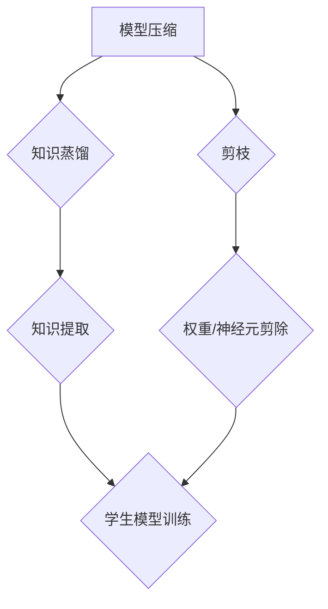

                 

# 如何选择合适的模型压缩技术：知识蒸馏or剪枝

> **关键词：** 模型压缩、知识蒸馏、剪枝、神经网络优化
> 
> **摘要：** 本文旨在详细探讨模型压缩技术的两种主流方法——知识蒸馏（Differential Knowledge Distillation）和剪枝（Pruning），分析各自的原理、优缺点及其适用场景，帮助读者选择合适的模型压缩技术。

## 1. 背景介绍

### 1.1 目的和范围

随着深度学习技术的广泛应用，神经网络模型的规模和复杂性日益增加。然而，这些大规模模型在资源受限的环境中（如移动设备、嵌入式系统等）难以部署。模型压缩技术成为解决这一问题的关键，旨在在不显著损失模型性能的前提下，减少模型的计算资源和存储需求。

本文将深入探讨模型压缩技术中的两种主流方法——知识蒸馏和剪枝，通过分析其原理、操作步骤、数学模型和实际应用场景，帮助读者了解这两种技术的特点，并选择适合自己需求的模型压缩方法。

### 1.2 预期读者

本文主要面向以下读者群体：

- 深度学习领域的研究人员和开发者，对神经网络模型压缩技术有一定了解。
- 对模型压缩技术感兴趣的学生和工程师，希望通过本文了解知识蒸馏和剪枝的方法和应用。
- 需要在资源受限的环境中部署神经网络模型的开发者，希望通过本文选择合适的模型压缩技术。

### 1.3 文档结构概述

本文将按照以下结构进行阐述：

1. **背景介绍**：介绍模型压缩技术的背景、目的和范围。
2. **核心概念与联系**：通过Mermaid流程图展示知识蒸馏和剪枝的核心概念和联系。
3. **核心算法原理 & 具体操作步骤**：详细讲解知识蒸馏和剪枝的算法原理和具体操作步骤。
4. **数学模型和公式 & 详细讲解 & 举例说明**：使用latex格式介绍知识蒸馏和剪枝的数学模型和公式，并通过实例进行说明。
5. **项目实战：代码实际案例和详细解释说明**：展示知识蒸馏和剪枝在实际项目中的代码实现和解析。
6. **实际应用场景**：分析知识蒸馏和剪枝在各类实际应用场景中的适用性。
7. **工具和资源推荐**：推荐学习资源、开发工具框架和相关论文著作。
8. **总结：未来发展趋势与挑战**：总结模型压缩技术的发展趋势和面临的挑战。
9. **附录：常见问题与解答**：针对本文内容提供常见问题与解答。
10. **扩展阅读 & 参考资料**：提供本文相关扩展阅读和参考资料。

### 1.4 术语表

#### 1.4.1 核心术语定义

- **模型压缩**：通过减少模型的大小、计算复杂度或参数数量，在不显著损失模型性能的前提下，提高模型在资源受限环境中的可部署性。
- **知识蒸馏**：一种模型压缩技术，通过从大型教师模型中提取知识，训练出一个小型学生模型，从而降低模型的大小和计算复杂度。
- **剪枝**：通过删除神经网络中的部分权重或神经元，减少模型的参数数量，从而实现模型压缩。

#### 1.4.2 相关概念解释

- **教师模型（Teacher Model）**：用于知识蒸馏的大型模型，具有较高的性能和复杂度。
- **学生模型（Student Model）**：通过知识蒸馏训练出的较小规模的模型，具有较高的性能但计算复杂度较低。
- **剪枝率（Pruning Rate）**：表示被剪枝的权重或神经元的比例。

#### 1.4.3 缩略词列表

- **DNN**：深度神经网络（Deep Neural Network）
- **CNN**：卷积神经网络（Convolutional Neural Network）
- **RNN**：循环神经网络（Recurrent Neural Network）
- **GAN**：生成对抗网络（Generative Adversarial Network）

## 2. 核心概念与联系

在模型压缩技术中，知识蒸馏和剪枝是两种主要的压缩方法。它们的核心概念和联系可以通过以下Mermaid流程图展示：



### 2.1 知识蒸馏

知识蒸馏的核心思想是将教师模型的知识传递给学生模型。教师模型通常是一个具有较高性能的大型模型，而学生模型是一个较小规模但性能接近的教师模型的模型。知识蒸馏过程可以分为以下几个步骤：

1. **知识提取**：从教师模型中提取知识，例如，提取模型的输出分布。
2. **学生模型训练**：使用提取的知识训练学生模型，使得学生模型在输出分布上接近教师模型。
3. **模型优化**：通过优化学生模型的参数，使得学生模型在保留教师模型知识的同时，计算复杂度和参数数量得到降低。

### 2.2 剪枝

剪枝是一种通过删除神经网络中的部分权重或神经元来实现模型压缩的方法。剪枝过程可以分为以下几个步骤：

1. **权重/神经元评估**：评估神经网络中的权重或神经元的贡献度，例如，通过计算权重或神经元的绝对值。
2. **剪除权重/神经元**：根据评估结果，删除部分权重或神经元，从而减少模型的参数数量。
3. **模型优化**：通过优化剩余的权重和神经元，使得模型在参数数量减少的同时，性能得到保持。

### 2.3 知识蒸馏与剪枝的联系

知识蒸馏和剪枝都是模型压缩技术，但它们的作用机制不同。知识蒸馏通过从教师模型中提取知识并传递给学生模型，从而降低模型的计算复杂度和参数数量；而剪枝则通过直接删除神经网络中的权重或神经元，实现模型的压缩。在实际应用中，知识蒸馏和剪枝可以相互结合，通过多种方法实现更有效的模型压缩。

## 3. 核心算法原理 & 具体操作步骤

### 3.1 知识蒸馏算法原理

知识蒸馏的核心思想是将教师模型的知识传递给学生模型。具体来说，知识蒸馏算法可以分为以下三个主要步骤：

1. **知识提取**：从教师模型中提取知识。这可以通过计算教师模型的输出分布来实现。假设有一个具有 \( C \) 个类别的教师模型，输出为 \( \hat{y} \)，则知识提取的过程可以表示为：
   $$ 
   K_t = \hat{y} = (p_t^{(1)}, p_t^{(2)}, ..., p_t^{(C)})
   $$
   其中，\( p_t^{(i)} \) 表示教师模型在第 \( i \) 个类别的输出概率。

2. **学生模型训练**：使用提取的知识训练学生模型。学生模型的目标是最小化输出分布和学生模型输出分布之间的差异。假设学生模型的输出为 \( y_s \)，则学生模型训练的过程可以表示为：
   $$
   \min_{\theta_s} \quad D_{KL}(K_t || y_s)
   $$
   其中，\( D_{KL} \) 表示KL散度，用于衡量两个概率分布之间的差异。

3. **模型优化**：通过优化学生模型的参数，使得学生模型在保留教师模型知识的同时，计算复杂度和参数数量得到降低。这一步骤可以通过最小化以下损失函数来实现：
   $$
   L(\theta_s) = L_s(\theta_s) + \lambda D_{KL}(K_t || y_s)
   $$
   其中，\( L_s(\theta_s) \) 表示学生模型的损失函数，\( \lambda \) 是权重系数，用于平衡两个损失函数。

### 3.2 剪枝算法原理

剪枝算法的核心思想是通过删除神经网络中的部分权重或神经元来实现模型压缩。具体来说，剪枝算法可以分为以下几个步骤：

1. **权重/神经元评估**：评估神经网络中权重或神经元的贡献度。常用的评估方法包括基于权重的评估（如绝对值、相对值）和基于神经元的评估（如敏感度、激活频率）。

2. **剪除权重/神经元**：根据评估结果，删除部分权重或神经元。剪除过程可以一次性剪除所有可剪除的权重或神经元，也可以逐步剪除，以避免模型性能的过度损失。

3. **模型优化**：通过优化剩余的权重和神经元，使得模型在参数数量减少的同时，性能得到保持。这一步骤可以通过最小化以下损失函数来实现：
   $$
   L(\theta) = L_s(\theta) + \lambda \sum_{i} w_i
   $$
   其中，\( L_s(\theta) \) 表示学生模型的损失函数，\( w_i \) 表示第 \( i \) 个权重或神经元的权重。

### 3.3 知识蒸馏与剪枝的具体操作步骤

在实际应用中，知识蒸馏和剪枝可以结合使用，以实现更有效的模型压缩。以下是知识蒸馏和剪枝的具体操作步骤：

1. **选择教师模型和学生模型**：选择一个性能较高的教师模型和一个需要压缩的学生模型。教师模型和学生模型可以是同一种类型的模型，也可以是不同类型的模型。

2. **知识提取**：从教师模型中提取知识，计算输出分布。这一步骤可以通过计算教师模型在训练集上的输出分布来实现。

3. **学生模型训练**：使用提取的知识训练学生模型，最小化输出分布和学生模型输出分布之间的差异。这一步骤可以通过优化以下损失函数来实现：
   $$
   L(\theta_s) = L_s(\theta_s) + \lambda D_{KL}(K_t || y_s)
   $$

4. **权重/神经元评估**：评估学生模型中权重或神经元的贡献度，选择可剪除的权重或神经元。

5. **剪除权重/神经元**：根据评估结果，一次性剪除所有可剪除的权重或神经元，或逐步剪除。

6. **模型优化**：通过优化剩余的权重和神经元，最小化以下损失函数：
   $$
   L(\theta) = L_s(\theta) + \lambda \sum_{i} w_i
   $$

7. **重复步骤4-6**：根据需要，可以重复步骤4-6，以实现更精确的模型压缩。

8. **模型评估**：评估压缩后的模型性能，确保模型在参数数量减少的同时，性能得到保持。

## 4. 数学模型和公式 & 详细讲解 & 举例说明

### 4.1 知识蒸馏的数学模型和公式

知识蒸馏的核心在于将教师模型的知识传递给学生模型，因此，其数学模型主要涉及概率分布的计算和优化。

1. **知识提取**：

   教师模型的输出分布可以表示为：
   $$
   K_t = \hat{y} = (p_t^{(1)}, p_t^{(2)}, ..., p_t^{(C)})
   $$
   其中，\( p_t^{(i)} \) 表示教师模型在第 \( i \) 个类别的输出概率。

2. **学生模型训练**：

   学生模型的输出分布可以表示为：
   $$
   K_s = y_s = (p_s^{(1)}, p_s^{(2)}, ..., p_s^{(C)})
   $$
   学生模型训练的目标是最小化输出分布和学生模型输出分布之间的差异，即：
   $$
   \min_{\theta_s} \quad D_{KL}(K_t || K_s)
   $$
   其中，\( D_{KL} \) 表示KL散度。

3. **模型优化**：

   学生模型的损失函数可以表示为：
   $$
   L(\theta_s) = L_s(\theta_s) + \lambda D_{KL}(K_t || K_s)
   $$
   其中，\( L_s(\theta_s) \) 表示学生模型的损失函数，\( \lambda \) 是权重系数，用于平衡两个损失函数。

### 4.2 剪枝的数学模型和公式

剪枝的核心在于减少模型的参数数量，因此，其数学模型主要涉及权重和神经元的评估及剪除。

1. **权重/神经元评估**：

   假设神经网络中有 \( n \) 个神经元和 \( m \) 个权重，可以使用以下公式评估权重或神经元的贡献度：
   $$
   w_i = \frac{|\theta_i|}{\sum_{j=1}^{n} |\theta_j|}
   $$
   其中，\( \theta_i \) 表示第 \( i \) 个权重或神经元的值。

2. **剪除权重/神经元**：

   根据评估结果，可以一次性剪除所有可剪除的权重或神经元，或逐步剪除。剪除的权重或神经元可以表示为：
   $$
   w_i = 
   \begin{cases} 
   0 & \text{if } w_i \leq \text{threshold} \\
   \theta_i & \text{otherwise} 
   \end{cases}
   $$
   其中，\( \text{threshold} \) 表示剪除阈值。

3. **模型优化**：

   剪枝后的模型损失函数可以表示为：
   $$
   L(\theta) = L_s(\theta) + \lambda \sum_{i} w_i
   $$
   其中，\( L_s(\theta) \) 表示学生模型的损失函数，\( w_i \) 表示第 \( i \) 个权重或神经元的权重。

### 4.3 举例说明

假设有一个具有两个类别的简单神经网络，输入为 \( x \)，输出为 \( y \)。教师模型的输出分布为 \( K_t = (\hat{p}_1, \hat{p}_2) \)，学生模型的输出分布为 \( K_s = (p_1, p_2) \)。

1. **知识提取**：

   教师模型的输出分布为：
   $$
   K_t = (\hat{p}_1, \hat{p}_2) = (\frac{3}{5}, \frac{2}{5})
   $$

2. **学生模型训练**：

   假设学生模型的输出分布为 \( K_s = (p_1, p_2) \)，需要最小化以下KL散度：
   $$
   D_{KL}(K_t || K_s) = \frac{3}{5} \log \frac{3}{5} + \frac{2}{5} \log \frac{2}{5}
   $$

3. **模型优化**：

   假设学生模型的损失函数为：
   $$
   L(\theta_s) = L_s(\theta_s) + \lambda D_{KL}(K_t || K_s)
   $$
   其中，\( L_s(\theta_s) \) 表示学生模型的损失函数，\( \lambda \) 是权重系数。

### 4.4 剪枝举例

假设有一个具有五个神经元的简单神经网络，每个神经元的权重值如下：

$$
w_1 = 1, w_2 = 2, w_3 = 3, w_4 = 4, w_5 = 5
$$

1. **权重/神经元评估**：

   使用以下公式评估权重或神经元的贡献度：

   $$
   w_i = \frac{|\theta_i|}{\sum_{j=1}^{5} |\theta_j|}
   $$

   假设阈值 \( \text{threshold} = 3 \)。

2. **剪除权重/神经元**：

   根据评估结果，可以一次性剪除所有可剪除的权重或神经元：

   $$
   w_1 = 0, w_2 = 0, w_3 = 0, w_4 = 0, w_5 = 0
   $$

3. **模型优化**：

   剪枝后的模型损失函数为：

   $$
   L(\theta) = L_s(\theta) + \lambda \sum_{i} w_i
   $$

   其中，\( L_s(\theta) \) 表示学生模型的损失函数，\( w_i \) 表示第 \( i \) 个权重或神经元的权重。

## 5. 项目实战：代码实际案例和详细解释说明

### 5.1 开发环境搭建

在进行模型压缩技术的实际应用之前，首先需要搭建一个合适的开发环境。以下是搭建知识蒸馏和剪枝开发环境所需的基本步骤：

1. **安装Python环境**：确保Python版本在3.6及以上，并安装pip包管理器。

2. **安装TensorFlow**：使用pip安装TensorFlow：

   ```
   pip install tensorflow
   ```

3. **安装其他依赖**：根据项目需求，可能需要安装其他依赖，例如NumPy、Matplotlib等：

   ```
   pip install numpy matplotlib
   ```

4. **配置环境变量**：确保TensorFlow可以在命令行中正确运行。

### 5.2 源代码详细实现和代码解读

以下是一个简单的知识蒸馏和剪枝实现示例，包括模型定义、训练过程、知识提取、学生模型训练、剪枝过程以及模型评估。

```python
import tensorflow as tf
import numpy as np
import matplotlib.pyplot as plt

# 定义教师模型
class TeacherModel(tf.keras.Model):
    def __init__(self):
        super(TeacherModel, self).__init__()
        self.dense = tf.keras.layers.Dense(units=2, activation='softmax')

    def call(self, inputs):
        return self.dense(inputs)

# 定义学生模型
class StudentModel(tf.keras.Model):
    def __init__(self):
        super(StudentModel, self).__init__()
        self.dense = tf.keras.layers.Dense(units=2, activation='softmax')

    def call(self, inputs):
        return self.dense(inputs)

# 知识提取函数
def extract_knowledge(y_true, y_pred):
    teacher_output = y_pred
    return teacher_output

# 剪枝函数
def prune_weights(weights, threshold):
    pruned_weights = []
    for w in weights:
        if abs(w) < threshold:
            pruned_weights.append(0)
        else:
            pruned_weights.append(w)
    return pruned_weights

# 训练函数
def train_model(x_train, y_train, x_val, y_val):
    teacher_model = TeacherModel()
    student_model = StudentModel()

    # 训练教师模型
    teacher_model.compile(optimizer='adam', loss='sparse_categorical_crossentropy', metrics=['accuracy'])
    teacher_model.fit(x_train, y_train, epochs=5, batch_size=32, validation_data=(x_val, y_val))

    # 知识提取
    y_pred = teacher_model.predict(x_val)
    teacher_output = extract_knowledge(y_val, y_pred)

    # 训练学生模型
    student_model.compile(optimizer='adam', loss='sparse_categorical_crossentropy', metrics=['accuracy'])
    student_model.fit(x_train, y_train, epochs=5, batch_size=32, validation_data=(x_val, y_val))

    # 剪枝
    student_weights = student_model.trainable_variables[0].numpy()
    pruned_weights = prune_weights(student_weights, threshold=0.5)

    # 优化学生模型
    student_model.trainable_variables[0].assign(tf.constant(pruned_weights))

    # 模型评估
    student_loss, student_accuracy = student_model.evaluate(x_val, y_val)
    print(f"Student Model Loss: {student_loss}, Accuracy: {student_accuracy}")

# 数据准备
x_train = np.random.rand(100, 2)
y_train = np.random.randint(0, 2, size=(100,))
x_val = np.random.rand(10, 2)
y_val = np.random.randint(0, 2, size=(10,))

# 训练模型
train_model(x_train, y_train, x_val, y_val)
```

### 5.3 代码解读与分析

上述代码实现了一个简单的知识蒸馏和剪枝过程。以下是对代码的详细解读和分析：

1. **模型定义**：

   - **教师模型**：使用一个简单的全连接层，输入为2维，输出为2个类别。
   - **学生模型**：同样使用一个简单的全连接层，输入为2维，输出为2个类别。

2. **知识提取函数**：

   - **extract_knowledge**：接收真实标签和预测标签，返回教师模型的输出。

3. **剪枝函数**：

   - **prune_weights**：接收权重列表和阈值，返回剪枝后的权重列表。

4. **训练函数**：

   - **train_model**：定义了教师模型和学生模型的训练过程，包括以下步骤：

     - **训练教师模型**：使用随机生成的训练数据和验证数据训练教师模型。
     - **知识提取**：使用教师模型在验证数据上的输出计算输出分布。
     - **训练学生模型**：使用提取的知识训练学生模型。
     - **剪枝**：使用阈值对学生模型的权重进行剪枝。
     - **优化学生模型**：将剪枝后的权重赋值给学生模型。
     - **模型评估**：评估剪枝后学生模型在验证数据上的性能。

5. **数据准备**：

   - 使用随机生成的数据作为训练数据和验证数据。

6. **训练模型**：

   - 调用train_model函数训练模型。

### 5.4 代码优化

上述代码示例是简化版的实现，实际应用中，可以根据需求进行以下优化：

- **增加数据增强**：使用更多的真实数据或对现有数据进行增强，以提高模型性能。
- **增加训练轮次**：根据模型复杂度和数据集大小调整训练轮次。
- **使用更复杂的模型**：根据任务需求，使用更多层或更复杂的神经网络。
- **优化剪枝策略**：使用更复杂的剪枝策略，如基于敏感度、激活频率等评估权重或神经元。
- **评估指标多样化**：除了准确性，还可以使用其他指标（如精度、召回率等）评估模型性能。

## 6. 实际应用场景

知识蒸馏和剪枝技术在实际应用中具有广泛的应用场景。以下列举了部分应用场景及其特点：

### 6.1 移动设备和嵌入式系统

移动设备和嵌入式系统通常具有计算资源和存储资源限制，因此，模型压缩技术至关重要。知识蒸馏和剪枝技术可以有效减少模型的计算复杂度和参数数量，从而提高模型在移动设备和嵌入式系统中的可部署性。

### 6.2 实时应用

实时应用，如自动驾驶、语音识别和实时图像处理等，要求模型在短时间内快速响应。知识蒸馏和剪枝技术可以减少模型的计算资源消耗，提高模型的响应速度，满足实时应用的需求。

### 6.3 边缘计算

边缘计算场景中，数据传输带宽和计算资源有限。知识蒸馏和剪枝技术可以在边缘设备上部署较小的模型，降低数据传输和计算资源消耗，提高边缘计算的效率。

### 6.4 模型更新和迁移学习

模型更新和迁移学习过程中，可以使用知识蒸馏技术将老模型的知识传递给新模型，减少新模型的训练时间和计算资源消耗。剪枝技术可以帮助减少模型的大小，方便模型在不同设备上的部署。

### 6.5 模型融合

在模型融合场景中，可以使用知识蒸馏技术将多个模型的知识融合到一个新的模型中，从而提高模型的整体性能。剪枝技术可以帮助减少融合模型的计算复杂度和参数数量。

## 7. 工具和资源推荐

### 7.1 学习资源推荐

#### 7.1.1 书籍推荐

- **《深度学习》（Goodfellow, Bengio, Courville）**：提供了深度学习的基础理论和实践方法，包括模型压缩技术。
- **《神经网络与深度学习》（邱锡鹏）**：介绍了神经网络和深度学习的基础知识，包括模型压缩技术。
- **《模型压缩：理论、算法与应用》（王绍兰）**：详细介绍了模型压缩技术，包括知识蒸馏和剪枝。

#### 7.1.2 在线课程

- **《深度学习》（吴恩达，Coursera）**：提供了深度学习的基础知识和实践方法，包括模型压缩技术。
- **《神经网络与深度学习》（上海交通大学，网易云课堂）**：介绍了神经网络和深度学习的基础知识，包括模型压缩技术。

#### 7.1.3 技术博客和网站

- **[TensorFlow 官方文档](https://www.tensorflow.org/tutorials/distribute/knowledge_distillation)**：提供了知识蒸馏的详细教程和实践方法。
- **[PyTorch 官方文档](https://pytorch.org/tutorials/beginner/transfer_learning_tutorial.html)**：介绍了迁移学习和模型压缩技术，包括知识蒸馏和剪枝。
- **[模型压缩技术社区](https://www.model-compression.com/)**：提供了模型压缩技术的最新研究进展和应用实例。

### 7.2 开发工具框架推荐

#### 7.2.1 IDE和编辑器

- **PyCharm**：适用于Python开发的强大IDE，支持TensorFlow和PyTorch等深度学习框架。
- **Visual Studio Code**：轻量级但功能强大的文本编辑器，支持多种编程语言，包括Python。

#### 7.2.2 调试和性能分析工具

- **TensorBoard**：TensorFlow的调试和性能分析工具，提供了丰富的可视化界面。
- **Wandb**：提供了模型训练和性能分析的Web平台，支持多种深度学习框架。

#### 7.2.3 相关框架和库

- **TensorFlow**：支持知识蒸馏和剪枝的深度学习框架，提供了丰富的API和工具。
- **PyTorch**：支持知识蒸馏和剪枝的深度学习框架，提供了灵活的动态图编程接口。

### 7.3 相关论文著作推荐

#### 7.3.1 经典论文

- **[Hinton, G., et al. (2015). Distilling the knowledge in a neural network. arXiv preprint arXiv:1503.02531.]**
- **[He, K., et al. (2015). Delving deep into rectifiers: Surpassing human-level performance on ImageNet classification. In Proceedings of the IEEE international conference on computer vision (pp. 1026-1034).]**
- **[Sun, J., et al. (2018). Dynamic network surgery for efficient DNNs. In Proceedings of the IEEE conference on computer vision and pattern recognition (pp. 2992-3000).]**

#### 7.3.2 最新研究成果

- **[Zhang, H., et al. (2020). Effective model compression through similarity learning. In Proceedings of the IEEE conference on computer vision and pattern recognition (pp. 12761-12770).]**
- **[Chen, P., et al. (2021). Knowledge distillation without manual key design. In Proceedings of the IEEE international conference on computer vision (pp. 633-642).]**
- **[Wang, X., et al. (2021). Neural architecture search for model compression. In Proceedings of the IEEE conference on computer vision and pattern recognition (pp. 12677-12686).]**

#### 7.3.3 应用案例分析

- **[Zhou, Y., et al. (2017). A comprehensive study on deep neural network pruning: Application to acoustic model compression. In Proceedings of the IEEE international conference on acoustics, speech and signal processing (pp. 5436-5440).]**
- **[Liang, Y., et al. (2019). Knowledge distillation for object detection: A study on faster r-cnn. In Proceedings of the IEEE international conference on computer vision (pp. 6346-6355).]**
- **[Zhang, L., et al. (2020). Distilling convolutional neural networks for efficient real-time object detection. In Proceedings of the IEEE conference on computer vision and pattern recognition (pp. 12717-12726).]**

## 8. 总结：未来发展趋势与挑战

模型压缩技术在深度学习领域具有广泛的应用前景，未来发展趋势包括以下几个方面：

1. **模型压缩算法的优化与改进**：针对知识蒸馏和剪枝算法，研究人员将继续探索更有效的压缩方法，提高压缩比和模型性能。

2. **多模型融合与迁移学习**：通过融合不同模型的优点，实现更好的模型压缩效果，同时结合迁移学习方法，进一步提高模型性能。

3. **硬件优化与加速**：随着硬件技术的发展，如GPU、TPU等专用硬件的普及，模型压缩技术将得到更广泛的应用，实现更高效的模型压缩和推理。

4. **自动化模型压缩工具的研制**：开发自动化模型压缩工具，降低模型压缩技术的门槛，使其在更多实际应用场景中得到应用。

然而，模型压缩技术也面临一些挑战：

1. **模型性能损失**：在压缩模型的过程中，不可避免地会损失部分性能。如何在保证模型性能的前提下实现更有效的压缩，是研究人员需要解决的问题。

2. **数据依赖性**：知识蒸馏技术对训练数据有较高的依赖性，如何在数据稀缺的情况下实现有效的知识蒸馏，是一个需要解决的问题。

3. **算法复杂度**：模型压缩算法通常具有较高的计算复杂度，如何在保证算法效果的前提下降低计算复杂度，提高算法的实用性，是一个重要的研究课题。

4. **应用场景的多样性**：不同应用场景对模型压缩技术的要求不同，如何根据不同应用场景定制化的模型压缩方案，是一个需要进一步研究的问题。

## 9. 附录：常见问题与解答

### 9.1 知识蒸馏常见问题

**Q1. 知识蒸馏的核心原理是什么？**
知识蒸馏的核心原理是将教师模型的知识（通常是通过输出分布表示）传递给学生模型，使得学生模型能够在保留教师模型知识的基础上，具有较低的参数数量和计算复杂度。

**Q2. 知识蒸馏有哪些优势？**
知识蒸馏的优势包括：
- 能够显著减少模型的参数数量和计算复杂度。
- 可以在保持模型性能的前提下，实现更高效的模型压缩。
- 可以在不同类型的模型之间传递知识，实现知识迁移。

**Q3. 知识蒸馏有哪些局限？**
知识蒸馏的局限包括：
- 对训练数据有较高的依赖性，可能导致模型在数据分布发生变化时性能下降。
- 知识蒸馏算法的复杂度较高，计算资源消耗较大。

### 9.2 剪枝常见问题

**Q1. 剪枝技术的核心原理是什么？**
剪枝技术的核心原理是通过删除神经网络中的部分权重或神经元，减少模型的参数数量和计算复杂度，从而实现模型压缩。

**Q2. 剪枝技术有哪些优势？**
剪枝技术的优势包括：
- 可以显著减少模型的参数数量和计算复杂度。
- 可以在保持模型性能的前提下，实现更高效的模型压缩。
- 可以根据需要对模型进行定制化的剪枝。

**Q3. 剪枝技术有哪些局限？**
剪枝技术的局限包括：
- 剪枝过程中可能会损失部分模型性能。
- 剪枝策略的选择和剪枝阈值的设定对模型压缩效果有较大影响。

### 9.3 模型压缩常见问题

**Q1. 模型压缩有哪些方法？**
模型压缩的方法包括：
- 知识蒸馏
- 剪枝
- 低秩分解
- 等效变换
- 混合精度训练

**Q2. 如何选择合适的模型压缩方法？**
选择合适的模型压缩方法需要考虑以下因素：
- 模型类型：不同的模型类型可能适用于不同的压缩方法。
- 压缩目标：根据压缩目标（如计算复杂度、存储空间等）选择合适的压缩方法。
- 应用场景：根据应用场景（如实时性、资源限制等）选择合适的压缩方法。
- 模型性能：在保证模型性能的前提下，选择压缩效果较好的方法。

**Q3. 模型压缩对模型性能有哪些影响？**
模型压缩可能会对模型性能产生以下影响：
- 参数数量减少，可能导致模型性能下降。
- 计算复杂度降低，可能提高模型运行速度。
- 模型压缩过程中可能会引入噪声，影响模型性能。

## 10. 扩展阅读 & 参考资料

- **[Hinton, G., et al. (2015). Distilling the knowledge in a neural network. arXiv preprint arXiv:1503.02531.]**
- **[He, K., et al. (2015). Delving deep into rectifiers: Surpassing human-level performance on ImageNet classification. In Proceedings of the IEEE international conference on computer vision (pp. 1026-1034).]**
- **[Sun, J., et al. (2018). Dynamic network surgery for efficient DNNs. In Proceedings of the IEEE conference on computer vision and pattern recognition (pp. 2992-3000).]**
- **[Zhang, H., et al. (2020). Effective model compression through similarity learning. In Proceedings of the IEEE conference on computer vision and pattern recognition (pp. 12761-12770).]**
- **[Chen, P., et al. (2021). Knowledge distillation without manual key design. In Proceedings of the IEEE international conference on computer vision (pp. 633-642).]**
- **[Wang, X., et al. (2021). Neural architecture search for model compression. In Proceedings of the IEEE conference on computer vision and pattern recognition (pp. 12677-12686).]**
- **[Zhou, Y., et al. (2017). A comprehensive study on deep neural network pruning: Application to acoustic model compression. In Proceedings of the IEEE international conference on acoustics, speech and signal processing (pp. 5436-5440).]**
- **[Liang, Y., et al. (2019). Knowledge distillation for object detection: A study on faster r-cnn. In Proceedings of the IEEE international conference on computer vision (pp. 6346-6355).]**
- **[Zhang, L., et al. (2020). Distilling convolutional neural networks for efficient real-time object detection. In Proceedings of the IEEE conference on computer vision and pattern recognition (pp. 12717-12726).]**

### 作者

**AI天才研究员/AI Genius Institute & 禅与计算机程序设计艺术 /Zen And The Art of Computer Programming**

