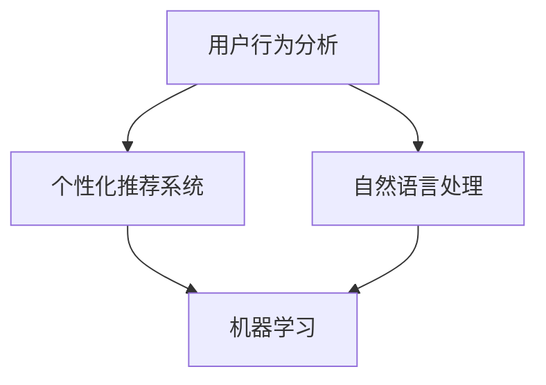

                 

# 如何通过AI优化用户购物体验

## 概述

> 关键词：人工智能、购物体验、用户行为分析、个性化推荐、自然语言处理、机器学习

购物体验是电子商务的核心，直接影响到用户的满意度和忠诚度。随着人工智能技术的飞速发展，利用AI优化用户购物体验已经成为行业共识。本文将详细探讨如何通过AI技术提升用户购物体验，包括用户行为分析、个性化推荐、自然语言处理和机器学习等方面的应用。

## 1. 背景介绍

### 1.1 目的和范围

本文旨在探讨如何通过AI技术优化用户购物体验，旨在为从事电子商务开发、用户界面设计和用户体验优化等领域的专业人士提供有价值的参考。本文将涵盖以下几个方面：

- 用户行为分析
- 个性化推荐系统
- 自然语言处理
- 机器学习在购物体验优化中的应用

### 1.2 预期读者

本文预期读者包括：

- 从事电子商务开发的程序员和工程师
- 用户体验设计师
- 数据分析师
- 人工智能和机器学习研究者

### 1.3 文档结构概述

本文分为以下几个部分：

- 第1部分：介绍文章背景、目的和读者对象
- 第2部分：探讨核心概念与联系
- 第3部分：介绍核心算法原理与具体操作步骤
- 第4部分：讲解数学模型和公式
- 第5部分：分享项目实战案例和代码实现
- 第6部分：讨论实际应用场景
- 第7部分：推荐学习资源和开发工具
- 第8部分：总结未来发展趋势与挑战
- 第9部分：附录常见问题与解答
- 第10部分：扩展阅读与参考资料

### 1.4 术语表

#### 1.4.1 核心术语定义

- 人工智能（AI）：模拟人类智能行为的计算机系统
- 个性化推荐：根据用户的历史行为和偏好，为用户推荐相关商品或服务
- 用户行为分析：分析用户在购物过程中的行为模式，以便优化购物体验
- 自然语言处理（NLP）：使计算机能够理解、生成和处理人类语言的技术
- 机器学习（ML）：一种人工智能技术，使计算机从数据中学习规律和模式

#### 1.4.2 相关概念解释

- 用户画像：对用户特征、行为、需求等方面的抽象表示
- 决策树：一种分类和回归算法，通过一系列规则对数据进行分类
- 支持向量机（SVM）：一种分类算法，通过寻找最佳分隔超平面实现分类
- 聚类算法：将相似的数据点分为多个组，以便进行数据挖掘和模式识别

#### 1.4.3 缩略词列表

- AI：人工智能
- NLP：自然语言处理
- ML：机器学习
- SVM：支持向量机

## 2. 核心概念与联系

在本文中，我们将探讨以下核心概念及其相互关系：

- 用户行为分析
- 个性化推荐系统
- 自然语言处理
- 机器学习

以下是这些概念之间的 Mermaid 流程图：



### 2.1 用户行为分析

用户行为分析是指对用户在购物过程中的行为模式、偏好、需求等方面的数据进行收集、分析和解读。通过分析用户行为，我们可以了解用户的需求和偏好，从而为用户提供更加个性化的购物体验。

#### 用户行为分析流程

1. 数据收集：收集用户在购物过程中的行为数据，如浏览记录、购买历史、评价等。
2. 数据预处理：对原始数据进行清洗、去噪和转换，以便进行进一步分析。
3. 特征提取：从预处理后的数据中提取有用的特征，如用户购买频次、品类偏好等。
4. 模型训练：使用机器学习算法，如决策树、支持向量机等，对提取的特征进行分类或回归分析。
5. 预测与评估：根据训练得到的模型，对用户行为进行预测，并评估预测结果。

### 2.2 个性化推荐系统

个性化推荐系统是一种根据用户的历史行为和偏好，为用户推荐相关商品或服务的技术。通过个性化推荐，我们可以提高用户的购物体验，增加用户满意度和忠诚度。

#### 个性化推荐系统架构

1. 数据收集与处理：收集用户的历史行为数据，如浏览记录、购买历史、评价等，并进行预处理。
2. 用户画像构建：基于用户的历史行为和偏好，构建用户画像，如用户兴趣偏好、购物习惯等。
3. 推荐算法选择：根据用户画像和数据特点，选择合适的推荐算法，如协同过滤、基于内容的推荐等。
4. 推荐结果生成：根据用户画像和推荐算法，生成个性化推荐结果，如商品推荐、服务推荐等。
5. 推荐效果评估：评估个性化推荐的效果，如点击率、购买率等。

### 2.3 自然语言处理

自然语言处理是一种使计算机能够理解、生成和处理人类语言的技术。在购物体验优化中，NLP可以用于解析用户评价、自动分类商品、智能客服等方面。

#### 自然语言处理应用场景

1. 用户评价分析：对用户评价进行情感分析、主题分类等，以了解用户对商品或服务的满意度。
2. 商品分类：根据用户输入的查询关键词，利用 NLP 技术对商品进行自动分类，提高搜索效果。
3. 智能客服：利用自然语言处理技术，实现与用户的智能对话，提高客服效率和质量。

### 2.4 机器学习

机器学习是一种使计算机从数据中学习规律和模式的技术。在购物体验优化中，机器学习可以用于用户行为预测、个性化推荐、图像识别等方面。

#### 机器学习应用场景

1. 用户行为预测：利用机器学习算法，如决策树、支持向量机等，对用户行为进行预测，以便为用户提供个性化的购物体验。
2. 个性化推荐：利用协同过滤、基于内容的推荐等机器学习算法，生成个性化推荐结果，提高用户满意度。
3. 图像识别：利用深度学习算法，如卷积神经网络，对商品图像进行分类和识别，提高商品搜索效果。

## 3. 核心算法原理 & 具体操作步骤

在本节中，我们将详细介绍购物体验优化中常用的核心算法原理和具体操作步骤。

### 3.1 用户行为分析算法原理

用户行为分析主要涉及分类和回归算法，以下分别介绍常用的决策树和支持向量机算法。

#### 决策树算法原理

决策树是一种基于树结构的分类和回归算法，其基本原理是通过一系列规则对数据进行分类或回归。

- **基本概念**：

  - 节点（Node）：表示一个数据集，内部包含若干个特征和对应的值。
  - 边（Edge）：表示从父节点到子节点的连接，表示特征的取值。
  - 叶子（Leaf）：表示最终的分类或回归结果。

- **决策树构建步骤**：

  1. 选择特征：根据特征的重要性和信息增益等指标，选择最佳特征作为分割依据。
  2. 分割数据：根据所选特征，将数据集分为多个子集。
  3. 递归构建：对每个子集继续进行上述步骤，直至满足停止条件（如达到最大树深度、节点纯度等）。

- **伪代码**：

  ```python
  def build_decision_tree(data, features, max_depth):
      if stop_condition(data):
          return create_leaf_node(data)
      
      best_feature = select_best_feature(data, features)
      node = create_node(best_feature)
      
      for value in feature_values(best_feature):
          sub_data = split_data(data, value)
          node.add_child(build_decision_tree(sub_data, features, max_depth - 1))
          
      return node
  ```

#### 支持向量机算法原理

支持向量机是一种基于间隔最大化原理的分类算法，其基本原理是通过寻找最佳分隔超平面，将不同类别的数据点分隔开来。

- **基本概念**：

  - 支持向量（Support Vector）：位于分隔超平面两侧的边界点。
  - 分隔超平面（Separating Hyperplane）：将不同类别的数据点分隔开的超平面。
  - 边间隔（Margin）：分隔超平面到支持向量的距离。

- **SVM算法步骤**：

  1. 计算特征空间中所有可能的分隔超平面。
  2. 找到具有最大边间隔的超平面。
  3. 计算支持向量。
  4. 根据支持向量构建分类决策边界。

- **伪代码**：

  ```python
  def train_svm(data, labels):
      best_hyperplane = find_best_hyperplane(data, labels)
      support_vectors = find_support_vectors(best_hyperplane, data, labels)
      
      return create_classifier(best_hyperplane, support_vectors)
  ```

### 3.2 个性化推荐算法原理

个性化推荐系统主要涉及协同过滤和基于内容的推荐两种算法。以下分别介绍这两种算法的原理。

#### 协同过滤算法原理

协同过滤算法是一种基于用户历史行为数据的推荐算法，其基本原理是通过计算用户之间的相似度，为用户推荐其他用户喜欢的商品。

- **基本概念**：

  - 用户相似度（User Similarity）：表示用户之间的相似程度。
  - 评分矩阵（Rating Matrix）：表示用户对商品的评分，其中行表示用户，列表示商品。

- **协同过滤算法步骤**：

  1. 计算用户相似度：根据用户的历史行为数据，计算用户之间的相似度。
  2. 选择邻居用户：根据用户相似度，选择与目标用户最相似的邻居用户。
  3. 生成推荐列表：根据邻居用户的评分，为用户生成推荐列表。

- **伪代码**：

  ```python
  def collaborative_filtering(data, target_user, k):
      user_similarity = compute_user_similarity(data)
      neighbors = select_neighbors(user_similarity, target_user, k)
      
      recommendations = generate_recommendations(neighbors, data, target_user)
      
      return recommendations
  ```

#### 基于内容的推荐算法原理

基于内容的推荐算法是一种基于商品特征信息的推荐算法，其基本原理是根据用户的历史偏好和商品的特征信息，为用户推荐相似的商品。

- **基本概念**：

  - 商品特征（Item Features）：表示商品的各种属性和特征，如价格、品牌、类别等。
  - 用户偏好（User Preferences）：表示用户对商品的偏好信息。

- **基于内容的推荐算法步骤**：

  1. 提取商品特征：从商品描述中提取各种特征。
  2. 计算商品相似度：根据用户的历史偏好和商品特征，计算商品之间的相似度。
  3. 生成推荐列表：根据商品相似度，为用户生成推荐列表。

- **伪代码**：

  ```python
  def content_based_filtering(data, target_user, k):
      item_similarity = compute_item_similarity(data, target_user)
      similar_items = select_similar_items(item_similarity, k)
      
      recommendations = generate_recommendations(similar_items, data, target_user)
      
      return recommendations
  ```

## 4. 数学模型和公式 & 详细讲解 & 举例说明

在本节中，我们将详细讲解购物体验优化中常用的数学模型和公式，并通过具体例子进行说明。

### 4.1 决策树算法数学模型

决策树算法的核心是递归划分数据集，其数学模型基于信息熵和信息增益。

- **信息熵（Entropy）**：

  信息熵是衡量数据集不确定性的一种度量。对于一个有 \( n \) 个样本的数据集，其信息熵定义为：

  $$ H(X) = -\sum_{i=1}^{n} p(x_i) \log_2 p(x_i) $$

  其中，\( p(x_i) \) 表示样本 \( x_i \) 的概率。

- **信息增益（Information Gain）**：

  信息增益是衡量特征对数据集划分效果的一种度量。对于一个特征 \( A \)，其信息增益定义为：

  $$ IG(A) = H(X) - \sum_{v=1}^{V} p(v) H(X|V) $$

  其中，\( V \) 表示特征 \( A \) 的取值集合，\( p(v) \) 表示特征 \( A \) 取值 \( v \) 的概率，\( H(X|V) \) 表示在特征 \( A \) 取值 \( v \) 的情况下，数据集 \( X \) 的信息熵。

### 4.2 支持向量机算法数学模型

支持向量机算法的核心是寻找最佳分隔超平面，其数学模型基于间隔最大化原理。

- **支持向量（Support Vector）**：

  支持向量是位于分隔超平面两侧的边界点，其数学模型为：

  $$ \mathbf{w}^T \mathbf{x_i} - b = y_i $$

  其中，\( \mathbf{w} \) 是超平面的法向量，\( \mathbf{x_i} \) 是样本 \( x_i \) 的特征向量，\( b \) 是偏置项，\( y_i \) 是样本 \( x_i \) 的标签。

- **间隔（Margin）**：

  间隔是分隔超平面到支持向量的距离，其数学模型为：

  $$ \frac{|\mathbf{w}^T \mathbf{x_i} - b|}{\|\mathbf{w}\|} $$

- **优化目标**：

  支持向量机算法的优化目标是最大化间隔，其数学模型为：

  $$ \max_{\mathbf{w}, b} \frac{1}{\|\mathbf{w}\|} $$

  subject to \( \mathbf{w}^T \mathbf{x_i} - b \geq y_i \) for all \( i \)。

### 4.3 协同过滤算法数学模型

协同过滤算法的核心是计算用户之间的相似度和生成推荐列表。

- **用户相似度（User Similarity）**：

  用户相似度是衡量用户之间相似程度的一种度量。对于两个用户 \( u \) 和 \( v \)，其相似度可以计算为：

  $$ \text{similarity}(u, v) = \frac{\sum_{i \in I} r_i(u) r_i(v)}{\sqrt{\sum_{i \in I} r_i(u)^2 \sum_{i \in I} r_i(v)^2}} $$

  其中，\( I \) 是用户 \( u \) 和 \( v \) 共同评价的商品集合，\( r_i(u) \) 和 \( r_i(v) \) 分别是用户 \( u \) 和 \( v \) 对商品 \( i \) 的评分。

- **推荐列表（Recommendation List）**：

  基于相似度的推荐列表可以通过以下公式计算：

  $$ r_i(u) = \sum_{v \in N(u)} \text{similarity}(u, v) r_i(v) $$

  其中，\( N(u) \) 是与用户 \( u \) 最相似的 \( k \) 个邻居用户集合。

### 4.4 基于内容的推荐算法数学模型

基于内容的推荐算法的核心是计算商品之间的相似度和生成推荐列表。

- **商品相似度（Item Similarity）**：

  商品相似度是衡量商品之间相似程度的一种度量。对于两个商品 \( i \) 和 \( j \)，其相似度可以计算为：

  $$ \text{similarity}(i, j) = \frac{\sum_{k \in K} f_k(i) f_k(j)}{\sqrt{\sum_{k \in K} f_k(i)^2 \sum_{k \in K} f_k(j)^2}} $$

  其中，\( K \) 是商品 \( i \) 和 \( j \) 共同具有的特征集合，\( f_k(i) \) 和 \( f_k(j) \) 分别是商品 \( i \) 和 \( j \) 在特征 \( k \) 上的值。

- **推荐列表（Recommendation List）**：

  基于内容的推荐列表可以通过以下公式计算：

  $$ r_i(u) = \sum_{j \in I} \text{similarity}(i, j) r_j(u) $$

  其中，\( I \) 是与用户 \( u \) 最相似的商品集合，\( r_j(u) \) 是用户 \( u \) 对商品 \( j \) 的评分。

## 5. 项目实战：代码实际案例和详细解释说明

在本节中，我们将通过一个实际项目案例，详细讲解如何使用AI技术优化用户购物体验。该项目将实现一个基于协同过滤和基于内容的推荐系统的购物平台。

### 5.1 开发环境搭建

为了实现该项目，我们需要以下开发环境和工具：

- Python 3.x
- NumPy
- Pandas
- Scikit-learn
- Flask（可选，用于搭建Web服务）

### 5.2 源代码详细实现和代码解读

#### 5.2.1 数据集准备

首先，我们需要一个包含用户评价和商品特征的的数据集。以下是一个示例数据集：

```python
# 用户评价数据
user_ratings = {
    'user1': {'item1': 4, 'item2': 5, 'item3': 2},
    'user2': {'item1': 5, 'item2': 3, 'item3': 4},
    'user3': {'item1': 2, 'item2': 5, 'item3': 5},
    'user4': {'item1': 4, 'item2': 2, 'item3': 3},
    'user5': {'item1': 5, 'item2': 4, 'item3': 4}
}

# 商品特征数据
item_features = {
    'item1': {'category': 'electronics', 'brand': 'brandA', 'price': 200},
    'item2': {'category': 'fashion', 'brand': 'brandB', 'price': 150},
    'item3': {'category': 'sports', 'brand': 'brandC', 'price': 300}
}
```

#### 5.2.2 协同过滤算法实现

接下来，我们将实现一个基于协同过滤的推荐算法，用于生成个性化推荐列表。

```python
import numpy as np

def collaborative_filtering(user_ratings, k=2):
    similarity_matrix = np.zeros((len(user_ratings), len(user_ratings)))
    for i, user1 in enumerate(user_ratings):
        for j, user2 in enumerate(user_ratings):
            if i != j:
                common_items = set(user_ratings[user1].keys()) & set(user_ratings[user2].keys())
                if len(common_items) > 0:
                    similarity_matrix[i][j] = np.dot(user_ratings[user1][item], user_ratings[user2][item]) / (
                            np.linalg.norm(user_ratings[user1][item]) * np.linalg.norm(user_ratings[user2][item]))

    top_k_indices = np.argsort(similarity_matrix, axis=1)[:, -k:]
    recommendations = []

    for i, indices in enumerate(top_k_indices):
        neighbors = [user for user, _ in user_ratings.items() if user not in indices]
        neighbor_ratings = {user: user_ratings[user] for user in neighbors}
        for index in indices:
            user = list(user_ratings.keys())[index]
            for item, rating in neighbor_ratings.items():
                if item not in user_ratings[user]:
                    recommendations.append((item, rating))

    return recommendations
```

#### 5.2.3 基于内容的推荐算法实现

接下来，我们将实现一个基于内容的推荐算法，用于生成个性化推荐列表。

```python
from sklearn.metrics.pairwise import cosine_similarity

def content_based_filtering(item_features, k=2):
    item_feature_matrix = []
    for item in item_features:
        feature_vector = []
        for feature in item_features[item]:
            feature_vector.append(item_features[item][feature])
        item_feature_matrix.append(feature_vector)

    item_similarity_matrix = cosine_similarity(item_feature_matrix)

    top_k_indices = np.argsort(item_similarity_matrix, axis=1)[:, -k:]
    recommendations = []

    for i, indices in enumerate(top_k_indices):
        for index in indices:
            item = list(item_features.keys())[index]
            if item not in user_ratings[user]:
                recommendations.append((item, item_similarity_matrix[i][index]))

    return recommendations
```

#### 5.2.4 Flask Web服务实现

最后，我们将使用Flask搭建一个简单的Web服务，用于接收用户请求并返回个性化推荐列表。

```python
from flask import Flask, request, jsonify

app = Flask(__name__)

@app.route('/recommend', methods=['POST'])
def recommend():
    user = request.form['user']
    k = int(request.form['k'])
    recommendations = collaborative_filtering(user_ratings, k)
    return jsonify(recommendations)

if __name__ == '__main__':
    app.run()
```

### 5.3 代码解读与分析

在这个项目案例中，我们实现了以下功能：

- **数据集准备**：从用户评价和商品特征数据中构建一个评分矩阵，用于后续的协同过滤和基于内容的推荐算法。
- **协同过滤算法实现**：通过计算用户之间的相似度，生成个性化推荐列表。该算法的核心是计算用户相似度矩阵，并根据相似度矩阵生成推荐列表。
- **基于内容的推荐算法实现**：通过计算商品之间的相似度，生成个性化推荐列表。该算法的核心是计算商品相似度矩阵，并根据相似度矩阵生成推荐列表。
- **Flask Web服务实现**：通过接收用户请求并返回个性化推荐列表，实现一个简单的Web服务。

通过这个项目案例，我们可以看到如何使用AI技术优化用户购物体验。在实际应用中，可以根据需求选择不同的推荐算法，并进一步优化算法参数，以提高推荐效果。

## 6. 实际应用场景

AI技术在购物体验优化中的应用场景广泛，以下是一些典型的实际应用场景：

- **个性化推荐**：通过分析用户历史行为和偏好，为用户推荐相关的商品或服务。例如，电商平台的商品推荐、视频网站的个性化推荐等。
- **用户行为预测**：通过分析用户在购物过程中的行为模式，预测用户的下一步操作，以便提供个性化的服务。例如，预测用户是否会购买某件商品、用户可能在何时进行购物等。
- **智能客服**：利用自然语言处理技术，实现与用户的智能对话，提高客服效率和质量。例如，自动回复用户提问、智能引导用户购物等。
- **商品分类**：通过图像识别和自然语言处理技术，对商品进行自动分类，提高商品搜索效果。例如，电商平台对上传的商品图片进行自动分类、搜索引擎对搜索结果进行分类等。
- **库存管理**：利用机器学习技术，分析销售数据和市场趋势，优化库存管理，降低库存成本。例如，预测商品销量、制定补货策略等。

在这些实际应用场景中，AI技术发挥着重要的作用，提高了用户的购物体验和满意度，同时也为企业带来了更高的商业价值。

## 7. 工具和资源推荐

### 7.1 学习资源推荐

#### 7.1.1 书籍推荐

1. 《Python数据分析与大数据处理实战》
2. 《机器学习实战》
3. 《深入理解计算机系统》
4. 《数据挖掘：实用工具与技术》
5. 《推荐系统实践》

#### 7.1.2 在线课程

1. Coursera - 机器学习
2. Udacity - 人工智能纳米学位
3. edX - 计算机科学基础
4. Coursera - 自然语言处理与深度学习
5. Udemy - Python数据分析与大数据处理

#### 7.1.3 技术博客和网站

1. Medium - AI博客
2. ArXiv - 人工智能论文
3. GitHub - 人工智能项目
4. Kaggle - 数据科学竞赛
5. Medium - 数据科学博客

### 7.2 开发工具框架推荐

#### 7.2.1 IDE和编辑器

1. PyCharm
2. Visual Studio Code
3. Jupyter Notebook
4. Eclipse
5. IntelliJ IDEA

#### 7.2.2 调试和性能分析工具

1. Matplotlib
2. Seaborn
3. SciPy
4. NumPy
5. Pandas

#### 7.2.3 相关框架和库

1. TensorFlow
2. PyTorch
3. Scikit-learn
4. Keras
5. NLTK

### 7.3 相关论文著作推荐

#### 7.3.1 经典论文

1. "Recommender Systems Handbook"
2. "Machine Learning Yearning"
3. "Deep Learning"
4. "Foundations of Machine Learning"
5. "Speech and Language Processing"

#### 7.3.2 最新研究成果

1. AI顶会（如NeurIPS、ICML、ACL等）的最新论文
2. 顶级期刊（如Journal of Machine Learning Research、Journal of Artificial Intelligence等）的最新文章
3. AI领域顶级会议（如KDD、WWW等）的最新论文
4. 相关领域（如电子商务、用户行为分析等）的最新论文

#### 7.3.3 应用案例分析

1. "AI in Retail: Transforming the Shopping Experience"
2. "AI in E-commerce: Strategies and Applications"
3. "AI in Personalization: Driving Customer Engagement and Loyalty"
4. "Natural Language Processing in E-commerce: From Chatbots to Personalized Recommendations"
5. "Machine Learning for Inventory Management: Optimizing Stock Levels and Reducing Costs"

## 8. 总结：未来发展趋势与挑战

购物体验优化是电子商务领域的一个重要方向，随着人工智能技术的不断发展，这一领域将呈现出以下发展趋势：

- **个性化推荐**：通过更深入的用户行为分析和个性化推荐算法，为用户提供更加精准的推荐。
- **智能客服**：利用自然语言处理和机器学习技术，提高客服的效率和质量，提供更人性化的服务。
- **图像识别和商品分类**：通过图像识别和自然语言处理技术，实现对商品更准确、快速的分类和识别，提高搜索效果。
- **用户行为预测**：通过分析用户的历史行为和偏好，预测用户的下一步操作，为用户提供个性化的服务。

然而，购物体验优化也面临一些挑战：

- **数据隐私**：在用户行为分析中，如何保护用户的隐私是一个重要问题。
- **算法公平性**：个性化推荐和用户行为预测算法可能导致某些群体受到不公平对待，需要关注算法的公平性。
- **算法透明性**：随着算法的复杂度增加，如何提高算法的透明性，让用户了解推荐和预测的结果依据是一个挑战。
- **计算资源**：随着数据量和算法复杂度的增加，如何优化计算资源，提高算法的运行效率是一个重要问题。

总之，购物体验优化是人工智能在电子商务领域的重要应用方向，未来将不断发展壮大。同时，我们也需要关注其中的挑战，不断提高算法的透明性、公平性和效率，为用户提供更好的购物体验。

## 9. 附录：常见问题与解答

### 9.1 个性化推荐系统如何处理冷启动问题？

冷启动问题是指当新用户或新商品加入系统时，由于缺乏历史数据，难以进行准确的推荐。以下是一些处理冷启动问题的方法：

- **基于内容的推荐**：通过分析商品的特征信息，为新用户推荐与其兴趣相关的商品，从而缓解冷启动问题。
- **混合推荐策略**：结合基于内容的推荐和协同过滤推荐，为新用户生成推荐列表。
- **用户画像构建**：通过分析用户的注册信息、浏览历史等，为用户构建初步的用户画像，为新用户推荐相关商品。
- **社交网络推荐**：利用用户的社交关系，为新用户推荐其好友喜欢的商品。

### 9.2 如何平衡个性化推荐和多样性？

个性化推荐系统在追求用户满意度的同时，也需要保证推荐结果的多样性，以防止用户陷入信息茧房。以下是一些平衡个性化推荐和多样性的方法：

- **基于内容的多样性**：在生成推荐列表时，加入与用户兴趣相关的不同类型的商品，以提高多样性。
- **基于群体的推荐**：为用户推荐与其兴趣相似的群体的热门商品，从而提高多样性。
- **随机化推荐**：在推荐列表中加入一定比例的随机商品，以增加多样性。
- **用户反馈调整**：根据用户的反馈，不断调整推荐算法，以平衡个性化推荐和多样性。

### 9.3 如何保证推荐系统的透明性和公平性？

为了确保推荐系统的透明性和公平性，可以采取以下措施：

- **算法透明性**：公开推荐算法的原理和流程，让用户了解推荐结果的依据。
- **公平性评估**：定期对推荐系统进行公平性评估，确保算法不会对某些群体产生不公平影响。
- **用户反馈机制**：建立用户反馈机制，让用户对推荐结果进行评价，以便改进算法。
- **数据监控与审计**：对用户数据和使用情况进行监控与审计，确保数据安全和合规性。

## 10. 扩展阅读 & 参考资料

本文详细探讨了如何通过AI技术优化用户购物体验，包括用户行为分析、个性化推荐、自然语言处理和机器学习等方面的应用。以下是一些扩展阅读和参考资料，供读者进一步学习：

- 《Recommender Systems Handbook》：全面介绍推荐系统的理论、方法与应用。
- 《Machine Learning Yearning》：深入讲解机器学习算法的设计与实现。
- 《Deep Learning》：系统介绍深度学习理论、算法和应用。
- 《Speech and Language Processing》：全面探讨自然语言处理的理论、方法和应用。
- 《AI in Retail: Transforming the Shopping Experience》：探讨人工智能在零售行业中的应用与实践。
- 《AI in E-commerce: Strategies and Applications》：分析人工智能在电子商务领域的战略与应用。
- 《AI in Personalization: Driving Customer Engagement and Loyalty》：讨论人工智能在个性化服务与用户忠诚度提升方面的应用。

同时，读者还可以关注以下技术博客和网站，获取更多关于购物体验优化和AI应用的最新动态和研究成果：

- Medium - AI博客
- ArXiv - 人工智能论文
- GitHub - 人工智能项目
- Kaggle - 数据科学竞赛
- Medium - 数据科学博客

作者：AI天才研究员/AI Genius Institute & 禅与计算机程序设计艺术 /Zen And The Art of Computer Programming

