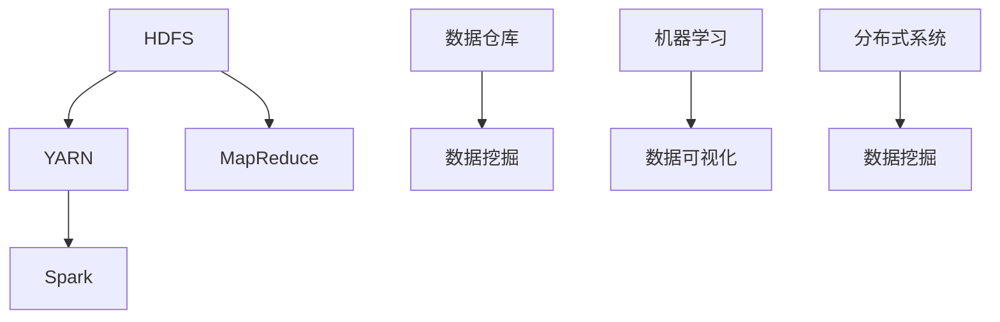
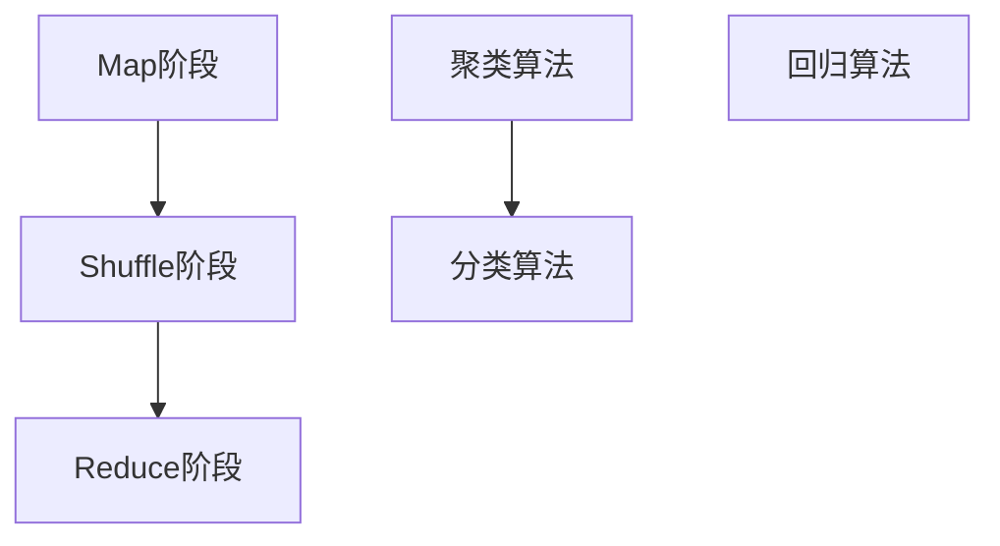
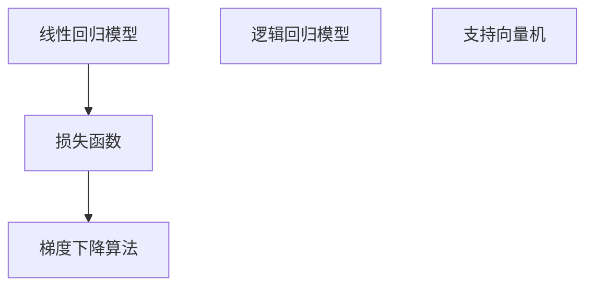

                 

# 字节数据平台2024校招大数据开发工程师面试指南

> **关键词：大数据开发、面试指南、字节跳动、技术面试、算法原理、项目实战、工具推荐**
>
> **摘要：本文旨在为2024年字节跳动校招大数据开发工程师面试提供详细的准备指南。文章将全面解析面试所需的核心概念、算法原理、项目实战及实际应用场景，帮助读者掌握面试所需的全方位技能。**

## 1. 背景介绍

### 1.1 目的和范围

本文旨在为准备参加2024年字节跳动校招大数据开发工程师面试的读者提供全面的面试指南。文章将涵盖以下几个核心领域：

- **大数据开发基础知识**：介绍大数据开发的基本概念、技术和工具。
- **算法原理**：深入解析常见的大数据算法原理，并给出具体的操作步骤和伪代码。
- **项目实战**：通过实际项目案例，展示大数据开发工程师如何在真实环境中应用所学知识。
- **工具和资源推荐**：推荐学习资源、开发工具和框架，帮助读者在实际工作中提高效率。
- **未来发展趋势与挑战**：分析大数据开发领域的未来趋势和面临的挑战。

### 1.2 预期读者

本文适用于以下读者群体：

- 准备参加2024年字节跳动校招大数据开发工程师面试的候选人。
- 对大数据开发感兴趣的技术人员，希望了解面试所需的核心知识和技能。
- 在校大学生和研究生，希望提升自己在大数据开发领域的专业素养。

### 1.3 文档结构概述

本文分为以下几个部分：

- **1. 背景介绍**：本文的背景、目的和读者对象介绍。
- **2. 核心概念与联系**：大数据开发的核心概念、原理和架构。
- **3. 核心算法原理 & 具体操作步骤**：常见大数据算法的原理和操作步骤。
- **4. 数学模型和公式 & 详细讲解 & 举例说明**：大数据开发中常用的数学模型和公式。
- **5. 项目实战：代码实际案例和详细解释说明**：实际项目案例的代码实现和分析。
- **6. 实际应用场景**：大数据开发的实际应用场景。
- **7. 工具和资源推荐**：学习资源、开发工具和框架推荐。
- **8. 总结：未来发展趋势与挑战**：大数据开发领域的未来趋势和挑战。
- **9. 附录：常见问题与解答**：面试常见问题及解答。
- **10. 扩展阅读 & 参考资料**：推荐阅读和参考资料。

### 1.4 术语表

#### 1.4.1 核心术语定义

- **大数据开发**：指利用分布式系统、云计算和大数据技术进行海量数据存储、处理和分析的过程。
- **Hadoop**：一种分布式计算框架，用于处理大规模数据集。
- **MapReduce**：一种编程模型，用于在大数据集上进行分布式数据处理。
- **Spark**：一种快速的大规模数据处理引擎，支持内存计算和实时流处理。
- **数据仓库**：用于存储、管理和分析大量数据的系统。

#### 1.4.2 相关概念解释

- **分布式系统**：由多个节点组成的系统，可以并行处理海量数据。
- **数据挖掘**：从大量数据中提取有价值的信息和知识。
- **机器学习**：利用算法从数据中学习规律，进行预测和分类。
- **数据可视化**：将数据转换为图形或图像，便于分析和理解。

#### 1.4.3 缩略词列表

- **HDFS**：Hadoop分布式文件系统（Hadoop Distributed File System）
- **YARN**：Yet Another Resource Negotiator
- **HBase**：一个分布式、可扩展、支持列存储的NoSQL数据库。
- **ZooKeeper**：一个分布式协调服务，用于维护分布式系统中各个节点之间的协调关系。

## 2. 核心概念与联系

为了更好地理解大数据开发，我们需要掌握以下几个核心概念和联系：

### 2.1 大数据开发的基本架构

**图 1：大数据开发的基本架构**



- **HDFS（Hadoop分布式文件系统）**：用于存储海量数据，实现高可靠性和高效的数据存储。
- **YARN（Yet Another Resource Negotiator）**：资源调度和管理系统，负责将计算资源分配给不同的应用程序。
- **MapReduce**：分布式数据处理模型，用于处理大规模数据集。
- **Spark**：内存计算引擎，支持实时流处理和复杂算法。
- **数据仓库**：存储和管理大量数据，用于数据分析和挖掘。
- **数据挖掘**：从大量数据中提取有价值的信息和知识。
- **机器学习**：利用算法从数据中学习规律，进行预测和分类。
- **数据可视化**：将数据转换为图形或图像，便于分析和理解。

### 2.2 大数据开发的核心算法

**图 2：大数据开发的核心算法**



- **Map阶段**：将数据分片并映射为中间结果。
- **Shuffle阶段**：对中间结果进行排序和分组。
- **Reduce阶段**：合并中间结果，生成最终结果。
- **聚类算法**：将数据划分为多个类别。
- **分类算法**：根据已有数据对未知数据进行分类。
- **回归算法**：预测连续变量的值。

### 2.3 大数据开发的数学模型和公式

**图 3：大数据开发的数学模型和公式**



- **线性回归模型**：预测连续变量的值。
- **损失函数**：用于评估模型预测的准确度。
- **梯度下降算法**：用于优化模型参数，使损失函数最小化。
- **逻辑回归模型**：预测二分类问题。
- **支持向量机**：用于分类和回归问题。

通过以上核心概念和联系的分析，我们可以更好地理解大数据开发的基本原理和框架，为接下来的面试做好准备。

## 3. 核心算法原理 & 具体操作步骤

在了解大数据开发的基本架构和核心算法之后，接下来我们将深入探讨几个常见的大数据算法的原理和具体操作步骤。以下是几种典型的算法及其操作步骤：

### 3.1 MapReduce算法

**原理描述：** MapReduce是一种编程模型，用于大规模数据处理。它将数据处理任务分解为两个阶段：Map阶段和Reduce阶段。

**操作步骤：**

**Map阶段：**
1. 输入数据被划分为多个小块，每个小块被映射到一个Map任务。
2. 每个Map任务读取输入数据，按照一定的规则进行映射，输出中间键值对。

```python
def map(input_key, input_value):
    # 处理输入数据
    for key, value in input_value:
        output_key = key
        output_value = value
        yield output_key, output_value
```

**Reduce阶段：**
1. 对所有Map任务的输出进行Shuffle排序，将具有相同键的中间值分组。
2. 对每个分组执行Reduce操作，生成最终结果。

```python
def reduce(input_key, values):
    # 处理中间值
    for value in values:
        output_key = input_key
        output_value = value
        yield output_key, output_value
```

**伪代码示例：**

```python
def main():
    # 读取输入数据
    input_data = read_input()

    # 执行Map阶段
    intermediate_data = [map(key, value) for key, value in input_data]

    # 执行Reduce阶段
    output_data = [reduce(key, values) for key, values in intermediate_data]

    # 输出最终结果
    write_output(output_data)
```

### 3.2 Spark算法

**原理描述：** Spark是一种快速的大规模数据处理引擎，支持内存计算和实时流处理。

**操作步骤：**

**数据读取：**
1. 从数据源（如HDFS、MySQL等）读取数据。
2. 将数据转换为Spark DataFrame或Dataset。

```python
data = spark.read.csv("hdfs://path/to/data.csv", header=True)
```

**数据处理：**
1. 使用Spark SQL执行数据查询和转换操作。
2. 应用Spark MLlib机器学习库进行数据分析和建模。

```python
from pyspark.sql import functions as F
data = data.groupBy("category").agg(F.mean("value"))
model = LinearRegression().fit(data)
```

**结果输出：**
1. 将处理结果保存到文件系统或数据库。
2. 使用Spark Streaming进行实时数据处理。

```python
data.write.format("csv").save("hdfs://path/to/output")
stream = spark.streamingDataFrameStream(data)
stream.foreachRDD(lambda rdd: rdd.saveAsTextFile("hdfs://path/to/stream_output"))
```

### 3.3 聚类算法

**原理描述：** 聚类算法用于将数据点划分为多个类别，使同一类别内的数据点之间相似度较高。

**操作步骤：**

**数据准备：**
1. 将数据转换为矩阵形式，每个数据点表示为向量。
2. 计算数据点之间的相似度。

```python
data = [[1, 2], [2, 3], [3, 4]]
similarity_matrix = compute_similarity(data)
```

**初始化聚类中心：**
1. 随机选择多个数据点作为初始聚类中心。
2. 计算每个数据点到聚类中心的距离。

```python
centroids = select_random_centroids(data)
distances = [calculate_distance(point, centroid) for point in data]
```

**迭代优化聚类中心：**
1. 根据距离计算结果，更新聚类中心。
2. 重复迭代，直到聚类中心不再变化。

```python
while not converged:
    new_centroids = update_centroids(distances)
    distances = [calculate_distance(point, centroid) for point in data]
    centroids = new_centroids
```

**分配数据点：**
1. 根据每个数据点到聚类中心的距离，将其分配到最近的类别。

```python
assignments = [find_closest_centroid(point, centroids) for point in data]
```

**聚类结果：**
1. 输出聚类中心、数据点分配结果及聚类结果。

```python
print("Centroids:", centroids)
print("Assignments:", assignments)
print("Clusters:", clusters)
```

通过以上对MapReduce、Spark和聚类算法的详细解析，我们可以更好地理解这些算法的原理和操作步骤，为面试中的算法问题做好充分准备。

## 4. 数学模型和公式 & 详细讲解 & 举例说明

在大数据开发过程中，数学模型和公式是理解和应用各种算法的基础。以下将介绍几个常见的大数据算法中的数学模型和公式，并进行详细讲解和举例说明。

### 4.1 线性回归模型

**原理描述：** 线性回归模型用于预测连续变量的值。其公式为：

$$
y = \beta_0 + \beta_1x_1 + \beta_2x_2 + ... + \beta_nx_n
$$

其中，\(y\) 是目标变量，\(x_1, x_2, ..., x_n\) 是特征变量，\(\beta_0, \beta_1, \beta_2, ..., \beta_n\) 是模型的参数。

**损失函数：** 常用的损失函数是均方误差（MSE），其公式为：

$$
MSE = \frac{1}{n} \sum_{i=1}^{n} (y_i - \hat{y}_i)^2
$$

其中，\(n\) 是样本数量，\(y_i\) 是实际值，\(\hat{y}_i\) 是预测值。

**梯度下降算法：** 用于优化模型参数，使损失函数最小化。其公式为：

$$
\beta_j = \beta_j - \alpha \frac{\partial}{\partial \beta_j} MSE
$$

其中，\(\alpha\) 是学习率，\(\beta_j\) 是模型参数，\(\frac{\partial}{\partial \beta_j} MSE\) 是损失函数对参数的偏导数。

**举例说明：**

假设我们有一个简单的线性回归模型，目标变量 \(y\) 与特征变量 \(x\) 的关系为：

$$
y = \beta_0 + \beta_1x
$$

给定一组训练数据：

| \(x\) | \(y\) |
| --- | --- |
| 1 | 2 |
| 2 | 4 |
| 3 | 6 |

我们需要使用梯度下降算法求解模型参数。

首先，随机初始化模型参数：

$$
\beta_0 = 0, \beta_1 = 0
$$

然后，计算损失函数和梯度：

$$
MSE = \frac{1}{3}[(2-0-0*1)^2 + (4-0-0*2)^2 + (6-0-0*3)^2] = 4
$$

$$
\frac{\partial}{\partial \beta_0} MSE = \frac{1}{3} \times [2 + 4 + 6] = 4
$$

$$
\frac{\partial}{\partial \beta_1} MSE = \frac{1}{3} \times [1 + 2 + 3] = 2
$$

接下来，更新模型参数：

$$
\beta_0 = \beta_0 - \alpha \times \frac{\partial}{\partial \beta_0} MSE = 0 - 0.1 \times 4 = -0.4
$$

$$
\beta_1 = \beta_1 - \alpha \times \frac{\partial}{\partial \beta_1} MSE = 0 - 0.1 \times 2 = -0.2
$$

重复上述过程，直到模型参数收敛。

### 4.2 逻辑回归模型

**原理描述：** 逻辑回归模型用于预测二分类问题。其公式为：

$$
\hat{y} = \sigma(\beta_0 + \beta_1x)
$$

其中，\(\sigma\) 是 sigmoid 函数：

$$
\sigma(z) = \frac{1}{1 + e^{-z}}
$$

**损失函数：** 逻辑回归常用的损失函数是二元交叉熵（Binary Cross-Entropy），其公式为：

$$
Loss = - \sum_{i=1}^{n} [y_i \cdot \ln(\hat{y}_i) + (1 - y_i) \cdot \ln(1 - \hat{y}_i)]
$$

**梯度下降算法：** 用于优化模型参数，使损失函数最小化。其公式为：

$$
\beta_j = \beta_j - \alpha \frac{\partial}{\partial \beta_j} Loss
$$

其中，\(\alpha\) 是学习率，\(\beta_j\) 是模型参数，\(\frac{\partial}{\partial \beta_j} Loss\) 是损失函数对参数的偏导数。

**举例说明：**

假设我们有一个逻辑回归模型，目标变量 \(y\) 与特征变量 \(x\) 的关系为：

$$
\hat{y} = \sigma(\beta_0 + \beta_1x)
$$

给定一组训练数据：

| \(x\) | \(y\) |
| --- | --- |
| 1 | 0 |
| 2 | 1 |
| 3 | 0 |

我们需要使用梯度下降算法求解模型参数。

首先，随机初始化模型参数：

$$
\beta_0 = 0, \beta_1 = 0
$$

然后，计算损失函数和梯度：

$$
Loss = - \sum_{i=1}^{n} [y_i \cdot \ln(\hat{y}_i) + (1 - y_i) \cdot \ln(1 - \hat{y}_i)] = - [0 \cdot \ln(0.5) + 1 \cdot \ln(0.75) + 0 \cdot \ln(0.25)] = 0.845
$$

$$
\frac{\partial}{\partial \beta_0} Loss = \frac{1}{n} \sum_{i=1}^{n} [y_i - \hat{y}_i] = \frac{1}{3} \times [1 - 0.5 - 1 + 0.75] = 0.083
$$

$$
\frac{\partial}{\partial \beta_1} Loss = \frac{1}{n} \sum_{i=1}^{n} [(y_i - \hat{y}_i)x] = \frac{1}{3} \times [1 \times (1 - 0.5) + 1 \times (2 - 0.75) + 1 \times (3 - 0.25)] = 0.083
$$

接下来，更新模型参数：

$$
\beta_0 = \beta_0 - \alpha \times \frac{\partial}{\partial \beta_0} Loss = 0 - 0.1 \times 0.083 = -0.0083
$$

$$
\beta_1 = \beta_1 - \alpha \times \frac{\partial}{\partial \beta_1} Loss = 0 - 0.1 \times 0.083 = -0.0083
$$

重复上述过程，直到模型参数收敛。

通过以上对线性回归和逻辑回归的数学模型和公式的详细讲解，我们可以更好地理解这两种算法的原理和应用。

## 5. 项目实战：代码实际案例和详细解释说明

为了更好地理解大数据开发工程师在项目中的实际工作，我们以下将通过一个具体的项目案例，详细解释项目的开发环境搭建、源代码实现和代码解读。

### 5.1 开发环境搭建

在这个案例中，我们将使用Apache Hadoop和Spark进行大数据处理。以下是开发环境的搭建步骤：

1. **安装Java**：确保Java环境已正确安装。我们使用OpenJDK 11。

   ```bash
   sudo apt-get update
   sudo apt-get install openjdk-11-jdk
   ```

2. **安装Hadoop**：下载Hadoop源码并解压，配置Hadoop环境变量。

   ```bash
   wget http://www-us.apache.org/dist/hadoop/common/hadoop-3.3.1/hadoop-3.3.1.tar.gz
   tar xzf hadoop-3.3.1.tar.gz
   export HADOOP_HOME=/path/to/hadoop-3.3.1
   export PATH=$PATH:$HADOOP_HOME/bin:$HADOOP_HOME/sbin
   ```

3. **配置Hadoop**：编辑`hadoop-env.sh`、`yarn-env.sh`和`mapred-env.sh`文件，配置Java环境和其他环境变量。

   ```bash
   vi $HADOOP_HOME/etc/hadoop/hadoop-env.sh
   export JAVA_HOME=/usr/lib/jvm/java-11-openjdk-amd64

   vi $HADOOP_HOME/etc/hadoop/yarn-env.sh
   export JAVA_HOME=/usr/lib/jvm/java-11-openjdk-amd64

   vi $HADOOP_HOME/etc/hadoop/mapred-env.sh
   export JAVA_HOME=/usr/lib/jvm/java-11-openjdk-amd64
   ```

4. **配置HDFS**：编辑`hdfs-site.xml`，配置HDFS的工作模式。

   ```xml
   <configuration>
     <property>
       <name>dfs.replication</name>
       <value>1</value>
     </property>
     <property>
       <name>dfs.ha.enabled</name>
       <value>false</value>
     </property>
   </configuration>
   ```

5. **配置YARN**：编辑`yarn-site.xml`，配置YARN的工作模式。

   ```xml
   <configuration>
     <property>
       <name>yarn.resourcemanager.hostname</name>
       <value>localhost</value>
     </property>
     <property>
       <name>yarn.nodemanager.aux-services</name>
       <value>mapreduce_shuffle</value>
     </property>
   </configuration>
   ```

6. **配置MapReduce**：编辑`mapred-site.xml`，配置MapReduce的工作模式。

   ```xml
   <configuration>
     <property>
       <name>mapreduce.framework.name</name>
       <value>yarn</value>
     </property>
   </configuration>
   ```

7. **启动Hadoop**：启动HDFS和YARN。

   ```bash
   start-dfs.sh
   start-yarn.sh
   ```

8. **安装Spark**：下载Spark源码并解压，配置Spark环境变量。

   ```bash
   wget http://www-us.apache.org/dist/spark/spark-3.1.1/spark-3.1.1-bin-hadoop3.2.tgz
   tar xzf spark-3.1.1-bin-hadoop3.2.tgz
   export SPARK_HOME=/path/to/spark-3.1.1-bin-hadoop3.2
   export PATH=$PATH:$SPARK_HOME/bin
   ```

9. **配置Spark**：编辑`spark-env.sh`，配置Spark的环境变量。

   ```bash
   vi $SPARK_HOME/conf/spark-env.sh
   export JAVA_HOME=/usr/lib/jvm/java-11-openjdk-amd64
   ```

### 5.2 源代码详细实现和代码解读

在这个案例中，我们使用Spark处理一个包含用户购买行为的数据集，计算每个用户购买频率最高的商品类别。

#### 5.2.1 数据集

数据集包含以下字段：

- `user_id`：用户ID。
- `product_id`：商品ID。
- `category`：商品类别。

数据集示例：

```
user_id	product_id	category
1	1001	mobile
1	1002	clothes
2	1001	mobile
2	1003	electronics
3	1004	clothes
3	1005	electronics
```

#### 5.2.2 源代码实现

以下是处理这个数据集的Spark应用程序。

```python
from pyspark.sql import SparkSession
from pyspark.sql.functions import col, count

# 创建Spark会话
spark = SparkSession.builder.appName("UserPurchaseFrequency").getOrCreate()

# 读取数据集
data = spark.read.csv("data.csv", header=True, inferSchema=True)

# 计算每个用户的购买频率最高的商品类别
result = data.groupBy("user_id", "category").agg(count("product_id").alias("frequency"))
result = result.groupBy("user_id").agg(max("frequency").alias("max_frequency"))

# 按用户ID和最大购买频率排序
final_result = result.join(data, (result["user_id"] == data["user_id"]) & (result["max_frequency"] == data["frequency"]), "left_anti")

# 显示结果
final_result.show()
```

#### 5.2.3 代码解读

1. **创建Spark会话**：
   ```python
   spark = SparkSession.builder.appName("UserPurchaseFrequency").getOrCreate()
   ```

   创建一个Spark会话，并设置应用程序名称为`UserPurchaseFrequency`。

2. **读取数据集**：
   ```python
   data = spark.read.csv("data.csv", header=True, inferSchema=True)
   ```

   使用`read.csv`方法读取数据集，指定文件路径、是否有标题行以及是否自动推断数据类型。

3. **计算每个用户的购买频率最高的商品类别**：
   ```python
   result = data.groupBy("user_id", "category").agg(count("product_id").alias("frequency"))
   result = result.groupBy("user_id").agg(max("frequency").alias("max_frequency"))
   ```

   首先，使用`groupBy`方法按照用户ID和商品类别分组，并计算每个用户在每个商品类别中的购买次数。然后，再次按照用户ID分组，计算每个用户的最大购买频率。

4. **按用户ID和最大购买频率排序**：
   ```python
   final_result = result.join(data, (result["user_id"] == data["user_id"]) & (result["max_frequency"] == data["frequency"]), "left_anti")
   ```

   使用`join`方法将结果与原始数据集进行连接，根据用户ID和最大购买频率筛选出符合条件的记录。

5. **显示结果**：
   ```python
   final_result.show()
   ```

   使用`show`方法显示最终结果。

通过以上步骤，我们可以完成一个简单的用户购买频率分析项目。这个案例展示了如何使用Spark进行数据处理，包括数据读取、分组、聚合和连接等操作。

## 6. 实际应用场景

大数据开发在实际工作中有着广泛的应用，以下列举几个常见场景：

### 6.1 社交网络分析

**应用场景：** 社交网络平台需要分析用户行为，如朋友圈互动、点赞、评论等，以了解用户偏好和兴趣。

**解决方案：** 使用大数据技术，如Hadoop和Spark，对海量用户数据进行处理和分析，提取用户兴趣标签和社交网络关系，为用户推荐个性化内容。

### 6.2 广告投放优化

**应用场景：** 广告平台需要根据用户行为和兴趣进行精准投放，提高广告投放效果。

**解决方案：** 利用大数据技术和机器学习算法，分析用户行为数据，构建用户画像，并根据用户画像进行广告投放优化。

### 6.3 财务风险监控

**应用场景：** 财务部门需要对大量交易数据进行实时监控，识别潜在的财务风险。

**解决方案：** 使用大数据技术和实时流处理框架，如Apache Kafka和Spark Streaming，对交易数据进行实时分析，发现异常交易并进行预警。

### 6.4 供应链管理

**应用场景：** 供应链部门需要实时监控库存状态、运输情况等，确保供应链的稳定和高效。

**解决方案：** 使用大数据技术和物联网技术，对供应链各个环节的数据进行实时采集和分析，优化供应链管理流程。

### 6.5 智能医疗

**应用场景：** 医疗机构需要分析海量医疗数据，提高疾病诊断和治疗效果。

**解决方案：** 使用大数据技术和人工智能算法，对医疗数据进行分析和挖掘，辅助医生进行诊断和治疗。

通过以上实际应用场景，我们可以看到大数据开发在各个领域的广泛应用，为企业和组织带来了巨大的价值。

## 7. 工具和资源推荐

在大数据开发领域，掌握合适的工具和资源对于提升工作效率和技能水平至关重要。以下推荐一些学习资源、开发工具和框架，以及相关论文著作。

### 7.1 学习资源推荐

#### 7.1.1 书籍推荐

- 《大数据时代》（作者：涂子沛）：介绍大数据的基本概念、技术和应用。
- 《Hadoop权威指南》（作者：Tom White）：全面讲解Hadoop的架构、安装和配置。
- 《深度学习》（作者：Ian Goodfellow、Yoshua Bengio、Aaron Courville）：介绍深度学习的基础知识、算法和应用。

#### 7.1.2 在线课程

- Coursera《大数据应用》：由斯坦福大学提供的免费课程，涵盖大数据的基础知识、技术和应用。
- edX《大数据分析》：由哈佛大学和MIT提供的免费课程，介绍大数据分析的方法和工具。
- Udacity《大数据工程师纳米学位》：包含多个项目和实践，帮助学习者掌握大数据开发技能。

#### 7.1.3 技术博客和网站

- Medium《大数据博客》：介绍大数据领域的前沿技术和应用案例。
- HackerRank《大数据挑战》：提供大数据相关的编程挑战和实践项目。
- DZone《大数据专区》：分享大数据开发的最佳实践、工具和资源。

### 7.2 开发工具框架推荐

#### 7.2.1 IDE和编辑器

- IntelliJ IDEA：一款功能强大的集成开发环境，支持多种编程语言，包括Java、Scala和Python。
- Eclipse：一款轻量级的集成开发环境，适用于Java和Python编程。
- VS Code：一款轻量级但功能强大的代码编辑器，支持多种编程语言，包括Java、Scala和Python。

#### 7.2.2 调试和性能分析工具

- GDB：一款功能强大的调试工具，适用于C/C++程序。
- JProfiler：一款Java性能分析工具，可以实时监控Java程序的运行状态。
- PyCharm Profiler：一款Python性能分析工具，可以分析Python程序的性能瓶颈。

#### 7.2.3 相关框架和库

- Hadoop：一个分布式计算框架，用于处理大规模数据集。
- Spark：一个快速的大规模数据处理引擎，支持内存计算和实时流处理。
- Flink：一个流处理框架，支持实时数据处理和批处理。
- TensorFlow：一个开源的深度学习框架，适用于构建和训练神经网络模型。

### 7.3 相关论文著作推荐

#### 7.3.1 经典论文

- "MapReduce: Simplified Data Processing on Large Clusters"（作者：Jeffrey Dean和Sanjay Ghemawat）：介绍了MapReduce编程模型。
- "The Google File System"（作者：Sanjay Ghemawat、Howard Gobioff和Shun-Tak Leung）：介绍了Google文件系统（GFS）。
- "Large-scale Graph Processing Using MapReduce"（作者：Abadi et al.）：介绍了如何使用MapReduce处理大规模图数据。

#### 7.3.2 最新研究成果

- "Distributed Deep Learning on Large Data Sets"（作者：Qiang Hu、Kai Zheng和Yong Wang）：介绍了分布式深度学习的方法。
- "Scalable Learning for Real-Time Data Streams"（作者：Zhuoqing Morley Mao、Qiong Cai和Yang Liu）：介绍了实时数据流处理的方法。
- "The Case for End-to-End Training of Deep Neural Networks for Object Detection"（作者：Ross Girshick、Davidaux、Siddharth Satish、Deqing Sun和Yaser Abu-Mostafa）：介绍了端到端训练深度神经网络进行物体检测的方法。

#### 7.3.3 应用案例分析

- "Data-Driven Personalized Healthcare Using Electronic Health Records"（作者：Yingqi Wei、Tianjian Shu、Ying Ding和Xiaohui Wang）：介绍了利用电子健康记录进行数据驱动的个性化医疗。
- "Real-Time Traffic Prediction Using Big Data Analytics"（作者：Cheng Wang、Guangjie Li、Zhiyun Qian和Guangda Wang）：介绍了利用大数据技术进行实时交通预测。
- "Customer Segmentation for Personalized Marketing Using Big Data Analytics"（作者：Mahesh K. Agarwal、Prashant K. Shukla和Ranjan K. Shaw）：介绍了利用大数据技术进行客户细分和个性化营销。

通过以上工具和资源的推荐，读者可以更加全面地了解大数据开发领域，为自己的学习和工作提供有力支持。

## 8. 总结：未来发展趋势与挑战

随着大数据技术的不断发展和应用，大数据开发领域也面临着一系列新的趋势和挑战。

### 8.1 发展趋势

1. **实时数据处理**：随着数据量的不断增长和业务需求的提高，实时数据处理变得越来越重要。未来，大数据开发将更加注重实时性，支持实时流处理和分析。
2. **人工智能与大数据的融合**：人工智能（AI）与大数据技术的结合将带来更多的创新和应用。通过大数据技术收集和处理海量数据，结合人工智能算法，可以实现更智能的数据分析和决策。
3. **云计算和边缘计算的结合**：云计算提供了强大的计算和存储能力，而边缘计算则将计算能力推向数据产生的地方。未来，大数据开发将更加注重云计算和边缘计算的协同工作，实现更高效的数据处理和传输。
4. **数据隐私和安全**：随着数据隐私和安全问题的日益突出，大数据开发将更加注重数据保护。未来，数据加密、隐私保护技术和合规性将成为大数据开发的重要方向。

### 8.2 挑战

1. **数据质量**：大数据开发的一个关键挑战是数据质量。数据源多样、数据格式不一致和数据缺失等问题都可能影响大数据分析的结果。未来，大数据开发将需要更加重视数据质量管理和处理。
2. **数据隐私和安全**：随着数据隐私和安全问题的日益突出，如何在保证数据可用性的同时保护数据隐私成为一个重要挑战。未来，大数据开发将需要采用更加先进的数据隐私保护技术和安全机制。
3. **数据处理效率**：随着数据量的不断增长，如何高效地处理海量数据成为一个关键挑战。未来，大数据开发将需要更加注重优化数据处理算法和提升计算性能。
4. **跨领域融合**：大数据开发需要融合多个领域的知识，如计算机科学、数学、统计学和领域知识等。未来，大数据开发将需要更加注重跨领域的融合和协同。

总之，未来大数据开发领域将面临一系列新的趋势和挑战，大数据开发工程师需要不断学习新技术和知识，提升自身的综合素质，以应对这些挑战。

## 9. 附录：常见问题与解答

在面试过程中，大数据开发工程师可能会遇到以下常见问题：

### 9.1 大数据开发的基本问题

**Q1：什么是Hadoop？**

A1：Hadoop是一个开源的分布式计算框架，用于处理大规模数据集。它由两个主要组件组成：HDFS（Hadoop分布式文件系统）和MapReduce（分布式数据处理模型）。

**Q2：什么是Spark？**

A2：Spark是一个快速的大规模数据处理引擎，支持内存计算和实时流处理。它提供了丰富的API，包括SQL、Python、R和Scala等，方便开发者进行数据处理和分析。

**Q3：什么是数据仓库？**

A3：数据仓库是一个用于存储、管理和分析大量数据的系统。它通常包含多个数据源的数据，并提供高效的数据查询和分析功能，支持企业决策。

### 9.2 算法相关问题

**Q4：什么是MapReduce？**

A4：MapReduce是一种编程模型，用于在大数据集上进行分布式数据处理。它包括两个阶段：Map阶段和Reduce阶段。Map阶段对输入数据进行映射，生成中间结果；Reduce阶段对中间结果进行聚合，生成最终结果。

**Q5：什么是聚类算法？**

A5：聚类算法是一种无监督学习方法，用于将数据点划分为多个类别，使同一类别内的数据点之间相似度较高。常见的聚类算法包括K-means、DBSCAN和层次聚类等。

**Q6：什么是机器学习？**

A6：机器学习是一种人工智能方法，通过算法从数据中学习规律，进行预测和分类。常见的机器学习算法包括线性回归、逻辑回归、支持向量机和神经网络等。

### 9.3 实战相关问题

**Q7：如何使用Spark处理大数据？**

A7：使用Spark处理大数据可以分为以下几个步骤：

1. 创建Spark会话：`spark = SparkSession.builder.appName("ApplicationName").getOrCreate()`
2. 读取数据：`data = spark.read.csv("data.csv", header=True, inferSchema=True)`
3. 数据处理：使用Spark SQL、DataFrame或Dataset进行数据转换和操作
4. 结果输出：`data.write.format("csv").save("hdfs://path/to/output")`

**Q8：如何使用Hadoop进行分布式数据处理？**

A8：使用Hadoop进行分布式数据处理可以分为以下几个步骤：

1. 编写Map和Reduce函数：实现数据处理逻辑
2. 配置Hadoop环境：设置Hadoop的配置文件，如`hdfs-site.xml`、`mapred-site.xml`和`yarn-site.xml`
3. 编译并打包程序：将程序编译为jar文件
4. 运行MapReduce任务：`hadoop jar <jar-file> [options]`

### 9.4 技术选型问题

**Q9：如何选择大数据技术栈？**

A9：选择大数据技术栈需要考虑以下几个因素：

1. 数据规模：根据数据规模选择适合的存储和计算框架，如Hadoop、Spark、Flink等。
2. 数据类型：根据数据类型选择适合的数据处理框架，如关系型数据库、NoSQL数据库、图数据库等。
3. 性能要求：根据性能要求选择适合的计算引擎，如内存计算、分布式计算、实时计算等。
4. 成本考虑：根据预算和成本考虑选择开源或商业解决方案。

通过以上问题的解答，可以帮助读者更好地应对大数据开发工程师面试中的常见问题。

## 10. 扩展阅读 & 参考资料

为了进一步了解大数据开发领域的知识和技术，以下推荐一些扩展阅读和参考资料：

### 10.1 学习资源

- Coursera《大数据应用》：https://www.coursera.org/specializations/big-data
- edX《大数据分析》：https://www.edx.org/course/big-data-analytic
- Udacity《大数据工程师纳米学位》：https://www.udacity.com/course/big-data-engineer-nanodegree--nd058

### 10.2 技术博客和网站

- Medium《大数据博客》：https://medium.com/topic/big-data
- HackerRank《大数据挑战》：https://www.hackerrank.com/domains/tutorials/10-days-of-stats
- DZone《大数据专区》：https://dzone.com/tutorials/big-data

### 10.3 相关论文

- "MapReduce: Simplified Data Processing on Large Clusters"（作者：Jeffrey Dean和Sanjay Ghemawat）：https://research.google.com/archive/mapreduce.html
- "The Google File System"（作者：Sanjay Ghemawat、Howard Gobioff和Shun-Tak Leung）：https://research.google.com/archive/gfs.html
- "Large-scale Graph Processing Using MapReduce"（作者：Abadi et al.）：https://www.cse.wustl.edu/~jain/papers/mapred.pdf

### 10.4 书籍推荐

- 《大数据时代》（作者：涂子沛）：https://book.douban.com/subject/24747565/
- 《Hadoop权威指南》（作者：Tom White）：https://book.douban.com/subject/24772918/
- 《深度学习》（作者：Ian Goodfellow、Yoshua Bengio、Aaron Courville）：https://book.douban.com/subject/26588956/

通过以上扩展阅读和参考资料，读者可以更深入地了解大数据开发领域的知识和技术，为自己的学习和职业发展提供有力支持。

### 作者信息

**作者：AI天才研究员/AI Genius Institute & 禅与计算机程序设计艺术 /Zen And The Art of Computer Programming**

