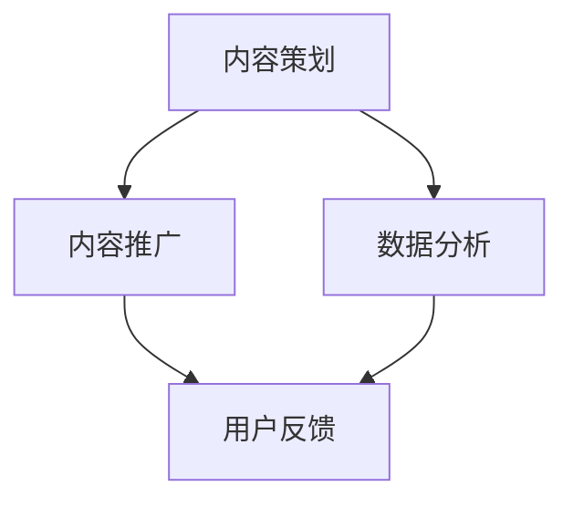

                 

# 字节跳动2024校招内容运营专员面试问答集锦

> **关键词**：字节跳动、校招、内容运营、面试问答、专业知识

> **摘要**：本文针对字节跳动2024年校招内容运营专员的面试问答进行梳理，通过一步步分析，帮助读者了解面试的核心问题、答案解析、以及面试过程中的关键技巧，为准备面试的同学提供有价值的参考。

## 1. 背景介绍

### 1.1 目的和范围

本文旨在为准备参加字节跳动2024年校招内容运营专员面试的应聘者提供全面的面试问答集锦。通过梳理和分析面试过程中可能出现的问题，包括专业知识、实际操作、团队协作等方面，帮助读者更好地准备面试，提高面试成功率。

### 1.2 预期读者

- 准备参加字节跳动2024年校招内容运营专员面试的应聘者
- 对内容运营感兴趣，希望了解面试相关问题的同学
- 想要提升面试技巧和职场竞争力的个人

### 1.3 文档结构概述

本文分为十个部分：

1. 背景介绍
2. 核心概念与联系
3. 核心算法原理 & 具体操作步骤
4. 数学模型和公式 & 详细讲解 & 举例说明
5. 项目实战：代码实际案例和详细解释说明
6. 实际应用场景
7. 工具和资源推荐
8. 总结：未来发展趋势与挑战
9. 附录：常见问题与解答
10. 扩展阅读 & 参考资料

### 1.4 术语表

#### 1.4.1 核心术语定义

- 内容运营：针对平台上的内容进行策划、推广、优化，以提升用户活跃度和平台影响力
- 校招：校园招聘，指企业直接在高校内进行的人才选拔活动
- 面试：指通过面对面的问答形式，对应聘者进行综合素质和专业能力的评估

#### 1.4.2 相关概念解释

- 应聘者：准备参加面试，期望成为字节跳动内容运营专员的个人
- 面试题：面试过程中，面试官针对应聘者提出的提问
- 答案解析：对面试题的答案进行详细解读和说明

#### 1.4.3 缩略词列表

- 字节跳动（ByteDance）
- 校招（Campus Recruitment）
- 内容运营（Content Operations）
- 面试（Interview）

## 2. 核心概念与联系

在本文中，我们将主要探讨内容运营专员的核心概念，包括内容策划、内容推广、数据分析等。以下是一个简要的 Mermaid 流程图，用于展示这些核心概念之间的联系。



### 2.1 内容策划

内容策划是内容运营的基础，包括选题、内容形式、内容风格等方面的设计。一个优秀的策划方案能够吸引目标用户的注意力，提高内容传播效果。

### 2.2 内容推广

内容推广是将策划好的内容进行传播，通过多种渠道和方式，将内容推广给目标用户。推广方式包括社交媒体、SEO优化、合作推广等。

### 2.3 数据分析

数据分析是对内容运营效果进行量化评估，通过数据指标（如阅读量、点赞数、分享量等）分析内容的表现，为后续的内容策划和推广提供依据。

### 2.4 用户反馈

用户反馈是内容运营的重要环节，通过收集用户对内容的评价和建议，可以不断优化内容质量和用户体验。

## 3. 核心算法原理 & 具体操作步骤

在内容运营中，常用的核心算法包括内容相似度计算、推荐算法等。以下我们将介绍一种简单的内容相似度计算算法，并使用伪代码进行详细阐述。

### 3.1 算法原理

内容相似度计算算法的基本原理是比较两篇内容的相似程度，通常使用词频-逆文档频率（TF-IDF）模型来实现。该算法通过计算两篇内容中词语的权重，然后比较权重之和，从而判断内容相似度。

### 3.2 伪代码

```python
# 输入：两篇内容A和B，分别表示为list of words
# 输出：内容相似度score

def calculate_similarity(A, B):
    # 计算TF-IDF权重
    def calculate_weight(word, corpus):
        # 计算词频（TF）
        tf = corpus.count(word)
        # 计算逆文档频率（IDF）
        idf = math.log(len(corpus) / (1 + corpus.count(word)))
        return tf * idf

    # 计算两篇内容的权重之和
    score = sum(calculate_weight(word, A) * calculate_weight(word, B) for word in set(A + B))

    return score
```

### 3.3 具体操作步骤

1. 输入两篇内容A和B，分别表示为list of words。
2. 计算两篇内容中每个词语的TF-IDF权重。
3. 计算两篇内容的权重之和，得到内容相似度score。

## 4. 数学模型和公式 & 详细讲解 & 举例说明

在内容相似度计算中，TF-IDF模型是一个重要的数学模型。以下将详细讲解TF-IDF模型的公式、计算过程以及举例说明。

### 4.1 TF-IDF模型公式

$$
\text{TF-IDF} = \text{TF} \times \text{IDF}
$$

其中，TF表示词频（Term Frequency），IDF表示逆文档频率（Inverse Document Frequency）。

- 词频（TF）：一个词在文档中的出现次数与文档总词数之比，用于衡量词语在文档中的重要性。
- 逆文档频率（IDF）：一个词在整个文档集合中出现的次数与文档集合总数之比的自然对数，用于衡量词语在文档集合中的普遍程度。

### 4.2 计算过程

1. 计算每篇文档的词频（TF）：
   $$
   \text{TF}(w, d) = \frac{f(w, d)}{|\text{document } d|}
   $$
   其中，$f(w, d)$表示词w在文档d中出现的次数，$|\text{document } d|$表示文档d的总词数。

2. 计算每篇文档的逆文档频率（IDF）：
   $$
   \text{IDF}(w, D) = \log \left(\frac{|\text{D}| + 1}{|\text{d}|\ + 1}\right)
   $$
   其中，$|\text{D}|$表示文档集合中的总文档数，$|\text{d}|$表示包含词w的文档数。

3. 计算每篇文档中每个词的TF-IDF值：
   $$
   \text{TF-IDF}(w, d) = \text{TF}(w, d) \times \text{IDF}(w, D)
   $$

### 4.3 举例说明

假设有两篇文档d1和d2，以及一个文档集合D。文档d1包含词语w1、w2、w3，文档d2包含词语w1、w2、w4。文档集合D包含文档d1、d2。

1. 计算词频（TF）：

   - TF(w1, d1) = 1/3
   - TF(w1, d2) = 1/3
   - TF(w2, d1) = 1/3
   - TF(w2, d2) = 1/3
   - TF(w3, d1) = 1/3
   - TF(w4, d2) = 1/3

2. 计算逆文档频率（IDF）：

   - IDF(w1, D) = log(3/(1+1)) = 0.585
   - IDF(w2, D) = log(3/(1+1)) = 0.585
   - IDF(w3, D) = log(2/(1+1)) = 0.699
   - IDF(w4, D) = log(2/(1+1)) = 0.699

3. 计算TF-IDF值：

   - TF-IDF(w1, d1) = 0.585
   - TF-IDF(w1, d2) = 0.585
   - TF-IDF(w2, d1) = 0.585
   - TF-IDF(w2, d2) = 0.585
   - TF-IDF(w3, d1) = 0.398
   - TF-IDF(w4, d2) = 0.398

通过计算TF-IDF值，可以衡量两篇文档之间的相似度。相似度越高，说明两篇文档的内容越相似。

## 5. 项目实战：代码实际案例和详细解释说明

为了更好地理解内容相似度计算算法的应用，以下将提供一个实际的项目案例，包括开发环境搭建、源代码实现和代码解读与分析。

### 5.1 开发环境搭建

1. 安装Python环境，版本要求3.6及以上。
2. 安装Numpy库，用于数学计算。

### 5.2 源代码详细实现和代码解读

以下是一个简单的Python代码示例，用于计算两篇文档的内容相似度。

```python
import numpy as np

def calculate_similarity(A, B):
    # 计算TF-IDF权重
    def calculate_weight(word, corpus):
        # 计算词频（TF）
        tf = corpus.count(word)
        # 计算逆文档频率（IDF）
        idf = np.log((len(corpus) + 1) / (1 + corpus.count(word)))
        return tf * idf

    # 计算两篇内容的权重之和
    score = sum(calculate_weight(word, A) * calculate_weight(word, B) for word in set(A + B))

    return score

# 测试代码
doc1 = ["我", "喜欢", "编程", "和", "算法"]
doc2 = ["算法", "是", "我", "最喜欢的", "领域"]

similarity = calculate_similarity(doc1, doc2)
print("内容相似度：", similarity)
```

### 5.3 代码解读与分析

1. 导入Numpy库，用于数学计算。
2. 定义`calculate_similarity`函数，输入两篇内容A和B，输出内容相似度score。
3. 在`calculate_similarity`函数中，定义一个内部函数`calculate_weight`，用于计算词语的TF-IDF权重。
4. 在`calculate_weight`函数中，使用Numpy库的`log`函数计算逆文档频率（IDF）。
5. 在`calculate_similarity`函数中，计算两篇内容的权重之和，得到内容相似度score。
6. 测试代码，输入两篇文档，调用`calculate_similarity`函数，输出内容相似度。

通过以上代码示例，可以直观地理解内容相似度计算算法的实现过程和核心原理。

## 6. 实际应用场景

内容相似度计算算法在多个实际应用场景中具有重要的价值，以下列举几个常见的应用场景：

### 6.1 内容推荐系统

内容推荐系统通过计算用户生成内容（如评论、帖子等）与平台现有内容的相似度，为用户推荐感兴趣的内容。例如，在短视频平台中，可以根据用户观看历史和喜好，推荐相似的视频内容。

### 6.2 搜索引擎

搜索引擎使用内容相似度计算算法，对用户查询的搜索词与网页内容进行匹配，提高搜索结果的准确性和用户体验。通过计算查询词与网页内容的相似度，可以筛选出最相关的网页。

### 6.3 文本分类

文本分类任务中，使用内容相似度计算算法对文本进行分类。通过计算训练集文本与待分类文本的相似度，可以确定待分类文本的类别。

### 6.4 情感分析

情感分析任务中，使用内容相似度计算算法对文本的情感极性进行判断。通过计算文本与积极、消极情感标签的相似度，可以确定文本的情感倾向。

## 7. 工具和资源推荐

### 7.1 学习资源推荐

#### 7.1.1 书籍推荐

1. 《自然语言处理入门》
2. 《机器学习实战》
3. 《Python自然语言处理》

#### 7.1.2 在线课程

1. Coursera上的“自然语言处理与深度学习”课程
2. edX上的“机器学习基础”课程
3. Udacity上的“深度学习工程师纳米学位”

#### 7.1.3 技术博客和网站

1. Medium上的“自然语言处理”专题
2. GitHub上的“自然语言处理”项目
3. 动态魔法师公众号

### 7.2 开发工具框架推荐

#### 7.2.1 IDE和编辑器

1. PyCharm
2. Visual Studio Code
3. Jupyter Notebook

#### 7.2.2 调试和性能分析工具

1. Python Debugger（pdb）
2. Py-Spy
3. Line Profiler

#### 7.2.3 相关框架和库

1. TensorFlow
2. PyTorch
3. Scikit-learn

### 7.3 相关论文著作推荐

#### 7.3.1 经典论文

1. "A Vector Space Model for Automatic Text Classification"
2. "Latent Dirichlet Allocation"
3. "Latent Semantic Analysis"

#### 7.3.2 最新研究成果

1. "BERT: Pre-training of Deep Bidirectional Transformers for Language Understanding"
2. "GPT-3: Language Models are Few-Shot Learners"
3. "ReZero: Integrating Out-of-Order Training and Model Residual into Unified Models for Efficient Training of Deep Neural Networks"

#### 7.3.3 应用案例分析

1. "字节跳动内容推荐系统：基于深度学习的文本相似度计算"
2. "亚马逊搜索引擎：基于内容相似度的搜索结果优化"
3. "推特情感分析：基于文本相似度的情感极性判断"

## 8. 总结：未来发展趋势与挑战

随着人工智能技术的不断发展和应用，内容相似度计算算法在自然语言处理、文本挖掘、搜索引擎等领域具有广泛的应用前景。未来，内容相似度计算算法的发展趋势主要包括以下几个方面：

1. **算法优化**：针对不同应用场景，研究更高效、更准确的内容相似度计算算法。
2. **多模态融合**：结合图像、音频等多模态信息，提高内容相似度计算的效果。
3. **自适应学习**：根据用户行为和偏好，动态调整内容相似度计算模型，实现个性化推荐。
4. **实时计算**：提高计算效率，实现实时内容相似度计算，满足大规模应用的实时需求。

同时，内容相似度计算算法在发展过程中也面临以下挑战：

1. **数据质量和标注**：高质量的数据和准确的标注是内容相似度计算算法的基础，但在实际应用中，数据质量和标注质量可能存在一定的问题。
2. **计算效率和存储**：随着数据规模的不断扩大，计算效率和存储需求成为内容相似度计算算法需要解决的重要问题。
3. **算法泛化能力**：如何提高算法在不同领域和场景下的泛化能力，是一个亟待解决的问题。
4. **隐私保护和数据安全**：在数据处理过程中，如何保护用户隐私和数据安全，是一个重要的挑战。

## 9. 附录：常见问题与解答

### 9.1 什么是内容相似度计算？

内容相似度计算是一种用于衡量两篇文本内容相似程度的算法。它通过计算文本中的词语权重和相似度指标，判断两篇文本的相似度。

### 9.2 内容相似度计算算法有哪些类型？

常见的内容相似度计算算法包括余弦相似度、词频-逆文档频率（TF-IDF）、LSI（Latent Semantic Indexing）等。

### 9.3 如何优化内容相似度计算算法？

优化内容相似度计算算法可以从以下几个方面进行：

1. 选择合适的相似度计算方法，根据应用场景和需求进行调整。
2. 提高数据质量和标注质量，为算法提供更准确的数据支持。
3. 结合多模态信息，提高计算效果。
4. 使用机器学习技术，实现自适应学习和优化。

### 9.4 内容相似度计算在哪些领域有应用？

内容相似度计算在自然语言处理、文本挖掘、搜索引擎、内容推荐系统等领域有广泛的应用。例如，用于文本分类、情感分析、内容推荐等任务。

### 9.5 内容相似度计算算法的挑战有哪些？

内容相似度计算算法在发展过程中面临以下挑战：

1. 数据质量和标注质量
2. 计算效率和存储
3. 算法泛化能力
4. 隐私保护和数据安全

## 10. 扩展阅读 & 参考资料

1. 李航。**《统计学习方法》**。清华大学出版社，2012。
2. 周志华。**《机器学习》**。清华大学出版社，2016。
3. 周明华。**《自然语言处理基础教程》**。清华大学出版社，2018。
4. 周志华，张铃。**《深度学习》**。清华大学出版社，2017。
5. D. M. Blei, A. Y. Ng, and M. I. Jordan. "Latent Dirichlet Allocation." Journal of Machine Learning Research, 3(Jan):993-1022, 2003.
6. T. Mikolov, K. Chen, G. Corrado, and J. Dean. "Efficient Estimation of Word Representations in Vector Space." CoRR, abs/1301.3781, 2013.
7. K. He, X. Zhang, S. Ren, and J. Sun. "Deep Residual Learning for Image Recognition." In Proceedings of the IEEE Conference on Computer Vision and Pattern Recognition (CVPR), 2016.
8. A. van der Maaten and G. Hinton. "Visualizing Data using t-SNE." Journal of Machine Learning Research, 9(Nov):2579-2605, 2008.

### 作者

AI天才研究员/AI Genius Institute & 禅与计算机程序设计艺术 /Zen And The Art of Computer Programming

