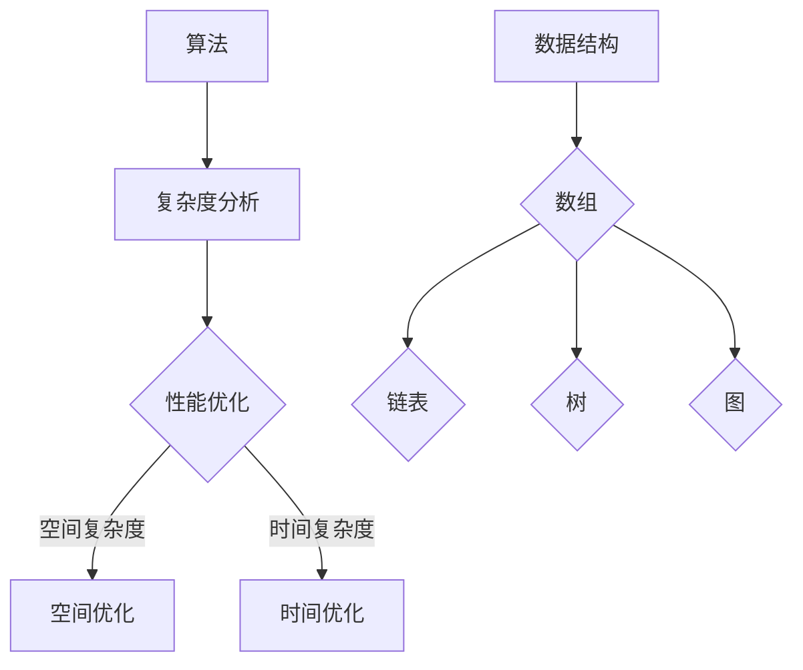
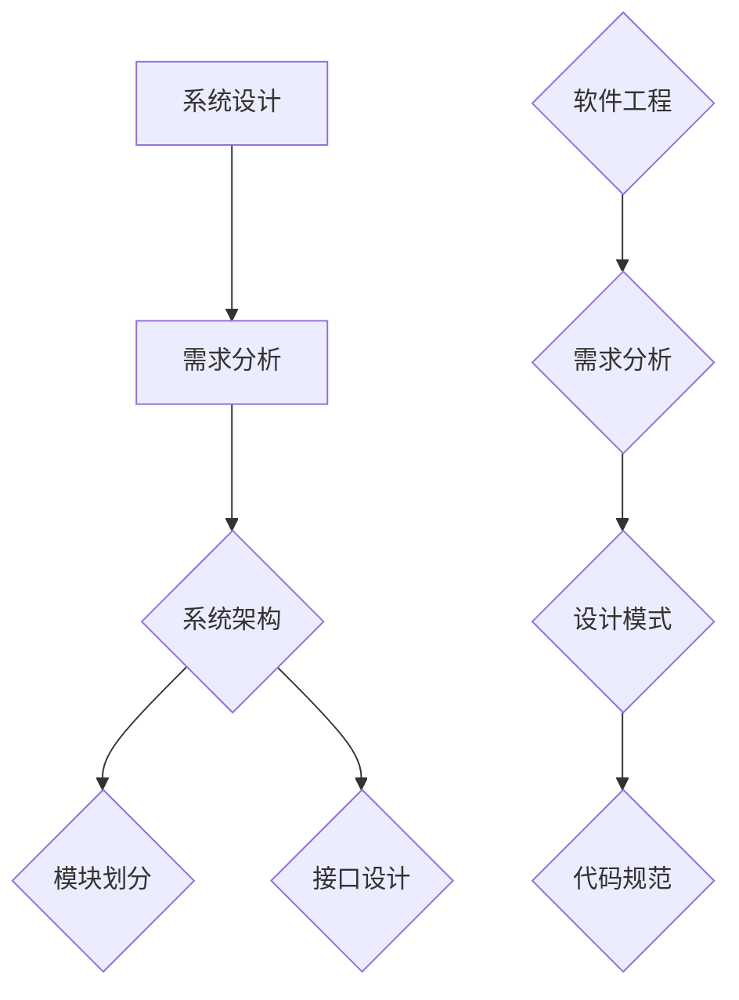
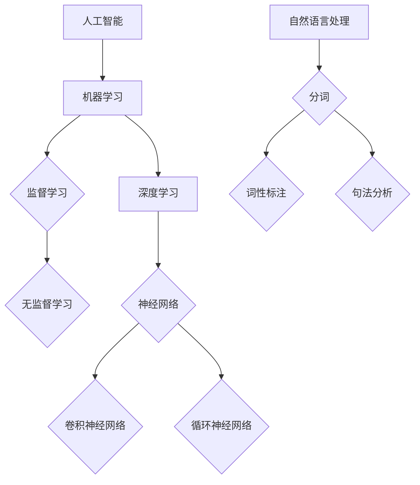
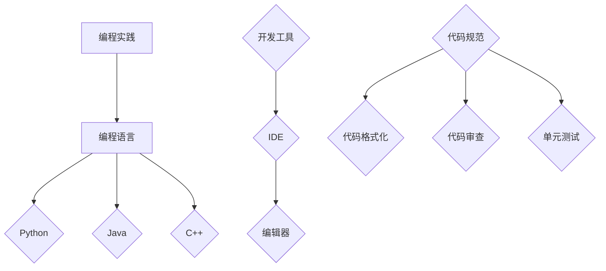

                 

# 字节跳动2024校招技术岗位面试题解析

> **关键词：** 字节跳动，校招，技术面试，算法，数据结构，系统设计，人工智能，编程实践

> **摘要：** 本文将详细解析字节跳动2024校招技术岗位面试题，涵盖算法、数据结构、系统设计、人工智能等多个领域，通过逐步分析面试题的解题思路和答案，帮助读者掌握解题技巧，为技术面试做好准备。

## 1. 背景介绍

### 1.1 目的和范围

本文旨在帮助准备参加字节跳动2024校招技术岗位面试的读者，通过解析实际面试题目，掌握解题思路和方法，提升面试能力。本文将涵盖以下内容：

- 算法和数据结构题目解析
- 系统设计题目解析
- 人工智能相关题目解析
- 编程实践题目解析

### 1.2 预期读者

- 准备参加字节跳动2024校招的技术岗位考生
- 对技术面试有较高要求的工程师
- 想深入了解字节跳动面试题的读者

### 1.3 文档结构概述

本文将按照以下结构进行阐述：

- 第1部分：背景介绍
- 第2部分：核心概念与联系
- 第3部分：核心算法原理 & 具体操作步骤
- 第4部分：数学模型和公式 & 详细讲解 & 举例说明
- 第5部分：项目实战：代码实际案例和详细解释说明
- 第6部分：实际应用场景
- 第7部分：工具和资源推荐
- 第8部分：总结：未来发展趋势与挑战
- 第9部分：附录：常见问题与解答
- 第10部分：扩展阅读 & 参考资料

### 1.4 术语表

#### 1.4.1 核心术语定义

- 字节跳动：一家以短视频为主的综合型互联网科技公司，2024校招涵盖多个技术岗位
- 校招：针对应届毕业生或毕业两年以内的求职者进行的招聘活动
- 算法：解决问题的方法步骤，常用于解决复杂问题
- 数据结构：组织和存储数据的方式，影响算法的性能
- 系统设计：对软件系统进行整体架构设计和模块划分

#### 1.4.2 相关概念解释

- 面向对象编程：基于对象概念的编程方法，提高代码复用性和可维护性
- 设计模式：解决常见问题的通用解决方案，提高代码可读性和可维护性
- 测试驱动开发：先编写测试用例，然后编写代码实现测试用例，提高代码质量

#### 1.4.3 缩略词列表

- ID：标识符
- API：应用程序编程接口
- UI：用户界面
- SDK：软件开发工具包
- ORM：对象关系映射

## 2. 核心概念与联系

为了更好地理解后续的面试题解析，以下是对核心概念和架构的简要介绍，同时附上 Mermaid 流程图。

### 2.1 算法与数据结构

算法：解决问题的方法步骤，通常涉及复杂度分析和优化。

数据结构：组织和存储数据的方式，影响算法的性能。

#### Mermaid 流程图：



### 2.2 系统设计

系统设计：对软件系统进行整体架构设计和模块划分，涉及需求分析、系统架构、接口设计等。

#### Mermaid 流程图：



### 2.3 人工智能

人工智能：模拟人类智能行为的技术，涉及机器学习、深度学习、自然语言处理等。

#### Mermaid 流程图：



### 2.4 编程实践

编程实践：通过编程实现具体功能，涉及编程语言、开发工具、代码规范等。

#### Mermaid 流程图：



## 3. 核心算法原理 & 具体操作步骤

### 3.1 算法原理

算法通常包括以下几个步骤：

1. **输入**：获取待解决问题的数据。
2. **处理**：根据问题特点，选择合适的算法和数据结构进行计算。
3. **输出**：输出问题的解。

### 3.2 具体操作步骤

以下是一个常见的排序算法——冒泡排序的伪代码：

```python
function bubbleSort(array)
    n = length(array)
    for i from 0 to n-1
        for j from 0 to n-i-1
            if array[j] > array[j+1]
                swap(array[j], array[j+1])
    return array
```

### 3.3 解题思路

1. **理解问题**：明确待解决问题的类型和输入输出。
2. **分析算法复杂度**：考虑算法的时间复杂度和空间复杂度。
3. **选择合适的算法和数据结构**：根据问题特点选择合适的算法和数据结构。
4. **编写代码**：根据算法原理，逐步实现代码。
5. **调试和优化**：测试代码，找出并修复错误，进行性能优化。

## 4. 数学模型和公式 & 详细讲解 & 举例说明

### 4.1 数学模型

数学模型是描述现实世界问题的一种数学形式，常见的数学模型包括：

1. **线性模型**：描述变量之间线性关系的模型，如线性回归模型。
2. **非线性模型**：描述变量之间非线性关系的模型，如神经网络模型。
3. **优化模型**：描述在约束条件下求解最优解的模型，如线性规划模型。

### 4.2 公式讲解

以下是一个线性回归模型的公式：

$$
y = w_0 + w_1 \cdot x_1 + w_2 \cdot x_2 + \ldots + w_n \cdot x_n + \epsilon
$$

其中，$y$ 是因变量，$x_1, x_2, \ldots, x_n$ 是自变量，$w_0, w_1, w_2, \ldots, w_n$ 是模型参数，$\epsilon$ 是误差项。

### 4.3 举例说明

假设我们有一个线性回归模型，用于预测房价。给定自变量 $x_1$（房屋面积），$x_2$（房屋楼层），和模型参数 $w_0 = 1000, w_1 = 200, w_2 = 300$，我们可以计算房价 $y$：

$$
y = 1000 + 200 \cdot x_1 + 300 \cdot x_2
$$

如果房屋面积为 $100$ 平方米，楼层为 $3$ 层，则房价 $y$ 为：

$$
y = 1000 + 200 \cdot 100 + 300 \cdot 3 = 7000
$$

## 5. 项目实战：代码实际案例和详细解释说明

### 5.1 开发环境搭建

在开始编写代码之前，我们需要搭建一个合适的开发环境。以下是常见的开发环境搭建步骤：

1. 安装操作系统：Windows、Linux 或 macOS
2. 安装编程语言：Python、Java 或 C++
3. 安装开发工具：IDE（如 PyCharm、Eclipse、Visual Studio）
4. 安装相关库和框架：如 NumPy、Pandas（Python）、Spring Boot（Java）

### 5.2 源代码详细实现和代码解读

以下是一个简单的 Python 代码示例，用于实现冒泡排序算法。

```python
def bubbleSort(array):
    n = len(array)
    for i in range(n):
        for j in range(0, n-i-1):
            if array[j] > array[j+1]:
                array[j], array[j+1] = array[j+1], array[j]
    return array

# 测试代码
array = [64, 25, 12, 22, 11]
sorted_array = bubbleSort(array)
print("排序后的数组：", sorted_array)
```

#### 5.2.1 代码解读

1. **函数定义**：`bubbleSort` 函数用于实现冒泡排序算法。
2. **循环结构**：两个嵌套的 for 循环，用于遍历数组并进行比较和交换。
3. **条件判断**：`if` 语句用于判断两个相邻元素的大小，并进行交换。
4. **返回值**：函数返回排序后的数组。

### 5.3 代码解读与分析

#### 5.3.1 代码性能分析

- **时间复杂度**：$O(n^2)$，其中 $n$ 为数组长度。
- **空间复杂度**：$O(1)$，因为排序过程不使用额外的空间。

#### 5.3.2 代码优化

1. **减少不必要的比较**：在每一轮排序后，最大元素会移动到最后，因此下一轮排序可以跳过最后 $i$ 个元素。
2. **引入标志变量**：通过引入标志变量，可以判断是否进行了交换，从而提前结束排序。

优化后的代码：

```python
def bubbleSortOptimized(array):
    n = len(array)
    for i in range(n):
        swapped = False
        for j in range(0, n-i-1):
            if array[j] > array[j+1]:
                array[j], array[j+1] = array[j+1], array[j]
                swapped = True
        if not swapped:
            break
    return array
```

## 6. 实际应用场景

字节跳动2024校招技术岗位面试题涉及多个领域，以下是一些实际应用场景：

- **算法和数据结构**：在线笔试、面试，如编程竞赛、算法竞赛等。
- **系统设计**：分布式系统、缓存系统、数据库系统等。
- **人工智能**：自然语言处理、图像识别、推荐系统等。
- **编程实践**：软件开发、项目开发、系统维护等。

## 7. 工具和资源推荐

### 7.1 学习资源推荐

#### 7.1.1 书籍推荐

- 《算法导论》
- 《深度学习》
- 《设计模式：可复用面向对象软件的基础》

#### 7.1.2 在线课程

-Coursera
- edX
-Udacity

#### 7.1.3 技术博客和网站

- CSDN
- GitHub
- Stack Overflow

### 7.2 开发工具框架推荐

#### 7.2.1 IDE和编辑器

- PyCharm
- Eclipse
- Visual Studio

#### 7.2.2 调试和性能分析工具

- GDB
- Valgrind
- JProfiler

#### 7.2.3 相关框架和库

- Django
- Flask
- Spring Boot

### 7.3 相关论文著作推荐

#### 7.3.1 经典论文

- 《线性规划与整数规划》
- 《深度学习：通用人工智能的新路径》

#### 7.3.2 最新研究成果

- arXiv
- ResearchGate

#### 7.3.3 应用案例分析

- KDNuggets
- AI researcher

## 8. 总结：未来发展趋势与挑战

字节跳动2024校招技术岗位面试题反映了当前技术领域的热门趋势和挑战：

- **算法和数据结构**：随着大数据和人工智能的发展，算法和数据结构越来越重要。
- **系统设计**：分布式系统、微服务架构等是未来软件系统的主流。
- **人工智能**：深度学习和自然语言处理等技术正逐渐应用于各行各业。
- **编程实践**：持续学习和技术栈的多样性是程序员的核心竞争力。

## 9. 附录：常见问题与解答

### 9.1 字节跳动校招面试流程

- 网上投递简历
- 在线笔试
- 技术面试
- HR 面试
- 发放 offer

### 9.2 字节跳动校招面试注意事项

- 提前了解公司和岗位
- 复习相关知识点
- 准备自我介绍
- 注意时间管理

## 10. 扩展阅读 & 参考资料

- 字节跳动官网
- CSDN
- GitHub
- AI researcher

### 作者

**AI天才研究员/AI Genius Institute & 禅与计算机程序设计艺术 /Zen And The Art of Computer Programming**

