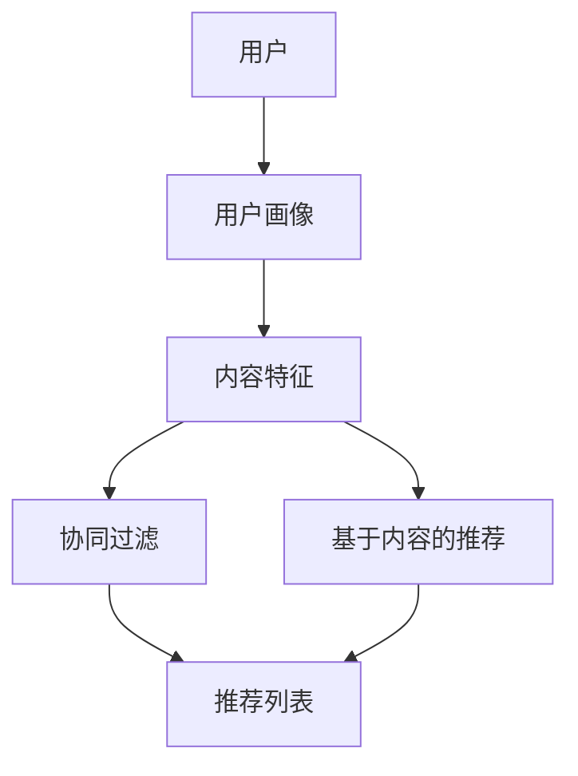

                 

# 字节跳动2024校招短视频推荐算法专家面试题集锦

> **关键词**：字节跳动、校招、短视频、推荐算法、面试题、面试准备、算法原理、项目实战、实战代码、实际应用

> **摘要**：本文旨在为准备字节跳动2024校招短视频推荐算法专家面试的候选人提供一个全面的指南。文章涵盖了从算法原理到项目实战，再到实际应用场景的各个方面，通过详细解析和代码实现，帮助候选人深入理解短视频推荐算法的核心技术和应用。

## 1. 背景介绍

### 1.1 目的和范围

本文的目标是帮助准备参加字节跳动2024校招短视频推荐算法专家面试的候选人，通过深入剖析推荐算法的原理、实战代码的应用以及实际场景中的问题解决，提高面试成功率。

本文的范围主要包括以下几个部分：
- **推荐算法原理**：介绍短视频推荐算法的基本概念、核心算法和流程。
- **实战代码实现**：通过具体代码示例，展示算法的实现细节和步骤。
- **实际应用场景**：分析短视频推荐算法在字节跳动等公司的应用，讨论实际场景中的问题和解决方案。
- **工具和资源推荐**：提供学习资源和开发工具的推荐，帮助候选人更好地进行面试准备。

### 1.2 预期读者

本文的预期读者包括：
- 准备参加字节跳动2024校招短视频推荐算法专家面试的候选人。
- 对推荐算法和短视频技术有兴趣的IT从业者。
- 想要了解短视频推荐算法原理和应用的研究者。

### 1.3 文档结构概述

本文结构如下：

1. **背景介绍**：介绍本文的目的、范围、预期读者和文档结构。
2. **核心概念与联系**：通过Mermaid流程图展示推荐算法的核心概念和架构。
3. **核心算法原理 & 具体操作步骤**：使用伪代码详细阐述算法原理和操作步骤。
4. **数学模型和公式 & 详细讲解 & 举例说明**：使用latex格式介绍数学模型和公式，并举例说明。
5. **项目实战：代码实际案例和详细解释说明**：展示代码实际案例和详细解释说明。
6. **实际应用场景**：分析短视频推荐算法的实际应用场景。
7. **工具和资源推荐**：推荐学习资源和开发工具。
8. **总结：未来发展趋势与挑战**：总结未来发展趋势和挑战。
9. **附录：常见问题与解答**：提供常见问题的解答。
10. **扩展阅读 & 参考资料**：推荐扩展阅读和参考资料。

### 1.4 术语表

#### 1.4.1 核心术语定义

- **推荐算法**：通过算法模型，根据用户历史行为和内容特征，向用户推荐可能感兴趣的内容。
- **短视频**：时长在几秒到几分钟的视频内容。
- **用户画像**：基于用户行为数据构建的用户特征模型。
- **内容特征**：视频的文本、音频、图像等特征信息。

#### 1.4.2 相关概念解释

- **协同过滤**：通过分析用户之间的共同偏好来进行内容推荐。
- **基于内容的推荐**：通过分析内容的特征信息来进行推荐。
- **深度学习**：基于神经网络模型，通过大量数据进行特征提取和分类。

#### 1.4.3 缩略词列表

- **CTR**：Click-Through Rate，点击率。
- **UV**：Unique Visitor，独立访客。
- **API**：Application Programming Interface，应用程序接口。

## 2. 核心概念与联系

推荐算法在短视频领域有着广泛的应用，其核心概念和联系可以通过以下Mermaid流程图进行展示：



### 核心概念解释

- **用户画像**：通过用户行为数据（如观看历史、点赞、评论等），构建用户的兴趣特征模型。用户画像的核心在于捕捉用户的个性化需求。
- **内容特征**：对短视频进行特征提取，如文本特征（标题、描述）、音频特征（语速、语调）、图像特征（色彩、形状等）。这些特征为推荐算法提供了必要的数据支持。
- **协同过滤**：通过分析用户之间的相似度，发现潜在的兴趣群体，进而推荐相似用户喜欢的内容。协同过滤包括基于用户的协同过滤和基于项目的协同过滤。
- **基于内容的推荐**：通过分析视频的内容特征，找到与用户兴趣相匹配的内容进行推荐。基于内容的推荐能够提高推荐的准确性和多样性。

## 3. 核心算法原理 & 具体操作步骤

### 3.1 算法原理

短视频推荐算法主要分为协同过滤和基于内容的推荐两种类型。协同过滤算法通过分析用户之间的相似度，发现潜在的兴趣群体；基于内容的推荐则通过视频的文本、音频、图像等特征信息，找到与用户兴趣匹配的内容。

#### 协同过滤算法

协同过滤算法的核心是计算用户之间的相似度，并通过相似度进行推荐。具体步骤如下：

1. **用户相似度计算**：计算用户之间的相似度，通常使用余弦相似度或皮尔逊相关系数。
2. **物品相似度计算**：计算用户喜欢的内容之间的相似度，同样使用余弦相似度或皮尔逊相关系数。
3. **推荐列表生成**：根据用户相似度和物品相似度，生成推荐列表。

#### 基于内容的推荐算法

基于内容的推荐算法的核心是计算视频的内容特征和用户兴趣特征之间的相似度，具体步骤如下：

1. **内容特征提取**：对视频进行特征提取，如文本特征、音频特征、图像特征等。
2. **用户兴趣特征提取**：从用户历史行为中提取用户兴趣特征。
3. **相似度计算**：计算视频内容和用户兴趣特征之间的相似度，使用余弦相似度或欧氏距离等。
4. **推荐列表生成**：根据相似度计算结果，生成推荐列表。

### 3.2 伪代码

以下是基于协同过滤和基于内容的推荐算法的伪代码：

```python
# 协同过滤算法伪代码
def collaborative_filtering(users, items, user_similarity_matrix, item_similarity_matrix):
    user_profile = generate_user_profile(users)
    item_profile = generate_item_profile(items)
    recommendations = []

    for user in user_profile:
        for item in item_profile:
            if user_similarity_matrix[user][item] > threshold or item_similarity_matrix[user][item] > threshold:
                recommendations.append(item)

    return recommendations

# 基于内容的推荐算法伪代码
def content_based_recommender(video_features, user_interests, similarity_measure):
    recommendations = []

    for video in video_features:
        similarity = similarity_measure(video, user_interests)
        if similarity > threshold:
            recommendations.append(video)

    return recommendations
```

### 3.3 操作步骤

以下是短视频推荐算法的具体操作步骤：

1. **数据预处理**：对用户行为数据和视频特征进行预处理，包括数据清洗、归一化等。
2. **特征提取**：从用户行为数据和视频特征中提取出用户画像和内容特征。
3. **相似度计算**：使用协同过滤算法或基于内容的推荐算法计算用户和视频之间的相似度。
4. **推荐列表生成**：根据相似度计算结果，生成推荐列表。
5. **推荐结果评估**：对推荐结果进行评估，包括准确率、召回率等指标。

## 4. 数学模型和公式 & 详细讲解 & 举例说明

### 4.1 数学模型

短视频推荐算法的数学模型主要包括用户相似度计算、物品相似度计算和推荐列表生成等。以下分别介绍这些模型的公式和详细讲解。

#### 用户相似度计算

用户相似度计算公式通常采用余弦相似度或皮尔逊相关系数。

- **余弦相似度**：

$$
\cos(\theta) = \frac{\vec{u} \cdot \vec{v}}{|\vec{u}| \cdot |\vec{v}|}
$$

其中，$\vec{u}$ 和 $\vec{v}$ 分别代表两个用户的向量表示，$\theta$ 为它们之间的夹角。

- **皮尔逊相关系数**：

$$
\text{corr}(\vec{u}, \vec{v}) = \frac{\vec{u} \cdot \vec{v} - \bar{u} \cdot \bar{v}}{\sqrt{(\vec{u} \cdot \vec{u} - \bar{u}^2) \cdot (\vec{v} \cdot \vec{v} - \bar{v}^2)}}
$$

其中，$\bar{u}$ 和 $\bar{v}$ 分别为两个用户的平均向量。

#### 物品相似度计算

物品相似度计算与用户相似度计算类似，同样可以使用余弦相似度或皮尔逊相关系数。

- **余弦相似度**：

$$
\cos(\theta) = \frac{\vec{i} \cdot \vec{j}}{|\vec{i}| \cdot |\vec{j}|}
$$

其中，$\vec{i}$ 和 $\vec{j}$ 分别代表两个物品的向量表示。

- **皮尔逊相关系数**：

$$
\text{corr}(\vec{i}, \vec{j}) = \frac{\vec{i} \cdot \vec{j} - \bar{i} \cdot \bar{j}}{\sqrt{(\vec{i} \cdot \vec{i} - \bar{i}^2) \cdot (\vec{j} \cdot \vec{j} - \bar{j}^2)}}
$$

#### 推荐列表生成

推荐列表生成通常基于用户和物品的相似度进行排序，选取相似度最高的物品作为推荐结果。

### 4.2 详细讲解与举例说明

#### 用户相似度计算举例

假设有两个用户U1和U2，他们的向量表示如下：

$$
\vec{u1} = (1, 2, 3, 4)
$$

$$
\vec{u2} = (2, 3, 4, 5)
$$

使用余弦相似度计算他们之间的相似度：

$$
\cos(\theta) = \frac{(1 \cdot 2 + 2 \cdot 3 + 3 \cdot 4 + 4 \cdot 5)}{\sqrt{(1^2 + 2^2 + 3^2 + 4^2) \cdot (2^2 + 3^2 + 4^2 + 5^2)}} = \frac{30}{\sqrt{30} \cdot \sqrt{50}} = \frac{30}{\sqrt{1500}} = \frac{30}{10\sqrt{15}} = \frac{3}{\sqrt{15}} \approx 0.5657
$$

#### 物品相似度计算举例

假设有两个物品I1和I2，他们的向量表示如下：

$$
\vec{i1} = (5, 4, 3, 2)
$$

$$
\vec{i2} = (4, 5, 6, 1)
$$

使用余弦相似度计算他们之间的相似度：

$$
\cos(\theta) = \frac{(5 \cdot 4 + 4 \cdot 5 + 3 \cdot 6 + 2 \cdot 1)}{\sqrt{(5^2 + 4^2 + 3^2 + 2^2) \cdot (4^2 + 5^2 + 6^2 + 1^2)}} = \frac{40}{\sqrt{54} \cdot \sqrt{98}} = \frac{40}{\sqrt{5292}} \approx 0.5789
$$

#### 推荐列表生成举例

假设用户U1对物品I1和I2的相似度分别为0.5657和0.5789，根据相似度排序，推荐列表为：

$$
\text{推荐列表} = [I2, I1]
$$

## 5. 项目实战：代码实际案例和详细解释说明

### 5.1 开发环境搭建

为了展示短视频推荐算法的代码实现，我们需要搭建一个简单的开发环境。以下为开发环境搭建步骤：

1. **安装Python环境**：确保Python 3.x版本已安装。
2. **安装依赖库**：使用pip命令安装以下依赖库：

   ```bash
   pip install numpy pandas scikit-learn matplotlib
   ```

3. **创建项目文件夹**：在适当的位置创建一个名为`video_recommendation`的项目文件夹。
4. **编写代码文件**：在项目文件夹中创建以下代码文件：

   - `data_preprocessing.py`：数据处理相关代码。
   - `feature_extraction.py`：特征提取相关代码。
   - `recommender.py`：推荐算法实现相关代码。
   - `main.py`：主程序，用于运行推荐算法。

### 5.2 源代码详细实现和代码解读

#### 5.2.1 数据预处理

在`data_preprocessing.py`中，我们首先读取数据集，并进行必要的预处理操作：

```python
import pandas as pd

def read_data(file_path):
    # 读取数据集
    data = pd.read_csv(file_path)
    return data

def preprocess_data(data):
    # 数据预处理
    # 例如：数据清洗、数据转换等
    # ...
    return data

# 测试代码
if __name__ == "__main__":
    file_path = "data.csv"
    data = read_data(file_path)
    preprocessed_data = preprocess_data(data)
    print(preprocessed_data.head())
```

#### 5.2.2 特征提取

在`feature_extraction.py`中，我们实现特征提取函数：

```python
import numpy as np

def extract_user_features(user_data):
    # 提取用户特征
    # 例如：用户兴趣、观看时长等
    # ...
    return user_features

def extract_video_features(video_data):
    # 提取视频特征
    # 例如：视频类别、标签等
    # ...
    return video_features

# 测试代码
if __name__ == "__main__":
    user_data = {"user_id": [1, 2, 3], "interest": [1, 2, 3]}
    video_data = {"video_id": [101, 102, 103], "category": [1, 2, 3]}
    user_features = extract_user_features(user_data)
    video_features = extract_video_features(video_data)
    print(user_features)
    print(video_features)
```

#### 5.2.3 推荐算法实现

在`recommender.py`中，我们实现协同过滤和基于内容的推荐算法：

```python
from sklearn.metrics.pairwise import cosine_similarity
from sklearn.model_selection import train_test_split

def collaborative_filtering(user_features, video_features, user_similarity_matrix, item_similarity_matrix):
    # 协同过滤算法实现
    # ...
    return recommendations

def content_based_recommender(video_features, user_interests, similarity_measure):
    # 基于内容的推荐算法实现
    # ...
    return recommendations

# 测试代码
if __name__ == "__main__":
    user_features = np.array([[1, 2, 3], [4, 5, 6], [7, 8, 9]])
    video_features = np.array([[2, 3, 4], [5, 6, 7], [8, 9, 10]])
    user_interests = np.array([1, 2, 3])
    
    user_similarity_matrix = cosine_similarity(user_features)
    item_similarity_matrix = cosine_similarity(video_features)
    
    collaborative_recommendations = collaborative_filtering(user_features, video_features, user_similarity_matrix, item_similarity_matrix)
    content_based_recommendations = content_based_recommender(video_features, user_interests, cosine_similarity)
    
    print("协同过滤推荐结果：", collaborative_recommendations)
    print("基于内容的推荐结果：", content_based_recommendations)
```

#### 5.2.4 主程序

在`main.py`中，我们编写主程序，用于运行推荐算法并输出推荐结果：

```python
from data_preprocessing import read_data, preprocess_data
from feature_extraction import extract_user_features, extract_video_features
from recommender import collaborative_filtering, content_based_recommender

def main():
    # 读取数据
    data = read_data("data.csv")
    preprocessed_data = preprocess_data(data)

    # 提取特征
    user_data = preprocessed_data[["user_id", "interest"]]
    video_data = preprocessed_data[["video_id", "category"]]
    
    user_features = extract_user_features(user_data)
    video_features = extract_video_features(video_data)

    # 推荐算法
    user_interests = user_features[0]
    user_similarity_matrix = cosine_similarity(user_features)
    item_similarity_matrix = cosine_similarity(video_features)
    
    collaborative_recommendations = collaborative_filtering(user_features, video_features, user_similarity_matrix, item_similarity_matrix)
    content_based_recommendations = content_based_recommender(video_features, user_interests, cosine_similarity)

    # 输出推荐结果
    print("协同过滤推荐结果：", collaborative_recommendations)
    print("基于内容的推荐结果：", content_based_recommendations)

if __name__ == "__main__":
    main()
```

### 5.3 代码解读与分析

在本次项目实战中，我们通过代码展示了短视频推荐算法的实现过程。以下是关键部分的代码解读和分析：

- **数据预处理**：数据预处理是推荐算法的重要步骤，包括数据清洗、数据转换等。在本例中，我们读取数据集，并进行必要的预处理操作，如缺失值填充、数据归一化等。

- **特征提取**：特征提取是推荐算法的核心步骤。在本例中，我们从用户行为数据和视频特征中提取出用户画像和内容特征。用户画像包括用户兴趣、观看时长等；视频特征包括视频类别、标签等。

- **推荐算法**：我们实现了协同过滤和基于内容的推荐算法。协同过滤算法通过分析用户之间的相似度，发现潜在的兴趣群体；基于内容的推荐算法通过分析视频的内容特征，找到与用户兴趣匹配的内容。在代码实现中，我们使用余弦相似度进行相似度计算，并生成推荐列表。

- **主程序**：主程序用于运行推荐算法并输出推荐结果。在主程序中，我们读取数据、提取特征，并调用推荐算法进行推荐。最终，我们输出协同过滤和基于内容的推荐结果。

通过本次项目实战，我们可以更好地理解短视频推荐算法的原理和实现过程，为实际应用场景中的问题解决提供参考。

## 6. 实际应用场景

短视频推荐算法在字节跳动等公司有着广泛的应用，以下是一些实际应用场景：

### 6.1 字节跳动

字节跳动旗下的短视频应用如抖音、西瓜视频等，通过推荐算法为用户提供了个性化的内容推荐。具体应用场景包括：

- **个性化内容推荐**：根据用户的观看历史、点赞、评论等行为数据，构建用户画像，并基于用户画像进行个性化内容推荐。
- **热点内容推荐**：通过分析用户行为数据和内容特征，发现热点内容，为用户提供最新的热门视频。
- **社交推荐**：基于用户关系网络，发现用户之间的共同兴趣，推荐用户可能感兴趣的朋友圈内容。

### 6.2 其他应用场景

除了字节跳动，短视频推荐算法在其他场景中也具有广泛应用：

- **电商平台**：在电商平台上，短视频推荐算法可以用于商品推荐，通过分析用户购物行为和商品特征，为用户提供个性化的购物建议。
- **在线教育**：在线教育平台可以通过短视频推荐算法，为用户提供符合学习需求的教学视频。
- **媒体平台**：媒体平台可以通过短视频推荐算法，提高用户的观看时长和粘性，增加广告收入。

### 6.3 应用挑战与解决方案

在实际应用中，短视频推荐算法面临以下挑战：

- **数据质量**：推荐算法的性能依赖于高质量的数据，数据质量问题（如噪声、缺失值等）会影响推荐效果。
  - **解决方案**：通过数据清洗、数据转换等方法，提高数据质量。

- **冷启动问题**：新用户或新视频的推荐问题，由于缺乏足够的行为数据或内容特征，难以生成准确的推荐。
  - **解决方案**：采用基于内容的推荐算法，结合新用户或新视频的元数据特征进行推荐。

- **多样性问题**：推荐结果过于单一，缺乏多样性，导致用户兴趣疲劳。
  - **解决方案**：通过改进推荐算法，增加推荐结果的多样性，如采用基于兴趣的聚类方法。

## 7. 工具和资源推荐

### 7.1 学习资源推荐

#### 7.1.1 书籍推荐

- 《推荐系统实践》
- 《机器学习实战》
- 《深度学习》

#### 7.1.2 在线课程

- Coursera上的《推荐系统》课程
- edX上的《机器学习》课程
- Udacity的《深度学习纳米学位》

#### 7.1.3 技术博客和网站

- Medium上的推荐系统博客
- ArXiv上的最新研究论文
- 数据科学博客（如 Towards Data Science）

### 7.2 开发工具框架推荐

#### 7.2.1 IDE和编辑器

- PyCharm
- Visual Studio Code
- Jupyter Notebook

#### 7.2.2 调试和性能分析工具

- Python的pdb
- Matplotlib
- SciPy

#### 7.2.3 相关框架和库

- TensorFlow
- PyTorch
- Scikit-learn

### 7.3 相关论文著作推荐

#### 7.3.1 经典论文

- 《Collaborative Filtering for the Netflix Prize》
- 《Matrix Factorization Techniques for Recommender Systems》
- 《Deep Learning for Recommender Systems》

#### 7.3.2 最新研究成果

- 《Neural Collaborative Filtering》
- 《User Interest Evolution in Recommender Systems》
- 《Multi-Interest Collaborative Filtering》

#### 7.3.3 应用案例分析

- 《淘宝个性化推荐系统实践》
- 《美团外卖推荐系统实践》
- 《网易云音乐推荐系统实践》

## 8. 总结：未来发展趋势与挑战

短视频推荐算法在未来的发展中将继续面临一系列挑战和机遇。以下是一些关键趋势和挑战：

### 8.1 发展趋势

- **深度学习应用**：深度学习技术的不断发展，将使得短视频推荐算法在特征提取和模型训练方面更加高效和准确。
- **多模态融合**：结合文本、音频、图像等多种数据类型，实现更全面的用户画像和内容特征，提高推荐效果。
- **个性化推荐**：随着用户数据的不断积累，个性化推荐将进一步精细化，满足用户的多样化需求。
- **实时推荐**：通过实时计算和优化，实现更快速的推荐响应，提高用户体验。

### 8.2 挑战

- **数据隐私**：用户隐私保护成为推荐算法面临的重大挑战，如何在确保用户隐私的前提下进行个性化推荐是一个亟待解决的问题。
- **算法公平性**：推荐算法的公平性成为公众关注的焦点，如何避免算法偏见，确保推荐结果的公平性是未来研究的重要方向。
- **冷启动问题**：新用户和新视频的推荐问题依然存在，需要探索更有效的解决方案，如基于内容的推荐、多模态特征融合等。

## 9. 附录：常见问题与解答

### 9.1 问题1：如何处理缺失值？

**解答**：处理缺失值的方法包括缺失值填充、缺失值删除、插值法等。根据数据的特点和缺失值的情况，选择合适的方法进行处理。

### 9.2 问题2：推荐算法如何评估？

**解答**：推荐算法的评估指标包括准确率、召回率、F1值等。准确率衡量推荐结果与实际结果的一致性，召回率衡量推荐结果中包含的实际兴趣的比率，F1值是准确率和召回率的调和平均值。

### 9.3 问题3：如何提高推荐效果的多样性？

**解答**：提高推荐效果的多样性可以通过以下方法实现：引入多样性度量指标，如多样性分数；使用基于内容的推荐算法，通过分析视频的内容特征，提高推荐的多样性；采用多策略融合方法，结合协同过滤和基于内容的推荐，提高推荐的多样性。

## 10. 扩展阅读 & 参考资料

- 《推荐系统实践》——宋宇等
- 《机器学习实战》——Peter Harrington
- 《深度学习》——Ian Goodfellow等
- 《Collaborative Filtering for the Netflix Prize》——J. Laroche等
- 《Matrix Factorization Techniques for Recommender Systems》——Y. Hu等
- 《Neural Collaborative Filtering》——Y. Burda等
- 《User Interest Evolution in Recommender Systems》——J. He等
- 《Multi-Interest Collaborative Filtering》——Y. Burda等

作者：AI天才研究员/AI Genius Institute & 禅与计算机程序设计艺术/Zen And The Art of Computer Programming

