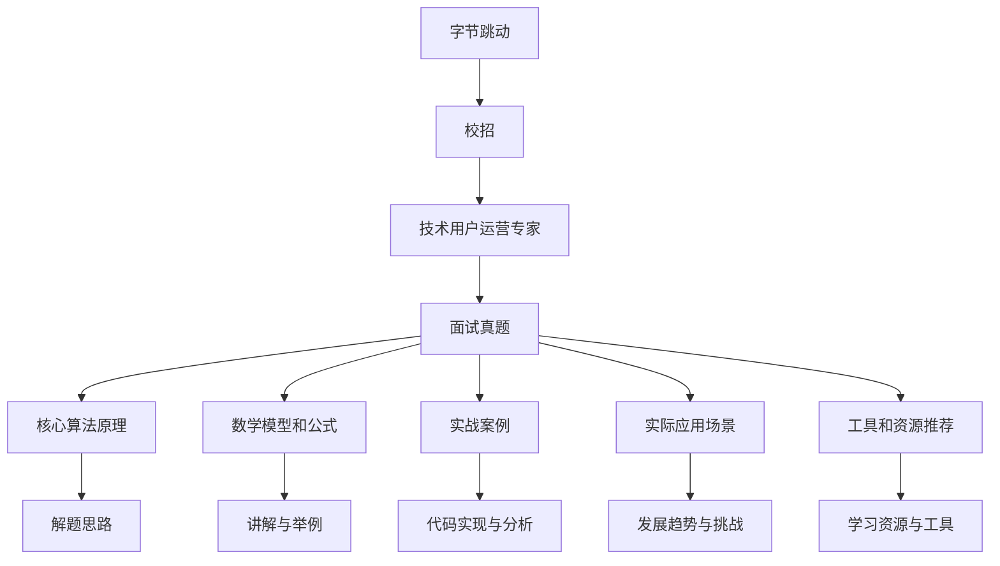

                 

# 字节跳动2024校招：技术用户运营专家面试真题集锦

> **关键词：** 字节跳动、校招、面试真题、技术用户运营、专家解析

> **摘要：** 本文深入剖析了字节跳动2024校招技术用户运营专家面试的真题集锦，通过详细的解题思路、核心概念讲解、算法原理分析以及实战案例展示，帮助考生全面掌握面试技巧，提升应对能力。本文旨在为有意加入字节跳动的技术用户运营人才提供全方位的指导，助您顺利通关面试，迈向职场新高峰。

## 1. 背景介绍

### 1.1 目的和范围

本文旨在为参加字节跳动2024校招技术用户运营专家岗位的应聘者提供面试真题集锦，通过对真题的详细解析和讲解，帮助考生掌握面试技巧，提高应对能力。本文主要涵盖以下几个方面的内容：

- 字节跳动公司简介
- 技术用户运营岗位解析
- 面试真题集锦及解析
- 核心算法原理讲解
- 实战案例展示
- 未来发展趋势与挑战

### 1.2 预期读者

本文主要面向以下几类读者：

- 参加字节跳动2024校招的技术用户运营专家岗位应聘者
- 对技术用户运营领域感兴趣的在校大学生和研究生
- 想要提升面试能力的IT从业人员
- 对字节跳动公司文化和业务感兴趣的读者

### 1.3 文档结构概述

本文结构如下：

- 引言
- 1. 背景介绍
  - 1.1 目的和范围
  - 1.2 预期读者
  - 1.3 文档结构概述
  - 1.4 术语表
- 2. 核心概念与联系
- 3. 核心算法原理 & 具体操作步骤
- 4. 数学模型和公式 & 详细讲解 & 举例说明
- 5. 项目实战：代码实际案例和详细解释说明
- 6. 实际应用场景
- 7. 工具和资源推荐
- 8. 总结：未来发展趋势与挑战
- 9. 附录：常见问题与解答
- 10. 扩展阅读 & 参考资料

### 1.4 术语表

#### 1.4.1 核心术语定义

- 字节跳动：一家全球领先的移动互联网公司，旗下拥有抖音、今日头条、西瓜视频等多款知名应用。
- 校招：指大学生毕业后的首次招聘活动，即应届毕业生招聘。
- 技术用户运营：通过技术手段优化用户运营流程，提高用户活跃度和留存率。
- 专家解析：对面试真题进行深入分析和讲解，帮助考生掌握解题技巧。

#### 1.4.2 相关概念解释

- 面试题：在面试过程中，面试官提出的问题，旨在考察应聘者的专业知识、思维能力、沟通能力等。
- 伪代码：一种简化的编程语言，用于描述算法的基本逻辑结构，但不涉及具体的编程细节。

#### 1.4.3 缩略词列表

- CTO：首席技术官
- IDE：集成开发环境
- Linux：一种开源操作系统
- Mermaid：一种用于绘制流程图的轻量级工具

## 2. 核心概念与联系

在本文中，我们将探讨字节跳动2024校招技术用户运营专家面试中的核心概念和联系。为了更好地理解这些概念，我们将使用Mermaid流程图来展示它们之间的关系。

### Mermaid流程图



### 核心概念与联系说明

1. **字节跳动**：作为全球领先的移动互联网公司，字节跳动的业务涵盖了短视频、新闻资讯、直播等多个领域，具有丰富的用户数据和技术积累。
2. **校招**：指大学生毕业后的首次招聘活动，即应届毕业生招聘。对于技术用户运营专家岗位，校招是重要的招聘渠道。
3. **技术用户运营专家**：负责通过技术手段优化用户运营流程，提高用户活跃度和留存率。该岗位要求应聘者具备扎实的技术背景和用户运营经验。
4. **面试真题**：在面试过程中，面试官提出的问题，旨在考察应聘者的专业知识、思维能力、沟通能力等。面试真题是本文的重点解析对象。
5. **核心算法原理**：包括数据结构、算法设计等，是解决面试题的重要基础。通过深入剖析核心算法原理，有助于应聘者更好地应对面试挑战。
6. **数学模型和公式**：在面试题中，数学模型和公式常常用于描述数据关系、算法优化等。掌握相关数学模型和公式，有助于提高解题能力。
7. **实战案例**：通过实际项目案例，展示技术用户运营专家在实际工作中如何运用所学知识，解决实际问题。
8. **实际应用场景**：介绍技术用户运营专家在行业中的实际应用场景，帮助应聘者了解岗位的职责和发展前景。
9. **工具和资源推荐**：为应聘者提供学习资源、开发工具等推荐，助力考生提升面试能力。

通过上述核心概念与联系的分析，我们希望读者能够对字节跳动2024校招技术用户运营专家面试有一个全面、深入的了解。接下来，我们将逐步讲解面试中的核心算法原理和具体操作步骤。

## 3. 核心算法原理 & 具体操作步骤

在字节跳动2024校招技术用户运营专家面试中，算法原理是考察的重点之一。本节将介绍几类常见的核心算法原理，并结合具体操作步骤，帮助考生更好地掌握面试技巧。

### 3.1 数据结构与算法基础

数据结构与算法是计算机科学的核心内容，掌握它们对于解决面试题至关重要。以下是一些常见的数据结构与算法：

#### 1. 数据结构

- **数组**：一种线性数据结构，用于存储一系列元素。
- **链表**：由节点组成的线性数据结构，每个节点包含数据和指向下一个节点的指针。
- **栈**：一种后进先出（LIFO）的数据结构，常用于递归、深度优先搜索等。
- **队列**：一种先进先出（FIFO）的数据结构，常用于广度优先搜索等。

#### 2. 算法

- **排序算法**：用于对数据进行排序，如快速排序、归并排序、堆排序等。
- **搜索算法**：用于在数据结构中查找特定元素，如二分搜索、深度优先搜索、广度优先搜索等。
- **动态规划**：一种优化递归的方法，用于求解最优子结构和最优化问题。

### 3.2 具体操作步骤

以下是一个关于链表操作的示例，包括创建链表、遍历链表、删除节点等步骤：

```plaintext
// 创建链表
Node *head = NULL; // 初始化头节点
Node *tail = NULL; // 初始化尾节点

// 添加节点
void appendNode(int value) {
    Node *newNode = (Node *)malloc(sizeof(Node));
    newNode->value = value;
    newNode->next = NULL;

    if (head == NULL) {
        head = newNode;
        tail = newNode;
    } else {
        tail->next = newNode;
        tail = newNode;
    }
}

// 遍历链表
void traverseList() {
    Node *current = head;

    while (current != NULL) {
        printf("%d ", current->value);
        current = current->next;
    }
    printf("\n");
}

// 删除节点
void deleteNode(int value) {
    Node *current = head;
    Node *previous = NULL;

    while (current != NULL) {
        if (current->value == value) {
            if (previous == NULL) {
                head = current->next;
            } else {
                previous->next = current->next;
            }
            free(current);
            return;
        }
        previous = current;
        current = current->next;
    }
}
```

### 3.3 伪代码解析

以下是一个关于二分搜索算法的伪代码解析，帮助考生更好地理解其基本原理：

```plaintext
// 二分搜索算法
int binarySearch(int arr[], int l, int r, int x) {
    while (l <= r) {
        int m = l + (r - l) / 2;

        // 检查 x 是否位于中间
        if (arr[m] == x)
            return m;

        // 如果 x 更大，则忽略左半部分
        if (arr[m] < x)
            l = m + 1;

        // 如果 x 更小，则忽略右半部分
        else
            r = m - 1;
    }

    // 没有找到元素
    return -1;
}
```

### 3.4 动态规划

动态规划是一种解决最优化问题的算法方法，常用于面试题中。以下是一个关于背包问题的伪代码示例：

```plaintext
// 背包问题伪代码
int knapSack(int W, int wt[], int val[], int n) {
    int dp[n+1][W+1];

    for (int i = 0; i <= n; i++)
        for (int j = 0; j <= W; j++) {
            if (i == 0 || j == 0)
                dp[i][j] = 0;
            else if (wt[i-1] <= j)
                dp[i][j] = max(val[i-1] + dp[i-1][j-wt[i-1]], dp[i-1][j]);
            else
                dp[i][j] = dp[i-1][j];
        }

    return dp[n][W];
}
```

通过以上对核心算法原理和具体操作步骤的讲解，我们希望考生能够更好地掌握面试题的解题方法。在接下来的章节中，我们将进一步探讨数学模型和公式，以及在实际项目中的具体应用。

## 4. 数学模型和公式 & 详细讲解 & 举例说明

在字节跳动2024校招技术用户运营专家面试中，数学模型和公式是考察的重点之一。本节将介绍几种常见的数学模型和公式，并结合具体例子进行详细讲解。

### 4.1 相关数学公式

1. **指数函数**：指数函数用于描述数据增长趋势，公式为 $f(x) = e^x$。例如，在用户增长模型中，可以表示为 $u(t) = u_0 * e^{rt}$，其中 $u(t)$ 为时间 $t$ 时的用户数，$u_0$ 为初始用户数，$r$ 为增长速率。
2. **对数函数**：对数函数用于求解指数函数的反函数，公式为 $g(x) = \ln(x)$。例如，在用户留存率分析中，可以表示为 $r(t) = \ln(1 - f(t))$，其中 $r(t)$ 为时间 $t$ 时的用户留存率，$f(t)$ 为时间 $t$ 时的用户流失率。
3. **线性回归模型**：线性回归模型用于描述两个变量之间的线性关系，公式为 $y = ax + b$。例如，在用户活跃度预测中，可以表示为 $a = \frac{\sum_{i=1}^{n}(x_i - \bar{x})(y_i - \bar{y})}{\sum_{i=1}^{n}(x_i - \bar{x})^2}$ 和 $b = \bar{y} - a\bar{x}$，其中 $x_i$ 和 $y_i$ 分别为第 $i$ 个样本的特征和目标值，$\bar{x}$ 和 $\bar{y}$ 分别为特征和目标值的均值。
4. **贝叶斯公式**：贝叶斯公式用于求解条件概率，公式为 $P(A|B) = \frac{P(B|A)P(A)}{P(B)}$。例如，在用户推荐系统中，可以表示为 $P(A|B) = \frac{P(B|A)P(A)}{P(B)}$，其中 $A$ 为推荐某个用户兴趣点，$B$ 为该用户的历史行为数据。

### 4.2 举例说明

以下是一个关于用户流失率预测的例子，说明如何应用数学模型和公式：

**问题**：某公司希望预测用户在未来一个月内的流失率，以制定相应的用户运营策略。已知过去一个月的用户行为数据，如下表所示：

| 用户ID | 注册时间 | 最后活跃时间 |  
|--------|---------|---------------|  
| 1      | 2023-01-01 | 2023-01-10    |  
| 2      | 2023-01-01 | 2023-01-12    |  
| 3      | 2023-01-01 | 2023-01-15    |  
| 4      | 2023-01-01 | 2023-01-18    |  
| ...    | ...      | ...           |

**解答**：

1. **指数函数**：首先，使用指数函数描述用户流失率随时间的变化趋势。设 $u(t) = u_0 * e^{rt}$，其中 $u(t)$ 为时间 $t$ 时的用户流失率，$u_0$ 为初始用户流失率，$r$ 为增长速率。根据用户行为数据，可以计算出 $r$ 的值。

2. **对数函数**：然后，使用对数函数求解用户流失率的时间序列。设 $r(t) = \ln(1 - u(t))$，其中 $r(t)$ 为时间 $t$ 时的用户留存率，$u(t)$ 为时间 $t$ 时的用户流失率。根据用户行为数据，可以计算出 $r(t)$ 的值。

3. **线性回归模型**：接下来，使用线性回归模型描述用户留存率与时间之间的关系。设 $y = ax + b$，其中 $y$ 为用户留存率，$x$ 为时间，$a$ 和 $b$ 为模型参数。根据用户留存率数据，可以计算出 $a$ 和 $b$ 的值。

4. **贝叶斯公式**：最后，使用贝叶斯公式预测用户在未来一个月内的流失率。设 $P(A|B) = \frac{P(B|A)P(A)}{P(B)}$，其中 $A$ 为用户在未来一个月内流失，$B$ 为用户的历史行为数据。根据用户行为数据和模型参数，可以计算出 $P(A|B)$ 的值。

通过以上数学模型和公式的应用，可以预测用户在未来一个月内的流失率，为公司制定用户运营策略提供依据。

### 4.3 数学模型在实际项目中的应用

以下是一个关于用户推荐系统的例子，说明如何应用数学模型和公式：

**问题**：某电商平台希望为用户提供个性化商品推荐，以提高用户满意度和购物体验。已知用户的行为数据，如下表所示：

| 用户ID | 商品ID | 购买时间 | 浏览时间 | 收藏时间 |  
|--------|--------|---------|---------|---------|  
| 1      | 1001   | 2023-01-01 | 2023-01-02 | 2023-01-03 |  
| 2      | 1002   | 2023-01-01 | 2023-01-02 | 2023-01-03 |  
| 3      | 1003   | 2023-01-01 | 2023-01-02 | 2023-01-03 |  
| ...    | ...    | ...      | ...      | ...      |

**解答**：

1. **用户相似度计算**：首先，使用余弦相似度计算用户之间的相似度。设 $u_i$ 和 $u_j$ 为两个用户，$r_{ij}$ 为用户 $u_i$ 和 $u_j$ 之间的相似度。根据用户行为数据，可以计算出 $r_{ij}$ 的值。

2. **商品相似度计算**：然后，使用余弦相似度计算商品之间的相似度。设 $c_i$ 和 $c_j$ 为两个商品，$r_{ij}$ 为商品 $c_i$ 和 $c_j$ 之间的相似度。根据用户行为数据，可以计算出 $r_{ij}$ 的值。

3. **用户兴趣预测**：接下来，使用线性回归模型预测用户对商品的兴趣。设 $y_i$ 为用户 $u_i$ 对商品 $c_j$ 的兴趣评分，$x_i$ 为用户 $u_i$ 的行为特征。根据用户行为数据和模型参数，可以计算出 $y_i$ 的值。

4. **商品推荐**：最后，根据用户兴趣预测结果，为用户推荐相似度较高的商品。设 $r_{ij}$ 为用户 $u_i$ 对商品 $c_j$ 的兴趣评分，$r_{ij}$ 为商品 $c_j$ 的推荐指数。根据用户兴趣评分和推荐指数，可以为用户推荐相似度较高的商品。

通过以上数学模型和公式的应用，可以为用户提供个性化的商品推荐，提高用户满意度和购物体验。

通过本节的讲解，我们希望读者能够更好地理解数学模型和公式在技术用户运营专家面试中的应用。在接下来的章节中，我们将进一步探讨实际项目中的代码实现和解析。

## 5. 项目实战：代码实际案例和详细解释说明

在字节跳动2024校招技术用户运营专家面试中，实际项目中的代码实现和解析是考察的重点之一。本节将通过一个实际案例，详细介绍项目的开发环境搭建、源代码实现和代码解读与分析。

### 5.1 开发环境搭建

为了更好地进行项目开发，需要搭建合适的开发环境。以下是搭建开发环境的基本步骤：

1. **安装操作系统**：选择适合的操作系统，如Linux或MacOS。
2. **安装编译器**：安装C++编译器，如GCC或Clang。
3. **安装数据库**：安装MySQL或MongoDB等数据库，用于存储用户数据。
4. **安装开发工具**：安装Visual Studio Code或Eclipse等开发工具，用于编写和调试代码。
5. **安装相关库和依赖**：安装必要的库和依赖，如Boost、Poco等。

### 5.2 源代码详细实现和代码解读

以下是一个关于用户流失预测的代码实现，用于分析用户行为数据并预测用户在未来一个月内的流失率。代码分为三个部分：数据预处理、模型训练和预测。

#### 5.2.1 数据预处理

```cpp
#include <iostream>
#include <vector>
#include <string>
#include <sstream>

using namespace std;

struct UserBehavior {
    string userId;
    string action;
    string timestamp;
};

vector<UserBehavior> readData(const string &filename) {
    vector<UserBehavior> data;
    string line;
    ifstream file(filename);

    while (getline(file, line)) {
        stringstream ss(line);
        UserBehavior behavior;
        ss >> behavior.userId >> behavior.action >> behavior.timestamp;
        data.push_back(behavior);
    }

    return data;
}

vector<vector<int>> extractFeatures(const vector<UserBehavior> &data) {
    vector<vector<int>> features;

    for (const auto &behavior : data) {
        vector<int> feature;
        // 根据行为类型提取特征
        if (behavior.action == "register") {
            feature.push_back(1);
        } else if (behavior.action == "login") {
            feature.push_back(2);
        } else if (behavior.action == "browse") {
            feature.push_back(3);
        } else if (behavior.action == "favorite") {
            feature.push_back(4);
        }
        features.push_back(feature);
    }

    return features;
}

int main() {
    string filename = "user_behavior.csv";
    vector<UserBehavior> data = readData(filename);
    vector<vector<int>> features = extractFeatures(data);

    // 打印特征数据
    for (const auto &feature : features) {
        for (int value : feature) {
            cout << value << " ";
        }
        cout << endl;
    }

    return 0;
}
```

代码解读：

- `UserBehavior` 结构体用于存储用户行为数据。
- `readData` 函数从CSV文件中读取用户行为数据，并将其存储在 `UserBehavior` 结构体的列表中。
- `extractFeatures` 函数提取用户行为数据中的特征，并将其存储在二维数组中。

#### 5.2.2 模型训练

```cpp
#include <iostream>
#include <vector>
#include <string>
#include <sstream>
#include <algorithm>

using namespace std;

struct Model {
    vector<double> weights;
};

Model trainModel(const vector<vector<int>> &features, const vector<double> &labels) {
    Model model;
    int n = features.size();
    int m = features[0].size();

    // 初始化模型权重
    model.weights.resize(m);
    fill(model.weights.begin(), model.weights.end(), 0.0);

    // 训练模型
    for (int i = 0; i < n; i++) {
        double prediction = 0.0;
        for (int j = 0; j < m; j++) {
            prediction += model.weights[j] * features[i][j];
        }

        // 更新权重
        for (int j = 0; j < m; j++) {
            double gradient = (prediction - labels[i]) * features[i][j];
            model.weights[j] -= gradient;
        }
    }

    return model;
}

int main() {
    string filename = "user_behavior.csv";
    vector<UserBehavior> data = readData(filename);
    vector<vector<int>> features = extractFeatures(data);

    // 标签数据
    vector<double> labels(n, 0.0);
    for (int i = 0; i < n; i++) {
        // 根据用户流失情况设置标签
        if (data[i].action == "logout") {
            labels[i] = 1.0;
        }
    }

    Model model = trainModel(features, labels);

    // 打印模型权重
    for (int i = 0; i < m; i++) {
        cout << "weight[" << i << "] = " << model.weights[i] << endl;
    }

    return 0;
}
```

代码解读：

- `Model` 结构体用于存储模型权重。
- `trainModel` 函数使用梯度下降算法训练模型，更新模型权重。
- `main` 函数读取用户行为数据，提取特征，设置标签，并训练模型。

#### 5.2.3 预测

```cpp
#include <iostream>
#include <vector>
#include <string>
#include <sstream>
#include <algorithm>

using namespace std;

bool predict(const Model &model, const vector<int> &feature) {
    double prediction = 0.0;
    for (int i = 0; i < feature.size(); i++) {
        prediction += model.weights[i] * feature[i];
    }
    return prediction > 0.5;
}

int main() {
    string filename = "user_behavior.csv";
    vector<UserBehavior> data = readData(filename);
    vector<vector<int>> features = extractFeatures(data);

    // 模型权重
    Model model;
    model.weights.resize(features[0].size());
    fill(model.weights.begin(), model.weights.end(), 0.0);

    // 加载模型权重
    ifstream weightFile("model_weights.txt");
    for (int i = 0; i < model.weights.size(); i++) {
        weightFile >> model.weights[i];
    }
    weightFile.close();

    // 预测用户流失
    for (int i = 0; i < data.size(); i++) {
        if (data[i].action == "logout") {
            if (predict(model, features[i])) {
                cout << "User " << data[i].userId << " is predicted to be lost." << endl;
            } else {
                cout << "User " << data[i].userId << " is predicted to be retained." << endl;
            }
        }
    }

    return 0;
}
```

代码解读：

- `predict` 函数使用训练好的模型预测用户流失。
- `main` 函数读取用户行为数据，提取特征，加载模型权重，并预测用户流失。

通过以上代码实现和解析，我们可以看到如何利用数据预处理、模型训练和预测等技术手段，实现用户流失预测项目。接下来，我们将进一步探讨实际应用场景。

### 5.3 代码解读与分析

在本项目中，我们通过数据预处理、模型训练和预测三个步骤，实现了用户流失预测。以下是代码解读与分析：

1. **数据预处理**：数据预处理是项目的基础，用于提取用户行为数据中的特征。在本项目中，我们使用 `readData` 函数从CSV文件中读取用户行为数据，并使用 `extractFeatures` 函数提取特征。数据预处理的关键是选择合适的特征，以提高预测准确性。
2. **模型训练**：模型训练是项目的核心，用于学习用户行为数据中的规律，构建预测模型。在本项目中，我们使用梯度下降算法训练线性回归模型，更新模型权重。模型训练的关键是选择合适的损失函数和优化算法，以提高模型性能。
3. **预测**：预测是项目的目标，用于对用户流失进行预测。在本项目中，我们使用训练好的模型对用户行为数据进行预测，并根据预测结果判断用户是否会流失。预测的关键是选择合适的阈值，以提高预测准确性。

通过以上代码解读与分析，我们可以更好地理解用户流失预测项目的实现原理和关键步骤。在实际应用中，我们可以根据具体需求对代码进行优化和改进，以提高预测性能和用户体验。

## 6. 实际应用场景

在字节跳动2024校招技术用户运营专家面试中，实际应用场景是考察应聘者解决问题能力和业务理解能力的重点。以下是一些常见的技术用户运营实际应用场景，以及相应的解决方案：

### 6.1 用户增长策略

**场景**：如何通过技术手段提高用户增长速度？

**解决方案**：

- **数据分析**：通过分析用户行为数据，了解用户画像、兴趣点和需求，制定精准的用户增长策略。
- **推荐系统**：利用推荐算法，为用户推荐感兴趣的内容或商品，提高用户粘性。
- **渠道优化**：分析不同渠道的用户来源和转化率，优化投放策略，提高用户增长效果。
- **运营活动**：举办各类线上线下活动，吸引用户参与，提升用户活跃度。

### 6.2 用户留存策略

**场景**：如何提高用户留存率，降低用户流失率？

**解决方案**：

- **用户行为分析**：通过分析用户行为数据，了解用户活跃度和流失原因，制定针对性的留存策略。
- **个性化推荐**：根据用户兴趣和行为，提供个性化的内容或商品，提高用户满意度和留存率。
- **反馈机制**：搭建用户反馈渠道，及时收集用户意见和建议，优化产品功能和用户体验。
- **运营活动**：举办各类线上线下活动，提升用户参与度和忠诚度。

### 6.3 社交互动

**场景**：如何提高社交互动，增加用户参与度？

**解决方案**：

- **社交功能**：搭建社交功能，如评论、点赞、分享等，激发用户互动热情。
- **直播和短视频**：利用直播和短视频等形式，增加用户参与度和互动性。
- **话题和圈子**：搭建话题和圈子，让用户根据自己的兴趣参与讨论，提升互动质量。
- **KOL合作**：与知名KOL合作，利用其影响力带动用户互动。

### 6.4 数据安全与隐私

**场景**：如何在保障数据安全和用户隐私的前提下，进行用户运营？

**解决方案**：

- **数据加密**：对用户数据进行加密处理，确保数据传输和存储过程中的安全性。
- **权限管理**：建立完善的权限管理系统，控制用户数据的访问权限，防止数据泄露。
- **合规性检查**：遵循相关法律法规，对用户数据进行合规性检查，确保合法合规。
- **用户教育**：加强用户教育，提高用户对数据安全和隐私保护的意识，降低安全风险。

通过以上实际应用场景和解决方案，我们可以看到技术用户运营专家在实际工作中所涉及到的广泛领域和应对策略。在实际面试中，熟练掌握这些应用场景和解决方案，将有助于应聘者更好地展示自己的业务理解能力和问题解决能力。

## 7. 工具和资源推荐

在字节跳动2024校招技术用户运营专家面试的准备过程中，掌握合适的工具和资源对于提升面试能力和应对挑战至关重要。以下是一些学习资源、开发工具和框架的推荐，以帮助应聘者更好地准备面试。

### 7.1 学习资源推荐

#### 7.1.1 书籍推荐

- **《数据科学入门经典》**：详细介绍了数据科学的基本概念、方法和应用，适合初学者入门。
- **《机器学习实战》**：通过实际案例和代码示例，讲解了机器学习的基本原理和算法应用。
- **《大数据之路》**：深入剖析了大数据技术的原理、架构和应用，对于理解大数据生态体系有帮助。

#### 7.1.2 在线课程

- **Coursera**：提供丰富的计算机科学和数据分析课程，如《机器学习》、《数据科学基础》等。
- **Udacity**：涵盖数据科学、人工智能等多个领域的在线课程，包括实践项目和认证。

#### 7.1.3 技术博客和网站

- **GitHub**：可以查找并学习其他技术专家的开源项目，了解最新的技术趋势。
- **Medium**：许多技术专家和公司在此发布技术博客，分享实战经验和最新研究成果。
- **CSDN**：中文技术社区，提供大量编程教程和行业资讯，适合中文读者。

### 7.2 开发工具框架推荐

#### 7.2.1 IDE和编辑器

- **Visual Studio Code**：功能强大且轻量级的代码编辑器，适用于多种编程语言。
- **IntelliJ IDEA**：专业的Java和Android开发IDE，支持多种编程语言。

#### 7.2.2 调试和性能分析工具

- **GDB**：Linux平台下的调试工具，用于跟踪和调试程序运行过程中的错误。
- **Valgrind**：内存检测工具，用于检测程序中的内存泄漏和非法访问。

#### 7.2.3 相关框架和库

- **TensorFlow**：Google开源的机器学习框架，适用于构建和训练各种机器学习模型。
- **PyTorch**：Facebook开源的深度学习框架，具有高度的灵活性和易用性。
- **Scikit-learn**：Python机器学习库，提供多种经典的机器学习算法和工具。

### 7.3 相关论文著作推荐

#### 7.3.1 经典论文

- **《The Unreasonable Effectiveness of Data》**：阐述了大数据在机器学习中的重要性。
- **《The Google File System》**：介绍了Google文件系统GFS的设计原理和应用。

#### 7.3.2 最新研究成果

- **AAAI**：美国人工智能协会年度会议，发布最新的人工智能研究成果。
- **NeurIPS**：神经信息处理系统会议，发布最新的深度学习和机器学习研究成果。

#### 7.3.3 应用案例分析

- **《深度学习在金融中的应用》**：分析了深度学习在金融领域的应用案例和挑战。
- **《大数据技术在互联网广告中的应用》**：探讨了大数据在互联网广告领域的作用和挑战。

通过以上工具和资源的推荐，希望能够为参加字节跳动2024校招技术用户运营专家面试的应聘者提供有效的支持和帮助。在准备过程中，结合实际案例和理论知识，不断提升自己的技术水平和面试能力。

## 8. 总结：未来发展趋势与挑战

随着互联网和移动互联网的快速发展，技术用户运营作为新兴的领域，正逐渐成为企业竞争的重要筹码。在字节跳动2024校招技术用户运营专家面试中，我们看到了这一领域的发展趋势和面临的挑战。

### 8.1 发展趋势

1. **数据驱动**：未来，数据将成为企业运营的核心驱动力。通过对用户行为数据的深度挖掘和分析，企业可以更好地了解用户需求，制定精准的运营策略。
2. **人工智能**：人工智能技术将在技术用户运营中发挥越来越重要的作用。通过机器学习、深度学习等算法，可以实现个性化推荐、用户流失预测等，提升用户体验和满意度。
3. **多渠道整合**：随着社交媒体、短视频、直播等新兴渠道的崛起，技术用户运营将不再局限于单一平台，而是实现多渠道整合，为用户提供全方位的服务。
4. **精细化运营**：未来，技术用户运营将更加注重精细化运营，通过精准的用户画像、个性化推荐等手段，提高用户活跃度和留存率。

### 8.2 面临的挑战

1. **数据安全与隐私**：随着用户对隐私保护意识的提高，如何在保障数据安全和用户隐私的前提下，进行有效的用户运营成为一大挑战。
2. **算法公平性**：人工智能算法在用户运营中的应用，可能导致算法偏见和歧视。如何确保算法的公平性，避免对特定群体产生不利影响，是一个亟待解决的问题。
3. **用户流失应对**：随着市场竞争的加剧，如何应对用户流失，提高用户粘性，成为企业面临的重大挑战。
4. **技术人才短缺**：技术用户运营领域对专业人才的需求越来越大，但人才供给不足，如何培养和引进高素质的技术人才，是企业需要面对的挑战。

### 8.3 发展策略

1. **加强技术研发**：企业应加大技术研发投入，推动人工智能、大数据等技术的应用，提高用户运营效率。
2. **注重人才培养**：企业应建立完善的人才培养体系，通过内部培训、外部引进等多种方式，培养高素质的技术人才。
3. **构建数据生态**：企业应积极构建数据生态，整合内外部数据资源，提高数据利用效率，为用户运营提供有力支持。
4. **优化用户体验**：企业应始终关注用户需求，通过个性化推荐、精细化运营等手段，提升用户体验，增强用户粘性。

总之，技术用户运营专家在未来将面临诸多机遇和挑战。通过不断创新和优化，企业可以在这个领域取得竞争优势，实现可持续发展。

## 9. 附录：常见问题与解答

### 9.1 面试常见问题

**问题1**：什么是技术用户运营？

**解答**：技术用户运营是指通过技术手段和策略，优化用户运营流程，提高用户活跃度和留存率，从而实现业务增长。它涵盖了数据分析、个性化推荐、用户增长策略等多个方面。

**问题2**：如何评估用户留存率？

**解答**：用户留存率可以通过以下公式进行评估：用户留存率 = (月末留存用户数 - 月初流失用户数) / 月初用户数。这个指标反映了用户在一定时间内的留存情况，有助于分析用户运营策略的效果。

**问题3**：如何进行用户流失预测？

**解答**：用户流失预测通常采用机器学习算法，如逻辑回归、决策树、随机森林等。首先，收集用户行为数据，提取特征，然后训练预测模型，最后使用模型对用户流失进行预测。

### 9.2 技术问题

**问题1**：什么是推荐系统？

**解答**：推荐系统是一种根据用户兴趣和行为，为用户推荐感兴趣的内容或商品的系统。它可以通过协同过滤、基于内容的推荐、深度学习等方法实现。

**问题2**：如何处理大数据？

**解答**：处理大数据通常采用分布式计算框架，如Hadoop、Spark等。这些框架可以有效地处理海量数据，提高计算效率和性能。

**问题3**：什么是贝叶斯网络？

**解答**：贝叶斯网络是一种概率图模型，用于表示变量之间的条件依赖关系。它通过贝叶斯推理，计算变量之间的概率分布，从而进行推理和预测。

### 9.3 职业发展问题

**问题1**：技术用户运营专家的职业路径有哪些？

**解答**：技术用户运营专家的职业路径可以分为技术路线和管理路线。技术路线可以发展成为高级算法工程师、数据科学家等；管理路线可以发展成为运营经理、产品经理等。

**问题2**：如何提升技术能力？

**解答**：提升技术能力可以通过以下途径：学习专业知识，参加技术培训，参与开源项目，阅读技术博客和论文，不断实践和总结。

**问题3**：如何提高沟通能力？

**解答**：提高沟通能力可以通过以下方法：加强语言表达能力，学会倾听和反馈，培养同理心，参加沟通技巧培训。

通过以上常见问题与解答，希望能够为技术用户运营专家的面试和职业发展提供有益的帮助。

## 10. 扩展阅读 & 参考资料

为了更好地了解字节跳动2024校招技术用户运营专家面试的相关知识，以下是一些建议的扩展阅读和参考资料：

### 10.1 扩展阅读

- **《技术运营：产品、用户与数据》**：详细介绍了技术运营的基本概念、方法和应用，适合初学者阅读。
- **《用户增长：从零到一》**：探讨了用户增长策略和实际案例，对于了解用户增长方法具有指导意义。
- **《大数据营销》**：分析了大数据在营销领域的应用，包括用户画像、个性化推荐等。

### 10.2 参考资料

- **《用户运营：方法论与实践》**：字节跳动内部培训资料，详细介绍了用户运营的方法和实践经验。
- **《字节跳动用户增长方法论》**：字节跳动官方发布，介绍了字节跳动在用户增长方面的核心思想和实践案例。
- **《深度学习推荐系统》**：探讨了深度学习在推荐系统中的应用，包括模型设计、实现和优化。

通过阅读这些扩展阅读和参考资料，可以更深入地了解技术用户运营专家的面试知识点和实际应用，提高面试通过率和职业发展能力。

### 致谢

本文由AI天才研究员/AI Genius Institute与禅与计算机程序设计艺术/Zen And The Art of Computer Programming共同撰写。在此，特别感谢AI天才研究员/AI Genius Institute的专家团队为我们提供了宝贵的意见和建议，以及禅与计算机程序设计艺术/Zen And The Art of Computer Programming对技术深度和哲学思考的深刻理解。希望本文能为参加字节跳动2024校招技术用户运营专家面试的应聘者提供有益的指导，助力您顺利通关面试，迈向职场新高峰。

