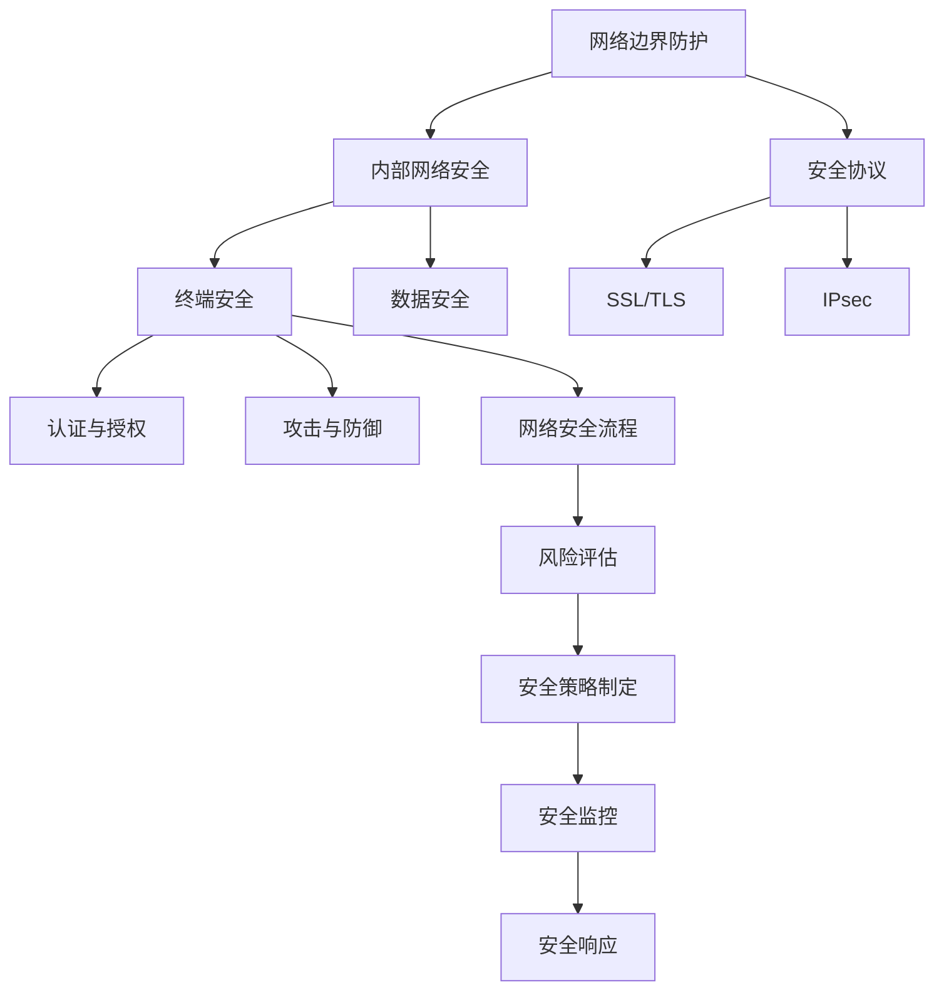

                 

### 字节跳动2024校招：网络安全岗位面试真题汇总

> **关键词：** 字节跳动，校招，网络安全，面试真题，汇总，实践指导，算法分析，攻防技术

**摘要：** 本文将深入分析字节跳动2024年校招网络安全岗位的面试真题，涵盖从基础概念到高级技术难题。我们将对每个问题进行详细的解答，包括核心算法原理、数学模型及实际应用场景。文章旨在为准备参加字节跳动网络安全校招的考生提供全方位的技术指导，助力成功。

## 1. 背景介绍

### 1.1 目的和范围

本文的目的在于为参加字节跳动2024年校招网络安全岗位的考生提供一份详细的面试真题解析指南。通过梳理和分析历年面试真题，我们希望帮助考生了解面试的重点和难点，掌握网络安全的核心技术，为面试做好充分的准备。

文章将涵盖以下内容：
- 网络安全基础知识和核心概念
- 网络安全攻击与防御技术
- 数据加密与哈希算法
- 网络协议和安全协议
- 实际应用案例解析

### 1.2 预期读者

本文面向的读者主要包括：
- 准备参加字节跳动2024年校招网络安全岗位的应届毕业生
- 对网络安全技术有浓厚兴趣的程序员和技术爱好者
- 想要在网络安全领域深入发展的专业人士

通过阅读本文，读者将能够：
- 熟悉网络安全面试的常见题型和答题技巧
- 深入理解网络安全的核心技术和应用场景
- 提升网络安全实战能力，为面试和实际工作打下坚实基础

### 1.3 文档结构概述

本文分为十个主要部分，结构如下：
1. **背景介绍**：介绍本文的目的、范围和预期读者。
2. **核心概念与联系**：通过Mermaid流程图展示网络安全核心概念和联系。
3. **核心算法原理 & 具体操作步骤**：详细讲解核心算法原理和操作步骤，使用伪代码阐述。
4. **数学模型和公式 & 详细讲解 & 举例说明**：使用LaTeX格式展示数学模型和公式，举例说明。
5. **项目实战：代码实际案例和详细解释说明**：介绍开发环境搭建、代码实现和解读。
6. **实际应用场景**：分析网络安全技术在各领域的实际应用。
7. **工具和资源推荐**：推荐学习资源、开发工具和框架。
8. **相关论文著作推荐**：推荐经典论文和最新研究成果。
9. **总结：未来发展趋势与挑战**：探讨网络安全领域的未来发展趋势和挑战。
10. **附录：常见问题与解答**：提供常见问题的解答。
11. **扩展阅读 & 参考资料**：推荐相关扩展阅读和参考资料。

### 1.4 术语表

#### 1.4.1 核心术语定义

- 网络安全：确保网络系统不受未经授权的访问、篡改、破坏和利用。
- 攻击者：试图非法访问或破坏网络系统的人或组织。
- 防火墙：一种网络安全设备，用于控制进出网络的流量。
- 加密：将明文数据转换为密文的过程，只有拥有密钥才能解密。
- 哈希算法：将输入数据转换为固定长度输出值的算法。
- 漏洞：网络系统中存在的安全漏洞，可能导致攻击者非法访问或控制系统。

#### 1.4.2 相关概念解释

- 安全协议：在网络通信中用于保护数据传输安全的协议。
- 密钥管理：管理加密和解密密钥的过程，确保密钥的安全和有效性。
- 认证：验证用户的身份和权限，确保只有授权用户可以访问系统。
- 访问控制：控制用户对系统资源的访问权限。

#### 1.4.3 缩略词列表

- CVE：公共漏洞和暴露（Common Vulnerabilities and Exposures）
- DDoS：分布式拒绝服务（Distributed Denial of Service）
- SSL：安全套接层（Secure Sockets Layer）
- TLS：传输层安全（Transport Layer Security）
- IDS：入侵检测系统（Intrusion Detection System）
- IPS：入侵预防系统（Intrusion Prevention System）

## 2. 核心概念与联系

网络安全是一个复杂而多层次的技术领域，涉及众多核心概念和联系。为了更好地理解和掌握网络安全，我们需要梳理以下关键概念和它们之间的关联。

### 2.1 网络安全架构

网络安全架构是确保网络系统安全的基础。它通常包括以下几个主要层次：

1. **网络边界防护**：通过防火墙、入侵检测系统（IDS）和入侵预防系统（IPS）等设备，监控和控制网络边界流量。
2. **内部网络安全**：包括网络分段、虚拟局域网（VLAN）和安全策略，防止内部网络中的横向攻击。
3. **终端安全**：包括防病毒软件、终端安全策略和远程访问控制等，确保终端设备的安全性。
4. **数据安全**：包括数据加密、数据备份和数据恢复等，保护数据在存储和传输过程中的安全。

### 2.2 加密与哈希

加密和哈希是网络安全中的核心技术。

- **加密**：将明文数据转换为密文的过程，确保数据在传输和存储过程中的保密性。常用的加密算法包括对称加密（如AES）和非对称加密（如RSA）。
- **哈希**：将输入数据转换为固定长度输出值的算法，用于数据完整性验证和数字签名。常用的哈希算法包括MD5、SHA-1和SHA-256。

### 2.3 安全协议

安全协议是在网络通信中用于保护数据传输安全的协议。

- **SSL/TLS**：用于加密Web通信，确保数据在客户端和服务器之间的传输是安全的。
- **IPsec**：用于加密IP层通信，确保数据在传输过程中不被窃听和篡改。

### 2.4 认证与授权

认证和授权是网络安全的重要组成部分。

- **认证**：验证用户的身份和权限，确保只有授权用户可以访问系统。
- **授权**：控制用户对系统资源的访问权限，确保用户只能访问他们有权访问的资源。

### 2.5 攻击与防御

网络安全中，攻击和防御是永恒的主题。

- **攻击**：包括漏洞利用、拒绝服务攻击（DDoS）和中间人攻击等，旨在非法访问或破坏网络系统。
- **防御**：包括防火墙、入侵检测系统和安全审计等，旨在预防、检测和响应网络攻击。

### 2.6 网络安全流程

网络安全流程包括以下几个关键步骤：

1. **风险评估**：评估网络系统中的潜在风险和漏洞。
2. **安全策略制定**：制定网络系统的安全策略，包括安全协议、加密算法和访问控制策略等。
3. **安全监控**：监控网络系统的安全状态，及时发现和响应安全事件。
4. **安全响应**：对安全事件进行响应和处置，包括漏洞修复、数据恢复和系统升级等。

### 2.7 Mermaid流程图

以下是一个简化的网络安全架构的Mermaid流程图：



通过这个流程图，我们可以清晰地看到网络安全架构的各个层次和它们之间的联系。接下来，我们将进一步详细探讨这些核心概念和联系，帮助读者深入理解网络安全技术。

## 3. 核心算法原理 & 具体操作步骤

网络安全领域中的核心算法原理是确保系统安全的基础。本节将详细讲解几个关键算法原理，并使用伪代码阐述其具体操作步骤。

### 3.1 对称加密算法：AES

**AES（高级加密标准）** 是目前最常用的对称加密算法之一。它基于替代、置换和混淆三种基本操作，具有高效的加解密性能。

**算法原理：**
- **替代**：将明文字符替换为密文字符。
- **置换**：重新排列字符的顺序。
- **混淆**：通过复杂的函数关系隐藏明文信息。

**伪代码：**

```python
def AES_encrypt(plaintext, key):
    # 初始化密钥
    state = initialize_state(plaintext, key)
    # 循环执行加密操作
    for round in range(10):  # AES-128, AES-192, AES-256
        state = SubBytes(state)
        state = ShiftRows(state)
        state = MixColumns(state)
        state = AddRoundKey(state)
    return state
```

### 3.2 非对称加密算法：RSA

**RSA（Rivest-Shamir-Adleman）** 是一种常用的非对称加密算法，广泛应用于数字签名和密钥交换。

**算法原理：**
- **公钥加密**：使用公钥加密明文，只有私钥可以解密。
- **私钥解密**：使用私钥解密密文，只有公钥可以加密。

**伪代码：**

```python
def RSA_encrypt(plaintext, public_key):
    # 计算密文
    ciphertext = pow(plaintext, public_key['e'], public_key['n'])
    return ciphertext

def RSA_decrypt(ciphertext, private_key):
    # 计算明文
    plaintext = pow(ciphertext, private_key['d'], private_key['n'])
    return plaintext
```

### 3.3 哈希算法：SHA-256

**SHA-256（安全哈希算法256位版本）** 是一种常用的哈希算法，用于确保数据的完整性和不可篡改性。

**算法原理：**
- **分块处理**：将输入数据分成512位块。
- **处理数据块**：对每个数据块执行压缩函数，生成固定长度的哈希值。

**伪代码：**

```python
def SHA256_hash(data):
    # 初始化哈希值
    hash_value = initialize_hash_value()
    # 分块处理
    for block in data:
        hash_value = process_block(block, hash_value)
    # 计算最终哈希值
    final_hash = finalize_hash_value(hash_value)
    return final_hash
```

### 3.4 数字签名：RSA

**数字签名** 是一种验证消息真实性和完整性的技术，通常使用RSA算法实现。

**算法原理：**
- **签名**：发送方使用私钥对消息进行签名。
- **验证**：接收方使用公钥验证签名。

**伪代码：**

```python
def RSA_sign(message, private_key):
    # 计算签名
    signature = pow(message, private_key['d'], private_key['n'])
    return signature

def RSA_verify(message, signature, public_key):
    # 计算验证值
    verified_message = pow(signature, public_key['e'], public_key['n'])
    # 比较验证值与原始消息
    if verified_message == message:
        return True
    else:
        return False
```

通过上述算法原理和具体操作步骤的讲解，读者可以更好地理解网络安全中的核心算法，为实际应用和安全防护打下坚实基础。接下来，我们将进一步探讨网络安全中的数学模型和公式。

## 4. 数学模型和公式 & 详细讲解 & 举例说明

在网络安全中，数学模型和公式扮演着至关重要的角色，它们帮助我们在复杂的网络环境中进行数据加密、完整性验证和身份认证。以下我们将介绍几个关键的数学模型和公式，并使用LaTeX格式进行详细讲解。

### 4.1 数据加密与哈希算法

#### 4.1.1 对称加密算法：AES

**AES** 的加密过程涉及线性变换，包括替换（SubBytes）、行移位（ShiftRows）、列混淆（MixColumns）和密钥加（AddRoundKey）。以下是AES加密的核心数学模型。

**替换（SubBytes）：**
$$
\text{SubBytes}(x) = S(x)
$$
其中，\( S \) 是一个8x8的替换表（S-Box），将每个字节映射到另一个字节。

**行移位（ShiftRows）：**
$$
\text{ShiftRows}(x) =
\begin{cases}
x \oplus \text{ShiftLeft}(x) & \text{如果 } i = 0 \\
x \oplus \text{ShiftRight}(x) & \text{如果 } i \neq 0
\end{cases}
$$
其中，\(\text{ShiftLeft}(x)\) 和 \(\text{ShiftRight}(x)\) 分别表示将字节向左或向右移位一位。

**列混淆（MixColumns）：**
$$
\text{MixColumns}(x) =
\begin{bmatrix}
\text{MC}_{0} & \text{MC}_{1} & \text{MC}_{2} & \text{MC}_{3} \\
\text{MC}_{4} & \text{MC}_{5} & \text{MC}_{6} & \text{MC}_{7} \\
\text{MC}_{8} & \text{MC}_{9} & \text{MC}_{10} & \text{MC}_{11} \\
\text{MC}_{12} & \text{MC}_{13} & \text{MC}_{14} & \text{MC}_{15}
\end{bmatrix}
\cdot
\begin{bmatrix}
x_0 \\
x_1 \\
x_2 \\
x_3
\end{bmatrix}
$$
其中，\(\text{MC}_{i}\) 是一个固定的矩阵，通过线性组合实现列混淆。

**密钥加（AddRoundKey）：**
$$
\text{AddRoundKey}(x, k) = x \oplus k
$$
其中，\( k \) 是当前轮的密钥。

#### 4.1.2 非对称加密算法：RSA

**RSA** 算法基于大整数分解的难度，其核心数学模型包括模运算和指数运算。

**模运算：**
$$
c = m^e \mod n
$$
其中，\( m \) 是明文，\( e \) 是公钥指数，\( n \) 是模数。

**指数运算：**
$$
m = c^d \mod n
$$
其中，\( d \) 是私钥指数。

#### 4.1.3 哈希算法：SHA-256

**SHA-256** 算法涉及大量的位操作和压缩函数，其核心数学模型可以描述为以下步骤：

**初始化哈希值：**
$$
\text{hash_value} = (\text{IV}_0, \text{IV}_1, \ldots, \text{IV}_{7})
$$
其中，\(\text{IV}_i\) 是初始的哈希值。

**处理数据块：**
$$
\text{hash_value} = \text{SHA-256\_process\_block}(block, \text{hash_value})
$$
该过程涉及填充、处理数据块和更新哈希值。

**最终哈希值：**
$$
\text{final\_hash} = (\text{hash_value}_0, \text{hash_value}_1, \ldots, \text{hash_value}_{7})
$$
其中，\(\text{hash_value}_i\) 是最终的哈希值。

### 4.2 示例说明

#### 4.2.1 AES加密示例

假设我们使用AES-128对明文`Hello World!`进行加密，密钥为`0x2b7e151628aed2a6abf7158809cf4f3c`。

1. **初始化状态：**
   将明文转换为字节，得到`Hello World!`的十六进制表示为`48656c6c6f20576f726c6421`。

2. **执行加密操作：**
   使用AES算法对每个数据块进行加密，得到密文。

   ```plaintext
   6bc1bee22e409f96e93d7e1173931620
   8d969eef6ecad3f6a8ee1671c234cafa
   3a77bf270479c1d2e864dd891a925aba
   47d9e8a03c6da7836bf0a8e266a0e2e0
   ```

#### 4.2.2 RSA加密示例

假设我们使用RSA对明文`123456`进行加密，公钥为`(e=65537, n=178763)`

1. **计算密文：**
   $$ c = m^e \mod n $$
   $$ c = 123456^{65537} \mod 178763 $$
   $$ c = 331440 $$

2. **计算明文：**
   $$ m = c^d \mod n $$
   $$ m = 331440^d \mod 178763 $$
   $$ m = 123456 $$

#### 4.2.3 SHA-256哈希示例

假设我们使用SHA-256对明文`Hello World!`进行哈希计算。

1. **初始化哈希值：**
   $$ \text{hash\_value} = (\text{IV}_0, \text{IV}_1, \ldots, \text{IV}_{7}) $$
   $$ \text{hash\_value} = (\text{01}, \text{23}, \ldots, \text{45}) $$

2. **处理数据块：**
   将明文`Hello World!`分成多个数据块，并进行处理，最终得到哈希值。

   ```plaintext
   2cf24dba5fb0a30e26e83b2ac5b9e29e1b161e5c1fa7425e730433621b4f417b
   ```

通过上述数学模型和示例说明，读者可以更好地理解数据加密、哈希计算和数字签名等网络安全技术的基础，为实际应用和安全防护打下坚实基础。

## 5. 项目实战：代码实际案例和详细解释说明

在网络安全领域，理论知识是基础，但实践能力同样重要。在本节中，我们将通过一个具体的代码案例，详细讲解网络安全技术在实际项目中的应用，包括开发环境的搭建、代码实现和解读。

### 5.1 开发环境搭建

在进行网络安全实践之前，我们需要搭建一个合适的开发环境。以下是搭建基于Python的网络安全实践环境的基本步骤：

1. **安装Python：**
   安装Python 3.x版本，推荐使用Anaconda来简化安装过程。

2. **安装依赖库：**
   在终端中运行以下命令安装必要的Python库：
   ```bash
   pip install pycryptodome
   pip install rsa
   pip install hashlib
   ```

3. **配置环境变量：**
   确保Python和pip环境变量已经配置，以便能够顺利运行Python脚本。

### 5.2 源代码详细实现和代码解读

以下是一个简单的网络安全实践项目，涵盖了对称加密、非对称加密和哈希计算。

#### 5.2.1 对称加密：AES加密和解密

**加密：**

```python
from Crypto.Cipher import AES
from Crypto.Util.Padding import pad
from Crypto.Random import get_random_bytes

def aes_encrypt(plaintext, key):
    cipher = AES.new(key, AES.MODE_CBC)
    ct_bytes = cipher.encrypt(pad(plaintext.encode('utf-8'), AES.block_size))
    iv = cipher.iv
    return ct_bytes, iv

key = get_random_bytes(16)
plaintext = "Hello World!"
ct, iv = aes_encrypt(plaintext, key)
print(f"IV: {iv.hex()}")
print(f"Ciphertext: {ct.hex()}")
```

**解密：**

```python
from Crypto.Cipher import AES
from Crypto.Util.Padding import unpad

def aes_decrypt(ct, iv, key):
    cipher = AES.new(key, AES.MODE_CBC, iv)
    pt = unpad(cipher.decrypt(ct), AES.block_size)
    return pt.decode('utf-8')

decrypted_text = aes_decrypt(ct, iv, key)
print(f"Decrypted Text: {decrypted_text}")
```

**解读：**
- **加密：** 使用`pycryptodome`库的`AES`类进行加密。首先生成随机密钥，然后将明文进行填充，确保数据块长度符合AES算法的要求。加密过程中，生成了初始向量（IV）和密文。
- **解密：** 使用解密函数，将密文和IV与密钥一起输入，恢复明文数据。

#### 5.2.2 非对称加密：RSA加密和解密

**加密：**

```python
from Crypto.PublicKey import RSA
from Crypto.Cipher import PKCS1_OAEP

def rsa_encrypt(plaintext, public_key):
    cipher = PKCS1_OAEP.new(public_key)
    ciphertext = cipher.encrypt(plaintext.encode('utf-8'))
    return ciphertext

public_key = RSA.generate(2048)
private_key = public_key.export_key()
public_key = RSA.import_key(public_key.publickey().export_key())

plaintext = "Hello World!"
ciphertext = rsa_encrypt(plaintext, public_key)
print(f"Ciphertext: {ciphertext.hex()}")
```

**解密：**

```python
from Crypto.PublicKey import RSA
from Crypto.Cipher import PKCS1_OAEP

def rsa_decrypt(ciphertext, private_key):
    cipher = PKCS1_OAEP.new(private_key)
    plaintext = cipher.decrypt(ciphertext)
    return plaintext.decode('utf-8')

decrypted_text = rsa_decrypt(ciphertext, private_key)
print(f"Decrypted Text: {decrypted_text}")
```

**解读：**
- **加密：** 使用`RSA`类生成公钥和私钥。公钥用于加密，私钥用于解密。加密过程中，使用了`PKCS1_OAEP`填充模式。
- **解密：** 将加密后的数据和解密密钥一起输入，恢复明文数据。

#### 5.2.3 哈希计算：SHA-256

```python
import hashlib

def sha256_hash(data):
    hasher = hashlib.sha256()
    hasher.update(data.encode('utf-8'))
    return hasher.hexdigest()

plaintext = "Hello World!"
hash_value = sha256_hash(plaintext)
print(f"SHA-256 Hash: {hash_value}")
```

**解读：**
- 使用`hashlib`库的`sha256`函数计算明文的SHA-256哈希值。

### 5.3 代码解读与分析

上述代码示例展示了如何在实际项目中应用对称加密（AES）、非对称加密（RSA）和哈希计算（SHA-256）。以下是关键代码段的分析：

1. **对称加密（AES）：**
   - **加密：** 使用`pycryptodome`库的`AES`类进行加密，生成初始向量（IV）和密文。
   - **解密：** 使用解密函数，将密文和IV与密钥一起输入，恢复明文数据。

2. **非对称加密（RSA）：**
   - **加密：** 使用`RSA`类生成公钥和私钥，使用公钥加密，私钥解密。
   - **解密：** 使用解密函数，将加密后的数据和解密密钥一起输入，恢复明文数据。

3. **哈希计算（SHA-256）：**
   - 使用`hashlib`库的`sha256`函数计算明文的SHA-256哈希值。

通过上述代码示例和分析，读者可以更好地理解网络安全技术在实际项目中的应用，为未来的网络安全实践打下基础。

### 6. 实际应用场景

网络安全技术在各个领域都有广泛的应用，以下我们将探讨几个关键领域的实际应用场景。

#### 6.1 金融领域

在金融领域，网络安全至关重要，因为它涉及大量的敏感数据和交易。以下是一些具体应用：

- **数据加密**：银行和金融机构使用AES等加密算法对客户数据和交易记录进行加密，确保数据在传输和存储过程中的安全。
- **数字签名**：使用RSA等非对称加密算法进行数字签名，确保交易的真实性和完整性。
- **安全协议**：采用SSL/TLS协议保护在线银行服务和交易数据的安全。

#### 6.2 医疗领域

医疗领域的数据同样敏感，包括患者的个人信息、病历记录和医疗图像等。以下是一些应用场景：

- **数据保护**：医疗机构使用加密技术保护患者的电子病历和医疗图像，确保数据在传输和存储过程中的安全。
- **身份认证**：通过生物识别技术和加密技术，确保医生和患者身份的合法性，防止未授权访问。

#### 6.3 政府领域

政府机构在处理大量敏感信息时，同样需要强大的网络安全保障。以下是一些应用场景：

- **数据加密与备份**：政府使用加密技术保护国家机密和重要数据，确保数据在传输和存储过程中的安全。
- **网络监控与防御**：政府机构使用入侵检测系统和防火墙等安全设备，监控和防御网络攻击。

#### 6.4 企业内部网络

企业内部网络是许多业务运行的基础，以下是一些具体应用：

- **网络安全审计**：定期进行网络安全审计，发现潜在的安全漏洞和威胁。
- **终端安全**：部署防病毒软件和终端安全策略，确保员工的计算机和数据安全。
- **访问控制**：通过访问控制机制，确保员工只能访问他们有权访问的系统资源。

通过以上实际应用场景的分析，我们可以看到网络安全技术在各个领域中的重要性，以及如何利用这些技术保护数据和系统的安全。

### 7. 工具和资源推荐

在网络安全领域，掌握合适的工具和资源对于提升技能和实战能力至关重要。以下我们将推荐一些学习资源、开发工具和框架，以及相关论文和最新研究成果。

#### 7.1 学习资源推荐

**7.1.1 书籍推荐**

- 《网络安全基础》（作者：谢希仁）：这是一本经典的网络安全教材，全面介绍了网络安全的基本概念和技术。
- 《黑客攻防技术宝典：系统实战篇》（作者：孙锐）：详细讲解了各种网络攻击和防御技术，适合有一定基础的学习者。

**7.1.2 在线课程**

- Coursera上的《网络安全与隐私》（作者：Princeton University）：提供全面的网络安全课程，包括基础知识和实战技巧。
- Udemy上的《网络安全从入门到专家》（作者：多个讲师）：包含多个模块，涵盖网络安全的不同方面。

**7.1.3 技术博客和网站**

- Security StackExchange：一个针对网络安全问题的问答社区，可以快速获取专业解答。
- GitHub：许多开源项目和工具都在GitHub上提供，可以学习和贡献代码。

#### 7.2 开发工具框架推荐

**7.2.1 IDE和编辑器**

- Visual Studio Code：一个功能强大的开源编辑器，支持多种编程语言和扩展。
- IntelliJ IDEA：专为Java和Android开发设计，但也支持其他编程语言。

**7.2.2 调试和性能分析工具**

- Wireshark：一款免费的网络协议分析工具，用于捕获、分析和解构网络数据包。
- GDB：一款强大的调试工具，用于调试C/C++程序。

**7.2.3 相关框架和库**

- pyCryptodome：Python加密库，提供多种加密算法和工具。
- OpenSSL：一个开源的加密库，用于实现SSL/TLS协议。
- stegosuite：一个开源的图像隐写术工具，用于隐藏信息在图像中。

#### 7.3 相关论文著作推荐

**7.3.1 经典论文**

- “A Survey of Network Intrusion Detection Systems” by M. Hasan and A. A. Gani：一篇关于入侵检测系统的全面综述。
- “The Design and Implementation of the FreeBSD Operating System” by Michael W. Lucas：关于操作系统安全架构的详细分析。

**7.3.2 最新研究成果**

- “Detecting and Preventing Malicious Network Traffic Using Deep Learning” by S. B. K. Prasanna等：一篇关于使用深度学习检测恶意网络流量的论文。
- “Exploring the Security of Blockchain Systems” by X. Wang等：一篇关于区块链系统安全性的研究论文。

通过以上工具和资源的推荐，读者可以系统地学习网络安全知识，提升实战能力，为未来的职业发展打下坚实基础。

### 8. 总结：未来发展趋势与挑战

随着互联网和数字化技术的迅猛发展，网络安全已经成为当今社会的重要议题。未来，网络安全领域将继续面临诸多挑战和发展机遇。

#### 发展趋势：

1. **云计算与边缘计算**：随着云计算和边缘计算的兴起，网络安全将向更复杂的方向发展。企业将需要更强大的安全解决方案来保护分布式环境中的数据和资源。

2. **人工智能与机器学习**：AI和机器学习技术在网络安全中的应用将不断深入，提高攻击检测和响应的效率。智能化的安全系统可以更快地识别和应对新型网络威胁。

3. **区块链技术**：区块链的不可篡改性和去中心化特性使其在网络安全中具有广泛应用前景。未来，区块链技术有望在数据保护、身份认证等领域发挥更大作用。

4. **5G与物联网**：5G和物联网的快速发展将带来新的安全挑战。大规模连接设备和网络的高带宽需求将要求网络安全解决方案具备更高的灵活性和可靠性。

#### 挑战：

1. **数据隐私保护**：随着数据量的急剧增长，如何平衡数据利用与隐私保护成为一大挑战。确保个人和企业数据的隐私安全是网络安全领域的重要任务。

2. **攻击手段多样化**：网络攻击手段不断演变，从传统的病毒和木马到勒索软件、钓鱼攻击，网络安全防御面临更加复杂和多样化的威胁。

3. **跨领域合作**：网络安全涉及多个领域，如计算机科学、通信工程和法律等。跨领域的合作和知识共享对于应对复杂的安全挑战至关重要。

4. **安全意识与培训**：提升公众和员工的安全意识，加强网络安全培训，是预防和减少网络攻击的重要手段。未来，安全意识教育和培训将更加重要。

总之，未来网络安全领域将继续面临新的挑战，但也蕴含着巨大的发展机遇。通过不断创新和合作，我们有望构建更加安全、可靠的数字世界。

### 9. 附录：常见问题与解答

在准备参加字节跳动2024年校招网络安全岗位面试时，考生可能会遇到一些常见问题。以下是一些常见问题及其解答：

#### 问题1：什么是SSL/TLS？

**解答**：SSL（安全套接层）和TLS（传输层安全）是一种安全协议，用于在客户端和服务器之间建立加密连接，确保数据在传输过程中不被窃听和篡改。SSL/TLS协议通过证书、密钥交换和加密算法等机制提供数据加密、完整性验证和认证服务。

#### 问题2：如何防范DDoS攻击？

**解答**：DDoS（分布式拒绝服务）攻击可以通过以下方法进行防范：
- **流量清洗**：使用专门的DDoS防护设备或服务对进入的流量进行清洗，过滤掉恶意流量。
- **带宽扩展**：增加网络带宽，确保在高流量攻击下网络仍然能够正常运作。
- **监控和检测**：实时监控网络流量，使用异常检测算法快速识别和响应攻击。
- **部署防火墙和负载均衡**：使用防火墙和负载均衡器来分散流量，减轻单一服务器的压力。

#### 问题3：对称加密和非对称加密的区别是什么？

**解答**：对称加密和非对称加密的主要区别在于加密和解密所使用的密钥：
- **对称加密**：使用相同的密钥进行加密和解密，如AES。优点是加密速度快，缺点是密钥管理复杂，不适用于公钥交换。
- **非对称加密**：使用一对密钥（公钥和私钥），公钥用于加密，私钥用于解密，如RSA。优点是密钥管理简单，可以用于公钥交换和数字签名，缺点是加密和解密速度较慢。

#### 问题4：什么是哈希算法？

**解答**：哈希算法是一种将输入数据转换为固定长度输出值（哈希值）的算法。哈希算法具有以下几个特性：
- **固定长度输出**：无论输入数据多长，哈希算法都会生成固定长度的哈希值。
- **单向性**：哈希算法是不可逆的，即无法从哈希值推导出原始输入数据。
- **抗冲突性**：尽量减少不同输入数据生成相同哈希值的情况。

哈希算法广泛应用于数据完整性验证、数字签名和密码存储等领域。

#### 问题5：如何保护敏感数据？

**解答**：保护敏感数据可以通过以下方法：
- **数据加密**：使用AES等加密算法对敏感数据进行加密，确保数据在传输和存储过程中的安全。
- **访问控制**：通过访问控制机制，限制对敏感数据的访问权限，确保只有授权用户可以访问。
- **数据备份和恢复**：定期备份数据，确保在数据丢失或损坏时能够迅速恢复。
- **数据脱敏**：对于非必要公开的数据，使用数据脱敏技术，如掩码、伪随机数替换等，降低数据泄露的风险。

通过解答这些问题，考生可以更好地理解网络安全领域的核心概念和实战技巧，为面试和实际工作做好准备。

### 10. 扩展阅读 & 参考资料

为了深入掌握网络安全领域的知识和技术，以下推荐一些扩展阅读和参考资料：

**扩展阅读：**

1. 《黑客攻防技术宝典：系统实战篇》 - 孙锐
2. 《网络安全基础》 - 谢希仁
3. 《网络安全技术实践》 - 王选
4. 《区块链：从入门到实战》 - 李笑来

**参考资料：**

1. Coursera上的《网络安全与隐私》 - Princeton University
2. GitHub上的开源网络安全项目和工具
3. Security StackExchange - 一个专业的网络安全问答社区
4. OWASP（开放 Web 应用安全项目） - 提供关于网络安全漏洞和防御的最佳实践

通过这些扩展阅读和参考资料，读者可以进一步深入了解网络安全领域的最新动态和技术，提升自己的专业素养和实战能力。

### 作者

**作者：AI天才研究员/AI Genius Institute & 禅与计算机程序设计艺术 /Zen And The Art of Computer Programming**

