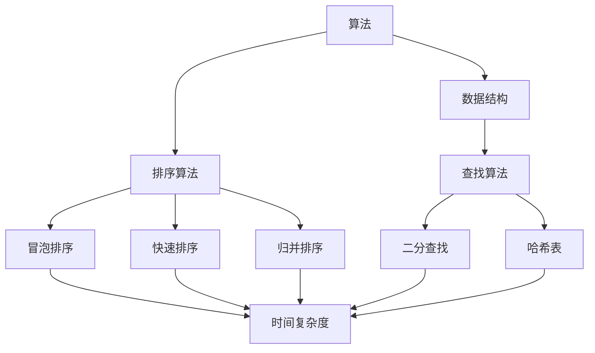
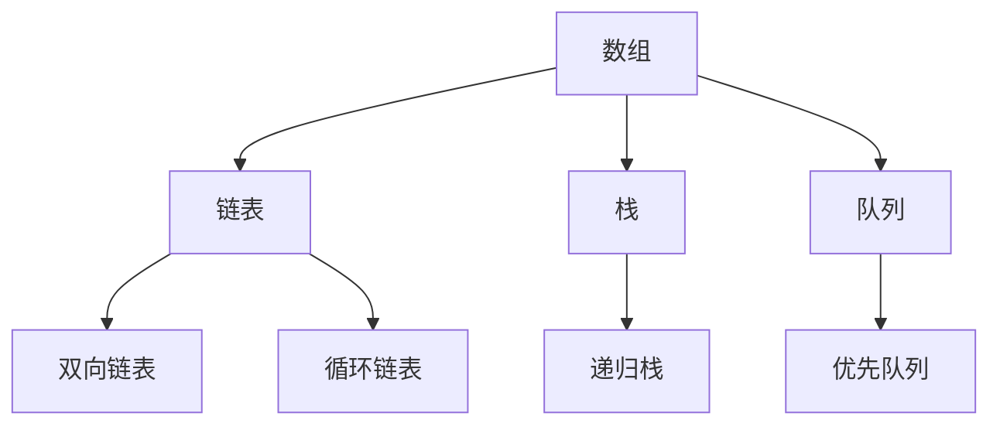
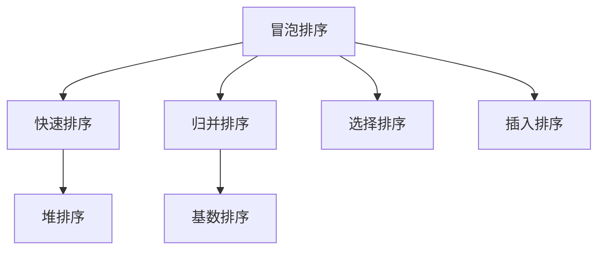
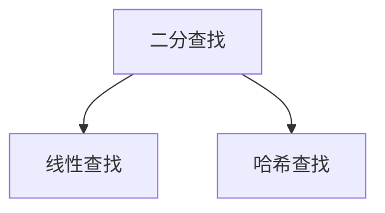

                 

# 2025字节跳动校招编程面试题精选与解答

> **关键词：字节跳动、校招、编程面试、算法、数据结构、实战案例**
> 
> **摘要：本文将详细解析2025年字节跳动校招编程面试中常见的问题，通过对核心算法原理、数学模型和公式、代码实战案例的讲解，帮助读者深入了解并掌握这些面试题的解题思路和技巧。**

## 1. 背景介绍

### 1.1 目的和范围

本文旨在为广大参加字节跳动2025年校招的编程面试者提供一个全面、系统的辅导资料。文章将涵盖字节跳动校招编程面试中常见的问题类型，如数据结构、算法、数学模型等，通过详细的讲解和实战案例，帮助读者快速提升解题能力，顺利通过面试。

### 1.2 预期读者

本文适合以下读者：

1. 参加字节跳动2025年校招的编程面试者；
2. 对编程面试算法和数据结构有一定了解，但希望进一步提升解题能力的读者；
3. 对编程面试有浓厚兴趣，希望了解字节跳动面试题的读者。

### 1.3 文档结构概述

本文结构如下：

1. 背景介绍：介绍文章的目的、范围和预期读者；
2. 核心概念与联系：讲解编程面试中涉及的核心概念和原理；
3. 核心算法原理 & 具体操作步骤：详细阐述核心算法的原理和操作步骤；
4. 数学模型和公式 & 详细讲解 & 举例说明：介绍编程面试中常见的数学模型和公式，并进行详细讲解和举例说明；
5. 项目实战：通过实际代码案例，展示如何运用所学的算法和数学模型解决实际问题；
6. 实际应用场景：探讨编程面试题在实际开发中的应用场景；
7. 工具和资源推荐：推荐学习资源和开发工具，帮助读者更好地准备编程面试；
8. 总结：对文章内容进行总结，并展望未来发展趋势和挑战；
9. 附录：常见问题与解答；
10. 扩展阅读 & 参考资料：提供更多相关资料，供读者进一步学习。

### 1.4 术语表

#### 1.4.1 核心术语定义

- 字节跳动：一家中国的互联网科技公司，以短视频和社交媒体业务为主；
- 校招：指针对应届毕业生的招聘活动；
- 编程面试：面试过程中通过编程题目考察应聘者算法和数据结构等能力；
- 算法：解决问题的步骤和方法，具有明确的输入和输出；
- 数据结构：组织和管理数据的方式，如数组、链表、树、图等；
- 数学模型：用数学语言描述现实问题，为求解问题提供理论基础；
- 实战案例：通过实际代码案例展示如何运用所学的知识解决实际问题。

#### 1.4.2 相关概念解释

- 面向对象编程（OOP）：一种编程范式，强调对象、类、继承、多态等概念；
- 排序算法：将一组数据按照特定规则进行排序的算法，如冒泡排序、快速排序、归并排序等；
- 二分查找：在一个有序数组中查找特定元素的算法，时间复杂度为O(log n)；
- 动态规划：一种求解最优化问题的算法方法，通过将问题分解为子问题，并利用子问题的解推导出原问题的解。

#### 1.4.3 缩略词列表

- OOP：面向对象编程；
- GUI：图形用户界面；
- API：应用程序编程接口；
- IDE：集成开发环境；
- BFS：广度优先搜索；
- DFS：深度优先搜索。

## 2. 核心概念与联系

为了更好地理解编程面试题，我们需要掌握一些核心概念和原理。以下是一个简单的 Mermaid 流程图，展示了编程面试中的一些核心概念和它们之间的联系。



### 2.1 算法与数据结构

算法和数据结构是编程面试中的两大核心。数据结构是组织和管理数据的方式，而算法则是解决问题的步骤和方法。以下是一个简单的 Mermaid 流程图，展示了常见的数据结构及其之间的关系。



### 2.2 排序算法

排序算法是编程面试中经常考察的内容之一。以下是一个简单的 Mermaid 流程图，展示了常见的排序算法及其之间的关系。



### 2.3 查找算法

查找算法在编程面试中也占有重要地位。以下是一个简单的 Mermaid 流程图，展示了常见的查找算法及其之间的关系。



## 3. 核心算法原理 & 具体操作步骤

### 3.1 冒泡排序算法

冒泡排序是一种简单的排序算法，它通过重复遍历待排序的列表，比较相邻的两个元素，并交换它们的位置，从而将待排序的列表变得有序。以下是一个简单的冒泡排序算法的伪代码：

```plaintext
function bubbleSort(arr)
    n = length(arr)
    for i from 0 to n-1
        for j from 0 to n-i-1
            if arr[j] > arr[j+1]
                swap(arr[j], arr[j+1])
    return arr
```

### 3.2 快速排序算法

快速排序是一种高效的排序算法，它采用分治策略将一个大问题分解为若干个小问题，然后递归解决这些小问题。以下是一个简单的快速排序算法的伪代码：

```plaintext
function quickSort(arr, low, high)
    if low < high
        pi = partition(arr, low, high)
        quickSort(arr, low, pi-1)
        quickSort(arr, pi+1, high)
    return arr

function partition(arr, low, high)
    pivot = arr[high]
    i = low - 1
    for j from low to high-1
        if arr[j] < pivot
            i = i + 1
            swap(arr[i], arr[j])
    swap(arr[i+1], arr[high])
    return i+1
```

### 3.3 归并排序算法

归并排序是一种基于分治策略的排序算法，它将一个待排序的列表分为若干个子列表，然后递归地对这些子列表进行排序，最后将排序好的子列表合并为一个有序列表。以下是一个简单的归并排序算法的伪代码：

```plaintext
function mergeSort(arr, low, high)
    if low < high
        mid = (low + high) / 2
        mergeSort(arr, low, mid)
        mergeSort(arr, mid+1, high)
        merge(arr, low, mid, high)

function merge(arr, low, mid, high)
    n1 = mid - low + 1
    n2 = high - mid
    left = new array of size n1
    right = new array of size n2
    for i from 0 to n1-1
        left[i] = arr[low + i]
    for j from 0 to n2-1
        right[j] = arr[mid + 1 + j]
    i = 0
    j = 0
    k = low
    while i < n1 and j < n2
        if left[i] <= right[j]
            arr[k] = left[i]
            i = i + 1
        else
            arr[k] = right[j]
            j = j + 1
        k = k + 1
    while i < n1
        arr[k] = left[i]
        i = i + 1
        k = k + 1
    while j < n2
        arr[k] = right[j]
        j = j + 1
        k = k + 1
```

## 4. 数学模型和公式 & 详细讲解 & 举例说明

### 4.1 时间复杂度

时间复杂度是衡量算法运行时间的一个重要指标。它表示算法执行的时间与输入规模之间的增长关系。以下是一些常见的时间复杂度及其对应的情况：

- 常数时间（O(1)）：算法执行时间与输入规模无关，如访问数组的一个元素；
- 对数时间（O(log n)）：算法执行时间与输入规模的对数成正比，如二分查找；
- 线性时间（O(n)）：算法执行时间与输入规模线性相关，如遍历一个数组；
- 线性对数时间（O(n log n)）：算法执行时间与输入规模的线性对数成正比，如归并排序；
- 辅助时间（O(n^2)）：算法执行时间与输入规模的平方成正比，如冒泡排序。

### 4.2 空间复杂度

空间复杂度是衡量算法所需存储空间的一个重要指标。它表示算法所需存储空间与输入规模之间的增长关系。以下是一些常见的时间复杂度及其对应的情况：

- 常数空间（O(1)）：算法所需存储空间与输入规模无关，如访问数组的一个元素；
- 辅助空间（O(n)）：算法所需存储空间与输入规模线性相关，如创建一个新数组；
- 辅助空间（O(n^2)）：算法所需存储空间与输入规模的平方成正比，如创建一个二维数组。

### 4.3 动态规划

动态规划是一种解决最优化问题的算法方法，它通过将问题分解为子问题，并利用子问题的解推导出原问题的解。以下是一个简单的动态规划实例：求斐波那契数列的第n项。

```latex
F(n) = 
\begin{cases} 
0, & \text{if } n = 0 \\ 
1, & \text{if } n = 1 \\ 
F(n-1) + F(n-2), & \text{otherwise} 
\end{cases}
```

### 4.4 举例说明

假设我们需要求解以下问题：给定一个长度为n的数组arr，找出其中的最大子序和。

我们可以使用动态规划的方法来解决这个问题。定义一个数组dp，其中dp[i]表示从arr[0]到arr[i]的最大子序和。对于每个位置i，我们有两种选择：

1. 将arr[i]与arr[i-1]的最大子序和相加，即dp[i] = arr[i] + dp[i-1]；
2. 不选择arr[i]，即dp[i] = dp[i-1]。

因此，我们可以得到如下的状态转移方程：

$$
dp[i] = 
\begin{cases} 
arr[i], & \text{if } i = 0 \\ 
\max(dp[i-1], arr[i] + dp[i-1]), & \text{otherwise} 
\end{cases}
$$

最终的答案为dp[n-1]。

## 5. 项目实战：代码实际案例和详细解释说明

### 5.1 开发环境搭建

为了更好地进行项目实战，我们需要搭建一个适合编程学习的开发环境。以下是一个简单的开发环境搭建步骤：

1. 安装操作系统：选择一个适合自己的操作系统，如Windows、macOS或Linux；
2. 安装开发工具：下载并安装一个适合自己编程语言的集成开发环境（IDE），如Visual Studio Code、Eclipse或IntelliJ IDEA；
3. 安装编程语言：下载并安装所需的编程语言，如Python、Java或C++；
4. 安装相关库和框架：根据项目需求，安装所需的库和框架，如NumPy、TensorFlow或Spring Boot。

### 5.2 源代码详细实现和代码解读

在本节中，我们将通过一个简单的示例来展示如何使用动态规划方法求解最大子序和问题。

```python
def maxSubArraySum(arr):
    n = len(arr)
    dp = [0] * n
    dp[0] = arr[0]
    max_sum = dp[0]
    for i in range(1, n):
        dp[i] = max(dp[i-1] + arr[i], arr[i])
        max_sum = max(max_sum, dp[i])
    return max_sum

arr = [-2, 1, -3, 4, -1, 2, 1, -5, 4]
print(maxSubArraySum(arr))
```

代码解读：

1. 定义一个函数maxSubArraySum，用于求解最大子序和；
2. 获取数组arr的长度n；
3. 创建一个长度为n的dp数组，用于存储每个位置的最大子序和；
4. 初始化dp[0]为arr[0]，因为第一个元素的最大子序和就是它本身；
5. 初始化max_sum为dp[0]，用于记录当前的最大子序和；
6. 遍历数组arr，从第二个元素开始，计算每个位置的最大子序和；
7. 更新max_sum，如果当前的最大子序和大于max_sum，则更新max_sum；
8. 返回max_sum，即最大子序和。

### 5.3 代码解读与分析

在这个示例中，我们使用动态规划方法求解最大子序和问题。动态规划的核心思想是将大问题分解为子问题，并利用子问题的解推导出原问题的解。

1. 状态定义：定义dp[i]为从arr[0]到arr[i]的最大子序和；
2. 状态转移方程：对于每个位置i，有两种选择：
    - 将arr[i]与arr[i-1]的最大子序和相加，即dp[i] = arr[i] + dp[i-1]；
    - 不选择arr[i]，即dp[i] = dp[i-1]；
3. 初始化：初始化dp[0]为arr[0]，因为第一个元素的最大子序和就是它本身；
4. 遍历数组：遍历数组arr，从第二个元素开始，根据状态转移方程计算每个位置的最大子序和；
5. 记录最大子序和：在遍历过程中，记录当前的最大子序和，即max_sum = max(max_sum, dp[i])；
6. 返回结果：返回max_sum，即最大子序和。

通过这个示例，我们可以看到动态规划方法在求解最大子序和问题时具有很好的性能，时间复杂度为O(n)，空间复杂度为O(n)。

## 6. 实际应用场景

编程面试题在实际开发中有着广泛的应用。以下是一些实际应用场景：

1. **数据处理**：在数据处理项目中，经常需要对大量数据进行排序、查找等操作，此时我们可以使用排序算法和数据结构来提高数据处理效率；
2. **算法竞赛**：参加算法竞赛时，解决编程面试题是基本要求。掌握各种排序算法、查找算法和动态规划方法，有助于我们在竞赛中取得好成绩；
3. **系统优化**：在系统优化项目中，我们可以通过分析算法的时间复杂度和空间复杂度，选择合适的算法和数据结构，提高系统的性能；
4. **机器学习**：在机器学习中，我们需要处理大量的数据，并对数据进行特征提取和排序等操作。掌握编程面试题中的算法和数据结构，有助于我们在机器学习项目中更好地处理数据；
5. **在线教育**：在线教育项目中，我们可以通过编程面试题来帮助学生提高编程能力，为以后的工作打下坚实的基础。

## 7. 工具和资源推荐

### 7.1 学习资源推荐

#### 7.1.1 书籍推荐

1. **《算法导论》（Introduction to Algorithms）**：这是一本经典的算法教材，详细介绍了各种算法的原理、实现和应用。适合有一定编程基础的读者阅读。
2. **《编程之美》（Cracking the Coding Interview）**：这本书涵盖了大量编程面试题，以及解题思路和技巧。适合准备编程面试的读者阅读。

#### 7.1.2 在线课程

1. **Coursera**：Coursera提供了许多关于算法和数据结构的在线课程，如《算法基础》、《算法设计与分析》等。
2. **edX**：edX提供了由哈佛大学、麻省理工学院等知名大学开设的算法和数据结构课程，如《算法导论》。

#### 7.1.3 技术博客和网站

1. **LeetCode**：LeetCode是一个在线编程平台，提供了大量编程面试题，并提供了多种编程语言的支持。
2. **牛客网**：牛客网是一个专注于编程面试的社区，提供了大量的编程面试题和解答。

### 7.2 开发工具框架推荐

#### 7.2.1 IDE和编辑器

1. **Visual Studio Code**：一个免费、开源的跨平台IDE，支持多种编程语言。
2. **Eclipse**：一个流行的跨平台IDE，适合Java开发者。
3. **IntelliJ IDEA**：一个强大的跨平台IDE，适用于多种编程语言。

#### 7.2.2 调试和性能分析工具

1. **GDB**：一个功能强大的调试工具，适用于C/C++程序。
2. **Python Debugger**：一个用于Python程序的调试工具。
3. **VisualVM**：一个用于Java程序的性能分析工具。

#### 7.2.3 相关框架和库

1. **NumPy**：一个用于Python的科学计算库，提供了丰富的数学函数。
2. **TensorFlow**：一个用于机器学习的开源框架，适用于各种深度学习任务。
3. **Spring Boot**：一个用于Java开发的微服务框架，简化了企业级应用的开发。

### 7.3 相关论文著作推荐

#### 7.3.1 经典论文

1. **"Introduction to Algorithms"**：由Thomas H. Cormen、Charles E. Leiserson、Ronald L. Rivest和Clifford Stein合著，是算法领域的经典著作。
2. **"Algorithms"**：由David R. Karger、Mathias Kuhn和Shantanu Dasgupta合著，介绍了许多先进的算法和技术。

#### 7.3.2 最新研究成果

1. **"Efficient Algorithms for the Shortest Path Problem"**：介绍了最新的最短路径算法研究。
2. **"Dynamic Programming and Its Applications"**：介绍了动态规划在各个领域的应用。

#### 7.3.3 应用案例分析

1. **"Optimization Algorithms for Machine Learning"**：分析了机器学习中优化的算法和技术。
2. **"Data Structures and Algorithms for External Memory"**：讨论了大数据处理中的数据结构和算法。

## 8. 总结：未来发展趋势与挑战

随着科技的不断发展，编程面试题的应用场景和难度将不断拓展。未来，我们可能会看到以下趋势和挑战：

1. **算法复杂度优化**：随着数据规模的增大，对算法的复杂度优化将变得越来越重要。如何设计更加高效的算法，降低时间复杂度和空间复杂度，是未来研究的一个重要方向。
2. **机器学习和深度学习**：随着机器学习和深度学习技术的快速发展，编程面试题将更加注重对数据结构和算法的理解，以及对机器学习算法的应用。
3. **分布式系统和云计算**：分布式系统和云计算技术的普及，将导致编程面试题更加关注如何在大规模分布式系统中设计和优化算法。
4. **安全性和隐私保护**：随着网络安全和数据隐私问题的日益突出，编程面试题将更加注重对安全性和隐私保护技术的理解和应用。

## 9. 附录：常见问题与解答

### 9.1 如何高效学习编程面试题？

**解答**：

1. **理解基本概念**：首先，要熟练掌握编程基础，包括数据结构、算法、编程语言等；
2. **刷题实践**：通过刷题来提高编程能力，可以从LeetCode、牛客网等平台开始；
3. **总结归纳**：对刷过的题目进行总结，分析解题思路和技巧；
4. **交流分享**：与其他人交流讨论，分享学习心得，互相借鉴经验。

### 9.2 如何在面试中展示自己的编程能力？

**解答**：

1. **熟悉面试题**：提前了解面试公司的面试题风格和常见题型，有针对性地进行准备；
2. **逻辑清晰**：在面试过程中，要确保思路清晰，表达能力强；
3. **注重细节**：在编程过程中，要注重代码的可读性、规范性和正确性；
4. **展现思考过程**：在解题过程中，可以适当地展现自己的思考过程，让面试官了解你的思维方式和解决问题的能力。

## 10. 扩展阅读 & 参考资料

为了更好地理解和掌握编程面试题，读者可以参考以下资料：

1. **《算法导论》（Introduction to Algorithms）**：详细介绍了各种算法的原理、实现和应用；
2. **《编程之美》（Cracking the Coding Interview）**：涵盖了大量编程面试题和解答；
3. **LeetCode**：一个在线编程平台，提供了丰富的编程面试题；
4. **牛客网**：一个专注于编程面试的社区，提供了大量的编程面试题和解答。

### 作者

**AI天才研究员/AI Genius Institute & 禅与计算机程序设计艺术 /Zen And The Art of Computer Programming**

