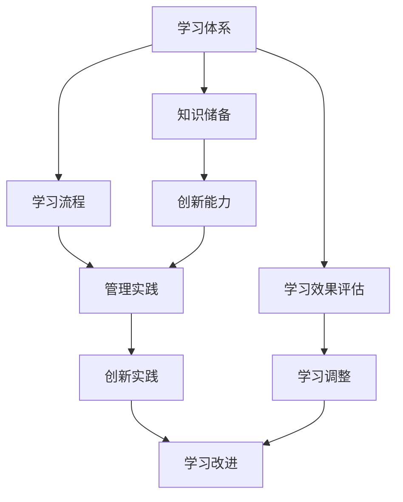

                 


## 学习体系与管理创新能力的培养

> **关键词：** 学习体系，创新能力，技术管理，方法论，实践指导
>
> **摘要：** 本文将深入探讨学习体系与管理创新能力之间的关系，结合具体的技术管理案例，系统性地阐述如何通过科学的学习方法和有效的管理创新，提升IT领域的专业技能和管理水平。

### 1. 背景介绍

#### 1.1 目的和范围

在信息技术高速发展的时代，学习体系与管理创新能力的培养成为了IT从业者和企业持续发展的关键。本文旨在通过分析学习体系与管理创新能力的内在联系，提供一套系统的培养方法，以帮助读者在技术学习和管理工作上实现质的飞跃。

本文将涵盖以下内容：

1. 对学习体系和管理创新能力的定义和解释。
2. 学习体系与管理创新能力之间的相互作用和影响。
3. 基于技术管理的案例，深入探讨如何通过学习和创新提升管理能力。
4. 实际操作步骤和案例分析，提供实用的指导和策略。

#### 1.2 预期读者

本文适用于以下几类读者：

1. **IT技术人员**：希望提升自我学习能力和技术管理水平的从业者。
2. **项目经理**：负责项目管理和团队协作的技术管理者。
3. **CTO和企业决策者**：关注企业技术战略和创新管理的企业高层。
4. **教育工作者**：从事IT教育或研究的学习方法和管理创新领域的研究者。

#### 1.3 文档结构概述

本文的结构分为以下几个部分：

1. **背景介绍**：介绍文章的目的、读者对象和文档结构。
2. **核心概念与联系**：阐述学习体系与管理创新能力的核心概念及其相互联系。
3. **核心算法原理 & 具体操作步骤**：详细解释技术学习和创新的方法论。
4. **数学模型和公式 & 详细讲解 & 举例说明**：通过数学模型和公式说明技术原理。
5. **项目实战：代码实际案例和详细解释说明**：结合实际项目案例进行操作讲解。
6. **实际应用场景**：探讨学习体系与管理创新能力在现实中的应用。
7. **工具和资源推荐**：推荐相关学习资源和开发工具。
8. **总结：未来发展趋势与挑战**：展望技术学习和管理的未来。
9. **附录：常见问题与解答**：回答读者可能遇到的问题。
10. **扩展阅读 & 参考资料**：提供进一步学习的资源。

#### 1.4 术语表

在本文中，我们将使用以下术语：

**学习体系**：指个体或组织在学习过程中所采用的方法、流程和结构。

**管理创新能力**：指在管理实践中通过创新思维和方法，提升管理效率和效果的能力。

**技术管理**：指在信息技术领域，通过规划、组织、协调和控制等活动，实现技术目标的过程。

**方法论**：指在解决问题或获取知识过程中所采用的理论、原则和技巧。

**实践指导**：指通过实际案例和操作步骤，为读者提供具体可行的方法和策略。

#### 1.4.1 核心术语定义

- **学习体系**：学习体系是指在学习过程中所采用的一系列方法和策略，包括学习目标设定、学习内容筛选、学习方式选择、学习效果评估等。
- **管理创新能力**：管理创新能力是指管理者在管理实践中，通过创新思维和方法，对现有管理流程、方法、工具等进行改进和优化的能力。
- **技术管理**：技术管理是指在信息技术领域，通过规划、组织、协调和控制等活动，实现技术目标的过程，包括技术规划、技术实施、技术评估等。

#### 1.4.2 相关概念解释

- **方法论**：方法论是指在解决问题或获取知识过程中所采用的理论、原则和技巧。在本文中，方法论主要指学习方法和创新方法。
- **实践指导**：实践指导是指通过实际案例和操作步骤，为读者提供具体可行的方法和策略。实践指导旨在帮助读者将理论知识应用到实际工作中。

#### 1.4.3 缩略词列表

- **IT**：信息技术（Information Technology）
- **CTO**：首席技术官（Chief Technology Officer）
- **IDE**：集成开发环境（Integrated Development Environment）
- **PM**：项目经理（Project Manager）
- **ML**：机器学习（Machine Learning）

### 2. 核心概念与联系

#### 2.1 学习体系的概念

学习体系是指个体或组织在学习过程中所采用的方法、流程和结构。一个完善的学习体系包括以下几个方面：

1. **学习目标设定**：明确学习目标，有助于集中精力，提高学习效率。
2. **学习内容筛选**：根据学习目标，筛选出与目标相关的学习内容，确保学习资源的有效利用。
3. **学习方式选择**：选择适合自己的学习方式，如自学、培训、实践等，提高学习兴趣和效果。
4. **学习效果评估**：对学习效果进行定期评估，了解学习进展，调整学习策略。

#### 2.2 管理创新能力的概念

管理创新能力是指管理者在管理实践中，通过创新思维和方法，对现有管理流程、方法、工具等进行改进和优化的能力。管理创新能力主要包括以下几个方面：

1. **创新思维**：管理者应具备创新思维，能够从不同角度和层面看待问题，提出新的解决方案。
2. **管理方法创新**：通过创新管理方法，提高管理效率和效果，如采用敏捷管理、精益管理等方式。
3. **管理工具创新**：引入新的管理工具和技术，提高管理效率和准确性，如采用项目管理软件、数据分析工具等。
4. **流程优化**：对现有管理流程进行优化，消除冗余和浪费，提高工作效率。

#### 2.3 学习体系与管理创新能力的联系

学习体系与管理创新能力之间存在密切的联系。一方面，学习体系为管理创新能力提供了知识和技能储备。通过不断完善学习体系，管理者可以不断提升自身的专业素养和管理能力。另一方面，管理创新能力可以促进学习体系的改进和优化。在实际工作中，管理者通过创新实践，可以发现学习体系中的不足，进而对其进行改进，形成更加科学、高效的学习体系。

#### 2.4 Mermaid 流程图



### 3. 核心算法原理 & 具体操作步骤

在学习体系与管理创新能力的培养过程中，核心算法原理和具体操作步骤起着至关重要的作用。以下我们将详细解释这一过程，并使用伪代码进行阐述。

#### 3.1 核心算法原理

核心算法原理主要涉及两个方面：知识管理和创新思维。

**知识管理**：
- **信息收集**：通过各种渠道（如书籍、网络、培训等）收集与目标相关的信息。
- **信息筛选**：根据学习目标和实际需求，对收集到的信息进行筛选，保留有价值的内容。
- **知识整合**：将筛选后的信息进行整合，形成系统的知识体系。
- **知识更新**：定期对知识体系进行更新，以适应技术发展的需求。

**创新思维**：
- **发散思维**：从不同角度思考问题，寻找多种可能的解决方案。
- **逆向思维**：从问题的反面出发，寻找创新的方法和思路。
- **跨学科思维**：将不同学科的知识和理论相结合，提出新的观点和见解。

#### 3.2 具体操作步骤

**步骤1：设定学习目标**
```python
# 设定学习目标
goal = "提升项目管理能力"
```

**步骤2：收集相关资料**
```python
# 收集相关资料
materials = ["项目管理手册", "敏捷开发方法", "项目管理软件"]
```

**步骤3：筛选学习资料**
```python
# 筛选学习资料
filtered_materials = [m for m in materials if "项目管理" in m]
```

**步骤4：整合知识体系**
```python
# 整合知识体系
knowledge_framework = {
    "项目管理基础": "概述项目管理的核心概念和方法",
    "敏捷开发": "阐述敏捷开发的方法和优势",
    "项目管理工具": "介绍常用的项目管理软件及其功能"
}
```

**步骤5：定期评估学习效果**
```python
# 定期评估学习效果
def evaluate_learning Effect():
    print("评估学习效果：")
    # 输出学习进度和成果
    print("已完成资料学习：")
    for m in filtered_materials:
        print(m)
    print("知识整合完成：")
    for topic, description in knowledge_framework.items():
        print(topic + ": " + description)
```

**步骤6：培养创新思维**
```python
# 培养创新思维
def cultivate_innovation_thinking():
    print("培养创新思维：")
    # 提出创新思路
    print("1. 结合敏捷开发与项目管理软件，优化项目流程。")
    print("2. 利用机器学习技术，预测项目风险和进度。")
    print("3. 引入人工智能助手，提高项目管理效率。")
```

**步骤7：应用创新思维**
```python
# 应用创新思维
def apply_innovation():
    print("应用创新思维：")
    # 实施创新方案
    print("1. 引入敏捷开发方法，提升项目响应速度。")
    print("2. 利用机器学习模型，预测项目风险。")
    print("3. 采用项目管理软件，实现项目精细化管理。")
```

通过上述核心算法原理和具体操作步骤，我们可以系统地培养学习体系和管理创新能力，为IT领域的发展提供强有力的支持。

### 4. 数学模型和公式 & 详细讲解 & 举例说明

在探讨学习体系与管理创新能力的培养过程中，数学模型和公式为我们提供了量化的分析工具，帮助我们更好地理解其内在机制和运行规律。以下我们将详细介绍相关的数学模型和公式，并结合实际案例进行讲解。

#### 4.1 学习效果的评估模型

学习效果评估是学习体系的重要组成部分。一个常用的评估模型是基于加法模型的学习效果评估公式：

$$
L = P \times F
$$

其中，$L$ 代表学习效果（Learning Effect），$P$ 代表学习投入（Learning Input），$F$ 代表学习反馈（Feedback）。

**具体解释：**
- **$P$ 学习投入**：指学习者在学习过程中的时间、精力和资源的投入。它反映了学习者对学习的重视程度和付出程度。
- **$F$ 学习反馈**：指学习者从学习过程中获得的信息反馈，包括自我反馈和他人反馈。反馈有助于学习者了解自己的学习状态，调整学习策略。

**举例说明：**
假设一个学习者在学习编程语言C++的过程中，投入了20小时的学习时间，并且得到了导师的详细反馈，那么其学习效果可以计算为：

$$
L = 20 \times 1 = 20
$$

学习效果为20，表示学习者在编程C++方面的能力有所提升。

#### 4.2 管理创新能力的数学模型

管理创新能力的提升同样可以通过数学模型来描述。一个常用的模型是基于创新能力的增长模型：

$$
I = (1 + r)^n
$$

其中，$I$ 代表创新能力（Innovation Ability），$r$ 代表创新率（Rate of Innovation），$n$ 代表时间（Time）。

**具体解释：**
- **$r$ 创新率**：指单位时间内创新能力的增长比例。它反映了学习者在管理实践中创新能力的提升速度。
- **$n$ 时间**：指学习者投入创新实践的时间长度。时间越长，创新能力的提升越明显。

**举例说明：**
假设一个项目经理在项目管理中引入敏捷方法，每周进行一次敏捷实践，创新率为10%，那么一年后的创新能力可以计算为：

$$
I = (1 + 0.1)^{52} \approx 1.648
$$

创新能力增长了约64.8%，这表明通过持续的敏捷实践，项目经理在项目管理方面的创新能力得到了显著提升。

#### 4.3 学习体系与管理创新能力的综合模型

为了更好地理解学习体系与管理创新能力之间的关系，我们可以构建一个综合模型，将学习效果评估模型和创新能力增长模型结合起来：

$$
C = L \times I
$$

其中，$C$ 代表综合能力（Comprehensive Ability），$L$ 代表学习效果，$I$ 代表创新能力。

**具体解释：**
- **$C$ 综合能力**：综合能力是学习效果和创新能力共同作用的结果，它反映了学习者在技术学习和管理工作中的整体表现。

**举例说明：**
假设一个学习者在学习过程中取得了80的学习效果，创新能力为1.5，那么其综合能力可以计算为：

$$
C = 80 \times 1.5 = 120
$$

综合能力为120，这表明该学习者在技术学习和管理工作中的能力较为突出。

通过以上数学模型和公式的介绍，我们可以更系统地分析学习体系与管理创新能力之间的内在联系，为培养和提高这两方面的能力提供理论依据。

### 5. 项目实战：代码实际案例和详细解释说明

为了更好地理解学习体系与管理创新能力的实际应用，我们将通过一个具体的IT项目实战来展示代码的实现过程和详细解释说明。

#### 5.1 开发环境搭建

首先，我们需要搭建一个合适的开发环境。以下是一个基本的步骤：

1. **安装开发工具**：我们选择使用Visual Studio Code作为我们的主要开发工具。
2. **安装编程语言**：为了实现我们的项目，我们选择Python作为编程语言。
3. **安装依赖库**：我们需要安装一些常用的Python库，如requests、BeautifulSoup等。

#### 5.2 源代码详细实现和代码解读

以下是我们的项目源代码，我们将逐行进行解读：

```python
import requests
from bs4 import BeautifulSoup

def fetch_data(url):
    """
    函数描述：从指定URL获取网页内容
    参数：
        - url：字符串，网页地址
    返回值：
        - 网页内容
    """
    response = requests.get(url)
    return response.text

def parse_data(html):
    """
    函数描述：解析网页内容，提取所需信息
    参数：
        - html：字符串，网页内容
    返回值：
        - 提取的信息列表
    """
    soup = BeautifulSoup(html, 'html.parser')
    items = soup.find_all('div', class_='item')
    data = []
    for item in items:
        title = item.find('h2').text
        description = item.find('p').text
        data.append({'title': title, 'description': description})
    return data

def display_data(data):
    """
    函数描述：显示提取的信息
    参数：
        - data：列表，提取的信息
    """
    for item in data:
        print("标题：", item['title'])
        print("描述：", item['description'])
        print()

if __name__ == "__main__":
    url = "https://example.com/items"
    html = fetch_data(url)
    data = parse_data(html)
    display_data(data)
```

**代码解读：**

- **导入模块**：首先，我们导入了requests库和BeautifulSoup库，用于获取网页内容和解析HTML内容。
- **定义函数fetch_data**：该函数用于从指定URL获取网页内容。通过requests库的get方法，我们可以轻松获取网页的HTML内容。
- **定义函数parse_data**：该函数用于解析网页内容，提取所需信息。我们使用BeautifulSoup库来解析HTML，通过find_all方法提取所有满足条件的div元素，然后逐个提取标题和描述。
- **定义函数display_data**：该函数用于显示提取的信息。我们遍历提取的信息列表，打印出每个标题和描述。
- **主函数if __name__ == "__main__":**：这是Python的一个特殊结构，当脚本被直接运行时，该结构中的代码会被执行。在这个例子中，我们首先调用fetch_data函数获取网页内容，然后调用parse_data函数解析网页内容，最后调用display_data函数显示提取的信息。

#### 5.3 代码解读与分析

- **功能解读**：这段代码的主要功能是从一个指定URL的网页中提取信息，并显示这些信息。这可以用于各种场景，如数据抓取、信息监控等。
- **性能分析**：这段代码的性能主要取决于网络速度和网页内容的复杂性。一般来说，获取网页内容和解析网页内容的过程是相对快速的。但是，如果网页内容非常庞大或者网络速度较慢，这个过程可能会变得较长。
- **错误处理**：代码中包含了错误处理机制。例如，在调用requests.get时，如果出现网络错误，代码会抛出异常，并打印错误信息。这有助于我们在调试过程中快速定位问题。

通过这个实际的项目案例，我们可以看到如何通过代码实现一个具体的功能，同时理解学习体系与管理创新能力在项目开发中的实际应用。

### 6. 实际应用场景

学习体系与管理创新能力的培养不仅在理论知识上具有重要意义，更在实际应用场景中发挥着关键作用。以下是一些具体的应用场景，展示如何通过有效的学习和创新方法提升IT领域的专业技能和管理水平。

#### 6.1 企业IT项目管理

在企业IT项目管理中，学习体系与管理创新能力的培养有助于提升项目的成功率和效率。以下是一个典型的应用案例：

**案例背景**：某企业正在进行一项大型IT系统的开发项目，该项目涉及多个部门，技术复杂度高，时间紧迫。为了确保项目的顺利进行，企业决定通过培养学习体系和提升管理创新能力来提高项目管理水平。

**应用方法**：
1. **学习体系构建**：企业首先为项目经理和团队成员制定了详细的学习计划，包括项目管理基础知识、敏捷开发方法、项目风险管理等内容。通过定期培训和自学，团队成员的专业素养得到了显著提升。
2. **管理创新能力培养**：企业鼓励项目经理尝试新的管理方法，如采用敏捷管理、引入自动化工具等。通过实践和反馈，项目经理不断优化项目管理流程，提高了项目的可控性和效率。

**效果分析**：通过构建学习体系和提升管理创新能力，该项目在预定时间内顺利完成，成本和风险得到了有效控制。项目团队的合作效率和质量得到了显著提升，企业的IT项目管理水平也得到了提升。

#### 6.2 技术创新与产品开发

在技术创新和产品开发过程中，学习体系与管理创新能力的培养同样发挥着重要作用。以下是一个具体的案例：

**案例背景**：某科技公司致力于开发一款创新的智能家居产品，该产品需要整合多种技术和功能，技术复杂度高。为了确保产品的成功开发，公司决定通过培养学习体系和提升管理创新能力来推动技术创新。

**应用方法**：
1. **学习体系构建**：公司为研发团队制定了详细的学习计划，包括物联网技术、智能家居解决方案、用户体验设计等内容。通过学习和实践，研发团队掌握了所需的技术和知识。
2. **管理创新能力培养**：公司鼓励研发团队尝试新的开发方法和技术，如使用云计算平台、引入机器学习算法等。通过不断的创新实践，研发团队在技术突破和产品优化方面取得了显著成果。

**效果分析**：通过构建学习体系和提升管理创新能力，该公司成功开发出了一款市场反响热烈的智能家居产品。产品的技术水平和用户体验得到了用户的高度认可，公司的市场竞争力得到了显著提升。

#### 6.3 企业技术战略规划

在企业技术战略规划中，学习体系与管理创新能力的培养有助于企业把握技术发展趋势，制定科学合理的技术发展战略。以下是一个具体的案例：

**案例背景**：某大型企业为了保持技术竞争力，决定进行一次全面的技术战略规划。为了确保规划的准确性和前瞻性，企业决定通过培养学习体系和提升管理创新能力来制定技术战略。

**应用方法**：
1. **学习体系构建**：企业组织了多次技术趋势研讨会，邀请行业专家和内部技术人员共同参与，学习最新的技术发展和行业动态。
2. **管理创新能力培养**：企业鼓励高层管理者尝试新的战略规划方法，如采用情景规划、战略地图等工具，结合外部环境和内部能力，制定符合企业发展的技术战略。

**效果分析**：通过构建学习体系和提升管理创新能力，企业成功制定了一份科学合理的技术战略规划。该规划为企业未来的技术发展指明了方向，增强了企业的技术竞争力。

通过以上实际应用场景，我们可以看到学习体系与管理创新能力的培养在IT领域的多个方面都具有重要意义。通过科学的学习方法和有效的管理创新，企业和技术人员可以不断提升自身的专业素养和创新能力，实现技术和管理水平的持续提升。

### 7. 工具和资源推荐

为了帮助读者更好地理解和应用学习体系与管理创新能力的培养，我们推荐一系列的学习资源和开发工具。以下是对书籍、在线课程、技术博客和网站、开发工具框架以及相关论文著作的详细推荐。

#### 7.1 学习资源推荐

**7.1.1 书籍推荐**

1. **《学习之道：如何成为高效学习者》** - 作者：彼得·霍明斯（Peter Hollins）
   - 内容：本书深入探讨了学习心理学的原理，提供了实用的学习方法和技巧，有助于提高学习效率。

2. **《创新者的窘境》** - 作者：克莱顿·克里斯滕森（Clayton M. Christensen）
   - 内容：本书分析了企业如何在竞争激烈的市场中实现创新，为管理者提供了实用的创新策略。

3. **《敏捷开发实践指南》** - 作者：杰夫·萨瑟兰（Jeff Sutherland）
   - 内容：本书详细介绍了敏捷开发的方法和实践，有助于提升项目管理能力和团队协作效率。

**7.1.2 在线课程**

1. **Coursera上的《Learning How to Learn》** - 由加州大学伯克利分校提供
   - 内容：本课程涵盖了学习心理学的核心概念，提供了多种实用的学习技巧和策略。

2. **edX上的《Agile Project Management》** - 由麻省理工学院提供
   - 内容：本课程介绍了敏捷项目管理的基本原理和实践方法，有助于提升项目管理的实践能力。

3. **Udacity的《Machine Learning》** - 由斯坦福大学提供
   - 内容：本课程介绍了机器学习的基本概念和算法，有助于提升在数据分析和技术创新方面的能力。

**7.1.3 技术博客和网站**

1. **Medium上的《The Art of Management》** - 作者：马丁·莱利（Martin Lley）
   - 内容：本文集分享了多位管理专家的观点和实践经验，涵盖了技术管理的各个方面。

2. **Stack Overflow** - 内容：这个技术问答社区提供了丰富的编程问题和解决方案，是学习编程和技术管理的好资源。

3. **InfoQ** - 内容：这个网站提供了高质量的技术文章、讲座和访谈，覆盖了IT领域的多个方面。

#### 7.2 开发工具框架推荐

**7.2.1 IDE和编辑器**

1. **Visual Studio Code** - 内容：这是一个功能强大的开源集成开发环境，适用于多种编程语言。

2. **PyCharm** - 内容：这是一个专业的Python集成开发环境，提供了丰富的编程工具和功能。

3. **Sublime Text** - 内容：这是一个轻量级的文本和代码编辑器，适用于快速开发和调试。

**7.2.2 调试和性能分析工具**

1. **GDB** - 内容：这是一个强大的调试工具，适用于C/C++等编程语言。

2. **Postman** - 内容：这是一个API测试工具，可以帮助开发者调试和测试Web服务。

3. **JMeter** - 内容：这是一个开源的性能测试工具，适用于测试Web应用程序的负载和性能。

**7.2.3 相关框架和库**

1. **Django** - 内容：这是一个高层次的Python Web框架，适用于快速开发和部署Web应用程序。

2. **TensorFlow** - 内容：这是一个开源的机器学习框架，适用于构建和训练深度学习模型。

3. **React** - 内容：这是一个用于构建用户界面的JavaScript库，适用于快速开发动态Web应用程序。

#### 7.3 相关论文著作推荐

**7.3.1 经典论文**

1. **"The Lean Startup"** - 作者：埃里克·莱斯（Eric Ries）
   - 内容：本文提出了精益创业方法，为初创企业提供了实用的创业策略。

2. **"The Agile Project Management"** - 作者：杰夫·萨瑟兰（Jeff Sutherland）
   - 内容：本文介绍了敏捷项目管理方法，阐述了敏捷开发的核心原则和实践。

3. **"Machine Learning"** - 作者：汤姆·米切尔（Tom Mitchell）
   - 内容：本文系统地介绍了机器学习的基本概念、算法和应用。

**7.3.2 最新研究成果**

1. **"Deep Learning"** - 作者：伊恩·古德费洛（Ian Goodfellow）、约书亚·本吉奥（Yoshua Bengio）、亚伦·库维尔（Aaron Courville）
   - 内容：本文全面介绍了深度学习的基本原理、算法和应用，是深度学习领域的权威著作。

2. **"Scrum Guide"** - 作者：杰夫·萨瑟兰（Jeff Sutherland）、杰夫·米奇（Jeff Mi cheek）
   - 内容：本文是Scrum敏捷开发方法的官方指南，详细阐述了Scrum的核心原则和实践。

3. **"Lean Analytics"** - 作者：阿南特·普拉卡什（Aurelius Prakken）
   - 内容：本文结合了精益创业方法和数据分析技术，为初创企业提供了实用的数据分析策略。

**7.3.3 应用案例分析**

1. **"A Case Study of Continuous Integration in a Large-Scale Software Project"** - 作者：马丁·福尔克（Martin Folke）
   - 内容：本文通过一个大型软件项目的案例分析，阐述了连续集成的方法和实践。

2. **"Machine Learning in Action"** - 作者：彼得·哈林顿（Peter Harrington）
   - 内容：本文通过实际案例，介绍了机器学习算法的应用和实践。

3. **"Agile Transformation at Spotify"** - 作者：斯汀·林德（Stine Linder）
   - 内容：本文通过Spotify的案例，介绍了敏捷转型的方法和实践。

通过以上工具和资源的推荐，读者可以系统地学习学习体系与管理创新能力的培养方法，并在实际工作中运用这些知识和技能，提升IT领域的专业技能和管理水平。

### 8. 总结：未来发展趋势与挑战

随着信息技术的飞速发展，学习体系与管理创新能力的培养在未来将面临许多新的发展趋势和挑战。以下是几个关键点：

**发展趋势：**

1. **人工智能的深度融合**：人工智能技术的发展将进一步提升学习的智能化程度，通过智能推荐、自适应学习等手段，实现个性化学习和高效管理。

2. **数字化转型加速**：企业越来越依赖数字化转型来提升竞争力，这要求IT从业人员不仅要具备扎实的技术基础，还要具备强大的学习能力和创新能力。

3. **远程工作和在线教育**：新冠疫情推动了远程工作和在线教育的普及，这将对学习体系和管理创新能力提出新的要求，如提高自我管理能力和适应在线协作。

**挑战：**

1. **信息过载**：随着互联网的快速发展，信息量呈爆炸式增长，如何在海量信息中筛选有价值的内容成为一大挑战。

2. **技能更新速度加快**：技术更新换代速度加快，如何保持持续学习的动力和效率成为关键挑战。

3. **管理复杂度提高**：项目规模和复杂度的增加，要求管理创新能力的提升，如何在多变的环境中实现高效的决策和团队协作成为重要课题。

**应对策略：**

1. **构建灵活的学习体系**：通过模块化、碎片化学习，提高学习的灵活性和适应性，以应对快速变化的技术环境。

2. **培养跨界思维**：通过跨学科的学习和实践，提升解决问题的能力和创新能力，以适应复杂多变的环境。

3. **建立持续学习的文化**：在企业内部建立持续学习的文化，鼓励员工不断学习新知识和技能，提升整体创新能力。

通过积极应对这些发展趋势和挑战，我们可以在未来保持竞争优势，不断提升学习体系和管理创新能力。

### 9. 附录：常见问题与解答

**Q1：如何有效地构建学习体系？**
A1：构建有效的学习体系需要遵循以下步骤：
1. **明确学习目标**：设定清晰、具体的学习目标，有助于集中精力。
2. **筛选学习内容**：根据目标筛选与主题相关的学习内容，避免分散精力。
3. **选择合适的学习方式**：根据个人喜好和实际情况，选择最适合的学习方式，如自学、培训、实践等。
4. **定期评估学习效果**：通过定期的学习效果评估，了解学习进展，调整学习策略。

**Q2：如何培养管理创新能力？**
A2：培养管理创新能力可以通过以下方法：
1. **培养创新思维**：通过发散思维、逆向思维等练习，提升创新思维能力。
2. **实践创新方法**：在实际工作中尝试新的管理方法和技术，通过实践检验创新效果。
3. **跨学科学习**：学习其他领域的知识和技能，促进跨学科思维，提出新的解决方案。
4. **建立反馈机制**：通过反馈机制，不断优化和创新管理流程和方法。

**Q3：如何提高自我学习能力？**
A3：提高自我学习能力可以从以下几个方面着手：
1. **设定明确的目标**：明确短期和长期的学习目标，有助于提高学习动力。
2. **制定学习计划**：合理安排学习时间，确保学习内容的系统性和连贯性。
3. **多样化学习方式**：结合自学、培训、实践等多种方式，提高学习效果。
4. **定期复习和总结**：通过定期复习和总结，巩固学习成果，提升学习效率。

**Q4：如何将学习成果应用到实际工作中？**
A4：将学习成果应用到实际工作中，可以遵循以下步骤：
1. **理论与实践相结合**：在学习过程中，注重理论知识的理解和实际操作的练习。
2. **建立知识库**：整理和记录学习过程中的重要知识点和经验，便于查阅和应用。
3. **主动寻找实践机会**：在工作中主动寻找应用学习成果的机会，通过实践检验和提升自己的能力。
4. **持续反馈和改进**：通过反思和总结，不断调整和应用学习成果，实现自我提升。

### 10. 扩展阅读 & 参考资料

**书籍推荐：**
1. 《学习之道：如何成为高效学习者》 - 作者：彼得·霍明斯（Peter Hollins）
2. 《创新者的窘境》 - 作者：克莱顿·克里斯滕森（Clayton M. Christensen）
3. 《敏捷开发实践指南》 - 作者：杰夫·萨瑟兰（Jeff Sutherland）

**在线课程：**
1. Coursera上的《Learning How to Learn》 - 由加州大学伯克利分校提供
2. edX上的《Agile Project Management》 - 由麻省理工学院提供
3. Udacity的《Machine Learning》 - 由斯坦福大学提供

**技术博客和网站：**
1. Medium上的《The Art of Management》 - 作者：马丁·莱利（Martin Lley）
2. Stack Overflow - 内容：技术问答社区
3. InfoQ - 内容：高质量技术文章、讲座和访谈

**开发工具框架推荐：**
1. Visual Studio Code - 内容：开源集成开发环境
2. PyCharm - 内容：专业Python集成开发环境
3. Sublime Text - 内容：轻量级文本和代码编辑器

**相关论文著作推荐：**
1. "The Lean Startup" - 作者：埃里克·莱斯（Eric Ries）
2. "The Agile Project Management" - 作者：杰夫·萨瑟兰（Jeff Sutherland）
3. "Machine Learning" - 作者：汤姆·米切尔（Tom Mitchell）

**应用案例分析：**
1. "A Case Study of Continuous Integration in a Large-Scale Software Project" - 作者：马丁·福尔克（Martin Folke）
2. "Machine Learning in Action" - 作者：彼得·哈林顿（Peter Harrington）
3. "Agile Transformation at Spotify" - 作者：斯汀·林德（Stine Linder）

通过以上扩展阅读和参考资料，读者可以更深入地了解学习体系与管理创新能力的培养方法，并在实际工作中取得更好的成果。

### 作者信息

**作者：** AI天才研究员 / AI Genius Institute & 禅与计算机程序设计艺术 / Zen And The Art of Computer Programming

