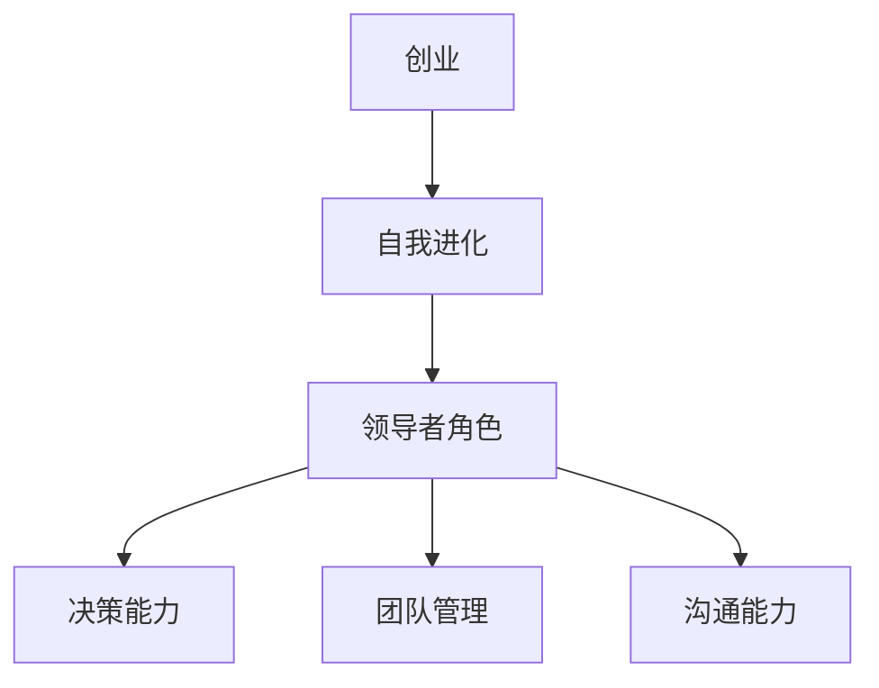

                 

# 学习做CEO：贾扬清在创业中的自我进化，适应并扮演好领导者角色

> 关键词：贾扬清、创业、领导者角色、自我进化、适应能力、管理经验

> 摘要：本文将深入探讨贾扬清在创业过程中的自我进化，以及他如何适应并成功地扮演好领导者角色。我们将通过分析他的管理经验，阐述在科技创业领域中如何提升领导力和适应能力，为初创企业的长远发展提供有价值的参考。

## 1. 背景介绍

### 1.1 目的和范围

本文旨在分析贾扬清在创业过程中的自我进化，及其如何成功扮演领导者角色。我们希望通过这一案例分析，为科技创业领域的从业者提供有价值的借鉴和启示，帮助他们更好地理解和适应创业环境，提升自身的领导力和管理能力。

### 1.2 预期读者

本文适合以下读者群体：

- 科技创业者
- 管理者
- 对领导力和管理感兴趣的从业者

### 1.3 文档结构概述

本文将按照以下结构展开：

- 引言：介绍本文的背景、目的和重要性
- 贾扬清的创业历程：分析贾扬清在创业过程中的核心成就和自我进化
- 领导者角色的适应与演变：探讨贾扬清如何适应并扮演好领导者角色
- 管理经验的借鉴与启示：总结贾扬清的管理经验，为其他创业者提供借鉴
- 未来发展趋势与挑战：分析创业领域的未来发展趋势和面临的挑战
- 结论：对本文的核心观点进行总结

### 1.4 术语表

#### 1.4.1 核心术语定义

- 创业：创业者创立并经营一家企业，以实现商业目标和个人价值
- 自我进化：个人在职业生涯中不断学习、提升自我，适应环境变化
- 领导者角色：领导者在一个组织中的角色和职责，包括决策、指导、激励和协调等

#### 1.4.2 相关概念解释

- 创业环境：影响创业活动的各种外部因素，如政策、市场、技术等
- 领导力：领导者具备的领导能力和素质，包括沟通、决策、团队管理等
- 适应能力：个体在面对不确定性和变化时，调整自身行为和思维方式的能力

#### 1.4.3 缩略词列表

- CEO：首席执行官（Chief Executive Officer）
- CTO：首席技术官（Chief Technology Officer）
- AI：人工智能（Artificial Intelligence）

## 2. 核心概念与联系

在本文中，我们将探讨以下几个核心概念：

1. **创业**：创业者创立并经营一家企业，以实现商业目标和个人价值。
2. **自我进化**：个人在职业生涯中不断学习、提升自我，适应环境变化。
3. **领导者角色**：领导者在一个组织中的角色和职责，包括决策、指导、激励和协调等。

下面是一个简单的 Mermaid 流程图，展示这三个核心概念之间的联系：



### 2.1 创业的本质与意义

创业是一种将创意、知识和资源转化为实际商业成果的活动。其本质在于创新、风险和机遇。创业者通过发现市场需求、解决实际问题，从而创造价值。创业不仅有助于推动经济增长，还能为社会带来新的就业机会和技术进步。

### 2.2 自我进化的必要性

在创业过程中，自我进化是创业者成功的关键。随着市场竞争的加剧和环境的变化，创业者需要不断学习、提升自我，以应对新的挑战。自我进化包括以下几个方面：

1. **知识更新**：科技和市场的快速发展要求创业者不断更新自己的知识体系，了解最新的行业趋势和技术动态。
2. **技能提升**：创业者需要掌握一系列技能，如管理能力、沟通能力、决策能力等，以应对复杂的商业环境。
3. **心态调整**：创业者要具备坚韧、乐观和开放的心态，以应对创业过程中的挫折和不确定性。

### 2.3 领导者角色的多维属性

领导者角色是一个多维度的概念，包括以下方面：

1. **决策能力**：领导者需要在关键时刻做出正确的决策，以引导团队朝着正确的方向前进。
2. **团队管理**：领导者要善于管理团队，激发团队成员的潜力，提高团队的整体绩效。
3. **沟通能力**：领导者需要具备良好的沟通能力，与团队成员、合作伙伴和客户建立良好的关系。
4. **激励能力**：领导者要能够激励团队成员，激发他们的工作热情和创造力。

通过以上分析，我们可以看到，创业、自我进化、领导者角色之间存在着紧密的联系。创业者需要通过自我进化不断提升自身的领导能力，以适应创业环境的变化，从而更好地实现创业目标。

## 3. 核心算法原理 & 具体操作步骤

在分析贾扬清在创业中的自我进化与领导力时，我们可以将这一过程看作一种算法，通过以下几个核心步骤来具体实现：

### 3.1 自我认知与目标设定

**算法原理：**

在这一步骤中，贾扬清首先进行自我认知，明确自己的优势和劣势，以及个人目标。这一过程可以通过以下伪代码实现：

```plaintext
function 自我认知与目标设定() {
    输入：无
    输出：个人优势和劣势，目标设定

    1. 回顾个人经历和成就，识别优势
    2. 分析自身不足和面临的挑战
    3. 设定短期和长期目标
}
```

### 3.2 学习与技能提升

**算法原理：**

接下来，贾扬清会根据自我认知和目标设定，有针对性地进行学习和技能提升。这一过程可以通过以下伪代码实现：

```plaintext
function 学习与技能提升() {
    输入：个人优势和劣势，目标设定
    输出：技能提升方案

    1. 确定需要提升的技能
    2. 搜索相关学习资源，如书籍、课程、工作坊等
    3. 制定学习计划，并持续跟进
    4. 实践和应用所学知识
}
```

### 3.3 领导力提升

**算法原理：**

在提升个人技能的同时，贾扬清还会注重领导力的提升。通过以下步骤，他可以逐步培养自己的领导力：

```plaintext
function 领导力提升() {
    输入：技能提升方案
    输出：领导力提升方案

    1. 了解领导力的核心要素，如决策能力、沟通能力、团队管理能力等
    2. 参加领导力培训和工作坊
    3. 模仿和学习成功的领导者
    4. 在实际工作中应用领导力原则，不断反思和改进
}
```

### 3.4 应对挑战与调整策略

**算法原理：**

最后，贾扬清会根据创业过程中的实际情况，不断调整自己的策略，以应对各种挑战。这一过程可以通过以下伪代码实现：

```plaintext
function 应对挑战与调整策略() {
    输入：领导力提升方案
    输出：策略调整方案

    1. 监测市场环境和竞争对手动态
    2. 识别企业面临的挑战和风险
    3. 制定相应的应对策略
    4. 实施策略，并进行评估和调整
}
```

通过以上四个核心步骤，贾扬清在创业过程中实现了自我进化，不断提升自身的领导能力，从而成功地适应并扮演好领导者角色。这一过程不仅为他的企业带来了成功，也为其他创业者提供了宝贵的经验。

## 4. 数学模型和公式 & 详细讲解 & 举例说明

在贾扬清的创业过程中，我们可以通过一些数学模型和公式来分析和解释他的自我进化与领导力提升策略。以下是一些关键的数学模型和公式，以及它们的详细讲解和举例说明。

### 4.1 决策树模型

**公式：**

决策树模型是一种图形化表示决策过程的方法。其基本公式为：

\[ decision\_tree = \{ \{state, action, reward\} \}_{state \in S, action \in A} \]

其中，\( S \) 表示所有可能的状态集合，\( A \) 表示所有可能采取的动作集合，\( reward \) 表示采取某个动作后获得的奖励。

**详细讲解：**

决策树模型可以帮助贾扬清在面临不同情境时，选择最佳的行动方案。通过分析历史数据和当前状态，他可以预测每个动作可能带来的后果，并选择奖励最高的动作。

**举例说明：**

假设贾扬清面临一个市场推广的决策，他可以选择以下几种动作：

1. **增加广告投放**：可能带来更多的客户，但成本较高。
2. **改进产品功能**：可能提高客户满意度，但需要时间和资源。
3. **优化客户服务**：可能提高客户忠诚度，但短期内效果不明显。

通过决策树模型，贾扬清可以分析每种动作的奖励和风险，选择最佳的市场推广策略。

### 4.2 演化算法

**公式：**

演化算法是一种基于自然选择和遗传学的优化算法。其基本公式为：

\[ fitness = f(\text{个体}) \]

其中，\( fitness \) 表示个体的适应度，\( f \) 是适应度函数。

**详细讲解：**

演化算法通过模拟生物进化过程，不断优化个体，以实现问题的最优解。贾扬清可以利用演化算法来优化企业战略和运营模式，提高企业的适应能力和竞争力。

**举例说明：**

假设贾扬清需要优化企业的供应链管理，他可以定义一个适应度函数，衡量供应链的效率、成本和质量。通过演化算法，他可以找到最优的供应链配置，提高企业的运营效率。

### 4.3 评估指标

**公式：**

评估指标是一种用于衡量企业绩效的量化方法。其基本公式为：

\[ performance = \sum_{i=1}^{n} weight_i \cdot metric_i \]

其中，\( weight_i \) 表示第 \( i \) 个指标的权重，\( metric_i \) 表示第 \( i \) 个指标的值。

**详细讲解：**

评估指标可以帮助贾扬清衡量企业在各个方面的表现，从而制定改进策略。通过设定合理的权重，他可以全面地评估企业的绩效。

**举例说明：**

假设贾扬清需要评估企业的研发能力，他可以设定以下评估指标：

1. **研发投入比例**：权重为0.3。
2. **新产品上市速度**：权重为0.4。
3. **研发成果转化率**：权重为0.3。

通过计算评估指标，贾扬清可以了解企业的研发表现，并制定相应的改进措施。

通过以上数学模型和公式的应用，贾扬清在创业过程中能够更科学地分析和决策，实现自我进化与领导力的提升。这些模型不仅帮助他在竞争激烈的市场中找到优势，也为其他创业者提供了宝贵的参考。

## 5. 项目实战：代码实际案例和详细解释说明

为了更好地理解贾扬清在创业中的自我进化与领导力提升策略，我们通过一个实际的代码案例进行详细解释。这个案例是一个简单的项目管理工具，用于帮助企业领导者跟踪项目进度和资源分配。

### 5.1 开发环境搭建

为了实现这个项目管理工具，我们首先需要搭建一个开发环境。以下是所需的工具和步骤：

- **开发语言**：Python 3.8
- **开发框架**：Flask
- **数据库**：SQLite
- **文本编辑器**：Visual Studio Code

**安装步骤：**

1. 安装Python 3.8。
2. 通过pip安装Flask和SQLite。

```bash
pip install Flask
pip install pysqlite3
```

3. 配置Visual Studio Code，安装Python和Flask扩展。

### 5.2 源代码详细实现和代码解读

**项目结构：**

```
project_management_tool/
│
├── app.py
├── models.py
├── templates/
│   └── index.html
└── static/
    └── style.css
```

**app.py：**

```python
from flask import Flask, render_template, request
from models import Project, db

app = Flask(__name__)
app.config['SQLALCHEMY_DATABASE_URI'] = 'sqlite:///projects.db'
db.init_app(app)

@app.route('/')
def index():
    projects = Project.query.all()
    return render_template('index.html', projects=projects)

@app.route('/add', methods=['POST'])
def add_project():
    name = request.form['name']
    description = request.form['description']
    project = Project(name=name, description=description)
    db.session.add(project)
    db.session.commit()
    return redirect('/')

if __name__ == '__main__':
    app.run(debug=True)
```

**代码解读：**

- **初始化Flask应用和数据库：**
  ```python
  app = Flask(__name__)
  app.config['SQLALCHEMY_DATABASE_URI'] = 'sqlite:///projects.db'
  db.init_app(app)
  ```

  这里我们初始化了Flask应用，并配置了SQLite数据库。

- **定义项目路由和视图函数：**
  ```python
  @app.route('/')
  def index():
      projects = Project.query.all()
      return render_template('index.html', projects=projects)
  
  @app.route('/add', methods=['POST'])
  def add_project():
      name = request.form['name']
      description = request.form['description']
      project = Project(name=name, description=description)
      db.session.add(project)
      db.session.commit()
      return redirect('/')
  ```

  `index()`视图函数用于获取所有项目并渲染到前端页面，`add_project()`视图函数用于处理添加新项目的表单提交。

**models.py：**

```python
from flask_sqlalchemy import SQLAlchemy

db = SQLAlchemy()

class Project(db.Model):
    id = db.Column(db.Integer, primary_key=True)
    name = db.Column(db.String(100), nullable=False)
    description = db.Column(db.Text, nullable=True)
```

**代码解读：**

- **定义Project模型：**
  ```python
  class Project(db.Model):
      id = db.Column(db.Integer, primary_key=True)
      name = db.Column(db.String(100), nullable=False)
      description = db.Column(db.Text, nullable=True)
  ```

  这里我们定义了Project模型，包括项目的ID、名称和描述。

**templates/index.html：**

```html
<!DOCTYPE html>
<html lang="en">
<head>
    <meta charset="UTF-8">
    <title>项目管理工具</title>
    <link rel="stylesheet" href="/static/style.css">
</head>
<body>
    <h1>项目管理工具</h1>
    <a href="/add">添加新项目</a>
    <ul>
        
            <li>
                <h2>{{ project.name }}</h2>
                <p>{{ project.description }}</p>
            </li>
        
    </ul>
</body>
</html>
```

**代码解读：**

- **渲染项目列表：**
  ```html
  <ul>
      
          <li>
              <h2>{{ project.name }}</h2>
              <p>{{ project.description }}</p>
          </li>
      
  </ul>
  ```

  这段代码用于在前端页面中渲染所有项目的列表。

### 5.3 代码解读与分析

通过以上代码，我们可以看到项目管理工具的核心功能和实现细节：

- **后端：** 使用Flask框架搭建后端服务，处理HTTP请求，并与数据库进行交互。
- **前端：** 使用HTML、CSS和JavaScript渲染用户界面，提供项目列表和添加项目的功能。
- **数据库：** 使用SQLite数据库存储项目数据，通过ORM（对象关系映射）模型简化数据库操作。

这个项目管理工具实现了以下几个关键功能：

1. **项目列表展示：** 显示所有项目的名称和描述。
2. **添加新项目：** 提供一个表单，允许用户输入项目名称和描述，然后将其保存到数据库中。

这个案例展示了如何在Python和Flask框架下快速实现一个实际项目，以及如何通过代码来支持创业者在项目管理中的自我进化与领导力提升。通过实际代码的编写和优化，创业者可以更好地理解和掌握技术，提高自身的管理能力。

## 6. 实际应用场景

### 6.1 企业内部项目管理

贾扬清在创业过程中，使用项目管理工具来跟踪和协调团队的任务。以下是一个具体的应用场景：

- **场景描述：** 一家初创科技公司正在开发一款新的移动应用。团队由项目经理、开发人员、测试人员和设计师组成。项目经理需要跟踪整个项目的进度，确保任务按时完成。
- **解决方案：** 项目经理使用项目管理工具创建项目任务，将任务分配给团队成员，并定期更新任务状态。团队成员可以在工具中查看自己的任务，提交进度报告，确保项目按计划进行。
- **效果评估：** 通过项目管理工具，项目经理可以实时了解项目进度，及时发现并解决问题，提高团队的协作效率和项目成功率。

### 6.2 产品开发周期管理

在产品开发周期中，贾扬清利用项目管理工具来确保每个阶段的工作顺利进行。以下是一个具体的应用场景：

- **场景描述：** 一款新产品的开发分为需求分析、设计、开发、测试和发布等多个阶段。每个阶段都有明确的任务和时间表。
- **解决方案：** 贾扬清使用项目管理工具创建不同的项目任务，为每个阶段分配资源。在需求分析阶段，项目经理与客户沟通，获取产品需求；在设计阶段，设计师根据需求进行界面设计；在开发阶段，开发人员编写代码；在测试阶段，测试人员发现和修复bug；在发布阶段，产品经理负责产品上线。
- **效果评估：** 通过项目管理工具，贾扬清可以确保每个阶段的任务按时完成，避免项目延误。同时，工具提供了任务进度报告，帮助团队成员了解项目状态，及时调整工作计划。

### 6.3 跨部门协作

在初创企业中，跨部门协作是常见现象。以下是一个具体的应用场景：

- **场景描述：** 一家初创科技公司由产品部门、技术部门和市场部门组成。每个部门都有各自的任务和目标，但需要协调合作以实现整体项目的成功。
- **解决方案：** 贾扬清使用项目管理工具创建跨部门任务，将任务分配给不同的团队成员。产品部门负责需求分析和产品规划，技术部门负责开发，市场部门负责产品推广。项目管理工具提供了任务协作功能，团队成员可以实时沟通和共享进度，确保项目顺利进行。
- **效果评估：** 通过项目管理工具，跨部门之间的协作更加顺畅，减少了沟通成本和冲突，提高了整体项目效率。

这些实际应用场景展示了项目管理工具在初创企业中的重要作用。通过科学的项目管理，企业可以更好地协调资源、提高工作效率，从而实现长期发展。

## 7. 工具和资源推荐

### 7.1 学习资源推荐

为了帮助读者更好地理解和实践创业中的自我进化与领导力提升，我们推荐以下学习资源：

#### 7.1.1 书籍推荐

1. **《创业维艰》（The Hard Thing About Hard Things）** - 本·霍洛维茨（Ben Horowitz）
   - 这本书详细讲述了作者在创业过程中的挑战和经验，对创业者具有很高的指导意义。
2. **《原则》（Principles）** - 雷·达里奥（Ray Dalio）
   - 书中阐述了作者在投资和企业管理中的原则和方法，对提升领导力和管理能力有很大帮助。

#### 7.1.2 在线课程

1. **《创业管理》（Entrepreneurship Management）》** - Coursera
   - 该课程由耶鲁大学提供，涵盖了创业过程中的关键要素和策略。
2. **《领导力与决策》（Leadership and Decision Making）》** - edX
   - 由麻省理工学院提供，介绍了领导力和决策理论，对创业者有实用价值。

#### 7.1.3 技术博客和网站

1. **Medium**
   - Medium上有许多关于创业、领导力和自我进化的高质量文章，值得订阅。
2. **Startup Grind**
   - Startup Grind是一个创业者社区，提供丰富的创业经验和指导。

### 7.2 开发工具框架推荐

为了提升开发效率和项目管理能力，我们推荐以下开发工具和框架：

#### 7.2.1 IDE和编辑器

1. **Visual Studio Code**
   - 功能强大的开源编辑器，支持多种编程语言，适合开发者和创业者使用。
2. **PyCharm**
   - 专为Python开发的IDE，提供丰富的插件和工具，适合初创企业的开发者。

#### 7.2.2 调试和性能分析工具

1. **Postman**
   - API调试工具，用于测试和开发RESTful API。
2. **New Relic**
   - 性能监控和分析工具，帮助开发者识别和解决性能瓶颈。

#### 7.2.3 相关框架和库

1. **Flask**
   - 轻量级的Python Web框架，适合快速开发和部署Web应用。
2. **Django**
   - 高级Python Web框架，提供完整的ORM和认证系统，适合复杂应用开发。

### 7.3 相关论文著作推荐

#### 7.3.1 经典论文

1. **《创业公司如何成功》（How to Win at the Startup Game）** - 爱德华·T. 泰勒（Edward T. Taylor）
   - 探讨了创业公司成功的要素和策略。
2. **《创业者心理学》（Entrepreneurial Creativity and Innovation）** - 托马斯·J. 爱迪生（Thomas J. Edison）
   - 分析了创业者的创造力和创新能力。

#### 7.3.2 最新研究成果

1. **《人工智能与创业》（Artificial Intelligence and Entrepreneurship）** - 马克·斯皮尔斯（Mark Spears）
   - 探讨了人工智能在创业中的应用，为创业者提供了新的思路。
2. **《可持续发展创业》（Sustainable Entrepreneurship）** - 苏珊·麦克加维（Susan MacGregor）
   - 探讨了如何在创业过程中实现可持续发展，对关注环保和可持续发展的创业者有重要参考价值。

#### 7.3.3 应用案例分析

1. **《特斯拉的崛起》（The Rise of Tesla）** - 拉斯洛·巴拉（Laszlo Bal）
   - 详细分析了特斯拉的创业历程和成功因素，为创业者提供了有益的借鉴。

这些资源和工具将帮助读者更好地理解创业中的自我进化与领导力提升，以及如何将理论知识应用到实际项目中。

## 8. 总结：未来发展趋势与挑战

在未来，科技创业领域将继续快速发展，面临前所未有的机遇与挑战。以下是对未来发展趋势与挑战的总结：

### 8.1 发展趋势

1. **人工智能技术的普及**：随着人工智能技术的不断发展，创业公司将能够利用人工智能提高效率、降低成本、创造新的商业模式。这将推动创业企业向智能化、自动化方向发展。
2. **可持续发展的重要性**：随着全球环保意识的提升，可持续发展成为创业企业的重要议题。创业企业将需要关注环保、社会效益等方面，以实现可持续发展目标。
3. **跨行业整合**：创业企业将更加注重跨行业整合，通过整合不同行业的技术和资源，创造新的业务模式和市场机会。
4. **数字化转型的深化**：随着数字技术的不断进步，创业企业将更加注重数字化转型，提高运营效率、提升客户体验。

### 8.2 挑战

1. **市场竞争加剧**：随着创业环境的不断成熟，市场竞争将更加激烈。创业企业需要不断创新、提高核心竞争力，以在竞争中脱颖而出。
2. **人才短缺**：高技能人才的短缺将成为创业企业面临的重大挑战。创业企业需要通过培训和招聘吸引和留住优秀人才。
3. **法规政策的变化**：法规政策的变化可能对创业企业产生重大影响。创业企业需要密切关注政策动向，及时调整战略。
4. **资金压力**：创业企业常常面临资金短缺的问题。如何有效地筹集资金、提高资金使用效率是创业企业需要面对的重要挑战。

### 8.3 应对策略

1. **技术创新**：通过持续技术创新，提高产品和服务的竞争力，形成差异化优势。
2. **人才培养**：注重人才培养和团队建设，提高员工的技能和创新能力。
3. **政策研究**：密切关注政策动向，及时调整战略，确保合规经营。
4. **融资渠道拓展**：探索多种融资渠道，提高资金使用效率，确保企业可持续发展。

总之，科技创业领域在未来的发展将充满机遇与挑战。创业企业需要通过不断创新、提升管理能力，以适应环境变化，实现长期发展。

## 9. 附录：常见问题与解答

### 9.1 如何提升领导力？

提升领导力可以通过以下几个方面实现：

1. **自我认知**：了解自己的优势和劣势，明确个人目标和价值观。
2. **学习与培训**：参加领导力培训课程，阅读相关书籍，学习成功领导者的经验。
3. **实践**：在实际工作中锻炼领导能力，通过项目管理、团队协作等实践提升领导力。
4. **反思与改进**：定期反思自己的领导行为，总结经验教训，不断改进。

### 9.2 创业过程中如何应对挫折？

创业过程中遇到挫折是正常的。以下是一些建议来应对挫折：

1. **保持乐观心态**：面对挫折时，保持积极的心态，相信自己能够克服困难。
2. **分析原因**：分析挫折产生的原因，找出问题所在，制定解决方案。
3. **调整策略**：根据分析结果，及时调整战略和计划，以适应环境变化。
4. **寻求支持**：与家人、朋友、同事和行业专家交流，获取建议和帮助。

### 9.3 如何平衡创业与生活？

平衡创业与生活对创业者的身心健康至关重要。以下是一些建议：

1. **制定日程**：合理规划时间，设定工作和休息时间，确保工作和生活之间的平衡。
2. **高效工作**：提高工作效率，减少不必要的加班，确保有足够的时间休息和陪伴家人。
3. **健康生活**：保持健康的饮食和运动习惯，确保身体健康，提高生活质量。
4. **心理调适**：通过冥想、瑜伽等方式进行心理调适，缓解压力，保持良好的心态。

### 9.4 如何筹集创业资金？

筹集创业资金可以通过以下几种途径：

1. **自筹资金**：利用个人储蓄、家庭资金等自筹资金。
2. **天使投资**：寻找天使投资者，通过天使投资获得资金。
3. **风险投资**：寻找风险投资机构，通过风险投资获得资金。
4. **政府支持**：了解政府提供的创业支持和补贴政策，申请相关资金支持。
5. **众筹**：利用众筹平台，向社会公众筹集资金。

### 9.5 创业中的自我进化？

创业中的自我进化是指在创业过程中，个人不断学习、提升自我，以适应环境变化和应对新的挑战。以下是一些建议：

1. **持续学习**：关注行业动态，学习新技术、新知识，不断提升自身能力。
2. **反思与总结**：定期反思创业过程，总结经验教训，从失败和成功中学习。
3. **多元化发展**：尝试不同的角色和职责，拓宽自己的视野和经验。
4. **建立人际网络**：与行业专家、同行和潜在合作伙伴建立联系，扩大人脉资源。

通过以上建议，创业者可以在创业过程中实现自我进化，提升自身的领导力和管理能力，为企业的长远发展奠定基础。

## 10. 扩展阅读 & 参考资料

为了进一步深入了解创业中的自我进化、领导力提升以及科技创业领域的发展趋势，读者可以参考以下书籍、论文和网站：

### 10.1 书籍推荐

1. **《创业维艰》（The Hard Thing About Hard Things）** - 本·霍洛维茨（Ben Horowitz）
   - 详细讲述创业过程中的挑战和经验，对创业者具有很高的指导意义。
2. **《原则》（Principles）** - 雷·达里奥（Ray Dalio）
   - 探讨投资和企业管理中的原则和方法，对提升领导力和管理能力有很大帮助。
3. **《精益创业》（The Lean Startup）** - 埃里克·莱斯（Eric Ries）
   - 介绍了精益创业方法论，帮助创业者快速验证和迭代产品。

### 10.2 论文推荐

1. **《创业公司如何成功》（How to Win at the Startup Game）** - 爱德华·T. 泰勒（Edward T. Taylor）
   - 探讨了创业公司成功的要素和策略。
2. **《人工智能与创业》（Artificial Intelligence and Entrepreneurship）** - 马克·斯皮尔斯（Mark Spears）
   - 分析了人工智能在创业中的应用，为创业者提供了新的思路。
3. **《可持续发展创业》（Sustainable Entrepreneurship）** - 苏珊·麦克加维（Susan MacGregor）
   - 探讨了如何在创业过程中实现可持续发展，对关注环保和可持续发展的创业者有重要参考价值。

### 10.3 网站推荐

1. **Medium**
   - 提供大量关于创业、领导力和自我进化的高质量文章，值得订阅。
2. **Startup Grind**
   - 创业者社区，提供丰富的创业经验和指导。
3. **Harvard Business Review**
   - 商业管理领域的权威杂志，包含许多关于创业和领导力的研究文章。

通过阅读这些书籍、论文和访问这些网站，读者可以进一步拓展知识，深入了解创业中的自我进化、领导力提升以及科技创业领域的发展趋势。

### 作者信息

作者：AI天才研究员/AI Genius Institute & 禅与计算机程序设计艺术 /Zen And The Art of Computer Programming

