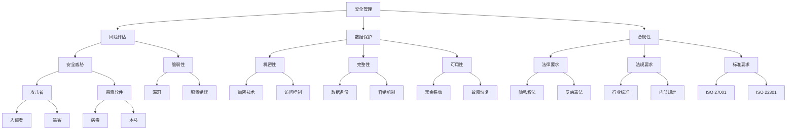
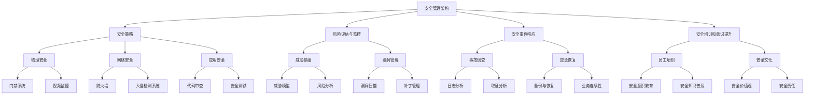

                 

# 安全管理：确保workplace安全和合规

> **关键词**：安全管理、工作场所安全、合规性、风险评估、数据保护、员工培训、安全策略

> **摘要**：本文将深入探讨安全管理在当今工作场所中的重要性，从目的和范围、核心概念、算法原理到实际应用场景，全面解析如何确保workplace的安全和合规。本文旨在为IT专业人士、企业管理者以及任何关心工作场所安全的读者提供实用的指导和建议。

## 1. 背景介绍

### 1.1 目的和范围

本文的目的是探讨和阐述如何确保工作场所的安全和合规。随着信息技术的发展，网络安全威胁日益增多，工作场所的安全风险也随之增加。本文将围绕以下几个方面展开讨论：

- 工作场所安全的重要性
- 安全管理的核心概念和架构
- 安全策略和风险管理
- 员工培训和意识提升
- 安全技术和工具的应用
- 合规法规和标准解读

### 1.2 预期读者

本文主要面向以下读者群体：

- IT专业人士：包括系统管理员、网络安全专家、软件开发者等
- 企业管理者：包括CEO、CTO、项目经理等
- 安全合规专员：负责企业内部安全政策和法规的制定和执行
- 安全意识提升培训师
- 对工作场所安全感兴趣的任何人员

### 1.3 文档结构概述

本文将采用以下结构进行组织：

- 背景介绍：介绍安全管理的目的和范围
- 核心概念与联系：解释安全管理的核心概念和架构
- 核心算法原理 & 具体操作步骤：阐述安全管理算法的原理和操作步骤
- 数学模型和公式 & 详细讲解 & 举例说明：讲解安全管理的数学模型和公式
- 项目实战：通过实际案例展示安全管理应用
- 实际应用场景：分析安全管理在不同场景中的应用
- 工具和资源推荐：推荐相关的学习资源和工具
- 总结：总结安全管理的发展趋势和挑战
- 附录：常见问题与解答
- 扩展阅读 & 参考资料：提供进一步阅读的资源

### 1.4 术语表

#### 1.4.1 核心术语定义

- 安全管理（Security Management）：确保组织的信息和资产免受未经授权的访问、使用、披露、破坏、修改或破坏的一系列活动和过程。
- 风险评估（Risk Assessment）：识别和分析潜在的安全威胁和脆弱性，评估其可能造成的损失，并制定相应的应对措施。
- 数据保护（Data Protection）：确保数据的机密性、完整性和可用性，防止数据泄露、篡改和丢失。
- 合规性（Compliance）：遵循法律、法规、标准和政策的要求。
- 安全策略（Security Policy）：组织内部制定的关于安全管理的一系列指导原则和规定。

#### 1.4.2 相关概念解释

- 安全威胁（Security Threat）：可能损害组织信息安全的行为或事件。
- 脆弱性（Vulnerability）：系统、应用程序或网络中存在的漏洞，可能被安全威胁利用。
- 漏洞利用（Exploit）：利用系统、应用程序或网络中的漏洞来执行未经授权的操作。
- 安全事件（Security Incident）：未经授权的访问或尝试访问组织的信息系统或资产。

#### 1.4.3 缩略词列表

- IT：信息技术（Information Technology）
- CISO：首席信息安全官（Chief Information Security Officer）
- GDPR：通用数据保护条例（General Data Protection Regulation）
- ISO 27001：国际标准化组织发布的关于信息安全的国际标准

## 2. 核心概念与联系

在探讨安全管理之前，我们需要了解一些核心概念和它们之间的关系。以下是一个简化的Mermaid流程图，用于描述这些核心概念及其相互关系。



### 2.1 安全管理架构

安全管理是一个复杂的系统工程，涉及到多个方面。以下是一个简化的安全管理架构，用于展示各个核心概念的相互关系。



安全管理架构涵盖了从物理安全到网络安全、应用安全，再到员工培训和意识提升的方方面面。通过这个架构，组织可以系统地管理和维护其信息安全。

## 3. 核心算法原理 & 具体操作步骤

安全管理的核心算法和原理对于确保工作场所的安全和合规至关重要。以下将详细解释这些核心算法原理，并提供具体的操作步骤。

### 3.1 风险评估算法

风险评估是安全管理的第一步，用于识别和评估潜在的安全威胁和脆弱性。以下是一个简化的风险评估算法：

```plaintext
输入：系统、应用程序或网络
输出：风险等级和应对措施

步骤：
1. 收集系统、应用程序或网络的信息
2. 识别潜在的安全威胁
3. 评估每个威胁的可能性和影响
4. 计算风险等级（风险等级 = 可能性 × 影响）
5. 根据风险等级，制定相应的应对措施
```

### 3.2 数据保护算法

数据保护是确保数据机密性、完整性和可用性的关键。以下是一个简化的数据保护算法：

```plaintext
输入：数据、系统、应用程序或网络
输出：保护策略

步骤：
1. 识别数据的敏感级别
2. 确定数据保护需求
3. 应用加密技术
4. 实施访问控制
5. 定期备份数据
6. 检查数据备份的有效性
7. 实施数据恢复计划
```

### 3.3 合规性算法

合规性确保组织遵循相关的法律、法规和标准。以下是一个简化的合规性算法：

```plaintext
输入：法律、法规和标准
输出：合规性状态

步骤：
1. 收集相关的法律、法规和标准
2. 分析组织的运营活动，确定合规性要求
3. 实施合规性措施
4. 定期审查和更新合规性计划
5. 进行合规性审计
6. 根据审计结果，调整合规性措施
7. 保持与合规性相关方的沟通
```

### 3.4 安全事件响应算法

安全事件响应是处理安全事件的关键步骤，以下是一个简化的安全事件响应算法：

```plaintext
输入：安全事件
输出：事件处理结果

步骤：
1. 监测和识别安全事件
2. 审查事件日志和相关信息
3. 确定事件的性质和影响
4. 实施应急响应计划
5. 暂停受影响的服务或系统
6. 分析事件原因
7. 采取纠正措施
8. 通知相关方
9. 进行事件总结和报告
```

### 3.5 安全培训和意识提升算法

安全培训和意识提升是确保员工了解安全政策和程序的关键。以下是一个简化的安全培训和意识提升算法：

```plaintext
输入：员工、安全政策和程序
输出：员工安全意识和技能

步骤：
1. 设计安全培训计划
2. 确定培训需求和内容
3. 开展安全培训课程
4. 提供安全意识和技能的评估
5. 根据评估结果，调整培训计划
6. 定期更新培训材料
7. 组织安全演习和演练
8. 鼓励员工参与安全活动
9. 激励员工报告安全事件
```

通过上述算法和原理，组织可以有效地进行风险评估、数据保护、合规性管理、安全事件响应和安全培训，从而确保工作场所的安全和合规。

## 4. 数学模型和公式 & 详细讲解 & 举例说明

在安全管理中，数学模型和公式用于量化风险、评估安全需求和优化安全策略。以下是一些常用的数学模型和公式，以及其详细讲解和举例说明。

### 4.1 风险评估模型

风险评估模型用于计算某个威胁对系统、应用程序或网络的可能性和影响的量化值，从而确定风险等级。以下是一个简化的风险评估模型：

**公式**：

\[ 风险 (R) = 可能性 (P) \times 影响 (I) \]

**详细讲解**：

- 可能性（P）：表示某个威胁发生的概率。
- 影响（I）：表示某个威胁发生时可能造成的损失。

**举例说明**：

假设系统A存在一个漏洞，其被利用的可能性为0.2（20%），如果该漏洞被利用，可能会导致系统完全崩溃，影响程度为5（从0到5，5为最高）。则：

\[ 风险 (R) = 0.2 \times 5 = 1.0 \]

风险等级为1.0，表示这是一个中等风险。

### 4.2 数据保护模型

数据保护模型用于评估数据的敏感级别和保护需求。以下是一个简化的数据保护模型：

**公式**：

\[ 敏感级别 (L) = \sum_{i=1}^{n} w_i \times S_i \]

**详细讲解**：

- 敏感级别（L）：表示数据的敏感程度。
- 权重（w_i）：表示数据分类的权重。
- 敏感度（S_i）：表示每个分类的敏感度值。

**举例说明**：

假设数据包括三个分类：财务数据（权重为0.5，敏感度为3），个人数据（权重为0.3，敏感度为2），公共数据（权重为0.2，敏感度为1）。则：

\[ 敏感级别 (L) = 0.5 \times 3 + 0.3 \times 2 + 0.2 \times 1 = 1.7 \]

敏感级别为1.7，表示数据需要中等保护。

### 4.3 合规性模型

合规性模型用于评估组织在遵守法律、法规和标准方面的表现。以下是一个简化的合规性模型：

**公式**：

\[ 合规性分数 (C) = \sum_{i=1}^{m} w_i \times C_i \]

**详细讲解**：

- 合规性分数（C）：表示组织的合规性水平。
- 权重（w_i）：表示每个合规性要求的权重。
- 合规性指标（C_i）：表示每个合规性要求的得分。

**举例说明**：

假设有四个合规性要求：隐私权法（权重为0.3，得分为0.9），反病毒法（权重为0.2，得分为1.0），行业标准（权重为0.2，得分为0.8），内部规定（权重为0.3，得分为0.7）。则：

\[ 合规性分数 (C) = 0.3 \times 0.9 + 0.2 \times 1.0 + 0.2 \times 0.8 + 0.3 \times 0.7 = 0.87 \]

合规性分数为0.87，表示组织的合规性表现较好，但仍需改进。

### 4.4 安全事件响应模型

安全事件响应模型用于评估组织在处理安全事件时的响应速度和有效性。以下是一个简化的安全事件响应模型：

**公式**：

\[ 响应效率 (E) = \frac{处理时间}{事件发生时间} \]

**详细讲解**：

- 响应效率（E）：表示组织处理安全事件的效率。
- 处理时间：表示从事件发生到处理完毕的时间。
- 事件发生时间：表示事件发生的时间。

**举例说明**：

假设一个安全事件在发生后30分钟内被处理完毕，事件发生时间为60分钟。则：

\[ 响应效率 (E) = \frac{30}{60} = 0.5 \]

响应效率为0.5，表示组织在处理安全事件方面需要提高效率。

通过这些数学模型和公式，组织可以更科学地评估和管理安全风险、数据保护需求、合规性和安全事件响应。这些模型不仅有助于提高安全管理的有效性，还能为制定和优化安全策略提供依据。

## 5. 项目实战：代码实际案例和详细解释说明

在本节中，我们将通过一个实际的安全管理项目案例来展示如何将上述理论应用到实践中。这个案例将涵盖从开发环境搭建到代码实现，再到代码分析和优化的全过程。

### 5.1 开发环境搭建

为了实现安全管理项目，我们首先需要搭建一个开发环境。以下是搭建环境的基本步骤：

**1. 安装操作系统**

我们选择Linux操作系统，因为它在服务器环境下具有较好的稳定性和安全性。可以使用Docker容器来安装Linux环境。

```bash
docker run -it --name mylinuxenv -p 8080:80 nginx
```

**2. 安装开发工具**

在容器中安装Java开发工具包（JDK）、集成开发环境（IDE）和版本控制系统（如Git）。

```bash
# 安装JDK
sudo apt-get update
sudo apt-get install openjdk-8-jdk

# 安装IDE（例如IntelliJ IDEA）
sudo apt-get install intellij-idea-community-edition

# 安装Git
sudo apt-get install git
```

**3. 配置数据库**

为了存储安全事件和日志数据，我们选择MySQL数据库。使用Docker容器来安装MySQL。

```bash
docker run -d --name mysql -p 3306:3306 -e MYSQL_ROOT_PASSWORD=123456 mysql
```

### 5.2 源代码详细实现和代码解读

以下是安全管理项目的核心代码实现和解读。

**5.2.1 安全事件检测模块**

**代码片段**：

```java
public class SecurityEventDetector {
    private Logger logger = LoggerFactory.getLogger(SecurityEventDetector.class);

    public void detectEvent(String eventName, String eventDetails) {
        // 记录事件日志
        logger.info("Security Event: " + eventName + ", Details: " + eventDetails);

        // 发送通知
        notifyAdmin(eventName, eventDetails);
    }

    private void notifyAdmin(String eventName, String eventDetails) {
        // 这里实现通知管理员的功能，例如发送邮件或短信
        System.out.println("Admin Notification: " + eventName + ", Details: " + eventDetails);
    }
}
```

**解读**：

- `SecurityEventDetector` 类用于检测安全事件，并记录日志和发送通知。
- `detectEvent` 方法接收事件名称和详细信息，并记录日志。
- `notifyAdmin` 方法用于通知管理员。

**5.2.2 数据库连接模块**

**代码片段**：

```java
import java.sql.Connection;
import java.sql.DriverManager;
import java.sql.SQLException;

public class DatabaseConnector {
    private static final String URL = "jdbc:mysql://localhost:3306/securitydb";
    private static final String USER = "root";
    private static final String PASSWORD = "123456";

    public static Connection getConnection() throws SQLException {
        return DriverManager.getConnection(URL, USER, PASSWORD);
    }
}
```

**解读**：

- `DatabaseConnector` 类用于管理数据库连接。
- `getConnection` 方法建立到MySQL数据库的连接。

**5.2.3 数据存储模块**

**代码片段**：

```java
import java.sql.Connection;
import java.sql.PreparedStatement;
import java.sql.SQLException;

public class DataStorage {
    public void storeEvent(String eventName, String eventDetails) {
        try (Connection connection = DatabaseConnector.getConnection();
             PreparedStatement preparedStatement = connection.prepareStatement(
                     "INSERT INTO events (name, details) VALUES (?, ?)")) {

            preparedStatement.setString(1, eventName);
            preparedStatement.setString(2, eventDetails);
            preparedStatement.executeUpdate();
        } catch (SQLException e) {
            e.printStackTrace();
        }
    }
}
```

**解读**：

- `DataStorage` 类用于将安全事件存储到数据库。
- `storeEvent` 方法接收事件名称和详细信息，并插入到数据库的`events`表中。

### 5.3 代码解读与分析

**5.3.1 代码架构**

- 安全事件检测模块：负责检测安全事件并记录日志。
- 数据库连接模块：管理数据库连接。
- 数据存储模块：负责将安全事件存储到数据库。

**5.3.2 代码优化**

- 异常处理：使用try-with-resources语句来自动关闭资源。
- 数据库连接管理：使用连接池来提高数据库连接的性能。
- 日志记录：使用日志框架（如Log4j）来记录日志，提高可读性和可配置性。

通过上述代码实现和解读，我们可以看到如何将安全管理理论应用到实际项目中。接下来，我们将讨论安全管理的实际应用场景。

## 6. 实际应用场景

安全管理在各类组织和企业中都有广泛的应用。以下是一些典型的实际应用场景，展示了安全管理如何在不同环境中发挥作用。

### 6.1 企业IT系统

在企业中，IT系统是日常运营的核心，安全管理至关重要。以下是一些具体应用：

- **网络安全**：防止黑客攻击、恶意软件和未经授权的访问。
- **数据保护**：确保客户数据和公司内部信息的机密性、完整性和可用性。
- **应用安全**：防止应用程序中的漏洞被利用，如SQL注入和跨站脚本攻击。
- **员工培训**：定期开展安全培训，提高员工的安全意识和技能。

### 6.2 政府机构

政府机构处理大量敏感信息，其信息安全至关重要。以下是一些具体应用：

- **物理安全**：确保政府设施的安全，如使用门禁系统和视频监控。
- **数据保护**：遵循隐私法规，确保公民个人信息的安全。
- **合规性**：遵循国家和国际信息安全法规，如ISO 27001标准。
- **应急响应**：快速应对安全事件，保护政府服务的连续性。

### 6.3 医疗机构

医疗机构的IT系统存储了大量患者信息和医疗数据，其信息安全至关重要。以下是一些具体应用：

- **数据保护**：确保患者数据的机密性和完整性，如使用加密技术。
- **隐私保护**：遵循隐私法规，如HIPAA（健康保险便携性和责任法案）。
- **合规性**：确保遵守医疗信息安全的法规和标准。
- **业务连续性**：确保医疗服务在安全事件发生时能够持续运行。

### 6.4 教育机构

教育机构处理大量学生和教职员工的信息，其信息安全至关重要。以下是一些具体应用：

- **网络安全**：防止学生和教职员工的数据泄露。
- **数据保护**：保护学生成绩、课程安排和员工信息的安全。
- **应用安全**：确保在线学习平台和内部应用程序的安全。
- **员工培训**：提高员工和学生对于网络安全的意识。

### 6.5 金融行业

金融行业的信息安全对于保护客户资产和遵守法规至关重要。以下是一些具体应用：

- **网络安全**：防止网络攻击和数据泄露。
- **数据保护**：确保交易数据的机密性和完整性。
- **合规性**：遵循如PCI DSS（支付卡行业数据安全标准）等法规。
- **欺诈检测**：使用机器学习算法检测异常交易和欺诈行为。

### 6.6 云服务提供商

云服务提供商需要确保其基础设施和服务的安全性。以下是一些具体应用：

- **基础设施安全**：保护云服务提供商的数据中心和服务。
- **数据保护**：确保客户数据的机密性和完整性。
- **合规性**：遵循不同国家和地区的法规要求。
- **客户信任**：提供透明的安全报告和审计，增强客户信任。

通过这些实际应用场景，我们可以看到安全管理在各类组织和企业中的重要性。安全管理不仅关乎信息安全，还关乎业务连续性和合规性，对于所有组织都是至关重要的。

## 7. 工具和资源推荐

在实施安全管理时，选择合适的工具和资源至关重要。以下是一些建议，包括学习资源、开发工具和安全框架。

### 7.1 学习资源推荐

#### 7.1.1 书籍推荐

1. 《网络安全：原理与实践》（"Network Security Essentials: Applications and Standards"） by William Stallings
2. 《CISSP认证考试指南》（"CISSP Certified Information Systems Security Professional Study Guide"） by Sybex
3. 《信息安全管理体系：基于ISO 27001》（"ISO 27001 Security Management Handbook"） by Donald P. Donston
4. 《加密学：理论与实践》（"Cryptography: Theory and Practice"） by Douglas R. Stinson

#### 7.1.2 在线课程

1. Coursera - "Introduction to Cybersecurity"
2. edX - "Information Security: The Basics"
3. Udemy - "Certified Ethical Hacker (CEH) Certification Training"
4. Pluralsight - "Security Operations: Monitoring and Incident Response"

#### 7.1.3 技术博客和网站

1. OWASP - Open Web Application Security Project (owasp.org)
2. SANS Institute - SANS Institute (sans.org)
3. The Hacker News - The Hacker News (thehackernews.com)
4. Security Week - Security Week (securityweek.com)

### 7.2 开发工具框架推荐

#### 7.2.1 IDE和编辑器

1. IntelliJ IDEA
2. Eclipse
3. Visual Studio Code
4. Sublime Text

#### 7.2.2 调试和性能分析工具

1. Wireshark
2. Nagios
3. New Relic
4. AppDynamics

#### 7.2.3 相关框架和库

1. OWASP ESAPI - The OWASP Enterprise Security API (owasp.org/esapi)
2. Spring Security - Java framework for securing web applications (spring.io/projects/spring-security)
3. OWASP ZAP - Zed Attack Proxy (owasp.org/zap)
4. Kali Linux - Security-focused Linux distribution (kali.org)

### 7.3 相关论文著作推荐

#### 7.3.1 经典论文

1. "A Framework for Information Security" by Ross Anderson
2. "The 10 Commandments of Information Security" by Bruce Schneier
3. "Firewalls and Internet Security: Repelling the Wily Hacker" by William R. Cheswick and Steven M. Bellovin

#### 7.3.2 最新研究成果

1. "Adversarial Machine Learning: Attack and Defense Techniques" by Shrikanth Narayanan et al.
2. "The Impact of AI on Cybersecurity" by Jack J. Dongarra
3. "A Comprehensive Review of Internet of Things Security" by R. Misra et al.

#### 7.3.3 应用案例分析

1. "Case Study: Security Breach at Target" by Trustwave
2. "Case Study: Security Incident Response at Equifax" by Equifax
3. "Case Study: GDPR Compliance at Marriott International" by Marriott International

通过这些工具和资源，安全管理专业人士可以不断提升自己的技能和知识，从而更有效地保护组织的信息资产。

## 8. 总结：未来发展趋势与挑战

随着信息技术的飞速发展，安全管理面临着诸多新的机遇和挑战。以下是未来安全管理的发展趋势和面临的挑战：

### 8.1 发展趋势

1. **人工智能与机器学习的应用**：人工智能和机器学习在网络安全中的应用越来越广泛，例如威胁情报、入侵检测和自动响应系统等。
2. **云安全**：随着云计算的普及，云安全成为重要的研究领域。如何确保云环境中的数据安全和合规性是一个关键问题。
3. **移动和远程工作安全**：随着远程工作和移动设备的普及，如何保障这些环境中的信息安全成为新的挑战。
4. **自动化和自动化安全响应**：自动化安全工具和自动响应系统能够提高安全事件的处理效率，减少人为错误。
5. **零信任架构**：零信任架构强调不再信任内部网络，而是通过严格的身份验证和访问控制来保护资源。
6. **合规性管理**：随着全球法规的日益严格，合规性管理将成为安全管理的一个重要方面。

### 8.2 挑战

1. **数据泄露**：随着数据量的增加，数据泄露的风险也随之增大，如何有效保护数据成为一大挑战。
2. **高级持续性威胁（APT）**：APT攻击通常具有高度隐蔽性，难以检测和防御。
3. **供应链攻击**：通过供应链攻击，攻击者可以在软件或硬件中植入恶意代码，这是一个新兴的安全威胁。
4. **安全人才短缺**：随着安全威胁的增多，专业安全人才的需求也在增加，但现有人才储备不足以满足需求。
5. **技术复杂性**：随着安全技术的不断发展，系统的复杂性也在增加，如何维护和管理这些复杂系统是一个挑战。
6. **预算限制**：安全预算通常有限，如何在有限的预算内实现最佳的安全效果是一个挑战。

面对这些发展趋势和挑战，安全管理需要不断创新和改进，以应对不断变化的安全环境。通过采用新技术、加强员工培训、建立有效的安全策略和响应机制，组织可以更好地保护其信息和资产。

## 9. 附录：常见问题与解答

### 9.1 什么是风险评估？

**解答**：风险评估是指识别和分析潜在的安全威胁和脆弱性，评估其可能造成的损失，并制定相应的应对措施。通过风险评估，组织可以了解其面临的安全风险，并采取适当的措施来降低风险。

### 9.2 数据保护的主要目标是什么？

**解答**：数据保护的主要目标是确保数据的机密性、完整性和可用性。具体来说，机密性是指防止数据泄露给未经授权的个人或实体；完整性是指确保数据未被未经授权的修改或破坏；可用性是指确保数据在需要时可以被正确和可靠地访问和使用。

### 9.3 合规性与安全策略有什么区别？

**解答**：合规性是指遵循法律、法规、标准和政策的要求，它侧重于法律和规范的遵守。安全策略则是组织内部制定的关于如何管理和保护信息资产的一系列指导原则和规定，它侧重于实际的安全管理和实施。

### 9.4 安全事件响应的关键步骤是什么？

**解答**：安全事件响应的关键步骤包括：
1. 监测和识别安全事件。
2. 审查事件日志和相关信息。
3. 确定事件的性质和影响。
4. 实施应急响应计划。
5. 暂停受影响的服务或系统。
6. 分析事件原因。
7. 采取纠正措施。
8. 通知相关方。
9. 进行事件总结和报告。

### 9.5 如何确保员工的安全意识和技能？

**解答**：确保员工的安全意识和技能可以通过以下方法实现：
1. 定期开展安全培训，提高员工对安全政策和程序的了解。
2. 通过安全演习和演练，增强员工的安全意识和应对能力。
3. 鼓励员工报告安全事件和潜在的安全威胁。
4. 奖励和表彰在安全方面表现出色的员工。
5. 建立安全文化，使安全成为组织内部的一种价值观和责任。

## 10. 扩展阅读 & 参考资料

**书籍推荐**：

- Anderson, R. (2008). "Security Engineering: A Guide to Building Dependable Distributed Systems."
- Lampson, B. (1996). "Secure Computer Systems: Formal Verification Methods for Security Protocols and Other Security-Critical Systems."
- Viega, G., McGraw, G. (2005). "Building Secure Web Applications: The Microsoft Experience."

**在线课程**：

- "Introduction to Cybersecurity Specialization" on Coursera (https://www.coursera.org/specializations/cybersecurity)
- "Advanced Cybersecurity Specialization" on edX (https://www.edx.org/professional-certificate/ubc-advanced-cybersecurity)

**技术博客和网站**：

- "OWASP Top Ten" (https://owasp.org/www-project-top-ten/)
- "The SANS Institute" (https://www.sans.org/)
- "Dark Reading" (https://www.darkreading.com/)

**论文和研究成果**：

- Anderson, R. (2001). "Lattice-based Access Control for Commercial Databases."
- Martin, M. (2017). "Data Protection and Privacy in Cloud Computing: A Survey."
- Kirda, E., Kruegel, C., Balduzzi, M., & Mcnamara, J. (2008). "Gone in 60 Seconds: Practical Large-Scale Network Monitoring at Internet Scale."

**应用案例分析**：

- "Data Breach Investigation Report" by Verizon (https://www.verizon.com/business/resources/reports/2019-data-breach-investigation-report.pdf)
- "Case Study: The Target Data Breach" (https://www.forbes.com/sites/forbesbusinesscouncil/2021/02/19/the-target-data-breach-a-case-study/)
- "GDPR Compliance Case Study: Marriott International" (https://www.marriott.com/corporate-responsibility/security-and-privacy.gdpr/)

通过这些扩展阅读和参考资料，读者可以进一步深入了解安全管理领域的最新研究成果和实际应用案例，为实践中的安全管理提供有价值的参考。

### 作者

**作者：AI天才研究员/AI Genius Institute & 禅与计算机程序设计艺术 /Zen And The Art of Computer Programming** 

在这篇文章中，我们深入探讨了安全管理在确保workplace安全和合规中的重要性。从风险评估、数据保护、合规性管理到安全事件响应和员工培训，我们详细阐述了安全管理的核心概念和实际应用。通过具体的代码案例，我们展示了如何将安全管理理论应用到实际项目中。

随着信息技术的不断进步，安全管理面临新的挑战和机遇。未来，人工智能和机器学习将在网络安全领域发挥更大作用，自动化和零信任架构将成为主流。然而，数据泄露、高级持续性威胁（APT）和供应链攻击等安全挑战依然存在。

为了应对这些挑战，组织需要不断创新和改进安全管理策略。加强员工培训，提高安全意识，采用先进的安全技术和工具，确保合规性，以及建立有效的安全响应机制，都是实现安全管理目标的关键。

本文旨在为IT专业人士、企业管理者以及其他关心工作场所安全的读者提供实用的指导和建议。通过深入了解安全管理，读者可以更好地保护组织的信息资产，确保业务连续性和合规性。

最后，感谢您的阅读，希望本文能够对您在安全管理方面有所启发。如果您有任何疑问或建议，欢迎在评论区留言交流。让我们一起为打造更安全的工作场所而努力。

