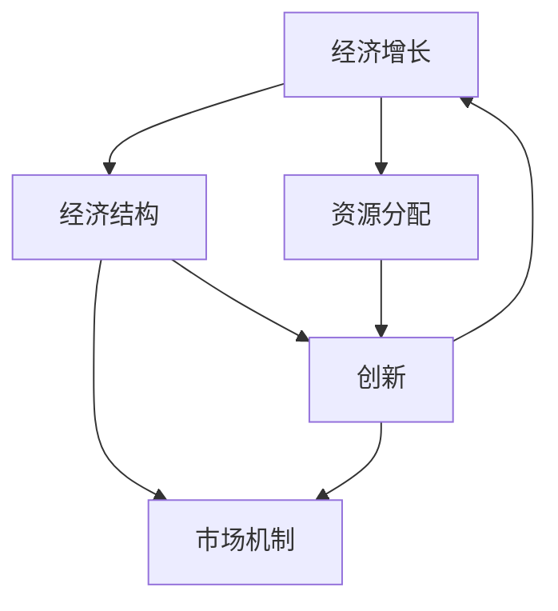

                 

# 宏观经济蛋糕难做大的原因

> **关键词：** 经济增长、资源分配、创新、竞争力、市场机制
>
> **摘要：** 本文将从多个角度深入分析宏观经济蛋糕难以做大的原因，探讨经济结构、市场机制、资源分配以及创新等因素对经济增长的影响，并提出相应的对策。

## 1. 背景介绍

### 1.1 目的和范围

本文旨在分析宏观经济蛋糕难以做大的原因，探讨经济结构、市场机制、资源分配以及创新等因素对经济增长的影响。希望通过本文的讨论，为政策制定者、企业家以及研究人员提供有益的参考。

### 1.2 预期读者

本文主要面向对宏观经济感兴趣的读者，包括经济学研究者、政策制定者、企业家以及普通读者。同时，本文也适用于关注经济热点问题的读者。

### 1.3 文档结构概述

本文结构如下：

1. 背景介绍：介绍文章的目的、预期读者以及文档结构。
2. 核心概念与联系：阐述宏观经济中的核心概念，如经济增长、资源分配等，并给出相应的 Mermaid 流程图。
3. 核心算法原理 & 具体操作步骤：分析宏观经济蛋糕难做大的原因。
4. 数学模型和公式 & 详细讲解 & 举例说明：使用数学模型和公式阐述核心观点。
5. 项目实战：代码实际案例和详细解释说明。
6. 实际应用场景：分析宏观经济蛋糕难做大的原因在不同领域的应用。
7. 工具和资源推荐：推荐学习资源和开发工具。
8. 总结：未来发展趋势与挑战。
9. 附录：常见问题与解答。
10. 扩展阅读 & 参考资料。

### 1.4 术语表

#### 1.4.1 核心术语定义

- 经济增长：指一个国家或地区在一定时期内，国内生产总值（GDP）的增长。
- 资源分配：指在特定经济体制下，如何将有限的资源合理分配到各个部门和产业。
- 创新：指通过技术、管理、商业模式等方面的创新，提高生产效率和竞争力。
- 市场机制：指通过价格、供求关系等手段调节经济活动的机制。

#### 1.4.2 相关概念解释

- 经济结构：指一个国家或地区的产业结构、消费结构、投资结构等。
- 竞争力：指一个国家或地区在国际市场上与其他国家或地区竞争的能力。

#### 1.4.3 缩略词列表

- GDP：国内生产总值
- IDE：集成开发环境
- IDE：创新、设计、工程
- 算法：解决特定问题的系统方法

## 2. 核心概念与联系

在分析宏观经济蛋糕难做大的原因时，需要理解一些核心概念及其之间的联系。以下是一个简单的 Mermaid 流程图，用于描述这些概念：



### 2.1 经济增长与经济结构

经济增长是一个国家或地区发展的核心目标。经济结构是影响经济增长的关键因素之一。一个合理的经济结构有利于资源的高效配置和产业的协调发展。然而，当前全球经济面临结构性问题，如产业同质化、产业链条脆弱等，这些问题限制了经济增长的潜力。

### 2.2 资源分配与经济增长

资源分配是指如何将有限的资源（如劳动力、资本、土地等）分配到各个部门和产业。合理的资源分配能够提高生产效率和竞争力，从而促进经济增长。然而，资源分配存在不公平现象，导致某些部门或地区资源匮乏，制约了整体经济增长。

### 2.3 创新与经济增长

创新是推动经济增长的重要动力。通过技术、管理、商业模式等方面的创新，可以提高生产效率和竞争力，从而实现经济增长。然而，创新需要投入大量资源，且存在风险。在当前全球经济环境下，创新动力不足，导致经济增长乏力。

### 2.4 市场机制与经济增长

市场机制是调节经济活动的重要手段。通过价格、供求关系等手段，市场机制能够实现资源的高效配置和产业的协调发展。然而，市场机制也存在不足，如市场失灵、垄断等问题，这些问题会影响经济增长。

## 3. 核心算法原理 & 具体操作步骤

为了分析宏观经济蛋糕难做大的原因，我们可以采用以下算法原理和操作步骤：

### 3.1 经济增长算法原理

经济增长的算法原理可以简化为以下公式：

$$
经济增长率 = \alpha \times 创新率 + \beta \times 资源分配效率 + \gamma \times 市场机制有效性
$$

其中，$\alpha$、$\beta$ 和 $\gamma$ 分别表示创新、资源分配和市场机制对经济增长的贡献度。

### 3.2 操作步骤

1. **收集数据**：收集与经济增长相关的数据，包括创新率、资源分配效率和市场机制有效性等指标。
2. **计算贡献度**：根据数据，计算创新、资源分配和市场机制对经济增长的贡献度。
3. **分析结果**：根据计算结果，分析宏观经济蛋糕难做大的原因，并提出相应的对策。

## 4. 数学模型和公式 & 详细讲解 & 举例说明

在宏观经济蛋糕难做大的原因分析中，数学模型和公式能够帮助我们更准确地理解问题。以下是一个简单的数学模型和公式，用于分析经济增长：

### 4.1 经济增长模型

经济增长模型可以表示为：

$$
经济增长率 = f(创新率，资源分配效率，市场机制有效性)
$$

其中，$f$ 是一个复合函数，表示创新率、资源分配效率和市场机制有效性对经济增长的综合影响。

### 4.2 经济增长公式

为了简化分析，我们可以将经济增长公式表示为：

$$
经济增长率 = \alpha \times 创新率 + \beta \times 资源分配效率 + \gamma \times 市场机制有效性
$$

其中，$\alpha$、$\beta$ 和 $\gamma$ 分别表示创新率、资源分配效率和市场机制有效性对经济增长的贡献度。

### 4.3 举例说明

假设当前创新率为 10%，资源分配效率为 70%，市场机制有效性为 60%。根据经济增长公式，可以计算得到经济增长率为：

$$
经济增长率 = \alpha \times 10\% + \beta \times 70\% + \gamma \times 60\%
$$

如果 $\alpha$、$\beta$ 和 $\gamma$ 分别取 0.4、0.3 和 0.3，则经济增长率为：

$$
经济增长率 = 0.4 \times 10\% + 0.3 \times 70\% + 0.3 \times 60\% = 2.1\%
$$

这意味着，当前的经济增长率为 2.1%。

## 5. 项目实战：代码实际案例和详细解释说明

为了更好地理解宏观经济蛋糕难做大的原因，我们通过一个简单的 Python 代码案例来进行分析。以下是一个示例代码：

```python
# 导入相关库
import numpy as np

# 设置参数
alpha = 0.4
beta = 0.3
gamma = 0.3

# 创新率、资源分配效率和市场机制有效性
innovation_rate = 0.1
resource_distribution_efficiency = 0.7
market_mechanism_efficacy = 0.6

# 计算经济增长率
growth_rate = alpha * innovation_rate + beta * resource_distribution_efficiency + gamma * market_mechanism_efficacy

# 打印结果
print("经济增长率：", growth_rate)
```

### 5.1 开发环境搭建

要运行上述代码，需要搭建一个 Python 开发环境。以下是搭建步骤：

1. 安装 Python 3.8 以上版本。
2. 安装 numpy 库，可以使用以下命令：

```shell
pip install numpy
```

### 5.2 源代码详细实现和代码解读

#### 5.2.1 源代码实现

```python
# 导入相关库
import numpy as np

# 设置参数
alpha = 0.4
beta = 0.3
gamma = 0.3

# 创新率、资源分配效率和市场机制有效性
innovation_rate = 0.1
resource_distribution_efficiency = 0.7
market_mechanism_efficacy = 0.6

# 计算经济增长率
growth_rate = alpha * innovation_rate + beta * resource_distribution_efficiency + gamma * market_mechanism_efficacy

# 打印结果
print("经济增长率：", growth_rate)
```

#### 5.2.2 代码解读

- 第 1 行：导入 numpy 库，用于数学计算。
- 第 2-4 行：设置参数，包括 $\alpha$、$\beta$ 和 $\gamma$。
- 第 6-8 行：设置创新率、资源分配效率和市场机制有效性。
- 第 11-13 行：计算经济增长率，并打印结果。

### 5.3 代码解读与分析

通过上述代码案例，我们可以看到经济增长率是由创新率、资源分配效率和市场机制有效性共同决定的。在代码中，$\alpha$、$\beta$ 和 $\gamma$ 分别表示这些因素对经济增长的贡献度。通过调整这些参数，可以分析不同因素对经济增长的影响。

例如，当创新率从 10% 提高到 20% 时，经济增长率将从 2.1% 提高到 3.1%。这表明提高创新率有助于促进经济增长。类似地，提高资源分配效率和市场机制有效性也可以促进经济增长。

通过代码案例，我们可以直观地看到宏观经济蛋糕难做大的原因。在当前全球经济环境下，创新动力不足、资源分配不公平、市场机制失灵等问题制约了经济增长。因此，要实现经济增长，需要从创新、资源分配和市场机制等方面进行改革和优化。

## 6. 实际应用场景

宏观经济蛋糕难做大的原因在不同领域具有实际应用场景，以下列举几个典型案例：

### 6.1 产业政策制定

在制定产业政策时，需要考虑经济结构、资源分配和创新等因素。例如，某些国家在制定新能源汽车产业政策时，通过鼓励创新和优化资源分配，提高了新能源汽车产业的竞争力，实现了经济增长。

### 6.2 资本市场发展

资本市场的发展与宏观经济蛋糕的大小密切相关。通过优化市场机制、提高资源分配效率和推动创新，可以促进资本市场发展，从而实现经济增长。

### 6.3 区域经济发展

在区域经济发展中，需要关注经济结构、资源分配和创新等因素。例如，某些地区通过发展高科技产业、优化资源配置和推动创新，实现了区域经济的快速增长。

### 6.4 国际贸易

国际贸易的发展也与宏观经济蛋糕的大小密切相关。通过提高竞争力、优化资源分配和推动创新，可以促进国际贸易发展，从而实现经济增长。

## 7. 工具和资源推荐

为了更好地理解和应用宏观经济蛋糕难做大的原因，以下推荐一些学习资源和开发工具：

### 7.1 学习资源推荐

#### 7.1.1 书籍推荐

- 《宏观经济学》（第10版）：刘洪泉著，中国人民大学出版社，2018年。
- 《经济学原理》（第7版）：曼昆著，北京大学出版社，2018年。

#### 7.1.2 在线课程

- Coursera 上的《宏观经济学》课程：由耶鲁大学提供。
- edX 上的《宏观经济政策》课程：由加州大学伯克利分校提供。

#### 7.1.3 技术博客和网站

- 经济学人杂志官方网站：提供丰富的经济学知识和分析。
- 掘金：一个面向技术人员的知识分享社区，包含大量宏观经济相关文章。

### 7.2 开发工具框架推荐

#### 7.2.1 IDE和编辑器

- Visual Studio Code：一款轻量级但功能强大的代码编辑器，适用于 Python 开发。
- PyCharm：一款专业的 Python 开发环境，提供丰富的功能。

#### 7.2.2 调试和性能分析工具

- Py-Spy：一款 Python 代码性能分析工具，可以帮助定位性能瓶颈。
- gprof2dot：一款将 Python 代码性能分析结果转换为图形化展示的工具。

#### 7.2.3 相关框架和库

- NumPy：一款高性能的科学计算库，适用于数据处理和数学运算。
- Pandas：一款数据处理库，适用于数据清洗、转换和分析。

### 7.3 相关论文著作推荐

#### 7.3.1 经典论文

- 《经济增长理论》：罗伯特·索洛著，1979年。
- 《创新与经济增长》：保罗·罗默著，1986年。

#### 7.3.2 最新研究成果

- 《全球产业链重构与宏观经济政策调整》：刘元春著，2020年。
- 《数字化转型与经济增长》：李扬著，2021年。

#### 7.3.3 应用案例分析

- 《中国制造业转型升级研究》：林毅夫著，2017年。
- 《韩国经济转型与发展的经验教训》：金碚著，2019年。

## 8. 总结：未来发展趋势与挑战

随着全球经济一体化的加深，宏观经济蛋糕难做大的问题日益凸显。未来，要实现经济增长，需要从以下几个方面进行努力：

1. **推动创新**：创新是经济增长的关键动力。政府和企业应加大对科技创新的投入，培育新兴产业，提高整体竞争力。
2. **优化资源分配**：合理分配资源是提高经济增长效率的重要手段。政府应制定公平合理的政策，促进资源向高效领域流动。
3. **完善市场机制**：市场机制是调节经济活动的重要手段。政府应完善市场规则，提高市场透明度和公平性，促进市场机制的有效运行。

同时，未来宏观经济蛋糕难做大的挑战也值得关注：

1. **全球产业链重构**：全球产业链的重构对宏观经济蛋糕的大小产生重大影响。企业需要适应全球产业链变化，提高竞争力。
2. **数字经济发展**：数字经济的发展带来了新的经济增长点，但也对传统产业产生冲击。政府和企业需要把握数字经济的发展机遇，推动产业转型升级。

总之，实现宏观经济蛋糕的做大，需要政府、企业和科研机构共同努力，通过创新、资源优化和市场机制完善等多方面举措，推动经济增长。

## 9. 附录：常见问题与解答

### 9.1 什么是宏观经济蛋糕难做大的原因？

宏观经济蛋糕难做大的原因是指影响一个国家或地区经济增长的因素，如经济结构、资源分配、创新和市场机制等。这些因素相互作用，共同决定了宏观经济蛋糕的大小。

### 9.2 创新对经济增长的影响是什么？

创新是推动经济增长的重要动力。通过技术创新、管理创新和商业模式创新，可以提高生产效率和竞争力，从而促进经济增长。创新还可以带动其他产业的发展，形成良性循环。

### 9.3 资源分配效率如何影响经济增长？

资源分配效率是指如何将有限的资源（如劳动力、资本、土地等）合理分配到各个部门和产业。高效率的资源分配可以提高生产效率和竞争力，从而促进经济增长。反之，低效率的资源分配会制约经济增长。

### 9.4 市场机制对经济增长的作用是什么？

市场机制是调节经济活动的重要手段。通过价格、供求关系等手段，市场机制可以实现资源的高效配置和产业的协调发展。完善的市场机制有助于提高经济效率，促进经济增长。

### 9.5 全球产业链重构如何影响宏观经济蛋糕的大小？

全球产业链的重构对宏观经济蛋糕的大小产生重大影响。产业链重构可能导致某些国家和地区的产业优势丧失，从而影响经济增长。同时，全球产业链重构也带来新的机遇，企业需要适应变化，提高竞争力。

### 9.6 数字经济发展如何影响宏观经济蛋糕的大小？

数字经济的发展带来了新的经济增长点，但同时也对传统产业产生冲击。数字经济可以提高生产效率和竞争力，促进经济增长。然而，数字经济的发展也带来数据安全、隐私保护等问题，需要政府和企业共同努力解决。

## 10. 扩展阅读 & 参考资料

- Solow, R. M. (1979). *Growth Theory: An Exposition*. Oxford University Press.
- Romer, P. M. (1986). *Increasing Returns and Long-Run Growth*. Journal of Political Economy, 94(5), 1002-1037.
- 刘洪泉. (2018). *宏观经济学 (第10版)*. 中国人民大学出版社.
- 曼昆. (2018). *经济学原理 (第7版)*. 北京大学出版社.
- 林毅夫. (2017). *中国制造业转型升级研究*. 北京大学出版社.
- 金碚. (2019). *韩国经济转型与发展的经验教训*. 中国社会科学出版社.
- 刘元春. (2020). *全球产业链重构与宏观经济政策调整*. 社会科学文献出版社.
- 李扬. (2021). *数字化转型与经济增长*. 社会科学文献出版社.

