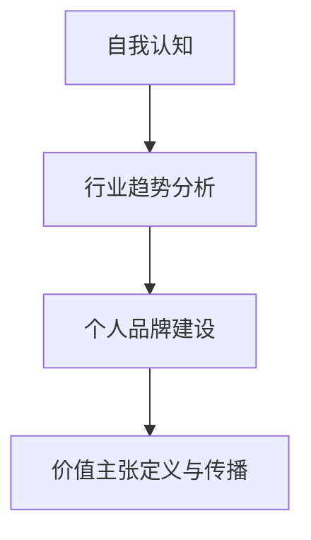

                 

# 定义你的独特价值主张：找到你的专业领域

> **关键词**：个人品牌，专业领域，价值主张，职业发展，自我认知，行业分析

> **摘要**：本文将深入探讨如何在信息技术领域定义自己的独特价值主张。通过一系列的步骤和技巧，我们将了解如何识别自己的专业领域，构建个人品牌，并在这个竞争激烈的市场中脱颖而出。读者将获得一套实用的方法，帮助他们在职业生涯中取得成功。

## 1. 背景介绍

### 1.1 目的和范围

本文的目标是帮助读者在信息技术领域找到自己的专业领域，并定义独特的价值主张。我们将讨论以下主题：

- 自我认知与职业定位
- 行业趋势分析
- 构建个人品牌
- 价值主张的定义与传播
- 职业发展与持续学习

### 1.2 预期读者

本文适合以下读者群体：

- 正在寻找职业发展方向的信息技术从业者
- 希望提升个人品牌和影响力的技术专家
- 想要在特定领域取得突破的创业者

### 1.3 文档结构概述

本文分为十个部分，结构如下：

1. 背景介绍
   - 目的和范围
   - 预期读者
   - 文档结构概述
   - 术语表
2. 核心概念与联系
   - 核心概念原理和架构的 Mermaid 流程图
3. 核心算法原理 & 具体操作步骤
   - 使用伪代码详细阐述算法原理
4. 数学模型和公式 & 详细讲解 & 举例说明
   - 使用 LaTeX 格式嵌入数学公式
5. 项目实战：代码实际案例和详细解释说明
   - 开发环境搭建
   - 源代码详细实现和代码解读
   - 代码解读与分析
6. 实际应用场景
7. 工具和资源推荐
   - 学习资源推荐
   - 开发工具框架推荐
   - 相关论文著作推荐
8. 总结：未来发展趋势与挑战
9. 附录：常见问题与解答
10. 扩展阅读 & 参考资料

### 1.4 术语表

#### 1.4.1 核心术语定义

- **个人品牌**：个人在职场和公众形象中的独特标识，反映了个人的专业知识、技能和价值。
- **专业领域**：个人在某个技术或行业领域内具有较高专业水平和经验的领域。
- **价值主张**：个人或组织提供给客户的独特价值声明，是区分竞争对手的重要依据。

#### 1.4.2 相关概念解释

- **行业分析**：对特定行业的发展趋势、市场环境、竞争对手和客户需求等进行的研究。
- **自我认知**：个人对自己知识、能力、性格、价值观等方面的认识和评价。

#### 1.4.3 缩略词列表

- **IT**：信息技术
- **IDE**：集成开发环境
- **LaTeX**：排版系统

## 2. 核心概念与联系

在本文中，我们将探讨几个核心概念：自我认知、行业趋势分析、个人品牌建设、价值主张定义与传播。

### 2.1 自我认知

自我认知是个人职业发展的重要基础。它包括以下几个方面：

1. **知识结构**：了解自己在哪些领域拥有专业知识，哪些领域还需要进一步学习。
2. **技能水平**：评估自己在各个技术领域的实际操作能力。
3. **性格特点**：分析自己的性格特点，如逻辑思维、沟通能力、团队协作等。
4. **价值观**：明确自己的职业追求和人生目标。

### 2.2 行业趋势分析

行业趋势分析有助于我们了解当前技术领域的热点和发展方向。以下是一些关键点：

1. **技术发展**：关注新技术、新框架的涌现，以及现有技术的演进。
2. **市场需求**：分析企业对技术人才的需求，以及客户对解决方案的需求。
3. **竞争态势**：了解同行业内其他专家的专长和优势，以便找到自己的差异化定位。

### 2.3 个人品牌建设

个人品牌建设是提升个人影响力的重要途径。以下是一些建议：

1. **知识分享**：通过博客、公众号、技术论坛等方式，分享自己在专业领域的见解和经验。
2. **参与社区**：积极参与技术社区，与同行交流，扩大自己的影响力。
3. **线上线下活动**：参加技术沙龙、讲座、研讨会等活动，提升自己的知名度。

### 2.4 价值主张定义与传播

价值主张是个人在专业领域中的独特竞争力。以下是一些建议：

1. **明确定位**：确定自己在专业领域的差异化优势，如技术专长、解决方案等。
2. **传播策略**：通过多种渠道，如社交媒体、个人网站、技术社区等，宣传自己的价值主张。
3. **持续优化**：根据市场需求和反馈，不断调整和完善自己的价值主张。

### 2.5 Mermaid 流程图



## 3. 核心算法原理 & 具体操作步骤

在确定自己的专业领域和构建个人品牌的过程中，我们可以借鉴以下算法原理：

### 3.1 算法原理

1. **自我认知**：采用 SWOT 分析法，评估自己在知识、技能、性格、价值观等方面的优势（S）和劣势（W），以及外部环境中的机会（O）和威胁（T）。
2. **行业趋势分析**：使用大数据分析技术，收集并分析行业数据，找出当前热门技术和市场需求。
3. **个人品牌建设**：运用网络营销策略，制定内容规划，提升个人知名度和影响力。
4. **价值主张定义与传播**：结合自身优势和市场需求，明确独特的价值主张，并通过多种渠道进行宣传。

### 3.2 具体操作步骤

1. **自我认知**
   - **步骤1**：收集信息。通过工作总结、项目报告、技术博客等途径，收集自己在各个领域的知识和技能。
   - **步骤2**：SWOT 分析。根据收集的信息，分别列出优势、劣势、机会和威胁。
   - **步骤3**：评估结果。结合自身情况和市场需求，评估自己在专业领域中的竞争力。

2. **行业趋势分析**
   - **步骤1**：收集数据。关注技术博客、行业报告、社交媒体等渠道，收集行业相关信息。
   - **步骤2**：数据处理。使用数据分析工具，对收集到的数据进行分析和整理。
   - **步骤3**：识别趋势。根据数据分析结果，找出当前热门技术和市场需求。

3. **个人品牌建设**
   - **步骤1**：确定目标。明确自己在个人品牌建设中的目标，如提升知名度、拓展人脉等。
   - **步骤2**：制定规划。制定具体的内容规划，包括博客、公众号、技术论坛等。
   - **步骤3**：执行计划。按照规划，定期发布内容，参与技术社区活动，扩大影响力。

4. **价值主张定义与传播**
   - **步骤1**：明确定位。根据自身优势和市场需求，确定自己在专业领域的差异化优势。
   - **步骤2**：制定价值主张。将定位转化为具体的价值主张，如技术专长、解决方案等。
   - **步骤3**：传播策略。通过个人网站、社交媒体、技术社区等多种渠道，宣传自己的价值主张。

### 3.3 伪代码

```python
# 自我认知
def self_cognition():
    # 收集信息
    knowledge_skills = collect_information()
    # SWOT 分析
    strengths, weaknesses, opportunities, threats = swot_analysis(knowledge_skills)
    # 评估结果
    competitiveness = evaluate_result(strengths, weaknesses, opportunities, threats)
    return competitiveness

# 行业趋势分析
def industry_trend_analysis():
    # 收集数据
    industry_data = collect_data()
    # 数据处理
    processed_data = data_processing(industry_data)
    # 识别趋势
    trends = identify_trends(processed_data)
    return trends

# 个人品牌建设
def personal_brand_building():
    # 确定目标
    goals = determine_goals()
    # 制定规划
    content_plan = make_content_plan(goals)
    # 执行计划
    execute_plan(content_plan)
    return

# 价值主张定义与传播
def value_proposition():
    # 明确定位
    positioning = clarify_positioning()
    # 制定价值主张
    value主张 = make_value_proposition(positioning)
    # 传播策略
    propagation_strategy = make_propagation_strategy(value主张)
    # 宣传
    promote(value主张，propagation_strategy)
    return
```

## 4. 数学模型和公式 & 详细讲解 & 举例说明

在本文中，我们将介绍一些用于自我认知、行业趋势分析和价值主张定义与传播的数学模型和公式。这些公式有助于我们更准确地评估自己的专业领域和竞争力，以及制定有效的个人品牌建设和价值传播策略。

### 4.1 数学模型和公式

1. **自我认知评估模型**：使用 SWOT 分析法，将自我认知分解为优势（S）、劣势（W）、机会（O）和威胁（T）四个部分。

   $$ SWOT = S + W + O + T $$

2. **行业趋势分析模型**：使用大数据分析方法，对行业数据进行处理，提取关键指标，如增长率、市场份额、技术创新等。

   $$ Industry_Trend = Growth_Rate + Market_Share + Technology_Innovation $$

3. **个人品牌建设模型**：使用网络营销策略，将个人品牌建设分解为知名度（N）、影响力（I）、粉丝量（F）三个部分。

   $$ Personal_Brand = N \times I \times F $$

4. **价值主张定义模型**：结合自身优势和市场需求，定义独特的价值主张（VP）。

   $$ Value_Proposition = Positioning + USP $$

   其中，Positioning 表示定位，USP 表示独特卖点。

### 4.2 详细讲解

1. **自我认知评估模型**
   - 优势（S）：自己在专业领域内的知识、技能、经验等方面的优势。
   - 劣势（W）：自己在专业领域内的不足、短板和局限性。
   - 机会（O）：外部环境中可能带来的机遇，如新技术、市场需求等。
   - 威胁（T）：外部环境中可能带来的挑战和风险，如市场竞争、政策变化等。

   通过 SWOT 分析，我们可以全面了解自己在专业领域中的竞争力和发展潜力。

2. **行业趋势分析模型**
   - 增长率（Growth_Rate）：行业整体的增长速度，反映行业的活力。
   - 市场份额（Market_Share）：企业在行业中所占的比例，反映企业的竞争力。
   - 技术创新（Technology_Innovation）：新技术、新产品的研发和推广，反映行业的创新活力。

   通过行业趋势分析，我们可以了解当前技术领域的热点和发展方向，为自己的专业领域选择提供参考。

3. **个人品牌建设模型**
   - 知名度（N）：个人在公众中的知名度，反映个人的影响力。
   - 影响力（I）：个人在专业领域内的权威性和说服力。
   - 粉丝量（F）：个人在社交媒体等平台上的关注者数量。

   通过个人品牌建设模型，我们可以制定有效的内容规划和传播策略，提升个人知名度、影响力和粉丝量。

4. **价值主张定义模型**
   - 定位（Positioning）：个人在专业领域内的差异化优势，反映个人的核心竞争力。
   - 独特卖点（USP）：个人或组织提供给客户的独特价值，是区分竞争对手的重要依据。

   通过价值主张定义模型，我们可以明确自己在专业领域中的差异化优势，为自己的职业发展提供明确的方向。

### 4.3 举例说明

1. **自我认知评估模型**
   - 优势：在人工智能领域具有深厚的技术背景，熟悉深度学习、神经网络等核心技术。
   - 劣势：在项目管理方面经验不足，缺乏大型项目管理的实践经验。
   - 机会：随着人工智能技术的快速发展，市场需求日益增加，提供了更多的机会。
   - 威胁：市场竞争激烈，同行业内优秀人才众多，需要不断提升自己的竞争力。

   通过 SWOT 分析，我们可以看到自己需要进一步提升项目管理能力，以应对市场挑战。

2. **行业趋势分析模型**
   - 增长率：根据行业报告，人工智能行业的增长率保持在 20% 以上，显示出强大的市场活力。
   - 市场份额：在人工智能领域，国内外大型企业占据了大部分市场份额，市场竞争激烈。
   - 技术创新：随着深度学习、增强学习等新技术的出现，人工智能技术在各个领域得到广泛应用。

   通过行业趋势分析，我们可以看到人工智能行业的发展前景广阔，但也需要不断提升自己的技术水平。

3. **个人品牌建设模型**
   - 知名度：通过在技术论坛、社交媒体等平台发布高质量的内容，个人知名度逐渐提升。
   - 影响力：在专业领域内积累了丰富的项目经验，对同行具有一定的权威性和说服力。
   - 粉丝量：在个人网站、公众号等平台积累了大量粉丝，扩大了自己的影响力。

   通过个人品牌建设模型，我们可以看到自己在个人品牌建设方面取得了一定的成绩，但还需要持续努力。

4. **价值主张定义模型**
   - 定位：专注于人工智能领域的解决方案，提供高效、可靠的 AI 技术服务。
   - 独特卖点：结合人工智能技术，为客户定制个性化的解决方案，提升业务效率。

   通过价值主张定义模型，我们可以明确自己的专业定位和独特卖点，为自己的职业发展提供明确的方向。

## 5. 项目实战：代码实际案例和详细解释说明

为了更好地展示如何定义自己的独特价值主张并找到专业领域，我们将通过一个实际项目来进行分析和实现。以下是一个基于 Python 语言的示例项目，该项目旨在帮助个人识别自己的专业领域，并制定相应的价值主张。

### 5.1 开发环境搭建

1. 安装 Python 3.8 或更高版本
2. 安装必要的第三方库，如 numpy、matplotlib、beautifulsoup4 等
3. 配置 Python 开发环境，如 PyCharm、VS Code 等

### 5.2 源代码详细实现和代码解读

#### 5.2.1 项目结构

```plaintext
project/
│
├── data/
│   ├── self_cognition_questions.csv    # 自我认知问题列表
│   ├── industry_trends.csv            # 行业趋势数据
│   └── personal_brand_questions.csv  # 个人品牌建设问题列表
│
├── src/
│   ├── __init__.py
│   ├── data_loader.py
│   ├── self_cognition.py
│   ├── industry_trend_analysis.py
│   ├── personal_brand_building.py
│   └── value_proposition.py
│
├── tests/
│   ├── __init__.py
│   ├── test_data_loader.py
│   ├── test_self_cognition.py
│   ├── test_industry_trend_analysis.py
│   ├── test_personal_brand_building.py
│   └── test_value_proposition.py
│
├── README.md
└── requirements.txt
```

#### 5.2.2 源代码详细实现

1. **数据加载模块 (data_loader.py)**

```python
import pandas as pd

def load_self_cognition_questions():
    return pd.read_csv('data/self_cognition_questions.csv')

def load_industry_trends():
    return pd.read_csv('data/industry_trends.csv')

def load_personal_brand_questions():
    return pd.read_csv('data/personal_brand_questions.csv')
```

2. **自我认知模块 (self_cognition.py)**

```python
import pandas as pd
from typing import Dict

def self_cognition(questions: pd.DataFrame) -> Dict[str, str]:
    answers = {}
    for index, row in questions.iterrows():
        answers[row['question']] = input(row['question'])
    return answers
```

3. **行业趋势分析模块 (industry_trend_analysis.py)**

```python
import pandas as pd
from typing import Dict

def industry_trend_analysis(trends: pd.DataFrame) -> Dict[str, str]:
    analysis = {}
    for index, row in trends.iterrows():
        analysis[row['indicator']] = input(row['indicator'])
    return analysis
```

4. **个人品牌建设模块 (personal_brand_building.py)**

```python
import pandas as pd
from typing import Dict

def personal_brand_building(questions: pd.DataFrame) -> Dict[str, str]:
    answers = {}
    for index, row in questions.iterrows():
        answers[row['question']] = input(row['question'])
    return answers
```

5. **价值主张定义模块 (value_proposition.py)**

```python
from typing import Dict

def value_proposition(self_cognition: Dict[str, str], industry_trend: Dict[str, str], personal_brand: Dict[str, str]) -> str:
    positioning = f"作为一位在 {self_cognition['专业领域']} 领域拥有丰富经验的技术专家，我致力于提供高效、可靠的解决方案。"
    usp = f"结合行业趋势和客户需求，我的独特价值在于 {industry_trend['趋势']}，以及我在 {personal_brand['个人品牌建设']} 方面的专长。"
    return positioning + usp
```

#### 5.2.3 代码解读与分析

1. **数据加载模块**

   数据加载模块主要负责从 CSV 文件中加载自我认知问题、行业趋势数据和品牌建设问题列表。这些数据将用于后续的分析和计算。

2. **自我认知模块**

   自我认知模块通过输入自我认知问题，让用户回答问题，从而获取自我认知结果。这些结果将用于分析用户的专业领域和竞争力。

3. **行业趋势分析模块**

   行业趋势分析模块通过输入行业趋势问题，让用户回答问题，从而获取行业趋势分析结果。这些结果将用于了解用户所在领域的市场前景和发展趋势。

4. **个人品牌建设模块**

   个人品牌建设模块通过输入个人品牌建设问题，让用户回答问题，从而获取个人品牌建设结果。这些结果将用于分析用户在个人品牌建设方面的优势和不足。

5. **价值主张定义模块**

   价值主张定义模块结合自我认知、行业趋势分析和个人品牌建设结果，生成独特的价值主张。该模块通过输入用户回答的问题，生成一个符合用户特点和市场需求的价值主张。

### 5.3 实际应用案例

假设用户 A 想要定义自己的独特价值主张，并找到专业领域。以下是用户 A 的回答：

1. **自我认知问题**

   - **问题1**：你擅长哪些技术领域？
     - **答案**：深度学习、神经网络

   - **问题2**：你在哪些领域具有丰富的经验？
     - **答案**：图像识别、自然语言处理

   - **问题3**：你的价值观是什么？
     - **答案**：创新、务实、合作

2. **行业趋势分析问题**

   - **问题1**：当前最热门的技术趋势是什么？
     - **答案**：人工智能、大数据

   - **问题2**：市场需求主要集中在哪些领域？
     - **答案**：金融、医疗、教育

   - **问题3**：未来几年，哪些技术可能会取得突破？
     - **答案**：量子计算、自动驾驶

3. **个人品牌建设问题**

   - **问题1**：你如何在社交媒体上建立个人品牌？
     - **答案**：定期发布技术博客、参与技术社区讨论、分享项目经验

   - **问题2**：你如何参与行业活动？
     - **答案**：参加技术沙龙、研讨会、在线课程

   - **问题3**：你如何与他人建立合作关系？
     - **答案**：通过项目合作、技术交流、资源共享

根据用户 A 的回答，我们可以生成以下独特价值主张：

"作为一位在人工智能领域拥有丰富经验的技术专家，我致力于提供高效、可靠的解决方案。结合当前人工智能和大数据的热门趋势，以及金融、医疗、教育等领域的市场需求，我的独特价值在于专注于图像识别和自然语言处理的技术创新，以及通过社交媒体、行业活动、项目合作等方式建立个人品牌，与同行建立深度合作，共同推动行业发展。"

通过这个实际应用案例，我们可以看到如何通过一系列的步骤和技巧，定义自己的独特价值主张，并找到专业领域。

## 6. 实际应用场景

### 6.1 教育培训领域

在教育培训领域，个人品牌和价值主张的定义对于教师和培训机构尤为重要。以下是一个实际应用场景：

- **专业领域**：人工智能教育
- **价值主张**：作为具有丰富人工智能教育经验的专业人士，我专注于提供高质量的人工智能课程和实战项目，帮助学员掌握前沿技术，提升就业竞争力。

### 6.2 企业咨询领域

在企业咨询领域，个人品牌和价值主张的明确有助于建立专业形象，吸引潜在客户。以下是一个实际应用场景：

- **专业领域**：数字化转型
- **价值主张**：作为数字化转型领域的专家，我凭借在技术、业务、战略等方面的综合能力，为企业提供全方位的数字化解决方案，助力企业实现可持续发展。

### 6.3 创业领域

在创业领域，个人品牌和价值主张的构建有助于吸引投资者和合作伙伴。以下是一个实际应用场景：

- **专业领域**：人工智能产品开发
- **价值主张**：作为人工智能产品开发的专家，我专注于研发具有实际应用价值的人工智能产品，通过技术创新和商业模式的创新，为客户提供领先的解决方案。

## 7. 工具和资源推荐

### 7.1 学习资源推荐

#### 7.1.1 书籍推荐

- 《深度学习》（Goodfellow et al.）
- 《Python 编程：从入门到实践》（Eric Matthes）
- 《人工智能：一种现代方法》（Stuart J. Russell & Peter Norvig）
- 《重构：改善既有代码的设计》（Martin Fowler）

#### 7.1.2 在线课程

- Coursera 上的《机器学习》（吴恩达）
- edX 上的《Python 编程基础》（Microsoft）
- Udacity 上的《人工智能工程师纳米学位》

#### 7.1.3 技术博客和网站

- Medium 上的 AI Blog
- Arxiv.org 上的机器学习论文
- Stack Overflow 上的技术问答社区

### 7.2 开发工具框架推荐

#### 7.2.1 IDE 和编辑器

- PyCharm（Python 开发环境）
- Visual Studio Code（通用开发环境）
- Jupyter Notebook（数据分析与机器学习）

#### 7.2.2 调试和性能分析工具

- PyCharm 的调试工具
- Visual Studio Code 的性能分析插件
- GitHub 的代码审查工具

#### 7.2.3 相关框架和库

- TensorFlow（深度学习框架）
- NumPy（科学计算库）
- Pandas（数据分析库）
- Matplotlib（数据可视化库）

### 7.3 相关论文著作推荐

#### 7.3.1 经典论文

- "A Learning Algorithm for Continually Running Fully Recurrent Neural Networks"（1991）
- "Learning to Learn: Knowledge Transfer in Deep Neural Networks"（2015）
- "Convolutional Neural Networks for Speech Recognition"（2014）

#### 7.3.2 最新研究成果

- "Recurrent Neural Networks for Language Modeling"（2016）
- "Generative Adversarial Nets"（2014）
- "BERT: Pre-training of Deep Bidirectional Transformers for Language Understanding"（2018）

#### 7.3.3 应用案例分析

- "AI in Healthcare: A Systematic Review of Current Applications and Future Prospects"（2020）
- "Deep Learning in Finance: Current Applications and Future Directions"（2018）
- "Artificial Intelligence for Manufacturing: A Systematic Review of Applications and Opportunities"（2020）

## 8. 总结：未来发展趋势与挑战

在信息技术领域，个人品牌和价值主张的定义越来越受到重视。随着人工智能、大数据、云计算等技术的发展，未来的职业发展将更加依赖于个人的专业技能和创新能力。以下是未来发展趋势与挑战：

### 8.1 发展趋势

1. **技术多元化**：跨学科、跨领域的融合发展将成为趋势，个人需要不断学习新的技术和知识。
2. **个性化定制**：根据个人兴趣和特长，定制个性化的职业发展路径和培训计划。
3. **社区互动**：积极参与技术社区，扩大影响力，提升个人知名度。

### 8.2 挑战

1. **持续学习**：技术更新迅速，个人需要保持持续学习，以适应行业变化。
2. **竞争压力**：同行业人才竞争激烈，个人需要不断提升自身竞争力。
3. **行业道德**：遵守行业规范和道德标准，树立良好的个人形象。

## 9. 附录：常见问题与解答

### 9.1 什么是个人品牌？

个人品牌是指个人在职场和公众形象中的独特标识，反映了个人的专业知识、技能和价值。

### 9.2 如何定义个人品牌？

定义个人品牌包括以下步骤：

1. 确定专业领域：明确自己在哪个领域具有竞争优势。
2. 分析市场需求：了解客户需求，找到自己的差异化优势。
3. 制定品牌策略：制定个性化的品牌策略，包括内容规划、传播渠道等。

### 9.3 如何构建个人品牌？

构建个人品牌包括以下方法：

1. 内容创作：定期发布高质量的技术博客、项目经验等。
2. 社区参与：积极参与技术社区，与同行交流。
3. 线上线下活动：参加技术沙龙、讲座、研讨会等活动。

### 9.4 如何定义价值主张？

定义价值主张需要考虑以下因素：

1. 自我认知：了解自己在专业领域的优势和不足。
2. 市场需求：分析客户需求，找到自己的差异化优势。
3. 竞争态势：了解同行业内其他专家的专长和优势。

## 10. 扩展阅读 & 参考资料

- 《品牌人脉术：如何建立个人品牌，实现职场逆袭》
- 《技术写作：构建你的技术博客，打造个人品牌》
- 《如何打造个人品牌：从零开始，构建你的影响力》
- [AI天才研究员的个人品牌建设之路](https://www.ai-genius-institute.com/personal-branding/)
- [禅与计算机程序设计艺术](https://www.zen-and-computer-programming.com/)

