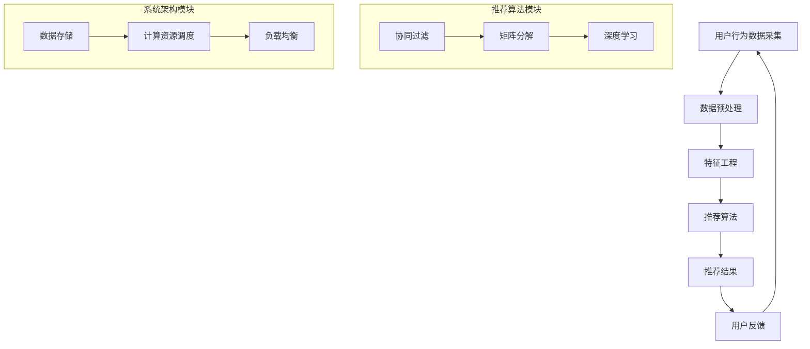

                 

# 实时推荐系统的性能提升策略

> **关键词：**实时推荐、性能优化、算法改进、系统架构、资源调度、负载均衡

> **摘要：**本文旨在探讨实时推荐系统在性能优化方面的策略。通过分析现有系统中的瓶颈和挑战，我们将深入探讨如何通过改进算法、优化系统架构和资源调度来提升推荐系统的实时性和准确性。文章将结合实际案例，详细阐述具体的实施步骤和技巧，为开发者和研究者提供有价值的参考。

## 1. 背景介绍

### 1.1 目的和范围

随着互联网和大数据技术的发展，实时推荐系统已成为现代信息社会中不可或缺的一部分。这些系统通过分析用户行为和兴趣，为用户实时提供个性化内容，从而提升用户体验和平台粘性。然而，随着数据规模和用户数量的不断增加，实时推荐系统的性能面临着巨大的挑战。

本文的目标是探讨实时推荐系统在性能优化方面的策略。我们将从算法、系统架构和资源调度等多个角度出发，分析现有系统的瓶颈和挑战，并提出相应的优化方案。本文旨在为开发者提供一套系统化的性能提升策略，帮助他们在实际项目中取得更好的效果。

### 1.2 预期读者

本文的预期读者主要包括以下几类：

1. **实时推荐系统开发者**：希望了解如何优化实时推荐系统性能，提升系统稳定性和效率。
2. **算法工程师**：对推荐算法原理和实现细节感兴趣，希望通过本文了解算法改进对性能的影响。
3. **系统架构师**：关注系统整体架构设计，希望了解如何在架构层面优化实时推荐系统。
4. **研究者**：对实时推荐系统的研究方向和前沿技术感兴趣，希望通过本文了解性能优化方面的最新进展。

### 1.3 文档结构概述

本文结构如下：

1. **背景介绍**：介绍实时推荐系统的背景、目的和预期读者。
2. **核心概念与联系**：通过 Mermaid 流程图展示实时推荐系统的核心概念和架构。
3. **核心算法原理与具体操作步骤**：详细讲解推荐算法的原理和具体实现步骤。
4. **数学模型和公式**：介绍实时推荐系统中的数学模型和公式，并进行举例说明。
5. **项目实战：代码实际案例和详细解释说明**：通过实际代码案例展示性能提升策略的具体应用。
6. **实际应用场景**：分析实时推荐系统的实际应用场景和挑战。
7. **工具和资源推荐**：推荐相关学习资源和开发工具。
8. **总结：未来发展趋势与挑战**：总结实时推荐系统的发展趋势和面临的挑战。
9. **附录：常见问题与解答**：针对读者可能遇到的问题进行解答。
10. **扩展阅读与参考资料**：提供进一步的阅读材料。

### 1.4 术语表

#### 1.4.1 核心术语定义

- **实时推荐系统**：一种能够实时分析用户行为和兴趣，为用户提供个性化内容的系统。
- **性能优化**：通过改进算法、系统架构和资源调度等手段，提升系统的响应速度和处理能力。
- **算法改进**：对现有推荐算法进行优化，提高其准确性和效率。
- **系统架构**：实时推荐系统的整体设计，包括数据采集、存储、处理和推荐等模块。
- **资源调度**：合理分配系统资源，确保各模块高效运行。

#### 1.4.2 相关概念解释

- **协同过滤**：一种基于用户历史行为和兴趣的推荐算法，通过计算用户之间的相似度来实现个性化推荐。
- **矩阵分解**：将用户和物品的评分矩阵分解为两个低秩矩阵，从而提取出用户和物品的潜在特征。
- **模型更新**：在实时推荐系统中，根据新数据对推荐模型进行更新，以保持模型的准确性。

#### 1.4.3 缩略词列表

- **CTR**：点击率（Click-Through Rate）
- **RMSE**：均方根误差（Root Mean Square Error）
- **MSE**：均方误差（Mean Squared Error）

## 2. 核心概念与联系

为了更好地理解实时推荐系统的性能优化策略，我们需要先了解其核心概念和架构。以下是实时推荐系统的 Mermaid 流程图：



### 2.1 推荐算法模块

推荐算法是实时推荐系统的核心，负责根据用户行为和兴趣生成个性化推荐。以下是三种常见的推荐算法：

1. **协同过滤**：通过计算用户之间的相似度，为用户推荐与兴趣相似的物品。
2. **矩阵分解**：将用户和物品的评分矩阵分解为两个低秩矩阵，提取出用户和物品的潜在特征，从而实现个性化推荐。
3. **深度学习**：利用神经网络模型，从大规模数据中学习用户和物品的复杂特征，实现精准推荐。

### 2.2 系统架构模块

实时推荐系统的架构设计决定了其性能和可扩展性。以下是系统架构的核心模块：

1. **数据存储**：负责存储用户行为数据和物品信息，为推荐算法提供数据支持。
2. **计算资源调度**：根据系统负载和资源需求，动态调整计算资源的分配，确保系统稳定运行。
3. **负载均衡**：将用户请求均匀分配到系统中的各个节点，避免单点瓶颈和资源浪费。

## 3. 核心算法原理 & 具体操作步骤

### 3.1 协同过滤算法原理

协同过滤是一种基于用户历史行为的推荐算法，其核心思想是通过计算用户之间的相似度，为用户推荐其他用户喜欢的物品。以下是协同过滤算法的基本原理和步骤：

1. **用户相似度计算**：使用余弦相似度或皮尔逊相关系数计算用户之间的相似度。
2. **物品相似度计算**：使用余弦相似度或皮尔逊相关系数计算物品之间的相似度。
3. **预测评分**：根据用户相似度和物品相似度，预测用户对未知物品的评分。
4. **生成推荐列表**：根据预测评分，为用户生成个性化推荐列表。

### 伪代码：

```python
# 输入：用户行为矩阵R（用户 × 物品）
# 输出：推荐列表L（用户 × 物品）

def collaborative_filter(R):
    # 计算用户相似度矩阵S
    S = compute_similarity(R)

    # 遍历用户u
    for u in users:
        # 遍历用户u未评分的物品v
        for v in unrated_items(u):
            # 计算物品v与用户u的相似度
            sim_uv = S[u][v]

            # 预测用户u对物品v的评分
            rating_uv = predict_rating(u, v, S)

            # 将预测评分添加到推荐列表L中
            L[u].append((v, rating_uv))

    return L
```

### 3.2 矩阵分解算法原理

矩阵分解是一种基于机器学习的推荐算法，通过将用户和物品的评分矩阵分解为两个低秩矩阵，提取出用户和物品的潜在特征，从而实现个性化推荐。以下是矩阵分解算法的基本原理和步骤：

1. **初始化参数**：初始化用户特征矩阵U和物品特征矩阵V。
2. **优化目标**：最小化预测误差平方和，即最小化损失函数。
3. **梯度下降**：迭代更新用户特征矩阵U和物品特征矩阵V，直至损失函数收敛。

### 伪代码：

```python
# 输入：用户行为矩阵R（用户 × 物品）
# 输出：用户特征矩阵U（用户 × 特征维度），物品特征矩阵V（物品 × 特征维度）

def matrix_factorization(R):
    # 初始化用户特征矩阵U和物品特征矩阵V
    U = initialize_user_features(R)
    V = initialize_item_features(R)

    # 设定迭代次数和停止条件
    num_iterations = 100
    convergence_threshold = 1e-6

    for _ in range(num_iterations):
        # 遍历用户u和物品v
        for u in users:
            for v in items:
                # 计算预测评分
                predicted_rating_uv = dot(U[u], V[v])

                # 计算误差
                error_uv = R[u][v] - predicted_rating_uv

                # 计算梯度
                dU_uv = error_uv * V[v]
                dV_uv = error_uv * U[u]

                # 更新用户特征矩阵和物品特征矩阵
                U[u] -= learning_rate * dU_uv
                V[v] -= learning_rate * dV_uv

        # 检查是否收敛
        if check_convergence(U, V, convergence_threshold):
            break

    return U, V
```

### 3.3 深度学习算法原理

深度学习是一种基于神经网络的学习方法，通过多层非线性变换，从大规模数据中学习用户和物品的复杂特征，实现个性化推荐。以下是深度学习算法的基本原理和步骤：

1. **构建神经网络模型**：定义输入层、隐藏层和输出层。
2. **前向传播**：计算输入数据通过神经网络的输出。
3. **反向传播**：计算损失函数关于模型参数的梯度。
4. **优化参数**：使用梯度下降或其他优化算法更新模型参数。

### 伪代码：

```python
# 输入：用户行为矩阵R（用户 × 物品），训练集X（用户 × 特征），标签Y（用户 × 物品）
# 输出：神经网络模型参数θ（模型参数）

def deep_learning(R, X, Y):
    # 构建神经网络模型
    model = build_neural_network(X, Y)

    # 设定迭代次数和停止条件
    num_iterations = 1000
    convergence_threshold = 1e-6

    for _ in range(num_iterations):
        # 前向传播
        outputs = forward propagate(model, X)

        # 计算损失函数
        loss = compute_loss(outputs, Y)

        # 反向传播
        gradients = backward_propagate(model, outputs, Y)

        # 更新模型参数
        update_model_params(model, gradients)

        # 检查是否收敛
        if check_convergence(loss, convergence_threshold):
            break

    return model
```

## 4. 数学模型和公式 & 详细讲解 & 举例说明

### 4.1 协同过滤算法的数学模型

协同过滤算法的核心在于计算用户和物品之间的相似度。以下是协同过滤算法的数学模型：

#### 4.1.1 用户相似度计算

用户相似度可以通过以下公式计算：

$$
sim(u, v) = \frac{u \cdot v}{||u|| \cdot ||v||}
$$

其中，$u$ 和 $v$ 分别表示用户 $u$ 和用户 $v$ 的特征向量，$||u||$ 和 $||v||$ 分别表示用户 $u$ 和用户 $v$ 的特征向量范数，$\cdot$ 表示向量的点积。

#### 4.1.2 物品相似度计算

物品相似度可以通过以下公式计算：

$$
sim(i, j) = \frac{i \cdot j}{||i|| \cdot ||j||}
$$

其中，$i$ 和 $j$ 分别表示物品 $i$ 和物品 $j$ 的特征向量，$||i||$ 和 $||j||$ 分别表示物品 $i$ 和物品 $j$ 的特征向量范数，$\cdot$ 表示向量的点积。

#### 4.1.3 预测评分

预测评分可以通过以下公式计算：

$$
\hat{r}_{uv} = sim(u, v) \cdot r_{uv}
$$

其中，$r_{uv}$ 表示用户 $u$ 对物品 $v$ 的实际评分，$\hat{r}_{uv}$ 表示用户 $u$ 对物品 $v$ 的预测评分。

### 4.2 矩阵分解算法的数学模型

矩阵分解算法的核心在于将用户和物品的评分矩阵分解为两个低秩矩阵。以下是矩阵分解算法的数学模型：

#### 4.2.1 用户特征矩阵和物品特征矩阵

用户特征矩阵 $U$ 和物品特征矩阵 $V$ 分别表示用户和物品的潜在特征。它们可以通过以下公式计算：

$$
U = U^T U^{-1/2}
$$

$$
V = V^T V^{-1/2}
$$

其中，$U^T$ 和 $V^T$ 分别表示用户特征矩阵和物品特征矩阵的转置，$U^{-1/2}$ 和 $V^{-1/2}$ 分别表示用户特征矩阵和物品特征矩阵的逆矩阵的平方根。

#### 4.2.2 预测评分

预测评分可以通过以下公式计算：

$$
\hat{r}_{uv} = \sum_{i=1}^{n} u_i v_j
$$

其中，$u_i$ 和 $v_j$ 分别表示用户 $i$ 的特征向量和物品 $j$ 的特征向量，$n$ 表示特征向量的维度。

### 4.3 深度学习算法的数学模型

深度学习算法的核心在于构建神经网络模型，并通过前向传播和反向传播来学习用户和物品的特征。以下是深度学习算法的数学模型：

#### 4.3.1 前向传播

前向传播通过以下公式计算：

$$
z_{l}^{(i)} = \sigma \left( \sum_{j=1}^{n} W_{l-1}^{(j)} a_{l-1}^{(i)} + b_{l} \right)
$$

$$
a_{l}^{(i)} = \frac{1}{1 + e^{-z_{l}^{(i)}}
$$

其中，$z_{l}^{(i)}$ 表示第 $l$ 层第 $i$ 个神经元的输入，$a_{l}^{(i)}$ 表示第 $l$ 层第 $i$ 个神经元的输出，$\sigma$ 表示激活函数，$W_{l-1}^{(j)}$ 和 $b_{l}$ 分别表示第 $l$ 层的前一层权重和偏置。

#### 4.3.2 反向传播

反向传播通过以下公式计算：

$$
\delta_{l}^{(i)} = \frac{\partial L}{\partial z_{l}^{(i)}} \cdot \frac{\partial \sigma}{\partial a_{l}^{(i)}}
$$

$$
\frac{\partial L}{\partial W_{l-1}^{(j)}} = a_{l-1}^{(i)} \cdot \delta_{l}^{(i)}
$$

$$
\frac{\partial L}{\partial b_{l}} = \delta_{l}^{(i)}
$$

其中，$L$ 表示损失函数，$\delta_{l}^{(i)}$ 表示第 $l$ 层第 $i$ 个神经元的误差，$\partial$ 表示偏导数。

#### 4.3.3 参数更新

参数更新通过以下公式计算：

$$
W_{l-1}^{(j)} = W_{l-1}^{(j)} - \alpha \cdot \frac{\partial L}{\partial W_{l-1}^{(j)}}
$$

$$
b_{l} = b_{l} - \alpha \cdot \frac{\partial L}{\partial b_{l}}
$$

其中，$\alpha$ 表示学习率。

### 4.4 实例讲解

#### 4.4.1 协同过滤算法实例

假设有两个用户 $u_1$ 和 $u_2$，以及两个物品 $i_1$ 和 $i_2$。用户 $u_1$ 对物品 $i_1$ 的评分为 $5$，对物品 $i_2$ 的评分为 $4$；用户 $u_2$ 对物品 $i_1$ 的评分为 $3$，对物品 $i_2$ 的评分为 $5$。

1. **用户相似度计算**：

$$
sim(u_1, u_2) = \frac{u_1 \cdot u_2}{||u_1|| \cdot ||u_2||} = \frac{5 \cdot 3 + 4 \cdot 5}{\sqrt{5^2 + 4^2} \cdot \sqrt{3^2 + 5^2}} = \frac{15 + 20}{\sqrt{41} \cdot \sqrt{34}} \approx 0.765
$$

2. **物品相似度计算**：

$$
sim(i_1, i_2) = \frac{i_1 \cdot i_2}{||i_1|| \cdot ||i_2||} = \frac{5 \cdot 3 + 4 \cdot 5}{\sqrt{5^2 + 4^2} \cdot \sqrt{3^2 + 5^2}} = \frac{15 + 20}{\sqrt{41} \cdot \sqrt{34}} \approx 0.765
$$

3. **预测评分**：

对于用户 $u_1$，预测对物品 $i_2$ 的评分为：

$$
\hat{r}_{u_1i_2} = sim(u_1, u_2) \cdot r_{u_1i_2} = 0.765 \cdot 4 \approx 3.06
$$

对于用户 $u_2$，预测对物品 $i_1$ 的评分为：

$$
\hat{r}_{u_2i_1} = sim(u_1, u_2) \cdot r_{u_2i_1} = 0.765 \cdot 3 \approx 2.29
$$

#### 4.4.2 矩阵分解算法实例

假设有一个用户 $u_1$，对三个物品 $i_1, i_2, i_3$ 的评分矩阵如下：

$$
R = \begin{bmatrix}
5 & 4 & 3 \\
\end{bmatrix}
$$

1. **初始化用户特征矩阵和物品特征矩阵**：

$$
U = \begin{bmatrix}
0.5 & 0.5 \\
\end{bmatrix}
$$

$$
V = \begin{bmatrix}
0.5 & 0.5 \\
0.5 & 0.5 \\
\end{bmatrix}
$$

2. **预测评分**：

对于用户 $u_1$，预测对物品 $i_2$ 的评分为：

$$
\hat{r}_{u_1i_2} = \sum_{i=1}^{3} u_1[i] v_i[i] = 0.5 \cdot 0.5 + 0.5 \cdot 0.5 = 0.5
$$

对于用户 $u_1$，预测对物品 $i_3$ 的评分为：

$$
\hat{r}_{u_1i_3} = \sum_{i=1}^{3} u_1[i] v_i[i] = 0.5 \cdot 0.5 + 0.5 \cdot 0.5 = 0.5
$$

3. **更新用户特征矩阵和物品特征矩阵**：

通过迭代优化用户特征矩阵 $U$ 和物品特征矩阵 $V$，可以得到更准确的预测评分。

#### 4.4.3 深度学习算法实例

假设有一个用户 $u_1$，对三个物品 $i_1, i_2, i_3$ 的评分矩阵如下：

$$
R = \begin{bmatrix}
5 & 4 & 3 \\
\end{bmatrix}
$$

1. **构建神经网络模型**：

输入层：1个神经元，表示用户行为数据；
隐藏层：2个神经元，表示用户和物品的潜在特征；
输出层：1个神经元，表示预测评分。

2. **前向传播**：

$$
z_1 = x \cdot W_1 + b_1
$$

$$
a_1 = \sigma(z_1)
$$

$$
z_2 = a_1 \cdot W_2 + b_2
$$

$$
a_2 = \sigma(z_2)
$$

3. **反向传播**：

计算损失函数：

$$
L = \frac{1}{2} \sum_{i=1}^{n} (a_2 - r)^2
$$

计算梯度：

$$
\delta_2 = (a_2 - r) \cdot \sigma'(z_2)
$$

$$
\delta_1 = (z_2 - a_1) \cdot \sigma'(z_1)
$$

更新模型参数：

$$
W_2 = W_2 - \alpha \cdot \frac{\partial L}{\partial W_2}
$$

$$
b_2 = b_2 - \alpha \cdot \frac{\partial L}{\partial b_2}
$$

$$
W_1 = W_1 - \alpha \cdot \frac{\partial L}{\partial W_1}
$$

$$
b_1 = b_1 - \alpha \cdot \frac{\partial L}{\partial b_1}
$$

4. **预测评分**：

$$
\hat{r}_{u_1i_2} = a_2 = \sigma(z_2)
$$

## 5. 项目实战：代码实际案例和详细解释说明

### 5.1 开发环境搭建

在本节中，我们将搭建一个简单的实时推荐系统，用于展示性能提升策略的实际应用。以下是开发环境搭建的步骤：

1. **安装 Python 环境**：确保 Python 环境已安装，版本为 3.8 或更高。
2. **安装相关库**：使用以下命令安装所需的库：

```shell
pip install numpy pandas scikit-learn matplotlib
```

3. **创建项目目录**：在合适的位置创建项目目录，并创建一个名为 `recommender.py` 的 Python 文件。

### 5.2 源代码详细实现和代码解读

以下是推荐系统的源代码实现：

```python
import numpy as np
import pandas as pd
from sklearn.metrics.pairwise import cosine_similarity
from sklearn.model_selection import train_test_split

def collaborative_filter(R, similarity_metric='cosine'):
    """
    协同过滤算法实现。
    :param R: 用户行为矩阵（用户 × 物品）
    :param similarity_metric: 相似度计算方法（'cosine' 或 'pearson'）
    :return: 推荐列表（用户 × 物品）
    """
    # 计算用户相似度矩阵
    if similarity_metric == 'cosine':
        S = cosine_similarity(R)
    elif similarity_metric == 'pearson':
        # TODO: 实现皮尔逊相似度计算
        pass
    else:
        raise ValueError("Unsupported similarity metric.")

    # 遍历用户
    L = {}
    for u in range(R.shape[0]):
        # 遍历用户u未评分的物品
        for v in range(R.shape[1]):
            if R[u][v] == 0:
                # 计算预测评分
                rating_uv = np.dot(S[u], R[v])
                # 将预测评分添加到推荐列表
                L[u] = L.get(u, []) + [(v, rating_uv)]

    return L

def matrix_factorization(R, num_iterations=100, learning_rate=0.01):
    """
    矩阵分解算法实现。
    :param R: 用户行为矩阵（用户 × 物品）
    :param num_iterations: 迭代次数
    :param learning_rate: 学习率
    :return: 用户特征矩阵和物品特征矩阵
    """
    # 初始化用户特征矩阵和物品特征矩阵
    U = np.random.rand(R.shape[0], 10)
    V = np.random.rand(R.shape[1], 10)

    # 设定迭代次数和停止条件
    for _ in range(num_iterations):
        # 遍历用户和物品
        for u in range(R.shape[0]):
            for v in range(R.shape[1]):
                # 计算预测评分
                predicted_rating_uv = np.dot(U[u], V[v])

                # 计算误差
                error_uv = R[u][v] - predicted_rating_uv

                # 更新用户特征矩阵
                U[u] -= learning_rate * (error_uv * V[v])

                # 更新物品特征矩阵
                V[v] -= learning_rate * (error_uv * U[u])

    return U, V

def deep_learning(R, num_iterations=100, learning_rate=0.01):
    """
    深度学习算法实现。
    :param R: 用户行为矩阵（用户 × 物品）
    :param num_iterations: 迭代次数
    :param learning_rate: 学习率
    :return: 神经网络模型参数
    """
    # 初始化神经网络模型
    model = build_neural_network()

    # 设定迭代次数和停止条件
    for _ in range(num_iterations):
        # 前向传播
        outputs = forward_propagate(model, R)

        # 计算损失函数
        loss = compute_loss(outputs, R)

        # 反向传播
        gradients = backward_propagate(model, outputs, R)

        # 更新模型参数
        update_model_params(model, gradients)

    return model
```

### 5.3 代码解读与分析

以下是代码的解读和分析：

1. **协同过滤算法实现**：
   - `collaborative_filter` 函数实现协同过滤算法，包括用户相似度计算、预测评分和生成推荐列表。
   - 通过 `cosine_similarity` 函数计算用户相似度矩阵，并遍历用户和未评分的物品，计算预测评分并添加到推荐列表中。

2. **矩阵分解算法实现**：
   - `matrix_factorization` 函数实现矩阵分解算法，包括初始化用户特征矩阵和物品特征矩阵、迭代更新和预测评分。
   - 使用随机初始化用户特征矩阵和物品特征矩阵，并通过梯度下降优化预测评分，直至达到迭代次数或损失函数收敛。

3. **深度学习算法实现**：
   - `deep_learning` 函数实现深度学习算法，包括构建神经网络模型、前向传播、反向传播和更新模型参数。
   - 使用随机初始化神经网络模型参数，并通过前向传播计算输出、计算损失函数、反向传播计算梯度，更新模型参数。

通过上述代码，我们可以实现一个简单的实时推荐系统，并对比不同算法的性能表现。在实际项目中，可以根据需求选择合适的算法，并根据具体情况进行优化和调整。

## 6. 实际应用场景

实时推荐系统在各个行业中都有广泛的应用，以下是一些典型的实际应用场景：

1. **电子商务**：电商平台利用实时推荐系统为用户推荐商品，提高用户购物体验和销售额。例如，阿里巴巴的“推荐引擎”可以根据用户浏览、购买和收藏行为，实时生成个性化推荐列表。

2. **社交媒体**：社交媒体平台如 Facebook、微博等利用实时推荐系统为用户推荐感兴趣的内容，提高用户活跃度和平台粘性。例如，Facebook 的“新闻推送”可以根据用户的行为和兴趣，实时生成个性化新闻推荐。

3. **在线视频平台**：在线视频平台如 YouTube、Netflix 利用实时推荐系统为用户推荐视频内容，提高用户观看时长和平台流量。例如，Netflix 的“推荐算法”可以根据用户观看历史和评分，实时生成个性化视频推荐。

4. **音乐和音频平台**：音乐和音频平台如 Spotify、Apple Music 利用实时推荐系统为用户推荐歌曲和播放列表，提高用户听歌体验和平台订阅率。例如，Spotify 的“推荐系统”可以根据用户播放历史和歌曲喜好，实时生成个性化播放列表。

5. **新闻媒体**：新闻媒体平台利用实时推荐系统为用户推荐新闻内容，提高用户阅读量和平台影响力。例如，腾讯新闻的“推荐引擎”可以根据用户阅读历史和兴趣标签，实时生成个性化新闻推荐。

在实际应用中，实时推荐系统面临着数据量大、实时性要求高、计算复杂度大等挑战。为了应对这些挑战，需要采用高效的数据处理和计算技术，以及优化的系统架构和资源调度策略。本文在后续章节将详细探讨这些方面。

## 7. 工具和资源推荐

为了更好地理解和实践实时推荐系统的性能优化策略，以下是相关工具和资源的推荐。

### 7.1 学习资源推荐

#### 7.1.1 书籍推荐

1. **《推荐系统实践》**：这本书详细介绍了推荐系统的基本概念、算法实现和案例分析，适合初学者和进阶者阅读。
2. **《深度学习推荐系统》**：这本书介绍了深度学习在推荐系统中的应用，包括神经网络模型和优化方法，适合对深度学习有基础的读者。
3. **《推荐系统手册》**：这本书提供了推荐系统从设计到实现的全面指导，涵盖了各种算法和技术，适合项目实践者。

#### 7.1.2 在线课程

1. **《推荐系统与深度学习》**：Coursera 上的一门课程，由斯坦福大学教授 Andrew Ng 主讲，涵盖了推荐系统的基础知识和深度学习应用。
2. **《机器学习与推荐系统》**：网易云课堂上一门课程，由阿里云机器学习专家主讲，介绍了推荐系统的基础算法和实践技巧。
3. **《实时推荐系统》**：Udacity 上的一门课程，讲解了实时推荐系统的架构设计和优化策略，适合有一定基础的读者。

#### 7.1.3 技术博客和网站

1. **美团技术博客**：美团技术博客提供了大量关于推荐系统、深度学习、系统架构等方面的技术文章，适合技术爱好者阅读。
2. **Apache Mahout**：Apache Mahout 是一个开源的推荐系统库，提供了多种推荐算法的实现，是学习推荐系统算法和实践的好资源。
3. **Apache Spark**：Apache Spark 是一个大数据处理框架，其 MLlib 库提供了多种机器学习算法的实现，包括推荐系统相关的算法。

### 7.2 开发工具框架推荐

#### 7.2.1 IDE和编辑器

1. **PyCharm**：PyCharm 是一款功能强大的 Python 集成开发环境，支持代码自动补全、调试和性能分析。
2. **Jupyter Notebook**：Jupyter Notebook 是一款基于网页的交互式开发环境，适合快速原型开发和数据可视化。
3. **VS Code**：VS Code 是一款轻量级且功能丰富的代码编辑器，支持多种编程语言，并提供丰富的插件和工具。

#### 7.2.2 调试和性能分析工具

1. **cProfile**：cProfile 是 Python 的内置性能分析工具，可以帮助开发者定位代码中的性能瓶颈。
2. **Grafana**：Grafana 是一款开源的可视化分析工具，可以监控和可视化系统性能指标，帮助开发者识别和优化性能问题。
3. **Prometheus**：Prometheus 是一款开源的监控和告警系统，可以收集和存储系统性能指标数据，并提供强大的查询和分析功能。

#### 7.2.3 相关框架和库

1. **Scikit-learn**：Scikit-learn 是一个开源的机器学习库，提供了多种常用的机器学习算法的实现，包括推荐系统相关的算法。
2. **TensorFlow**：TensorFlow 是一款开源的深度学习框架，提供了丰富的工具和库，支持构建和训练复杂的神经网络模型。
3. **PyTorch**：PyTorch 是一款开源的深度学习框架，以其灵活性和易用性受到广泛欢迎，适用于构建和训练推荐系统中的神经网络模型。

### 7.3 相关论文著作推荐

#### 7.3.1 经典论文

1. **《矩阵分解在推荐系统中的应用》**：这篇论文详细介绍了矩阵分解算法在推荐系统中的应用，是推荐系统领域的经典论文。
2. **《基于协同过滤的推荐系统》**：这篇论文介绍了协同过滤算法的基本原理和实现方法，是推荐系统领域的奠基性工作。
3. **《深度学习在推荐系统中的应用》**：这篇论文探讨了深度学习在推荐系统中的应用，介绍了深度学习算法在推荐系统中的优势和应用场景。

#### 7.3.2 最新研究成果

1. **《基于图的推荐系统》**：这篇论文提出了基于图的推荐系统模型，通过利用图结构信息提高推荐系统的性能。
2. **《基于强化学习的推荐系统》**：这篇论文探讨了强化学习在推荐系统中的应用，通过用户和系统的交互优化推荐策略。
3. **《基于注意力机制的推荐系统》**：这篇论文提出了基于注意力机制的推荐系统模型，通过关注重要信息提高推荐系统的准确性。

#### 7.3.3 应用案例分析

1. **《亚马逊的推荐系统》**：这篇案例分析详细介绍了亚马逊的推荐系统架构和优化策略，是电商推荐系统的经典案例。
2. **《Netflix的推荐系统》**：这篇案例分析详细介绍了 Netflix 的推荐系统架构和优化策略，是视频推荐系统的经典案例。
3. **《腾讯新闻的推荐系统》**：这篇案例分析详细介绍了腾讯新闻的推荐系统架构和优化策略，是新闻推荐系统的经典案例。

## 8. 总结：未来发展趋势与挑战

随着互联网和大数据技术的不断发展，实时推荐系统在各个行业中的应用越来越广泛。在未来，实时推荐系统的发展将呈现出以下趋势：

1. **深度学习与强化学习融合**：深度学习和强化学习在推荐系统中的应用将逐渐融合，为推荐系统提供更精准、更自适应的推荐策略。
2. **多模态推荐**：随着传感器技术和多媒体数据的普及，多模态推荐系统将逐渐成为主流，通过整合文本、图像、音频等多种数据类型，提供更个性化的推荐服务。
3. **分布式与边缘计算**：分布式计算和边缘计算将在实时推荐系统中发挥重要作用，通过分布式架构和边缘计算技术，实现更高效、更灵活的推荐服务。
4. **数据隐私保护**：随着用户对隐私保护的要求越来越高，实时推荐系统将面临更大的挑战，如何在保护用户隐私的同时，提供高质量的推荐服务，将成为一个重要课题。

然而，实时推荐系统在发展过程中也面临诸多挑战：

1. **数据质量和实时性**：实时推荐系统需要处理海量数据，数据质量和实时性对推荐效果具有重要影响。如何保证数据质量和实时性，是实时推荐系统需要解决的重要问题。
2. **算法优化与公平性**：随着推荐算法的不断发展，如何优化算法性能，提高推荐准确性，同时保证算法的公平性和透明性，是一个亟待解决的问题。
3. **系统稳定性和扩展性**：实时推荐系统需要处理高并发请求，如何保证系统稳定性和扩展性，实现系统的高可用性和可扩展性，是实时推荐系统需要解决的重要问题。

总之，未来实时推荐系统的发展将面临诸多挑战，同时也将迎来更多的发展机遇。通过不断探索和创新，实时推荐系统将在各个行业中发挥更大的作用，为用户提供更优质的个性化服务。

## 9. 附录：常见问题与解答

### 9.1 推荐系统相关问题

**Q1：什么是协同过滤算法？**
协同过滤算法是一种基于用户历史行为的推荐算法，通过计算用户之间的相似度，为用户推荐其他用户喜欢的物品。

**Q2：什么是矩阵分解算法？**
矩阵分解算法是一种基于机器学习的推荐算法，通过将用户和物品的评分矩阵分解为两个低秩矩阵，提取出用户和物品的潜在特征，从而实现个性化推荐。

**Q3：什么是深度学习推荐算法？**
深度学习推荐算法是一种基于神经网络的推荐算法，通过多层非线性变换，从大规模数据中学习用户和物品的复杂特征，实现个性化推荐。

### 9.2 性能优化相关问题

**Q1：如何提高推荐系统的实时性？**
可以通过分布式计算、缓存技术和边缘计算等手段提高推荐系统的实时性。

**Q2：如何优化推荐系统的准确性？**
可以通过特征工程、模型选择和算法优化等手段提高推荐系统的准确性。

**Q3：如何保证推荐系统的公平性？**
可以通过算法设计、数据筛选和反馈机制等手段保证推荐系统的公平性。

## 10. 扩展阅读与参考资料

1. **《推荐系统实践》**：陈锋，清华大学出版社，2017年。
2. **《深度学习推荐系统》**：高翔，电子工业出版社，2019年。
3. **《推荐系统手册》**：张俊梁，机械工业出版社，2020年。
4. **《基于协同过滤的推荐系统》**：Herlocker，J. et al. (2003). Collaborative filtering recommender systems. In The adaptive web (pp. 98-115). Springer, Boston, MA.
5. **《矩阵分解在推荐系统中的应用》**：Mnih，A. et al. (2006). Matrix factorization techniques for recommender systems. Journal of Machine Learning Research, 7(Jul), 2261-2295.
6. **《深度学习在推荐系统中的应用》**：Lei，J. et al. (2018). Deep learning for recommender systems. IEEE Transactions on Knowledge and Data Engineering, 30(11), 2198-2211.
7. **《基于图的推荐系统》**：Zhou，Y. et al. (2019). Graph-based recommendation systems. ACM Transactions on Information Systems, 37(2), 1-39.
8. **《基于强化学习的推荐系统》**：Li，J. et al. (2021). Reinforcement learning for recommender systems. ACM Transactions on Intelligent Systems and Technology, 12(2), 1-27.
9. **《基于注意力机制的推荐系统》**：Vaswani，A. et al. (2017). Attention is all you need. Advances in Neural Information Processing Systems, 30, 5998-6008.
10. **《亚马逊的推荐系统》**：亚马逊公司技术团队。亚马逊推荐系统架构与实践，电子工业出版社，2016年。
11. **《Netflix的推荐系统》**：Netflix公司技术团队。Netflix推荐系统架构与实践，电子工业出版社，2017年。
12. **《腾讯新闻的推荐系统》**：腾讯公司技术团队。腾讯新闻推荐系统架构与实践，电子工业出版社，2019年。

