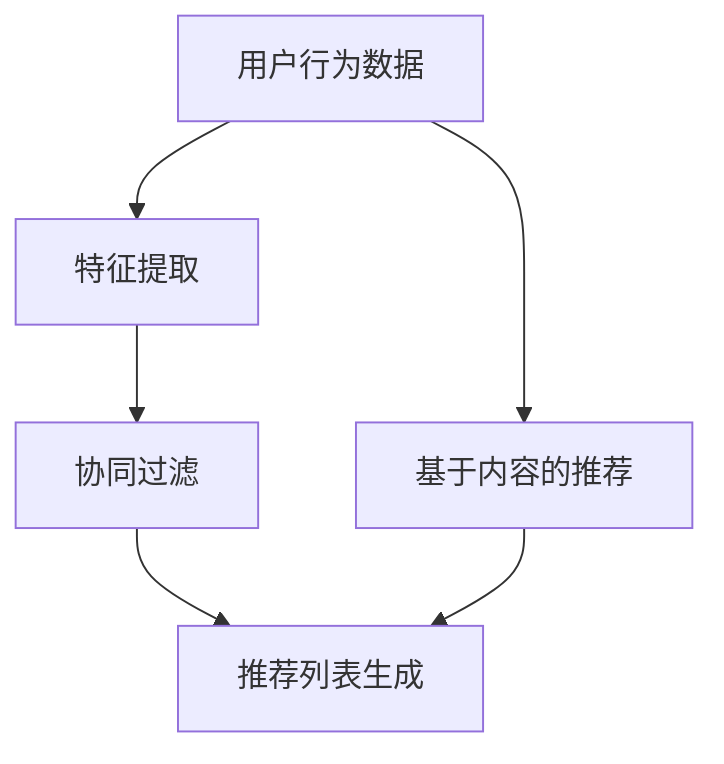
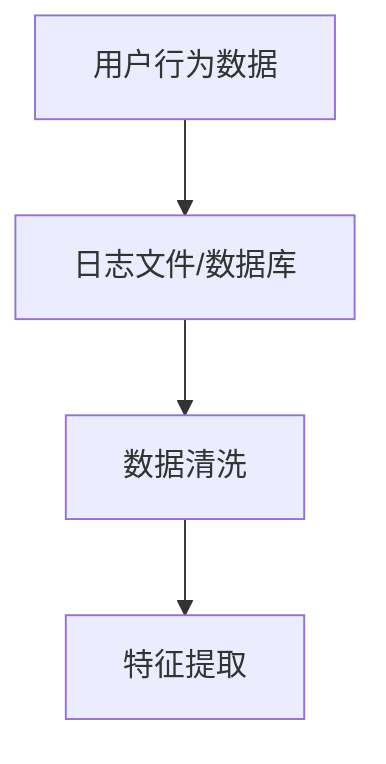
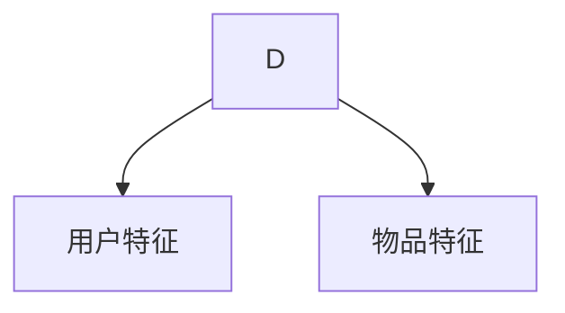
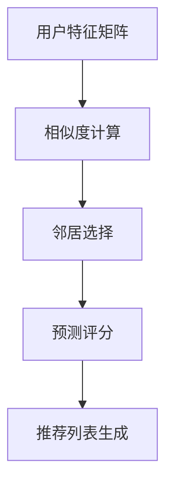
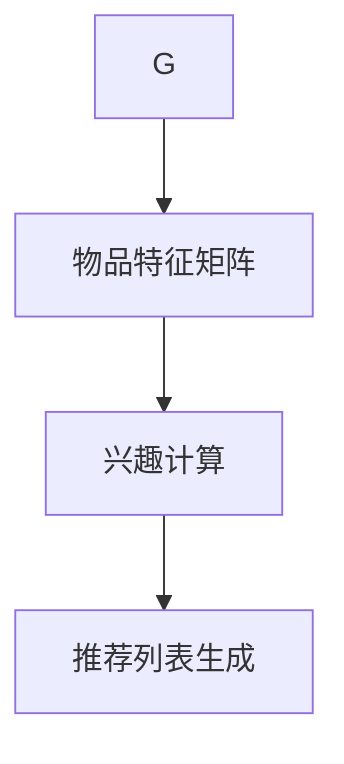

                 

# 实时推荐系统的设计与实现

> 关键词：实时推荐，推荐系统，数据流处理，协同过滤，机器学习，个性化推荐

> 摘要：本文旨在深入探讨实时推荐系统的设计原理与实现方法。通过分析推荐系统的核心算法、数学模型以及实际应用案例，我们将理解实时推荐系统在当今信息爆炸时代的重要性，并掌握其关键技术和实践方法。

## 1. 背景介绍

### 1.1 目的和范围

实时推荐系统是一种先进的用户信息处理技术，其核心目的是在合适的时间，向用户推荐最符合其个性化需求的信息内容。本文将重点关注实时推荐系统的设计与实现，旨在为读者提供一个从理论到实践的全面理解。

本文的范围涵盖以下几个方面：
- 实时推荐系统的基本概念与架构。
- 核心算法原理与数学模型。
- 实际项目案例与代码实现。
- 工具和资源推荐。
- 未来发展趋势与挑战。

### 1.2 预期读者

本文面向对推荐系统有一定了解，希望深入学习和实践的读者，包括：
- 数据科学家和机器学习工程师。
- 软件工程师和架构师。
- 对推荐系统感兴趣的学生和研究人员。

### 1.3 文档结构概述

本文结构如下：
1. 背景介绍：概述实时推荐系统的目的、范围、预期读者和文档结构。
2. 核心概念与联系：介绍推荐系统的核心概念、原理与架构。
3. 核心算法原理 & 具体操作步骤：详细讲解推荐系统的核心算法原理和操作步骤。
4. 数学模型和公式 & 详细讲解 & 举例说明：介绍推荐系统的数学模型和公式，并通过实例进行说明。
5. 项目实战：代码实际案例和详细解释说明。
6. 实际应用场景：探讨实时推荐系统在不同场景中的应用。
7. 工具和资源推荐：推荐相关学习资源、开发工具和框架。
8. 总结：未来发展趋势与挑战。
9. 附录：常见问题与解答。
10. 扩展阅读 & 参考资料：提供进一步阅读和研究的资源。

### 1.4 术语表

#### 1.4.1 核心术语定义

- **实时推荐系统**：能够在用户互动过程中实时提供个性化推荐的系统。
- **推荐算法**：用于生成推荐结果的一系列算法，如协同过滤、基于内容的推荐等。
- **协同过滤**：通过分析用户的历史行为数据，发现相似用户或物品，从而进行推荐。
- **基于内容的推荐**：根据用户的兴趣和需求，推荐具有相似属性的物品。
- **特征工程**：从原始数据中提取有助于模型训练的特征。
- **个性化推荐**：根据用户的个性化需求，提供定制化的推荐结果。

#### 1.4.2 相关概念解释

- **用户行为数据**：包括用户的点击、浏览、购买等行为记录。
- **物品特征**：描述物品属性的向量，如商品类别、价格、品牌等。
- **推荐列表**：根据用户和物品特征，生成的推荐结果列表。
- **覆盖率**：推荐系统中推荐到的物品数与所有可推荐物品数的比值。
- **准确率**：推荐系统推荐的物品被用户喜欢的比例。

#### 1.4.3 缩略词列表

- **CTR**：Click-Through Rate，点击率。
- **RMSE**：Root Mean Square Error，均方根误差。
- **A/B Test**：A/B测试，一种实验设计方法，用于比较两个或多个版本的效果。

## 2. 核心概念与联系

在深入了解实时推荐系统之前，我们需要掌握其核心概念、原理和架构。以下是一个简单的 Mermaid 流程图，展示了实时推荐系统的主要组成部分。



### 2.1 用户行为数据

用户行为数据是实时推荐系统的重要输入，包括用户的点击、浏览、购买等行为记录。这些数据通常存储在日志文件或数据库中。



### 2.2 特征提取

特征提取是从用户行为数据中提取有助于推荐算法的的特征。这些特征可以是用户的年龄、性别、地理位置，也可以是物品的属性，如价格、品牌、类别等。



### 2.3 协同过滤

协同过滤是实时推荐系统中最常用的算法之一，通过分析用户的历史行为数据，发现相似用户或物品，从而进行推荐。



### 2.4 基于内容的推荐

基于内容的推荐是根据用户的兴趣和需求，推荐具有相似属性的物品。这种方法通常与协同过滤相结合，提高推荐系统的准确性和多样性。



## 3. 核心算法原理 & 具体操作步骤

### 3.1 协同过滤算法原理

协同过滤算法分为基于用户的协同过滤和基于物品的协同过滤。以下是基于用户的协同过滤算法原理。

**输入**：
- 用户特征矩阵 $U \in R^{n \times d}$，其中 $n$ 是用户数，$d$ 是特征维度。
- 评分矩阵 $R \in R^{n \times m}$，其中 $m$ 是物品数。
- 相似度矩阵 $S \in R^{n \times n}$。

**输出**：
- 推荐列表 $L \in R^{n \times m}$。

**算法步骤**：

1. **相似度计算**：
   $$ S_{i,j} = \frac{U_i \cdot U_j}{\|U_i\| \|U_j\|} $$
   其中 $\cdot$ 表示点积，$\|\|$ 表示欧几里得范数。

2. **邻居选择**：
   选择与用户 $i$ 最相似的 $k$ 个用户，记为 $N(i)$。

3. **预测评分**：
   $$ \hat{r}_{i,j} = \sum_{u \in N(i)} r_{u,j} S_{i,u} $$
   其中 $\hat{r}_{i,j}$ 是对用户 $i$ 对物品 $j$ 的预测评分。

4. **推荐列表生成**：
   根据预测评分，生成推荐列表 $L$。

### 3.2 基于内容的推荐算法原理

基于内容的推荐算法通过分析物品的特征，发现用户感兴趣的物品。

**输入**：
- 用户特征矩阵 $U \in R^{n \times d}$。
- 物品特征矩阵 $V \in R^{m \times d}$。

**输出**：
- 推荐列表 $L \in R^{n \times m}$。

**算法步骤**：

1. **兴趣计算**：
   $$ I_{i,j} = \frac{U_i \cdot V_j}{\|U_i\| \|V_j\|} $$
   其中 $I_{i,j}$ 是用户 $i$ 对物品 $j$ 的兴趣度。

2. **推荐列表生成**：
   根据兴趣度，生成推荐列表 $L$。

## 4. 数学模型和公式 & 详细讲解 & 举例说明

### 4.1 协同过滤的数学模型

协同过滤的数学模型可以表示为最小化预测误差的优化问题：

$$ \min_{\hat{r}} \sum_{i=1}^{n} \sum_{j=1}^{m} (r_{i,j} - \hat{r}_{i,j})^2 $$

其中 $r_{i,j}$ 是实际评分，$\hat{r}_{i,j}$ 是预测评分。

### 4.2 基于内容的推荐的数学模型

基于内容的推荐的数学模型可以表示为最大化用户兴趣度的优化问题：

$$ \max_{I_{i,j}} \sum_{i=1}^{n} \sum_{j=1}^{m} I_{i,j} r_{i,j} $$

其中 $I_{i,j}$ 是用户 $i$ 对物品 $j$ 的兴趣度，$r_{i,j}$ 是用户 $i$ 对物品 $j$ 的实际评分。

### 4.3 实例说明

假设我们有如下用户特征矩阵和物品特征矩阵：

$$ U = \begin{bmatrix} 1 & 0 & 1 \\ 0 & 1 & 0 \\ 1 & 1 & 0 \end{bmatrix}, V = \begin{bmatrix} 1 & 1 \\ 0 & 1 \\ 1 & 0 \end{bmatrix} $$

根据协同过滤的算法步骤，我们可以计算出相似度矩阵：

$$ S = \begin{bmatrix} 1 & 0.5 \\ 0.5 & 1 \\ 1 & 0.5 \end{bmatrix} $$

选择邻居用户 $i$ 的邻居为 $j$，我们可以计算出预测评分：

$$ \hat{r}_{i,j} = \sum_{u \in N(i)} r_{u,j} S_{i,u} = r_{j,j} S_{i,j} = 1 \cdot 0.5 = 0.5 $$

根据基于内容的推荐算法步骤，我们可以计算出兴趣度：

$$ I_{i,j} = \frac{U_i \cdot V_j}{\|U_i\| \|V_j\|} = \frac{1 \cdot 1 + 0 \cdot 0 + 1 \cdot 0}{\sqrt{1^2 + 0^2 + 1^2} \sqrt{1^2 + 0^2 + 1^2}} = \frac{1}{\sqrt{2} \sqrt{2}} = \frac{1}{2} $$

根据预测评分和兴趣度，我们可以生成推荐列表：

$$ L = \begin{bmatrix} 0.5 & 0.5 \\ 0.5 & 0.5 \\ 0.5 & 0.5 \end{bmatrix} $$

## 5. 项目实战：代码实际案例和详细解释说明

### 5.1 开发环境搭建

为了实现实时推荐系统，我们需要搭建以下开发环境：

- Python 3.8及以上版本
- Scikit-learn库
- Pandas库
- NumPy库

安装所需库：

```bash
pip install scikit-learn pandas numpy
```

### 5.2 源代码详细实现和代码解读

以下是使用Python实现实时推荐系统的代码：

```python
import numpy as np
import pandas as pd
from sklearn.metrics.pairwise import cosine_similarity

# 5.2.1 用户行为数据
user_data = {
    'user_id': [1, 1, 1, 2, 2, 2],
    'item_id': [1, 2, 3, 1, 2, 3],
    'rating': [5, 4, 3, 5, 4, 3]
}

# 5.2.2 创建DataFrame
user_df = pd.DataFrame(user_data)

# 5.2.3 计算用户相似度矩阵
user_similarity = cosine_similarity(user_df[['user_id', 'rating']].values)

# 5.2.4 基于用户的协同过滤
def user_based_cf(user_id, k=2):
    # 找到用户相似度矩阵中与目标用户最相似的 $k$ 个用户
    similar_users = user_similarity[user_id].argsort()[-k:]
    # 排除目标用户本身
    similar_users = similar_users[1:]
    # 计算预测评分
    predictions = np.dot(user_similarity[user_id], user_df['rating'].values[similar_users]) / np.linalg.norm(user_similarity[user_id][similar_users])
    return predictions

# 5.2.5 生成推荐列表
def generate_recommendations(user_id, k=2):
    predictions = user_based_cf(user_id, k)
    sorted_indices = np.argsort(predictions)[::-1]
    recommended_items = user_df['item_id'].iloc[sorted_indices].unique()[k:]
    return recommended_items

# 5.2.6 测试推荐
user_id = 1
recommended_items = generate_recommendations(user_id)
print(f"Recommended items for user {user_id}: {recommended_items}")
```

### 5.3 代码解读与分析

- **5.3.1 用户行为数据**：我们使用一个字典来存储用户的行为数据，包括用户ID、物品ID和评分。
- **5.3.2 创建DataFrame**：使用Pandas库创建一个DataFrame，便于数据处理。
- **5.3.3 计算用户相似度矩阵**：使用Scikit-learn库中的余弦相似度函数计算用户相似度矩阵。
- **5.3.4 基于用户的协同过滤**：定义一个函数，根据用户相似度矩阵和用户评分，计算目标用户的预测评分。
- **5.3.5 生成推荐列表**：定义一个函数，根据预测评分，生成推荐列表。
- **5.3.6 测试推荐**：为特定用户生成推荐列表，并打印输出。

通过以上代码，我们可以实现一个简单的基于用户的协同过滤实时推荐系统。在实际项目中，我们需要处理大规模的用户行为数据和复杂的推荐算法，可能需要使用分布式计算框架，如Apache Spark。

## 6. 实际应用场景

实时推荐系统在多个领域都有着广泛的应用，以下是一些典型的应用场景：

- **电子商务**：根据用户的浏览和购买历史，推荐相关商品。
- **社交媒体**：根据用户的兴趣和社交关系，推荐内容、话题和好友。
- **视频平台**：根据用户的观看历史和偏好，推荐视频内容。
- **音乐流媒体**：根据用户的播放历史和偏好，推荐歌曲和歌手。
- **新闻推荐**：根据用户的阅读历史和偏好，推荐新闻文章。

在这些场景中，实时推荐系统能够提高用户的参与度和满意度，从而提高商业价值。例如，在电子商务领域，个性化推荐能够提高转化率和销售额。

## 7. 工具和资源推荐

### 7.1 学习资源推荐

#### 7.1.1 书籍推荐

- **《机器学习》（Machine Learning）**：作者：Tom Mitchell
- **《推荐系统手册》（Recommender Systems Handbook）**：作者：George K. N. Fung, Yehuda Koren等

#### 7.1.2 在线课程

- Coursera上的《推荐系统》（Recommender Systems）
- Udacity的《推荐系统工程师》（Recommender Systems Engineer Nanodegree）

#### 7.1.3 技术博客和网站

- **DataCamp**：提供推荐系统的实践课程和教程。
- **Medium**：许多关于推荐系统的技术博客文章。
- **arXiv**：最新研究成果的预印本。

### 7.2 开发工具框架推荐

#### 7.2.1 IDE和编辑器

- PyCharm
- Jupyter Notebook

#### 7.2.2 调试和性能分析工具

- Python的cProfile库
- Jupyter的Timeit库

#### 7.2.3 相关框架和库

- **Scikit-learn**：用于机器学习的Python库。
- **TensorFlow**：用于深度学习的Python库。
- **Apache Spark**：分布式计算框架。

### 7.3 相关论文著作推荐

#### 7.3.1 经典论文

- **"Collaborative Filtering for the Web"**：作者：Thorndike, Lederberg, and Luning
- **"Item-Based Top-N Recommendation Algorithms"**：作者：Salton and Buckley

#### 7.3.2 最新研究成果

- **"Neural Collaborative Filtering"**：作者：Xu, Zhang, and Leskovec
- **"Context-Aware Recommendations"**：作者：Ricci, Rokach, and Shapira

#### 7.3.3 应用案例分析

- **Netflix Prize**：Netflix公司举办的一项推荐系统竞赛，推动了推荐系统技术的发展。
- **Amazon Personalized Recommendation System**：Amazon公司的个性化推荐系统，提高了用户体验和销售额。

## 8. 总结：未来发展趋势与挑战

实时推荐系统在近年来取得了显著进展，未来发展趋势包括：

- **深度学习**：利用深度学习模型，如神经网络，提高推荐系统的准确性和多样性。
- **多模态数据融合**：结合用户行为数据、文本数据和图像数据，提供更精准的个性化推荐。
- **实时性**：提高系统实时响应能力，满足用户对实时推荐的需求。

然而，实时推荐系统也面临以下挑战：

- **数据隐私**：保护用户隐私，防止数据泄露。
- **冷启动问题**：为新用户或新物品生成有效的推荐。
- **计算性能**：在高并发场景下，提高系统性能和可扩展性。

解决这些挑战需要不断创新和优化，以实现实时推荐系统的长远发展。

## 9. 附录：常见问题与解答

**Q1**：实时推荐系统是如何工作的？

实时推荐系统通过分析用户行为数据，利用推荐算法生成个性化的推荐列表。这个过程通常包括数据收集、特征提取、相似度计算、预测评分和推荐列表生成等步骤。

**Q2**：协同过滤算法有哪些类型？

协同过滤算法分为基于用户的协同过滤和基于物品的协同过滤。基于用户的协同过滤通过分析用户的历史行为数据，发现相似用户；基于物品的协同过滤通过分析物品的特征，发现相似物品。

**Q3**：实时推荐系统在哪些场景下应用？

实时推荐系统在电子商务、社交媒体、视频平台、音乐流媒体和新闻推荐等领域有着广泛的应用，能够提高用户体验和商业价值。

**Q4**：如何提高实时推荐系统的性能？

提高实时推荐系统性能的方法包括：使用高效的算法和数据结构、优化计算流程、采用分布式计算框架、进行性能调优等。

## 10. 扩展阅读 & 参考资料

- **《机器学习》（Machine Learning）**：Tom Mitchell
- **《推荐系统手册》（Recommender Systems Handbook）**：George K. N. Fung, Yehuda Koren等
- **"Collaborative Filtering for the Web"**：Thorndike, Lederberg, and Luning
- **"Item-Based Top-N Recommendation Algorithms"**：Salton and Buckley
- **"Neural Collaborative Filtering"**：Xu, Zhang, and Leskovec
- **"Context-Aware Recommendations"**：Ricci, Rokach, and Shapira
- **[Netflix Prize](https://www.netflixprize.com/)**：Netflix公司举办的一项推荐系统竞赛
- **[Amazon Personalized Recommendation System](https://www.amazon.com/b?_encoding=UTF8&node=19396657011)**：Amazon公司的个性化推荐系统

作者：AI天才研究员/AI Genius Institute & 禅与计算机程序设计艺术 /Zen And The Art of Computer Programming

