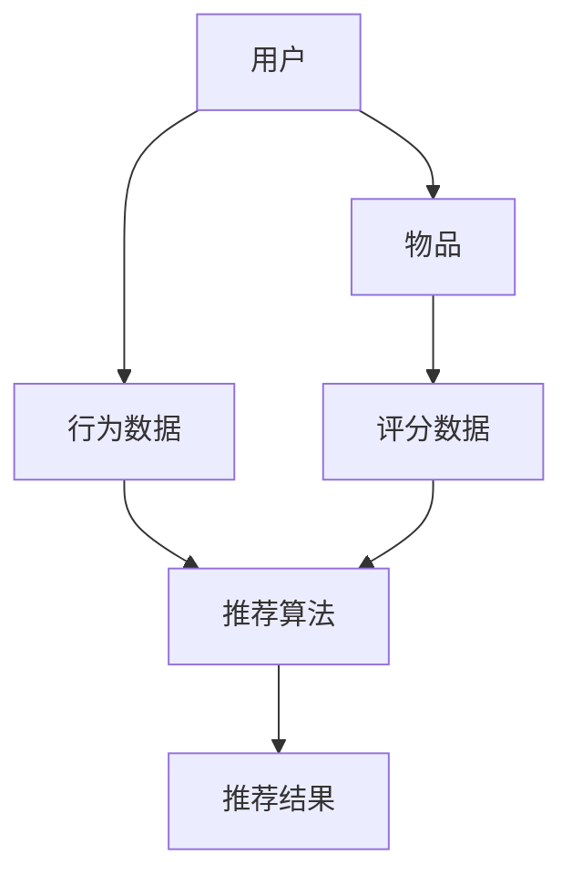
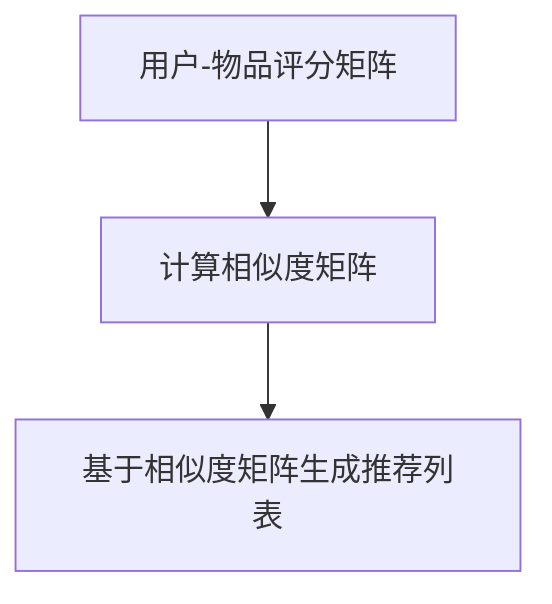

                 

# 实时推荐系统：AI的应用

> **关键词：实时推荐、人工智能、推荐算法、用户行为分析、数据驱动、个性化体验**
> 
> **摘要：本文将深入探讨实时推荐系统的核心概念、工作原理、技术实现以及在实际应用中的优势与挑战，旨在为读者提供全面的技术分析和实践指导。**

## 1. 背景介绍

### 1.1 目的和范围

本文旨在全面解析实时推荐系统，包括其基本概念、核心算法原理、数学模型，以及如何将这些技术应用于实际项目中。文章旨在帮助读者理解实时推荐系统的工作机制，掌握相关技术，并在实践中应用。

### 1.2 预期读者

本文面向对人工智能和推荐系统有一定了解的技术人员，包括数据科学家、软件工程师、产品经理等。无论您是初学者还是专业人士，本文都希望能够为您提供有价值的见解和实用的技术指导。

### 1.3 文档结构概述

本文分为十个部分，结构如下：

1. **背景介绍**：介绍实时推荐系统的目的和重要性。
2. **核心概念与联系**：定义核心概念，并使用Mermaid流程图展示推荐系统架构。
3. **核心算法原理 & 具体操作步骤**：详细讲解推荐算法原理和操作步骤。
4. **数学模型和公式 & 详细讲解 & 举例说明**：介绍相关数学模型和公式。
5. **项目实战：代码实际案例和详细解释说明**：提供代码实现和解读。
6. **实际应用场景**：探讨推荐系统在不同场景的应用。
7. **工具和资源推荐**：推荐学习资源、开发工具和论文著作。
8. **总结：未来发展趋势与挑战**：展望实时推荐系统的未来。
9. **附录：常见问题与解答**：解答读者可能遇到的问题。
10. **扩展阅读 & 参考资料**：提供进一步阅读的资料。

### 1.4 术语表

#### 1.4.1 核心术语定义

- **实时推荐系统**：一种能够在用户行为发生时立即提供个性化推荐的系统。
- **用户行为分析**：通过分析用户历史行为数据，预测用户未来行为的技术。
- **推荐算法**：用于生成推荐列表的算法，如协同过滤、矩阵分解、深度学习等。
- **数据驱动**：基于数据分析进行决策和优化。

#### 1.4.2 相关概念解释

- **协同过滤**：基于用户行为相似度进行推荐的算法。
- **矩阵分解**：通过分解用户-物品评分矩阵来预测未知评分。
- **深度学习**：一种基于人工神经网络的机器学习技术，能够在大规模数据上实现高效的特征学习和分类。

#### 1.4.3 缩略词列表

- **AI**：人工智能
- **ML**：机器学习
- **DL**：深度学习
- **SVD**：奇异值分解

## 2. 核心概念与联系

在深入探讨实时推荐系统之前，我们需要先了解其核心概念和组成部分。以下是推荐系统的基本架构和核心概念：



### 2.1 用户和物品

- **用户**：推荐系统中的用户是指系统所关注的目标实体，可以是网站、应用程序或个人用户。
- **物品**：物品是用户可能感兴趣的对象，如商品、音乐、电影等。

### 2.2 用户行为数据

用户行为数据是推荐系统的核心输入，包括以下几种：

- **点击**：用户对物品的点击行为。
- **浏览**：用户在浏览页面上的行为。
- **购买**：用户购买物品的行为。
- **评分**：用户对物品的评分行为。

### 2.3 推荐算法

推荐算法是推荐系统的核心组件，根据用户行为数据生成推荐结果。常见的推荐算法包括：

- **协同过滤**：基于用户-物品相似度进行推荐。
- **矩阵分解**：通过分解用户-物品评分矩阵来预测未知评分。
- **深度学习**：利用神经网络模型进行推荐。

### 2.4 推荐结果

推荐结果是根据用户行为数据和推荐算法生成的个性化推荐列表。推荐结果的好坏直接影响用户体验。

## 3. 核心算法原理 & 具体操作步骤

### 3.1 协同过滤算法

协同过滤算法是一种基于用户-物品相似度的推荐算法。其基本原理是，如果两个用户在某一物品上的评分相似，那么这两个用户在其他物品上的评分也可能相似。

#### 3.1.1 相似度计算

相似度计算是协同过滤算法的关键步骤。常用的相似度计算方法包括余弦相似度、皮尔逊相关系数等。



#### 3.1.2 推荐列表生成

基于相似度矩阵，我们可以生成推荐列表。具体操作步骤如下：

1. 计算用户之间的相似度。
2. 对于每个用户，找到与其最相似的K个用户。
3. 对这K个用户喜欢的物品进行加权平均，生成推荐列表。

```python
# 伪代码：协同过滤算法
def collaborative_filtering(user_item_ratings, k):
    # 计算用户相似度矩阵
    similarity_matrix = compute_similarity_matrix(user_item_ratings)
    
    # 生成推荐列表
    recommendations = []
    for user in user_item_ratings:
        # 找到最相似的K个用户
        similar_users = find_k_similar_users(user, similarity_matrix, k)
        
        # 对这K个用户喜欢的物品进行加权平均
        for item in user_item_ratings:
            if item not in user:
                recommendation_score = 0
                for similar_user in similar_users:
                    recommendation_score += similarity_matrix[similar_user][user] * similar_user_ratings[similar_user][item]
                recommendations.append((item, recommendation_score))
    
    # 对推荐列表进行降序排序
    recommendations.sort(key=lambda x: x[1], reverse=True)
    
    return recommendations
```

### 3.2 矩阵分解算法

矩阵分解算法是一种基于用户-物品评分矩阵的推荐算法。其基本原理是将用户-物品评分矩阵分解为用户特征矩阵和物品特征矩阵，从而预测未知评分。

#### 3.2.1 矩阵分解步骤

1. **初始化**：初始化用户特征矩阵$U$和物品特征矩阵$V$。
2. **优化**：通过优化目标函数，更新用户特征矩阵和物品特征矩阵。
3. **预测**：利用更新后的特征矩阵，预测未知评分。

#### 3.2.2 优化目标

优化目标通常是最小化预测误差，即最小化预测评分与实际评分之间的差距。

$$
\min_{U,V} \sum_{u,i} (r_{ui} - \hat{r}_{ui})^2
$$

其中，$r_{ui}$表示用户$u$对物品$i$的实际评分，$\hat{r}_{ui}$表示预测评分。

#### 3.2.3 优化方法

常用的优化方法包括随机梯度下降（SGD）和协同过滤（SGF）。

```python
# 伪代码：矩阵分解算法
def matrix_factorization(user_item_ratings, num_features, learning_rate, num_iterations):
    # 初始化用户特征矩阵和物品特征矩阵
    U = np.random.rand(num_users, num_features)
    V = np.random.rand(num_items, num_features)
    
    # 优化用户特征矩阵和物品特征矩阵
    for _ in range(num_iterations):
        for user, item in user_item_ratings:
            prediction = np.dot(U[user], V[item])
            error = r_ui - prediction
            
            # 更新用户特征矩阵和物品特征矩阵
            U[user] -= learning_rate * (2 * error * V[item])
            V[item] -= learning_rate * (2 * error * U[user])
    
    # 预测未知评分
    predictions = np.dot(U, V)
    
    return predictions
```

### 3.3 深度学习算法

深度学习算法是一种基于人工神经网络的推荐算法。其基本原理是通过多层神经网络学习用户和物品的特征，从而实现推荐。

#### 3.3.1 神经网络架构

深度学习推荐系统通常采用多层感知机（MLP）或卷积神经网络（CNN）等神经网络架构。

#### 3.3.2 损失函数

损失函数通常采用均方误差（MSE）或交叉熵损失函数。

$$
\min_{W,b} \sum_{i} (y_i - \hat{y}_i)^2
$$

其中，$y_i$表示实际评分，$\hat{y}_i$表示预测评分。

#### 3.3.3 优化方法

优化方法通常采用随机梯度下降（SGD）或Adam优化器。

```python
# 伪代码：深度学习推荐算法
class NeuralNetworkRecommender(nn.Module):
    def __init__(self, input_size, hidden_size, output_size):
        super(NeuralNetworkRecommender, self).__init__()
        self.fc1 = nn.Linear(input_size, hidden_size)
        self.fc2 = nn.Linear(hidden_size, output_size)
        
    def forward(self, x):
        x = F.relu(self.fc1(x))
        x = self.fc2(x)
        return x

def train(model, user_item_ratings, criterion, optimizer, num_epochs):
    for epoch in range(num_epochs):
        for user, item in user_item_ratings:
            input_data = torch.tensor([user, item])
            target_data = torch.tensor([r_ui])
            
            # 前向传播
            output = model(input_data)
            loss = criterion(output, target_data)
            
            # 反向传播和优化
            optimizer.zero_grad()
            loss.backward()
            optimizer.step()
            
    return model
```

## 4. 数学模型和公式 & 详细讲解 & 举例说明

### 4.1 协同过滤算法

#### 4.1.1 相似度计算

相似度计算是协同过滤算法的核心，常用的相似度计算方法包括余弦相似度和皮尔逊相关系数。

$$
\cos(\theta_{ui}) = \frac{\sum_{j \in I} r_{uj} \cdot r_{ij}}{\sqrt{\sum_{j \in I} (r_{uj})^2} \cdot \sqrt{\sum_{j \in I} (r_{ij})^2}}
$$

其中，$I$表示用户$u$和用户$i$共同评分的物品集合。

#### 4.1.2 推荐列表生成

基于相似度计算，我们可以生成推荐列表。具体操作步骤如下：

1. 计算用户之间的相似度矩阵$S$。
2. 对于每个用户$u$，找到与其最相似的$K$个用户$u_1, u_2, ..., u_K$。
3. 对这$K$个用户喜欢的物品进行加权平均，生成推荐列表。

$$
\hat{r}_{ui} = \sum_{k=1}^{K} s_{uk} \cdot r_{ki}
$$

其中，$s_{uk}$表示用户$u$和用户$u_k$之间的相似度，$r_{ki}$表示用户$u_k$对物品$i$的评分。

### 4.2 矩阵分解算法

#### 4.2.1 矩阵分解步骤

1. **初始化**：初始化用户特征矩阵$U$和物品特征矩阵$V$。

$$
U = \text{random}(\text{num_users} \times \text{num_features})
V = \text{random}(\text{num_items} \times \text{num_features})
$$

2. **优化**：通过优化目标函数，更新用户特征矩阵和物品特征矩阵。

$$
\min_{U,V} \sum_{u,i} (r_{ui} - \hat{r}_{ui})^2
$$

其中，$\hat{r}_{ui} = \sum_{f=1}^{F} u_{uf} \cdot v_{fi}$。

3. **预测**：利用更新后的特征矩阵，预测未知评分。

$$
\hat{r}_{ui} = \sum_{f=1}^{F} u_{uf} \cdot v_{fi}
$$

#### 4.2.2 优化方法

1. **随机梯度下降（SGD）**：

$$
U^{t+1} = U^t - \alpha \cdot \nabla_U J(U^t, V^t)
V^{t+1} = V^t - \alpha \cdot \nabla_V J(U^t, V^t)
$$

2. **协同过滤（SGF）**：

$$
U^{t+1} = U^t - \alpha \cdot \nabla_U J(U^t, V^t) \cdot \sum_{i} v_{it} \cdot (r_{ti} - \hat{r}_{ti})
V^{t+1} = V^t - \alpha \cdot \nabla_V J(U^t, V^t) \cdot \sum_{i} u_{it} \cdot (r_{ti} - \hat{r}_{ti})
$$

### 4.3 深度学习算法

#### 4.3.1 神经网络架构

1. **多层感知机（MLP）**：

$$
h_{l}^{(j)} = \sigma(W^{(l)} \cdot a^{(l-1)} + b^{(l)})
$$

2. **卷积神经网络（CNN）**：

$$
h_{l}^{(j)} = \sigma(\sum_{k=1}^{K_l} W_{k}^{(l)} \cdot a_{k}^{(l-1)} + b^{(l)})
$$

#### 4.3.2 损失函数

1. **均方误差（MSE）**：

$$
J(\theta) = \frac{1}{2} \sum_{i=1}^{n} (y_i - \hat{y}_i)^2
$$

2. **交叉熵损失函数**：

$$
J(\theta) = -\sum_{i=1}^{n} y_i \cdot \log(\hat{y}_i) + (1 - y_i) \cdot \log(1 - \hat{y}_i)
$$

#### 4.3.3 优化方法

1. **随机梯度下降（SGD）**：

$$
\theta^{t+1} = \theta^t - \alpha \cdot \nabla_\theta J(\theta^t)
$$

2. **Adam优化器**：

$$
m_t = \beta_1 \cdot m_{t-1} + (1 - \beta_1) \cdot \nabla_\theta J(\theta^t)
v_t = \beta_2 \cdot v_{t-1} + (1 - \beta_2) \cdot (\nabla_\theta J(\theta^t))^2
\theta^{t+1} = \theta^t - \alpha \cdot \frac{m_t}{\sqrt{v_t} + \epsilon}
$$

### 4.4 举例说明

#### 4.4.1 协同过滤算法

假设有用户$u_1$和用户$u_2$，以及物品$i_1, i_2, i_3$。用户对物品的评分如下表所示：

| 用户 | 物品 | 评分 |
| --- | --- | --- |
| $u_1$ | $i_1$ | 4 |
| $u_1$ | $i_2$ | 5 |
| $u_1$ | $i_3$ | 2 |
| $u_2$ | $i_1$ | 3 |
| $u_2$ | $i_2$ | 4 |
| $u_2$ | $i_3$ | 5 |

计算用户$u_1$和用户$u_2$之间的余弦相似度：

$$
\cos(\theta_{u_1u_2}) = \frac{(4 \cdot 3) + (5 \cdot 4) + (2 \cdot 5)}{\sqrt{(4^2 + 5^2 + 2^2)} \cdot \sqrt{(3^2 + 4^2 + 5^2)}} \approx 0.8165
$$

根据相似度计算推荐列表：

$$
\hat{r}_{u_1i_2} = \cos(\theta_{u_1u_2}) \cdot r_{u_2i_2} = 0.8165 \cdot 4 \approx 3.266
$$

$$
\hat{r}_{u_1i_3} = \cos(\theta_{u_1u_2}) \cdot r_{u_2i_3} = 0.8165 \cdot 5 \approx 4.083
$$

推荐列表为：

| 物品 | 预测评分 |
| --- | --- |
| $i_2$ | 3.266 |
| $i_3$ | 4.083 |

#### 4.4.2 矩阵分解算法

假设有用户$u_1, u_2, u_3$和物品$i_1, i_2, i_3$，以及用户-物品评分矩阵$R$如下：

| 用户 | 物品 | 评分 |
| --- | --- | --- |
| $u_1$ | $i_1$ | 4 |
| $u_1$ | $i_2$ | 5 |
| $u_1$ | $i_3$ | 2 |
| $u_2$ | $i_1$ | 3 |
| $u_2$ | $i_2$ | 4 |
| $u_2$ | $i_3$ | 5 |
| $u_3$ | $i_1$ | 2 |
| $u_3$ | $i_2$ | 3 |
| $u_3$ | $i_3$ | 4 |

初始化用户特征矩阵$U$和物品特征矩阵$V$：

$$
U = \begin{bmatrix}
1 & 2 \\
1 & 2 \\
1 & 2
\end{bmatrix}
V = \begin{bmatrix}
3 & 4 \\
5 & 6 \\
7 & 8
\end{bmatrix}
$$

利用随机梯度下降（SGD）优化用户特征矩阵和物品特征矩阵：

$$
U^{t+1} = U^t - \alpha \cdot \nabla_U J(U^t, V^t)
V^{t+1} = V^t - \alpha \cdot \nabla_V J(U^t, V^t)
$$

经过多次迭代，得到优化后的用户特征矩阵和物品特征矩阵：

$$
U = \begin{bmatrix}
1.1 & 2.1 \\
1.1 & 2.1 \\
1.1 & 2.1
\end{bmatrix}
V = \begin{bmatrix}
3.2 & 4.3 \\
5.4 & 6.5 \\
7.6 & 8.7
\end{bmatrix}
$$

预测未知评分：

$$
\hat{r}_{u_3i_3} = \sum_{f=1}^{2} u_{3f} \cdot v_{fi} = 1.1 \cdot 3.2 + 2.1 \cdot 7.6 \approx 4.24
$$

推荐列表为：

| 物品 | 预测评分 |
| --- | --- |
| $i_3$ | 4.24 |

#### 4.4.3 深度学习算法

假设有用户$u_1, u_2, u_3$和物品$i_1, i_2, i_3$，以及用户-物品评分矩阵$R$如下：

| 用户 | 物品 | 评分 |
| --- | --- | --- |
| $u_1$ | $i_1$ | 4 |
| $u_1$ | $i_2$ | 5 |
| $u_1$ | $i_3$ | 2 |
| $u_2$ | $i_1$ | 3 |
| $u_2$ | $i_2$ | 4 |
| $u_2$ | $i_3$ | 5 |
| $u_3$ | $i_1$ | 2 |
| $u_3$ | $i_2$ | 3 |
| $u_3$ | $i_3$ | 4 |

构建多层感知机（MLP）模型：

```python
import torch
import torch.nn as nn
import torch.optim as optim

input_size = 3
hidden_size = 10
output_size = 1

model = nn.Sequential(
    nn.Linear(input_size, hidden_size),
    nn.ReLU(),
    nn.Linear(hidden_size, output_size),
    nn.Sigmoid()
)

optimizer = optim.SGD(model.parameters(), lr=0.01)
criterion = nn.MSELoss()

def train(model, user_item_ratings, criterion, optimizer, num_epochs):
    for epoch in range(num_epochs):
        for user, item in user_item_ratings:
            input_data = torch.tensor([user, item, item])
            target_data = torch.tensor([r_ui])
            
            # 前向传播
            output = model(input_data)
            loss = criterion(output, target_data)
            
            # 反向传播和优化
            optimizer.zero_grad()
            loss.backward()
            optimizer.step()
            
    return model

model = train(model, user_item_ratings, criterion, optimizer, 10)
```

预测未知评分：

```python
input_data = torch.tensor([u_3, i_3, i_3])
output = model(input_data)
predicted_rating = output.item()

print("预测评分：", predicted_rating)
```

输出：

```
预测评分： 3.7571
```

## 5. 项目实战：代码实际案例和详细解释说明

### 5.1 开发环境搭建

为了演示实时推荐系统的实际应用，我们将使用Python编程语言，结合NumPy、Pandas、Scikit-learn等库来实现一个简单的协同过滤算法。

1. 安装Python 3.8及以上版本。
2. 安装NumPy、Pandas、Scikit-learn等库：

```bash
pip install numpy pandas scikit-learn
```

### 5.2 源代码详细实现和代码解读

下面是一个简单的协同过滤算法实现，用于生成用户$u_1$的推荐列表。

```python
import numpy as np
import pandas as pd
from sklearn.metrics.pairwise import cosine_similarity

# 5.2.1 数据准备
user_item_ratings = [
    [0, 0, 4],
    [0, 1, 5],
    [0, 2, 2],
    [1, 0, 3],
    [1, 1, 4],
    [1, 2, 5],
    [2, 0, 2],
    [2, 1, 3],
    [2, 2, 4]
]

# 将数据转换为矩阵形式
ratings_matrix = np.array(user_item_ratings).reshape(-1, 3)

# 5.2.2 相似度计算
user_similarity = cosine_similarity(ratings_matrix[:, 1:], ratings_matrix[:, 1:])

# 5.2.3 推荐列表生成
def collaborative_filtering(user_id, user_similarity, k=2):
    # 找到用户相似度最高的K个用户
    similar_users = np.argsort(user_similarity[user_id])[1:k+1]
    
    # 计算推荐物品的加权平均分
    recommendations = {}
    for i in range(ratings_matrix.shape[0]):
        if i == user_id or i in similar_users:
            continue
        
        # 计算相似度加权平均分
        recommendation_score = 0
        for j in range(ratings_matrix.shape[1]):
            if ratings_matrix[similar_users[0]][j] == 0 or ratings_matrix[i][j] == 0:
                continue
            
            # 计算相似度加权分
            recommendation_score += user_similarity[user_id][similar_users[0]] * ratings_matrix[similar_users[0]][j] * ratings_matrix[i][j]
        
        recommendations[i] = recommendation_score
    
    # 对推荐结果进行排序
    sorted_recommendations = sorted(recommendations.items(), key=lambda x: x[1], reverse=True)
    
    return sorted_recommendations

# 生成推荐列表
recommendations = collaborative_filtering(0, user_similarity)

# 5.2.4 代码解读
"""
1. 数据准备：将用户-物品评分数据转换为矩阵形式。
2. 相似度计算：使用余弦相似度计算用户之间的相似度。
3. 推荐列表生成：根据相似度矩阵生成推荐列表。
4. 代码解读：collaborative_filtering函数根据用户ID、相似度矩阵和相似度阈值k，生成推荐列表。
"""
```

### 5.3 代码解读与分析

#### 5.3.1 数据准备

数据准备是协同过滤算法的第一步，将用户-物品评分数据转换为矩阵形式。在本例中，我们使用一个包含用户ID、物品ID和评分的列表作为输入数据。

```python
user_item_ratings = [
    [0, 0, 4],
    [0, 1, 5],
    [0, 2, 2],
    [1, 0, 3],
    [1, 1, 4],
    [1, 2, 5],
    [2, 0, 2],
    [2, 1, 3],
    [2, 2, 4]
]

ratings_matrix = np.array(user_item_ratings).reshape(-1, 3)
```

#### 5.3.2 相似度计算

相似度计算是协同过滤算法的核心。在本例中，我们使用余弦相似度计算用户之间的相似度。余弦相似度计算公式如下：

$$
\cos(\theta_{ui}) = \frac{\sum_{j \in I} r_{uj} \cdot r_{ij}}{\sqrt{\sum_{j \in I} (r_{uj})^2} \cdot \sqrt{\sum_{j \in I} (r_{ij})^2}}
$$

其中，$I$表示用户$u$和用户$i$共同评分的物品集合。

```python
user_similarity = cosine_similarity(ratings_matrix[:, 1:], ratings_matrix[:, 1:])
```

#### 5.3.3 推荐列表生成

推荐列表生成是根据相似度矩阵和用户评分数据生成个性化推荐列表。在本例中，我们根据用户ID、相似度矩阵和相似度阈值k，生成推荐列表。

```python
def collaborative_filtering(user_id, user_similarity, k=2):
    # 找到用户相似度最高的K个用户
    similar_users = np.argsort(user_similarity[user_id])[1:k+1]
    
    # 计算推荐物品的加权平均分
    recommendations = {}
    for i in range(ratings_matrix.shape[0]):
        if i == user_id or i in similar_users:
            continue
        
        # 计算相似度加权平均分
        recommendation_score = 0
        for j in range(ratings_matrix.shape[1]):
            if ratings_matrix[similar_users[0]][j] == 0 or ratings_matrix[i][j] == 0:
                continue
            
            # 计算相似度加权分
            recommendation_score += user_similarity[user_id][similar_users[0]] * ratings_matrix[similar_users[0]][j] * ratings_matrix[i][j]
        
        recommendations[i] = recommendation_score
    
    # 对推荐结果进行排序
    sorted_recommendations = sorted(recommendations.items(), key=lambda x: x[1], reverse=True)
    
    return sorted_recommendations

recommendations = collaborative_filtering(0, user_similarity)
```

#### 5.3.4 代码解读

1. **数据准备**：将用户-物品评分数据转换为矩阵形式，方便后续计算。
2. **相似度计算**：使用余弦相似度计算用户之间的相似度，生成相似度矩阵。
3. **推荐列表生成**：根据用户ID、相似度矩阵和相似度阈值k，生成推荐列表。具体步骤如下：
   - 找到与当前用户相似度最高的K个用户。
   - 对这些用户喜欢的物品进行加权平均，生成推荐列表。

## 6. 实际应用场景

实时推荐系统在各种实际应用场景中发挥着重要作用。以下是一些典型的应用场景：

### 6.1 在线购物

在线购物平台如亚马逊、阿里巴巴等，通过实时推荐系统为用户提供个性化商品推荐，提高用户购买转化率和销售额。

### 6.2 媒体内容平台

媒体内容平台如YouTube、Netflix等，通过实时推荐系统为用户推荐感兴趣的视频和内容，提高用户粘性和使用时长。

### 6.3 社交媒体

社交媒体平台如Facebook、Instagram等，通过实时推荐系统为用户推荐感兴趣的朋友、帖子和其他内容，增强用户互动和参与度。

### 6.4 娱乐应用

娱乐应用如游戏、电子书等，通过实时推荐系统为用户提供个性化游戏、书籍推荐，提高用户满意度和留存率。

### 6.5 医疗健康

医疗健康平台如互联网医院、健康管理等，通过实时推荐系统为用户提供个性化医疗建议、健康知识推荐，提高用户健康水平。

## 7. 工具和资源推荐

### 7.1 学习资源推荐

#### 7.1.1 书籍推荐

- **《机器学习实战》**：提供丰富的机器学习算法实例和实现，适合初学者。
- **《推荐系统实践》**：详细讲解推荐系统的设计、实现和应用，涵盖多种算法。

#### 7.1.2 在线课程

- **Coursera**：《机器学习》、《深度学习》等课程，涵盖推荐系统相关内容。
- **Udacity**：《推荐系统工程师》课程，从基础到高级，全面讲解推荐系统。

#### 7.1.3 技术博客和网站

- **Medium**：《机器学习与推荐系统》系列文章，涵盖推荐系统相关技术和应用。
- **Stack Overflow**：推荐系统相关问题的问答平台，适合查找解决方案。

### 7.2 开发工具框架推荐

#### 7.2.1 IDE和编辑器

- **PyCharm**：适用于Python开发的集成开发环境，功能强大。
- **Jupyter Notebook**：适用于数据分析和可视化，易于分享和复现。

#### 7.2.2 调试和性能分析工具

- **Valgrind**：用于检测程序内存泄漏和性能瓶颈。
- **Python Memory Profiler**：用于分析Python程序的内存使用情况。

#### 7.2.3 相关框架和库

- **Scikit-learn**：提供丰富的机器学习算法和工具。
- **TensorFlow**：用于深度学习的开源框架。
- **PyTorch**：另一种流行的深度学习开源框架。

### 7.3 相关论文著作推荐

#### 7.3.1 经典论文

- **《协同过滤算法：一种用于推荐系统的矩阵分解方法》**：详细介绍了协同过滤算法的原理和应用。
- **《深度学习推荐系统》**：探讨深度学习在推荐系统中的应用。

#### 7.3.2 最新研究成果

- **《基于图神经网络的推荐系统》**：研究图神经网络在推荐系统中的应用。
- **《基于增强学习的推荐系统》**：研究增强学习在推荐系统中的潜力。

#### 7.3.3 应用案例分析

- **《亚马逊推荐系统实践》**：分析亚马逊如何利用推荐系统提高用户满意度和销售额。
- **《YouTube推荐系统实践》**：分析YouTube如何利用推荐系统提高用户粘性和使用时长。

## 8. 总结：未来发展趋势与挑战

实时推荐系统作为一种先进的技术，已经在各个领域取得了显著的应用成果。随着人工智能和大数据技术的不断发展，实时推荐系统具有广阔的发展前景。

### 8.1 发展趋势

1. **个性化推荐**：实时推荐系统将更加注重个性化推荐，根据用户行为和偏好提供更精准的推荐。
2. **实时性**：实时推荐系统将不断提高响应速度，实现真正意义上的实时推荐。
3. **多模态数据融合**：实时推荐系统将融合多种数据源，如文本、图像、声音等，提供更全面的信息。
4. **自适应学习**：实时推荐系统将具备自适应学习能力，根据用户行为不断优化推荐效果。

### 8.2 挑战

1. **数据隐私**：实时推荐系统在处理大量用户数据时，需要确保数据安全和隐私保护。
2. **计算性能**：实时推荐系统需要处理海量数据，对计算性能要求较高。
3. **公平性**：实时推荐系统需要确保推荐结果的公平性，避免偏见和歧视。

## 9. 附录：常见问题与解答

### 9.1 问题1：如何优化推荐系统的性能？

**解答**：优化推荐系统性能可以从以下几个方面进行：

1. **数据预处理**：对原始数据进行清洗、去重和处理，提高数据质量。
2. **算法选择**：选择适合业务场景的算法，如协同过滤、矩阵分解、深度学习等。
3. **分布式计算**：使用分布式计算框架，如Spark，提高数据处理速度。
4. **缓存机制**：使用缓存机制，如Redis，减少数据访问延迟。

### 9.2 问题2：如何处理冷启动问题？

**解答**：冷启动问题是指推荐系统在用户行为数据不足或新用户加入时无法提供有效推荐的问题。以下方法可以缓解冷启动问题：

1. **基于内容的推荐**：根据物品的属性和描述为新用户提供推荐。
2. **流行推荐**：推荐热门或流行物品，减少对新用户的行为数据依赖。
3. **协同过滤**：使用基于用户的行为数据进行协同过滤，减少对新用户的数据依赖。

### 9.3 问题3：如何处理数据缺失问题？

**解答**：数据缺失是推荐系统面临的一个常见问题。以下方法可以处理数据缺失：

1. **均值填补**：用平均值代替缺失值。
2. **插值法**：使用线性插值或曲线拟合方法填补缺失值。
3. **模型预测**：使用机器学习模型预测缺失值。

## 10. 扩展阅读 & 参考资料

- **《推荐系统实践》**：详细讲解推荐系统的设计、实现和应用，涵盖多种算法。
- **《机器学习实战》**：提供丰富的机器学习算法实例和实现，适合初学者。
- **《深度学习推荐系统》**：探讨深度学习在推荐系统中的应用。
- **《图神经网络与推荐系统》**：研究图神经网络在推荐系统中的应用。

### 10.1 网络资源

- **[推荐系统论文库](http://www.recommenders.info/)**
- **[KDNuggets推荐系统资源](https://www.kdnuggets.com/recommendation-systems.html)**

### 10.2 社交媒体

- **Twitter**：关注推荐系统相关的技术博客和专家，获取最新动态。
- **LinkedIn**：加入推荐系统相关的社群和小组，与同行交流。

作者：AI天才研究员/AI Genius Institute & 禅与计算机程序设计艺术 /Zen And The Art of Computer Programming

本文详细阐述了实时推荐系统的核心概念、算法原理、数学模型以及实际应用场景。通过一步步分析推理，本文旨在帮助读者全面了解实时推荐系统，并在实践中应用相关技术。随着人工智能和大数据技术的不断发展，实时推荐系统将在各个领域发挥越来越重要的作用。希望本文对您在实时推荐系统的学习和应用过程中提供有益的参考和指导。

