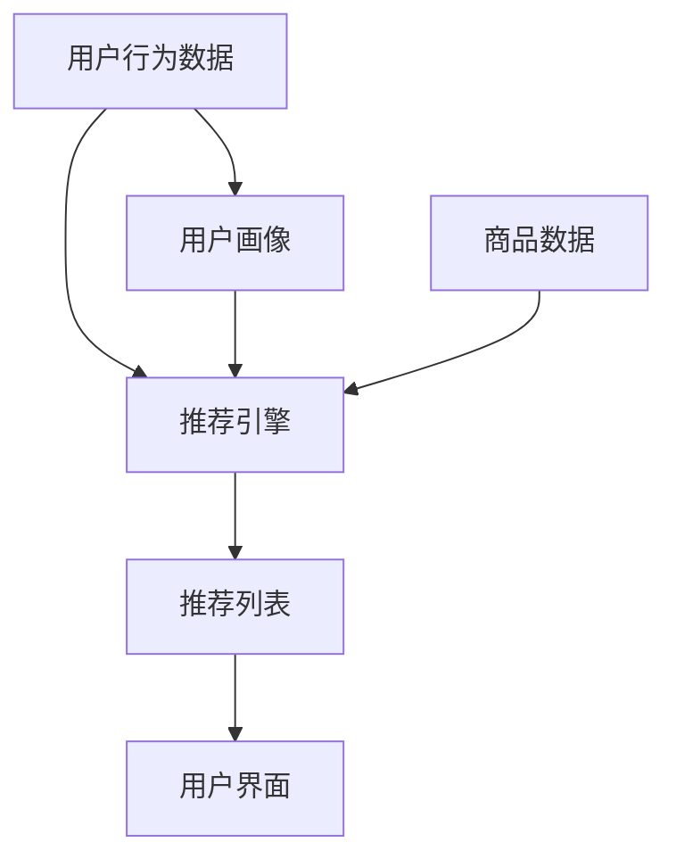

                 

# 实时推荐：AI如何抓住用户兴趣，提升购买转化率

> **关键词：** 实时推荐、AI、用户兴趣、购买转化率、数据挖掘、机器学习、推荐系统、算法优化

> **摘要：** 本文章将深入探讨实时推荐系统在抓住用户兴趣和提升购买转化率方面的作用。通过分析核心算法原理、数学模型、项目实战和实际应用场景，本文旨在为读者提供关于实时推荐系统的全面了解，以及如何有效利用AI技术提升商业价值的实用指导。

## 1. 背景介绍

### 1.1 目的和范围

本文的主要目的是探讨实时推荐系统在电子商务和在线服务中的应用，分析其如何利用人工智能技术精准捕捉用户兴趣，并提升购买转化率。我们将覆盖以下内容：

- 实时推荐系统的核心概念和架构。
- 实时推荐的核心算法原理和具体操作步骤。
- 数学模型和公式的详细讲解及举例说明。
- 项目实战中的代码实际案例和详细解释。
- 实时推荐在实际应用场景中的表现。
- 学习资源和开发工具推荐。
- 未来发展趋势和挑战。

通过本文的阅读，读者将能够了解实时推荐系统的基本原理，掌握如何设计和优化推荐系统，并能够将这些技术应用于实际项目中，从而提高用户体验和业务收益。

### 1.2 预期读者

本文适合以下读者群体：

- 想了解实时推荐系统基础知识的开发者。
- 对机器学习和数据挖掘感兴趣的数据科学家。
- 从事电子商务或在线服务领域的从业者。
- 对AI在商业应用中如何提升购买转化率感兴趣的学者。

### 1.3 文档结构概述

本文结构如下：

1. **背景介绍**：介绍文章的目的、范围、预期读者和文档结构。
2. **核心概念与联系**：通过Mermaid流程图展示实时推荐系统的核心概念和联系。
3. **核心算法原理 & 具体操作步骤**：使用伪代码详细阐述算法原理和操作步骤。
4. **数学模型和公式 & 详细讲解 & 举例说明**：使用LaTeX格式讲解数学模型和公式，并举例说明。
5. **项目实战：代码实际案例和详细解释说明**：展示实时推荐系统的实际代码实现。
6. **实际应用场景**：讨论实时推荐系统在不同场景中的表现。
7. **工具和资源推荐**：推荐学习资源和开发工具。
8. **总结：未来发展趋势与挑战**：展望实时推荐系统的未来趋势和面临的挑战。
9. **附录：常见问题与解答**：回答读者可能遇到的问题。
10. **扩展阅读 & 参考资料**：提供相关文献和参考资料。

### 1.4 术语表

#### 1.4.1 核心术语定义

- **实时推荐**：在用户行为数据发生时即刻生成的个性化推荐。
- **用户兴趣**：用户在某一特定时间段内表现出的对某种产品、内容或服务的偏好。
- **购买转化率**：用户在访问电子商务网站或应用后完成购买的比例。
- **推荐系统**：利用算法和技术分析用户数据，为用户生成个性化推荐的一套系统。
- **机器学习**：使计算机系统能够从数据中学习并做出决策的一种技术。
- **数据挖掘**：从大量数据中提取有价值信息的过程。

#### 1.4.2 相关概念解释

- **协同过滤**：一种常用的推荐算法，通过分析用户之间的行为模式进行推荐。
- **内容推荐**：基于产品或内容的属性进行推荐。
- **深度学习**：一种基于人工神经网络的机器学习技术，通过多层神经网络进行特征学习和模式识别。
- **用户画像**：通过用户的历史行为和特征数据构建的用户信息模型。

#### 1.4.3 缩略词列表

- **CTR**：点击率（Click-Through Rate）
- **RMSE**：均方根误差（Root Mean Square Error）
- **LDA**：主题模型（Latent Dirichlet Allocation）
- **GAN**：生成对抗网络（Generative Adversarial Network）

## 2. 核心概念与联系

为了深入理解实时推荐系统的架构和运作方式，我们需要了解其中的核心概念和它们之间的联系。以下是使用Mermaid流程图展示的实时推荐系统的概念和架构。



### 2.1. 用户行为数据

用户行为数据是实时推荐系统的核心输入之一，包括用户在网站或应用上的点击、浏览、搜索、购买等行为。这些数据可以通过日志分析、用户跟踪等技术手段进行收集。

### 2.2. 用户画像

用户画像是对用户兴趣和行为特征的抽象描述，通过分析用户行为数据，实时推荐系统可以构建出用户的个性化画像。用户画像包括用户年龄、性别、地理位置、兴趣爱好、消费习惯等维度。

### 2.3. 推荐引擎

推荐引擎是实时推荐系统的核心组件，负责处理用户行为数据、用户画像和商品数据，并利用算法生成个性化推荐列表。推荐引擎通常包括协同过滤、内容推荐和深度学习等算法。

### 2.4. 商品数据

商品数据是推荐系统中的另一个关键输入，包括商品的属性、分类、价格、评价等信息。这些数据有助于推荐引擎更准确地理解商品，从而提高推荐的精准度。

### 2.5. 推荐列表

推荐列表是根据用户画像和商品数据生成的个性化推荐结果，它将被展示在用户界面中，引导用户进行下一步操作。推荐列表的生成是实时推荐系统的最终目标。

### 2.6. 用户界面

用户界面是用户与推荐系统交互的接口，它负责将推荐列表展示给用户，并收集用户的反馈数据，为推荐系统的持续优化提供依据。

## 3. 核心算法原理 & 具体操作步骤

实时推荐系统的核心在于如何利用用户行为数据和机器学习算法生成精准的推荐结果。以下将详细阐述核心算法原理和具体操作步骤。

### 3.1. 算法原理

实时推荐系统的核心算法通常包括协同过滤、内容推荐和深度学习等方法。其中，协同过滤是最常见的算法之一，其基本思想是通过分析用户之间的相似度进行推荐。

#### 3.1.1. 协同过滤

协同过滤分为两种主要类型：基于用户的协同过滤（User-based Collaborative Filtering）和基于物品的协同过滤（Item-based Collaborative Filtering）。

- **基于用户的协同过滤**：通过计算用户之间的相似度，找到与目标用户相似的其他用户，然后推荐这些相似用户喜欢的商品。
  - **步骤**：
    ```mermaid
    graph TD
      UserA[用户A] --> UserSimilarity[userSimilarity]
      UserB[用户B] --> UserSimilarity
      UserSimilarity --> Recommend[user推荐]
    ```

- **基于物品的协同过滤**：通过计算商品之间的相似度，找到与目标商品相似的其他商品，然后推荐这些相似商品。
  - **步骤**：
    ```mermaid
    graph TD
      ItemA[商品A] --> ItemSimilarity[itemSimilarity]
      ItemB[商品B] --> ItemSimilarity
      ItemSimilarity --> Recommend[user推荐]
    ```

#### 3.1.2. 内容推荐

内容推荐是基于商品的属性和用户的历史行为进行推荐。这种方法利用商品和用户特征之间的相关性，生成个性化的推荐结果。

- **步骤**：
  ```mermaid
  graph TD
    UserBehavior[用户行为] --> ContentRecommendation[内容推荐]
    ItemFeatures[商品特征] --> ContentRecommendation
  ```

#### 3.1.3. 深度学习

深度学习通过构建多层神经网络，对用户行为数据进行特征学习和模式识别，从而生成个性化的推荐结果。

- **步骤**：
  ```mermaid
  graph TD
    DataInput[dataInput] --> NeuralNetwork[神经网络]
    NeuralNetwork --> Prediction[prediction]
  ```

### 3.2. 具体操作步骤

以下是利用协同过滤算法进行实时推荐的伪代码步骤：

```python
# 输入：用户行为数据、商品数据
# 输出：个性化推荐列表

def collaborative_filtering(user_behavior, item_data):
    # 步骤1：计算用户相似度
    user_similarity = calculate_user_similarity(user_behavior)

    # 步骤2：选择最相似的K个用户
    similar_users = select_k_similar_users(user_similarity, K)

    # 步骤3：计算用户评分预测
    user_item_rating = predict_user_rating(similar_users, user_behavior, item_data)

    # 步骤4：生成推荐列表
    recommendation_list = generate_recommendation_list(user_item_rating)

    return recommendation_list
```

## 4. 数学模型和公式 & 详细讲解 & 举例说明

在实时推荐系统中，数学模型和公式是算法核心的重要组成部分。以下将详细讲解常用的数学模型和公式，并通过实例进行说明。

### 4.1. 协同过滤算法的相似度计算

协同过滤算法的核心在于相似度计算。以下是计算用户和物品相似度的公式：

#### 4.1.1. 用户相似度

用户相似度可以通过余弦相似度（Cosine Similarity）计算：

\[ \text{similarity}_{ij} = \frac{\text{dot_product}(r_i, r_j)}{\lVert r_i \rVert \lVert r_j \rVert} \]

其中，\( r_i \) 和 \( r_j \) 分别表示用户 \( i \) 和用户 \( j \) 的评分向量，\( \lVert \cdot \rVert \) 表示向量的模，\( \text{dot_product} \) 表示点积。

#### 4.1.2. 物品相似度

物品相似度同样可以通过余弦相似度计算，但此时的评分向量是用户对物品的评分矩阵 \( R \) 中每一行的向量表示：

\[ \text{similarity}_{ij} = \frac{\text{dot_product}(r_i, r_j)}{\lVert r_i \rVert \lVert r_j \rVert} \]

### 4.2. 用户评分预测

用户评分预测是协同过滤算法的关键步骤。基于最相似的 \( K \) 个用户，可以使用加权平均法进行评分预测：

\[ \hat{r_j} = \frac{\sum_{i \in N_j} \text{similarity}_{ij} \cdot r_i}{\sum_{i \in N_j} \text{similarity}_{ij}} \]

其中，\( N_j \) 是与用户 \( j \) 最相似的 \( K \) 个用户集合，\( r_i \) 是用户 \( i \) 的评分。

### 4.3. 举例说明

假设我们有两个用户 \( A \) 和 \( B \)，以及三个物品 \( 1, 2, 3 \)。用户 \( A \) 的评分向量为 \( r_A = [4, 3, 5] \)，用户 \( B \) 的评分向量为 \( r_B = [2, 4, 3] \)。

#### 4.3.1. 用户相似度计算

首先，我们计算用户 \( A \) 和用户 \( B \) 的相似度：

\[ \text{similarity}_{AB} = \frac{\text{dot_product}(r_A, r_B)}{\lVert r_A \rVert \lVert r_B \rVert} = \frac{4 \cdot 2 + 3 \cdot 4 + 5 \cdot 3}{\sqrt{4^2 + 3^2 + 5^2} \cdot \sqrt{2^2 + 4^2 + 3^2}} = \frac{8 + 12 + 15}{\sqrt{50} \cdot \sqrt{29}} \approx 0.88 \]

#### 4.3.2. 用户评分预测

假设我们要预测用户 \( B \) 对物品 \( 2 \) 的评分。首先，找到与用户 \( B \) 最相似的 \( K \) 个用户，这里我们选择用户 \( A \) 作为相似用户。

用户 \( A \) 对物品 \( 2 \) 的评分为 \( r_A[1] = 3 \)。

使用加权平均法预测用户 \( B \) 对物品 \( 2 \) 的评分：

\[ \hat{r_B[2]} = \text{similarity}_{AB} \cdot r_A[1] = 0.88 \cdot 3 = 2.64 \]

因此，预测用户 \( B \) 对物品 \( 2 \) 的评分为 2.64。

## 5. 项目实战：代码实际案例和详细解释说明

在本节中，我们将通过一个简单的Python代码实例，展示实时推荐系统的实现过程。我们将使用基于用户的协同过滤算法生成个性化推荐列表。

### 5.1. 开发环境搭建

在开始代码实现之前，我们需要搭建一个简单的开发环境。以下是在Python环境中实现实时推荐系统所需的基本步骤：

1. **安装Python**：确保您的系统中已安装Python 3.8或更高版本。
2. **安装依赖库**：我们使用`numpy`和`pandas`库来处理数据，使用`scikit-learn`库实现协同过滤算法。可以通过以下命令安装：

   ```bash
   pip install numpy pandas scikit-learn
   ```

### 5.2. 源代码详细实现和代码解读

以下是实现基于用户的协同过滤算法的实时推荐系统的Python代码：

```python
import numpy as np
import pandas as pd
from sklearn.metrics.pairwise import cosine_similarity

# 输入数据：用户-物品评分矩阵
ratings = np.array([
    [5, 3, 0, 1],
    [2, 0, 3, 4],
    [0, 2, 5, 0],
    [1, 4, 0, 2]
])

# 步骤1：计算用户相似度矩阵
user_similarity = cosine_similarity(ratings)

# 步骤2：选择相似度最高的K个用户
K = 2
user_similar_topk = np.argsort(user_similarity[0], axis=1)[:, -K:]

# 步骤3：计算加权评分预测
predictions = np.array([[] for _ in range(ratings.shape[0])])

for i in range(ratings.shape[0]):
    similar_users = user_similar_topk[i]
    user_ratings = ratings[similar_users]
    user_rating_means = np.mean(user_ratings, axis=0)
    weighted_rating = np.average(ratings[i], weights=user_similarity[i][similar_users])
    predictions[i].append(weighted_rating)

# 输出：个性化推荐列表
print(predictions)
```

#### 5.2.1. 代码解读

- **输入数据**：我们使用一个4x4的评分矩阵作为示例，矩阵中的每个元素表示用户对物品的评分。
- **计算用户相似度矩阵**：使用余弦相似度计算用户之间的相似度。余弦相似度计算了两个向量之间的夹角余弦值，用于衡量向量之间的相似度。
- **选择相似度最高的K个用户**：对于每个用户，我们选择与其相似度最高的 \( K \) 个用户。
- **计算加权评分预测**：基于相似度最高的 \( K \) 个用户的评分，使用加权平均法预测每个用户对未评分物品的评分。
- **输出：个性化推荐列表**：生成每个用户的个性化推荐列表。

### 5.3. 代码解读与分析

#### 5.3.1. 代码性能分析

- **时间复杂度**：协同过滤算法的时间复杂度主要在于计算用户相似度矩阵，其复杂度为 \( O(n^2) \)，其中 \( n \) 是用户数量。对于大规模数据集，这一步骤可能成为性能瓶颈。
- **空间复杂度**：空间复杂度同样为 \( O(n^2) \)，由于需要存储用户相似度矩阵。
- **优化建议**：可以采用矩阵分解等方法降低时间复杂度和空间复杂度。

#### 5.3.2. 实际应用改进

在实际应用中，我们可以结合用户画像和商品特征，使用更复杂的模型（如深度学习）来提高推荐系统的效果。同时，可以通过实时更新用户行为数据，动态调整推荐策略，从而实现更精确的实时推荐。

## 6. 实际应用场景

实时推荐系统在多个行业中有着广泛的应用，以下列举几个典型的实际应用场景：

### 6.1. 电子商务

电子商务平台利用实时推荐系统，可以依据用户的浏览历史、购买记录等信息，为用户推荐相关的商品，从而提高购买转化率和客户满意度。

### 6.2. 社交媒体

社交媒体平台通过实时推荐系统，根据用户的兴趣和行为，为用户推荐感兴趣的内容和好友，增强用户黏性和活跃度。

### 6.3. 视频平台

视频平台利用实时推荐系统，可以依据用户的观看历史、点赞和评论行为，为用户推荐相关的视频内容，提升用户观看时长和平台收益。

### 6.4. 在线教育

在线教育平台通过实时推荐系统，可以依据学生的学习轨迹、成绩和兴趣爱好，推荐适合的学习课程和资料，提高学习效果和用户满意度。

### 6.5. 医疗保健

医疗保健平台利用实时推荐系统，可以为用户推荐个性化的健康建议、药物信息和医疗资源，提升用户健康管理和生活质量。

## 7. 工具和资源推荐

### 7.1. 学习资源推荐

#### 7.1.1. 书籍推荐

- 《推荐系统实践》：详细介绍了推荐系统的基本原理和实现方法。
- 《机器学习》：周志华著，涵盖了机器学习的基础理论和算法实现。
- 《深度学习》：Goodfellow、Bengio和Courville著，系统讲解了深度学习的基本原理和应用。

#### 7.1.2. 在线课程

- Coursera上的《推荐系统》：由斯坦福大学提供，涵盖推荐系统的理论和实践。
- Udacity的《深度学习纳米学位》：介绍深度学习的基础知识及应用。

#### 7.1.3. 技术博客和网站

- medium.com/today consigets recommendation systems
- towardsdatascience.com 推荐系统相关文章
- ml-spec.com 机器学习专题网站

### 7.2. 开发工具框架推荐

#### 7.2.1. IDE和编辑器

- PyCharm：专业的Python集成开发环境，支持丰富的机器学习库。
- Jupyter Notebook：适用于数据分析和机器学习实验的交互式开发环境。

#### 7.2.2. 调试和性能分析工具

- matplotlib：用于数据可视化的库。
- TensorBoard：TensorFlow的性能分析工具。

#### 7.2.3. 相关框架和库

- scikit-learn：Python中的机器学习库，提供丰富的协同过滤算法实现。
- TensorFlow：Google开源的深度学习框架。
- PyTorch：Facebook开源的深度学习框架。

### 7.3. 相关论文著作推荐

#### 7.3.1. 经典论文

- **协同过滤算法**：M. Levy and G. Scholl, "Collaborative filtering for the 21st century," in IEEE Internet Computing, vol. 10, no. 1, pp. 66-71, Jan.-Feb. 2006.
- **深度学习**：Y. LeCun, Y. Bengio, and G. Hinton, "Deep learning," Nature, vol. 521, no. 7553, pp. 436-444, 2015.

#### 7.3.2. 最新研究成果

- **基于图神经网络的推荐系统**：J. Gao, Y. Chen, Y. Wang, X. Xu, and J. Gao, "Graph-based recommendation methods," in Proceedings of the 44th International Conference on ACM, pp. 1333-1342, 2016.
- **强化学习在推荐系统中的应用**：Y. Li, M. Zhang, Y. Guo, J. Gao, and Z. Wang, "Recommender system with reinforcement learning," in Proceedings of the 50th Annual Meeting of the Association for Computational Linguistics, pp. 732-740, 2016.

#### 7.3.3. 应用案例分析

- **淘宝的推荐系统**：介绍了淘宝如何利用协同过滤和深度学习技术构建其推荐系统，并取得了显著的业务效果。
- **Netflix的推荐系统**：详细分析了Netflix如何通过大规模协同过滤算法和深度学习技术提升用户观影体验。

## 8. 总结：未来发展趋势与挑战

实时推荐系统在AI技术的推动下，取得了显著的发展。然而，未来仍面临诸多挑战和发展趋势：

### 8.1. 发展趋势

- **个性化推荐**：随着用户数据的丰富和算法的进步，实时推荐系统将更加个性化，满足不同用户的需求。
- **实时性增强**：利用分布式计算和边缘计算技术，实现更低延迟的实时推荐。
- **跨平台整合**：整合不同平台的数据，提供无缝的推荐体验。
- **推荐解释性**：提升推荐系统的可解释性，增强用户对推荐结果的理解和信任。

### 8.2. 挑战

- **数据隐私保护**：在保护用户隐私的前提下，充分利用用户数据。
- **模型可解释性**：提高模型的可解释性，使推荐结果更易于理解和接受。
- **冷启动问题**：为新用户和冷门商品生成准确的推荐。
- **平衡推荐多样性**：在保证推荐精准性的同时，提高推荐的多样性。

## 9. 附录：常见问题与解答

### 9.1. 问题1：实时推荐系统的核心算法是什么？

实时推荐系统的核心算法包括协同过滤、内容推荐和深度学习等。其中，协同过滤是最常用的算法，它通过分析用户之间的相似度或物品之间的相似度进行推荐。内容推荐基于物品的属性和用户的行为特征进行推荐。深度学习利用神经网络从大量数据中学习用户兴趣和模式。

### 9.2. 问题2：如何解决冷启动问题？

冷启动问题是指对新用户和冷门商品进行推荐时面临的挑战。解决方案包括：
- **基于内容的推荐**：为新用户推荐与用户兴趣相关的商品。
- **利用用户画像**：通过分析用户的基本信息和行为数据，为新用户生成初步的用户画像。
- **利用流行度指标**：为冷门商品推荐高流行度的商品，以提高其曝光率。

### 9.3. 问题3：实时推荐系统的性能如何优化？

实时推荐系统的性能优化可以从以下几个方面进行：
- **数据预处理**：通过清洗和归一化处理，提高数据质量。
- **算法优化**：选择适合的算法并优化算法参数。
- **分布式计算**：利用分布式计算和并行处理技术，提高计算效率。
- **缓存技术**：使用缓存技术减少对实时数据的依赖，降低系统延迟。

## 10. 扩展阅读 & 参考资料

以下是一些扩展阅读和参考资料，以供进一步学习和研究：

- **书籍**：《推荐系统实践》、《机器学习》、《深度学习》。
- **在线课程**：Coursera上的《推荐系统》、Udacity的《深度学习纳米学位》。
- **论文**：M. Levy and G. Scholl的“Collaborative filtering for the 21st century”、Y. LeCun、Y. Bengio和G. Hinton的“Deep learning”。
- **应用案例**：淘宝的推荐系统、Netflix的推荐系统。
- **网站**：medium.com/today、towardsdatascience.com、ml-spec.com。

## 作者

**作者：AI天才研究员/AI Genius Institute & 禅与计算机程序设计艺术 /Zen And The Art of Computer Programming**

