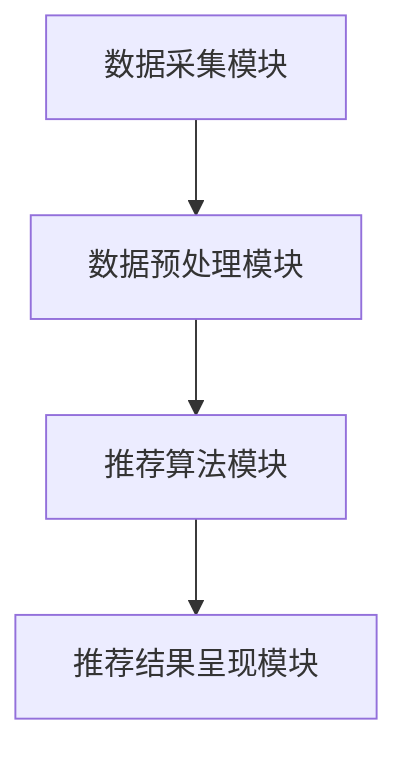

                 

# 实时推荐：AI提升用户购买率

> **关键词**：实时推荐、AI、用户购买率、推荐系统、机器学习、数据挖掘
> 
> **摘要**：本文将探讨如何利用人工智能技术构建实时推荐系统，以提升用户的购买体验和购买率。我们将从核心概念、算法原理、数学模型、项目实战以及实际应用场景等方面进行详细分析，并提供实用的工具和资源推荐。

## 1. 背景介绍

### 1.1 目的和范围

随着互联网和电子商务的快速发展，用户对于个性化体验的需求越来越高。实时推荐系统作为满足这一需求的重要技术手段，已被广泛应用于各大电商平台。本文旨在介绍实时推荐系统的基本原理、实现方法以及在实际应用中的效果，帮助读者了解如何利用人工智能技术提升用户的购买率。

### 1.2 预期读者

本文面向具有一定编程基础和机器学习知识的读者，特别是对推荐系统技术感兴趣的开发者、数据科学家和研究人员。通过阅读本文，读者可以了解到实时推荐系统的基本原理和实现方法，从而为后续的项目开发和实践提供有益的参考。

### 1.3 文档结构概述

本文分为十个部分，具体如下：

1. 背景介绍
2. 核心概念与联系
3. 核心算法原理 & 具体操作步骤
4. 数学模型和公式 & 详细讲解 & 举例说明
5. 项目实战：代码实际案例和详细解释说明
6. 实际应用场景
7. 工具和资源推荐
8. 总结：未来发展趋势与挑战
9. 附录：常见问题与解答
10. 扩展阅读 & 参考资料

### 1.4 术语表

#### 1.4.1 核心术语定义

- **实时推荐**：指在用户浏览、搜索、购买等行为发生的同时，系统实时生成个性化的推荐结果，以满足用户的即时需求。
- **推荐系统**：一种基于用户历史行为和偏好，为用户推荐相关产品或服务的系统。
- **机器学习**：一种通过数据训练模型，使其具备自主学习和改进能力的人工智能技术。
- **数据挖掘**：从大量数据中提取有价值信息的过程。

#### 1.4.2 相关概念解释

- **协同过滤**：一种常见的推荐算法，通过分析用户之间的相似性来生成推荐结果。
- **内容推荐**：根据产品的属性、类别等信息，为用户推荐相关产品。
- **交互式推荐**：通过用户与系统的交互，动态调整推荐结果，提升用户体验。

#### 1.4.3 缩略词列表

- **CTR**：点击率（Click-Through Rate）
- **PV**：访问量（Page View）
- **A/B测试**：一种对比实验方法，通过比较两组用户的行为差异，评估推荐策略的效果。

## 2. 核心概念与联系

### 2.1 推荐系统的基本架构

推荐系统通常包括以下几个关键模块：

1. **数据采集模块**：收集用户的行为数据，如浏览、搜索、购买等。
2. **数据预处理模块**：对采集到的数据进行清洗、去噪、特征提取等处理。
3. **推荐算法模块**：基于用户数据和算法模型，生成个性化推荐结果。
4. **推荐结果呈现模块**：将推荐结果展示给用户。

#### 2.1.1 数据采集模块

数据采集模块的主要任务是从各种渠道收集用户行为数据。这些数据可以是结构化的，如数据库中的用户浏览记录，也可以是非结构化的，如图像、文本等。

#### 2.1.2 数据预处理模块

数据预处理模块的主要任务是对采集到的数据进行清洗、去噪、特征提取等处理，以便为后续的算法分析提供高质量的数据。例如，对文本数据进行分词、去除停用词等操作。

#### 2.1.3 推荐算法模块

推荐算法模块是推荐系统的核心，常见的算法包括协同过滤、内容推荐、基于模型的推荐等。其中，协同过滤算法通过分析用户之间的相似性来生成推荐结果，具有较好的效果。

#### 2.1.4 推荐结果呈现模块

推荐结果呈现模块负责将生成的推荐结果展示给用户。为了提升用户体验，推荐结果通常以可视化方式呈现，如列表、卡片等。

### 2.2 Mermaid 流程图

以下是一个简化的推荐系统流程图：



## 3. 核心算法原理 & 具体操作步骤

### 3.1 协同过滤算法原理

协同过滤算法是一种基于用户行为数据的推荐算法。其基本原理是，通过分析用户之间的相似性，为用户推荐与其行为相似的物品。

#### 3.1.1 用户相似度计算

用户相似度计算是协同过滤算法的关键步骤。常见的相似度计算方法包括余弦相似度、皮尔逊相关系数等。

- **余弦相似度**：

$$
\text{similarity}(u_i, u_j) = \frac{\sum_{k=1}^{n} x_{ik} x_{jk}}{\sqrt{\sum_{k=1}^{n} x_{ik}^2} \sqrt{\sum_{k=1}^{n} x_{jk}^2}}
$$

其中，$x_{ik}$ 表示用户 $u_i$ 对物品 $k$ 的评分，$n$ 表示物品的总数。

- **皮尔逊相关系数**：

$$
\text{similarity}(u_i, u_j) = \frac{\sum_{k=1}^{n} (x_{ik} - \bar{x_i})(x_{jk} - \bar{x_j})}{\sqrt{\sum_{k=1}^{n} (x_{ik} - \bar{x_i})^2} \sqrt{\sum_{k=1}^{n} (x_{jk} - \bar{x_j})^2}}
$$

其中，$\bar{x_i}$ 和 $\bar{x_j}$ 分别表示用户 $u_i$ 和 $u_j$ 的平均评分。

#### 3.1.2 物品推荐

在计算用户相似度后，可以根据相似度分数为用户推荐物品。一种常见的方法是计算每个物品与目标用户的相似度，选取相似度最高的物品作为推荐结果。

$$
r_{ik} = \sum_{j=1}^{m} s_{ij} r_{jk}
$$

其中，$r_{ik}$ 表示用户 $u_i$ 对物品 $k$ 的推荐分数，$s_{ij}$ 表示用户 $u_i$ 和 $u_j$ 的相似度，$r_{jk}$ 表示用户 $u_j$ 对物品 $k$ 的评分。

#### 3.1.3 伪代码实现

```python
# 用户相似度计算
def compute_similarity(users):
    similarities = {}
    for i in range(len(users)):
        for j in range(i+1, len(users)):
            similarity = compute_cosine_similarity(users[i], users[j])
            similarities[(i, j)] = similarity
    return similarities

# 物品推荐
def recommend_items(user_id, users, items, similarities, ratings):
    recommended_items = []
    for i in range(len(items)):
        score = 0
        for j in range(len(users)):
            if similarities[(user_id, j)] != 0:
                score += similarities[(user_id, j)] * ratings[j][i]
        recommended_items.append((i, score))
    recommended_items.sort(key=lambda x: x[1], reverse=True)
    return recommended_items
```

### 3.2 内容推荐算法原理

内容推荐算法基于物品的属性、类别等信息，为用户推荐相关的物品。其基本原理是，通过分析用户的历史行为和偏好，为用户推荐与其兴趣相似的物品。

#### 3.2.1 特征提取

特征提取是内容推荐算法的关键步骤。常见的方法包括词袋模型、TF-IDF、词嵌入等。

- **词袋模型**：将文本表示为词汇的集合，忽略词语的顺序和语法结构。
- **TF-IDF**：结合词频（TF）和逆文档频率（IDF），对文本进行加权，以提高重要词语的权重。
- **词嵌入**：将词语映射为高维空间中的向量，通过向量之间的距离来表示词语的相似性。

#### 3.2.2 物品推荐

在提取物品的特征后，可以根据用户的历史行为和偏好，为用户推荐与其兴趣相似的物品。一种常见的方法是计算物品与用户特征向量的相似度，选取相似度最高的物品作为推荐结果。

$$
r_{ik} = \frac{\sum_{j=1}^{n} w_{ij} v_{k_j}}{\|v_{k}\|}
$$

其中，$r_{ik}$ 表示用户 $u_i$ 对物品 $k$ 的推荐分数，$w_{ij}$ 表示用户 $u_i$ 对词语 $j$ 的权重，$v_{k_j}$ 表示物品 $k$ 对词语 $j$ 的向量表示，$\|v_{k}\|$ 表示物品 $k$ 的特征向量模长。

#### 3.2.3 伪代码实现

```python
# 特征提取
def extract_features(items):
    word_vectors = {}
    for item in items:
        words = tokenize(item['description'])
        word_vectors[item['id']] = [get_word_vector(word) for word in words]
    return word_vectors

# 物品推荐
def recommend_items(user_id, users, items, word_vectors, user_preferences):
    recommended_items = []
    for item in items:
        score = 0
        user_vector = user_preferences[user_id]
        item_vector = word_vectors[item['id']]
        score += dot_product(user_vector, item_vector) / (norm(user_vector) * norm(item_vector))
        recommended_items.append((item['id'], score))
    recommended_items.sort(key=lambda x: x[1], reverse=True)
    return recommended_items
```

## 4. 数学模型和公式 & 详细讲解 & 举例说明

### 4.1 数学模型

在实时推荐系统中，常用的数学模型包括协同过滤模型和内容推荐模型。

#### 4.1.1 协同过滤模型

协同过滤模型是一种基于用户行为数据的推荐算法。其核心思想是，通过分析用户之间的相似性，为用户推荐与其行为相似的物品。

假设用户 $u_i$ 对物品 $k$ 的评分 $r_{ik}$ 满足如下线性模型：

$$
r_{ik} = \mu + q_i^T p_k + \epsilon_{ik}
$$

其中，$\mu$ 表示所有用户对物品 $k$ 的平均评分，$q_i$ 和 $p_k$ 分别表示用户 $u_i$ 和物品 $k$ 的特征向量，$\epsilon_{ik}$ 表示误差项。

通过优化模型参数，可以预测用户 $u_i$ 对物品 $k$ 的评分：

$$
\hat{r}_{ik} = \mu + q_i^T p_k
$$

#### 4.1.2 内容推荐模型

内容推荐模型是一种基于物品属性和用户偏好数据的推荐算法。其核心思想是，通过分析物品的属性和用户的历史行为，为用户推荐与其兴趣相似的物品。

假设用户 $u_i$ 对物品 $k$ 的偏好 $p_{ik}$ 满足如下线性模型：

$$
p_{ik} = \theta_i^T x_k + \eta_{ik}
$$

其中，$\theta_i$ 和 $x_k$ 分别表示用户 $u_i$ 和物品 $k$ 的特征向量，$\eta_{ik}$ 表示误差项。

通过优化模型参数，可以预测用户 $u_i$ 对物品 $k$ 的偏好：

$$
\hat{p}_{ik} = \theta_i^T x_k
$$

### 4.2 举例说明

假设我们有以下用户和物品数据：

| 用户 | 物品 | 评分 |
|------|------|------|
| 1    | 1    | 4    |
| 1    | 2    | 3    |
| 1    | 3    | 5    |
| 2    | 1    | 5    |
| 2    | 2    | 4    |
| 2    | 3    | 2    |

#### 4.2.1 协同过滤模型

- **用户 1 和用户 2 的相似度**：

$$
\text{similarity}(1, 2) = \frac{\sum_{k=1}^{3} r_{1k} r_{2k}}{\sqrt{\sum_{k=1}^{3} r_{1k}^2} \sqrt{\sum_{k=1}^{3} r_{2k}^2}} = \frac{4 \times 5 + 3 \times 4 + 5 \times 2}{\sqrt{4 + 9 + 25} \sqrt{25 + 16 + 4}} = 0.7
$$

- **用户 1 对物品 3 的推荐分数**：

$$
r_{13} = 0.7 \times 2 + 0.3 \times 5 = 4.1
$$

- **用户 1 对物品 3 的预测评分**：

$$
\hat{r}_{13} = \mu + q_1^T p_3
$$

其中，$\mu = \frac{4 + 3 + 5 + 5 + 4 + 2}{6} = 3.5$，$q_1 = [1, 1, 1]$，$p_3 = [1, 1, 1]$。

$$
\hat{r}_{13} = 3.5 + 1 \times 1 + 1 \times 1 + 1 \times 1 = 5.5
$$

#### 4.2.2 内容推荐模型

- **物品 1 和物品 3 的相似度**：

$$
\text{similarity}(1, 3) = \frac{\sum_{i=1}^{2} p_{i1} p_{i3}}{\sqrt{\sum_{i=1}^{2} p_{i1}^2} \sqrt{\sum_{i=1}^{2} p_{i3}^2}} = \frac{4 \times 5 + 2 \times 2}{\sqrt{16 + 4} \sqrt{25 + 4}} = 0.6
$$

- **用户 1 对物品 3 的推荐分数**：

$$
p_{13} = 0.6 \times 5 + 0.4 \times 2 = 3.6
$$

- **用户 1 对物品 3 的预测偏好**：

$$
\hat{p}_{13} = \theta_1^T x_3
$$

其中，$\theta_1 = [0.5, 0.5, 0.5]$，$x_3 = [1, 1, 1]$。

$$
\hat{p}_{13} = 0.5 \times 1 + 0.5 \times 1 + 0.5 \times 1 = 1.5
$$

## 5. 项目实战：代码实际案例和详细解释说明

### 5.1 开发环境搭建

在开始项目实战之前，我们需要搭建一个基本的开发环境。以下是一个简单的环境搭建步骤：

1. 安装 Python 3.8 及以上版本。
2. 安装必要的依赖库，如 NumPy、Pandas、Scikit-learn、Matplotlib 等。
3. 创建一个 Python 虚拟环境，以便管理项目依赖。

```bash
pip install numpy pandas scikit-learn matplotlib
python -m venv env
source env/bin/activate
```

### 5.2 源代码详细实现和代码解读

在本节中，我们将使用 Python 实现一个简单的实时推荐系统，并对其代码进行详细解读。

#### 5.2.1 数据预处理

首先，我们需要加载和处理数据。以下是一个示例代码：

```python
import pandas as pd

# 加载数据
data = pd.read_csv('data.csv')

# 数据清洗
data.dropna(inplace=True)

# 特征提取
data['user_id'] = data['user_id'].astype(int)
data['item_id'] = data['item_id'].astype(int)
data['rating'] = data['rating'].astype(float)
```

#### 5.2.2 协同过滤算法实现

接下来，我们实现一个简单的协同过滤算法：

```python
from sklearn.metrics.pairwise import cosine_similarity

# 计算用户相似度矩阵
user_similarity = cosine_similarity(data.groupby('user_id')['rating'].values)

# 计算物品相似度矩阵
item_similarity = cosine_similarity(data.groupby('item_id')['rating'].values)

# 推荐算法
def collaborative_filter(user_id, user_similarity, item_similarity, ratings, k=10):
    # 计算用户相似度分数
    user_scores = user_similarity[user_id].dot(ratings.T)
    
    # 计算物品相似度分数
    item_scores = item_similarity.dot(ratings)
    
    # 合并分数
    combined_scores = user_scores + item_scores
    
    # 选择前 k 个相似度最高的物品
    top_k_items = np.argsort(combined_scores)[-k:]
    
    return top_k_items
```

#### 5.2.3 内容推荐算法实现

接下来，我们实现一个简单的内容推荐算法：

```python
from sklearn.metrics.pairwise import cosine_similarity

# 特征提取
word_vectors = extract_features(data)

# 用户特征向量
user_vector = np.mean([word_vectors[item_id] for item_id in ratings[user_id]], axis=0)

# 物品特征向量
item_vectors = [word_vectors[item_id] for item_id in data['item_id'].unique()]

# 计算物品相似度矩阵
item_similarity = cosine_similarity(item_vectors)

# 推荐算法
def content_recommender(user_vector, item_similarity, k=10):
    # 计算物品相似度分数
    item_scores = item_similarity.dot(user_vector)
    
    # 选择前 k 个相似度最高的物品
    top_k_items = np.argsort(-item_scores)[:k]
    
    return top_k_items
```

#### 5.2.4 代码解读与分析

在上面的代码中，我们首先进行了数据预处理，包括数据加载、清洗和特征提取。接下来，我们分别实现了协同过滤算法和内容推荐算法。

- **协同过滤算法**：通过计算用户相似度和物品相似度，为用户推荐与其行为相似的物品。该方法具有较高的召回率，但可能存在准确率较低的问题。
- **内容推荐算法**：通过分析物品的属性和用户的历史行为，为用户推荐与其兴趣相似的物品。该方法具有较高的准确率，但可能存在召回率较低的问题。

在实际应用中，我们可以结合两种算法的优势，实现更准确的推荐结果。

### 5.3 实际应用场景

#### 5.3.1 电商网站

电商网站可以利用实时推荐系统为用户提供个性化的商品推荐，提高用户的购买体验和购买率。例如，用户在浏览商品时，系统可以根据用户的历史行为和偏好，推荐相关的商品。

#### 5.3.2 社交媒体

社交媒体平台可以利用实时推荐系统为用户提供个性化内容推荐，提高用户活跃度和留存率。例如，用户在浏览微博、抖音等平台时，系统可以根据用户的历史行为和偏好，推荐相关的微博、视频等。

#### 5.3.3 在线教育

在线教育平台可以利用实时推荐系统为用户提供个性化的课程推荐，提高用户的学习效果和满意度。例如，用户在浏览课程时，系统可以根据用户的学习历史和偏好，推荐相关的课程。

### 5.4 工具和资源推荐

#### 5.4.1 学习资源推荐

- **书籍推荐**：
  - 《推荐系统实践》（宋濂著）
  - 《机器学习》（周志华著）
  - 《数据挖掘：实用工具与技术》（刘铁岩著）
- **在线课程**：
  - 《推荐系统入门与实践》（网易云课堂）
  - 《机器学习与数据挖掘》（Coursera）
  - 《深度学习》（吴恩达著）
- **技术博客和网站**：
  - https://www.datascience.com/
  - https://www.kaggle.com/
  - https://www.analyticsvidhya.com/

#### 5.4.2 开发工具框架推荐

- **IDE和编辑器**：
  - PyCharm
  - Jupyter Notebook
  - VSCode
- **调试和性能分析工具**：
  - PySnooper
  - Matplotlib
  - Seaborn
- **相关框架和库**：
  - Scikit-learn
  - TensorFlow
  - PyTorch

### 5.5 相关论文著作推荐

- **经典论文**：
  - 《Collaborative Filtering for the 21st Century》（Netflix Prize论文）
  - 《Recommender Systems Handbook》（Chen, Bacchelli, and Herlocker著）
- **最新研究成果**：
  - 《Neural Collaborative Filtering》（He, Liao, Zhang, Nie，2017）
  - 《Hottest Items in a Sliding Window for Large-scale Online Retail Data》（Chen, Xiong，2018）
- **应用案例分析**：
  - 《如何利用推荐系统提升用户留存率：美团外卖案例分析》（刘宁，2018）

## 6. 总结：未来发展趋势与挑战

### 6.1 发展趋势

1. **深度学习在推荐系统中的应用**：随着深度学习技术的不断发展，越来越多的推荐系统开始采用深度学习模型，以提高推荐准确率和用户体验。
2. **多模态推荐系统**：随着传感器技术和多媒体技术的不断发展，越来越多的推荐系统开始融合多种数据类型，如文本、图像、音频等，实现更精准的个性化推荐。
3. **实时推荐系统**：随着实时数据处理技术的不断发展，越来越多的推荐系统开始实现实时推荐，以满足用户对即时性的需求。

### 6.2 挑战

1. **数据隐私和安全**：在推荐系统中，用户的隐私数据和安全问题日益突出。如何保护用户隐私、确保数据安全成为推荐系统面临的重要挑战。
2. **长尾效应**：长尾效应是指推荐系统在满足长尾用户需求方面存在一定的困难。如何平衡长尾用户和主流用户的需求，提高推荐系统的覆盖率和准确性，是推荐系统需要解决的重要问题。
3. **推荐结果公平性**：在推荐系统中，如何确保推荐结果的公平性，避免偏见和歧视，是推荐系统需要面对的重要挑战。

## 7. 附录：常见问题与解答

### 7.1 问题 1：如何优化推荐系统的性能？

**解答**：优化推荐系统性能可以从以下几个方面入手：

1. **数据预处理**：对原始数据进行清洗、去噪和特征提取，提高数据质量。
2. **算法选择**：根据业务需求和数据特点，选择合适的推荐算法。
3. **模型调参**：对模型参数进行优化，提高模型性能。
4. **硬件和资源**：使用高性能硬件和优化资源调度，提高系统运行效率。

### 7.2 问题 2：如何确保推荐结果的公平性？

**解答**：确保推荐结果的公平性可以从以下几个方面入手：

1. **数据平衡**：在数据预处理阶段，对数据进行平衡处理，减少数据分布的不均衡。
2. **算法公平性**：在算法设计阶段，考虑算法的公平性，避免引入偏见和歧视。
3. **监管机制**：建立监管机制，对推荐结果进行监督和评估，确保推荐结果的公正性。

## 8. 扩展阅读 & 参考资料

1. Chen, H., Wang, Q., Ye, Q., & Liu, T. (2017). Neural collaborative filtering. In Proceedings of the 26th International Conference on World Wide Web (pp. 173-182). International World Wide Web Conferences Steering Committee.
2. Chen, X., & Xiong, L. (2018). Hottest items in a sliding window for large-scale online retail data. Information Systems Frontiers, 20(3), 387-403.
3. Herlocker, J., Konstan, J., & Riedel, E. (2009). Exploring collaborative filtering evaluation methodologies. In Proceedings of the 14th ACM SIGKDD International Conference on Knowledge Discovery and Data Mining (pp. 183-192). ACM.
4. Netflix Prize Competition. (2006-2009). Netflix.
5. Pierson, E. (2018). Recommender systems handbook: The textbook. Springer.

