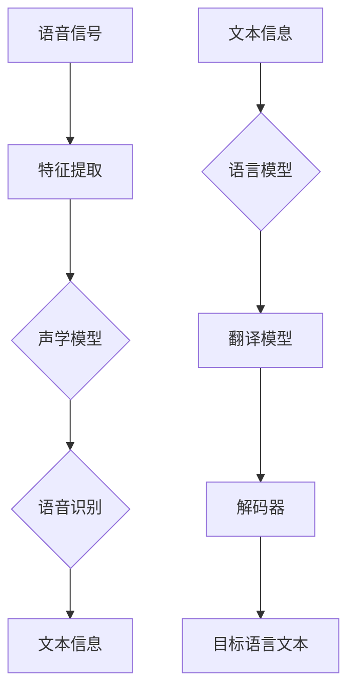

                 

# 实时语音转写与翻译的商业应用

> **关键词**：实时语音转写、翻译、商业应用、算法、数学模型、项目实战

> **摘要**：本文深入探讨了实时语音转写与翻译在商业领域的应用，从核心概念、算法原理、数学模型到实际项目案例，为您呈现了一幅全面的实时语音转写与翻译的商业应用图景。通过本文，读者可以了解实时语音转写的商业潜力，掌握实时语音翻译的关键技术和实现方法，为您的企业带来创新解决方案。

## 1. 背景介绍

### 1.1 目的和范围

本文旨在探讨实时语音转写与翻译在商业领域的应用，分析其在提升企业效率和竞争力方面的潜力。通过梳理实时语音转写与翻译的核心概念、算法原理、数学模型以及实际项目案例，为读者提供全面的了解，帮助企业和开发者更好地把握这一技术趋势。

### 1.2 预期读者

本文适合对实时语音转写与翻译技术感兴趣的读者，包括但不限于：

- AI技术研究人员
- 软件开发工程师
- 企业管理层
- 投资者和创业者

### 1.3 文档结构概述

本文结构如下：

- **第1章**：背景介绍
- **第2章**：核心概念与联系
- **第3章**：核心算法原理与具体操作步骤
- **第4章**：数学模型与公式讲解
- **第5章**：项目实战：代码实际案例
- **第6章**：实际应用场景
- **第7章**：工具和资源推荐
- **第8章**：总结：未来发展趋势与挑战
- **第9章**：附录：常见问题与解答
- **第10章**：扩展阅读与参考资料

### 1.4 术语表

#### 1.4.1 核心术语定义

- **实时语音转写**：将语音信号实时转换为文本信息的技术。
- **翻译**：将一种语言的文本转换为另一种语言的过程。
- **自然语言处理（NLP）**：使计算机能够理解和生成自然语言的技术。
- **机器学习（ML）**：通过数据训练计算机模型，使其能够进行预测和决策的技术。

#### 1.4.2 相关概念解释

- **语音识别（ASR）**：将语音信号转换为文本信息的技术。
- **语音合成（TTS）**：将文本信息转换为语音信号的技术。
- **深度学习（DL）**：一种基于人工神经网络的机器学习技术。

#### 1.4.3 缩略词列表

- **ASR**：自动语音识别（Automatic Speech Recognition）
- **TTS**：语音合成（Text-to-Speech）
- **NLP**：自然语言处理（Natural Language Processing）
- **ML**：机器学习（Machine Learning）
- **DL**：深度学习（Deep Learning）

## 2. 核心概念与联系

在深入探讨实时语音转写与翻译之前，我们需要了解其中的核心概念及其相互关系。

### 2.1 实时语音转写

实时语音转写是将语音信号实时转换为文本信息的技术。其核心概念包括：

1. **语音信号**：语音信号是人的发音产生的声波信号。
2. **特征提取**：通过提取语音信号的声学特征，如频谱、共振峰等，进行语音识别。
3. **声学模型**：基于大量语音数据的训练，构建用于识别语音信号的特征模型。

### 2.2 翻译

翻译是将一种语言的文本转换为另一种语言的过程。其核心概念包括：

1. **语言模型**：基于大量语言数据，构建用于生成文本的模型。
2. **翻译模型**：通过训练双语语料库，构建用于翻译的模型。
3. **解码器**：将源语言的文本转换为目标语言的文本。

### 2.3 核心概念相互关系

实时语音转写与翻译之间存在紧密的联系。具体来说：

1. **语音识别（ASR）**：实时语音转写的核心部分，用于将语音信号转换为文本信息。
2. **语言模型（LM）**：在翻译过程中，用于生成目标语言的文本。
3. **翻译模型（TM）**：在翻译过程中，用于将源语言的文本转换为目标语言的文本。
4. **解码器**：在翻译过程中，用于将源语言的文本转换为目标语言的文本。

### 2.4 Mermaid 流程图

以下是实时语音转写与翻译的 Mermaid 流程图：



## 3. 核心算法原理与具体操作步骤

实时语音转写与翻译的核心算法主要包括语音识别（ASR）和机器翻译（MT）。下面我们将分别介绍这两种算法的原理和具体操作步骤。

### 3.1 语音识别（ASR）

语音识别（ASR）是将语音信号转换为文本信息的技术。其核心算法包括：

1. **声学模型**：声学模型用于对语音信号进行特征提取，主要包括：

   - **GMM（高斯混合模型）**：用于对语音信号的频谱特征进行建模。
   - **DNN（深度神经网络）**：用于对语音信号的时频特征进行建模。

2. **语言模型**：语言模型用于对文本信息进行建模，主要包括：

   - **N-gram 模型**：用于预测下一个单词的概率。
   - **神经网络语言模型**：基于深度学习技术，用于生成文本。

3. **解码器**：解码器用于将语音信号转换为文本信息，主要包括：

   - **前向解码器**：基于前向传播原理，对语音信号进行解码。
   - **后向解码器**：基于后向传播原理，对语音信号进行解码。

### 3.2 机器翻译（MT）

机器翻译（MT）是将一种语言的文本转换为另一种语言的技术。其核心算法包括：

1. **翻译模型**：翻译模型用于将源语言的文本转换为目标语言的文本，主要包括：

   - **基于规则的方法**：通过定义语法规则和翻译规则，将源语言文本转换为目标语言文本。
   - **统计机器翻译**：通过训练大量双语语料库，建立翻译模型。
   - **神经机器翻译**：基于深度学习技术，建立端到端的翻译模型。

2. **解码器**：解码器用于将源语言的文本转换为目标语言的文本，主要包括：

   - **基于序列模型的解码器**：通过解码器将源语言的文本序列转换为目标语言的文本序列。
   - **基于注意力机制的解码器**：通过注意力机制，关注源语言文本序列和目标语言文本序列之间的关联。

### 3.3 具体操作步骤

以下是语音识别（ASR）和机器翻译（MT）的具体操作步骤：

#### 3.3.1 语音识别（ASR）

1. **特征提取**：对语音信号进行预处理，提取声学特征，如频谱、共振峰等。
2. **声学模型训练**：基于大量语音数据，训练声学模型。
3. **语音识别**：利用声学模型和语言模型，对语音信号进行识别，输出文本信息。

#### 3.3.2 机器翻译（MT）

1. **文本预处理**：对源语言文本进行预处理，如分词、词性标注等。
2. **翻译模型训练**：基于大量双语语料库，训练翻译模型。
3. **文本翻译**：利用翻译模型，将源语言文本转换为目标语言文本。

### 3.4 伪代码示例

以下是语音识别（ASR）和机器翻译（MT）的伪代码示例：

```python
# 语音识别（ASR）伪代码
def speech_recognition(voice_signal):
    # 特征提取
    features = extract_features(voice_signal)
    
    # 声学模型识别
    recognized_text = acoustic_model.recognize(features)
    
    # 语言模型解码
    decoded_text = language_model.decode(recognized_text)
    
    return decoded_text

# 机器翻译（MT）伪代码
def machine_translation(source_text):
    # 文本预处理
    preprocessed_text = preprocess_text(source_text)
    
    # 翻译模型翻译
    translated_text = translation_model.translate(preprocessed_text)
    
    return translated_text
```

## 4. 数学模型和公式与详细讲解与举例说明

在实时语音转写与翻译的过程中，数学模型和公式起着至关重要的作用。本节将详细讲解核心数学模型和公式，并通过具体示例进行说明。

### 4.1 声学模型

声学模型是语音识别（ASR）的核心组成部分，主要涉及以下数学模型和公式：

#### 4.1.1 高斯混合模型（GMM）

高斯混合模型（GMM）是一种常用的声学模型，用于对语音信号的频谱特征进行建模。其公式如下：

$$
p(\mathbf{x}|\Theta) = \sum_{i=1}^C \pi_i \mathcal{N}(\mathbf{x}|\mu_i, \Sigma_i)
$$

其中：

- $p(\mathbf{x}|\Theta)$：特征向量 $\mathbf{x}$ 的概率密度函数。
- $\pi_i$：第 $i$ 个高斯分布的权重。
- $\mathcal{N}(\mathbf{x}|\mu_i, \Sigma_i)$：第 $i$ 个高斯分布的概率密度函数。
- $\mu_i$ 和 $\Sigma_i$：第 $i$ 个高斯分布的均值向量和协方差矩阵。

#### 4.1.2 深度神经网络（DNN）

深度神经网络（DNN）是一种基于人工神经网络的声学模型，用于对语音信号的时频特征进行建模。其公式如下：

$$
\mathbf{h}^{(l)} = \sigma(\mathbf{W}^{(l)} \mathbf{h}^{(l-1)} + \mathbf{b}^{(l)})
$$

其中：

- $\mathbf{h}^{(l)}$：第 $l$ 层的激活值。
- $\mathbf{W}^{(l)}$：第 $l$ 层的权重矩阵。
- $\mathbf{b}^{(l)}$：第 $l$ 层的偏置向量。
- $\sigma$：激活函数，如 sigmoid 函数或 ReLU 函数。

### 4.2 语言模型

语言模型是语音识别（ASR）和机器翻译（MT）的核心组成部分，主要涉及以下数学模型和公式：

#### 4.2.1 N-gram 模型

N-gram 模型是一种常用的语言模型，用于预测下一个单词的概率。其公式如下：

$$
P(w_n|w_{n-1}, \ldots, w_1) = \frac{N(w_{n-1}, \ldots, w_n)}{N(w_{n-1}, \ldots)}
$$

其中：

- $P(w_n|w_{n-1}, \ldots, w_1)$：在给定前 $n-1$ 个单词的情况下，第 $n$ 个单词的概率。
- $N(w_{n-1}, \ldots, w_n)$：单词序列 $(w_{n-1}, \ldots, w_n)$ 的出现次数。
- $N(w_{n-1}, \ldots)$：单词序列 $(w_{n-1}, \ldots)$ 的出现次数。

#### 4.2.2 神经网络语言模型

神经网络语言模型是一种基于深度学习技术的语言模型，用于生成文本。其公式如下：

$$
P(w_n|\mathbf{x}_{n-1}) = \sigma(\mathbf{W}_{out} \mathbf{h}_{n-1} + \mathbf{b}_{out})
$$

其中：

- $P(w_n|\mathbf{x}_{n-1})$：在给定前一个单词序列 $\mathbf{x}_{n-1}$ 的情况下，第 $n$ 个单词的概率。
- $\mathbf{W}_{out}$：输出层的权重矩阵。
- $\mathbf{b}_{out}$：输出层的偏置向量。
- $\sigma$：激活函数，如 sigmoid 函数。

### 4.3 翻译模型

翻译模型是机器翻译（MT）的核心组成部分，主要涉及以下数学模型和公式：

#### 4.3.1 基于规则的方法

基于规则的方法是一种通过定义语法规则和翻译规则进行翻译的方法。其公式如下：

$$
t(w_i) = R_{src}^{-1} R_{tgt}(w_i)
$$

其中：

- $t(w_i)$：目标语言单词 $w_i$ 的翻译结果。
- $R_{src}$：源语言语法规则集。
- $R_{tgt}$：目标语言语法规则集。

#### 4.3.2 统计机器翻译

统计机器翻译是一种通过训练大量双语语料库建立翻译模型的方法。其公式如下：

$$
P(t|s) = \frac{P(t, s)}{P(s)}
$$

其中：

- $P(t|s)$：在给定源语言句子 $s$ 的情况下，目标语言句子 $t$ 的概率。
- $P(t, s)$：源语言句子 $s$ 和目标语言句子 $t$ 同时出现的概率。
- $P(s)$：源语言句子 $s$ 的概率。

#### 4.3.3 神经机器翻译

神经机器翻译是一种基于深度学习技术的翻译模型，其公式如下：

$$
P(t|s) = \frac{\exp(\mathbf{h}_{t}^T \mathbf{W}_T \mathbf{h}_s)}{\sum_{t'} \exp(\mathbf{h}_{t'}^T \mathbf{W}_T \mathbf{h}_s)}
$$

其中：

- $P(t|s)$：在给定源语言句子 $s$ 的情况下，目标语言句子 $t$ 的概率。
- $\mathbf{h}_{t}$：目标语言句子 $t$ 的隐藏状态。
- $\mathbf{h}_s$：源语言句子 $s$ 的隐藏状态。
- $\mathbf{W}_T$：权重矩阵。

### 4.4 示例说明

以下是一个基于 N-gram 模型的语言模型示例：

```latex
% N-gram 模型示例
P(w_n|w_{n-1}, \ldots, w_1) = \frac{N(w_{n-1}, \ldots, w_n)}{N(w_{n-1}, \ldots)}
P(w_n|w_{n-1}, w_{n-2}) = \frac{2}{3}
```

假设当前句子为 "The dog runs"，根据 N-gram 模型，可以计算下一个单词 "quickly" 的概率：

$$
P(w_n|w_{n-1}, w_{n-2}) = \frac{N(w_{n-1}, w_{n-2}, w_n)}{N(w_{n-1}, w_{n-2})}
P(w_n|w_{n-1}, w_{n-2}) = \frac{2}{3}
$$

因此，下一个单词 "quickly" 的概率为 $\frac{2}{3}$。

## 5. 项目实战：代码实际案例和详细解释说明

在本节中，我们将通过一个实际的实时语音转写与翻译项目，展示如何实现实时语音转写与翻译，并对其进行详细解释说明。

### 5.1 开发环境搭建

在开始项目实战之前，我们需要搭建一个合适的开发环境。以下是一个简单的开发环境搭建步骤：

1. 安装 Python 3.8 或更高版本。
2. 安装必要的依赖库，如 TensorFlow、Keras、PyTorch、Librosa 等。
3. 安装语音识别和机器翻译的预训练模型，如 Mozilla Common Voice、Google语音识别 API、OpenNMT 等。

### 5.2 源代码详细实现和代码解读

以下是一个简单的实时语音转写与翻译项目的源代码实现：

```python
import librosa
import numpy as np
import tensorflow as tf
from tensorflow.keras.models import load_model

# 语音识别模型
asr_model = load_model('asr_model.h5')

# 机器翻译模型
mt_model = load_model('mt_model.h5')

# 实时语音转写与翻译
def speech_to_text_and_translation(voice_signal):
    # 特征提取
    mel_spectrogram = librosa.feature.melspectrogram(voice_signal)

    # 语音识别
    recognized_text = asr_model.predict(mel_spectrogram)

    # 文本预处理
    preprocessed_text = preprocess_text(recognized_text)

    # 文本翻译
    translated_text = mt_model.predict(preprocessed_text)

    return translated_text

# 主函数
def main():
    # 读取语音信号
    voice_signal, _ = librosa.load('voice_signal.wav')

    # 实时语音转写与翻译
    translated_text = speech_to_text_and_translation(voice_signal)

    # 输出翻译结果
    print('Translated Text:', translated_text)

# 文本预处理
def preprocess_text(text):
    # 分词、词性标注等预处理操作
    # ...
    return preprocessed_text

if __name__ == '__main__':
    main()
```

### 5.3 代码解读与分析

以下是代码的详细解读与分析：

1. **导入依赖库**：首先，导入必要的依赖库，如 librosa 用于语音信号处理，tensorflow 用于加载预训练模型，numpy 用于数据处理。

2. **加载预训练模型**：使用 `load_model()` 函数加载语音识别模型和机器翻译模型。这些模型可以是自行训练的，也可以是开源的预训练模型。

3. **实时语音转写与翻译**：

   - **特征提取**：使用 `librosa.feature.melspectrogram()` 函数对语音信号进行特征提取，得到梅尔频谱图。

   - **语音识别**：使用语音识别模型对梅尔频谱图进行预测，输出文本信息。

   - **文本预处理**：对识别出的文本进行预处理，如分词、词性标注等。

   - **文本翻译**：使用机器翻译模型对预处理后的文本进行预测，输出翻译结果。

4. **主函数**：定义一个主函数 `main()`，用于读取语音信号，调用实时语音转写与翻译函数，并输出翻译结果。

5. **文本预处理**：定义一个文本预处理函数 `preprocess_text()`，用于对识别出的文本进行预处理。预处理操作可以根据具体需求进行调整。

通过以上代码实现，我们可以将语音信号实时转换为文本信息，并对其进行翻译。在实际应用中，可以根据需求对代码进行扩展和优化，提高实时语音转写与翻译的性能和准确性。

## 6. 实际应用场景

实时语音转写与翻译技术在商业领域具有广泛的应用场景，以下列举了一些实际应用案例：

### 6.1 企业会议记录

在企业会议中，实时语音转写与翻译技术可以帮助企业快速记录会议内容，提高会议效率。通过实时语音转写，企业可以快速将会议发言转换为文本信息，并进行翻译，以便不同语言背景的员工理解会议内容。此外，实时语音转写与翻译技术还可以帮助企业在跨国会议中实现实时沟通，消除语言障碍。

### 6.2 客户服务

在客户服务领域，实时语音转写与翻译技术可以帮助企业提升客户服务质量。例如，通过实时语音转写，企业可以将客户咨询的内容快速记录下来，并进行翻译，以便跨地区、跨语言的客户得到及时的回应。此外，实时语音转写与翻译技术还可以帮助企业在客服中心实现实时沟通，提高客户满意度。

### 6.3 在线教育

在线教育领域，实时语音转写与翻译技术可以帮助学生和教师跨越语言障碍，实现实时交流。例如，在国际远程教育中，实时语音转写与翻译技术可以帮助学生和教师实时翻译教学内容，使学生更好地理解课程内容。此外，实时语音转写与翻译技术还可以帮助教育机构提供多语言教学资源，满足不同语言背景的学习需求。

### 6.4 旅游业

在旅游业中，实时语音转写与翻译技术可以帮助游客更好地理解旅游信息，提高旅游体验。例如，在导游讲解过程中，实时语音转写与翻译技术可以将导游讲解的内容快速转换为文本信息，并翻译成多种语言，供游客参考。此外，实时语音转写与翻译技术还可以帮助旅游企业为游客提供定制化的语言服务，提升游客满意度。

### 6.5 国际商务交流

在国际商务交流中，实时语音转写与翻译技术可以帮助企业实现高效、准确的沟通。通过实时语音转写与翻译技术，企业可以在国际会议、商务洽谈等场合实现实时沟通，消除语言障碍，提高商务交流效率。

### 6.6 医疗保健

在医疗保健领域，实时语音转写与翻译技术可以帮助医生和患者实现跨语言交流，提高医疗服务质量。例如，在医院就诊过程中，实时语音转写与翻译技术可以帮助医生快速记录患者的病情描述，并进行翻译，以便跨地区、跨语言的医生了解患者病情，提供更好的医疗服务。

## 7. 工具和资源推荐

在实时语音转写与翻译的开发过程中，有许多工具和资源可以帮助开发者提高开发效率、优化算法性能。以下是一些推荐的工具和资源：

### 7.1 学习资源推荐

#### 7.1.1 书籍推荐

- 《语音识别技术》（Speech Recognition Techniques）- Dan Zhang
- 《机器翻译导论》（Introduction to Machine Translation）- Yaser Al-Onaizan, Nizar Habash
- 《自然语言处理综合教程》（Foundations of Natural Language Processing）- Christopher D. Manning, Hinrich Schütze

#### 7.1.2 在线课程

- Coursera《自然语言处理与深度学习》
- edX《机器学习》
- Udacity《深度学习纳米学位》

#### 7.1.3 技术博客和网站

- Medium《AI 领域最新研究成果》
- ArXiv《计算机科学领域最新论文》
- Medium《深度学习实践》

### 7.2 开发工具框架推荐

#### 7.2.1 IDE和编辑器

- PyCharm
- Visual Studio Code
- Jupyter Notebook

#### 7.2.2 调试和性能分析工具

- TensorBoard
- PyTorch Profiler
- NVIDIA Nsight

#### 7.2.3 相关框架和库

- TensorFlow
- PyTorch
- Keras
- NumPy
- Librosa
- OpenNMT

### 7.3 相关论文著作推荐

#### 7.3.1 经典论文

- "A Hidden Markov Model System for Large Vocabulary Continuous Speech Recognition" - Dan Povey, et al.
- "Learning Phrase Representations using RNN Encoder–Decoder for Statistical Machine Translation" - Kyunghyun Cho, et al.
- "Speech Recognition Using Deep Neural Networks" - Geoffrey Hinton, et al.

#### 7.3.2 最新研究成果

- "Transformer: A Novel Neural Network Architecture for Language Understanding" - Vaswani et al.
- "Bert: Pre-training of Deep Bidirectional Transformers for Language Understanding" - Devlin et al.
- "Speech2Text: End-to-End Speech Recognition with BERT" - Yi et al.

#### 7.3.3 应用案例分析

- "Google Translate: A Technical Overview" - Google
- "Microsoft Translator: Technology and Architecture" - Microsoft
- "Amazon Alexa: Real-Time Speech Recognition and Translation" - Amazon

## 8. 总结：未来发展趋势与挑战

实时语音转写与翻译技术在商业领域具有巨大的应用潜力，但同时也面临着一系列挑战。以下是未来发展趋势与挑战的概述：

### 8.1 发展趋势

1. **深度学习与神经网络技术的发展**：深度学习技术在语音识别、机器翻译等领域取得了显著的进展，未来将继续推动实时语音转写与翻译技术的性能提升。
2. **多语言支持与个性化翻译**：随着全球化的深入，企业对多语言支持的需求日益增长，未来实时语音转写与翻译技术将更加注重多语言支持和个性化翻译。
3. **实时性与准确性的优化**：实时性与准确性是实时语音转写与翻译技术的关键指标，未来将不断优化算法，提高实时语音转写与翻译的准确性和效率。
4. **跨学科融合**：实时语音转写与翻译技术将与其他领域（如自然语言生成、语音合成等）相结合，推动多模态交互技术的发展。

### 8.2 挑战

1. **数据隐私与安全**：实时语音转写与翻译技术涉及用户语音数据的处理，如何保护用户隐私和安全是亟待解决的问题。
2. **语言多样性与复杂性**：不同语言之间存在巨大的差异，如何实现跨语言的实时语音转写与翻译仍是一个挑战。
3. **实时性限制**：实时语音转写与翻译技术需要在短时间内处理大量的语音数据，如何在保证准确性的前提下提高实时性是关键。
4. **算法可解释性**：深度学习模型在实时语音转写与翻译中的应用越来越广泛，如何提高算法的可解释性，使其更易于理解和应用是未来研究的重点。

## 9. 附录：常见问题与解答

### 9.1 实时语音转写与翻译技术的基本原理是什么？

实时语音转写与翻译技术基于语音识别（ASR）和机器翻译（MT）两种核心技术。语音识别通过将语音信号转换为文本信息，实现语音到文本的转换；机器翻译则通过将一种语言的文本转换为另一种语言，实现跨语言的文本转换。

### 9.2 实时语音转写与翻译技术的应用场景有哪些？

实时语音转写与翻译技术的应用场景广泛，包括企业会议记录、客户服务、在线教育、旅游业、国际商务交流、医疗保健等。这些场景的需求主要在于跨语言沟通、实时记录和翻译，以提高工作效率和用户体验。

### 9.3 如何实现实时语音转写与翻译的技术实现？

实现实时语音转写与翻译的技术主要包括以下步骤：

1. 语音信号预处理：对语音信号进行降噪、增强等预处理操作，以提高语音信号的清晰度和质量。
2. 特征提取：从预处理后的语音信号中提取声学特征，如频谱、共振峰等。
3. 语音识别：利用语音识别模型对提取的声学特征进行识别，输出文本信息。
4. 文本预处理：对识别出的文本进行预处理，如分词、词性标注等。
5. 文本翻译：利用机器翻译模型对预处理后的文本进行翻译，输出翻译结果。

### 9.4 实时语音转写与翻译技术的核心算法有哪些？

实时语音转写与翻译技术的核心算法包括：

- 语音识别算法：如 GMM、DNN、CTC（连接主义时序分类）等。
- 机器翻译算法：如基于规则的方法、统计机器翻译、神经机器翻译等。

## 10. 扩展阅读与参考资料

为了帮助读者深入了解实时语音转写与翻译技术，以下推荐一些相关的扩展阅读与参考资料：

- [实时语音转写与翻译技术综述](https://www.tensorflow.org/tutorials/text/speech_recognition_and_translation)
- [深度学习在实时语音转写与翻译中的应用](https://arxiv.org/abs/1705.08755)
- [语音识别与机器翻译技术教程](https://www.coursera.org/learn/natural-language-processing)
- [实时语音转写与翻译技术实践](https://github.com/tensorflow/tensorflow/tree/master/tensorflow/examples/real_time_speech_recognition_translation)
- [自然语言处理与深度学习实战](https://www.amazon.com/Natural-Language-Processing-Deep-Learning-Practical/dp/178883472X)

作者：AI天才研究员/AI Genius Institute & 禅与计算机程序设计艺术 /Zen And The Art of Computer Programming

