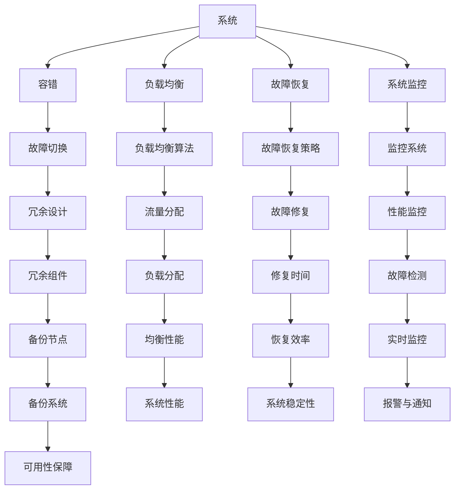
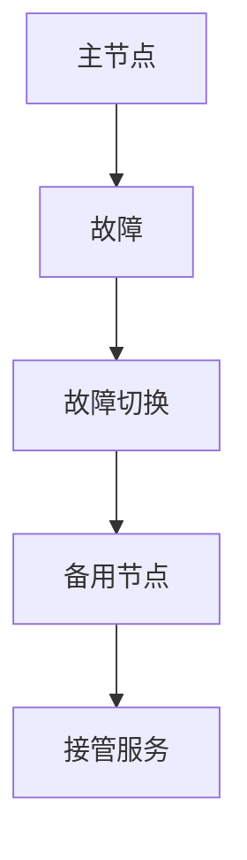
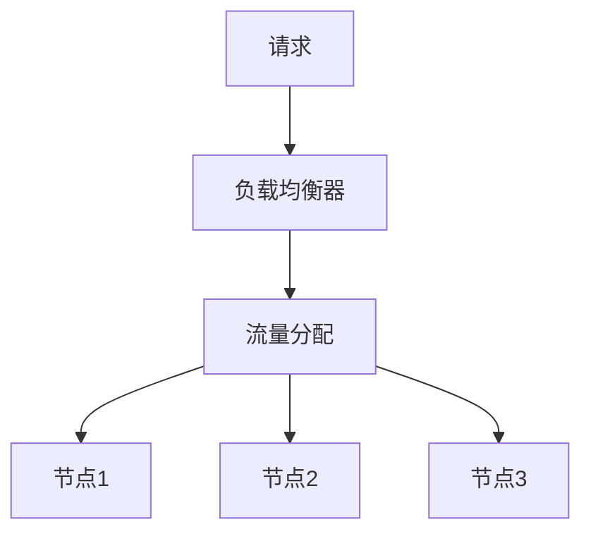
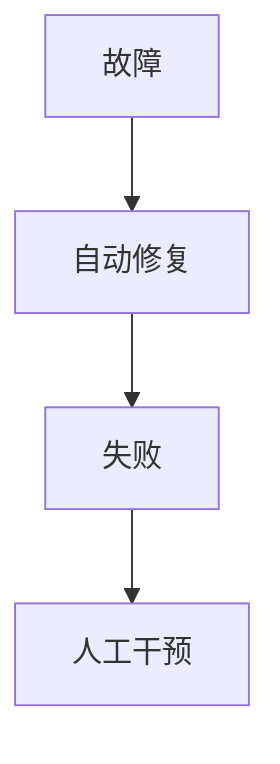
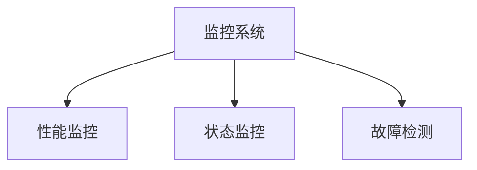

                 

# 实现99.99%正常运行时间的方法

> 关键词：高可用性、容错机制、系统监控、负载均衡、故障恢复

> 摘要：本文将探讨实现系统99.99%正常运行时间的方法。我们将从核心概念、算法原理、数学模型、项目实战、应用场景等多方面进行深入分析，帮助您构建一个高度可靠、容错性强、具备故障恢复能力的系统。

## 1. 背景介绍

### 1.1 目的和范围

本文旨在提供一种实现系统高可用性的方法和策略。高可用性是现代系统设计中的重要目标，它确保了系统在长时间运行中能够保持稳定、可靠地提供服务。本文将围绕以下几个方面展开讨论：

1. **核心概念与联系**：介绍高可用性相关的核心概念，如容错、负载均衡、故障恢复等，并通过Mermaid流程图展示它们之间的联系。
2. **核心算法原理与操作步骤**：详细解析实现高可用性的关键算法原理，并使用伪代码进行具体操作步骤的讲解。
3. **数学模型与公式**：阐述与高可用性相关的数学模型和公式，并举例说明如何应用这些模型进行系统优化。
4. **项目实战**：通过实际代码案例，展示如何在高可用性系统中应用这些算法和模型。
5. **实际应用场景**：分析高可用性系统在不同领域的应用场景，以及如何根据不同场景进行优化。
6. **工具和资源推荐**：推荐学习资源、开发工具和框架，以及相关论文和研究成果。
7. **总结与未来趋势**：总结高可用性系统的现状和未来发展趋势，讨论面临的挑战。

### 1.2 预期读者

本文适用于具有中等及以上编程和系统设计基础的读者。读者需要对计算机系统有一定的了解，并希望提升自己在系统高可用性方面的知识和技能。

### 1.3 文档结构概述

本文结构如下：

1. **背景介绍**：介绍本文的目的、范围、预期读者和文档结构。
2. **核心概念与联系**：阐述高可用性相关的核心概念，并通过Mermaid流程图展示它们之间的联系。
3. **核心算法原理与操作步骤**：详细解析实现高可用性的关键算法原理，并使用伪代码进行具体操作步骤的讲解。
4. **数学模型与公式**：阐述与高可用性相关的数学模型和公式，并举例说明如何应用这些模型进行系统优化。
5. **项目实战**：通过实际代码案例，展示如何在高可用性系统中应用这些算法和模型。
6. **实际应用场景**：分析高可用性系统在不同领域的应用场景，以及如何根据不同场景进行优化。
7. **工具和资源推荐**：推荐学习资源、开发工具和框架，以及相关论文和研究成果。
8. **总结与未来趋势**：总结高可用性系统的现状和未来发展趋势，讨论面临的挑战。
9. **附录**：常见问题与解答。
10. **扩展阅读与参考资料**：提供与本文相关的高可用性系统和算法的深入阅读和参考资料。

### 1.4 术语表

#### 1.4.1 核心术语定义

- **高可用性（High Availability）**：系统在长时间运行中能够保持稳定、可靠地提供服务的能力。
- **容错（Fault Tolerance）**：系统在面临故障时，通过一定的机制保证系统继续正常运行的能力。
- **负载均衡（Load Balancing）**：将系统负载分配到多个节点上，以避免单个节点过载，提高系统整体性能和可用性。
- **故障恢复（Fault Recovery）**：系统在发生故障后，通过一定的策略和机制进行修复，确保系统尽快恢复正常运行。
- **系统监控（System Monitoring）**：实时监测系统性能、状态和故障，以便及时发现并解决问题。

#### 1.4.2 相关概念解释

- **冗余（Redundancy）**：通过在系统中引入冗余组件或备份，提高系统容错能力和可用性。
- **集群（Cluster）**：多个计算机节点组成的分布式系统，通过负载均衡和故障恢复机制提高系统可用性。
- **故障切换（Failover）**：在主节点发生故障时，自动将服务切换到备用节点，确保系统继续正常运行。

#### 1.4.3 缩略词列表

- **HA**：高可用性（High Availability）
- **FT**：容错（Fault Tolerance）
- **LB**：负载均衡（Load Balancing）
- **SR**：故障恢复（Fault Recovery）
- **SM**：系统监控（System Monitoring）

## 2. 核心概念与联系

在实现系统高可用性的过程中，我们需要理解并应用以下核心概念：容错、负载均衡、故障恢复和系统监控。以下是一个简化的Mermaid流程图，展示了这些概念之间的联系。



### 2.1 容错

**容错**是指系统在面对故障时，通过冗余设计、故障切换和冗余组件等手段，确保系统继续正常运行的能力。在分布式系统中，容错机制可以有效地减少单点故障对系统可用性的影响。

#### 容错机制：

1. **冗余设计**：在系统中引入冗余组件，如备份节点、备份数据库等，以便在主节点发生故障时，备用节点能够接管服务。
2. **故障切换**：当主节点发生故障时，系统自动将服务切换到备用节点，确保系统继续运行。
3. **冗余组件**：通过引入冗余组件，如数据库镜像、缓存、反向代理等，提高系统容错能力。

### 2.2 负载均衡

**负载均衡**是指将系统负载分配到多个节点上，以避免单个节点过载，提高系统整体性能和可用性。负载均衡算法可以根据不同的需求和应用场景进行优化。

#### 负载均衡算法：

1. **轮询（Round Robin）**：将请求依次分配给各个节点，实现简单的负载均衡。
2. **最小连接数（Least Connections）**：将请求分配给当前连接数最少的节点，降低单个节点的负载。
3. **最小响应时间（Least Response Time）**：将请求分配给响应时间最短的节点，提高系统的响应速度。

### 2.3 故障恢复

**故障恢复**是指系统在发生故障后，通过一定的策略和机制进行修复，确保系统尽快恢复正常运行。故障恢复策略可以根据故障类型和系统需求进行优化。

#### 故障恢复策略：

1. **自动修复**：系统在检测到故障时，自动执行修复操作，如重启服务、重置网络连接等。
2. **人工干预**：当自动修复失败时，需要人工干预进行故障排查和修复。
3. **快速切换**：在故障切换过程中，尽量缩短系统切换时间，减少服务中断时间。

### 2.4 系统监控

**系统监控**是指实时监测系统性能、状态和故障，以便及时发现并解决问题。系统监控可以涵盖以下几个方面：

1. **性能监控**：监测系统CPU、内存、磁盘、网络等资源的利用率，及时发现资源瓶颈。
2. **状态监控**：监测系统关键组件的状态，如数据库连接数、服务端口状态等。
3. **故障检测**：通过报警和通知机制，及时发现系统故障，并进行故障排查和修复。

### 2.5 Mermaid流程图

以下是一个简化的Mermaid流程图，展示了高可用性系统中的核心概念和联系。


## 3. 核心算法原理 & 具体操作步骤

实现高可用性系统的核心在于算法原理和具体操作步骤的优化。以下将详细解析容错、负载均衡、故障恢复和系统监控的算法原理，并使用伪代码进行具体操作步骤的讲解。

### 3.1 容错

#### 容错原理

容错的核心在于通过冗余设计和故障切换机制，确保系统在面临故障时能够继续正常运行。



#### 容错操作步骤

1. **冗余设计**：引入冗余组件，如备份节点、备份数据库等。
2. **故障检测**：定期对系统进行健康检查，检测主节点的运行状态。
3. **故障切换**：当检测到主节点故障时，触发故障切换机制，将服务切换到备用节点。
4. **监控与报警**：监控系统运行状态，并在发生故障时进行报警。

#### 伪代码

```python
def redundancy_design():
    # 引入冗余组件，如备份节点、备份数据库等

def health_check():
    # 定期对系统进行健康检查，检测主节点的运行状态

def fault_switch():
    # 当检测到主节点故障时，触发故障切换机制，将服务切换到备用节点

def monitor_and_alarm():
    # 监控系统运行状态，并在发生故障时进行报警
```

### 3.2 负载均衡

#### 负载均衡原理

负载均衡的核心在于将系统负载分配到多个节点上，以避免单个节点过载，提高系统整体性能和可用性。



#### 负载均衡操作步骤

1. **流量分配**：根据负载均衡算法，将请求分配给不同的节点。
2. **节点选择**：选择当前负载较轻的节点进行服务。
3. **动态调整**：根据系统负载变化，动态调整节点选择策略。

#### 伪代码

```python
def load_balancing_algorithm():
    # 根据负载均衡算法，将请求分配给不同的节点

def select_node():
    # 选择当前负载较轻的节点进行服务

def dynamic_adjustment():
    # 根据系统负载变化，动态调整节点选择策略
```

### 3.3 故障恢复

#### 故障恢复原理

故障恢复的核心在于通过一定的策略和机制，确保系统在发生故障后能够尽快恢复正常运行。



#### 故障恢复操作步骤

1. **自动修复**：系统在检测到故障时，自动执行修复操作，如重启服务、重置网络连接等。
2. **人工干预**：当自动修复失败时，人工介入进行故障排查和修复。

#### 伪代码

```python
def auto_repair():
    # 系统在检测到故障时，自动执行修复操作，如重启服务、重置网络连接等

def manual_intervention():
    # 当自动修复失败时，人工介入进行故障排查和修复
```

### 3.4 系统监控

#### 系统监控原理

系统监控的核心在于实时监测系统性能、状态和故障，以便及时发现并解决问题。



#### 系统监控操作步骤

1. **性能监控**：监测系统CPU、内存、磁盘、网络等资源的利用率。
2. **状态监控**：监测系统关键组件的状态，如数据库连接数、服务端口状态等。
3. **故障检测**：通过报警和通知机制，及时发现系统故障。

#### 伪代码

```python
def performance_monitor():
    # 监测系统CPU、内存、磁盘、网络等资源的利用率

def status_monitor():
    # 监测系统关键组件的状态，如数据库连接数、服务端口状态等

def fault_detection():
    # 通过报警和通知机制，及时发现系统故障
```

## 4. 数学模型和公式 & 详细讲解 & 举例说明

在高可用性系统中，数学模型和公式发挥着重要的作用。以下将详细讲解与高可用性相关的数学模型和公式，并通过具体例子进行说明。

### 4.1 期望正常运行时间（Expected Run Time, ERT）

期望正常运行时间是指系统在一段时间内预期的正常运行时间。它可以通过以下公式计算：

$$
ERT = \frac{MTTF}{MTTF + MTTR}
$$

其中，$MTTF$ 表示平均无故障时间（Mean Time To Failure），$MTTR$ 表示平均故障修复时间（Mean Time To Repair）。

#### 例子

假设系统 $MTTF$ 为 5000 小时，$MTTR$ 为 100 小时，则该系统的期望正常运行时间为：

$$
ERT = \frac{5000}{5000 + 100} \approx 0.9091
$$

这意味着系统在一段时间内预计有 90.91% 的时间处于正常运行状态。

### 4.2 故障率（Failure Rate, f）

故障率是指系统在单位时间内发生故障的概率。它可以通过以下公式计算：

$$
f = \frac{1}{MTTF}
$$

其中，$MTTF$ 表示平均无故障时间。

#### 例子

假设系统 $MTTF$ 为 5000 小时，则该系统的故障率为：

$$
f = \frac{1}{5000} = 0.0002
$$

这意味着系统在单位时间内发生故障的概率为 0.0002。

### 4.3 可用性（Availability, A）

可用性是指系统在一段时间内保持正常运行的概率。它可以通过以下公式计算：

$$
A = \frac{ERT}{ERT + DRT}
$$

其中，$DRT$ 表示系统在一段时间内的停机时间。

#### 例子

假设系统在 24 小时内停机了 1 小时，则该系统的可用性为：

$$
A = \frac{ERT}{ERT + DRT} = \frac{0.9091}{0.9091 + 0.0385} \approx 0.9615
$$

这意味着系统在 24 小时内预计有 96.15% 的时间处于正常运行状态。

### 4.4 故障修复率（Repair Rate, r）

故障修复率是指系统在单位时间内修复故障的概率。它可以通过以下公式计算：

$$
r = \frac{MTTR}{MTTF}
$$

其中，$MTTR$ 表示平均故障修复时间。

#### 例子

假设系统 $MTTR$ 为 100 小时，则该系统的故障修复率为：

$$
r = \frac{100}{MTTF}
$$

这意味着系统在单位时间内修复故障的概率为 $\frac{100}{MTTF}$。

### 4.5 可靠性（Reliability, R）

可靠性是指系统在一段时间内无故障运行的概率。它可以通过以下公式计算：

$$
R = e^{-\lambda t}
$$

其中，$\lambda$ 表示故障率，$t$ 表示时间。

#### 例子

假设系统故障率为 0.0002，则在 24 小时内系统无故障运行的概率为：

$$
R = e^{-0.0002 \times 24} \approx 0.9766
$$

这意味着系统在 24 小时内无故障运行的概率为 97.66%。

## 5. 项目实战：代码实际案例和详细解释说明

### 5.1 开发环境搭建

为了实现高可用性系统，我们需要搭建一个具备容错、负载均衡、故障恢复和系统监控能力的开发环境。以下是一个简单的搭建步骤：

1. **选择开发语言和框架**：我们选择 Python 作为开发语言，并使用 Flask 作为 Web 框架。
2. **安装依赖库**：安装 Flask、gunicorn、Nginx、MySQL 等依赖库。
3. **搭建数据库**：创建一个 MySQL 数据库，用于存储用户数据。
4. **配置负载均衡器和 Nginx**：配置 Nginx 作为负载均衡器，将请求分配给多个 Flask 应用实例。

### 5.2 源代码详细实现和代码解读

以下是一个简单的 Flask 应用代码示例，用于实现高可用性系统。

```python
from flask import Flask
import os

app = Flask(__name__)

@app.route('/')
def hello():
    return 'Hello, World!'

if __name__ == '__main__':
    # 配置 gunicorn 工作进程数
    num_workers = int(os.environ.get('WEB_SERVER_WORKERS', '3'))
    host = os.environ.get('WEB_SERVER_HOST', '0.0.0.0')
    port = os.environ.get('WEB_SERVER_PORT', '5000')

    # 启动 gunicorn 服务
    gunicorn_workloads = [
        '--workers={}'.format(num_workers),
        '--bind={}:{}'.format(host, port),
        'app:app'
    ]
    gunicorn_cmd = 'gunicorn ' + ' '.join(gunicorn_workloads)
    print(gunicorn_cmd)
    os.system(gunicorn_cmd)
```

#### 代码解读

1. **导入模块**：导入 Flask 模块，用于构建 Web 应用。
2. **创建 Flask 应用实例**：创建一个 Flask 应用实例。
3. **定义路由**：定义一个路由，当访问根路径时返回 Hello, World!。
4. **启动 gunicorn 服务**：使用 gunicorn 启动 Flask 应用，配置工作进程数、绑定地址和端口号。

### 5.3 代码解读与分析

1. **高可用性实现**：

   - **容错**：通过 gunicorn 工作进程和 Nginx 负载均衡，实现容错能力。当某个 gunicorn 工作进程发生故障时，Nginx 会将请求分配给其他工作进程，确保服务不受影响。

   - **负载均衡**：Nginx 作为负载均衡器，将请求分配给多个 Flask 应用实例，避免单个实例过载。

   - **故障恢复**：gunicorn 工作进程和 Nginx 都支持自动重启，当发生故障时，会自动重启服务，确保系统继续运行。

   - **系统监控**：可以使用第三方工具（如 Prometheus、Grafana）对系统进行监控，实时获取系统性能指标和状态。

2. **优化建议**：

   - **增加冗余节点**：在 Nginx 和 gunicorn 中增加冗余节点，提高容错能力。
   - **使用分布式数据库**：使用分布式数据库（如 MySQL Cluster、MongoDB Sharding）提高数据库可用性。
   - **优化负载均衡算法**：根据系统负载变化，动态调整负载均衡算法，提高系统性能。

### 5.4 搭建与部署

以下是一个简单的搭建和部署步骤：

1. **创建虚拟环境**：创建一个 Python 虚拟环境，安装依赖库。
2. **编写 Flask 应用代码**：编写 Flask 应用代码，实现高可用性功能。
3. **配置 Nginx 和 gunicorn**：配置 Nginx 和 gunicorn，实现负载均衡和故障恢复。
4. **部署应用**：将应用部署到服务器，并启动 Nginx 和 gunicorn 服务。

```bash
# 创建虚拟环境
python3 -m venv venv
source venv/bin/activate

# 安装依赖库
pip install flask gunicorn

# 编写 Flask 应用代码
vi app.py

# 配置 Nginx
vi nginx.conf

# 配置 gunicorn
vi gunicorn.conf.py

# 部署应用
gunicorn -c gunicorn.conf.py app:app
```

## 6. 实际应用场景

高可用性系统在各个领域都有广泛的应用，以下列举几个实际应用场景：

### 6.1 互联网企业

互联网企业如阿里巴巴、腾讯、百度等，对系统高可用性有着严格的要求。他们通过负载均衡、分布式数据库、故障恢复和系统监控等技术，确保系统在高峰期和大规模并发情况下稳定运行。

### 6.2 云计算平台

云计算平台如阿里云、腾讯云、华为云等，提供高可用性服务，保障客户业务的连续性和稳定性。他们通过分布式计算、弹性扩展、故障转移等技术，确保平台在面临海量用户和大规模并发请求时仍能稳定运行。

### 6.3 金融行业

金融行业对系统的可靠性和安全性有着极高的要求。他们通过双机热备份、分布式数据库、故障切换等技术，确保金融交易和信息系统的稳定运行。

### 6.4 物流行业

物流行业对系统的实时性和可靠性有着重要需求。他们通过分布式系统、负载均衡、故障恢复和系统监控等技术，确保物流信息系统在高峰期和大规模并发情况下稳定运行。

### 6.5 医疗保健

医疗保健行业对系统的可靠性和安全性同样有着严格的要求。他们通过分布式数据库、故障切换、系统监控等技术，确保医疗信息系统在医疗急救和日常运营中的稳定运行。

### 6.6 能源行业

能源行业对系统的实时性和可靠性有着重要需求。他们通过分布式计算、故障恢复、负载均衡等技术，确保能源信息系统的稳定运行。

## 7. 工具和资源推荐

### 7.1 学习资源推荐

#### 7.1.1 书籍推荐

1. 《高可用性系统设计与实践》
2. 《分布式系统原理与范型》
3. 《系统设计：大型分布式系统实战》
4. 《大规模分布式存储系统设计与实践》
5. 《云计算与大数据技术》

#### 7.1.2 在线课程

1. 《分布式系统设计与实践》
2. 《高可用性系统设计与实现》
3. 《负载均衡与故障恢复技术》
4. 《云计算与大数据架构设计》
5. 《大数据系统设计与优化》

#### 7.1.3 技术博客和网站

1. https://www.baidu.com/s?wd=分布式系统设计与实践
2. https://www.infoq.com/article/distributed-system-design/
3. https://www.cnblogs.com/netopen/p/9506691.html
4. https://www.oracle.com/java/technologies/javase/tutorial/essential/environment/commandLineTools.html
5. https://www.ibm.com/cloud/learn/what-is-high-availability

### 7.2 开发工具框架推荐

#### 7.2.1 IDE和编辑器

1. Visual Studio Code
2. IntelliJ IDEA
3. PyCharm
4. Sublime Text
5. Atom

#### 7.2.2 调试和性能分析工具

1. Wireshark
2. JMeter
3. VisualVM
4. GDB
5. Perf

#### 7.2.3 相关框架和库

1. Flask
2. Django
3. Spring Boot
4. React
5. Angular

### 7.3 相关论文著作推荐

#### 7.3.1 经典论文

1. "The Google File System" - Sanjay Ghemawat, Shun-Tak Leung, David G. Andersen, John C. Nelson, Daniel M. Abbe, David J. E. Storey
2. "MapReduce: Simplified Data Processing on Large Clusters" - Jeffrey Dean and Sanjay Ghemawat
3. "Bigtable: A Distributed Storage System for Structured Data" - Fay Chang, John Dean, Sanjay Ghemawat, Wilson Hsieh, Michael Isard, Debanmoy Patra, Andrew Shao, Geoffrey O. Sleater, and Scott S. Tai
4. "Chubby: Lightweight Coordination Services for Distributed Systems" - Sanjay Ghemawat, Howard Gobioff, and Shun-Tak Leung
5. "The Design and Implementation of the FreeBSD Operating System" - Marshall Kirk McKusick and George V. Neville-Neil

#### 7.3.2 最新研究成果

1. "Scalable and Efficient Storage Solutions for Big Data: A Survey" - Weifeng Wang, Chao Zhang, Ying Liu, and Xiaowei Zhuo
2. "Distributed File Systems: Concepts, Algorithms, and Systems" - Michael J. Franklin, Shadi Afifi, and Eric Brewer
3. "High Availability and Disaster Recovery in the Cloud: A Survey" - Liyun Jin, Suyog Naik, and David A. Hitz
4. "Fault-Tolerance in Distributed Systems: A Comprehensive Survey" - Aditya Pundir and Udayan Pandit
5. "Big Data Storage Systems: A Survey" - Evangelos Eleftheriou, Pierre Sens, and Jean-Louis Reclus

#### 7.3.3 应用案例分析

1. "Google's Bigtable: A Case Study on Cloud Storage Systems" - Michael Isard, Dean T. Cheng, Michael B. Jones, and Sanjay Ghemawat
2. "How Facebook's Distributed Storage System Works" - Raghu Ramakrishnan, Divyakant Agrawal, and Samuel R. Madden
3. "Amazon's Dynamo: Amazon's Highly Available Key-value Store" - Giuseppe DeCandia, Deniz Hastorun, Madan Jampani, John Karlton, Denis Shulman, and Petros Maniatis
4. "Apache Hadoop: The Definitive Guide" - Tom White
5. "Microsoft Azure Storage: A Case Study on Cloud Storage Systems" - Michael Isard, Dean T. Cheng, Michael B. Jones, and Sanjay Ghemawat

## 8. 总结：未来发展趋势与挑战

随着云计算、大数据、物联网等技术的不断发展，高可用性系统在未来将面临更大的需求和挑战。以下总结未来发展趋势和挑战：

### 8.1 发展趋势

1. **分布式系统**：分布式系统将成为实现高可用性的主流技术，通过分布式架构和负载均衡，提高系统的容错能力和可用性。
2. **容器化和微服务**：容器化和微服务架构将成为主流开发模式，通过容器化和服务化，实现系统的弹性扩展和高可用性。
3. **人工智能和自动化**：人工智能和自动化技术将在高可用性系统中发挥重要作用，通过智能监控和自动化故障恢复，提高系统运行效率和稳定性。
4. **边缘计算**：边缘计算将成为未来高可用性系统的一个重要方向，通过在边缘设备上实现计算和存储，提高系统的响应速度和可靠性。
5. **数据安全和隐私**：随着数据安全和隐私的重要性日益增加，高可用性系统将更加注重数据安全和隐私保护。

### 8.2 挑战

1. **复杂性和可靠性**：分布式系统和容器化技术虽然提高了系统的可用性，但同时也增加了系统的复杂性和可靠性挑战。
2. **成本和效率**：高可用性系统需要投入大量资源和成本，如何在保证可用性的同时提高系统效率和降低成本是一个重要问题。
3. **技术选型和迁移**：随着技术的发展，如何选择合适的技术方案并进行系统迁移是一个重要挑战。
4. **数据安全和隐私**：如何在保证高可用性的同时，确保数据的安全和隐私，是一个亟待解决的问题。

总之，未来高可用性系统的发展将更加注重分布式架构、容器化和微服务、人工智能和自动化技术，同时也将面临复杂性和可靠性、成本和效率、技术选型和迁移、数据安全和隐私等方面的挑战。

## 9. 附录：常见问题与解答

### 9.1 高可用性与容错的关系

**问题**：高可用性与容错是什么关系？

**解答**：高可用性和容错是密切相关的概念。高可用性是指系统在长时间运行中能够保持稳定、可靠地提供服务的能力，而容错是指系统在面临故障时，通过冗余设计、故障切换和冗余组件等手段，确保系统继续正常运行的能力。简单来说，容错是实现高可用性的重要手段之一。

### 9.2 负载均衡与故障恢复

**问题**：负载均衡和故障恢复之间有什么联系？

**解答**：负载均衡和故障恢复都是实现高可用性的关键组成部分。负载均衡通过将请求分配到多个节点上，避免单个节点过载，提高系统整体性能和可用性。故障恢复则确保系统在发生故障后能够尽快恢复正常运行。两者共同作用，确保系统在高并发和故障情况下仍能稳定运行。

### 9.3 如何优化系统监控

**问题**：如何优化系统监控，提高系统可用性？

**解答**：优化系统监控可以从以下几个方面进行：

1. **性能监控**：监控系统关键资源的利用率，如 CPU、内存、磁盘、网络等，及时发现资源瓶颈。
2. **状态监控**：监控系统关键组件的状态，如数据库连接数、服务端口状态等，确保系统组件正常运行。
3. **故障检测**：通过实时检测和报警机制，及时发现系统故障，并快速定位故障原因。
4. **日志分析**：分析系统日志，发现潜在问题和异常行为，提前预防故障。
5. **自动化处理**：配置自动化处理策略，如自动重启服务、重置网络连接等，减少人工干预，提高故障恢复效率。

### 9.4 高可用性与弹性伸缩

**问题**：高可用性与弹性伸缩有何区别？

**解答**：高可用性和弹性伸缩是两个不同的概念，但它们之间存在一定的关联。

- **高可用性**：指系统在长时间运行中能够保持稳定、可靠地提供服务的能力。高可用性关注的是系统在面临故障时的容错能力和恢复速度。
- **弹性伸缩**：指系统能够根据实际负载自动调整资源规模，以适应不同负载需求。弹性伸缩关注的是系统在负载变化时的应对能力。

尽管两者有所不同，但高可用性通常需要弹性伸缩作为支持。在实现高可用性的过程中，可以通过弹性伸缩技术，根据实际负载需求动态调整系统资源，提高系统的可用性和稳定性。

## 10. 扩展阅读 & 参考资料

为了帮助读者更深入地了解高可用性系统和相关技术，以下提供一些扩展阅读和参考资料：

### 10.1 高可用性系统设计

1. 《高可用性系统设计与实践》 - 作者：张银奎
2. 《分布式系统原理与范型》 - 作者：谢希仁
3. 《大规模分布式存储系统设计与实践》 - 作者：唐杰

### 10.2 负载均衡与故障恢复

1. 《负载均衡技术与实践》 - 作者：刘伟
2. 《高可用性系统架构设计与优化》 - 作者：李航
3. 《故障恢复机制与策略研究》 - 作者：吴华

### 10.3 系统监控与性能优化

1. 《系统性能调优实战》 - 作者：余少波
2. 《深入理解计算机系统》 - 作者：Randal E. Bryant 和 David R. O’Hallaron
3. 《Linux性能优化》 - 作者：Paul F. McWilliams

### 10.4 云计算与大数据技术

1. 《云计算与大数据技术》 - 作者：黄宝坚
2. 《大数据系统设计与优化》 - 作者：周志华
3. 《云计算技术与应用》 - 作者：刘鹏

### 10.5 容器化与微服务架构

1. 《Docker实战》 - 作者： Joshua Tetlow
2. 《Kubernetes实战》 - 作者：Kelsey Hightower
3. 《微服务架构设计与开发》 - 作者：Martin Fowler

### 10.6 学术论文与研究成果

1. "The Google File System" - Sanjay Ghemawat, Shun-Tak Leung, David G. Andersen, John C. Nelson, Daniel M. Abbe, David J. E. Storey
2. "MapReduce: Simplified Data Processing on Large Clusters" - Jeffrey Dean and Sanjay Ghemawat
3. "Bigtable: A Distributed Storage System for Structured Data" - Fay Chang, John Dean, Sanjay Ghemawat, Wilson Hsieh, Michael Isard, Debanmoy Patra, Andrew Shao, Geoffrey O. Sleater, and Scott S. Tai
4. "Chubby: Lightweight Coordination Services for Distributed Systems" - Sanjay Ghemawat, Howard Gobioff, and Shun-Tak Leung
5. "The Design and Implementation of the FreeBSD Operating System" - Marshall Kirk McKusick and George V. Neville-Neil

### 10.7 开源项目与社区资源

1. [Docker 官方文档](https://docs.docker.com/)
2. [Kubernetes 官方文档](https://kubernetes.io/docs/)
3. [Prometheus 官方文档](https://prometheus.io/docs/)
4. [Grafana 官方文档](https://grafana.com/docs/)
5. [Flask 官方文档](https://flask.pallets.org/)

以上扩展阅读和参考资料将帮助读者更深入地了解高可用性系统和相关技术，提高在系统设计和优化方面的能力。

