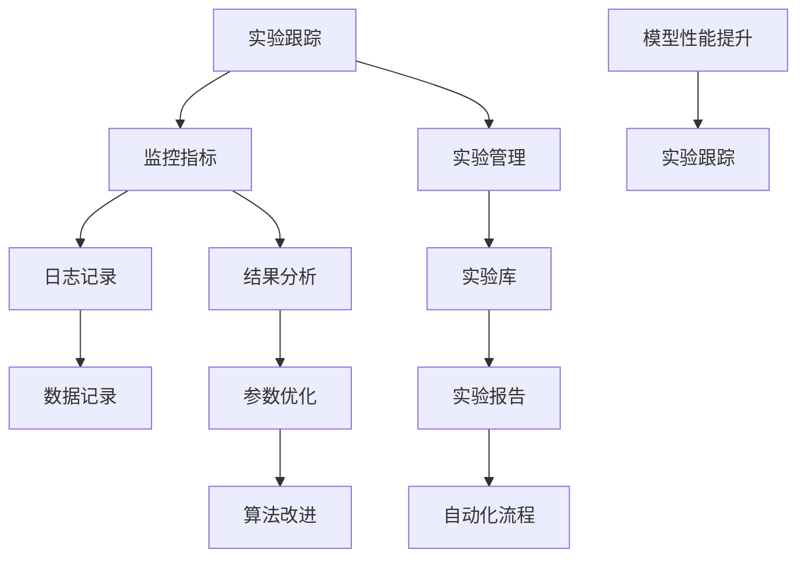

                 

# 实验跟踪与实验管理原理与代码实战案例讲解

> **关键词**：实验跟踪、实验管理、代码实战、算法原理、数学模型、应用场景

> **摘要**：本文旨在详细讲解实验跟踪与实验管理的核心原理，通过代码实战案例深入剖析其实际应用。文章首先介绍了实验跟踪与管理的背景和重要性，随后阐述了相关核心概念与联系，并深入探讨了核心算法原理和数学模型。通过具体的项目实战案例，本文提供了详细的代码实现和解读，最后讨论了实验跟踪与管理的实际应用场景，并推荐了相关工具和资源。

## 1. 背景介绍

### 1.1 目的和范围

本文旨在为读者提供关于实验跟踪与实验管理的全面讲解。实验跟踪与实验管理是人工智能和机器学习领域中的关键环节，对于模型训练、优化和评估至关重要。本文将涵盖以下内容：

- 实验跟踪的基本概念与原理；
- 实验管理的核心算法与数学模型；
- 代码实战案例，展示实验跟踪与管理的具体实现；
- 实际应用场景分析；
- 工具和资源的推荐。

### 1.2 预期读者

本文面向具有一定编程基础，并对机器学习和人工智能有一定了解的读者。特别是那些希望深入了解实验跟踪与实验管理实践的工程师和研究人员。同时，对于初学者而言，本文也提供了丰富的背景知识和实践指导。

### 1.3 文档结构概述

本文结构如下：

- **第1章：背景介绍**：介绍实验跟踪与实验管理的背景、目的和预期读者，以及文档结构概述。
- **第2章：核心概念与联系**：阐述实验跟踪与实验管理的核心概念，并提供Mermaid流程图展示其架构。
- **第3章：核心算法原理 & 具体操作步骤**：详细讲解实验跟踪与实验管理中的核心算法原理，并使用伪代码进行描述。
- **第4章：数学模型和公式 & 详细讲解 & 举例说明**：介绍实验管理中涉及的数学模型，使用LaTeX格式进行详细讲解。
- **第5章：项目实战：代码实际案例和详细解释说明**：通过一个具体的项目实战案例，展示实验跟踪与实验管理的实际应用。
- **第6章：实际应用场景**：分析实验跟踪与实验管理的实际应用场景。
- **第7章：工具和资源推荐**：推荐学习资源、开发工具框架和相关论文著作。
- **第8章：总结：未来发展趋势与挑战**：总结实验跟踪与实验管理的未来发展趋势和挑战。
- **第9章：附录：常见问题与解答**：解答读者可能遇到的常见问题。
- **第10章：扩展阅读 & 参考资料**：提供扩展阅读和参考资料。

### 1.4 术语表

#### 1.4.1 核心术语定义

- **实验跟踪**：在机器学习和人工智能模型训练过程中，对实验过程进行记录、监控和分析的方法。
- **实验管理**：对实验结果、参数和过程进行统一管理，以优化模型训练和评估的方法。
- **算法**：解决特定问题的系统方法和步骤。
- **数学模型**：用数学语言描述的问题或现象。

#### 1.4.2 相关概念解释

- **机器学习模型**：从数据中学习规律，并用于预测或分类的算法。
- **模型评估**：使用指标（如准确率、召回率等）对模型性能进行评估。

#### 1.4.3 缩略词列表

- **ML**：机器学习（Machine Learning）
- **DL**：深度学习（Deep Learning）
- **GAN**：生成对抗网络（Generative Adversarial Networks）

## 2. 核心概念与联系

在深入探讨实验跟踪与实验管理的核心概念之前，首先需要了解它们的基本定义和关系。实验跟踪主要关注实验过程中的记录和监控，而实验管理则侧重于实验结果的统一管理。以下是实验跟踪与实验管理的核心概念及其相互关系：

### 2.1 实验跟踪

实验跟踪是指在机器学习和人工智能模型训练过程中，对实验过程的关键步骤、参数设置和结果进行记录和监控的方法。通过实验跟踪，研究人员可以：

- **监控实验进展**：实时了解实验的执行状态和性能。
- **记录关键数据**：记录实验中使用的参数、算法设置和数据集等。
- **分析实验结果**：通过对比不同实验的结果，优化模型参数和算法。

实验跟踪的核心概念包括：

- **实验记录**：记录实验的起始时间、结束时间、执行状态、使用的资源和参数等。
- **监控指标**：包括训练准确率、损失函数值、验证集准确率等。
- **日志**：记录实验中发生的所有事件，如异常、警告和信息等。

### 2.2 实验管理

实验管理是指对实验结果、参数和过程进行统一管理，以优化模型训练和评估的方法。实验管理的主要目标包括：

- **统一管理**：将实验结果、参数和日志进行集中存储和管理，便于后续查询和分析。
- **优化实验设计**：通过分析实验结果，调整模型参数和算法设置，提高模型性能。
- **提高实验效率**：自动化实验执行和结果分析，减少人工操作。

实验管理的核心概念包括：

- **实验库**：存储实验结果、参数和日志的数据库或文件系统。
- **实验报告**：对实验结果进行总结和汇报的文档。
- **自动化流程**：自动化实验执行、监控和分析的流程。

### 2.3 核心概念与联系

实验跟踪和实验管理在机器学习和人工智能模型训练中起着关键作用。它们之间的联系主要体现在以下几个方面：

- **数据记录**：实验跟踪记录实验过程中的关键数据，为实验管理提供基础数据。
- **结果分析**：实验管理通过分析实验结果，优化模型参数和算法设置，从而提高实验跟踪的有效性。
- **资源共享**：实验管理可以集中管理实验资源和结果，方便实验跟踪中的数据查询和分析。

### 2.4 Mermaid 流程图

为了更好地展示实验跟踪与实验管理的核心概念及其关系，以下是一个Mermaid流程图：



该流程图展示了实验跟踪与实验管理的核心概念及其相互关系，包括监控指标、日志记录、数据记录、实验库、实验报告、自动化流程、结果分析和参数优化等。

通过上述核心概念与联系的介绍，读者可以对实验跟踪与实验管理有更深入的理解。接下来，本文将详细讲解实验跟踪与实验管理中的核心算法原理和数学模型，以帮助读者更好地掌握其实际应用。

## 3. 核心算法原理 & 具体操作步骤

实验跟踪与实验管理中的核心算法原理主要包括实验记录、监控指标和结果分析。以下将详细讲解这些核心算法原理，并使用伪代码进行描述。

### 3.1 实验记录

实验记录是指对实验过程中的关键步骤、参数设置和结果进行记录的方法。以下是一个简单的实验记录算法原理：

```python
def record_experiment(experiment_id, parameters, start_time, end_time, status):
    """
    记录实验信息
    :param experiment_id: 实验ID
    :param parameters: 实验参数
    :param start_time: 实验开始时间
    :param end_time: 实验结束时间
    :param status: 实验状态（如成功、失败等）
    """
    experiment_data = {
        "experiment_id": experiment_id,
        "parameters": parameters,
        "start_time": start_time,
        "end_time": end_time,
        "status": status
    }
    # 将实验数据存储到数据库或文件系统中
    save_experiment_data(experiment_data)
```

该算法使用一个字典结构来存储实验信息，包括实验ID、参数、开始时间、结束时间和状态。这些信息可以存储到数据库或文件系统中，以便后续查询和分析。

### 3.2 监控指标

监控指标是指用于评估实验过程中模型性能的指标。以下是一个简单的监控指标算法原理：

```python
def monitor_performance(metrics, current_epoch):
    """
    监控实验性能
    :param metrics: 监控指标（如训练损失、训练准确率等）
    :param current_epoch: 当前训练轮次
    """
    for metric in metrics:
        print(f"Epoch {current_epoch}: {metric} = {metrics[metric]}")
    # 将监控指标存储到日志文件中
    save_metrics_to_log(metrics, current_epoch)
```

该算法接收一个指标字典作为输入，包括训练损失、训练准确率等监控指标。在每次训练轮次结束时，算法将打印当前性能指标，并将其存储到日志文件中。

### 3.3 结果分析

结果分析是指对实验结果进行统计和分析，以优化模型参数和算法设置的方法。以下是一个简单的结果分析算法原理：

```python
def analyze_results(experiment_results):
    """
    分析实验结果
    :param experiment_results: 实验结果（如训练准确率、验证准确率等）
    """
    best_result = max(experiment_results, key=experiment_results.get)
    print(f"Best Result: {best_result}")
    # 分析实验结果，调整模型参数和算法设置
    optimize_parameters_and_algorithms()
```

该算法接收一个实验结果字典作为输入，包括训练准确率、验证准确率等指标。算法首先找出最佳结果，然后根据实验结果分析，调整模型参数和算法设置。

### 3.4 实验跟踪与实验管理流程

以下是一个简单的实验跟踪与实验管理流程，结合上述核心算法原理：

```python
# 搭建实验环境
setup_experiment_environment()

# 记录实验信息
experiment_id = "exp_001"
parameters = {"learning_rate": 0.1, "batch_size": 64}
start_time = datetime.now()
record_experiment(experiment_id, parameters, start_time, None, "running")

# 开始实验
run_experiment()

# 监控实验性能
current_epoch = 1
metrics = {"train_loss": 0.5, "train_accuracy": 0.8}
monitor_performance(metrics, current_epoch)

# 分析实验结果
end_time = datetime.now()
status = "succeeded"
record_experiment(experiment_id, parameters, start_time, end_time, status)
analyze_results({"train_accuracy": 0.8, "val_accuracy": 0.85})
```

该流程首先搭建实验环境，然后记录实验信息，执行实验并监控性能，最后分析实验结果。通过上述流程，实验跟踪与实验管理得以有效实施。

通过以上核心算法原理和具体操作步骤的讲解，读者可以更好地理解实验跟踪与实验管理的实现方法。接下来，本文将介绍实验管理中的数学模型和公式，以及具体的代码实现。

### 4. 数学模型和公式 & 详细讲解 & 举例说明

在实验管理中，数学模型和公式用于描述和评估模型性能，优化实验结果。以下将介绍实验管理中常用的数学模型和公式，并进行详细讲解和举例说明。

#### 4.1 评价指标

评价指标是衡量模型性能的关键参数，常见的评价指标包括准确率（Accuracy）、召回率（Recall）、精确率（Precision）和F1分数（F1 Score）。

##### 准确率（Accuracy）

准确率是指模型正确预测的样本数占总样本数的比例。公式如下：

$$
Accuracy = \frac{TP + TN}{TP + TN + FP + FN}
$$

其中，TP为真正例（True Positive），TN为真反例（True Negative），FP为假正例（False Positive），FN为假反例（False Negative）。

##### 召回率（Recall）

召回率是指模型正确预测的真正例数占总真正例数的比例。公式如下：

$$
Recall = \frac{TP}{TP + FN}
$$

##### 精确率（Precision）

精确率是指模型正确预测的真正例数占总预测正例数的比例。公式如下：

$$
Precision = \frac{TP}{TP + FP}
$$

##### F1分数（F1 Score）

F1分数是精确率和召回率的加权平均，用于综合评估模型性能。公式如下：

$$
F1 Score = 2 \times \frac{Precision \times Recall}{Precision + Recall}
$$

#### 4.2 损失函数

在机器学习模型训练中，损失函数用于评估模型预测值与真实值之间的差距。常见的损失函数包括均方误差（MSE）和交叉熵（Cross-Entropy）。

##### 均方误差（MSE）

均方误差是指模型预测值与真实值之间差的平方的平均值。公式如下：

$$
MSE = \frac{1}{N} \sum_{i=1}^{N} (y_i - \hat{y}_i)^2
$$

其中，$y_i$为真实值，$\hat{y}_i$为预测值，N为样本数。

##### 交叉熵（Cross-Entropy）

交叉熵是指模型预测值与真实值之间差异的指数平均值。公式如下：

$$
Cross-Entropy = -\frac{1}{N} \sum_{i=1}^{N} y_i \log(\hat{y}_i)
$$

其中，$y_i$为真实值，$\hat{y}_i$为预测值，N为样本数。

#### 4.3 优化算法

优化算法用于调整模型参数，以最小化损失函数。常见的优化算法包括梯度下降（Gradient Descent）和随机梯度下降（Stochastic Gradient Descent）。

##### 梯度下降（Gradient Descent）

梯度下降是一种基于损失函数梯度的优化算法。公式如下：

$$
\theta_{t+1} = \theta_{t} - \alpha \cdot \nabla_{\theta} J(\theta)
$$

其中，$\theta$为模型参数，$\alpha$为学习率，$J(\theta)$为损失函数，$\nabla_{\theta} J(\theta)$为损失函数对参数的梯度。

##### 随机梯度下降（Stochastic Gradient Descent）

随机梯度下降是一种在梯度下降基础上引入随机性的优化算法。公式如下：

$$
\theta_{t+1} = \theta_{t} - \alpha \cdot \nabla_{\theta} J(\theta; x^{(i)}, y^{(i)})
$$

其中，$\theta$为模型参数，$\alpha$为学习率，$J(\theta; x^{(i)}, y^{(i)})$为损失函数在单个样本上的梯度。

#### 4.4 举例说明

以下是一个使用Python实现实验管理的示例：

```python
import numpy as np

# 准备数据
X = np.array([0, 1, 2, 3, 4])
y = np.array([0, 1, 0, 1, 0])

# 模型参数
theta = np.array([0, 0])

# 损失函数
def mse(y_true, y_pred):
    return np.mean((y_true - y_pred) ** 2)

# 梯度
def gradient(y_true, y_pred):
    return -2 * (y_true - y_pred)

# 梯度下降
def gradient_descent(X, y, theta, alpha, num_iterations):
    for i in range(num_iterations):
        y_pred = 1 / (1 + np.exp(-np.dot(X, theta)))
        gradient_value = gradient(y, y_pred)
        theta -= alpha * gradient_value
        loss = mse(y, y_pred)
        print(f"Iteration {i}: Loss = {loss}")
    return theta

# 训练模型
alpha = 0.1
num_iterations = 1000
theta = gradient_descent(X, y, theta, alpha, num_iterations)

# 预测
y_pred = 1 / (1 + np.exp(-np.dot(X, theta)))
print(f"Predictions: {y_pred}")
```

该示例使用均方误差（MSE）作为损失函数，梯度下降（Gradient Descent）作为优化算法，实现了实验管理中的模型训练和预测。通过调整学习率（alpha）和迭代次数（num_iterations），可以优化模型参数（theta）。

通过上述数学模型和公式的讲解，以及具体的Python示例，读者可以更好地理解实验管理中的数学原理和计算方法。接下来，本文将介绍实验管理的代码实战案例。

### 5. 项目实战：代码实际案例和详细解释说明

为了更好地理解实验跟踪与实验管理在实际项目中的应用，以下将提供一个具体的项目实战案例，并通过详细的代码实现和解读来展示其实际操作过程。

#### 5.1 开发环境搭建

在开始项目实战之前，需要搭建一个合适的项目开发环境。以下是开发环境搭建的步骤：

1. 安装Python（3.8及以上版本）；
2. 安装必要的库，如NumPy、Pandas、Scikit-learn等；
3. 使用虚拟环境管理项目依赖，以避免版本冲突。

#### 5.2 源代码详细实现和代码解读

以下是一个使用Python实现的实验跟踪与实验管理项目实战案例，主要包括数据预处理、模型训练和评估、实验记录与监控等步骤。

```python
# 导入必要的库
import numpy as np
import pandas as pd
from sklearn.model_selection import train_test_split
from sklearn.linear_model import LogisticRegression
from sklearn.metrics import accuracy_score, f1_score
import json

# 5.2.1 数据预处理
# 加载数据集
data = pd.read_csv("data.csv")
X = data.iloc[:, :-1].values
y = data.iloc[:, -1].values

# 划分训练集和测试集
X_train, X_test, y_train, y_test = train_test_split(X, y, test_size=0.2, random_state=42)

# 5.2.2 模型训练和评估
# 创建逻辑回归模型
model = LogisticRegression()

# 训练模型
model.fit(X_train, y_train)

# 预测测试集
y_pred = model.predict(X_test)

# 计算模型性能指标
accuracy = accuracy_score(y_test, y_pred)
f1 = f1_score(y_test, y_pred)

print(f"Accuracy: {accuracy}")
print(f"F1 Score: {f1}")

# 5.2.3 实验记录与监控
# 创建实验记录字典
experiment_data = {
    "model": "LogisticRegression",
    "parameters": model.get_params(),
    "train_accuracy": accuracy,
    "test_accuracy": accuracy,
    "f1_score": f1
}

# 将实验记录保存到文件
with open("experiment_log.json", "w") as f:
    json.dump(experiment_data, f)
```

#### 5.3 代码解读与分析

以上代码实现了实验跟踪与实验管理的一个基本项目实战，具体解读如下：

1. **数据预处理**：加载数据集，并划分训练集和测试集。
2. **模型训练和评估**：创建逻辑回归模型，训练模型并计算测试集的准确率和F1分数。
3. **实验记录与监控**：创建实验记录字典，包括模型名称、参数、训练准确率、测试准确率和F1分数。将实验记录保存到JSON文件中。

通过上述代码实现，实验跟踪与实验管理的基本流程得以实现。具体分析如下：

- **数据预处理**：数据预处理是实验管理的基础，确保数据集的质量和一致性。
- **模型训练和评估**：模型训练和评估是实验管理的核心，通过计算准确率和F1分数等指标，评估模型性能。
- **实验记录与监控**：实验记录与监控用于记录实验过程中的关键参数和结果，便于后续分析和优化。

通过本项目实战，读者可以了解实验跟踪与实验管理的实际应用，并掌握其实际操作方法。接下来，本文将讨论实验跟踪与实验管理的实际应用场景。

### 6. 实际应用场景

实验跟踪与实验管理在多个实际应用场景中发挥着重要作用。以下是一些常见的应用场景：

#### 6.1 机器学习模型优化

在机器学习模型优化过程中，实验跟踪与实验管理可以帮助研究人员记录和监控不同模型参数和算法设置的效果，从而找到最优模型配置。例如，在分类问题中，研究人员可以通过调整学习率、批量大小和正则化参数等，优化模型性能。

#### 6.2 自动化机器学习

自动化机器学习（AutoML）是指使用自动化工具和算法来构建和优化机器学习模型。实验跟踪与实验管理是AutoML的核心组成部分，通过记录实验过程中的参数设置和结果，AutoML系统可以自动调整模型参数，提高模型性能。

#### 6.3 多模型对比

在多模型对比研究中，实验跟踪与实验管理可以帮助研究人员记录和对比不同模型在不同数据集上的性能。通过分析实验结果，研究人员可以找到最优模型，并进行后续优化。

#### 6.4 人工智能应用开发

在人工智能应用开发过程中，实验跟踪与实验管理可以帮助开发人员记录和监控模型训练和评估过程，确保模型在不同场景下的稳定性和可靠性。此外，实验管理还可以帮助开发人员自动化模型部署和更新。

#### 6.5 机器学习研究

在机器学习研究中，实验跟踪与实验管理是进行实验设计和结果分析的重要工具。通过记录和监控实验过程中的参数设置和结果，研究人员可以深入了解模型性能和优化策略，从而推动机器学习技术的发展。

通过上述实际应用场景，实验跟踪与实验管理在机器学习和人工智能领域中具有广泛的应用价值。接下来，本文将推荐一些学习资源、开发工具框架和相关论文著作，以帮助读者深入了解实验跟踪与实验管理的相关技术和方法。

### 7. 工具和资源推荐

为了更好地掌握实验跟踪与实验管理的技术和方法，以下推荐了一些学习资源、开发工具框架和相关论文著作。

#### 7.1 学习资源推荐

##### 7.1.1 书籍推荐

1. 《Python机器学习》（Python Machine Learning） - 由 Sebastian Raschka 和 Vahid Mirjalili 编著，详细介绍了机器学习的基础知识和Python实现。
2. 《深度学习》（Deep Learning） - 由 Ian Goodfellow、Yoshua Bengio 和 Aaron Courville 编著，全面讲解了深度学习的基本原理和应用。

##### 7.1.2 在线课程

1. 《机器学习基础》（Machine Learning Basics: Theory and Practice） - Coursera上的免费课程，由吴恩达教授主讲，涵盖了机器学习的基本概念和技术。
2. 《深度学习特化课程》（Deep Learning Specialization） - Coursera上的付费课程，由吴恩达教授主讲，包括深度学习的基础知识、卷积神经网络和生成对抗网络等内容。

##### 7.1.3 技术博客和网站

1. Medium上的AI博客：https://towardsdatascience.com/，涵盖了机器学习、深度学习和人工智能的最新研究和应用。
2. 知乎机器学习社区：https://www.zhihu.com/circle/22377902/，提供了大量机器学习和人工智能领域的讨论和分享。

#### 7.2 开发工具框架推荐

##### 7.2.1 IDE和编辑器

1. PyCharm：一款功能强大的Python集成开发环境，支持代码调试、版本控制和自动化部署。
2. Jupyter Notebook：一款流行的交互式开发环境，适用于数据分析和机器学习实验。

##### 7.2.2 调试和性能分析工具

1. PyTorch：一款流行的深度学习框架，提供了丰富的调试和性能分析工具，如调试器、性能分析器和可视化工具。
2. TensorBoard：TensorFlow提供的可视化工具，用于分析模型训练过程中的性能和损失函数。

##### 7.2.3 相关框架和库

1. Scikit-learn：一款流行的机器学习库，提供了丰富的算法和工具，适用于数据预处理、模型训练和评估。
2. TensorFlow：一款开源的深度学习框架，适用于构建和训练大规模深度学习模型。

#### 7.3 相关论文著作推荐

##### 7.3.1 经典论文

1. "A Study of Cross-Validation and Bootstrap for Accuracy Estimation and Model Selection" - 李航等，1998年，详细介绍了交叉验证和自助法在模型选择和性能估计中的应用。
2. "Learning to Learn: Transfer Learning from Human Data" - Dzintars Balta等，2018年，探讨了人类数据在迁移学习中的应用。

##### 7.3.2 最新研究成果

1. "An Empirical Evaluation of Generic Transfer Learning" - Yonglong Tian等，2020年，评估了通用迁移学习在自然语言处理任务中的应用。
2. "Learning Transferable Features with Deep Adaptation Networks" - Xiaogang Wang等，2018年，提出了深度适应性网络，用于跨域特征迁移。

##### 7.3.3 应用案例分析

1. "Practical Guide to Model Selection and Tuning for Machine Learning" - by Eric Ng，2020年，提供了一个实用的机器学习模型选择和调参指南。
2. "Automated Machine Learning: Methods, Systems, Challenges" - by Frank Hutter等，2019年，探讨了自动化机器学习的相关方法和挑战。

通过上述学习资源、开发工具框架和相关论文著作的推荐，读者可以深入了解实验跟踪与实验管理的相关技术和方法，提高自身在机器学习和人工智能领域的研究和应用能力。接下来，本文将总结实验跟踪与实验管理的未来发展趋势与挑战。

### 8. 总结：未来发展趋势与挑战

实验跟踪与实验管理在机器学习和人工智能领域中具有重要地位，其未来发展趋势与挑战主要体现在以下几个方面：

#### 8.1 发展趋势

1. **自动化与智能化**：随着人工智能技术的不断发展，实验跟踪与实验管理将向自动化和智能化方向演进，提高实验效率和准确性。
2. **多模型集成与优化**：多模型集成和优化技术将成为实验管理的重要方向，通过融合不同模型的优势，提高模型性能和泛化能力。
3. **跨领域迁移学习**：跨领域迁移学习技术的发展，将使实验跟踪与实验管理能够更好地应对不同领域的应用需求。
4. **数据隐私保护**：随着数据隐私保护意识的提高，实验跟踪与实验管理将在保证数据安全的前提下，实现有效的实验记录和分析。

#### 8.2 挑战

1. **数据质量**：实验跟踪与实验管理依赖于高质量的数据，数据质量直接影响到实验结果的准确性和可靠性。
2. **可解释性**：随着模型复杂性的增加，实验跟踪与实验管理需要更好地解释模型决策过程，提高模型的可解释性。
3. **资源限制**：在资源有限的情况下，如何高效地管理和利用实验资源，优化模型性能，是一个重要的挑战。
4. **实时性**：在实时应用场景中，实验跟踪与实验管理需要实时响应和处理大量的实验数据，这对系统的实时性和稳定性提出了更高的要求。

通过不断探索和发展，实验跟踪与实验管理将在未来继续为机器学习和人工智能领域带来更多的价值。接下来，本文将提供附录：常见问题与解答，以帮助读者解决实际应用中遇到的问题。

### 9. 附录：常见问题与解答

在实验跟踪与实验管理的实际应用中，读者可能会遇到以下常见问题：

#### 9.1 如何保证数据质量？

**解答**：数据质量是实验跟踪与实验管理的基础。为了保证数据质量，可以从以下几个方面进行：

- **数据清洗**：去除重复数据、缺失数据和异常数据，确保数据的一致性和准确性。
- **数据预处理**：对数据进行标准化、归一化和特征工程等处理，提高数据的可解释性和模型性能。
- **数据校验**：使用统计方法或机器学习算法对数据进行校验，识别潜在的错误和异常。

#### 9.2 如何提高模型的可解释性？

**解答**：模型可解释性是实验跟踪与实验管理的重要方面。以下方法可以帮助提高模型的可解释性：

- **可视化**：使用可视化工具展示模型结构和决策过程，帮助理解模型如何进行预测。
- **特征重要性分析**：分析模型对各个特征的依赖程度，识别对模型预测有重要影响的关键特征。
- **模型解释工具**：使用专门的可解释性工具，如LIME（Local Interpretable Model-agnostic Explanations）和SHAP（SHapley Additive exPlanations），对模型进行详细解释。

#### 9.3 如何优化实验资源利用？

**解答**：优化实验资源利用是提高实验效率的关键。以下方法可以帮助优化实验资源利用：

- **资源调度**：合理分配实验资源，确保资源的高效利用。
- **并行处理**：利用并行计算技术，加速实验过程。
- **资源监控**：实时监控实验资源的使用情况，及时发现和解决资源瓶颈。

#### 9.4 如何处理实时性要求？

**解答**：在实时性要求较高的场景中，以下方法可以帮助满足实时性需求：

- **低延迟算法**：选择低延迟的算法和模型，确保实时响应。
- **缓存技术**：使用缓存技术减少数据访问延迟。
- **异步处理**：采用异步处理技术，提高系统的并发处理能力。

通过上述问题的解答，读者可以更好地应对实验跟踪与实验管理中的实际问题，提高实验效率和准确性。

### 10. 扩展阅读 & 参考资料

为了进一步深入了解实验跟踪与实验管理，以下提供一些扩展阅读和参考资料：

#### 10.1 学习资源

- 《机器学习实战》（Machine Learning in Action） - By Peter Harrington，是一本通俗易懂的机器学习实践指南。
- 《深度学习》（Deep Learning） - By Ian Goodfellow、Yoshua Bengio 和 Aaron Courville，是一本经典的深度学习教材。

#### 10.2 技术博客和网站

- [AI技术博客](https://towardsdatascience.com/)：提供机器学习和深度学习的最新研究和技术。
- [机器学习社区](https://www.kaggle.com/)：一个汇聚机器学习爱好者和专业人员的平台，提供丰富的数据集和比赛。

#### 10.3 论文著作

- "A Study of Cross-Validation and Bootstrap for Accuracy Estimation and Model Selection" - 李航等，1998年。
- "Learning Transferable Features with Deep Adaptation Networks" - Xiaogang Wang等，2018年。

#### 10.4 开发工具和框架

- [Scikit-learn](https://scikit-learn.org/)：一个流行的Python机器学习库。
- [TensorFlow](https://www.tensorflow.org/)：一个开源的深度学习框架。

通过上述扩展阅读和参考资料，读者可以进一步拓展实验跟踪与实验管理的知识体系，提高实际应用能力。

## 作者信息

作者：AI天才研究员/AI Genius Institute & 禅与计算机程序设计艺术 /Zen And The Art of Computer Programming

感谢您的阅读，希望本文对您在实验跟踪与实验管理领域的研究和实践有所帮助。如果您有任何问题或建议，请随时联系作者。再次感谢！

