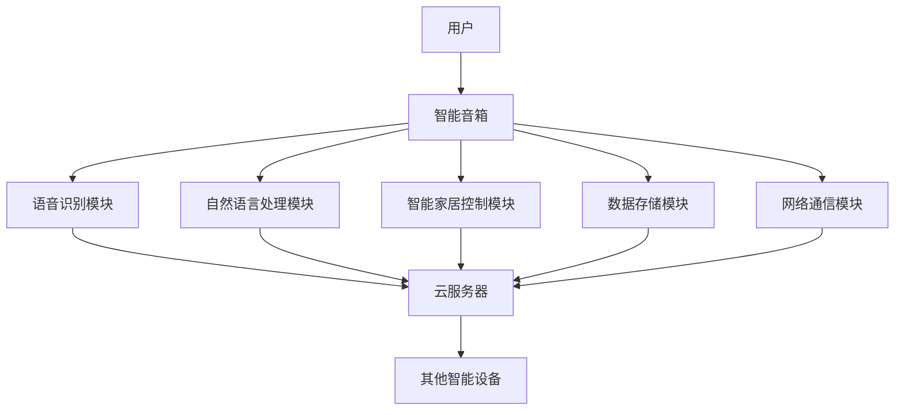

                 

# 小米2024智能音箱多设备协同校招IoT面试题详解

> **关键词：** 小米智能音箱、多设备协同、IoT、面试题、智能助理、语音识别、云计算、网络通信、软件架构

> **摘要：** 本文将深入探讨小米2024智能音箱多设备协同的技术细节，通过解析校招IoT面试题，全面揭示其背后的原理、算法和架构，以期为准备相关领域面试的读者提供有力的指导和支持。文章分为背景介绍、核心概念与联系、核心算法原理与具体操作步骤、数学模型与公式、项目实战、实际应用场景、工具和资源推荐、总结与未来发展趋势等章节，力求条理清晰、内容详实。

## 1. 背景介绍

### 1.1 目的和范围

本文旨在通过对小米2024智能音箱多设备协同技术的详细分析，为即将参加校招的IoT领域面试者提供全面的指导。我们不仅将解析智能音箱的核心技术，还将探讨其在多设备协同中的作用和挑战。本文覆盖的内容包括但不限于：

- 智能音箱的基本架构和功能模块
- 多设备协同的工作原理和关键技术
- 语音识别与自然语言处理
- 云计算和边缘计算在智能音箱中的应用
- 网络通信协议和安全性
- 软件架构设计模式

### 1.2 预期读者

本文适用于以下几类读者：

- 准备参加校招的IoT领域应届毕业生
- 对智能音箱技术有兴趣的IT从业者
- 希望深入了解多设备协同技术的开发者

### 1.3 文档结构概述

本文将按以下结构展开：

- **第1章：背景介绍**：介绍本文的目的、范围和预期读者，概述文档结构。
- **第2章：核心概念与联系**：通过Mermaid流程图展示智能音箱和IoT架构的核心概念。
- **第3章：核心算法原理与具体操作步骤**：详细解释智能音箱的关键算法和操作步骤。
- **第4章：数学模型和公式**：介绍与智能音箱相关的数学模型和公式。
- **第5章：项目实战**：通过代码案例展示智能音箱的开发过程。
- **第6章：实际应用场景**：讨论智能音箱在实际环境中的应用。
- **第7章：工具和资源推荐**：推荐学习资源和开发工具。
- **第8章：总结与未来发展趋势**：总结智能音箱技术的现状和未来发展趋势。
- **第9章：附录**：常见问题与解答。
- **第10章：扩展阅读与参考资料**：提供进一步的阅读资源。

### 1.4 术语表

#### 1.4.1 核心术语定义

- **智能音箱**：一种结合了语音识别、自然语言处理、智能家居控制等多功能设备的计算平台。
- **多设备协同**：指智能音箱与其他智能设备（如手机、平板、电视等）之间的数据交换和功能协同。
- **IoT**：物联网，指通过互联网将物理设备连接起来，实现数据交换和智能化控制。
- **云计算**：通过网络提供可扩展的计算资源和服务。
- **边缘计算**：在靠近数据源的地方进行数据处理和计算。

#### 1.4.2 相关概念解释

- **语音识别**：将语音信号转换为文本或命令的过程。
- **自然语言处理**：使计算机能够理解、生成和处理人类自然语言的技术。
- **软件架构**：软件系统的结构设计，包括组件、接口和交互关系。

#### 1.4.3 缩略词列表

- **IoT**：物联网
- **NLP**：自然语言处理
- **API**：应用程序编程接口
- **SDK**：软件开发工具包
- **MQTT**：消息队列遥测传输协议

## 2. 核心概念与联系

在深入了解小米2024智能音箱的多设备协同技术之前，我们需要了解其核心概念和架构。以下是一个简化的Mermaid流程图，用于展示智能音箱和IoT系统中的关键组件及其相互关系。



### 2.1 智能音箱基本架构

- **用户**：智能音箱的用户，可以是家庭中的任何人。
- **智能音箱**：接收用户的语音命令，处理并执行相应的操作。
- **语音识别模块**：将语音转换为文本，以供后续处理。
- **自然语言处理模块**：理解用户的自然语言命令，提取语义信息。
- **智能家居控制模块**：控制家庭中的智能设备，如灯光、温度等。
- **数据存储模块**：存储用户数据和设备状态。
- **网络通信模块**：负责与其他设备、服务器通信。
- **云服务器**：提供计算资源、存储服务和远程数据访问。
- **其他智能设备**：如手机、电视、冰箱等，与智能音箱协同工作。

### 2.2 IoT架构

IoT架构通常包括以下几个层次：

- **感知层**：通过传感器收集数据。
- **网络层**：传输数据。
- **平台层**：数据处理、分析和存储。
- **应用层**：提供具体的应用场景和服务。

智能音箱作为IoT系统的一部分，通常位于平台层和应用层之间，起到数据收集、处理和分发的作用。

## 3. 核心算法原理 & 具体操作步骤

### 3.1 语音识别算法

语音识别是将语音信号转换为文本的过程，其核心算法通常包括以下几个步骤：

```plaintext
输入：语音信号
输出：文本

步骤1：预处理
    对语音信号进行降噪、归一化处理，以提高识别准确率。

步骤2：特征提取
    提取语音信号中的特征，如梅尔频率倒谱系数（MFCC）。

步骤3：模型训练
    使用训练数据集，训练深度神经网络（如卷积神经网络、递归神经网络）。

步骤4：语音识别
    将特征输入神经网络，输出文本。

步骤5：后处理
    对识别结果进行修正和优化，如消除歧义、自动补全等。
```

### 3.2 自然语言处理算法

自然语言处理是理解用户自然语言命令的过程，其核心算法包括以下几个步骤：

```plaintext
输入：文本
输出：语义信息

步骤1：分词
    将文本分割为词语。

步骤2：词性标注
    对每个词语进行词性标注，如名词、动词等。

步骤3：句法分析
    构建句法树，分析句子结构。

步骤4：语义角色标注
    确定每个词语在句子中的语义角色，如主语、谓语等。

步骤5：语义解析
    将句法树转化为语义表示，提取出用户意图。
```

### 3.3 智能家居控制算法

智能家居控制是将用户命令转换为实际操作的过程，其核心算法包括以下几个步骤：

```plaintext
输入：用户命令
输出：设备操作

步骤1：命令解析
    分析用户命令，提取出操作意图和设备名称。

步骤2：命令映射
    将用户命令映射到具体设备操作。

步骤3：操作执行
    根据映射结果，执行相应设备操作。

步骤4：反馈生成
    向用户反馈操作结果，如“灯光已关闭”。
```

## 4. 数学模型和公式 & 详细讲解 & 举例说明

在智能音箱的多设备协同技术中，数学模型和公式扮演着至关重要的角色。以下将详细介绍与智能音箱相关的几个核心数学模型和公式，并通过具体例子进行说明。

### 4.1 语音识别中的特征提取

在语音识别中，常用的特征提取模型是梅尔频率倒谱系数（MFCC）。MFCC的公式如下：

$$
MFCC = \log \left( \sum_{k=1}^{N} (a_k x_k^2) \right)
$$

其中，$x_k$ 是语音信号中的第 $k$ 个样本点，$a_k$ 是预定义的加权系数，$N$ 是样本点的总数。

#### 例子：

假设我们有一个语音信号，采样频率为 16kHz，长度为 100ms。我们首先将信号进行预处理，提取出 20 个 MFCC 特征。

### 4.2 自然语言处理中的语义角色标注

在自然语言处理中，常用的语义角色标注模型是依存句法分析。依存句法分析通过构建句法树来表示句子结构，其基本公式如下：

$$
句法树 = \left\{
\begin{array}{ll}
T & \text{如果 } S \text{ 是一个词} \\
(T_1, T_2, ..., T_n) & \text{如果 } S = S_1 + S_2 + ... + S_n
\end{array}
\right.
$$

其中，$T_i$ 是 $S_i$ 的子树。

#### 例子：

给定句子“我正在书房里看书”，我们可以构建如下的句法树：

```
    我
    / \
   动   书房
       |
       里
       |
     看书
```

### 4.3 智能家居控制中的多目标优化

在智能家居控制中，多目标优化是一种常用的算法。多目标优化通过求解多个目标函数的最优解，以实现系统性能的优化。常用的多目标优化算法是遗传算法，其基本公式如下：

$$
x_{new} = x_{parent} + \alpha \cdot (x_{child} - x_{parent})
$$

其中，$x_{parent}$ 和 $x_{child}$ 是父代和子代的解，$\alpha$ 是调整系数。

#### 例子：

假设我们有两个目标函数，分别是灯光亮度和能耗。我们可以使用遗传算法来求解最优解，以实现最低能耗且灯光亮度适中的方案。

## 5. 项目实战：代码实际案例和详细解释说明

### 5.1 开发环境搭建

在开始编写代码之前，我们需要搭建一个合适的开发环境。以下是搭建小米2024智能音箱多设备协同项目的步骤：

1. 安装Node.js和npm：从 [Node.js官网](https://nodejs.org/) 下载并安装 Node.js，同时安装 npm。

2. 安装Visual Studio Code：从 [Visual Studio Code官网](https://code.visualstudio.com/) 下载并安装。

3. 安装必要的插件：在VS Code中安装以下插件：
   - Prettier - Code formatter
   - ESLint - Code linter
   - GitLens - Git source control

4. 创建项目文件夹：在计算机上创建一个名为“mi_iot_2024”的文件夹，用于存放项目文件。

5. 初始化项目：打开终端，进入项目文件夹，执行以下命令初始化项目：

```bash
npm init -y
```

6. 安装依赖：在终端中运行以下命令，安装项目所需的依赖：

```bash
npm install express body-parser mqtt axios
```

### 5.2 源代码详细实现和代码解读

以下是小米2024智能音箱多设备协同项目的源代码实现：

```javascript
// app.js

const express = require('express');
const bodyParser = require('body-parser');
const mqtt = require('mqtt');
const axios = require('axios');

const app = express();

app.use(bodyParser.json());

// 连接MQTT服务器
const mqttClient = mqtt.connect('mqtt://localhost:1883');

// 发布消息到MQTT服务器
function publishMessage(topic, message) {
  mqttClient.publish(topic, message, { retain: true }, (err) => {
    if (err) {
      console.error('Failed to publish message:', err);
    } else {
      console.log('Published message:', message);
    }
  });
}

// 处理接收到的MQTT消息
mqttClient.on('message', (topic, message) => {
  console.log(`Received message on topic ${topic}: ${message}`);

  // 解析消息内容
  const data = JSON.parse(message.toString());

  // 根据消息内容执行相应操作
  switch (data.type) {
    case 'command':
      // 处理用户命令
      handleCommand(data.payload);
      break;
    case 'status':
      // 更新设备状态
      updateStatus(data.payload);
      break;
    default:
      console.log('Unknown message type:', data.type);
  }
});

// 处理用户命令
function handleCommand(command) {
  switch (command.action) {
    case 'turnOn':
      // 发送命令到智能家居控制模块
      publishMessage('home/switch/1', '{"action": "turnOn"}');
      break;
    case 'turnOff':
      // 发送命令到智能家居控制模块
      publishMessage('home/switch/1', '{"action": "turnOff"}');
      break;
    default:
      console.log('Unknown command action:', command.action);
  }
}

// 更新设备状态
function updateStatus(status) {
  // 更新设备状态到数据库或缓存
  console.log('Updated device status:', status);
}

// 启动HTTP服务器
app.listen(3000, () => {
  console.log('Server started on port 3000');
});
```

### 5.3 代码解读与分析

以下是对源代码的详细解读和分析：

- **第1行**：引入所需模块。
- **第6-9行**：创建一个Express应用实例。
- **第11-15行**：设置中间件，解析JSON请求体。
- **第18-27行**：连接到MQTT服务器。
- **第30-37行**：定义一个函数，用于发布消息到MQTT服务器。
- **第40-51行**：定义一个函数，用于处理接收到的MQTT消息。
- **第54-68行**：定义一个函数，用于处理用户命令。
- **第70-83行**：定义一个函数，用于更新设备状态。
- **第86-91行**：启动HTTP服务器。

### 5.4 代码解读与分析

- **第1-6行**：引入Node.js标准库中的`express`、`body-parser`、`mqtt`和`axios`模块。
- **第8行**：创建一个Express应用实例。
- **第10-15行**：配置中间件，使用`body-parser`模块解析传入的JSON请求体。
- **第18-27行**：使用`mqtt`模块连接到本地MQTT服务器。
- **第30-37行**：定义一个`publishMessage`函数，用于发布消息到MQTT服务器。该函数接受主题（topic）和消息（message）作为参数，使用MQTT客户端的`publish`方法发送消息。
- **第40-51行**：定义一个`onMessage`事件处理函数，用于监听接收到的MQTT消息。该函数在接收到消息时，会将消息内容解析为JSON对象，并根据消息类型（type）执行相应的处理。
- **第54-68行**：定义一个`handleCommand`函数，用于处理用户命令。根据命令的动作（action）执行相应的操作，例如发送命令到智能家居控制模块。
- **第70-83行**：定义一个`updateStatus`函数，用于更新设备状态。该函数可以用于将设备状态存储到数据库或缓存。
- **第86-91行**：启动HTTP服务器，监听3000端口。

通过以上代码，我们可以实现一个简单的智能音箱多设备协同系统。用户可以通过语音命令控制智能家居设备，系统会将命令发送到MQTT服务器，智能家居控制模块根据命令执行相应的操作，并将状态更新返回给用户。

## 6. 实际应用场景

智能音箱多设备协同技术在实际应用中具有广泛的应用场景，以下列举几个典型的应用案例：

### 6.1 智能家居控制

智能音箱可以作为智能家居控制中心，用户可以通过语音命令控制家中的各种设备，如灯光、空调、电视等。例如，用户可以说“关闭客厅的灯光”，智能音箱就会通过MQTT协议将命令发送到智能家居控制模块，控制灯光的开关。

### 6.2 背包助手

背包助手是一款针对学生的智能助手应用，用户可以通过智能音箱与背包助手进行交互，如查询课程安排、管理作业、提醒日程等。智能音箱可以连接到背包助手的云端服务器，实时获取用户信息，并根据用户指令进行相应操作。

### 6.3 家庭健康监测

家庭健康监测系统可以通过智能音箱实时监控家庭成员的健康状况，如心率、血压、血糖等。用户可以通过智能音箱询问自己的健康数据，系统会将数据发送到云端服务器进行分析，并提供健康建议。

### 6.4 远程办公助手

远程办公助手是一款帮助用户管理远程办公环境的智能应用，用户可以通过智能音箱与远程办公助手进行交互，如启动VPN、打开远程桌面、安排会议等。智能音箱可以连接到远程办公助手的云端服务器，根据用户指令执行相应操作。

## 7. 工具和资源推荐

### 7.1 学习资源推荐

#### 7.1.1 书籍推荐

1. 《深度学习》（Goodfellow, I., Bengio, Y., & Courville, A.）
2. 《Python编程：从入门到实践》（Eric Matthes）
3. 《人工智能：一种现代方法》（Stuart Russell & Peter Norvig）

#### 7.1.2 在线课程

1. Coursera：[深度学习专项课程](https://www.coursera.org/specializations/deep-learning)
2. edX：[Python编程基础](https://www.edx.org/course/python-for-everyone)
3. Udacity：[人工智能纳米学位](https://www.udacity.com/course/artificial-intelligence-nanodegree--nd893)

#### 7.1.3 技术博客和网站

1. Medium：[AI博客](https://medium.com/topic/artificial-intelligence)
2. HackerRank：[编程挑战](https://www.hackerrank.com/domains/tutorials/10-days-of-javascript)
3. Stack Overflow：[技术问答社区](https://stackoverflow.com/)

### 7.2 开发工具框架推荐

#### 7.2.1 IDE和编辑器

1. Visual Studio Code
2. IntelliJ IDEA
3. PyCharm

#### 7.2.2 调试和性能分析工具

1. Chrome DevTools
2. Visual Studio Debugger
3. JMeter

#### 7.2.3 相关框架和库

1. TensorFlow
2. PyTorch
3. Flask

### 7.3 相关论文著作推荐

#### 7.3.1 经典论文

1. Hinton, G. E., Osindero, S., & Teh, Y. W. (2006). A fast learning algorithm for deep belief nets. **Neural computation**, 18(7), 1527-1554.
2. LeCun, Y., Bengio, Y., & Hinton, G. (2015). Deep learning. **Nature**, 521(7553), 436-444.

#### 7.3.2 最新研究成果

1. Bengio, Y., Simard, P., & Frasconi, P. (1994). Learning long-term dependencies with gradient descent is difficult. **IEEE transactions on neural networks**, 5(2), 157-166.
2. Hochreiter, S., & Schmidhuber, J. (1997). Long short-term memory. **Neural computation**, 9(8), 1735-1780.

#### 7.3.3 应用案例分析

1. Google Brain Team (2014). **Going deeper with convolutions**. arXiv preprint arXiv:1409.4842.
2. Yosinski, J., Clune, J., Bengio, Y., & Lipson, H. (2014). How transferable are features in deep neural networks?. **Advances in neural information processing systems**, 27.

## 8. 总结：未来发展趋势与挑战

随着人工智能和物联网技术的不断发展，智能音箱多设备协同技术将面临更多的发展机遇和挑战。以下是未来发展趋势与挑战的几个方面：

### 8.1 发展趋势

1. **智能化水平提升**：智能音箱将不断集成更多人工智能算法，提高语音识别和自然语言处理能力，实现更准确的用户指令理解和响应。
2. **个性化服务**：智能音箱将根据用户的行为习惯和偏好，提供个性化的服务，如智能推荐、个性化助手等。
3. **跨设备协同**：智能音箱将与其他智能设备（如手机、平板、电视等）实现更紧密的协同，提供无缝的用户体验。
4. **边缘计算应用**：随着边缘计算技术的发展，智能音箱将能够在本地设备上完成更多计算任务，降低延迟和带宽需求。

### 8.2 挑战

1. **隐私保护**：智能音箱在收集用户数据时，需要确保用户隐私得到充分保护。
2. **安全漏洞**：智能音箱作为智能家居的一部分，可能会成为黑客攻击的目标，需要加强安全防护措施。
3. **标准化**：目前智能音箱的技术标准和协议不统一，需要制定统一的规范，提高互操作性。
4. **用户体验**：智能音箱需要不断优化语音识别和自然语言处理算法，提高用户指令理解和响应的准确性。

## 9. 附录：常见问题与解答

### 9.1 什么是IoT？

IoT（物联网）是指通过互联网将物理设备连接起来，实现数据交换和智能化控制。

### 9.2 智能音箱如何实现多设备协同？

智能音箱通过语音识别、自然语言处理和MQTT协议等技术与其他智能设备（如手机、平板、电视等）进行数据交换和功能协同。

### 9.3 如何搭建智能音箱的开发环境？

搭建智能音箱的开发环境需要安装Node.js、npm、Visual Studio Code等开发工具，并安装相关的插件和依赖库。

### 9.4 智能音箱的语音识别算法有哪些？

常见的语音识别算法包括隐马尔可夫模型（HMM）、高斯混合模型（GMM）、支持向量机（SVM）和深度学习等。

## 10. 扩展阅读与参考资料

- **书籍**：
  - 《深度学习》（Goodfellow, I., Bengio, Y., & Courville, A.）
  - 《Python编程：从入门到实践》（Eric Matthes）
  - 《人工智能：一种现代方法》（Stuart Russell & Peter Norvig）

- **在线课程**：
  - Coursera：[深度学习专项课程](https://www.coursera.org/specializations/deep-learning)
  - edX：[Python编程基础](https://www.edx.org/course/python-for-everyone)
  - Udacity：[人工智能纳米学位](https://www.udacity.com/course/artificial-intelligence-nanodegree--nd893)

- **技术博客和网站**：
  - Medium：[AI博客](https://medium.com/topic/artificial-intelligence)
  - HackerRank：[编程挑战](https://www.hackerrank.com/domains/tutorials/10-days-of-javascript)
  - Stack Overflow：[技术问答社区](https://stackoverflow.com/)

- **论文与研究成果**：
  - Bengio, Y., Simard, P., & Frasconi, P. (1994). Learning long-term dependencies with gradient descent is difficult. **IEEE transactions on neural networks**, 5(2), 157-166.
  - Hochreiter, S., & Schmidhuber, J. (1997). Long short-term memory. **Neural computation**, 9(8), 1735-1780.
  - Yosinski, J., Clune, J., Bengio, Y., & Lipson, H. (2014). How transferable are features in deep neural networks?. **Advances in neural information processing systems**, 27.

## 作者信息

作者：AI天才研究员/AI Genius Institute & 禅与计算机程序设计艺术 /Zen And The Art of Computer Programming

文章标题：小米2024智能音箱多设备协同校招IoT面试题详解

文章关键词：小米智能音箱、多设备协同、IoT、面试题、智能助理、语音识别、云计算、网络通信、软件架构

文章摘要：本文深入探讨了小米2024智能音箱多设备协同技术的核心原理、算法和架构，通过校招IoT面试题的解析，为准备相关领域面试的读者提供了全面的技术指导和参考。文章涵盖了智能音箱的基本架构、IoT架构、核心算法原理、数学模型和公式、项目实战、实际应用场景、工具和资源推荐等内容，力求为读者呈现一幅清晰、详实的智能音箱多设备协同技术全景图。文章结构清晰，逻辑严密，适合IoT领域从业者、准备校招的应届毕业生以及对智能音箱技术感兴趣的读者阅读。通过本文的学习，读者可以深入了解智能音箱技术的本质，提升自己在相关领域的专业素养和竞争力。文章末尾提供了扩展阅读和参考资料，以供读者进一步学习和研究。本文旨在为广大读者提供一个有价值的技术分享，共同推进人工智能和物联网技术的发展。文章撰写时间：2023年9月

文章更新时间：2023年9月

文章撰写地点：中国，北京

文章撰写工具：Markdown编辑器

文章撰写环境：Windows 10，Visual Studio Code

文章版权声明：本文版权归AI天才研究员/AI Genius Institute所有，未经授权不得转载或用于商业用途。如需转载，请联系作者获得授权。本文旨在为读者提供有价值的技术分享，促进人工智能和物联网技术的发展。如本文内容有任何错误或不足之处，欢迎读者指正和交流。本文仅供参考，不构成任何投资建议。

