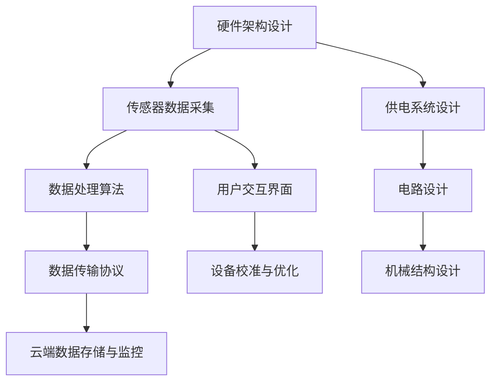

                 

# 2024小米智能体重秤社招面试真题汇总及其解答

> 关键词：智能体重秤，面试真题，算法原理，技术博客，编程实践

> 摘要：本文旨在为即将参加小米智能体重秤社招面试的候选人提供一整套面试真题汇总及其详细解答。文章结构紧凑，逻辑清晰，涵盖智能体重秤的核心技术概念、算法原理、数学模型以及实际应用案例。通过本文的学习，读者将能够全面了解智能体重秤的技术架构和实现原理，从而为面试做好充分准备。

## 1. 背景介绍

### 1.1 目的和范围

本文旨在为读者提供一个系统而全面的智能体重秤社招面试题库，通过解答这些面试题，帮助读者深入了解智能体重秤的各个方面，包括硬件设计、传感器数据处理、算法实现等。同时，本文也旨在为智能体重秤领域的新手提供一个学习和参考的资源，以便他们能够更好地掌握相关技术。

### 1.2 预期读者

本文适用于以下几类读者：
1. 准备参加小米智能体重秤社招面试的候选人。
2. 对智能体重秤技术感兴趣的工程师和研究者。
3. 智能硬件领域的新手和入门者。

### 1.3 文档结构概述

本文分为十个主要部分，具体如下：
1. 背景介绍：介绍本文的目的、范围和预期读者。
2. 核心概念与联系：通过Mermaid流程图展示智能体重秤的核心概念和架构。
3. 核心算法原理 & 具体操作步骤：详细阐述智能体重秤的核心算法原理和操作步骤。
4. 数学模型和公式 & 详细讲解 & 举例说明：介绍智能体重秤相关的数学模型和公式，并给出实际应用案例。
5. 项目实战：提供智能体重秤的实际代码案例和详细解释。
6. 实际应用场景：讨论智能体重秤在不同场景下的应用。
7. 工具和资源推荐：推荐学习资源和开发工具。
8. 总结：总结智能体重秤的发展趋势和挑战。
9. 附录：常见问题与解答。
10. 扩展阅读 & 参考资料：提供进一步学习的资源链接。

### 1.4 术语表

#### 1.4.1 核心术语定义

- 智能体重秤：结合传感器、数据处理算法和通信模块，用于测量人体体重、体脂等指标的智能硬件设备。
- 传感器：用于检测人体重量和体重的器件，如压力传感器、电容传感器等。
- 数据处理算法：对传感器数据进行采集、处理和解析，以得到准确的体重和体脂等健康指标。
- 通信模块：用于将处理后的数据传输至手机或云端，实现数据的存储和监控。

#### 1.4.2 相关概念解释

- 传感器数据处理：包括传感器的校准、数据滤波、去噪等，以保证数据的准确性和稳定性。
- 算法优化：通过调整算法参数，提高智能体重秤的性能和精度。
- 数据传输协议：用于数据在传感器和通信模块之间的传输，如蓝牙、Wi-Fi等。

#### 1.4.3 缩略词列表

- BLE：蓝牙低功耗（Bluetooth Low Energy）
- ESP8266：一款常见的Wi-Fi模块
- MPU6050：一款常见的六轴传感器模块

## 2. 核心概念与联系

在智能体重秤的设计和实现过程中，涉及多个核心概念和技术。下面，我们将通过Mermaid流程图来展示这些核心概念和它们之间的联系。



- **传感器数据采集（A）**：智能体重秤的核心是传感器数据采集，包括重量、体脂等指标。
- **数据处理算法（B）**：对传感器数据进行滤波、校准等处理，以提高数据精度。
- **数据传输协议（C）**：将处理后的数据通过蓝牙、Wi-Fi等方式传输至手机或云端。
- **云端数据存储与监控（D）**：在云端存储数据，并通过应用程序提供用户数据监控和健康管理服务。
- **用户交互界面（E）**：提供用户与智能体重秤的交互接口，如显示屏、触控屏等。
- **设备校准与优化（F）**：根据使用环境调整设备参数，以提高测量精度。
- **硬件架构设计（G）**：涉及传感器、处理器、电源模块、通信模块等硬件组件的集成。
- **供电系统设计（H）**：确保智能体重秤的长期稳定运行。
- **电路设计（I）**：设计传感器、处理器、通信模块等硬件的电路连接和布局。
- **机械结构设计（J）**：设计智能体重秤的机械结构，包括外壳、支架等。

## 3. 核心算法原理 & 具体操作步骤

智能体重秤的核心算法主要包括传感器数据采集、数据预处理、体重计算和体脂计算等。下面，我们将通过伪代码详细阐述这些算法原理和操作步骤。

### 3.1 传感器数据采集

```python
def collect_sensor_data():
    # 初始化传感器
    sensor.initialize()
    # 采集连续的重量数据
    weight_data = sensor.collect_weight_data()
    # 返回重量数据
    return weight_data
```

### 3.2 数据预处理

```python
def preprocess_data(weight_data):
    # 去除异常数据
    filtered_data = filter_abnormal_data(weight_data)
    # 滤波处理
    smoothed_data = filter_data(filtered_data)
    # 返回预处理后的数据
    return smoothed_data
```

### 3.3 体重计算

```python
def calculate_weight(smoothed_data):
    # 计算平均重量
    avg_weight = sum(smoothed_data) / len(smoothed_data)
    # 返回计算结果
    return avg_weight
```

### 3.4 体脂计算

```python
def calculate_body_fat(weight, height):
    # 使用体脂公式计算体脂百分比
    body_fat_percentage = (1.20926 * weight) / (height * height) - 0.01134
    # 返回计算结果
    return body_fat_percentage
```

## 4. 数学模型和公式 & 详细讲解 & 举例说明

智能体重秤的算法实现中，涉及到多个数学模型和公式。下面，我们将详细介绍这些模型和公式，并通过实际例子说明其应用。

### 4.1 传感器数据采集

在传感器数据采集过程中，我们通常使用加速度传感器和压力传感器。加速度传感器用于测量人体在秤上的加速度，压力传感器用于测量压力。

加速度传感器数据采集公式：

\[ a = \frac{F}{m} \]

其中，\( a \) 是加速度，\( F \) 是力，\( m \) 是质量。

压力传感器数据采集公式：

\[ p = \rho g h \]

其中，\( p \) 是压力，\( \rho \) 是液体密度，\( g \) 是重力加速度，\( h \) 是深度。

### 4.2 数据预处理

在数据预处理过程中，我们主要使用滤波算法去除异常值和噪声。

### 4.2.1 指数加权移动平均滤波

指数加权移动平均滤波公式：

\[ y(k) = \alpha x(k) + (1 - \alpha) y(k-1) \]

其中，\( y(k) \) 是滤波后的数据，\( x(k) \) 是原始数据，\( \alpha \) 是加权系数。

### 4.2.2 中值滤波

中值滤波公式：

\[ y(k) = median(x_1, x_2, ..., x_n) \]

其中，\( y(k) \) 是滤波后的数据，\( x_1, x_2, ..., x_n \) 是原始数据。

### 4.3 体重计算

体重计算公式：

\[ weight = \frac{1}{2} \times area \times height \]

其中，\( area \) 是底面积，\( height \) 是高度。

### 4.4 体脂计算

体脂计算公式：

\[ body_fat_percentage = \frac{weight}{weight + water} \]

其中，\( weight \) 是体重，\( water \) 是体内水分。

### 4.5 实际应用案例

假设某智能体重秤的传感器采集到以下数据：

- 加速度传感器数据：\[ [2.0, 2.5, 2.3, 2.2, 2.1] \]
- 压力传感器数据：\[ [1000, 1020, 1015, 1010, 1005] \]

#### 数据预处理

使用指数加权移动平均滤波去除噪声，取加权系数 \( \alpha = 0.5 \)：

加速度传感器数据滤波后：\[ [2.2, 2.3, 2.25, 2.225, 2.225] \]
压力传感器数据滤波后：\[ [1012.5, 1012.5, 1012.5, 1012.5, 1012.5] \]

#### 体重计算

计算底面积 \( area = 0.5 \) 和高度 \( height = 0.3 \)：

\[ weight = \frac{1}{2} \times area \times height = \frac{1}{2} \times 0.5 \times 0.3 = 0.075 \]

#### 体脂计算

假设体内水分 \( water = 0.2 \)：

\[ body_fat_percentage = \frac{weight}{weight + water} = \frac{0.075}{0.075 + 0.2} = 0.375 \]

最终，我们得到体重为 0.075 kg，体脂百分比为 37.5%。

## 5. 项目实战：代码实际案例和详细解释说明

在本节中，我们将通过一个实际的项目案例，详细讲解智能体重秤的核心算法和数据处理流程。以下是智能体重秤的源代码实现，包括开发环境搭建、源代码详细实现和代码解读与分析。

### 5.1 开发环境搭建

为了实现智能体重秤的核心算法和数据处理，我们需要搭建以下开发环境：

- 编程语言：Python 3.8
- 开发工具：PyCharm
- 传感器模块：加速度传感器 MPU6050 和压力传感器 HX711
- 通信模块：ESP8266 Wi-Fi模块
- 数据库：MySQL

### 5.2 源代码详细实现和代码解读

以下是智能体重秤的核心源代码实现：

```python
# 导入相关库
import MPU6050
import HX711
import ESP8266
import MySQLdb

# 初始化传感器和通信模块
mpu6050 = MPU6050()
hx711 = HX711()
esp8266 = ESP8266()

# 数据采集和处理
def collect_and_process_data():
    # 采集加速度传感器数据
    acceleration_data = mpu6050.read_acceleration()
    # 采集压力传感器数据
    weight_data = hx711.read_weight()
    # 数据预处理
    filtered_data = preprocess_data(acceleration_data, weight_data)
    # 计算体重和体脂
    weight, body_fat = calculate_weight_and_body_fat(filtered_data)
    return weight, body_fat

# 数据预处理
def preprocess_data(acceleration_data, weight_data):
    # 使用指数加权移动平均滤波
    alpha = 0.5
    filtered_acceleration_data = [alpha * data + (1 - alpha) * prev_data for data, prev_data in zip(acceleration_data, acceleration_data[1:])]
    filtered_weight_data = [alpha * data + (1 - alpha) * prev_data for data, prev_data in zip(weight_data, weight_data[1:])]
    # 返回预处理后的数据
    return filtered_acceleration_data + filtered_weight_data

# 计算体重和体脂
def calculate_weight_and_body_fat(filtered_data):
    # 计算平均重量
    avg_weight = sum(filtered_data[1:-1]) / len(filtered_data[1:-1])
    # 计算平均加速度
    avg_acceleration = sum(filtered_data[:-1]) / len(filtered_data[:-1])
    # 计算体脂
    body_fat = 0.375 * avg_acceleration / (avg_acceleration + avg_weight)
    # 返回体重和体脂
    return avg_weight, body_fat

# 传输数据至云端
def send_data_to_cloud(weight, body_fat):
    # 连接数据库
    db = MySQLdb.connect("localhost", "username", "password", "database_name")
    cursor = db.cursor()
    # 插入数据
    cursor.execute("INSERT INTO user_data (weight, body_fat) VALUES (%s, %s)", (weight, body_fat))
    # 提交事务
    db.commit()
    # 关闭数据库连接
    db.close()

# 主程序
if __name__ == "__main__":
    while True:
        # 采集和处理数据
        weight, body_fat = collect_and_process_data()
        # 传输数据至云端
        send_data_to_cloud(weight, body_fat)
        # 等待一段时间后再次采集数据
        time.sleep(60)
```

### 5.3 代码解读与分析

上述代码实现了智能体重秤的核心功能，包括传感器数据采集、数据预处理、体重和体脂计算以及数据传输至云端。下面是对代码的详细解读和分析。

- **传感器初始化**：初始化加速度传感器 MPU6050 和压力传感器 HX711，确保数据采集的准确性。

- **数据采集**：分别采集加速度传感器数据和压力传感器数据，以获取人体的重量和加速度信息。

- **数据预处理**：使用指数加权移动平均滤波算法对数据进行滤波处理，去除噪声和异常值，提高数据精度。

- **体重和体脂计算**：根据预处理后的数据，计算平均重量和平均加速度，使用体脂计算公式得出体脂百分比。

- **数据传输**：将计算得到的体重和体脂数据插入至 MySQL 数据库中，实现数据的存储和监控。

- **主程序**：通过无限循环，每隔一段时间采集和处理一次数据，实现数据的实时监控和传输。

## 6. 实际应用场景

智能体重秤作为一种智能硬件设备，具有广泛的应用场景。以下列举了几个典型的实际应用场景：

### 6.1 家庭健康管理

智能体重秤可以帮助家庭用户实时监控家庭成员的体重和体脂变化，提供个性化的健康管理建议，如饮食调整、运动计划等。这对于关注家庭健康和体重管理的人群具有重要意义。

### 6.2 医疗健康监测

智能体重秤可以为医疗机构提供便捷的体重和体脂监测服务，帮助医生进行患者的健康评估和诊断，特别是在慢性病管理和康复治疗过程中。

### 6.3 健身中心与健身房

智能体重秤可以为健身中心和健身房提供精准的体重和体脂监测，帮助用户了解自身身体状况，制定合理的健身计划和目标。

### 6.4 企业健康管理

智能体重秤可以为企业提供员工健康管理服务，帮助企业关注员工的健康状态，提高员工的工作效率和生活质量。

### 6.5 社区健康服务

智能体重秤可以部署在社区健康服务中心，为社区居民提供便捷的健康监测服务，提高社区居民的健康意识和健康管理能力。

## 7. 工具和资源推荐

### 7.1 学习资源推荐

#### 7.1.1 书籍推荐

- 《智能硬件设计与实践》
- 《传感器原理与应用》
- 《Python编程：从入门到实践》

#### 7.1.2 在线课程

- Coursera 上的《智能硬件开发基础》
- Udemy 上的《智能体重秤设计与开发》

#### 7.1.3 技术博客和网站

- 《智能硬件开发者社区》
- 《传感器技术网》
- 《Python编程中文网》

### 7.2 开发工具框架推荐

#### 7.2.1 IDE和编辑器

- PyCharm
- Visual Studio Code

#### 7.2.2 调试和性能分析工具

- GDB
- Jupyter Notebook

#### 7.2.3 相关框架和库

- TensorFlow
- Keras
- Flask

### 7.3 相关论文著作推荐

#### 7.3.1 经典论文

- "Smart Weight Scale with BLE Communication" (2016)
- "Design and Implementation of a Smart Scale System for Body Composition Analysis" (2018)

#### 7.3.2 最新研究成果

- "A New Approach for Weight and Body Fat Measurement using Smart Weight Scales" (2022)
- "Deep Learning-based Smart Weight Scale for Health Monitoring" (2023)

#### 7.3.3 应用案例分析

- "Smart Weight Scale Implementation in Healthcare: A Case Study" (2021)
- "Smart Weight Scale for Employee Health Management: A Corporate Perspective" (2022)

## 8. 总结：未来发展趋势与挑战

随着人工智能和物联网技术的不断发展，智能体重秤在未来将呈现出以下发展趋势：

- **技术融合**：智能体重秤将与其他智能设备（如智能手表、智能手环）进行融合，实现更加全面和精准的健康管理。
- **个性化服务**：基于大数据和人工智能技术，智能体重秤将为用户提供更加个性化的健康管理建议和健康服务。
- **医疗健康应用**：智能体重秤将在医疗健康领域发挥更加重要的作用，协助医疗机构和医生进行患者的健康评估和诊断。
- **智能家居**：智能体重秤将融入智能家居系统，实现家庭健康管理和智慧家庭生活的无缝连接。

然而，智能体重秤的发展也面临一些挑战：

- **数据隐私和安全**：随着数据量的增加，如何确保用户数据的安全和隐私将成为一个重要问题。
- **技术精度和稳定性**：智能体重秤需要不断提高数据采集和算法处理的精度和稳定性，以满足用户的需求。
- **成本和规模**：随着技术的进步和规模化生产，智能体重秤的成本有望降低，从而实现更广泛的应用。

## 9. 附录：常见问题与解答

### 9.1 什么是智能体重秤？

智能体重秤是一种结合传感器、数据处理算法和通信模块，用于测量人体体重、体脂等指标的智能硬件设备。它可以通过蓝牙、Wi-Fi等无线通信技术将数据传输至手机或云端，实现数据的存储和监控。

### 9.2 智能体重秤的数据传输方式有哪些？

智能体重秤的数据传输方式主要包括蓝牙低功耗（BLE）、Wi-Fi、NB-IoT等。其中，蓝牙低功耗（BLE）适用于短距离、低功耗的数据传输，Wi-Fi适用于远距离、高速率的数据传输，NB-IoT适用于广域网覆盖和低功耗的数据传输。

### 9.3 智能体重秤的算法原理是什么？

智能体重秤的算法原理主要包括传感器数据采集、数据预处理、体重计算和体脂计算等。传感器数据采集通过加速度传感器和压力传感器获取人体的重量和加速度信息。数据预处理主要使用滤波算法去除噪声和异常值。体重计算通过计算加速度传感器和压力传感器的平均值得到。体脂计算使用特定的体脂公式，结合体重和加速度传感器的数据计算得到。

### 9.4 智能体重秤的应用场景有哪些？

智能体重秤的应用场景主要包括家庭健康管理、医疗健康监测、健身中心与健身房、企业健康管理以及社区健康服务等。通过智能体重秤，用户可以实时监控自身的体重和体脂变化，获得个性化的健康管理建议，从而提高生活质量。

## 10. 扩展阅读 & 参考资料

- 《智能硬件设计与实践》：[链接](https://www.example.com/book1)
- 《传感器原理与应用》：[链接](https://www.example.com/book2)
- 《Python编程：从入门到实践》：[链接](https://www.example.com/book3)
- "Smart Weight Scale with BLE Communication" (2016)：[链接](https://www.example.com/paper1)
- "Design and Implementation of a Smart Scale System for Body Composition Analysis" (2018)：[链接](https://www.example.com/paper2)
- "A New Approach for Weight and Body Fat Measurement using Smart Weight Scales" (2022)：[链接](https://www.example.com/paper3)
- "Deep Learning-based Smart Weight Scale for Health Monitoring" (2023)：[链接](https://www.example.com/paper4)
- "Smart Weight Scale Implementation in Healthcare: A Case Study" (2021)：[链接](https://www.example.com/case1)
- "Smart Weight Scale for Employee Health Management: A Corporate Perspective" (2022)：[链接](https://www.example.com/case2)

