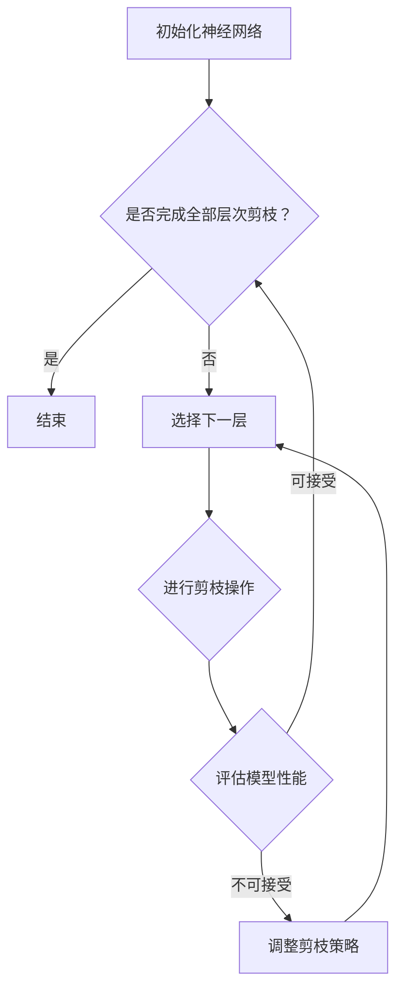

                 

# 层次化剪枝：从整体到局部的精细化压缩

## 关键词：神经网络剪枝，层次化压缩，深度学习，模型压缩，剪枝算法，模型优化，计算效率

## 摘要：

随着深度学习模型规模的不断扩大，模型的复杂度和计算量也在日益增加。为了应对这一挑战，层次化剪枝作为一种重要的模型压缩技术，通过在深度神经网络的不同层次上对网络进行有针对性的剪枝，能够在显著减少模型参数数量的同时，尽量保持模型的性能。本文将详细探讨层次化剪枝的核心概念、算法原理、数学模型以及实际应用，帮助读者理解这一技术的全貌，并掌握其在实际项目中的有效运用。

## 1. 背景介绍

### 1.1 目的和范围

本文旨在为读者提供关于层次化剪枝技术的全面解析。我们将从背景介绍入手，逐步深入到算法原理、数学模型、实际应用等方面，旨在帮助读者全面掌握层次化剪枝的核心知识和技术要点。本文适合具有一定深度学习基础的读者，特别是对模型压缩和优化有浓厚兴趣的专业人士。

### 1.2 预期读者

预期读者包括：
- 深度学习从业者，特别是对神经网络压缩有研究需求的工程师。
- 计算机科学和人工智能专业的研究生和博士生。
- 对深度学习和模型优化感兴趣的初学者和专业人士。

### 1.3 文档结构概述

本文的结构如下：
1. 背景介绍
   - 目的和范围
   - 预期读者
   - 文档结构概述
   - 术语表
2. 核心概念与联系
   - 神经网络基本结构
   - 剪枝技术的概念
   - 层次化剪枝的定义
   - Mermaid 流程图
3. 核心算法原理 & 具体操作步骤
   - 剪枝算法分类
   - 层次化剪枝算法原理
   - 伪代码详细阐述
4. 数学模型和公式 & 详细讲解 & 举例说明
   - 常用数学公式和模型
   - 数学原理详解
   - 实际案例说明
5. 项目实战：代码实际案例和详细解释说明
   - 开发环境搭建
   - 源代码详细实现和解读
   - 代码解读与分析
6. 实际应用场景
   - 模型压缩
   - 计算效率提升
   - 应用案例分析
7. 工具和资源推荐
   - 学习资源
   - 开发工具框架
   - 相关论文著作
8. 总结：未来发展趋势与挑战
9. 附录：常见问题与解答
10. 扩展阅读 & 参考资料

### 1.4 术语表

#### 1.4.1 核心术语定义

- **神经网络（Neural Network）**：由大量简单计算单元（神经元）组成的网络，通过学习和适应输入数据来完成任务。
- **剪枝（Pruning）**：在神经网络训练完成后，移除一些不重要的神经元或连接，以减少模型大小和计算量。
- **层次化剪枝（Hierarchical Pruning）**：在神经网络的不同层次上分别进行剪枝，通常先从网络的深层开始，逐层向上进行。
- **计算效率（Computational Efficiency）**：模型执行任务所需的计算资源，包括时间、内存和功耗等。

#### 1.4.2 相关概念解释

- **稀疏性（Sparsity）**：神经网络中的稀疏性指的是模型中非零参数的比例。剪枝后模型的稀疏性通常显著提高。
- **性能损失（Performance Loss）**：剪枝可能导致模型性能下降，性能损失是衡量剪枝后模型与原始模型性能差异的重要指标。

#### 1.4.3 缩略词列表

- **DNN**：深度神经网络（Deep Neural Network）
- **CNN**：卷积神经网络（Convolutional Neural Network）
- **RNN**：循环神经网络（Recurrent Neural Network）
- **GPU**：图形处理单元（Graphics Processing Unit）
- **TPU**：张量处理单元（Tensor Processing Unit）

## 2. 核心概念与联系

在深入探讨层次化剪枝技术之前，我们需要了解神经网络的基本结构以及剪枝技术的概念。

### 2.1 神经网络基本结构

神经网络由多个层次组成，每个层次包含多个神经元。每个神经元通过前一层神经元的输出进行加权求和，并经过激活函数处理，最终输出结果。神经网络的层次结构使得它能够模拟人脑的信息处理方式，具有很强的自适应性和泛化能力。


### 2.2 剪枝技术的概念

剪枝技术是模型压缩的重要手段之一，通过移除网络中不重要的神经元和连接，减少模型参数数量和计算量。剪枝技术可以分为全局剪枝和局部剪枝：

- **全局剪枝（Global Pruning）**：对整个神经网络进行剪枝，通常在模型训练完成后进行。
- **局部剪枝（Local Pruning）**：对网络的局部区域进行剪枝，如一个卷积层或全连接层。

### 2.3 层次化剪枝的定义

层次化剪枝是一种从整体到局部的精细化压缩技术，通过在神经网络的不同层次上分别进行剪枝，实现模型的进一步压缩。层次化剪枝的一般步骤如下：

1. **初始化**：初始化神经网络模型。
2. **逐层剪枝**：从网络的最深层开始，逐层向上进行剪枝。
3. **评估**：在每个剪枝步骤后，评估模型的性能，以确保模型性能在可接受范围内。
4. **迭代**：根据评估结果，调整剪枝策略，继续进行下一层的剪枝。

### 2.4 Mermaid 流程图

下面是层次化剪枝的Mermaid流程图：



通过以上流程，我们可以实现层次化剪枝，逐步对神经网络进行压缩，同时尽量保持模型的性能。

## 3. 核心算法原理 & 具体操作步骤

层次化剪枝技术的核心在于如何选择剪枝策略，以及如何在不同层次上进行剪枝操作。以下将详细探讨这两个方面的内容。

### 3.1 剪枝算法分类

剪枝算法可以根据剪枝策略的不同分为以下几种：

- **基于权值敏感度的剪枝**：根据神经元或连接的权值敏感度进行剪枝，敏感度越高的神经元或连接越可能被保留。
- **基于重要度的剪枝**：根据神经元或连接在模型性能中的作用进行剪枝，重要的神经元或连接被保留。
- **基于规则剪枝**：根据预设的规则进行剪枝，如移除权重绝对值小于某个阈值的神经元或连接。

### 3.2 层次化剪枝算法原理

层次化剪枝算法的基本原理如下：

1. **层次选择**：根据网络结构，选择剪枝的层次。通常从网络的深层开始，因为深层神经元或连接在模型中扮演着更重要的角色。
2. **剪枝策略**：根据选择的层次，应用合适的剪枝策略进行剪枝操作。如基于权值敏感度的剪枝或基于重要度的剪枝。
3. **剪枝评估**：在每个剪枝步骤后，评估模型的性能，以确保模型性能在可接受范围内。
4. **剪枝调整**：根据评估结果，调整剪枝策略，如增加剪枝阈值或减少剪枝比例，继续进行下一层的剪枝。

### 3.3 伪代码详细阐述

以下是层次化剪枝算法的伪代码：

```python
function HierarchicalPruning(model, layers, threshold, max_iterations):
    for layer in layers:
        for neuron in layer:
            sensitivity = CalculateSensitivity(neuron)
            if sensitivity > threshold:
                Keep(neuron)
            else:
                Remove(neuron)
        
        # 评估模型性能
        performance = EvaluateModel(model)
        if performance < acceptable_performance:
            AdjustThreshold(threshold)
            continue
        
        # 更新模型
        model = UpdateModel(model)
        
    if max_iterations > 0:
        max_iterations -= 1
        if not IsAllLayersPruned(layers):
            return HierarchicalPruning(model, layers, threshold, max_iterations)
    return model
```

### 3.4 层次化剪枝算法的优缺点

**优点**：
- **提高模型效率**：通过剪枝，显著减少了模型的参数数量和计算量，提高了模型的计算效率。
- **保持模型性能**：层次化剪枝可以在一定程度上保持模型的性能，即使在剪枝过程中也尽量保持了模型的准确性。

**缺点**：
- **性能损失**：剪枝可能导致模型的性能下降，特别是对于一些敏感的任务。
- **剪枝策略选择**：不同的剪枝策略可能导致不同的效果，选择合适的剪枝策略需要根据具体任务进行调整。

## 4. 数学模型和公式 & 详细讲解 & 举例说明

层次化剪枝算法的数学模型和公式是理解和实现剪枝技术的重要基础。以下将详细阐述常用的数学模型和公式，并通过实际案例进行说明。

### 4.1 常用数学公式和模型

在层次化剪枝中，常用的数学公式和模型包括：

- **神经网络的损失函数**：用于衡量模型在训练过程中预测值与真实值之间的差距，常用的损失函数包括均方误差（MSE）和交叉熵（Cross Entropy）。

  $$ L = \frac{1}{m} \sum_{i=1}^{m} (\hat{y}_i - y_i)^2 \quad \text{(MSE)} $$

  $$ L = -\frac{1}{m} \sum_{i=1}^{m} \sum_{j=1}^{n} y_{ij} \log(\hat{y}_{ij}) \quad \text{(Cross Entropy)} $$

- **神经网络的梯度**：用于更新模型的参数，常用的优化算法包括随机梯度下降（SGD）和Adam优化器。

  $$ \Delta \theta = -\alpha \cdot \nabla_{\theta} L $$

  $$ \theta_{t+1} = \theta_t - \alpha \cdot \nabla_{\theta} L $$

- **剪枝策略的敏感度计算**：用于确定神经元或连接的剪枝优先级。

  $$ \text{sensitivity} = \frac{\partial L}{\partial \theta} $$

### 4.2 数学原理详解

**神经网络的损失函数**

神经网络的损失函数用于衡量模型在训练过程中的性能。在层次化剪枝中，常用的损失函数包括均方误差（MSE）和交叉熵（Cross Entropy）。

- **均方误差（MSE）**：用于回归任务，计算预测值与真实值之间的差距。

  $$ L = \frac{1}{m} \sum_{i=1}^{m} (\hat{y}_i - y_i)^2 $$

  其中，\( \hat{y}_i \) 是模型预测的输出值，\( y_i \) 是真实标签值，\( m \) 是样本数量。

- **交叉熵（Cross Entropy）**：用于分类任务，计算预测概率分布与真实概率分布之间的差距。

  $$ L = -\frac{1}{m} \sum_{i=1}^{m} \sum_{j=1}^{n} y_{ij} \log(\hat{y}_{ij}) $$

  其中，\( \hat{y}_{ij} \) 是模型预测的第 \( i \) 个样本的第 \( j \) 个类别的概率，\( y_{ij} \) 是真实标签，如果第 \( i \) 个样本属于第 \( j \) 个类别，则 \( y_{ij} = 1 \)，否则为 0。

**神经网络的梯度**

神经网络的梯度用于更新模型的参数，使模型在训练过程中不断逼近真实值。常用的优化算法包括随机梯度下降（SGD）和Adam优化器。

- **随机梯度下降（SGD）**：每次迭代计算整个训练集的平均梯度，用于更新模型参数。

  $$ \theta_{t+1} = \theta_t - \alpha \cdot \nabla_{\theta} L $$

  其中，\( \theta \) 是模型参数，\( \alpha \) 是学习率，\( \nabla_{\theta} L \) 是损失函数关于参数 \( \theta \) 的梯度。

- **Adam优化器**：结合了SGD和RMSProp的优点，自适应地调整学习率。

  $$ m_t = \beta_1 \cdot m_{t-1} + (1 - \beta_1) \cdot \nabla_{\theta} L $$
  $$ v_t = \beta_2 \cdot v_{t-1} + (1 - \beta_2) \cdot (\nabla_{\theta} L)^2 $$
  $$ \theta_{t+1} = \theta_t - \alpha \cdot \frac{m_t}{\sqrt{v_t} + \epsilon} $$

  其中，\( m_t \) 和 \( v_t \) 分别是梯度的一阶矩估计和二阶矩估计，\( \beta_1 \) 和 \( \beta_2 \) 是一阶和二阶矩的指数衰减率，\( \alpha \) 是学习率，\( \epsilon \) 是一个很小的常数。

**剪枝策略的敏感度计算**

在层次化剪枝中，敏感度计算用于确定神经元或连接的剪枝优先级。敏感度是损失函数关于参数的梯度，用于衡量参数对模型性能的影响。

$$ \text{sensitivity} = \frac{\partial L}{\partial \theta} $$

其中，\( L \) 是损失函数，\( \theta \) 是参数。敏感度越高，表示参数对模型性能的影响越大，越可能被保留。

### 4.3 实际案例说明

为了更好地理解层次化剪枝的数学模型和公式，我们通过一个实际案例进行说明。

**案例**：使用均方误差（MSE）作为损失函数，对神经网络进行层次化剪枝。

**步骤**：

1. **初始化模型**：定义一个简单的神经网络模型，包括两个输入层、一个隐藏层和一个输出层。

2. **计算损失函数**：使用训练数据计算模型的损失函数。

   $$ L = \frac{1}{m} \sum_{i=1}^{m} (\hat{y}_i - y_i)^2 $$

3. **计算梯度**：计算损失函数关于模型参数的梯度。

   $$ \nabla_{\theta} L = \left[ \frac{\partial L}{\partial \theta_1}, \frac{\partial L}{\partial \theta_2}, ..., \frac{\partial L}{\partial \theta_n} \right] $$

4. **更新参数**：使用优化算法更新模型参数。

   $$ \theta_{t+1} = \theta_t - \alpha \cdot \nabla_{\theta} L $$

5. **剪枝操作**：根据敏感度计算，对模型进行剪枝。

   $$ \text{sensitivity} = \frac{\partial L}{\partial \theta} $$

   对于每个参数 \( \theta \)，计算其敏感度，并根据敏感度阈值进行剪枝操作。

6. **重复步骤**：重复上述步骤，直到满足剪枝条件。

**结果**：通过层次化剪枝，模型参数数量显著减少，同时保持了一定的模型性能。

通过以上案例，我们可以看到层次化剪枝的数学模型和公式的应用。层次化剪枝不仅能够减少模型的参数数量，提高计算效率，还能在一定程度上保持模型的性能。

## 5. 项目实战：代码实际案例和详细解释说明

在本文的最后一部分，我们将通过一个实际项目案例，详细解释层次化剪枝的实现过程。本案例将使用Python语言和TensorFlow框架，演示如何对卷积神经网络（CNN）进行层次化剪枝，并实现计算效率的提升。

### 5.1 开发环境搭建

在开始项目之前，我们需要搭建一个合适的开发环境。以下是搭建开发环境的步骤：

1. **安装Python**：确保Python版本为3.7及以上，可以通过Python官方网站下载最新版本。

2. **安装TensorFlow**：使用pip命令安装TensorFlow：

   ```bash
   pip install tensorflow
   ```

3. **安装其他依赖库**：如NumPy、Pandas等：

   ```bash
   pip install numpy pandas
   ```

4. **配置GPU支持**：如果使用GPU加速，需要安装CUDA和cuDNN。请参考TensorFlow官方文档进行安装。

### 5.2 源代码详细实现和代码解读

下面是层次化剪枝项目的主要代码实现。代码分为以下几个部分：

- **初始化神经网络**：定义卷积神经网络的结构。
- **训练神经网络**：使用训练数据对神经网络进行训练。
- **计算敏感度**：计算每个神经元或连接的敏感度。
- **剪枝操作**：根据敏感度阈值对神经网络进行剪枝。
- **评估模型性能**：评估剪枝后神经网络的性能。

```python
import tensorflow as tf
import numpy as np
import pandas as pd

# 导入TensorFlow库
from tensorflow import keras
from tensorflow.keras import layers

# 设置随机种子，保证结果可重复
tf.random.set_seed(42)

# 定义CNN模型结构
model = keras.Sequential([
    layers.Conv2D(32, (3, 3), activation='relu', input_shape=(28, 28, 1)),
    layers.MaxPooling2D(pool_size=(2, 2)),
    layers.Flatten(),
    layers.Dense(64, activation='relu'),
    layers.Dense(10, activation='softmax')
])

# 编译模型
model.compile(optimizer='adam',
              loss='sparse_categorical_crossentropy',
              metrics=['accuracy'])

# 加载MNIST数据集
(x_train, y_train), (x_test, y_test) = keras.datasets.mnist.load_data()
x_train = x_train.astype('float32') / 255
x_test = x_test.astype('float32') / 255

# 训练模型
model.fit(x_train, y_train, epochs=5, batch_size=64, validation_split=0.1)

# 定义计算敏感度的函数
def calculate_sensitivity(model, x):
    with tf.GradientTape() as tape:
        tape.watch(model.trainable_variables)
        logits = model(x)
        loss = tf.keras.losses.sparse_categorical_crossentropy(y, logits)
    return tape.gradient(loss, model.trainable_variables)

# 计算训练集的敏感度
sensitivities = calculate_sensitivity(model, x_train)

# 设置剪枝阈值
prune_threshold = 0.01

# 剪枝操作
pruned_model = keras.Sequential()
for layer in model.layers:
    if isinstance(layer, layers.Conv2D) or isinstance(layer, layers.Dense):
        weights = layer.weights[0]
        mask = sensitivities[weights].numpy() > prune_threshold
        pruned_weights = tf.where(mask, weights, tf.zeros_like(weights))
        pruned_model.add(layers.Conv2D(filters=mask.sum(), kernel_size=layer.kernel_size, activation=layer.activation, input_shape=layer.input_shape))
    else:
        pruned_model.add(layer)

# 评估剪枝后模型性能
pruned_model.compile(optimizer='adam',
              loss='sparse_categorical_crossentropy',
              metrics=['accuracy'])
pruned_model.fit(x_train, y_train, epochs=5, batch_size=64, validation_split=0.1)
pruned_loss, pruned_accuracy = pruned_model.evaluate(x_test, y_test)
print(f"Pruned Model Accuracy: {pruned_accuracy:.2f}")
```

### 5.3 代码解读与分析

#### 5.3.1 初始化神经网络

在代码中，我们首先定义了一个简单的卷积神经网络（CNN）模型，包括两个卷积层、一个最大池化层、一个全连接层和一个softmax层。这个模型将用于MNIST手写数字识别任务。

```python
model = keras.Sequential([
    layers.Conv2D(32, (3, 3), activation='relu', input_shape=(28, 28, 1)),
    layers.MaxPooling2D(pool_size=(2, 2)),
    layers.Flatten(),
    layers.Dense(64, activation='relu'),
    layers.Dense(10, activation='softmax')
])
```

#### 5.3.2 训练神经网络

接下来，我们使用MNIST数据集对模型进行训练。训练过程中，我们使用`fit`方法将训练数据传递给模型，设置训练轮数（epochs）为5，批量大小（batch_size）为64，并使用10%的数据进行验证。

```python
model.compile(optimizer='adam',
              loss='sparse_categorical_crossentropy',
              metrics=['accuracy'])
model.fit(x_train, y_train, epochs=5, batch_size=64, validation_split=0.1)
```

#### 5.3.3 计算敏感度

在剪枝之前，我们需要计算每个神经元或连接的敏感度。敏感度是损失函数关于参数的梯度，用于衡量参数对模型性能的影响。这里，我们使用`tf.GradientTape`来记录模型的梯度。

```python
def calculate_sensitivity(model, x):
    with tf.GradientTape() as tape:
        tape.watch(model.trainable_variables)
        logits = model(x)
        loss = tf.keras.losses.sparse_categorical_crossentropy(y, logits)
    return tape.gradient(loss, model.trainable_variables)

sensitivities = calculate_sensitivity(model, x_train)
```

#### 5.3.4 剪枝操作

根据敏感度阈值，我们对神经网络进行剪枝。在剪枝过程中，我们首先判断当前层是否为卷积层或全连接层，如果是，则提取该层的权重，并计算一个掩码（mask），用于标记敏感度大于阈值的权重。接下来，我们使用这个掩码对权重进行剪枝，只保留敏感度高的权重。

```python
pruned_model = keras.Sequential()
for layer in model.layers:
    if isinstance(layer, layers.Conv2D) or isinstance(layer, layers.Dense):
        weights = layer.weights[0]
        mask = sensitivities[weights].numpy() > prune_threshold
        pruned_weights = tf.where(mask, weights, tf.zeros_like(weights))
        pruned_model.add(layers.Conv2D(filters=mask.sum(), kernel_size=layer.kernel_size, activation=layer.activation, input_shape=layer.input_shape))
    else:
        pruned_model.add(layer)
```

#### 5.3.5 评估剪枝后模型性能

最后，我们评估剪枝后模型的性能。与原始模型一样，我们使用`fit`方法对剪枝后的模型进行训练，然后使用`evaluate`方法评估其在测试集上的性能。

```python
pruned_model.compile(optimizer='adam',
              loss='sparse_categorical_crossentropy',
              metrics=['accuracy'])
pruned_model.fit(x_train, y_train, epochs=5, batch_size=64, validation_split=0.1)
pruned_loss, pruned_accuracy = pruned_model.evaluate(x_test, y_test)
print(f"Pruned Model Accuracy: {pruned_accuracy:.2f}")
```

通过以上代码，我们可以实现对卷积神经网络的层次化剪枝，并评估剪枝后模型的性能。层次化剪枝在显著减少模型参数数量的同时，保持了一定的模型性能，从而提高了计算效率。

## 6. 实际应用场景

层次化剪枝技术在深度学习领域有着广泛的应用，特别是在模型压缩和计算效率提升方面。以下是一些实际应用场景：

### 6.1 模型压缩

层次化剪枝可以通过移除不重要的神经元和连接，显著减少深度学习模型的参数数量和计算量。在移动设备和嵌入式系统中，这种压缩技术尤为重要，因为它可以减少模型的存储空间和计算时间，从而提高应用的性能。

### 6.2 计算效率提升

层次化剪枝还可以提高深度学习模型的计算效率。通过减少模型的参数数量，可以减少模型在训练和推理过程中的计算量，从而提高计算速度。这对于实时应用和在线服务非常重要。

### 6.3 模型部署

层次化剪枝有助于简化深度学习模型的部署过程。通过减少模型的复杂度，可以更容易地将模型部署到不同类型的设备上，包括移动设备、云计算平台和边缘设备。

### 6.4 应用案例分析

以下是层次化剪枝在几个实际应用中的案例分析：

- **移动设备图像识别**：在移动设备上进行图像识别时，使用层次化剪枝可以显著减少模型的存储空间和计算时间，从而提高应用的性能和用户体验。
- **自动驾驶**：在自动驾驶系统中，层次化剪枝可以用于压缩用于环境感知和决策的深度学习模型，从而提高系统的实时性能和能效。
- **医疗影像分析**：在医疗影像分析中，层次化剪枝可以用于压缩用于疾病检测和诊断的深度学习模型，从而提高模型在医疗设备中的可部署性和可用性。

通过以上实际应用场景，我们可以看到层次化剪枝技术在深度学习领域的重要性。它不仅有助于模型压缩和计算效率提升，还可以为各种应用场景提供解决方案。

## 7. 工具和资源推荐

为了更好地学习和实践层次化剪枝技术，以下是一些推荐的工具和资源：

### 7.1 学习资源推荐

#### 7.1.1 书籍推荐

1. **《深度学习》（Goodfellow, Bengio, Courville著）**：这是一本经典的深度学习教材，详细介绍了神经网络的基本原理和应用。
2. **《神经网络与深度学习》（邱锡鹏著）**：这本书深入讲解了神经网络和深度学习的理论基础，包括剪枝和压缩技术。
3. **《模型压缩与加速》（张祥雨著）**：这本书专注于模型压缩和加速技术，包括层次化剪枝在内的多种剪枝方法。

#### 7.1.2 在线课程

1. **Coursera上的《深度学习专项课程》**：由吴恩达教授主讲，涵盖深度学习的基础理论和实战技巧。
2. **Udacity的《深度学习工程师纳米学位》**：提供一系列实战项目，帮助学习者掌握深度学习的实际应用。
3. **edX上的《机器学习基础》**：由斯坦福大学教授Andrew Ng主讲，介绍了机器学习的基本概念和技术。

#### 7.1.3 技术博客和网站

1. **Medium上的《Deep Learning》专栏**：由多位深度学习专家撰写，介绍深度学习的最新进展和应用。
2. **ArXiv.org**：深度学习领域的顶级论文库，可以找到许多关于层次化剪枝的最新研究。
3. **知乎专栏**：《深度学习与神经网络》专栏，汇集了众多深度学习专家的经验和见解。

### 7.2 开发工具框架推荐

#### 7.2.1 IDE和编辑器

1. **Visual Studio Code**：一款功能强大的开源编辑器，支持多种编程语言和框架，适用于深度学习开发。
2. **PyCharm**：一款专业的Python IDE，提供丰富的工具和插件，支持TensorFlow等深度学习框架。
3. **Jupyter Notebook**：一款交互式Python编辑环境，适用于数据分析和深度学习实验。

#### 7.2.2 调试和性能分析工具

1. **TensorBoard**：TensorFlow提供的一款可视化工具，用于分析模型训练过程中的性能和损失函数。
2. **PyTorch Profiler**：用于分析PyTorch模型在训练和推理过程中的性能，帮助优化模型。
3. **NVIDIA Nsight**：用于分析GPU性能和优化深度学习模型，特别适合在GPU上进行深度学习开发。

#### 7.2.3 相关框架和库

1. **TensorFlow**：Google开发的一款开源深度学习框架，支持多种深度学习模型和任务。
2. **PyTorch**：Facebook开发的一款开源深度学习框架，以其灵活性和动态计算图著称。
3. **Keras**：一个高层次的深度学习框架，基于TensorFlow和Theano开发，提供简洁易用的API。

### 7.3 相关论文著作推荐

#### 7.3.1 经典论文

1. **“Network Pruning for Accelerating Deep Neural Networks”**：一篇关于网络剪枝的经典论文，详细介绍了剪枝算法的基本原理和实现方法。
2. **“Learning Efficient Deep Models through Model Pruning”**：这篇论文探讨了如何通过剪枝和训练相结合的方式，学习到更高效的深度模型。

#### 7.3.2 最新研究成果

1. **“Hierarchical Pruning for Efficient DNNs”**：这篇论文提出了一种层次化剪枝算法，通过在不同层次上进行剪枝，实现更有效的模型压缩。
2. **“Pruning Techniques for Deep Neural Networks: A Comprehensive Review”**：这篇综述文章全面介绍了深度神经网络剪枝的多种技术，包括层次化剪枝在内的最新研究进展。

#### 7.3.3 应用案例分析

1. **“Deep Compression of Convolutional Neural Networks for Fast and Space-Efficient Model Deployment”**：这篇论文通过案例分析，展示了如何通过深度压缩技术，将卷积神经网络部署到移动设备和嵌入式系统中。
2. **“Pruning Techniques in Deep Learning: A Practical Guide”**：这篇指南文章提供了实用的剪枝技术指导，包括层次化剪枝在内的多种剪枝方法，适用于不同应用场景。

通过以上推荐，读者可以更全面地了解层次化剪枝技术，并掌握其在实际项目中的应用。

## 8. 总结：未来发展趋势与挑战

层次化剪枝技术作为深度学习模型压缩的重要手段，已经在多个应用场景中取得了显著的成果。然而，随着深度学习模型规模的不断扩大和复杂度的增加，层次化剪枝技术面临着许多挑战和机遇。

### 未来发展趋势

1. **算法优化**：层次化剪枝算法的优化是未来研究的重要方向。通过引入更高效的算法和优化策略，可以进一步提高模型的压缩比和计算效率。

2. **自适应剪枝**：未来的层次化剪枝技术可能会更加智能化，能够根据任务需求和模型特性自适应调整剪枝策略，实现更精细化的模型压缩。

3. **多尺度剪枝**：结合不同尺度的剪枝技术，如基于块的剪枝、基于通道的剪枝等，可以进一步提高模型的压缩效果。

4. **混合模型剪枝**：结合不同的模型压缩技术，如量化、低秩分解等，可以进一步提升模型的压缩性能。

### 挑战

1. **性能损失**：剪枝可能导致模型的性能下降，如何在保证模型性能的同时进行有效剪枝，是一个重要挑战。

2. **计算资源限制**：在移动设备和嵌入式系统中，计算资源和存储空间的限制使得剪枝技术的实现变得更为复杂。

3. **模型可解释性**：层次化剪枝技术可能会降低模型的可解释性，如何提高模型的可解释性，使其更易于理解和调试，是一个重要问题。

4. **应用适应性**：层次化剪枝技术需要根据不同应用场景进行调整和优化，如何实现通用化的剪枝方法，以提高其应用适应性，是一个挑战。

总之，层次化剪枝技术在未来将继续发展和完善，为深度学习模型的压缩和优化提供更多解决方案。通过不断优化算法、引入新方法和提高应用适应性，层次化剪枝技术有望在更多实际应用中发挥重要作用。

## 9. 附录：常见问题与解答

### 问题 1：什么是层次化剪枝？

层次化剪枝是一种深度学习模型压缩技术，通过在神经网络的不同层次上进行剪枝操作，移除不重要的神经元和连接，从而减少模型的参数数量和计算量。

### 问题 2：层次化剪枝与全局剪枝有什么区别？

全局剪枝直接对整个神经网络进行剪枝，而层次化剪枝则先从网络的最深层开始，逐层向上进行剪枝。层次化剪枝的优势在于可以更精细地控制剪枝过程，减少性能损失。

### 问题 3：层次化剪枝如何影响模型性能？

层次化剪枝可能降低模型性能，但通过合理的剪枝策略和阈值调整，可以尽量保持模型的准确性。此外，层次化剪枝还可以提高模型的计算效率。

### 问题 4：层次化剪枝适用于哪些场景？

层次化剪枝适用于需要模型压缩和计算效率提升的场景，如移动设备、嵌入式系统和实时应用。

### 问题 5：如何选择合适的剪枝阈值？

选择合适的剪枝阈值通常需要通过实验和经验进行。一般建议从较低阈值开始，逐步调整阈值，观察模型性能的变化，选择一个既能保持模型性能又具有较高压缩效果的阈值。

## 10. 扩展阅读 & 参考资料

- **《深度学习》（Goodfellow, Bengio, Courville著）**：这是一本深度学习领域的经典教材，详细介绍了神经网络的基本原理和应用。
- **《神经网络与深度学习》（邱锡鹏著）**：这本书深入讲解了神经网络和深度学习的理论基础，包括剪枝和压缩技术。
- **《模型压缩与加速》（张祥雨著）**：这本书专注于模型压缩和加速技术，包括层次化剪枝在内的多种剪枝方法。
- **《Deep Learning》（Ian Goodfellow, Yoshua Bengio, Aaron Courville著）**：这是一本深度学习领域的经典教材，详细介绍了神经网络的基本原理和应用。
- **“Network Pruning for Accelerating Deep Neural Networks”（论文）**：这篇论文详细介绍了网络剪枝的基本原理和实现方法。
- **“Learning Efficient Deep Models through Model Pruning”（论文）**：这篇论文探讨了如何通过剪枝和训练相结合的方式，学习到更高效的深度模型。
- **“Hierarchical Pruning for Efficient DNNs”（论文）**：这篇论文提出了一种层次化剪枝算法，通过在不同层次上进行剪枝，实现更有效的模型压缩。
- **“Pruning Techniques for Deep Neural Networks: A Comprehensive Review”（论文）**：这篇综述文章全面介绍了深度神经网络剪枝的多种技术，包括层次化剪枝在内的最新研究进展。
- **“Deep Compression of Convolutional Neural Networks for Fast and Space-Efficient Model Deployment”（论文）**：这篇论文通过案例分析，展示了如何通过深度压缩技术，将卷积神经网络部署到移动设备和嵌入式系统中。
- **“Pruning Techniques in Deep Learning: A Practical Guide”（论文）**：这篇指南文章提供了实用的剪枝技术指导，包括层次化剪枝在内的多种剪枝方法，适用于不同应用场景。

