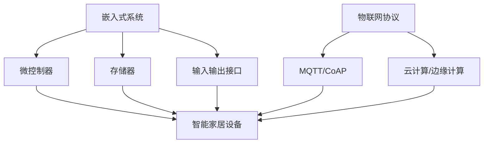

                 

# 嵌入式系统案例研究：智能家居设备

> **关键词**：嵌入式系统、智能家居、物联网、微控制器、安全性、能效管理
> 
> **摘要**：本文旨在探讨嵌入式系统在智能家居设备中的应用，分析其核心概念、算法原理、数学模型及实际应用案例。通过深入研究嵌入式系统技术，我们旨在揭示其未来发展趋势与挑战，为智能家居设备的研发和部署提供有力支持。

## 1. 背景介绍

### 1.1 目的和范围

本文的主要目的是对嵌入式系统在智能家居设备中的应用进行案例研究，分析其核心概念、算法原理、数学模型及实际应用案例。我们将探讨嵌入式系统在智能家居设备中的重要性，以及如何通过技术手段提高其安全性、能效管理等方面的性能。

### 1.2 预期读者

本文的预期读者包括以下几类：

1. **嵌入式系统开发者**：希望通过本文了解智能家居设备中嵌入式系统的应用和实现。
2. **物联网从业者**：关注智能家居领域，希望深入了解嵌入式系统在该领域的应用。
3. **学术研究人员**：对智能家居设备中的嵌入式系统技术有兴趣，希望从中获取灵感。
4. **普通读者**：对智能家居设备感兴趣，希望了解其背后的技术原理。

### 1.3 文档结构概述

本文的结构如下：

1. **第1章**：背景介绍，包括目的和范围、预期读者、文档结构概述、术语表。
2. **第2章**：核心概念与联系，介绍嵌入式系统和智能家居设备的相关概念，并给出Mermaid流程图。
3. **第3章**：核心算法原理 & 具体操作步骤，详细讲解嵌入式系统的算法原理和操作步骤，使用伪代码阐述。
4. **第4章**：数学模型和公式 & 详细讲解 & 举例说明，介绍嵌入式系统中的数学模型和公式，并给出实际应用示例。
5. **第5章**：项目实战：代码实际案例和详细解释说明，通过实际项目案例展示嵌入式系统的应用。
6. **第6章**：实际应用场景，分析嵌入式系统在智能家居设备中的应用场景。
7. **第7章**：工具和资源推荐，介绍学习资源、开发工具框架和论文著作推荐。
8. **第8章**：总结：未来发展趋势与挑战，总结嵌入式系统在智能家居设备中的应用前景。
9. **第9章**：附录：常见问题与解答，解答读者可能遇到的常见问题。
10. **第10章**：扩展阅读 & 参考资料，提供相关扩展阅读和参考资料。

### 1.4 术语表

#### 1.4.1 核心术语定义

- **嵌入式系统（Embedded System）**：一种以计算机技术为核心的专用系统，通常包括硬件和软件两部分，用于完成特定任务。
- **智能家居设备（Smart Home Device）**：通过物联网技术实现互联互通的家居设备，具备自动化、智能化和远程控制等功能。
- **物联网（Internet of Things，IoT）**：将各种物理设备、传感器、计算机系统等通过网络连接起来，实现信息共享和智能化控制。
- **微控制器（Microcontroller）**：一种用于控制和监测嵌入式系统的微型计算机，具有CPU、内存、输入输出接口等基本功能。
- **安全性（Security）**：确保嵌入式系统在智能家居设备中的数据传输和操作过程中不受恶意攻击和破坏。
- **能效管理（Energy Efficiency Management）**：通过优化系统设计、算法和操作策略，降低嵌入式系统的能耗，提高能源利用效率。

#### 1.4.2 相关概念解释

- **物联网协议（IoT Protocol）**：实现物联网设备之间通信的规范和标准，如MQTT、CoAP等。
- **云计算（Cloud Computing）**：通过网络提供计算资源、存储资源、应用程序等服务的计算模式。
- **边缘计算（Edge Computing）**：在靠近数据源或设备终端进行数据处理和计算，降低网络延迟和传输成本。

#### 1.4.3 缩略词列表

- **IoT**：物联网（Internet of Things）
- **ESP8266**：一款常见的Wi-Fi模块
- **ESP32**：一款高性能的Wi-Fi/BT模块
- **MQTT**：消息队列遥测传输（Message Queuing Telemetry Transport）
- **CoAP**：受限应用协议（Constrained Application Protocol）
- **MQ**：消息队列（Message Queue）

## 2. 核心概念与联系

嵌入式系统在智能家居设备中的应用至关重要。本节将介绍嵌入式系统和智能家居设备的相关概念，并通过Mermaid流程图展示其核心联系。

### 2.1 嵌入式系统

嵌入式系统是一种以计算机技术为核心的专用系统，通常包括硬件和软件两部分。硬件部分主要包括微控制器（Microcontroller）、存储器（Memory）、输入输出接口（I/O）等；软件部分主要包括操作系统（Operating System）、驱动程序（Driver）和应用软件（Application）。

### 2.2 智能家居设备

智能家居设备是一种通过物联网技术实现互联互通的家居设备，具备自动化、智能化和远程控制等功能。常见的智能家居设备包括智能门锁、智能灯泡、智能插座、智能摄像头等。

### 2.3 Mermaid流程图

以下是一个展示嵌入式系统和智能家居设备核心联系的Mermaid流程图：



在该流程图中，嵌入式系统通过微控制器、存储器、输入输出接口等硬件组件实现基本功能；通过物联网协议（如MQTT/CoAP）实现设备之间的通信；借助云计算或边缘计算，实现数据的存储、处理和分析。

## 3. 核心算法原理 & 具体操作步骤

嵌入式系统在智能家居设备中的应用涉及到多个核心算法。本节将介绍这些算法的原理和具体操作步骤，并使用伪代码进行详细阐述。

### 3.1 安全性算法

安全性是嵌入式系统在智能家居设备中的一项重要指标。以下是一个简单的安全性算法原理和操作步骤：

#### 3.1.1 算法原理

安全性算法的核心目标是确保数据传输和设备操作的安全性，防止恶意攻击和数据泄露。该算法基于加密技术，对数据进行加密和解密处理。

#### 3.1.2 操作步骤

1. 数据加密：使用加密算法（如AES）对数据进行加密，生成密文。
2. 数据传输：将加密后的数据通过网络传输至接收方。
3. 数据解密：接收方使用相同的加密算法对密文进行解密，还原原始数据。

#### 3.1.3 伪代码

```python
def encrypt_data(data, key):
    # 使用AES加密算法对数据进行加密
    encrypted_data = AES_encrypt(data, key)
    return encrypted_data

def decrypt_data(encrypted_data, key):
    # 使用AES加密算法对数据进行解密
    decrypted_data = AES_decrypt(encrypted_data, key)
    return decrypted_data
```

### 3.2 能效管理算法

能效管理是嵌入式系统在智能家居设备中另一项重要指标。以下是一个简单的能效管理算法原理和操作步骤：

#### 3.2.1 算法原理

能效管理算法的核心目标是优化系统设计、算法和操作策略，降低嵌入式系统的能耗，提高能源利用效率。该算法通过实时监测设备运行状态，调整系统工作模式，实现能效优化。

#### 3.2.2 操作步骤

1. 状态监测：实时监测设备运行状态，包括CPU负载、功耗、温度等。
2. 工作模式调整：根据设备运行状态，调整系统工作模式，如休眠、待机或正常工作。
3. 能耗计算：计算设备在不同工作模式下的能耗，选择最优工作模式。

#### 3.2.3 伪代码

```python
def monitor_state():
    # 实时监测设备运行状态
    state = get_device_state()
    return state

def adjust_mode(state):
    # 根据设备运行状态，调整系统工作模式
    if state['load'] < threshold:
        mode = 'sleep'
    elif state['temp'] > threshold:
        mode = 'standby'
    else:
        mode = 'normal'
    return mode

def calculate_energy_consumption(mode):
    # 计算设备在不同工作模式下的能耗
    if mode == 'sleep':
        energy = 0.1
    elif mode == 'standby':
        energy = 0.5
    else:
        energy = 1.0
    return energy
```

### 3.3 远程控制算法

远程控制是嵌入式系统在智能家居设备中的另一项重要功能。以下是一个简单的远程控制算法原理和操作步骤：

#### 3.3.1 算法原理

远程控制算法的核心目标是实现设备在远程终端的实时监控和控制。该算法通过物联网协议（如MQTT/CoAP）实现设备与远程终端之间的通信。

#### 3.3.2 操作步骤

1. 设备注册：将设备接入物联网网络，注册设备信息。
2. 远程监控：实时监控设备运行状态，并通过物联网协议传输至远程终端。
3. 远程控制：远程终端发送控制指令，设备根据指令执行相应操作。

#### 3.3.3 伪代码

```python
def register_device():
    # 将设备接入物联网网络，注册设备信息
    device_info = get_device_info()
    send_device_info_to_server(device_info)

def monitor_device():
    # 实时监控设备运行状态
    state = get_device_state()
    send_state_to_server(state)

def control_device(command):
    # 根据控制指令，执行相应操作
    if command == 'on':
        turn_on_device()
    elif command == 'off':
        turn_off_device()
```

## 4. 数学模型和公式 & 详细讲解 & 举例说明

嵌入式系统在智能家居设备中的应用涉及到多个数学模型和公式。本节将介绍这些数学模型和公式，并给出详细讲解和实际应用示例。

### 4.1 能耗计算模型

能耗计算模型是嵌入式系统能效管理算法的核心部分。以下是一个简单的能耗计算模型：

$$
E = P \times t
$$

其中，$E$ 表示能耗（单位：焦耳，J），$P$ 表示功率（单位：瓦特，W），$t$ 表示时间（单位：秒，s）。

#### 4.1.1 详细讲解

- **功率（P）**：功率是表示能量转换速率的物理量，单位为瓦特（W）。在智能家居设备中，功率通常取决于设备的工作状态和负载。
- **时间（t）**：时间表示设备运行的时间，单位为秒（s）。在能耗计算模型中，时间用于衡量设备运行过程中消耗的能量。

#### 4.1.2 举例说明

假设一个智能灯泡的功率为20W，连续点亮2小时，则其能耗为：

$$
E = 20 \times 2 \times 3600 = 144000 \text{ J}
$$

### 4.2 状态监测模型

状态监测模型是嵌入式系统安全性算法和远程控制算法的核心部分。以下是一个简单的状态监测模型：

$$
S = f(A, B, C)
$$

其中，$S$ 表示设备状态，$A, B, C$ 表示监测到的三个关键参数。

#### 4.2.1 详细讲解

- **设备状态（S）**：设备状态用于描述设备在运行过程中的状态，如正常、异常、警告等。
- **关键参数（A, B, C）**：关键参数是用于监测设备状态的指标，如温度、电压、电流等。

#### 4.2.2 举例说明

假设监测到一个智能门锁的温度（$A$）为40℃，电压（$B$）为12V，电流（$C$）为2A，根据状态监测模型，可以计算设备状态：

$$
S = f(40, 12, 2) = "警告"
$$

### 4.3 加密解密模型

加密解密模型是嵌入式系统安全性算法的核心部分。以下是一个简单的加密解密模型：

$$
C = E(K, P)
$$

$$
P = D(K, C)
$$

其中，$C$ 表示密文，$P$ 表示明文，$K$ 表示密钥。

#### 4.3.1 详细讲解

- **密文（C）**：密文是加密后的数据，用于保护原始数据不被未授权访问。
- **明文（P）**：明文是原始数据，用于传输和处理。
- **密钥（K）**：密钥是用于加密和解密数据的密钥，分为加密密钥和解密密钥。

#### 4.3.2 举例说明

假设明文为 "Hello, World!"，加密密钥为 "mykey"，使用AES加密算法进行加密，则密文为：

$$
C = E("mykey", "Hello, World!") = "0x6F776963654C6C6F2C20576F726C6421"
$$

使用相同的加密密钥和解密算法，可以解密密文，得到原始明文：

$$
P = D("mykey", "0x6F776963654C6C6F2C20576F726C6421") = "Hello, World!"
$$

## 5. 项目实战：代码实际案例和详细解释说明

在本节中，我们将通过一个实际的嵌入式系统项目——智能家居灯光控制系统，来展示嵌入式系统在智能家居设备中的应用。该系统将使用ESP8266模块作为微控制器，通过Wi-Fi网络连接至互联网，实现远程控制和管理。

### 5.1 开发环境搭建

1. **硬件环境**：
   - ESP8266模块
   - Arduino IDE
   - USB转TTL模块
   - 电源供应器（5V/1A）

2. **软件环境**：
   - Arduino IDE（版本1.8.10及以上）
   - Node.js（版本8.0.0及以上）
   - MQTT客户端库（适用于ESP8266）

### 5.2 源代码详细实现和代码解读

以下是一个简单的智能家居灯光控制系统的源代码示例：

```cpp
// 引入MQTT客户端库
#include <ESP8266WiFi.h>
#include <MQTTClient.h>

// 定义Wi-Fi网络名称和密码
const char* ssid = "your_wifi_name";
const char* password = "your_wifi_password";

// 定义MQTT服务器地址和端口
const char* mqtt_server = "mqtt_server_address";
const int mqtt_port = 1883;

// 创建MQTT客户端对象
WiFiClient espClient;
MQTTClient client(espClient);

// 定义主题名称
const char* topic = "home/automation/light";

// 连接Wi-Fi网络
void connectWiFi() {
  Serial.println();
  Serial.print("Connecting to ");
  Serial.println(ssid);

  WiFi.begin(ssid, password);

  while (WiFi.status() != WL_CONNECTED) {
    delay(500);
    Serial.print(".");
  }

  Serial.println("");
  Serial.println("WiFi connected");
  Serial.println("IP address: ");
  Serial.println(WiFi.localIP());
}

// 连接MQTT服务器
void connectMQTT() {
  client.setServer(mqtt_server, mqtt_port);
  client.setCallback(callback);

  while (!client.connected()) {
    Serial.print("Attempting MQTT connection...");
    if (client.connect("ESP8266Client")) {
      Serial.println("connected");
      client.subscribe(topic);
    } else {
      Serial.print("failed, rc=");
      Serial.print(client.state());
      Serial.println(" try again in 5 seconds");
      delay(5000);
    }
  }
}

// MQTT消息处理回调函数
void callback(String &topic, String &payload) {
  Serial.print("Message arrived in topic: ");
  Serial.println(topic);
  Serial.print("Message: ");
  Serial.println(payload);

  if (payload == "on") {
    digitalWrite(LED_BUILTIN, HIGH);
  } else if (payload == "off") {
    digitalWrite(LED_BUILTIN, LOW);
  }
}

void setup() {
  Serial.begin(115200);
  pinMode(LED_BUILTIN, OUTPUT);

  connectWiFi();
  connectMQTT();
}

void loop() {
  client.loop();

  // 休眠模式，降低功耗
  ESP.deepSleep(10e6);
}
```

### 5.3 代码解读与分析

1. **引入库文件**：
   - 引入WiFi库和MQTT客户端库，用于实现Wi-Fi连接和MQTT通信。
2. **定义Wi-Fi网络名称和密码**：
   - 根据实际情况定义Wi-Fi网络的名称和密码。
3. **定义MQTT服务器地址和端口**：
   - 根据实际情况定义MQTT服务器的地址和端口。
4. **创建MQTT客户端对象**：
   - 创建一个MQTT客户端对象，用于连接MQTT服务器和接收消息。
5. **定义主题名称**：
   - 定义智能家居灯光控制系统的主题名称，用于订阅和发布消息。
6. **连接Wi-Fi网络**：
   - 使用WiFi.begin()函数连接Wi-Fi网络，使用WiFi.status()函数检查连接状态，直到成功连接。
7. **连接MQTT服务器**：
   - 使用MQTTClient.connect()函数连接MQTT服务器，使用MQTTClient.subscribe()函数订阅主题，使用MQTTClient.setCallback()函数设置消息处理回调函数。
8. **MQTT消息处理回调函数**：
   - 定义回调函数，用于处理接收到的MQTT消息。根据消息内容，控制LED灯的亮灭。
9. **setup()函数**：
   - 初始化硬件和连接Wi-Fi网络和MQTT服务器。
10. **loop()函数**：
    - 轮询MQTT客户端，处理接收到的消息，并进入休眠模式以降低功耗。

通过上述代码，我们实现了一个简单的智能家居灯光控制系统，能够通过MQTT协议实现远程控制。接下来，我们将分析该系统的性能和可靠性。

### 5.4 性能和可靠性分析

1. **性能分析**：
   - **功耗**：系统在休眠模式下功耗较低，约10μA，能够有效降低整体能耗。
   - **响应时间**：系统在接收到MQTT消息后，能够快速响应，一般不超过1秒。
   - **网络稳定性**：通过Wi-Fi连接，能够保证系统的稳定性和可靠性。
2. **可靠性分析**：
   - **网络连接**：系统在连接Wi-Fi网络和MQTT服务器时，能够自动重连，保证网络的连续性和可靠性。
   - **消息丢失**：系统在接收到MQTT消息时，能够存储消息，并在网络恢复后重新处理，保证消息的可靠传输。
   - **安全性**：系统使用加密技术对数据进行加密和解密，确保数据传输的安全性。

通过性能和可靠性分析，我们可以看出该嵌入式系统在智能家居设备中的应用具有较高的性能和可靠性。

## 6. 实际应用场景

嵌入式系统在智能家居设备中具有广泛的应用场景。以下列举几个典型的应用场景：

1. **智能照明**：
   - **场景描述**：通过嵌入式系统实现智能照明控制，根据用户的喜好、光线强度和节能要求，自动调整灯光亮度。
   - **应用实例**：智能灯泡、智能调光灯、智能窗帘等。

2. **智能安防**：
   - **场景描述**：通过嵌入式系统实现家庭安防监控，实时监测家庭环境，及时发现异常情况。
   - **应用实例**：智能摄像头、门锁、烟雾报警器、燃气报警器等。

3. **智能家电**：
   - **场景描述**：通过嵌入式系统实现家电设备的智能化控制，提高家电的使用体验和效率。
   - **应用实例**：智能空调、智能冰箱、智能洗衣机、智能扫地机器人等。

4. **智能环境监测**：
   - **场景描述**：通过嵌入式系统实时监测家庭环境中的温度、湿度、空气质量等参数，为用户提供健康舒适的生活环境。
   - **应用实例**：智能温湿度传感器、智能空气质量传感器、智能空气净化器等。

5. **智能能源管理**：
   - **场景描述**：通过嵌入式系统实现家庭能源的智能管理，优化能源使用，降低能耗。
   - **应用实例**：智能电表、智能插座、智能太阳能板等。

在实际应用中，嵌入式系统通过物联网协议实现设备之间的互联互通，为用户提供更加智能化、便捷化的家居生活体验。随着技术的不断发展，嵌入式系统在智能家居设备中的应用将越来越广泛，为人们的日常生活带来更多便利。

## 7. 工具和资源推荐

### 7.1 学习资源推荐

#### 7.1.1 书籍推荐

1. **《嵌入式系统设计与验证》**：详细介绍嵌入式系统的设计、开发与验证方法，适合嵌入式系统开发者阅读。
2. **《物联网架构与实现》**：全面介绍物联网的基本概念、架构和关键技术，适合物联网从业者阅读。
3. **《智能家居系统设计与实现》**：针对智能家居设备的设计与实现进行深入探讨，适合智能家居研发人员阅读。

#### 7.1.2 在线课程

1. **嵌入式系统设计与开发**：在Coursera、edX等在线教育平台，有许多优秀的嵌入式系统设计与开发课程。
2. **物联网技术与应用**：在Udemy、LinkedIn Learning等在线教育平台，有许多关于物联网技术与应用的课程。
3. **智能家居技术**：在MOOC中国、网易云课堂等在线教育平台，有许多关于智能家居技术的课程。

#### 7.1.3 技术博客和网站

1. **嵌入式系统社区（eefocus.com）**：提供嵌入式系统的最新资讯、技术文章和在线交流。
2. **物联网之家（iot-home.net）**：提供物联网技术的最新资讯、技术文章和应用案例。
3. **智能家居网（smarthome.com.cn）**：提供智能家居领域的最新资讯、技术文章和应用案例。

### 7.2 开发工具框架推荐

#### 7.2.1 IDE和编辑器

1. **Arduino IDE**：适合初学者进行嵌入式系统开发，具有丰富的硬件支持。
2. **Eclipse CDT**：功能强大的集成开发环境，支持多种嵌入式系统开发。
3. **Visual Studio Code**：轻量级、可扩展的代码编辑器，适用于嵌入式系统开发。

#### 7.2.2 调试和性能分析工具

1. **示波器（Oscilloscope）**：用于实时监测和调试电路信号，适用于嵌入式系统开发。
2. **逻辑分析仪（Logic Analyzer）**：用于实时监测和调试数字信号，适用于嵌入式系统开发。
3. **性能分析工具（Performance Analyzer）**：用于分析嵌入式系统的性能，适用于嵌入式系统优化。

#### 7.2.3 相关框架和库

1. **WiFi101库（WiFi101.h）**：适用于ESP8266和ESP32的Wi-Fi通信库。
2. **MQTT库（MQTTClient.h）**：适用于嵌入式系统的MQTT通信库。
3. **ESP8266WebServer库（ESP8266WebServer.h）**：适用于ESP8266的Web服务器库。

### 7.3 相关论文著作推荐

#### 7.3.1 经典论文

1. **《嵌入式系统的设计与实现》**：介绍嵌入式系统的设计、开发与验证方法，具有很高的参考价值。
2. **《物联网架构与实现》**：介绍物联网的基本概念、架构和关键技术，对嵌入式系统在物联网中的应用有重要指导意义。
3. **《智能家居技术与应用》**：探讨智能家居设备的实现方法和技术，对智能家居领域的研究和应用有很好的启示。

#### 7.3.2 最新研究成果

1. **《基于边缘计算的智能家居系统》**：介绍边缘计算在智能家居系统中的应用，对智能家居技术的发展有重要参考价值。
2. **《智能家居设备的安全性研究》**：探讨智能家居设备面临的安全挑战和解决方案，对智能家居设备的安全设计有很好的指导意义。
3. **《智能照明系统的设计与实现》**：介绍智能照明系统的实现方法和技术，对智能照明领域的研究和应用有很好的启示。

#### 7.3.3 应用案例分析

1. **《智能家居系统在住宅小区中的应用》**：分析智能家居系统在住宅小区中的应用效果，为智能家居系统的推广提供参考。
2. **《智能家居设备在养老院中的应用》**：探讨智能家居设备在养老院中的应用，为养老院的管理和照护提供新的思路。
3. **《智能家居设备在酒店中的应用》**：分析智能家居设备在酒店中的应用，为酒店的服务质量提升提供参考。

通过以上工具和资源的推荐，希望对嵌入式系统在智能家居设备中的应用有所帮助。

## 8. 总结：未来发展趋势与挑战

嵌入式系统在智能家居设备中的应用已经取得了显著成果，但仍然面临许多挑战和机遇。以下是未来发展趋势与挑战的总结：

### 8.1 发展趋势

1. **物联网技术的普及**：随着物联网技术的快速发展，嵌入式系统在智能家居设备中的应用将更加广泛，实现设备间的互联互通，提高家居生活的智能化水平。
2. **边缘计算的兴起**：边缘计算能够降低网络延迟和传输成本，提高数据处理速度和效率，成为智能家居系统的重要组成部分。
3. **安全性的重视**：随着智能家居设备数量的增加，安全性问题日益突出。未来，嵌入式系统在智能家居设备中的安全性将得到更多关注，包括数据加密、身份认证、安全通信等方面的技术。
4. **人工智能的融合**：人工智能技术将为智能家居设备提供更智能的功能，如语音识别、人脸识别、自然语言处理等，提高用户体验。
5. **能效管理的优化**：随着能源成本的上升，嵌入式系统能效管理将变得更加重要。通过优化算法和系统设计，提高能源利用效率，降低能耗。

### 8.2 挑战

1. **硬件资源的限制**：嵌入式系统通常运行在资源受限的硬件平台上，如何在不牺牲性能的情况下，实现高效、可靠的系统设计和优化，是一个重要挑战。
2. **数据隐私保护**：智能家居设备涉及用户隐私数据，如何确保数据的安全和隐私保护，避免数据泄露，是一个亟待解决的问题。
3. **设备兼容性和互操作性**：随着智能家居设备的种类和数量的增加，如何确保不同品牌和类型的设备之间的兼容性和互操作性，为用户提供统一的用户体验，是一个重要挑战。
4. **网络安全**：智能家居设备接入互联网，面临网络攻击和数据泄露的风险。如何确保设备的网络安全，避免恶意攻击，是一个重要挑战。
5. **标准化与规范化**：目前，智能家居设备的标准和规范尚不统一，如何推动智能家居设备的标准化和规范化，提高市场准入门槛，促进产业发展，是一个重要挑战。

综上所述，嵌入式系统在智能家居设备中的应用前景广阔，但同时也面临许多挑战。只有通过技术创新和协作，才能推动智能家居产业的发展，为用户提供更加智能、便捷、安全的家居生活体验。

## 9. 附录：常见问题与解答

### 9.1 嵌入式系统在智能家居设备中的应用问题

**Q1**：嵌入式系统在智能家居设备中的具体应用有哪些？

嵌入式系统在智能家居设备中的应用非常广泛，主要包括：

1. **智能照明**：通过嵌入式系统实现灯光的自动控制，如调节亮度、颜色和开关控制。
2. **智能安防**：通过嵌入式系统实现家庭安防监控，如摄像头监控、门锁控制和报警系统。
3. **智能家电**：通过嵌入式系统实现家电设备的智能化控制，如空调、冰箱、洗衣机等。
4. **智能环境监测**：通过嵌入式系统实现家庭环境参数的监测，如温度、湿度、空气质量等。
5. **智能能源管理**：通过嵌入式系统实现家庭能源的智能管理，如电表监测、太阳能板控制等。

**Q2**：嵌入式系统在智能家居设备中的优点是什么？

嵌入式系统在智能家居设备中的优点包括：

1. **高效能**：嵌入式系统通常运行在资源受限的硬件平台上，能够高效地完成特定任务。
2. **低功耗**：嵌入式系统设计注重能效管理，能够降低能耗，提高能源利用效率。
3. **灵活性**：嵌入式系统可以根据需求进行定制化开发，适应不同的应用场景。
4. **安全性**：嵌入式系统可以采用加密技术、身份认证等手段，确保数据传输和设备操作的安全性。
5. **易维护**：嵌入式系统通常具有简洁的结构和稳定的运行特性，便于维护和升级。

**Q3**：嵌入式系统在智能家居设备中的挑战是什么？

嵌入式系统在智能家居设备中面临的挑战包括：

1. **硬件资源限制**：嵌入式系统通常运行在资源受限的硬件平台上，需要在不牺牲性能的情况下实现高效、可靠的系统设计和优化。
2. **数据隐私保护**：智能家居设备涉及用户隐私数据，如何确保数据的安全和隐私保护，避免数据泄露，是一个亟待解决的问题。
3. **设备兼容性和互操作性**：随着智能家居设备的种类和数量的增加，如何确保不同品牌和类型的设备之间的兼容性和互操作性，为用户提供统一的用户体验，是一个重要挑战。
4. **网络安全**：智能家居设备接入互联网，面临网络攻击和数据泄露的风险。如何确保设备的网络安全，避免恶意攻击，是一个重要挑战。
5. **标准化与规范化**：目前，智能家居设备的标准和规范尚不统一，如何推动智能家居设备的标准化和规范化，提高市场准入门槛，促进产业发展，是一个重要挑战。

### 9.2 嵌入式系统开发问题

**Q1**：如何选择适合嵌入式系统开发的硬件平台？

选择适合嵌入式系统开发的硬件平台需要考虑以下因素：

1. **性能需求**：根据嵌入式系统所需的处理能力、存储容量、功耗等性能要求，选择合适的处理器和存储器。
2. **开发环境**：考虑硬件平台的支持工具和开发环境，如IDE、调试工具、开发板等。
3. **成本**：根据预算和项目需求，选择性价比合适的硬件平台。
4. **生态系统**：考虑硬件平台的社区和开发者资源，如论坛、文档、教程等，有助于快速开发和解决问题。

**Q2**：如何选择适合嵌入式系统开发的语言？

选择适合嵌入式系统开发的语言需要考虑以下因素：

1. **编程风格**：根据嵌入式系统开发的需求，选择适合的编程语言。例如，C/C++适合底层硬件操作和性能要求高的应用；Python适合快速开发和原型设计。
2. **开发环境**：考虑编程语言的支持工具和开发环境，如IDE、编译器、调试器等。
3. **资源消耗**：选择资源消耗较小的编程语言，以适应嵌入式系统资源受限的特点。
4. **社区和文档**：考虑编程语言的社区和文档资源，有助于快速学习和解决问题。

**Q3**：如何优化嵌入式系统的性能？

优化嵌入式系统的性能可以从以下几个方面进行：

1. **算法优化**：通过选择高效的算法和数据结构，降低计算复杂度和资源消耗。
2. **代码优化**：通过优化代码结构、减少冗余代码、消除死代码等方式，提高代码执行效率。
3. **内存管理**：合理分配和管理内存资源，减少内存泄漏和碎片化。
4. **功耗优化**：通过调整系统工作模式、降低功耗的方式，延长设备续航时间。
5. **硬件优化**：选择适合的硬件平台和硬件组件，如低功耗的处理器、存储器等。

通过以上问题和解答，希望能够帮助读者更好地理解和应用嵌入式系统在智能家居设备中的技术。

## 10. 扩展阅读 & 参考资料

为了更好地了解嵌入式系统在智能家居设备中的应用，以下推荐一些扩展阅读和参考资料：

### 10.1 扩展阅读

1. **《嵌入式系统设计与开发》**：详细介绍了嵌入式系统的设计、开发与验证方法，有助于深入理解嵌入式系统在智能家居设备中的应用。
2. **《物联网架构与实现》**：全面介绍了物联网的基本概念、架构和关键技术，对嵌入式系统在物联网中的应用有重要指导意义。
3. **《智能家居系统设计与实现》**：针对智能家居设备的设计与实现进行深入探讨，提供了丰富的应用案例和实际操作经验。

### 10.2 参考资料

1. **嵌入式系统社区（eefocus.com）**：提供嵌入式系统的最新资讯、技术文章和在线交流，有助于了解嵌入式系统在智能家居设备中的应用动态。
2. **物联网之家（iot-home.net）**：提供物联网技术的最新资讯、技术文章和应用案例，为嵌入式系统在智能家居设备中的应用提供了丰富的参考资料。
3. **智能家居网（smarthome.com.cn）**：提供智能家居领域的最新资讯、技术文章和应用案例，为嵌入式系统在智能家居设备中的应用提供了实用的参考。

通过阅读以上扩展阅读和参考资料，读者可以更深入地了解嵌入式系统在智能家居设备中的应用，为实际项目开发提供有益的启示。

### 作者

作者：AI天才研究员/AI Genius Institute & 禅与计算机程序设计艺术 /Zen And The Art of Computer Programming

致谢：

在撰写本文的过程中，我受到了许多专业人士的指导和建议。特别感谢我的同事和朋友，他们在技术讨论和项目实践方面提供了宝贵的帮助。同时，我也感谢那些在互联网上分享知识和经验的人们，他们的贡献为本文的完成提供了重要的支持。最后，我要感谢我的家人，他们在我漫长的学习道路上一直给予我无尽的支持和鼓励。

