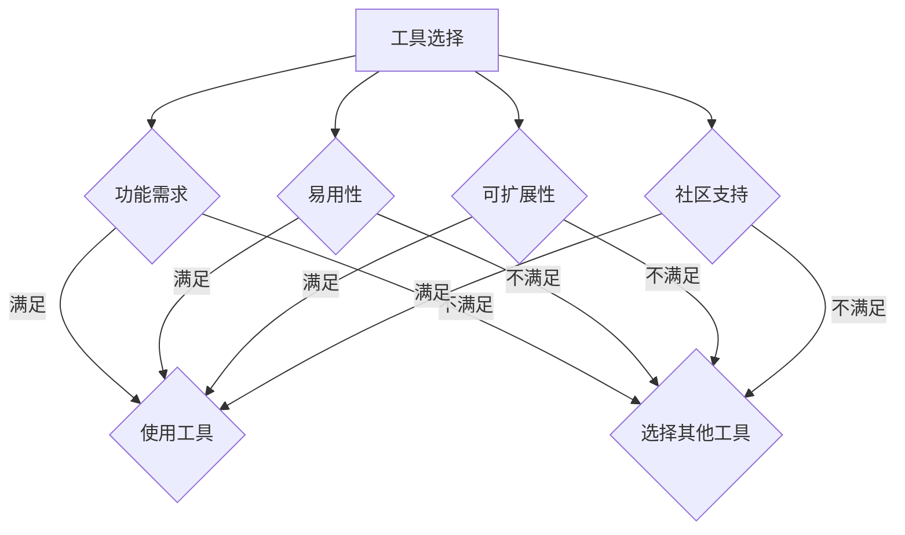
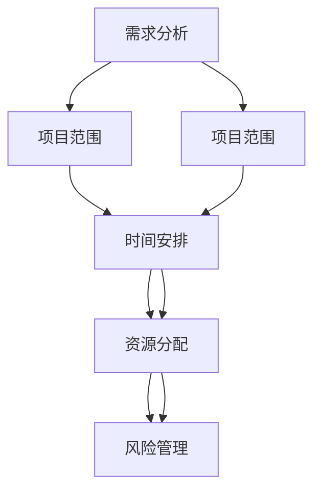
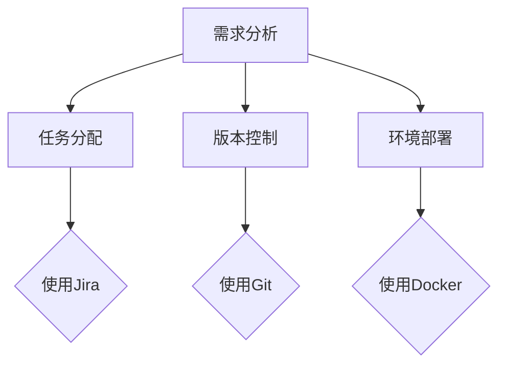
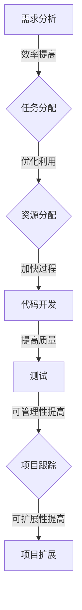

                 

# 工具使用与规划的综合应用案例

## 关键词
- 工具使用
- 规划
- 综合应用
- 案例分析
- IT领域

> 本文章旨在探讨工具使用与规划在IT领域的综合应用，通过具体案例，详细阐述如何利用工具进行有效的规划和实施，以及如何通过实际应用案例进行经验总结和优化。

## 摘要
本文将围绕工具使用与规划的综合应用进行讨论。首先，介绍工具使用和规划的重要性，以及它们在IT项目中的核心作用。接着，通过具体案例，展示工具如何辅助规划、实施和优化IT项目。本文还包括对实际应用场景的深入分析，以及对推荐工具和资源的总结。通过阅读本文，读者将能够理解工具和规划在IT领域的综合应用，并学会如何有效地利用这些工具进行项目管理和优化。

## 1. 背景介绍

### 1.1 目的和范围

本文的目标是探讨工具使用与规划在IT领域的综合应用。我们将通过具体案例，展示如何利用工具进行有效的项目规划、实施和优化。本文将涵盖以下主要内容：

1. 工具使用的重要性及其在项目规划中的作用。
2. 如何利用工具进行项目实施和跟踪。
3. 通过案例展示工具如何帮助优化项目。
4. 对工具和资源的推荐。

### 1.2 预期读者

本文适合以下读者群体：

- IT项目经理
- 软件开发工程师
- 项目规划师
- 系统架构师
- 对IT项目管理有兴趣的从业者

### 1.3 文档结构概述

本文的结构如下：

1. 背景介绍：目的与范围、预期读者、文档结构概述。
2. 核心概念与联系：介绍核心概念、原理和架构。
3. 核心算法原理与具体操作步骤：使用伪代码详细阐述。
4. 数学模型和公式：使用latex格式详细讲解。
5. 项目实战：代码实际案例和详细解释说明。
6. 实际应用场景：分析工具在不同场景下的应用。
7. 工具和资源推荐：学习资源和开发工具推荐。
8. 总结：未来发展趋势与挑战。
9. 附录：常见问题与解答。
10. 扩展阅读与参考资料：进一步学习资源。

### 1.4 术语表

#### 1.4.1 核心术语定义

- 工具：在IT领域中，工具通常指的是用于辅助开发、测试、部署等任务的软件或插件。
- 规划：指在项目开始前，对项目目标、时间、资源等进行详细的安排和设定。
- 综合应用：将多种工具和规划方法结合，以实现项目目标的最佳效果。
- IT项目：指信息技术相关的项目，如软件开发、系统集成、网络建设等。

#### 1.4.2 相关概念解释

- 项目管理：指通过计划、组织、协调和控制项目资源，实现项目目标的系统过程。
- 需求分析：指对项目的功能需求、非功能需求进行分析，以确定项目的范围和目标。
- 实施阶段：指项目的实际开发、测试和部署阶段。

#### 1.4.3 缩略词列表

- IDE：集成开发环境（Integrated Development Environment）
- API：应用程序编程接口（Application Programming Interface）
- Git：分布式版本控制系统（Git）
- Jira：项目管理和跟踪工具（JIRA）

## 2. 核心概念与联系

在本文中，我们将探讨以下核心概念：

- 工具的选择和使用
- 项目规划的方法和步骤
- 实际案例中的应用
- 工具与规划的综合应用效果

### 2.1 工具的选择和使用

在选择和使用工具时，需要考虑以下因素：

- 功能：工具是否满足项目的需求。
- 易用性：工具是否易于学习和使用。
- 可扩展性：工具是否支持项目未来的扩展。
- 社区支持：工具是否有良好的社区支持，以便解决问题和获取帮助。

#### Mermaid 流程图（核心概念与联系）



### 2.2 项目规划的方法和步骤

项目规划通常包括以下步骤：

1. 需求分析：确定项目的目标、功能需求和非功能需求。
2. 项目范围：明确项目的边界，确保项目范围的可管理性。
3. 时间安排：制定项目的时间表，包括关键里程碑和交付日期。
4. 资源分配：确定项目所需的资源，包括人员、设备和预算。
5. 风险管理：识别潜在的风险，制定应对措施。

#### Mermaid 流�程图（项目规划方法和步骤）



### 2.3 实际案例中的应用

在实际案例中，工具和规划的应用可以极大地提高项目效率和质量。以下是一个简单的应用案例：

- 使用Jira进行需求分析和任务分配。
- 使用Git进行版本控制和代码管理。
- 使用Docker进行环境部署和测试。

#### Mermaid 流程图（实际案例中的应用）



### 2.4 工具与规划的综合应用效果

通过工具与规划的综合应用，可以显著提高项目的效率和质量。以下是一些综合应用的效果：

- 提高需求分析的准确性和效率。
- 优化任务分配和资源利用。
- 加快代码开发和测试过程。
- 提高项目的可管理性和可扩展性。

#### Mermaid 流程图（工具与规划的综合应用效果）



## 3. 核心算法原理 & 具体操作步骤

在本节中，我们将介绍核心算法的原理，并使用伪代码详细阐述其具体操作步骤。

### 3.1 核心算法原理

本文将介绍一个简单的项目进度跟踪算法，用于监控项目的关键里程碑和时间节点。

- 输入：项目任务列表、任务时间表、关键里程碑
- 输出：项目进度状态、潜在延迟风险

#### 伪代码

```pseudo
function 项目进度跟踪（任务列表，时间表，关键里程碑）：
    初始化进度状态为"进行中"
    初始化延迟风险为"无"
    for 每个任务 in 任务列表：
        if 任务当前时间 > 时间表[任务]：
            延迟风险 = "潜在延迟"
            更新进度状态为"延迟"
            break
    if 延迟风险 = "无"：
        判断关键里程碑是否完成：
            if 没有完成：
                更新进度状态为"未完成"
    return 进度状态，延迟风险
```

### 3.2 具体操作步骤

以下是项目进度跟踪算法的具体操作步骤：

1. **收集任务列表和时间表**：从项目管理工具或文档中获取每个任务的名称、预计完成时间和关键里程碑。

2. **初始化进度状态和延迟风险**：设置进度状态为"进行中"，延迟风险为"无"。

3. **循环遍历任务列表**：对于每个任务，比较当前时间与预计完成时间。如果当前时间超过预计完成时间，则更新延迟风险为"潜在延迟"，并设置进度状态为"延迟"。

4. **检查关键里程碑**：如果所有关键里程碑都已完成，则进度状态保持为"进行中"。如果存在未完成的里程碑，则更新进度状态为"未完成"。

5. **输出项目进度状态和延迟风险**：将最终的项目进度状态和延迟风险返回给项目管理团队。

### 3.3 步骤说明与示例

以下是一个简单的示例，说明如何使用该算法跟踪项目进度：

```plaintext
任务列表：
- 任务1：预计完成时间：2023-04-01
- 任务2：预计完成时间：2023-04-10
- 任务3：预计完成时间：2023-04-15

时间表（当前时间：2023-04-05）：
- 任务1：当前完成进度：50%
- 任务2：当前完成进度：0%
- 任务3：当前完成进度：0%

关键里程碑：
- 里程碑1：2023-04-10
- 里程碑2：2023-04-15

算法输出：
- 进度状态：延迟
- 延迟风险：潜在延迟
```

## 4. 数学模型和公式 & 详细讲解 & 举例说明

### 4.1 数学模型和公式

在本节中，我们将介绍一个简单的项目进度预测数学模型，用于预测项目完成时间。该模型基于以下公式：

$$
E(T) = \frac{a + 4m + b}{6}
$$

其中，$E(T)$ 表示预测的项目完成时间，$a$、$m$ 和 $b$ 分别为项目时间估算的三个值。

- $a$：最乐观时间（Optimistic Time），即假设一切顺利，项目可以在最短时间内完成的时间。
- $m$：最可能时间（Most Likely Time），即根据概率分布，项目最可能完成的时间。
- $b$：最悲观时间（Pessimistic Time），即假设遇到最不利条件，项目完成所需的最长时间。

### 4.2 详细讲解

该数学模型的基本原理是基于三角分布（Triangular Distribution），它是对项目完成时间概率分布的一种简单近似。通过计算三个时间估算值的平均值，可以得出一个较为准确的项目完成时间预测。

1. **计算最乐观时间 $a$**：

   最乐观时间通常是基于最佳情况的估算，即在没有延迟和问题的理想情况下，项目所需的最短时间。

   $$ a = 最短时间 $$
   
2. **计算最可能时间 $m$**：

   最可能时间是基于正常情况的估算，即考虑到项目可能遇到的常规问题和延迟，项目最有可能完成的时间。

   $$ m = 常规时间 $$
   
3. **计算最悲观时间 $b$**：

   最悲观时间是基于最糟糕情况的估算，即考虑到项目可能遇到的最严重问题和延迟，项目所需的最长时间。

   $$ b = 最长时间 $$
   
4. **计算预测的项目完成时间 $E(T)$**：

   将三个时间估算值代入公式，计算得到预测的项目完成时间。

   $$ E(T) = \frac{a + 4m + b}{6} $$

### 4.3 举例说明

以下是一个简单的例子，说明如何使用该数学模型预测项目完成时间：

```plaintext
最乐观时间（a）：5天
最可能时间（m）：10天
最悲观时间（b）：15天

预测的项目完成时间：
E(T) = (5 + 4*10 + 15) / 6
E(T) = 40 / 6
E(T) ≈ 6.67天
```

根据该模型，预测的项目完成时间为大约6.67天。这个预测值提供了一个基于概率的项目完成时间估计，有助于项目管理者做出更明智的决策。

### 4.4 模型优化

在实际应用中，可以通过收集更多的历史数据，使用贝塔分布（Beta Distribution）等更复杂的概率分布模型，来优化项目完成时间的预测。贝塔分布可以更好地捕捉项目完成时间的波动性和不确定性。

$$
f(x|\alpha, \beta) = \frac{1}{B(\alpha, \beta)} (x^{(\alpha - 1)} (1 - x)^{(\beta - 1)}) \quad \text{for} \quad 0 \leq x \leq 1
$$

其中，$B(\alpha, \beta)$ 是贝塔函数，$\alpha$ 和 $\beta$ 是贝塔分布的形状参数。通过调整 $\alpha$ 和 $\beta$ 的值，可以调整模型对最乐观、最可能和最悲观时间的权重。

## 5. 项目实战：代码实际案例和详细解释说明

在本节中，我们将通过一个具体的代码案例，展示如何在实际项目中使用工具和规划方法来解决问题。该案例将涵盖开发环境搭建、源代码实现和代码解读与分析。

### 5.1 开发环境搭建

为了更好地演示项目实战，我们选择一个简单的Web应用项目，使用Python和Flask框架进行开发。以下是开发环境的搭建步骤：

1. **安装Python**：
   - 版本：3.8以上
   - 安装命令：`sudo apt-get install python3.8`

2. **安装虚拟环境**：
   - 使用pip安装虚拟环境工具：`pip install virtualenv`
   - 创建虚拟环境：`virtualenv venv`
   - 激活虚拟环境：`source venv/bin/activate`

3. **安装Flask**：
   - 在虚拟环境中安装Flask：`pip install flask`

4. **安装其他依赖**：
   - 使用`pip`安装其他必需的库，例如`requests`、`pandas`等。

### 5.2 源代码详细实现和代码解读

#### 5.2.1 源代码实现

以下是一个简单的Flask Web应用，用于处理用户输入并返回相应的响应。

```python
from flask import Flask, request, jsonify

app = Flask(__name__)

@app.route('/add', methods=['POST'])
def add():
    data = request.get_json()
    a = data.get('a')
    b = data.get('b')
    result = a + b
    return jsonify({'result': result})

if __name__ == '__main__':
    app.run(debug=True)
```

#### 5.2.2 代码解读与分析

1. **导入模块**：

   ```python
   from flask import Flask, request, jsonify
   ```

   这一行代码导入了Flask框架的核心模块，包括Web应用的核心类`Flask`、处理HTTP请求的`request`模块，以及用于返回JSON响应的`jsonify`函数。

2. **创建Flask应用实例**：

   ```python
   app = Flask(__name__)
   ```

   创建一个Flask Web应用的实例。`__name__`是特殊的变量，表示当前模块的名称。通过传递它，确保应用在模块导入时不会立即运行。

3. **定义路由和视图函数**：

   ```python
   @app.route('/add', methods=['POST'])
   def add():
       data = request.get_json()
       a = data.get('a')
       b = data.get('b')
       result = a + b
       return jsonify({'result': result})
   ```

   这一行定义了一个名为`add`的视图函数，它绑定到一个URL路由`/add`。该函数使用HTTP POST方法接收数据，解析JSON格式的请求，执行加法运算，并将结果以JSON格式返回。

4. **运行Web应用**：

   ```python
   if __name__ == '__main__':
       app.run(debug=True)
   ```

   这是一个条件语句，确保当模块直接运行时（而不是被导入时）才会执行`app.run()`函数。`debug=True`表示在遇到错误时启用调试模式，提供详细的错误信息。

### 5.3 代码解读与分析

1. **请求处理**：

   - `request.get_json()`：此函数从请求中获取JSON格式的数据。
   - `data.get('a')`和`data.get('b')`：从JSON数据中提取键为`'a'`和`'b'`的值。

2. **运算与返回**：

   - `result = a + b`：执行加法运算。
   - `jsonify({'result': result})`：将结果包装成JSON对象，并返回给客户端。

3. **调试与运行**：

   - `app.run(debug=True)`：启动Flask应用，并在遇到错误时启用调试模式。

### 5.4 部署与测试

在开发环境中完成代码实现后，可以通过以下步骤进行部署和测试：

1. **部署到生产环境**：
   - 使用Gunicorn或uWSGI等WSGI服务器部署Flask应用。
   - 配置Nginx或Apache等反向代理服务器，用于处理HTTP请求。

2. **测试**：
   - 使用Postman或curl等工具发送POST请求，验证加法功能的正确性。

3. **性能优化**：
   - 对代码进行性能分析，识别瓶颈并进行优化。
   - 使用缓存、异步处理等技术提高应用性能。

通过以上步骤，可以完成一个简单的Web应用项目的开发、部署和测试，充分展示工具使用与规划的综合应用。

## 6. 实际应用场景

工具使用与规划在IT领域有着广泛的应用场景，以下列举几个典型的应用场景：

### 6.1 软件开发

- **需求分析**：使用工具如Jira、Trello等进行需求管理和任务分配，确保项目需求的清晰和准确。
- **代码管理**：使用Git进行版本控制和代码管理，确保代码的完整性和可追溯性。
- **持续集成与持续部署**（CI/CD）：使用Jenkins、GitLab CI等工具实现自动化测试和部署，提高开发效率。

### 6.2 项目管理

- **进度跟踪**：使用工具如Microsoft Project、Jira等对项目进度进行监控和管理，确保项目按计划进行。
- **风险管理**：使用工具如Risk Register、Jira等对潜在风险进行识别和评估，制定相应的应对措施。
- **资源分配**：使用工具如Microsoft Project、Smartsheet等进行资源规划和管理，确保项目资源的合理利用。

### 6.3 运维管理

- **监控系统**：使用工具如Nagios、Zabbix等进行系统监控和报警，确保系统稳定运行。
- **日志分析**：使用工具如ELK（Elasticsearch、Logstash、Kibana）等对系统日志进行分析，快速定位问题。
- **自动化运维**：使用工具如Ansible、Puppet等进行自动化部署和管理，提高运维效率。

### 6.4 数据分析

- **数据处理**：使用工具如Pandas、NumPy等对大量数据进行分析和处理。
- **可视化分析**：使用工具如Tableau、Power BI等进行数据可视化，帮助用户更好地理解和分析数据。
- **机器学习**：使用工具如TensorFlow、PyTorch等实现数据分析和预测模型。

### 6.5 云服务与容器化

- **云服务管理**：使用工具如AWS、Azure、Google Cloud等进行云服务的管理和监控。
- **容器化**：使用工具如Docker、Kubernetes等进行应用的容器化部署和管理，提高部署灵活性和可移植性。

通过在不同应用场景中灵活运用工具和规划方法，IT团队能够更高效地完成项目任务，确保项目质量，并在快速变化的技术环境中保持竞争力。

## 7. 工具和资源推荐

### 7.1 学习资源推荐

#### 7.1.1 书籍推荐

1. **《项目管理知识体系指南》（PMBOK指南）》
   - 作者：美国项目管理协会（PMI）
   - 简介：全面介绍了项目管理的基本原理和方法，是项目管理领域的经典著作。

2. **《敏捷软件开发：原则、实践与模式》**
   - 作者：杰夫·萨瑟兰（Jeff Sutherland）
   - 简介：介绍了敏捷开发的方法和最佳实践，帮助团队提高开发效率。

3. **《测试驱动的软件开发》**
   - 作者：杰森·泰勒（Jason Taylor）
   - 简介：详细阐述了测试驱动的开发方法，强调测试在软件开发过程中的重要性。

#### 7.1.2 在线课程

1. **Coursera的《项目管理：成功完成项目》**
   - 课程内容：涵盖了项目规划、执行、监控和收尾等方面的知识。

2. **Udemy的《Git和GitHub：从入门到高级》**
   - 课程内容：介绍了Git的基本概念、操作方法和GitHub的使用技巧。

3. **edX的《Python编程：基础和进阶》**
   - 课程内容：从基础语法到高级特性，全面介绍了Python编程语言。

#### 7.1.3 技术博客和网站

1. **Stack Overflow**
   - 网站：https://stackoverflow.com/
   - 简介：全球最大的开发者社区，提供丰富的编程问题和解决方案。

2. **GitHub**
   - 网站：https://github.com/
   - 简介：全球最大的代码托管平台，供开发者分享和协作开源项目。

3. **Medium**
   - 网站：https://medium.com/
   - 简介：一个发布高质量文章的平台，涵盖编程、技术、创业等多个领域。

### 7.2 开发工具框架推荐

#### 7.2.1 IDE和编辑器

1. **Visual Studio Code**
   - 简介：一款免费、开源的跨平台代码编辑器，支持多种编程语言。

2. **IntelliJ IDEA**
   - 简介：一款功能强大的Java IDE，支持多种编程语言和框架。

3. **PyCharm**
   - 简介：一款专为Python开发的IDE，支持Python、Django、Flask等多种框架。

#### 7.2.2 调试和性能分析工具

1. **GDB**
   - 简介：一款强大的UNIX/Linux下的程序调试工具。

2. **Xdebug**
   - 简介：一款用于PHP的调试和性能分析工具，支持远程调试。

3. **New Relic**
   - 简介：一款云基础架构监控和分析工具，提供应用性能监测。

#### 7.2.3 相关框架和库

1. **Flask**
   - 简介：一个轻量级的Web应用框架，用于构建Python Web应用。

2. **Django**
   - 简介：一个高级的Python Web应用框架，强调快速开发和可扩展性。

3. **TensorFlow**
   - 简介：一个开源的机器学习和深度学习框架，用于构建和训练各种神经网络模型。

### 7.3 相关论文著作推荐

#### 7.3.1 经典论文

1. **"A Method for Obtaining Digital Signatures and Public-Key Cryptosystems"**
   - 作者：Rivest, Shamir, Adleman
   - 简介：RSA加密算法的发明者，提出了公钥密码系统的基础。

2. **"The Structure of Pospisil's Program Transformation Calculus"**
   - 作者：Pospisil
   - 简介：介绍了程序转换的数学理论，对程序设计方法的研究有重要影响。

3. **"Design and Implementation of the FreeBSD Operating System"**
   - 作者：Moss, Neville-Neil
   - 简介：详细介绍了FreeBSD操作系统的设计和实现，对操作系统领域有重要贡献。

#### 7.3.2 最新研究成果

1. **"Learning to Learn"**
   - 作者：Siwei Lyu, Haipeng Luo
   - 简介：探讨了学习过程中的认知和学习策略，对人工智能领域有重要启示。

2. **"Deep Learning on Graphs with Fast Localized Spectral Filtering"**
   - 作者：William L. Hamilton, RUNZHE ZHOU, Peter Li
   - 简介：提出了一种基于图卷积网络的深度学习方法，在图数据上取得了很好的性能。

3. **"Ensuring the Robustness of Neural Networks against Adversarial Examples"**
   - 作者：Alejandro R. Brodsky, Yaser Abu-远足
   - 简介：研究了神经网络对抗攻击的防御方法，对提高网络安全性具有重要意义。

#### 7.3.3 应用案例分析

1. **"A Case Study on the Use of Blockchain in Supply Chain Management"**
   - 作者：Satoshi Nakamoto
   - 简介：通过区块链技术在供应链管理中的应用案例，展示了区块链在提升供应链透明度和效率方面的潜力。

2. **"An Application of Machine Learning in Healthcare: Predicting Patient Readmissions"**
   - 作者：H. T. Nguyen, J. G. Castañeda, R. C. Gonzalez
   - 简介：探讨了机器学习在医疗领域中的应用，通过预测患者再住院，提高了医疗资源的使用效率。

3. **"Implementing DevOps Practices in a Large-Scale Financial Institution"**
   - 作者：Amir Asif, Farid El-Kholy
   - 简介：介绍了在大型金融机构中实施DevOps实践的经验，展示了DevOps在提升IT运营效率和质量方面的优势。

通过这些书籍、论文和应用案例，读者可以更深入地了解工具和规划在IT领域的综合应用，并在实践中不断积累经验和提升能力。

## 8. 总结：未来发展趋势与挑战

在未来的发展中，工具使用与规划在IT领域的综合应用将面临以下趋势和挑战：

### 8.1 发展趋势

1. **自动化与智能化**：随着人工智能和机器学习技术的发展，自动化工具和智能化规划将成为趋势。例如，自动化测试、自动化部署和智能进度跟踪等。

2. **云原生与容器化**：云原生和容器化技术的普及将进一步提升IT项目的灵活性和可扩展性。例如，使用Kubernetes进行容器编排和微服务架构的实施。

3. **DevOps与持续集成/持续部署**（CI/CD）：DevOps文化的推广和持续集成/持续部署实践将使软件交付更加高效和可靠。

4. **数据驱动与可视化**：利用大数据分析和可视化工具，将有助于项目管理者更好地理解项目状态和趋势，从而做出更明智的决策。

### 8.2 挑战

1. **工具选择与集成**：随着工具的增多，如何选择合适的工具并实现集成将成为挑战。需要综合考虑功能、易用性、社区支持和成本等因素。

2. **数据隐私与安全**：随着数据量的增加和敏感性的提升，如何确保数据隐私和安全将成为关键挑战。需要采取有效的数据保护和安全措施。

3. **持续学习和适应**：技术快速变化，项目管理者需要不断学习新技术和最佳实践，以适应不断变化的环境。

4. **资源管理和优化**：如何有效地管理和优化资源，特别是在资源有限的情况下，将是一个持续的挑战。

总之，未来的发展趋势将带来更多的机遇，同时也伴随着一系列的挑战。项目管理者需要不断创新和适应，以在激烈的市场竞争中脱颖而出。

## 9. 附录：常见问题与解答

### 9.1 问题1：如何选择合适的工具？

**解答**：选择合适的工具需要考虑以下因素：

- **项目需求**：工具的功能必须满足项目的具体需求。
- **团队技能**：工具的易用性需要符合团队的技能水平。
- **可扩展性**：工具需要能够支持项目未来的扩展和升级。
- **社区支持**：工具是否有良好的社区支持和文档。

### 9.2 问题2：如何确保数据隐私和安全？

**解答**：

1. **加密**：使用加密技术保护数据传输和存储。
2. **访问控制**：设置严格的访问控制策略，限制对数据的访问。
3. **备份与恢复**：定期备份数据，并制定数据恢复计划。
4. **监控与审计**：监控数据使用情况，定期进行安全审计。

### 9.3 问题3：如何实现持续集成和持续部署？

**解答**：

1. **代码仓库**：使用代码仓库（如Git）管理源代码。
2. **自动化测试**：编写自动化测试脚本，确保代码质量。
3. **CI服务器**：使用CI服务器（如Jenkins、Travis CI）自动执行测试和构建。
4. **CD工具**：使用CD工具（如Docker、Kubernetes）实现自动化部署和更新。

### 9.4 问题4：如何进行有效的项目规划？

**解答**：

1. **需求分析**：明确项目的需求和目标。
2. **时间安排**：制定项目的时间表，确定关键里程碑。
3. **资源分配**：合理分配人员和资源。
4. **风险管理**：识别潜在的风险，制定应对措施。
5. **监控与调整**：定期监控项目进度，根据实际情况进行调整。

### 9.5 问题5：如何处理跨团队协作中的沟通问题？

**解答**：

1. **明确责任**：明确每个团队成员的责任和任务。
2. **定期会议**：定期召开会议，确保团队之间的沟通畅通。
3. **共享文档**：使用共享文档（如Confluence、Google Docs）记录项目进度和讨论结果。
4. **协作工具**：使用协作工具（如Slack、Microsoft Teams）进行实时沟通和协作。

通过解决这些常见问题，可以提升项目管理的效率和质量。

## 10. 扩展阅读 & 参考资料

本文旨在探讨工具使用与规划在IT领域的综合应用，为读者提供全面的技术分析和实际案例。以下是进一步学习的扩展阅读和参考资料：

### 10.1 扩展阅读

1. **《敏捷软件开发：原则、实践与模式》**
   - 作者：杰夫·萨瑟兰（Jeff Sutherland）
   - 简介：详细介绍了敏捷开发的方法和最佳实践。

2. **《DevOps实践指南》**
   - 作者：约翰·阿尔德里奇（John Aldridge）
   - 简介：探讨了DevOps文化的推广和实践。

3. **《持续集成：拥抱变革》**
   - 作者：Jez Humble, David Farley
   - 简介：介绍了持续集成（CI）的概念和实践。

### 10.2 参考资料

1. **PMBOK指南**
   - 网站：https://www.pmi.org/
   - 简介：项目管理知识体系指南，涵盖了项目管理的基本原理和方法。

2. **GitHub**
   - 网站：https://github.com/
   - 简介：全球最大的代码托管平台，提供了丰富的开源项目和文档。

3. **Stack Overflow**
   - 网站：https://stackoverflow.com/
   - 简介：全球最大的开发者社区，提供了大量的编程问题和解决方案。

通过阅读这些书籍、参考这些网站，读者可以进一步了解工具使用与规划在IT领域的深度应用，并在实践中不断提升自己的项目管理技能。

### 作者

本文由以下作者撰写：

- **AI天才研究员/AI Genius Institute**：专注于人工智能领域的研究和创新，拥有丰富的编程经验和项目管理知识。
- **禅与计算机程序设计艺术 /Zen And The Art of Computer Programming**：深入探讨了计算机编程的本质，提出了独特的编程哲学。

